## List 1 (2025.02.06)

### 카운팅 정렬

#### 1. 카운팅 정렬 (Counting Sort)

- 항목들의 순서를 결정하기 위해 집합에 각 항목이 몇 개씩 있는지 세는 작업을 하여, 선형 시간에 정렬하는 효율적인 알고리즘
- 제한 사항
    - 정수나 정수로 표현할 수 있는 자료에 대해서만 적용 가능
        - 각 항목의 발생 회수를 기록하기 위해, 정수 항목으로 인덱스 되는 카운트들의 배열을 사용하기 때문
    - 카운트들을 위한 충분한 공간을 할당하려면 집합 내의 가장 큰 정수를 알아야 함
- 시간 복잡도: O(n + k)
    - n은 리스트 길이, k는 정수의 최댓 값

#### 2. 카운팅 정렬 과정

- [0, 4, 1, 3, 1, 2, 4, 1]을 카운팅 정렬하는 과정
    - 1단계
        - DATA에서 각 항목들의 발생 회수를 세고, 정수 항목들로 직접 인덱스 되는 카운트 배열 COUNTS에 저장
        
        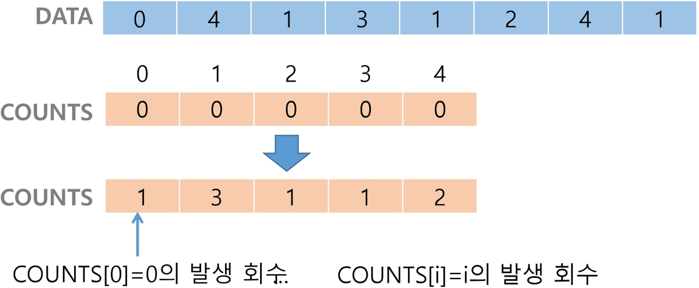
        
    
    - 2단계
        - 정렬된 집합에서 각 항목의 앞에 위치할 항목의 개수를 반영하기 위해 COUNTS의 원소를 조정
        
        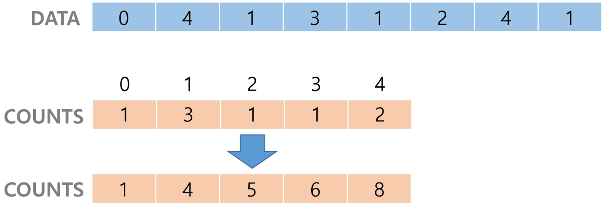
        
    
    - 3단계
        - COUNTS[1]을 감소시키고, TEMP에 1을 삽입
        
        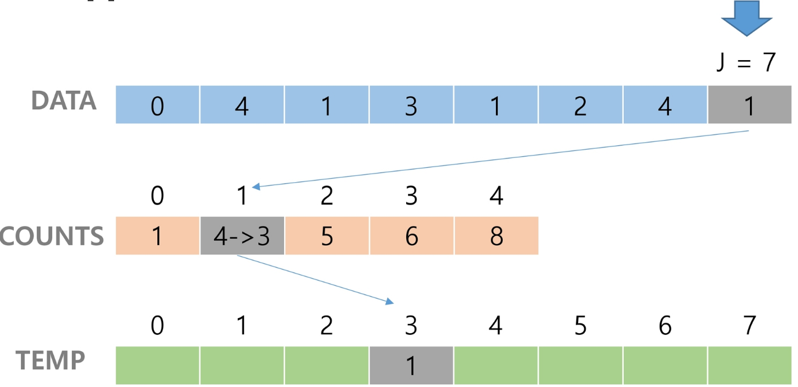
        
        - COUNTS[4]을 감소시키고, TEMP에 4를 삽입
        
        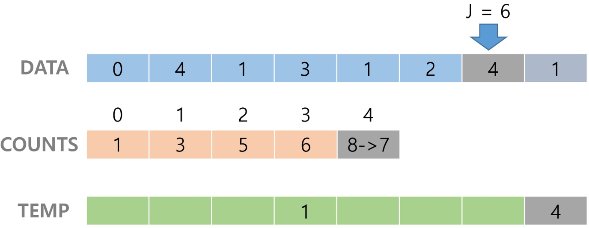
        
        - COUNTS[2]을 감소시키고, TEMP에 2를 삽입
        
        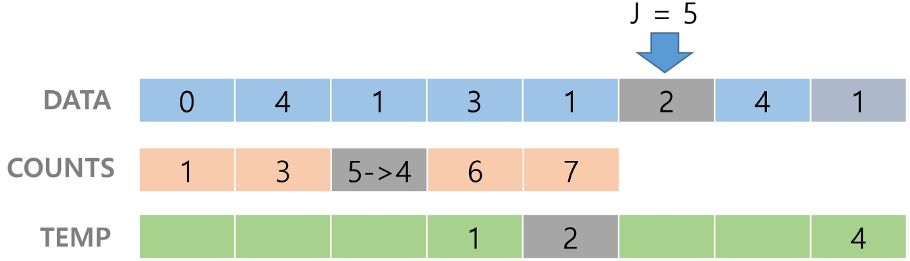
        
        - COUNTS[1]을 감소시키고, TEMP에 1을 삽입
        
        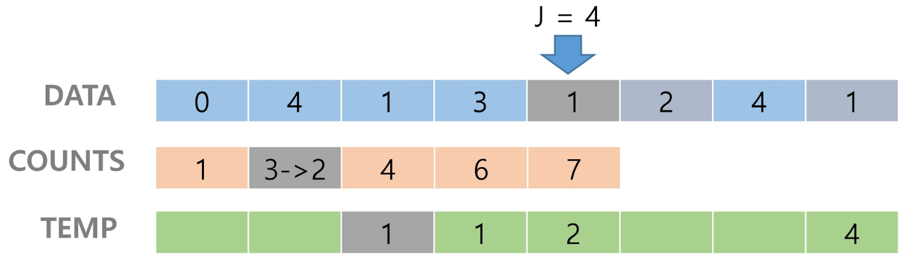
        
        - COUNTS[3]을 감소시키고, TEMP에 3을 삽입
        
        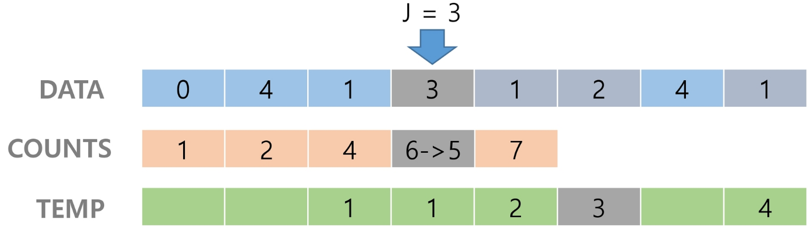
        
        - COUNTS[1]을 감소시키고, TEMP에 1을 삽입
        
        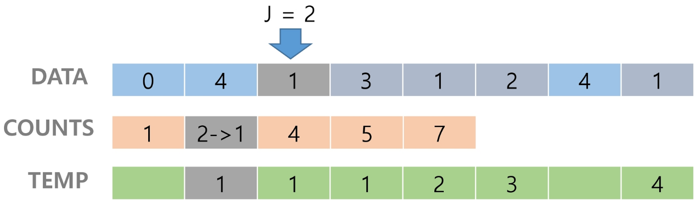
        
        - COUNTS[4]을 감소시키고, TEMP에 4을 삽입
        
        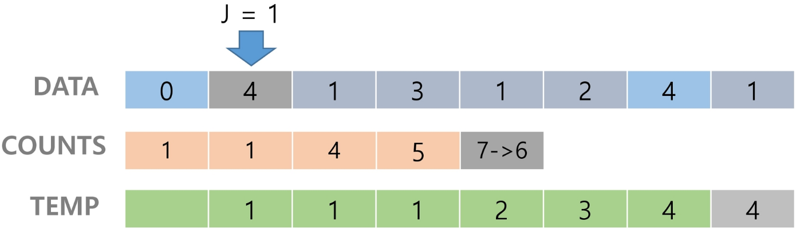
        
        - COUNTS[0]을 감소시키고, TEMP에 0을 삽입
        - TEMP 업데이트를 완료하고 정렬 작업을 종료
        
        
        
        ```python
        def counting_sort(DATA, TEMP, k):
            """
            :param DATA: 입력 배열 (원소는 0 이상 k 이하 정수)
            :param TEMP: 정렬된 배열
            :param k: 입력 배열의 최댓 값
            :param COUNTS: 카운트 배열
            :return: TEMP
            """
        
            COUNTS = [0] * (k + 1)
        
            for i in range(len(DATA)):
                COUNTS[DATA[i]] += 1
        
            for i in range(1, k + 1):
                COUNTS[i] += COUNTS[i - 1]
        
            for i in range(len(DATA) - 1, -1, -1):
                COUNTS[DATA[i]] -= 1
                TEMP[COUNTS[DATA[i]]] = DATA[i]
        
            return TEMP
        
        k = 4
        DATA = [0, 4, 1, 3, 1, 2, 4, 1]
        TEMP = [0] * len(DATA)
        
        sorted_DATA = counting_sort(DATA, TEMP, k)
        print(sorted_DATA)
        ```
        

#### 3. 정렬 알고리즘 비교


---

### 완전 검색

#### 1. 완전 검색

- 완전 검색의 정의
    - 문제의 해법으로 생각할 수 있는 모든 경우의 수를 나열해보고 확인하는 기법
- Brute-force 혹은 Generate-and-test 기법이라고도 불림
- 모든 경우의 수를 테스트한 후, 최종 해법을 도출
- 일반적으로 경우의 수가 상대적으로 작을 때 유용
- 모든 경우의 수를 생성하고 테스트하기 때문에 수행 속도는 느리지만, 해답을 찾아내지 못할 확률이 작음
- 자격검정평가 등에서 주어진 문제를 풀 때, 우선 완전 검색으로 접근하여 해답을 도출한 후, 성능 개선을 위해 다른 알고리즘을 사용하고 해답을 확인하는 것이 바람직함
- Baby-gin Game

```python
# 설명
"""
 - 0 ~ 9 사이의 숫자 카드에서 임의의 카드 6장을 뽑았을 때,
   3장의 카드가 연속적인 번호를 갖는 경우를 run이라 하고,
   3장의 카드가 동일한 번호를 갖는 경우를 triplet이라고 함
 - 6장의 카드가 run과 triplet로만 구성된 경우를 baby-gin으로 부름
 - 6자리의 숫자를 입력 받아 baby-gin 여부를 판단하는 프로그램을 작성하라
"""

# 입력 예
"""
 - 667767은 두 개의 triplet이므로 baby-gin (666, 777)
 - 054060은 한 개의 run과 한 개의 triplet이므로 역시 baby-gin (456, 000)
 - 101123은 한 개의 triplet가 존재하나, 023이 run이 아니므로 baby-gin이 아님
   (123을 run으로 사용하더라도 011 run이나 triplet가 아님)
"""
```

#### 2. 완전 검색을 활용한 Baby-gin 접근

- 고려할 수 있는 모든 경우의 수 생성
    - 6개의 숫자로 만들 수 있는 모든 숫자 나열 (중복 포함)
    - 예
        - 입력으로 [2, 3, 5, 7, 7, 7]을 받았을 경우, 아래와 같이 순열을 생성할 수 있음
        
        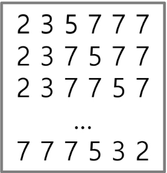
        

- 해답 테스트
    - 앞의 3자리와 뒤의 3자리를 잘라, run와 triplet 여부를 테스트하고 최종적으로 baby-gin을 판단
    - 예
    
    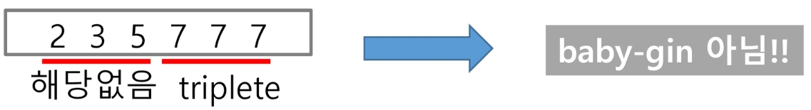
    

#### 3. 순열 (Permutation)

- 서로 다른 것들 중 몇 개를 뽑아서 한 줄로 나열하는 것
- 서로 다른 n개 중 r개를 택하는 순열은 아래와 같이 표현
    - nPr
- 순열의 표현
    - nPr은 다음과 같은 식이 성립
        - nPr = n * (n-1) * (n-2) * … * (n-r+1)
    - nPn = n!이라고 표기하며 Factorial이라 부름
        - n! = n * (n-1) * (n-2) * … * 2 * 1
- 순열의 예
    - {1, 2, 3}을 포함하는 모든 순열을 생성하는 함수
        - 동일한 숫자가 포함되지 않았을 때, 각 자리 수 별로 loop을 이용해 아래와 같이 구현할 수 있음
        
        ```python
        # 배열 아님
        for i1 in range(1, 4):
            for i2 in range(1, 4):
                if i2 != i1:
                    for i3 in range(1, 4):
                        if i3 != i1 and i3 != i2:
                            print(i1, i2, i3)
                            
        # 배열
        # arr = [[2, 3, 7], [2, 7, 3], ...] 미리 순열 배열을 만들어놓는 것도 좋은 아이디어
        arr = [2, 3, 7]
        for i1 in range(3):
            for i2 in range(3):
                if i2 != i1:
                    for i3 in range(3):
                        if i3 != i1 and i3 != i2:
                            print(arr[i1], arr[i2], arr[i3])
        ```
        

---

### 탐욕 알고리즘

#### 1. 탐욕 알고리즘 (Greedy)

- 탐욕 알고리즘의 정의
    - 최적해를 구하는 데 사용되는 근시안적인 방법
- 여러 경우 중 하나를 결정해야 할 때마다, 그 순간에 최적이라고 생각되는 것을 선택해 나가는 방식으로 진행하여 최종적인 해답에 도달
- 각 선택의 시점에서 이루어지는 결정은 지역적으로는 최적이지만, 그 선택들을 계속 수집하여 최종적인 해답을 만들었다고 하여, 그것이 최적이라는 보장은 없음
- 일반적으로, 머릿속에 떠오르는 생각을 검증 없이 바로 구현하면 Greedy 접근이 됨

#### 2. 탐욕 알고리즘의 동작 과정

1. 해 선택
    1. 현재 상태에서 부분 문제의 최적 해를 구한 뒤, 이를 부분해 집합(Solution Set)에 추가
2. 실행 가능성 검사
    1. 새로운 부분해 집합이 실행 가능한지를 확인
    2. 문제의 제약 조건을 위반하지 않는지를 검사
3. 해 검사
    1. 새로운 부분해 집합이 문제의 해가 되는지를 확인
    2. 아직 전체 문제의 해가 완성되지 않았다면, ‘해 선택’부터 다시 시작

#### 3. 탐욕 알고리즘의 예

- 거스름돈 줄이기
    - “어떻게 하면 손님에게 거스름돈으로 주는 지폐와 동전의 개수를 최소한으로 줄일 수 있을까?”
        1. 해 선택
            1. 여기에서는 멀리 내다볼 것 없이 가장 좋은 해를 선택
            2. 단위가 큰 동전으로만 거스름돈을 만들면 동전의 개수가 줄어들므로 현재 고를 수 있는 가장 단위가 큰 동전을 하나 골라 거스름돈에 추가
        2. 실행 가능성 검사
            1. 거스름돈이 손님에게 내드려야 할 액수를 초과하는지 확인
            2. 초과한다면 마지막에 추가한 동전을 거스름돈에서 빼고, ‘해 선택’으로 돌아가서 현재보다 한 단계 작은 단위의 동전을 추가
        3. 해 검사
            1. 거스름돈 문제의 해는 당연히 거스름돈이 손님에게 내드려야 하는 액수와 일치하는 셈
            2. 더 드려도, 덜 드려도 안 되기 때문에 거스름돈을 확인해서 액수가 모자라면 다시 ‘해 선택’으로 돌아가서 거스름돈에 추가할 동전을 선택

#### 4. Baby-gin의 다른 풀이

- 6개의 숫자는 6자리의 정수 값으로 입력됨
- counts 배열의 각 원소를 체크하여 run과 triplet 및 baby-gin 여부를 판단
- 풀이 예
    - 444345
    
    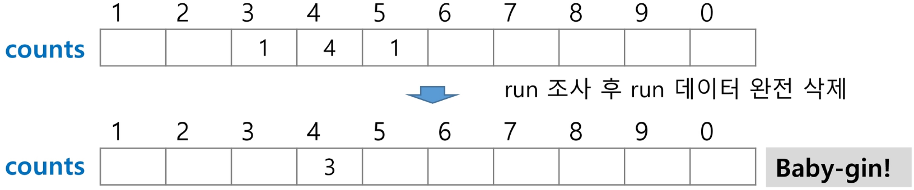
    
    - 333456
    
    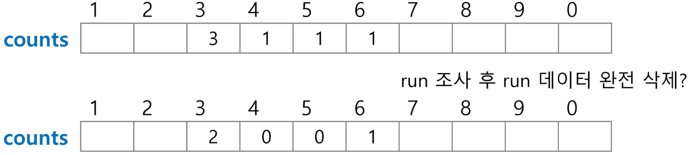
    
    - 444456
    
    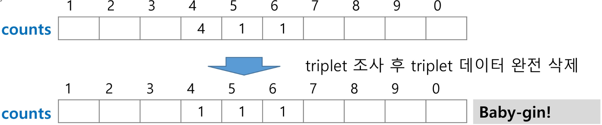
    
    ```python
    num = 456789 # Baby Gin 확인할 6자리 수
    c = [0] * 12 # 6자리 수로부터 각 자리 수를 추출하여 개수를 누적할 리스트
    
    for i in range(6):
        c[num % 10] += 1
        num //= 10
    
    i = 0
    tri = run = 0
    while i < 10:
        if c[i] >= 3: # triplet 조사 후 데이터 삭제
            c[i] -= 3
            tri += 1
            continue
        if c[i] >= 1 and c[i + 1] >= 1 and c[i + 2] >= 1: # run 조사 후 데이터 삭제
            c[i] -= 1
            c[i + 1] -= 1
            c[i + 2] -= 1
            run += 1
            continue
        i += 1
    
    if run + tri == 2:
        print("Baby Gin")
    else:
        print("Lose")
    ```
    

#### 5. 자주 등장하는 오답

- 입력 받은 숫자를 정렬한 후, 앞뒤 3자리씩 끊어서 run 및 triplet을 확인하는 방법을 고려할 수도 있음
    - 예
        - [6, 4, 4, 5, 4, 4]
            - 정렬하여 [4, 4, 4, 4, 5, 6]을 얻어내면 쉽게 baby-gin을 확인할 수 있음
        - [1, 2, 3, 1, 2, 3]
            - 정렬하면 [1, 1, 2, 2, 3, 3]로서, 오히려 baby-gin 확인을 실패할 수 있음
- 위의 예처럼, 탐욕 알고리즘적인 접근은 해답을 찾아내지 못하는 경우도 있으니 유의해야 함
