## Stack 1 (2025.02.14)

### Memoization

#### 1. Memoization

- 앞의 예에서 피보나치 수를 구하는 함수를 재귀 함수로 구현한 알고리즘은 “엄청난 중복 호출이 존재한다”는 문제점이 있음
- 메모이제이션은 컴퓨터 프로그램을 실행할 때, 이전에 계산한 값을 메모리에 저장해서 매번 다시 계산하지 않도록 하여 전체적인 실행속도를 빠르게 하는 기술
- 동적 계획법의 핵심이 되는 기술
- 메모이제이션은 글자 그대로 해석하면 ‘메모리에 넣기(to put in memory)’라는 의미이며 ‘기억되어야 할 것’이라는 뜻의 라틴어 memorandum에서 파생됨
- 흔히 ‘기억하기’, ‘암기하기’라는 뜻의 memorization과 혼동하지만 정확한 단어는 memoization이고, 동사형은 memoize임
- 앞의 예에서 피보나치 수를 구하는 알고리즘에서 fino(n)의 값을 계산하자마자 저장하면(memoize), 실행시간을 Θ(n)으로 줄일 수 있음

#### 2. 피보나치 수열의 Call Tree

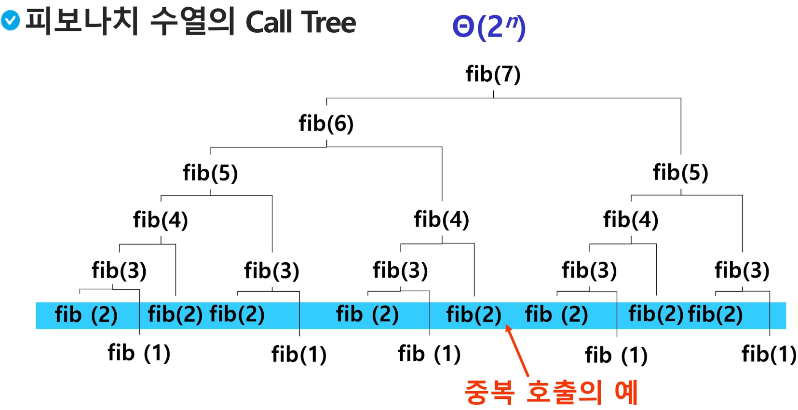

#### 3. Memoization 방법을 적용한 알고리즘

```python
# memo를 위한 배열을 할당하고, 모두 0으로 초기화
# memo[0]을 0으로 memo[1]는 1로 초기화
def fibo1(n):
    global cnt
    cnt += 1
    if n >= 2 and memo[n] == 0:
        memo[n] = fibo1(n - 1) + fibo1(n - 2)
    return memo[n]

n = 10
cnt = 0
memo = [0] * (n + 1)
memo[0] = 0
memo[1] = 1
print(fibo1(n), cnt) # 55 19
```

---

### DP

#### 1. DP (Dynamic Programming)

- 동적 계획 (Dynamic Programming) 알고리즘은 그리디 알고리즘과 같이 최적화 문제를 해결하는 알고리즘
- 동적 계획 알고리즘은 먼저 입력 크기가 작은 부분 문제들을 모두 해결한 후에 그 해들을 이용하여 보다 큰 크기의 부분 문제들을 해결하여, 최종적으로 원래 주어진 입력의 문제를 해결하는 알고리즘

#### 2. 피보나치 수 DP 적용

- 피보나치 수는 부분 문제의 답으로부터 본 문제의 답을 얻을 수 있으므로 최적 부분 구조로 이루어져 있음
- DP 적용 순서
    1. 문제를 부분 문제로 분할 (최적 부분 구조로 분할)
        1. Fibonacci(n) 함수는 Fibonacci(n - 1)과 Fibonacci(n - 2)의 합
        2. Fibonacci(n - 1)은 Fibonacci(n - 2)와 Fibonacci(n - 3)의 합
        3. Fibonacci(2)는 Fibonacci(1)과 Fibonacci(0)의 합
        4. Fibonacci(n)은 Fibonacci(n - 1), Fibonacci(n -2), … Fibonacci(2), Fibonacci(1), Fibonacci(0)의 부분집합으로 나뉨
    2. 부분 문제로 나누는 일을 끝냈으면 가장 작은 부분 문제부터 해를 구함
    3. 그 결과는 테이블에 저장하고, 테이블에 저장된 부분 문제의 해를 이용하여 상위 문제의 해를 구함
    
    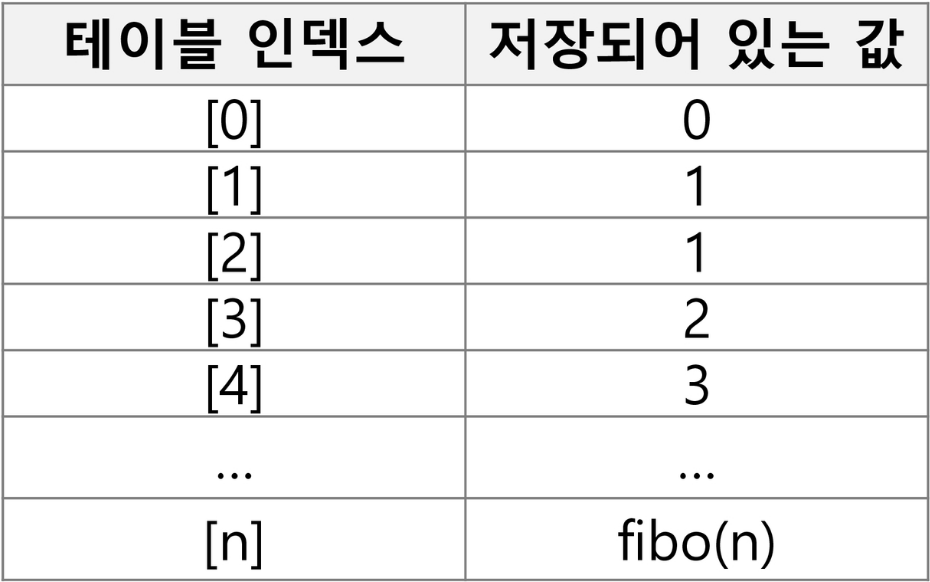
    

#### 3. 피보나치 수 DP 적용 알고리즘

```python
def fibo2(n):
    f = [0] * (n + 1)
    f[0] = 0
    f[1] = 1
    for i in range(2, n + 1):
        f[i] = f[i - 1] + f[i - 2]
    return f[n]

n = 10
print(fibo2(n))
```

#### 4. DP의 구현 방식

- 구현 방식의 종류
    - recursive 방식: fib1()
    - iterative 방식: fib2()
- memoization을 재귀적 구조에 사용하는 것보다 반복적 구조로 DP를 구현한 것이 성능 면에서 보다 효율적
- 재귀적 구조는 내부에 시스템 호출 스택을 사용하는 오버헤드가 발생하기 때문

---

### DFS

#### 1. DFS (깊이 우선 탐색)

- 비선형구조인 그래프 구조는 그래프로 표현된 모든 자료를 빠짐 없이 검색하는 것이 중요
    - 비선형구조 탐색 방법 두 가지 방법
        - 깊이 우선 탐색 (Depth First Search, DFS)
        - 너비 우선 탐색 (Breadth First Search, BFS)
- 시작 정점의 한 방향으로 갈 수 있는 경로가 있는 곳까지 깊이 탐색해 가다가 더 이상 갈 곳이 없게 되면, 가장 마지막에 만났던 갈림길 간선이 있는 정점으로 되돌아와서 다른 방향의 정점으로 탐색을 계속 반복하여 결국 모든 정점을 방문하는 순회 방법
- 가장 마지막에 만났던 갈림길의 정점으로 되돌아가서 다시 깊이 우선 탐색을 반복해야 하므로 후입 선출 구조의 스택 사용

#### 2. DFS 적용 순서

1. 시작 정점 v를 결정하여 방문
2. 정점 v에 인접한 정점 중에서
    1. 방문하지 않은 정점 w가 있으면, 정점 v를 스택에 push하고 정점 w를 방문
        1. 그리고 w를 v로 하여 다시 1.를 반복
        2. 방문하지 않은 정점이 없으면, 탐색의 방향을 바꾸기 위해서 스택을 pop하여 받은 가장 마지막 방문 정점을 v로 하여 다시 2.를 반복
3. 스택이 공백이 될 때까지 2.를 반복

#### 3. DFS 예시 1

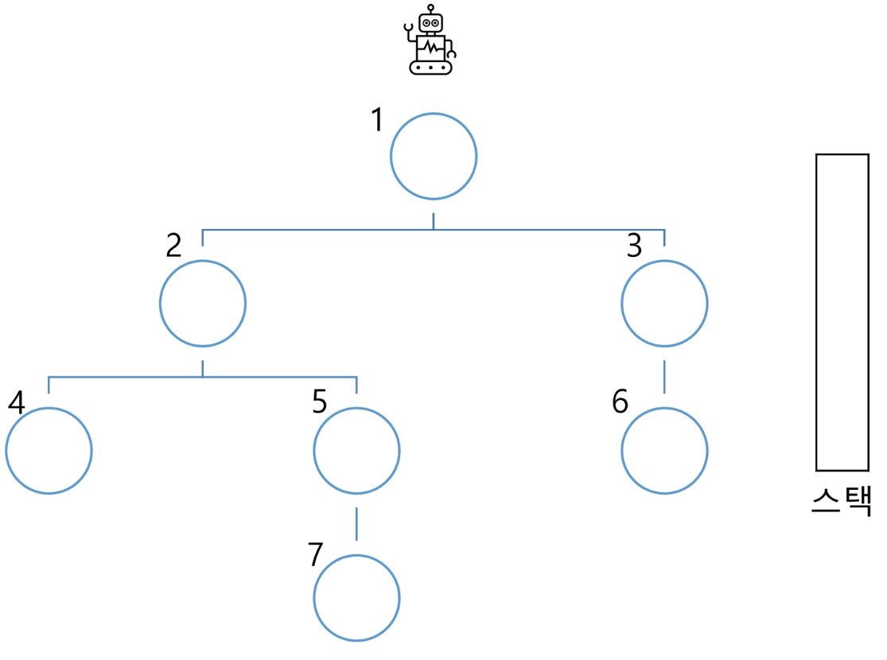

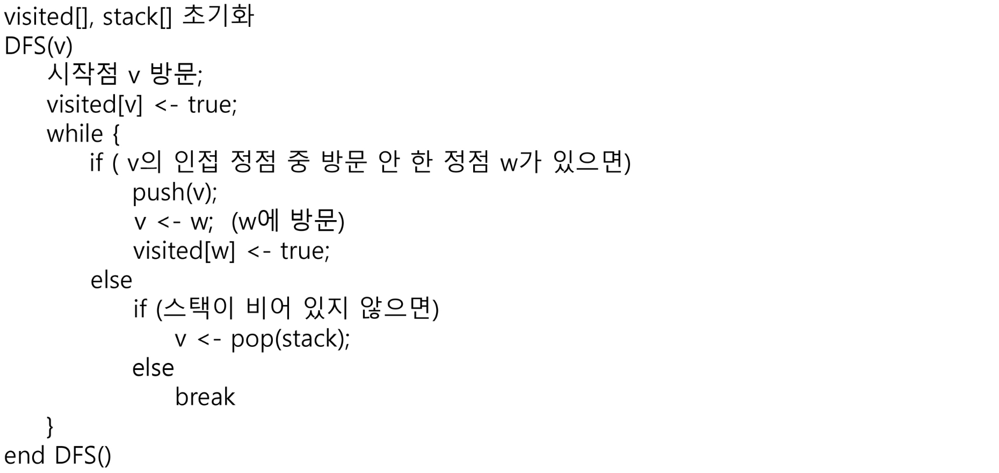

#### 4. DFS 예시 2

- 초기 상태
    - visited를 False로 초기화하고, 공백 스택을 생성
    
    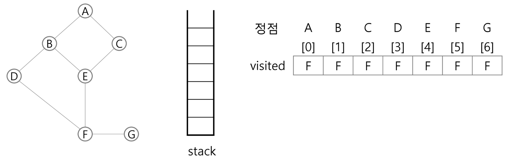
    

1. 정점 A를 시작으로 깊이 우선 탐색을 시작

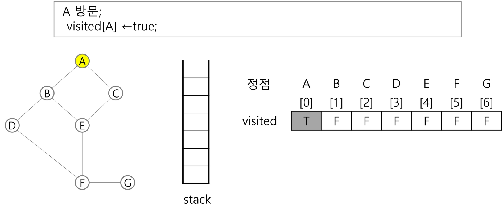

2. 정점 A에 방문하지 않은 정점 B, C가 있으므로 A를 스택에 push하고, 인접정점 B와 C 중에서 오름차순에 따라 B를 선택하여 탐색을 계속함

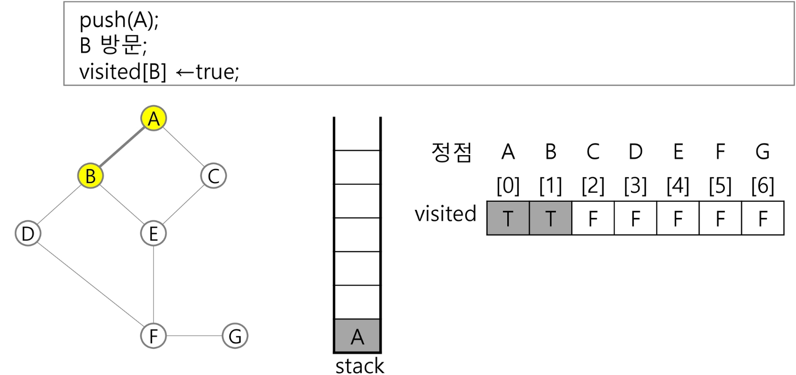

3. 정점 B에 방문하지 않은 정점 D, E가 있으므로 B를 스택에 push하고, 인접정점 D와 E 중에서 오름차순에 따라 D를 선택하여 탐색을 계속함

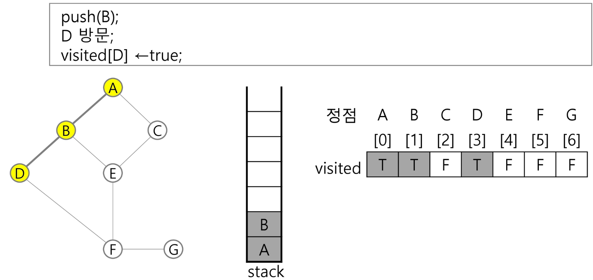

4. 정점 D에 방문하지 않은 정점 F가 있으므로 D를 스택에 push하고, 인접정점 F를 선택하여 탐색을 계속함

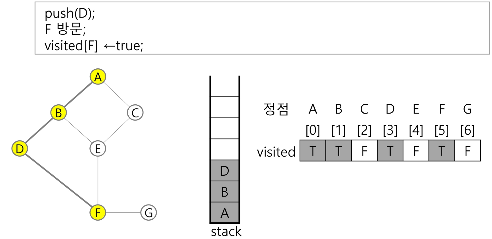

5. 정점 F에 방문하지 않은 정점 E, G가 있으므로 F를 스택에 push하고, 인접정점 E와 G 중에서 오름차순에 따라 E를 선택하여 탐색을 계속함

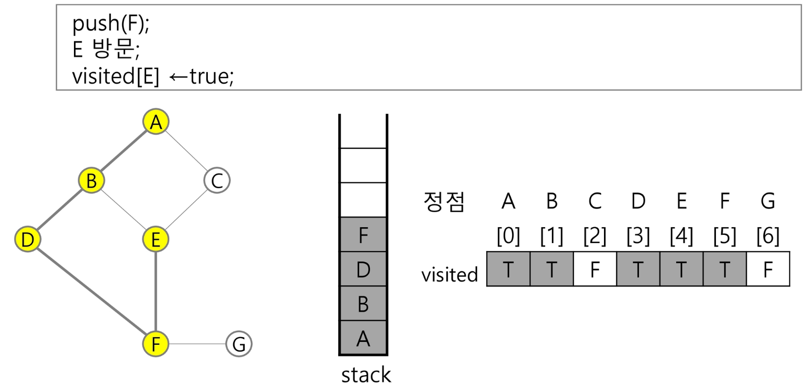

6. 정점 E에 방문하지 않은 정점 C가 있으므로 E를 스택에 push하고, 인접정점 C를 선택하여 탐색을 계속함

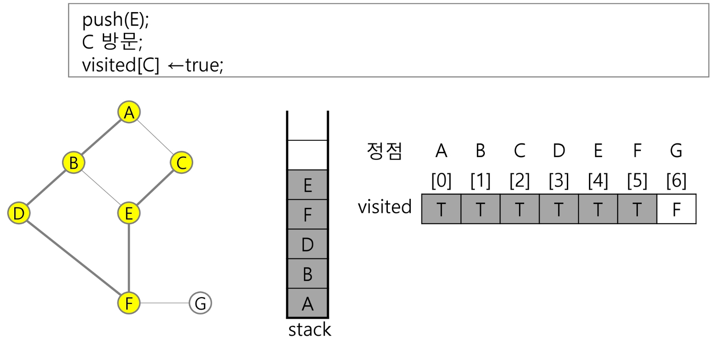

7. 정점 C에서 방문하지 않은 인접정점이 없으므로, 마지막 정점으로 돌아가기 위해 스택을 pop하여 받은 정점 E에 대해서 방문하지 않은 인접정점이 있는지 확인

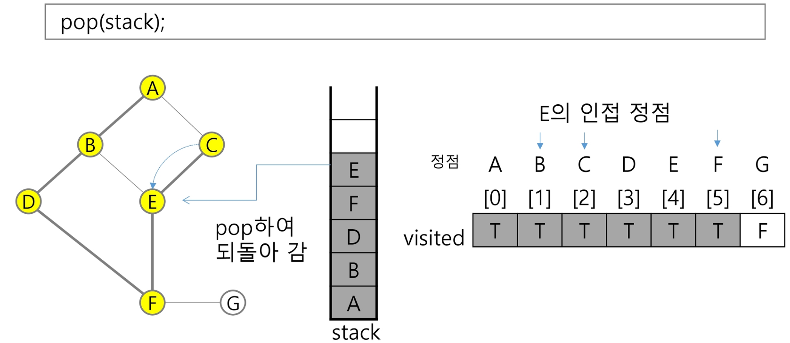

8. 정점 E는 방문하지 않은 인접정점이 없으므로, 다시 스택을 pop하여 받은 정점 F에 대해서 방문하지 않은 인접정점이 있는지 확인

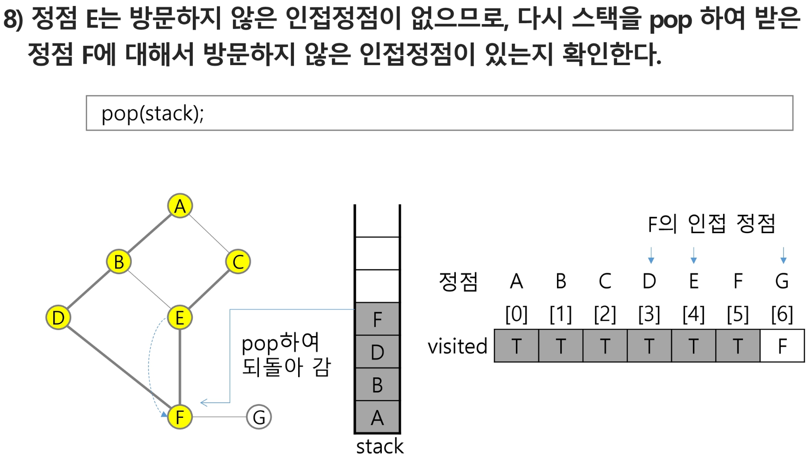

9. 정점 F에 방문하지 않은 정점 G가 있으므로 F를 스택에 push하고, 인접정점 G를 선택하여 탐색을 계속함

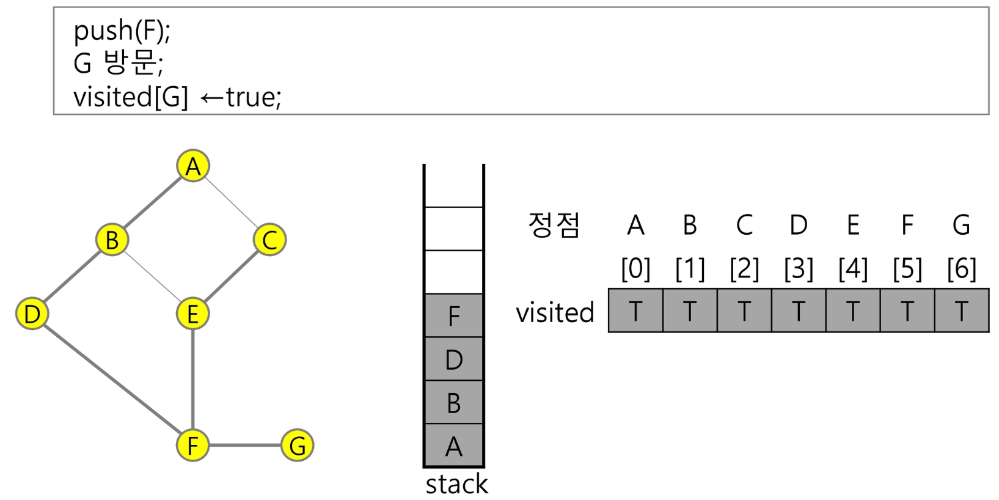

10. 정점 G에서 방문하지 않은 인접정점이 없으므로, 마지막 정점으로 돌아가기 위해 스택을 pop하여 받은 정점 F에 대해서 방문하지 않은 인접정점이 있는지 확인

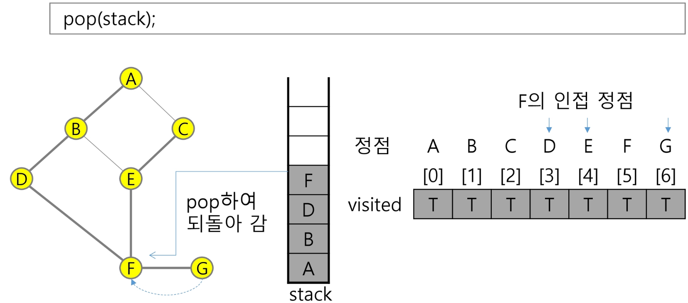

11. 정점 F에서 방문하지 않은 인접정점이 없으므로, 다시 마지막 정점으로 돌아가기 위해 스택을 pop하여 받은 정점 D에 대해서 방문하지 않은 인접정점이 있는지 확인

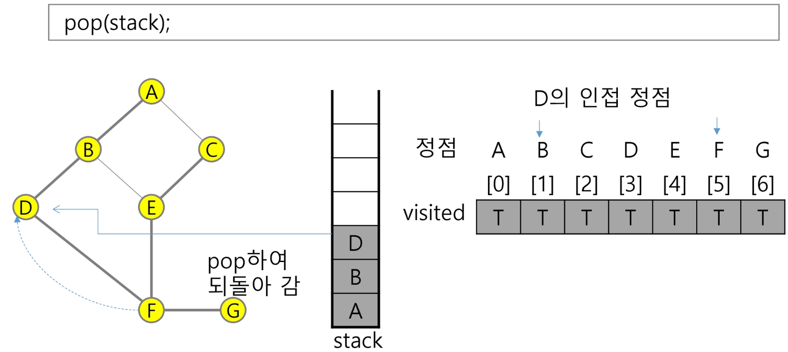

12. 정점 D에서 방문하지 않은 인접정점이 없으므로, 다시 마지막 정점으로 돌아가기 위해 스택을 pop하여 받은 정점 B에 대해서 방문하지 않은 인접정점이 있는지 확인

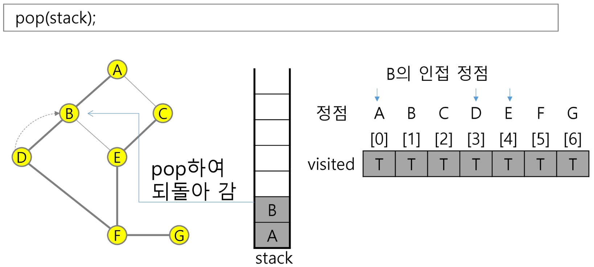

13. 정점 B에서 방문하지 않은 인접정점이 없으므로, 다시 마지막 정점으로 돌아가기 위해 스택을 pop하여 받은 정점 A에 대해서 방문하지 않은 인접정점이 있는지 확인

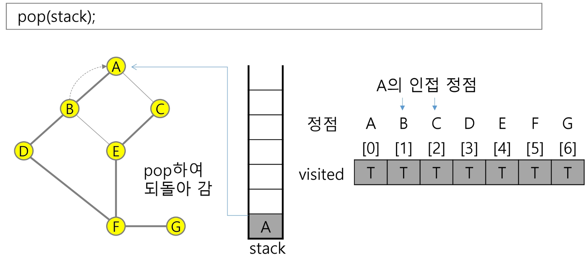

---

### 연습문제

#### 1. 연습문제

- 다음은 연결되어 있는 두 개의 정점 사이의 간선을 순서대로 나열해 놓은 것이다.
- 모든 정점을 깊이 우선 탐색하여 화면에 깊이 우선 탐색 경로를 출력하시오.
- 시작 정점을 1로 시작하시오.

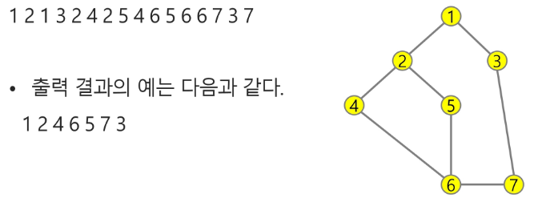

```python
# 입력
"""
7 8
1 2 1 3 2 4 2 5 4 6 5 6 6 7 3 7
"""

# v: 출발, N: 마지막 정점
def dfs(v, N):
    # 방문 표시
    visited = [0] * (N + 1)
    # 스택
    stack = []

    while True:
        # 첫 방문이면
        if visited[v] == 0:
            visited[v] = 1
            print(v)
        # v에 인접하고 방문 안 한 w가 있으면
        for w in adj_list[v]:
            if visited[w] == 0:
                # 현재 정점 push
                stack.append(v)
                # w로 이동
                v = w
                break
        # 더 이상 갈 곳이 없는 경우
        else:
            if stack:
                v = stack.pop()
            # 스택이 비어 있으면
            else:
                break

V, E = map(int, input().split())
graph = list(map(int, input().split()))
adj_list = [[] for _ in range(V + 1)]
for i in range(E):
    v, w = graph[i*2], graph[i*2 + 1]
    adj_list[v].append(w)
    adj_list[w].append(v)
dfs(1, V)
```
