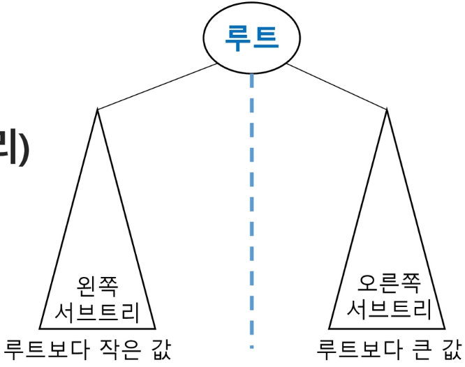
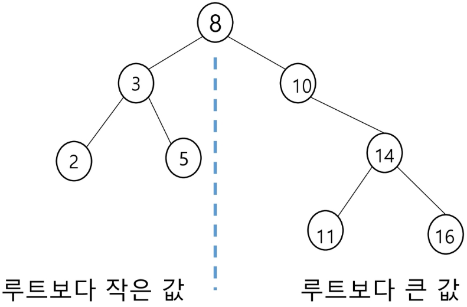
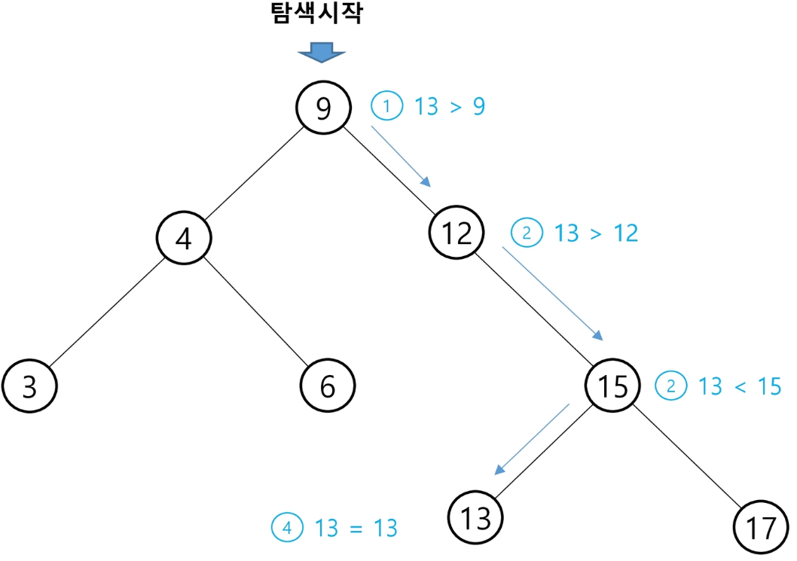
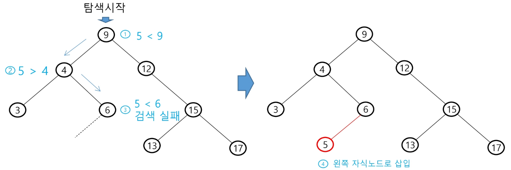
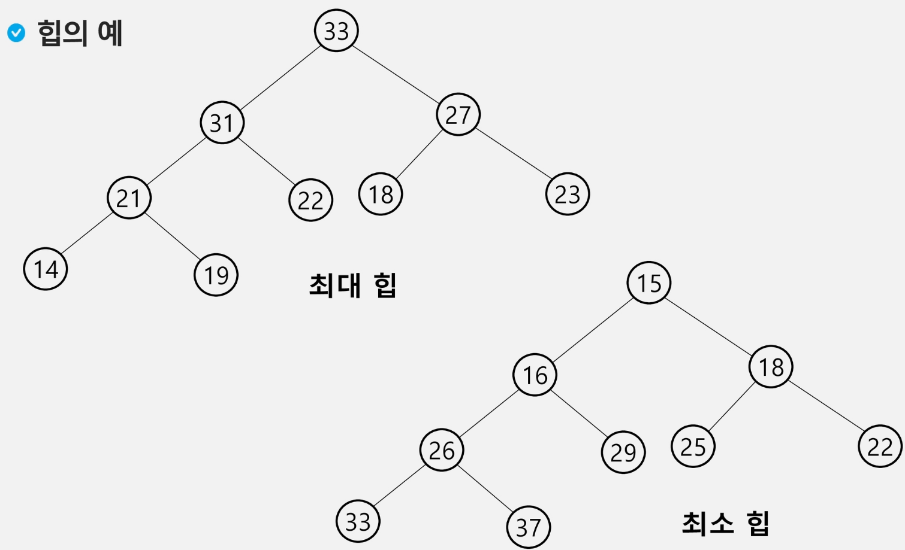
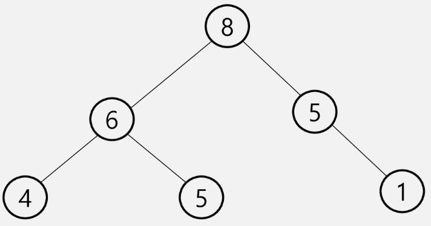
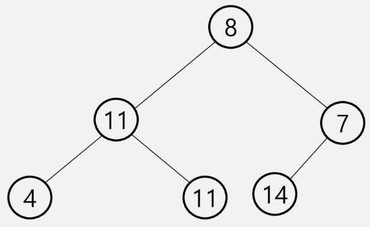
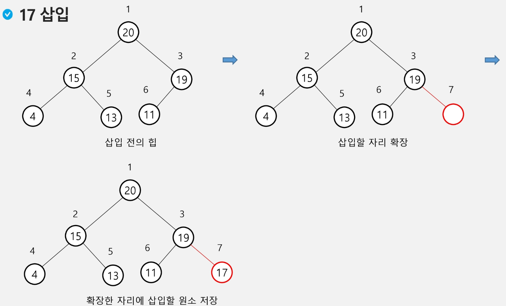
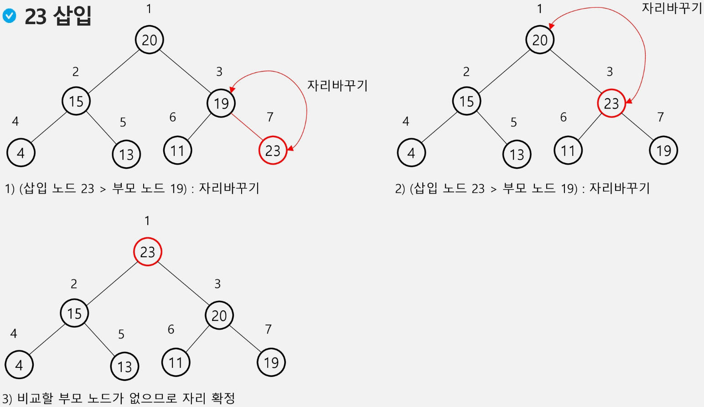
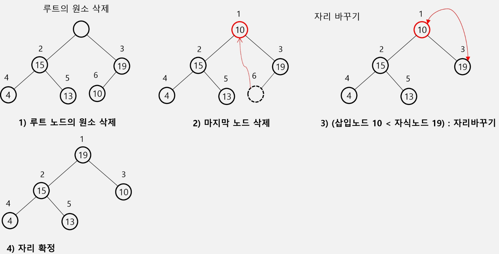

## Tree 1 (2025.03.05)

### 연습문제

- 첫 줄에는 트리의 정점의 총 수 V가 주어진다.
- 그 다음 줄에는 V - 1개 간선이 나열된다.
- 간선은 그것을 이루는 두 정점으로 표기된다.
- 간선은 항상 “부모 자식” 순서로 표기된다.
- 아래 예에서 두 번째 줄 처음 1과 2는 정점 1과 2를 잇는 간선을 의미하며 1이 부모, 2가 자식을 의미한다.
- 간선은 부모 정점 번호가 작은 것부터 나열되고, 부모 정점이 동일하다면 자식 정점 번호가 작은 것부터 나열된다.
- 다음 이진 트리 표현에 대하여 전위 순회하여 정점의 번호를 출력하시오.
    - 정점의 개수
        - 13
    - 입력
        - 1 2 1 3 2 4 3 5 3 6 4 7 5 8 5 9 6 10 6 11 7 12 11 13
        
        ```python
        # 입력
        """
        13
        1 2 1 3 2 4 3 5 3 6 4 7 5 8 5 9 6 10 6 11 7 12 11 13
        """
        
        # 전위 순회, 방문한 정점(부모) 먼저 처리
        def pre_order(T):
            # 0이 아니면 (존재하는 정점이면)
            if T:
                # visit(T) T에서 할 일 처리
                print(T)
                # 왼쪽 자식(서브트리)로 이동
                pre_order(left[T])
                # 오른쪽 자식(서브트리)로 이동
                pre_order(right[T])
        
        # 중위 순회, 방문한 정점(부모) 중간에 처리
        def in_order(T):
            # 0이 아니면 (존재하는 정점이면)
            if T:
                # 왼쪽 자식(서브트리)로 이동
                in_order(left[T])
                # visit(T) T에서 할 일 처리
                print(T)
                # 오른쪽 자식(서브트리)로 이동
                in_order(right[T])
        
        # 후위 순회, 방문한 정점(부모) 마지막에 처리
        def post_order(T):
            # 0이 아니면 (존재하는 정점이면)
            if T:
                # 왼쪽 자식(서브트리)로 이동
                post_order(left[T])
                # 오른쪽 자식(서브트리)로 이동
                post_order(right[T])
                # visit(T) T에서 할 일 처리
                print(T)
        
        # 1번부터 N번까지인 정점
        N = int(input())
        # 간선 수
        E = N - 1
        arr = list(map(int, input().split()))
        # 부모를 인덱스로 왼쪽 자식 저장
        left = [0] * (N + 1)
        # 부모를 인덱스로 오른쪽 자식 저장
        right = [0] * (N + 1)
        # 자식을 인덱스로 부모 저장
        par = [0] * (N + 1)
        for i in range(E):
            p, c = arr[i*2], arr[i*2 + 1]
            # 자식을 인덱스로 부모 저장
            par[c] = p
        # for i in range(0, E * 2, 2):
        #     p, c = arr[i], arr[i + 1]
            # 왼쪽 자식이 아직 없으면
            if left[p] == 0:
                left[p] = c
            # 왼쪽 자식이 있는 경우
            else:
                right[p] = c
        print(left)
        print(right)
        root = 1
        for i in range(1, N + 1):
            # 부모 정점이 없으면 루트
            if par[i] == 0:
                root = i
                # for i in range(1, N + 1)
                break
        # root부터 전위 순회
        pre_order(root)
        ```
        

---

### 이진 탐색 트리

#### 1. 이진 탐색 트리 (BST, Binary Search Tree)

- 탐색 작업을 효율적으로 하기 위한 자료 구조
- 모든 원소는 서로 다른 유일한 키를 가짐
- key(왼쪽 서브트리) < key(루트 노드) < key(오른쪽 서브트리)
- 왼쪽 서브트리와 오른쪽 서브트리도 이진 탐색 트리임
- 중위 순회하면 오름차순으로 정렬된 값을 얻을 수 있음





#### 2. 이진 탐색 트리 - 연산

- 탐색 연산
    - 루트에서 시작
    - 탐색할 키 값 x를 루트 노드의 키 값과 비교
        1. (키 값 x = 루트 노드의 키 값)인 경우
            1. 원하는 원소를 찾았으므로 탐색 연산 성공
        2. (키 값 x < 루트 노드의 키 값)인 경우
            1. 루트 노드의 왼쪽 서브트리에 대해서 탐색 연산 수행
        3. (키 값 x > 루트 노드의 키 값)인 경우
            1. 루트 노드의 오른쪽 서브트리에 대해서 탐색 연산 수행
- 서브트리에 대해서 순환적으로 탐색 연산을 반복

#### 3. 탐색 연산

- 13 탐색



#### 4. 삽입 연산

1. 먼저 탐색 연산을 수행
    1. 삽입할 원소와 같은 원소가 트리에 있으면 삽입할 수 없으므로, 같은 원소가 트리에 있는지 탐색하여 확
2. 탐색 실패한 위치에 원소를 삽입
    1. 다음 예는 5을 삽입
    
    
    

#### 5. 이진 탐색 트리 - 성능

- 탐색(Searching), 삽입(Insertion), 삭제(Deletion) 시간은 트리의 높이 만큼 시간이 걸림
    - O(h)
    - h: BST의 깊이 (height)
- 평균의 경우
    - 이진 트리가 균형적으로 생성되어 있는 경우
    - O(log n)
- 최악의 경우
    - 한쪽으로 치우친 경사 이진 트리의 경우
    - O(n)
    - 순차 탐색과 시간 복잡도가 같음
- 검색 알고리즘의 비교
    1. 배열에서의 순차 검색
        1. O(N)
    2. 정렬된 배열에서의 순차 검색
        1. O(N)
    3. 정렬된 배열에서의 이진 탐색
        1. O(log N)
        2. 고정 배열 크기와 삽입, 삭제 시 추가 연산 필요
    4. 이진 탐색 트리에서의 평균
        1. O(log N)
        2. 최악의 경우
            1. O(N)
        3. 완전 이진 트리 또는 균형 트리로 바꿀 수 있다면 최악의 경우를 없앨 수 있음
            1. 새로운 원소를 삽입할 때 삽입 시간을 줄임
            2. 평균과 최악의 시간이 같음
                1. O(log n)
    5. 해쉬 검색
        1. O(1)
        2. 추가 저장 공간이 필요

---

### 힙

#### 1. 힙 (heap)

- 완전 이진 트리에 있는 노드 중에서 키 값이 가장 큰 노드나 키 값이 가장 작은 노드를 찾기 위해서 만든 자료 구조
- 힙의 키를 우선 순위를 활용하여 우선 순위 큐를 구현할 수 있음
- 최대 힙 (max heap)
    - 키 값이 가장 큰 노드를 찾기 위한 완전 이진 트리
    - {부모 노드의 키 값 > 자식 노드의 키 값}
    - 루트 노드
        - 키 값이 가장 큰 노드
- 최소 힙 (min heap)
    - 키 값이 가장 작은 노드를 찾기 위한 완전 이진 트리
    - {부모 노드의 키 값 < 자식 노드의 키 값}
    - 루트 노드
        - 키 값이 가장 작은 노드

#### 2. 힙의 예



```python
# 완전 이진 트리의 전위 순회
def pre_order(n):
    # if T: (실존하는 정점이면)
    if n <= N:
        # visit(T)
        print(n)
        # pre_order(left[T])
        pre_order(n * 2)
        # pre_order(right[T])
        pre_order(n*2 + 1)

# 완전 이진 트리 정점 수
N = 9
tree = [0, 33, 31, 27, 21, 22, 18, 23, 14, 19]
pre_order(1)
```

#### 3. 힙이 아닌 이진 트리의 예

- 트리 1
    - 완전 이진 트리가 아니기 때문에 힙이 아님
    - 같은 값의 노드도 문제긴 함



- 트리 2
    - 최대 힙 또는 최소 힙 중 어느 조건도 만족하지 않음



#### 4. 힙 연산 - 삽입

- 17 삽입



- 23 삽입



```python
# 최대 힙 (99개의 값 저장가능한)
def enq(n):
    # 마지막 정점
    global last
    last += 1
    # 마지막 정점에 n 저장
    heap[last] = n
    # 부모의 키 값과 비교하기 위해
    c = last
    # 부모 정점 번호 계산
    p = c // 2
    # 부모가 있고, 부모 < 자식 (최대 힙 조건 위반)
    while p != 0 and heap[p] < heap[c]:
        heap[p], heap[c] = heap[c], heap[p]
        # 현재 부모를 자식으로
        c = p
        # 부모의 부모
        p = c // 2

heap = [0] * 100
last = 0
enq(2)
enq(5)
enq(7)
enq(3)
enq(4)
enq(6)
print(heap)
```

#### 5. 힙 연산 - 삭제

- 힙에서는 루트 노드의 원소만을 삭제할 수 있음
- 루트 노드의 원소를 삭제하여 반환
- 힙의 종류에 따라 최대 값 또는 최소 값을 구할 수 있음

#### 6. 힙 연산 - 삭제 예



```python
# 최대 힙 (99개의 값 저장가능한)
def enq(n):
    # 마지막 정점
    global last
    last += 1
    # 마지막 정점에 n 저장
    heap[last] = n
    # 부모의 키 값과 비교하기 위해
    c = last
    # 부모 정점 번호 계산
    p = c // 2
    # 부모가 있고, 부모 < 자식 (최대 힙 조건 위반)
    while p != 0 and heap[p] < heap[c]:
        heap[p], heap[c] = heap[c], heap[p]
        # 현재 부모를 자식으로
        c = p
        # 부모의 부모
        p = c // 2

def deq():
    global last
    # 루트 백업
    tmp = heap[1]
    # 삭제할 노드의 키를 루트에 복사
    heap[1] = heap[last]
    # 마지막 노드 삭제
    last -= 1
    # 루트에 옮긴 값을 자식과 비교
    p = 1
    # 왼쪽 자식
    c = p * 2
    # 자식이 하나라도 있으면
    while c <= last:
        # 오른쪽 자식도 있고, 오른쪽 자식이 더 크면
        if c + 1 <= last and heap[c] < heap[c + 1]:
            # 비교 대상을 오른쪽 자식으로 정함
            c += 1
        # 자식이 더 크면 최대힙 규칙에 어긋나므로
        if heap[p] < heap[c]:
            heap[p], heap[c] = heap[c], heap[p]
            # 자식을 새로운 부모로
            p = c
            # 왼쪽 자식 번호를 계산
            c = p * 2
        # 부모가 더 크면
        else:
            # 비교 중단
            # while c <= last
            break
    return tmp

heap = [0] * 100
last = 0
enq(2)
enq(5)
enq(7)
enq(3)
enq(4)
enq(6)
print(heap)

while last:
    print(deq())
```
