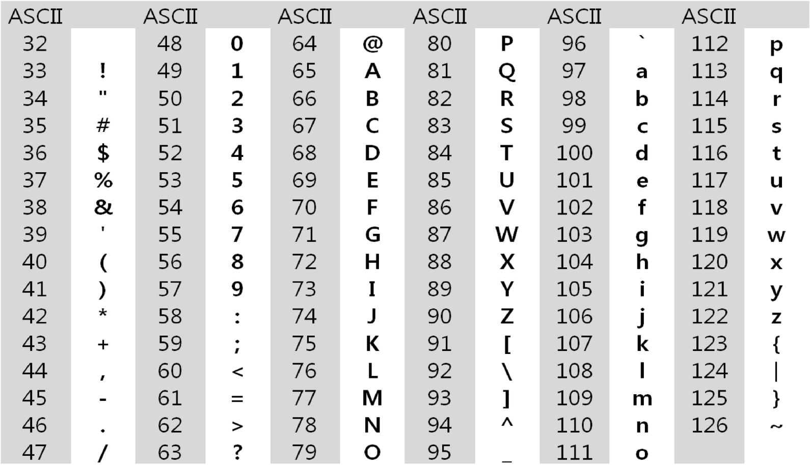
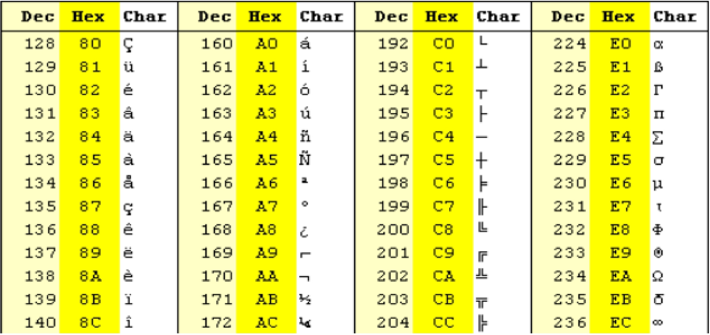
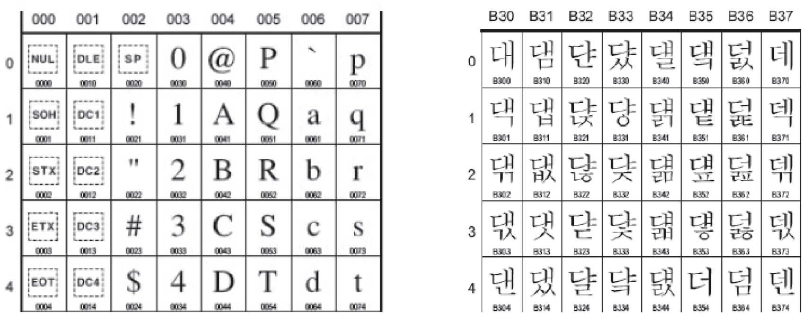
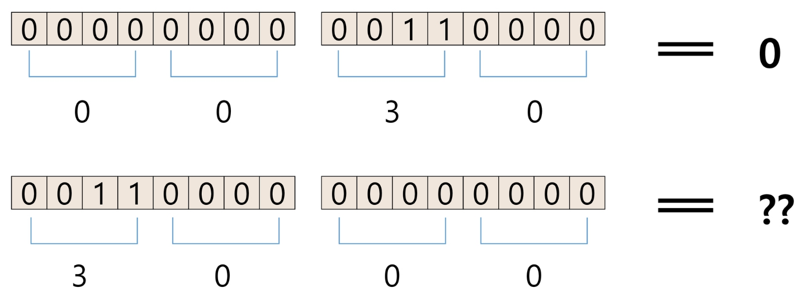
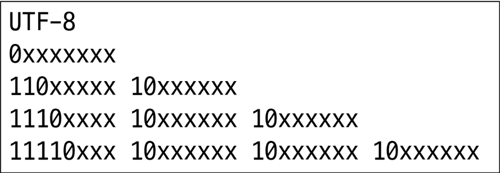
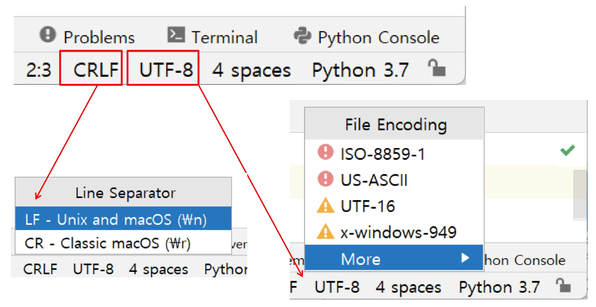
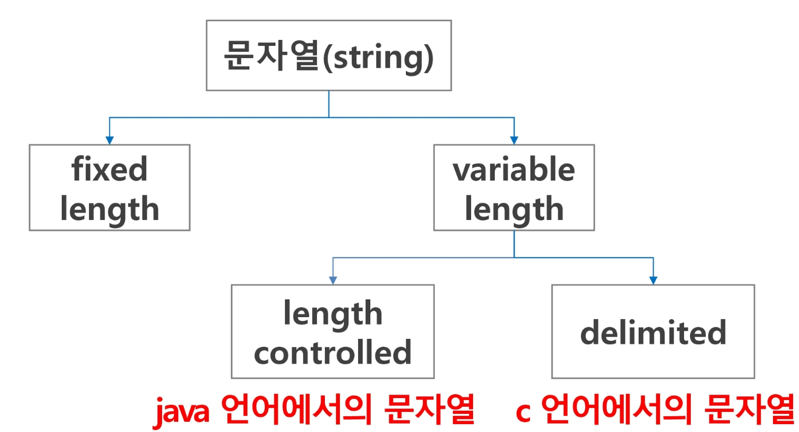
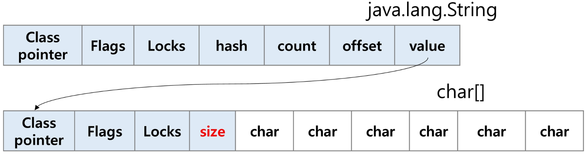
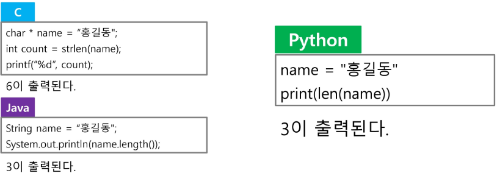
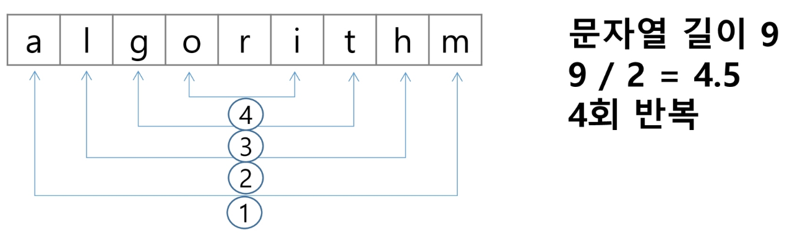

## String 1 (2025.02.11)

### 문자의 표현

#### 1. 컴퓨터에서의 문자 표현

- 글자 A를 메모리에 저장하는 방법에 대해 생각해보자
- 메모리는 숫자만을 저장할 수 있기 때문에 A라는 글자의 모양 그대로 비트맵으로 저장하는 방법을 사용하지 않는 한(이 방법은 메모리 낭비가 심하다) 각 문자에 대해서 대응되는 숫자를 정해 놓고, 이것을 메모리에 저장하는 방법이 사용될 것이다
- 영어가 대소문자 합쳐서 52자이므로 6(64가지)비트면 모두 표현할 수 있다
    - 이를 코드 체계라고 한다
        - 000000 → ‘a’, 000001 → ‘b’

#### 2. 코드 체계

1. 네트워크가 발전되기 전 미국의 각 지역 별로 코드 체계를 정해놓고 사용했음
2. 네트워크(인터넷: 인터넷은 미국에서 발전했다)이 발전하면서 서로 간에 정보를 주고 받을 때, 정보를 달리 해석한다는 문제가 생겼음


3. 혼동을 피하기 위해 표준안을 만들기로 함
4. 1967년, 미국에서 ASCII(American Standard Code for Information Interchange)라는 문자 인코딩 표준이 제정됨

#### 3. ASCII Code

- ASCII는 7-bit 인코딩으로 128문자를 표현하며 33개의 출력 불가능한 제어 문자들과 공백을 비롯한 95개의 출력 가능한 문자들로 이루어져 있음
- 출력 가능한 아스키 문자 (32 ~ 126)



#### 4. 확장 아스키

- 확장 아스키는 표준 문자 이외의 악센트 문자, 도형 문자, 특수 문자, 특수 기호 등 부가적인 문자를 128개 추가할 수 있게 하는 부호
- 표준 아스키는 7-bit를 사용하여 문자를 표현하는 데 비해, 확장 아스키는 1Byte 내의 8-bit를 모두 사용함으로써 추가적인 문자를 표현할 수 있음
- 컴퓨터 생산자와 소프트웨어 개발자가 여러 가지 다양한 문자에 할당할 수 있도록 하고 있음
    - 이렇게 할당된 확장 부호는 표준 아스키와 같이 서로 다른 프로그램이나 컴퓨터 사이에 교환되지 못함
- 표준 아스키는 마이크로컴퓨터 하드웨어 및 소프트웨어 사이에서 세계적으로 통용되는 데 비해, 확장 아스키는 프로그램이나  컴퓨터 또는 프린터가 그것을 해독할 수 있도록 설계되어 있어야만 올바른 해독될 수 있음
- 확장 아스키 예



#### 5. 유니 코드

- 오늘날 대부분의 컴퓨터는 문자를 읽고 쓰는데 ASCII 형식을 사용
- 컴퓨터가 발전하면서 미국 뿐 아니라 각 나라에서도 컴퓨터가 발전했으며 각 국가들은 자국의 문자를 표현하기 위해서 코드 체계를 만들어서 사용하게 됨
    - 우리나라도 아주 오래된 이야기지만 한글 코드 체계를 만들어서 사용했고, 조합형, 완성형 두 종류를 가지고 있음
- 인터넷이 전 세계로 발전하면서 ASCII를 만들었을 때의 문제와 같은 문제가 국가 간에 정보를 주고 받을 때 발생
- 자국의 코드 체계를 타 국가가 가지고 있지 않으면 정보를 잘못 해석할 수 밖에 없었음
- 그래서 다국어 처리를 위해 표준을 마련했고, 이를 유니 코드라고 함
- 유니 코드의 일부



```python
print(f"{ord('대')}:x") # 45824:x
print(chr(0xb300))      # 대
```

- 유니 코드도 다시 Character Set으로 분류됨
    - UCS-2(Universal Character Set 2)
    - UCS-4(Universal Character Set 4)
    - 유니 코드를 저장하는 변수의 크기를 정의
    - 그러나 바이트 순서에 대해서 표준화하지는 못함
    - 다시 말해 파일을 인식할 때, 이 파일이 UCS-2, UCS-4인지 인식하고 각 경우를 구분해서 모두 다르게 구현해야 하는 문제 발생
    - 그래서 유니 코드의 적당한 외부 인코딩이 필요하게 됨
    - big-endian, little-endian
        - 메모리에 데이터를 저장할 때, 큰 쪽을 앞 주소에 두느냐, 뒷 주소에 두느냐의 차이
        - big-endian
            - 저장할 때 상위 바이트, 즉 큰 쪽을 먼저 저장
        - little-endian
            - 저장할 때 하위 바이트, 즉 작은 쪽을 먼저 저장
        
        
        

#### 6. 유니 코드 인코딩 (UTF: Unicode Transformation Format)

- UTF-8 (in web)
    - MIN: 8bit
    - MAX: 32bit (1Byte * 4)
- UTF-16 (in windows, java)
    - MIN: 16bit
    - MAX: 32bit (2Byte * 2)
- UTF-32 (in unix)
    - MIN: 32bit
    - MAX: 32bit (4Byte * 1)



#### 7. 파이참 설정



#### 8. Python 인코딩

- 2.x 버전 - ASCII → #-*- coding: utf-8 -*- (첫 줄에 명시)
- 3.x 버전 - 유니 코드 UTF-8 → 생략 가능
- 다른 인코딩 방식으로 처리 시 첫 줄에 작성하는 위 항목에 원하는 인코딩 방식을 지정해주면 됨

---

### 문자열

#### 1. 문자열의 분류

- 문자열 (string)
    - fixed length
    - variable length
        - length controlled
            - java 언어에서의 문자열
        - delimited
            - c 언어에서의 문자열
            
            
            

#### 2. 문자열

- java에서 String 클래스에 대한 메모리 배치 예
- 그림에서 보이듯, java.lang.String 클래스에는 기본적인 객체 메타 데이터 외에도 네 가지 필드들이 포함되어 있는데, hash 값(hash), 문자열의 길이(count), 문자열 데이터의 시작점(offset), 그리고 실제 문자열 배열에 대한 참조(value)이다



#### 3. C 언어에서 문자열 처리

- 문자열은 문자들의 배열 형태로 구현된 응용 자료형
- 문자 배열에 문자열을 저장할 때는 항상 마지막에 끝을 표시하는 널문자(’\0’)를 넣어줘야 함

```c
char ary[] = "abc"; // char ary[] = {'a', 'b', 'c', '\0'}
```

- 문자열 처리에 필요한 연산을 함수 형태로 제공

```c
strlen(), strcpy(), strcmp(), ...
```

#### 4. Java에서의 문자열 처리

- 문자열 데이터를 저장, 처리해주는 클래스를 제공
- String 클래스를 사용

```java
String str = "abc"; // 또는 String str = new String("abc")
```

- 문자열 처리에 필요한 연산을 연산자, 메소드 형태로 제공

```java
+
length()
replace()
split()
substring()
// 보다 풍부한 연산을 제공
```

#### 5. Python에서의 문자열 처리

- char 타입 없음
- 텍스트 데이터의 취급 방법이 통일되어 있음
- 문자열 기호
    - ‘: 홑따옴표
    - “: 쌍따옴표
    - ‘’’: 홑따옴표 3개
    - “””: 쌍따옴표 3개
    - +: 연결 (Concatenation)
        - 문자열 + 문자열: 이어 붙여주는 역할
    - *: 반복
        - 문자열 * 수: 수만큼 문자열이 반복
- 문자열은 시퀀스 자료형으로 분류되고, 시퀀스 자료형에서 사용할 수 있는 인덱싱, 슬라이싱 연산들을 사용할 수 있음
- 문자열은 튜플과 같이 요소 값을 변경할 수 없음 (Immutable)
- 문자열 클래스에서 제공되는 메소드

```python
replace()
split()
isalpha()
find()
```

#### 6. C와 Java의 String 처리의 기본적인 차이점

- C는 아스키 코드로 저장
- Java는 유니 코드(UTF-16, 2Byte)로 저장
- 파이썬은 유니 코드(UTF-8)로 저장



#### 7. 문자열 뒤집기

- 자기 문자열에서 뒤집는 방법이 있고, 새로운 빈 문자열을 만들어 소스의 뒤에서부터 읽어서 타겟에 쓰는 방법이 있음
- 자기 문자열을 이용할 경우는 swap을 위한 임시 변수가 필요하며 반복 수행을 문자열 길이의 반만을 수행해야 함



---

### 연산

#### 1. 문자열 비교

- c strcmp() 함수를 제공
- Java에서는 equals() 메소드를 제공
    - 문자열 비교에서 == 연산은 메모리 참조가 같은지를 묻는 것
- 파이썬에서는 == 연산자와 is 연산자를 제공
    - == 연산자는 내부적으로 특수 메서드 __eq__()를 호출

#### 2. 문자열 비교함수 만들기

- 문자열이 같으면 0 리턴
- s1이 s2보다 사전 순서상 앞서면 -1 리턴
- s1이 s2보다 사전 순서상 나중이면 1 리턴

```python
def my_strcmp(s1, s2):
    if s1 < s2:
        return -1
    elif s1 > s2:
        return 1
    else:
        return 0
```

#### 3. 문자열 숫자를 정수로 변환하기

- C 언어에서는 atoi() 함수를 제공
    - 역함수로는 itoa()가 있음
- Java에서는 숫자 클래스의 parse 메소드를 제공
    - 예: Integer.parseInt(String)
    - 역함수로는 toString() 메소드를 제공
- 파이썬에서는 숫자와 문자변환 함수를 제공
    - 예: int(”123”), float(”3.14”), str(123), repr(123), int(’A’, 16)

#### 4. 문자열 숫자를 정수로 변환하기

- int()와 같은 atoi() 함수 만들기

```python
def atoi(s):
    i = 0
    for x in s:
        i = i*10 + ord(x) - ord('0')
    return i
```
