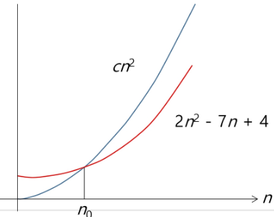
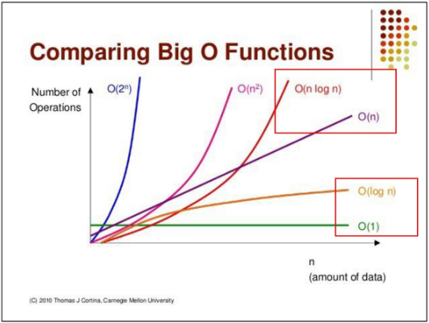
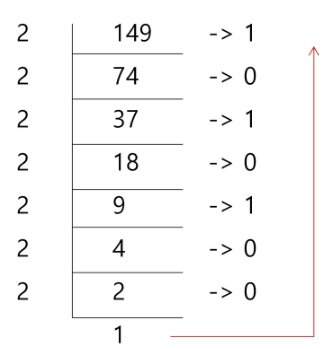
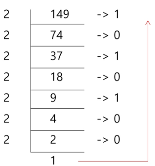
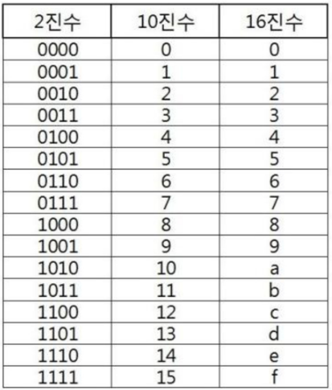

## Start 1 (2025.03.06)

### SW 문제 해결

#### 1. SW 문제 해결 역량이란?

- 프로그램을 하기 위한 많은 제약 조건과 요구사항을 이해하고, 최선의 방법을 찾아내는 능력
- 프로그래머가 사용하는 언어나 라이브러리, 자료 구조, 알고리즘에 대한 지식을 적재적소에 퍼즐을 배치하듯 이들을 연결하여 큰 그림을 만드는 능력이라 할 수 있음
- 문제 해결 역량은 추상적인 기술
    - 프로그래밍 언어, 알고리즘처럼 명확히 정의된 실체가 없음
    - 무작정 알고리즘을 암기하고, 문제를 풀어본다고 향상되지 않음
- 문제 해결 역량을 향상시키기 위해서 훈련이 필요

#### 2. 문제 해결 과정

1. 문제 이해
2. 문제를 익숙한 용어로 재정의
3. 해결방법 계획
4. 계획 검증
5. 구현
6. 개선법 모색

---

### 복잡도 분석

#### 1. 알고리즘이란?

- 유한한 단계를 통해 문제를 해결하기 위한 절차나 방법
- 주로 컴퓨터 용어로 쓰이며, 컴퓨터가 어떤 일을 수행하기 위한 단계적 방법을 말함
- 다시 말해서, 어떠한 문제를 해결하기 위한 절차로 볼 수 있음

#### 2. 알고리즘의 효율

- 공간적 효율성과 시간적 효율성
    - 공간적 효율성은 연산량 대비 얼마나 적은 메모리 공간을 요하는 가를 말함
    - 시간적 효율성은 연산량 대비 얼마나 적은 시간을 요하는 가를 말함
    - 효율성을 뒤집어 표현하면 복잡도(Complexity)가 됨
    - 복잡도가 높을수록 효율성은 저하됨

#### 3. 복잡도의 점근적 표기

- 시간(또는 공간) 복잡도는 입력 크기에 대한 함수로 표기하는데, 이 함수는 주로 여러 개의 항을 가지는 다항식임
- 이를 단순한 함수로 표현하기 위해 점근적 표기(Asymptotic Notation)를 사용함
- 입력 크기 n이 무한대로 커질 때의 복잡도를 간단히 표현하기 위해 사용하는 표기법
    - O(Big-Oh)-표기
    - Ω(Big-Omega)-표기
    - Θ(Big-Theta)-표기

#### 4. O(Big-Oh)-표기

- O-표기는 복잡도의 점근적 상한을 나타냄
- 복잡도가 f(n) = 2n² - 7n + 4이라면, f(n)의 O-표기는 O(n²)
- 먼저 f(n)의 단순화된 표현은 n²
- 5의 배수 강조해서 표현하고 싶을 때, O(N)으로 적지 않고, O(5N)이라고 적기도 함
    - 주로 논문에서 알고리즘 성능을 미세하게 비교하고 싶은 경우에 사용
- 단순화된 함수 n²에 임의의 상수 c를 곱한 cn²이 n이 증가함에 따라 f(n)의 상한이 됨
    - 단, c > 0일 때
    
    
    

#### 5. O(N)으로 작성한 알고리즘 vs O(N²)으로 작성한 알고리즘

- N 값의 범위를 알아야 판단 가능

#### 6. 자주 사용하는 O-표기

- O(1)
    - 상수 시간 (Constant time)
- O(log n)
    - 로그(대수) 시간 (Logarithmic time)
- O(n)
    - 선형 시간 (Linear time)
- O(nlog n)
    - 로그 선형 시간 (Log-linear time)
- O(n²)
    - 제곱 시간 (Quadratic time)
- O(n³)
    - 세제곱 시간 (Cubic time)

#### 7. 복잡도 비교



---

### 표준 입출력

#### 1. 표준 입출력 방법

- 표준 입출력은 알고리즘 문제를 해결할 때, 콘솔 입력 대신, 파일 입력으로 받기 위함
    - 편의성이 증대됨
    
    ```python
    import sys
    # stdin: standard input (표준 입출력)
    """
    input.txt file을 읽기 모드로 열기
    open("input.txt", "r")
    "r": 읽기 모드
    
    output.txt file을 쓰기 모드로 열기
    open("output.txt", "w")
    "w": 쓰기 모드
    """
    sys.stdin = open("input.txt", "r")
    sys.stdout = open("output.txt", "w")
    ```
    

---

### 진수 (진법)

#### 1. 진수 (진법)

- 종류
    - 10진수
        - 사람이 사용하는 진수
        - 수 하나를 0 ~ 9로 표현
    - 2진수
        - 컴퓨터가 사용하는 진수
        - 수 하나를 0, 1로 표현
    - 8진수
        - 2진수를 더 가독성 있게 사용
    - 16진수
        - 2진수를 더 가독성 있게 사용
        - 수 하나를 0, 1, ··· 8, 9, A, B, C, D, E, F로 표현

#### 2. 16진수를 사용하는 이유

- 2진수를 사람이 이해하기 편하도록, 10진수로 변환 시
    - 인간이 이해하기 편하지만, 연산이 오래 걸림
- 2진수를 사람이 이해하기 편하도록, 16진수로 변환 시
    - 인간이 이해하기 어렵지만, 연산 속도가 매우 빠름

#### 3. 진수 용어

- HEX
    - 16진수
- DEC
    - 10진수
- OCT
    - 8진수
- BIN
    - 2진수

---

### 진법 변환

#### 1. 진법 변환

- 원하는 타진법의 수로 나눈 뒤 나머지를 거꾸로 읽음

#### 2. 진법 변환의 예

- (149)₁₀ = (10010101)₂ = (225)₈ = (95)₁₆



#### 3. 10진수를 2진수로 변환

- 10진수를 지속적으로 2로 나누어 구현
- 마지막으로 List를 거꾸로 뒤집으면 됨



```python
# 2진수로 변환
tar = 149
result = []
while tar != 0:
    result.append(tar % 2)
    tar //= 2
result.reverse()
print(result)

# 2진수로 변환 (함수 버전)
def decimal_to_binary(n):
    binary_number = ""
    if n == 0:
        return "0"
    # 0보다 클 때까지 2로 나누면서 나머지를 정답에 추가
    while n > 0:
        remainder = n % 2
        binary_number = str(remainder) + binary_number
        n = n // 2
    return binary_number
```

```python
# 2진수를 10진수로 변환
def binary_to_decimal(binary_str):
    decimal_number = 0
    pow = 0
    # 뒤에서부터 각 자리의 숫자를 10진수로 변환
    for digit in reversed(binary_str):
        if digit == "1":
            decimal_number += 2 ** pow
        pow += 1
    return decimal_number
```

#### 4. 16진수를 2진수로 변환

- 2진수, 10진수 간 변환은 연산이 많으나, 2진수, 16진수 간 변환은 연산이 없음
- 진법 변환을 빠르게 할 수 있으려면, 우측 진수 표를 암기하는 것을 권장



```python
# 16진수로 변환
def decimal_to_hexadecimal(n):
    hex_digits = "0123456789ABCDEF"
    hexadecimal_number = ""
    if n == 0:
        return "0"
    # 0보다 클 때까지 16으로 나누면서 나머지를 정답에 추가
    while n > 0:
        remainder = n % 16
        hexadecimal_number = hex_digits[remainder] + hexadecimal_number
        n = n // 16
    return hexadecimal_number
```

```python
# 16진수를 10진수로 변환
def hexadecimal_to_decimal(hex_str):
    hex_digits = "0123456789ABCDEF"
    decimal_number = 0
    pow = 0
    # 뒤에서부터 각 자리의 숫자를 10진수로 변환
    for digit in reversed(hex_str):
        decimal_number += hex_digits.index(digit.upper()) * (16 ** pow)
        pow += 1
    return decimal_number
```