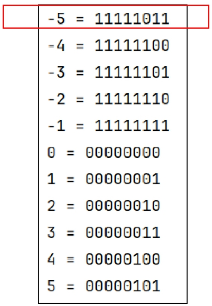

## Start 2 (2025.03.07)

### 비트 연산

#### 1. 비트와 바이트

- 1 bit
    - 0과 1을 표현하는 정보의 단위
- 1 Byte
    - 8-bit를 묶어 1 Byte라고 함
- 예시
    - 1001011011011100은 총 몇 비트이면서, 몇 바이트인가?
        - 16비트, 2바이트

#### 2. 비트 연산

- 컴퓨터의 CPU는 0과 1로 다루어 동작되며, 내부적으로 비트 연산을 사용하여 덧셈, 뺄셈, 곱셈 등을 계산함

#### 3. AND와 OR 비트 연산자

- a AND b
    - a, b 둘 다 1일 때만 결과가 1, 그 외에는 0
- a OR b
    - a, b 둘 중 하나만 1이면 결과가 1, 그외에는 0
    
    ```python
    # 연산자 &
    # 비트 단위로 AND 연산을 수행
    num1 & num2
    
    # 연산자 |
    # 비트 단위로 OR 연산을 수행
    num1 | num2
    
    # 예시
    """
    1. 이진수로 변환
    2. 각 자리를 AND, OR 연산
    """
    print(7 & 5) # 5
    print(7 | 5) # 7
    ```
    

#### 4. 파이썬에서 2진수, 16진수, 10진수 변환하여 출력하기

- 2진수는 숫자 0과 소문자 b
    - 0b를 접두사로 붙여 표현
- 16진수는 숫자 0과 소문자 x
    - 0x를 접두사로 붙여 표현
    
    ```python
    # 10진수를 2, 16진수로 변환
    print(bin(10)) # 0b1010
    print(hex(10)) # 0xa
    
    # 2, 16진수를 10진수로 변환
    print(int("1011", 2)) # 11
    print(int("b", 16))   # 11
    ```
    
    ```python
    # 예시 1
    # 자릿수 맞추기 위해 왼쪽을 제로패딩
    0b11011110 & 0b11011 # 11010
    
    # 예시 2
    # 방법 1
    """
    10진법으로 변환해서 더하고, 2진법으로 변환
    """
    # 방법 2
    """
    2진법으로 변환해서 더하기
    """
    0x4A3 | 25 # 100 1011 1011
    ```
    

#### 5. XOR 연산자

- ^
    - XOR(엑스오어) 연산자, OR처럼 동작되는데 둘 다 1인 경우는 0
    
    ```python
    # 연산자 ^
    # 비트 단위로 XOR 연산을 수행 (같으면 0, 다르면 1)
    num1 ^ num2
    
    # 예시 1
    a = bin(0b1011 ^ 0b1101)
    print(a) # 0b110
    
    # 예시 2
    # 어떤 값이던 특정 수로 2회 XOR를 하면 원래 수로 돌아옴
    7070 ^ 1004 = 6258
    6258 ^ 1004 = 7070
    """
    이러한 원리로 XOR는 암호화에 사용됨
    """
    ```
    
    
    

#### 6. 암호화 프로그램 제작하기

- 수를 입력 받고, 암호화를 해주거나(인코딩), 암호를 해제해주는(디코딩) 프로그램으로 제작
- Key 값은 1004

```python
print(bin(0x4A3 | 25))
secret_code = 1004
print(7070 ^ secret_code) # 6258
print(6258 ^ secret_code) # 7070
```

#### 7. Shift 연산자

- Left Shift: <<
    - 특정 수 만큼 비트를 왼쪽으로 밀어냄
        - 오른쪽은 제로패딩
- Right Shift: >>
    - 특정 수 만큼 비트를 오른쪽으로 밀어냄
        - 왼쪽은 제로패딩
        
        ```python
        # 연산자 <<
        # 피연산자의 비트 열의 왼쪽으로 이동시킴
        num << 2 # 왼쪽으로 2회 이동
        
        # 연산자 >>
        # 피연산자의 비트 열을 오른쪽으로 이동시킴
        num << 2 # 오른쪽으로 2회 이동
        
        # 예시
        print(bin(0b1101 << 2)) # 0b110100
        print(bin(0b1101 >> 2)) # 0b11
        
        print(1 << 1, bin(1 << 1)) # 2 0b10
        print(1 << 2, bin(1 << 2)) # 4 0b100
        print(1 << 3, bin(1 << 3)) # 8 0b1000
        print(1 << 4, bin(1 << 4)) # 16 0b10000
        
        print(7 >> 1, bin(7 >> 1)) # 3 0b11
        
        num = 1
        for _ in range(5):
            print(num, bin(num))
            num = num << 1
            """
            1 0b1
            2 0b10
            4 0b100
            8 0b1000
            16 0b10000
            """
        ```
        

#### 8. 비트 연산 응용 1

- 1 << n
    - 2ⁿ의 값을 가짐
    - 임베디드 분야에서 계산을 빠르게 하기 위해 사용

#### 9. 비트 연산 응용 2

- i & (1 << n)
    - i의 n번째 비트가 1인지 아닌지를 확인할 수 있음
    - 예
        - 1101 & (1 << 2)
            - 1101에서 2번 bit가 1인지 확인 가능 (결괏 값 = 0100)
            - 결괏 값이 0보다 크면 n번째 비트는 1임이 확정
            
            ```python
            # bit 연산 응용
            # 1. 부분집합의 수를 바로 구할 수 있음
            arr = [1, 2, 3, 4]
            print(f"부분집합의 갯수: {1 << len(arr)}개") # 부분집합의 갯수: 16개
            for i in range(1 << len(arr)):
                for idx in range(len(arr)):
                    # (1 << idx): 0b1, 0b1, 0b100, 0b1000, ...
                    """
                    i의 idx번째 bit가 1인지 확인
                    그 말은 즉슨 i번째 부분집합에 특정 숫자가 포함되어 있는지 확인
                    """
                    if i & (1 << idx):
                        print(arr[idx], end=" ")
                print()
            
            # 2. 합이 10인 부분집합 출력
            for i in range(1 << len(arr)):
                subset = []
                total = 0
                for idx in range(len(arr)):
                    if i & (1 << idx):
                        subset.append(arr[idx])
                        total += arr[idx]
                if total == 10:
                    print(f"부분집합: {subset}")
            ```
            

#### 10. 음수 표현 방법

- 컴퓨터는 음수를 “2의 보수”로 관리
- 맨 앞자리 bit(MSB)는 음수 or 양수를 구분하는 비트
- 컴퓨터가 2의 보수를 사용하여 음수를 관리하는 이유
    - 뺄셈의 연산 속도를 올릴 수 있으며, +0과 -0을 따로 취급하지 않기 위해 사용

#### 11. -5를 2의 보수로 표현하는 방법

- 수를8-bit로 저장하는 경우를 가정
- 수 5를 2진수로 나타내면 0000 0101 (7-bit)
- -5는 음수이기에 MSB는 1
- 나머지 7-bit에 대해, 수를 뒤집고 1을 더하면 됨 (2의 보수)
- 수 5를 뒤집으면 111 1010이며, 1을 더하면 111 1011이 됨
- 따라서 1111 1011이



#### 12. 2의 보수 예시

- 10001의 2의 보수
    - 수를 모두 뒤집고 + 1을 함
    - 01110 + 1 = 01111
- 1111000의 2의 보수
    - 수를 뒤집으면 0000111이고 + 1을 함
    - 0000111 + 1 = 0001000

#### 13. 2의 보수의 특징

- 2의 보수를 취한 수를, 한 번 더 2의 보수를 취하면 원래의 값으로 돌아옴
- 예시
    - 10001의 2의 보수
        - 수를 모두 뒤집고 + 1을 함
        - 01110 + 1 = 01111
    - 01111의 2의 보수
        - 10000 + 1 = 10001

#### 14. bitwise NOT(complement) 연산자

- ~ 연산자
    - 모든 비트를 반전시킴
- 만약 8-bit일 때 ~(0001 1111)이라면 값은 1110 0000이 됨

```python
# 음수 표현
print(bin(5))  # 0b101
print(bin(-5)) # -0b101

print(~4, bin(~4)) # -5 -0b101
print(~(-4))       # 3
```

#### 15. 비트 연산 문제

- SWEA 10726 이진수 표현
- 정수 N, M이 주어질 때, M의 이진수 표현의 마지막 N비트가 모두 1로 켜져 있는지 아닌지를 판별하여 출력
- 모두 켜 있다면 ON 출력, 아니면 OFF 출력
- 예시
    - 5 31
        - 31은 이진수로 0001 1111임
        - 5개 bit가 모두 1로 켜 있음
        - 따라서 정답은 “ON”
        
        ```python
        import sys
        
        # input.txt
        """
        5
        4 0
        4 30
        4 47
        5 31
        5 62
        """
        
        sys.stdin = open("input.txt", "r")
        
        # # M의 우측 N개를 확인
        # def solve():
        #     target = M
        #     # N번 확인
        #     for _ in range(N):
        #         # 맨 우측 비트가 1인지 체크
        #         # 0x1, 0b1, 1 모두 사용 가능
        #         """
        #         다른 프로그래밍 언어에서는 0x 형태를 주로 사용하기에
        #         비트 연산을 명시하기 위해 0x1을 사용하는 게 좋음
        #         """
        #         if target & 0x1 == 0:
        #             return False
        #         # 맨 우측 비트를 삭제
        #         target = target >> 1
        #     return True
        
        # 단순한 방법
        # 비트 마스크를 사용
        def solve():
            # N개의 1을 구함
            mask = (1 << N) - 1
            return (M & mask) == mask
        
        T = int(input())
        for tc in range(1, T + 1):
            N, M = map(int, input().split())
            result = solve()
            print(result)
        ```
        

---

### 실수

#### 1. 파이썬에서 실수 출력 방법

- 파이썬은 f-string 문법을 지향

```python
t1 = 10
t2 = 3.141592
print(f"변수 값은 {t1}입니다.")
print(f"변수 값은 {t2}입니다.")
```

- {t2:.2f}
    - t2 값을 소수점 둘째 자리에서 반올림하여 표현
    
    ```python
    t1 = 10
    t2 = 3.141592
    print(f"변수 값은 {t1}입니다.")
    print(f"변수 값은 {t2:.2f}입니다.")
    ```
    

#### 2. 파이썬에서 실수 표현 범위

- 파이썬에서는 다른 언어와 달리 내부적으로 더 큰 규모의 자료 구조를 사용해서, 훨씬 넓은 범위의 실수를 표현할 수 있음
- 최대로 표현할 수 있는 값은 약 1.8 x 10^308이고, 이 이상은 inf로 표현
    - 1억은 1 x 10^8
- 최소로 표현할 수 있는 값은 약 5.0 x 10^(-324)이며, 이 이하는 0으로 표현
- 컴퓨터는 실수를 내부적으로, 근사적으로 관리
    - 이진법으로 표현할 수 없는 형태의 실수는 정확한 값이 아니라 근사 값으로 저장되는데, 이 때 생기는 작은 오차가 계산 과정에서 다른 결과를 가져옴
    
    ```python
    print(0.1 + 0.1 + 0.1 == 0.3) # False
    ```
    

#### 3. 실수의 표현

- 컴퓨터는 실수를 표현하기 위해 부동 소수점(float-point) 표기법을 사용함
    - 이 표기법은 IEEE-754라는 컴퓨터에서 부동 소수점을 표기하는 국제 표준임
- 부동 소수점 표기 방법은 소수점의 위치를 고정시켜 표현하는 방식
- 소수점의 위치를 왼쪽의 가장 유효한 숫자 다음으로 고정시키고 밑수의 지수승으로 표현

```python
1001.0011 -> 1.0010011 x 2³
```

#### 4. 실수를 저장하기 위한 형식

- IEEE 754, 32bit-Single Precision 표기법 기준
- 32bit 구조


- 부호 1비트
    - 0이면 양수, 1이면 음수
- 지수부 (Exponent)
    - 부동 소수점의 크기 + bias 값
    - bias는 음수를 저장하기 위해 사용
        - 127 정도를 더해서 관리
- 가수부 (Mantissa)
    - 실질적 수

#### 5. 실수 저장 예시

- 1. 12.375를 부동 소수점으로 표기
    1. 12.375를 2진수로 변환
        1. 12는 1100, 0.375는 0.011이므로 1100.011
        2. 1100.011 = 1.100011 x 2³
        3. 즉, 가수는 100011이고, 지수는 3 (맨 앞 1은 생략)
    2. 지수 + bias: IEEE 754는 bias를 더한 결과로 표기
        1. 3 + 127(bias) = 130 (2진수로는 10000010
    3. 12.375를 IEEE 754로 표기하는 방법
        1. 부호 비트
            1. 0 (양수)
        2. 지수
            1. 10000010
        3. 가수
            1. 10001100000000000000000000000000

#### 6. 실수 자료형의 유효 자릿수

- 32비트 실수형 유효 자릿수(십진수)
    - 약 6자리 (C++)
- 64비트 실수형 유효 자릿수(십진수)
    - 약 15자리 (C++, Java)
- 파이썬에서는 내부적으로 더 많은 비트를 사용해서, 훨씬 넓은 범위의 실수를 표현할 수 있음