## Tree 1 (2025.03.04)

### Tree

#### 1. 트리 개념

- 비선형 구조
- 원소들 간에 1:n 관계를 가지는 자료 구조
- 원소들 간에 계층 관계를 가지는 계층형 자료 구조
- 상위 원소에서 하위 원소로 내려가면서 확장되는 트리(나무)모양의 구조

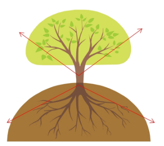

#### 2. 트리 정의

- 한 개 이상의 노드로 이루어진 유한 집합이며, 다음 조건을 만족함
    - 노드 중 최상위 노드를 루트(root)라 함
    - 나머지 노드들은 n(≥ 0)개의 분리 집합 T1, …, TN으로 분리될 수 있음
- 이들 T1, …, TN은 각각 하나의 트리가 되며(재귀적 정의) 루트의 부 트리(subtree)라 함

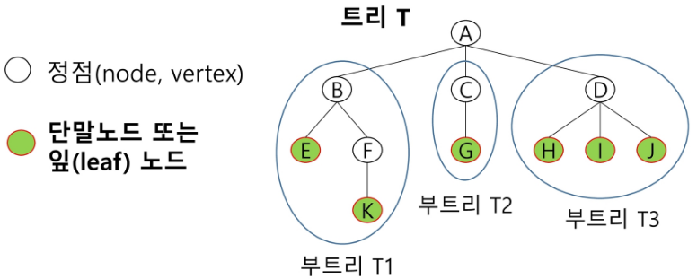

#### 3. 트리 용어정리

- 노드 (node)
    - 트리의 원소
    - 트리 T의 노드
        - A, B, C, D, E, F, G, H, I, J, K
- 간선 (edge)
    - 노드를 연결하는 선
    - 부모 노드와 자식 노드를 연결
- 루트 노드 (root node)
    - 트리의 시작 노드
    - 트리 T의 루트노드: A
- 형제 노드 (sibling node)
    - 같은 부모 노드의 자식 노드들
    - 형제 노드
        - B, C, D
- 조상 노드
    - 간선을 따라 루트 노드까지 이르는 경로에 있는 모든 노드들
    - K 조상 노드
        - F, B, A
- 서브 트리 (subtree)
    - 부모 노드와 연결된 간선을 끊었을 때 생성되는 트리
- 자손 노드
    - 서브 트리에 있는 하위 레벨의 노드들
        - B의 자손 노드
        - E, F, K
- 차수 (degree)
    - 노드의 차수
        - 노드에 연결된 자식 노드의 수
    - B의 차수
        - 2
    - C의 차수
        - 1
- 트리의 차수
    - 트리에 있는 노드의 차수 중에서 가장 큰 값
    - 트리 T의 차수
        - 3
- 단말 노드 (리프 노드)
    - 차수가 0인 노드
    - 자식 노드가 없는 노드
- 높이
    - 노드의 높이
        - 루트에서 노드에 이르는 간선의 수
        - 노드의 레벨
        - B의 높이
            - 1
        - F의 높이
            - 2
            
            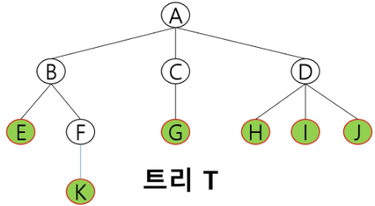
            
    - 트리의 높이
        - 트리에 있는 노드의 높이 중에서 가장 큰 값
        - 최대 레벨
        - 트리 T의 높이
            - 3
            
            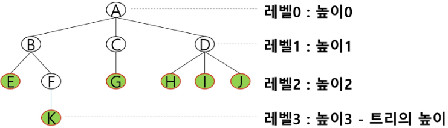
            

---

### 이진 트리

#### 1. 이진 트리

- 모든 노드들이 2개의 서브트리를 갖는 특별한 형태의 트리
- 각 노드가 자식 노드를 최대한 2개까지만 가질 수 있는 트리
    - 왼쪽 자식 노드 (left child node)
    - 오른쪽 자식 노드 (right child node)
- 이진 트리의 예

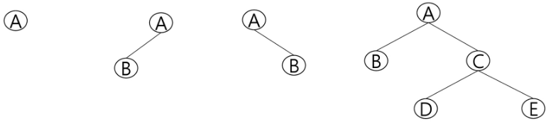

#### 2. 이진 트리 특성

- 레벨 i에서의 노드의 최대 개수는 2ⁱ개
- 높이가 h인 이진 트리가 가질 수 있는 노드의 최소 개수는 (h + 1)개가 되며, 최대 개수는 (2^(h + 1) - 1)개가 됨

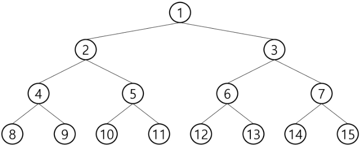

#### 3. 이진 트리 종류

1. 포화 이진 트리 (Full Binary Tree)
    1. 모든 레벨의 노드가 포화상태로 차 있는 이진 트리
    2. 높이가 h일 때, 최대의 노드 개수인 (2^(h + 1) - 1)의 노드를 가진 이진 트리
        1. 높이 3일 때, 2^(3 + 1) - 1 = 15개의 노드
    3. 루트를 1번으로 하여 2^(h + 1) - 1까지 정해진 위치에 대한 노드 번호를 가짐
    
    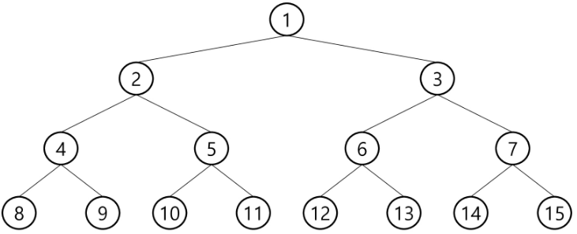
    

1. 완전 이진 트리 (Complete Binary Tree)
    1. 높이가 h이고, 노드 수가 n개일 때 (단, 2^h ≤ n ≤ 2^(h + 1) - 1), 포화 이진 트리의 노드 번호 1번부터 n번까지 빈 자리가 없는 이진 트리
    2. 예
        1. 노드가 10개인 완전 이진 트리
    
    
    

1. 편향 이진 트리 (Skewed Binary Tree)
    1. 높이 h에 대한 최소 개수의 노드를 가지면서 한쪽 방향의 자식 노드만을 가진 이진 트리
        1. 왼쪽 편향 이진 트리
        2. 오른쪽 편향 이진 트리
        
        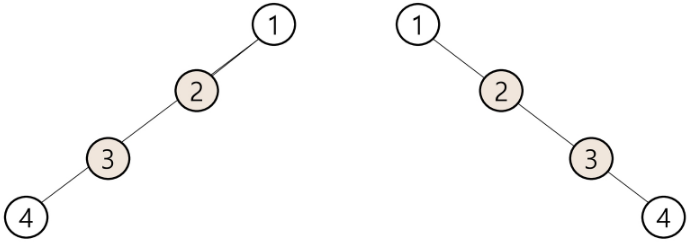
        

---

### 순회

#### 1. 순회 (Traversal)

- 트리의 노드들을 체계적으로 방문하는 것
- 트리의 각 노드를 중복되지 않게 전부 방문(visit)하는 것을 말하는데, 트리는 비선형 구조이기 때문에 선형 구조에서와 같이 선후 연결 관계를 알 수 없음
- 따라서 특별한 방법이 필요

#### 2. 기본적인 순회방법

1. 전위 순회(preorder traversal): VLR
    1. 부모 노드 방문 후, 자식 노드를 좌, 우 순서로 방문
2. 중위 순회(inorder traversal): LVR
    1. 왼쪽 자식 노드, 부모 노드, 오른쪽 자식 노드 순으로 방문
3. 후위 순회(postorder traversal): LRV
    1. 자식 노드를 좌우 순서로 방문한 후, 부모 노드로 방문
    
    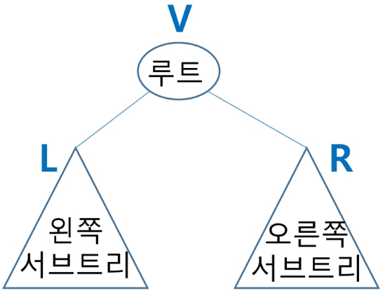
    

#### 3. 전위 순회 (preorder traversal)

- 수행 방법
    1. 현재 노드 n을 방문해서 처리 → V
    2. 현재 노드 n의 왼쪽 서브트리로 이동 → L
    3. 현재 노드 n의 오른쪽 서브트리로 이동 → R
- 예
    - 순서 1
        - T0 → T1 → T2
    - 순서 2
        - A → B D (T3) → C F G
    - 총 순서
        - A B D E H I C F G
        
        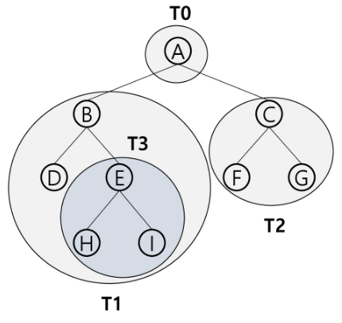
        

#### 4. 중위 순회 (inorder traversal)

- 수행 방법
    1. 현재 노드 n의 왼쪽 서브트리로 이동 → L
    2. 현재 노드 n을 방문하여 처리 → V
    3. 현재 노드 n의 오른쪽 서브트리로 이동 → R
- 예
    - 순서 1
        - T1 → T0 → T2
    - 순서 2
        - D B (T3) → A → F C G
    - 총 순서
        - D B H E I A F C G
    
    
    

#### 5. 후위 순회 (postorder traversal)

- 수행 방법
    1. 현재 노드 n의 왼쪽 서브트리로 이동 → L
    2. 현재 노드 n의 오른쪽 서브트리로 이동 → R
    3. 현재 노드 n을 방문하여 처리 → V
- 예
    - 순서 1
        - T1 → T2 → T0
    - 순서 2
        - D (T3) B → F G C → A
    - 총 순서
        - D H I E B F G C A
        
        
        

---

### 이진 트리 표현 1

#### 1. 이진 트리 표현 1

- 배열을 이용한 이진 트리의 표현
    - 이진 트리에 각 노드 번호를 다음과 같이 부여
    - 루트의 번호를 1로 함
    - 레벨 n에 있는 노드에 대하여 왼쪽부터 오른쪽으로 2^n부터 2^(n + 1) - 1까지 번호를 차례로 부여
    - 포화 이진 트리, 완전 이진 트리에 적합
    
    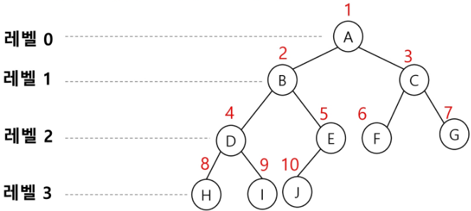
    

- 노드 번호의 성질
    - 노드 번호가 i인 노드의 부모 노드 번호
        - i / 2
        - 파이썬에서는 i // 2
    - 노드 번호가 i인 노드의 왼쪽 자식 노드 번호
        - 2 * i
    - 노드 번호가 i인 노드의 오른쪽 자식 노드 번호
        - 2*i + 1
    - 레벨 n의 노드 번호 시작 번호
        - 2^n
        
        
        
        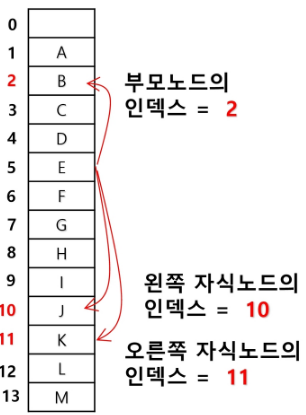
        

- 배열을 이용한 이진 트리의 표현
    - 노드 번호를 배열의 인덱스로 사용
    - 높이가 h인 이진 트리를 위한 배열의 크기
        - 레벨 i의 최대 노드 수
            - 2^i
            
            $$
            1 + 2 + 4 + 8 ... + 2^i = \sum2^i = 2^{h+1} - 1
            $$
            
            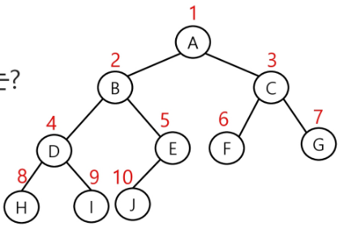
            
            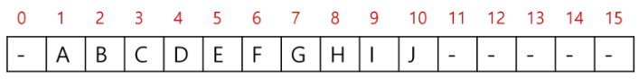
            

#### 2. 이진 트리 표현 예시

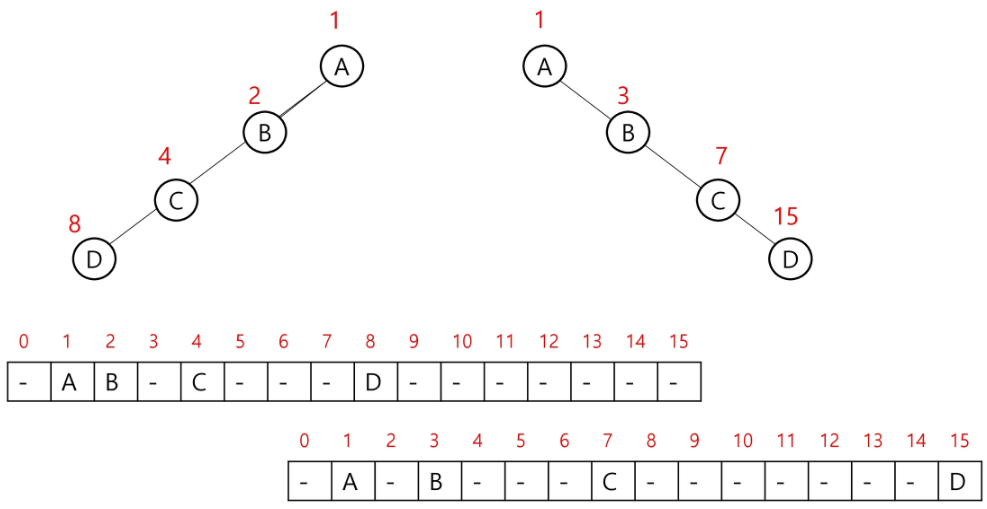

---

### 이진 트리 표현 2

#### 1. 이진 트리 저장

- 부모 번호를 인덱스로 자식 번호를 저장
    - 간선의 개수
        - N = 4
    - 부모 자식 순서
        - 1 2 1 3 3 4 3 5

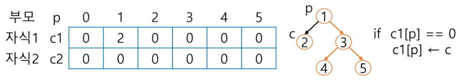

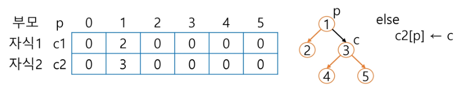

- 자식 번호를 인덱스로 부모 번호를 저장

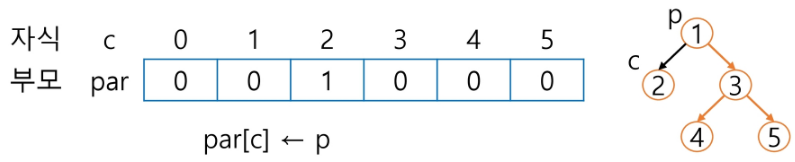

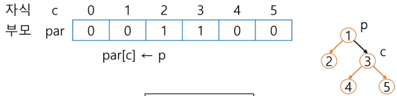

- 루트 찾기, 조상 찾기
    - 예
        - 5번 노드의 조상 찾기
        
        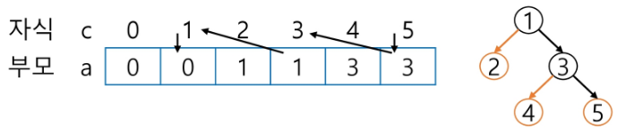
        
        ```python
        c = 4
        # 루트인지 확인
        while a[c] != 0
            c = a[c]
            # 조상 목록
            anc.append(c)
        root = c
        ```
        

#### 2. 배열을 이용한 이진 트리 표현의 단점

- 편향 이진 트리의 경우에 사용하지 않는 배열 원소에 대한 메모리 공간 낭비 발생
- 트리의 중간에 새로운 노드를 삽입하거나 기존의 노드를 삭제할 경우 배열의 크기 변경 어려워 비효율적

#### 3. 이진 트리 표현 - 연결 리스트

- 배열을 이용한 이진 트리의 표현의 단점을 보완하기 위해 연결 리스트를 이용하여 트리를 표현할 수 있음
- 연결 자료 구조를 이용한 이진 트리 표현
    - 이진 트리의 모든 노드는 최대 2개의 자식 노드를 가지므로 일정한 구조의 단순 연결 리스트 노드를 사용하여 구현
    
    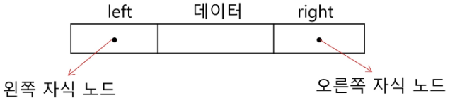
    

#### 4. 완전 이진 트리의 연결 리스트 표현

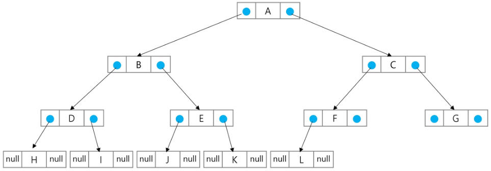

#### 5. 수식 트리

- 수식을 표현하는 이진 트리
- 수식 이진 트리(Expression Binary Tree)라고 부르기도 함
- 연산자는 루트 노드이거나 가지 노드
- 피연산자는 모두 잎 노드

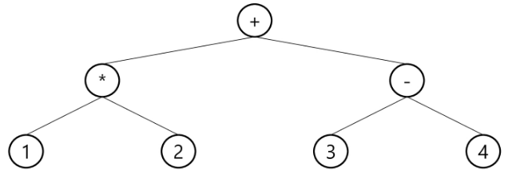

#### 6. 수식 트리의 순회

1. 중위 순회
    1. A / B * C * D + E
    2. 식의 중위 표기
2. 후위 순회
    1. A B / C * D * E +
    2. 식의 후위 표기법
3. 전위 순회
    1. + * * / A B C D E
    2. 식의 전위 표기법
    
    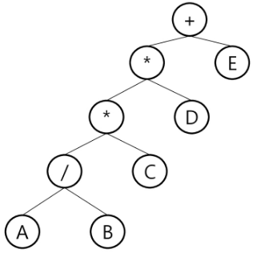