## Database 02 (2025.04.08)

### CREATE TABLE

#### 1. CREATE TABLE Statement

- 테이블 생성

#### 2. CREATE TABLE Syntax

```sql
CREATE TABLE table_name(
    column_1 data_type constraints
    , column_2 data_type constraints
    , ...
)
;
```

- 각 필드에 적용할 데이터 타입 작성
- 테이블 및 필드에 대한 제약 조건(Constraints) 작성

#### 3. CREATE TABLE 활용

1. examples 테이블 생성 및 확인

```sql
CREATE TABLE examples(
    ExamId      INTEGER     PRIMARY KEY AUTOINCREMENT
    , LastNam   VARCHAR(50) NOT NULL
    , FirstName VARCHAR(50) NOT NULL
)
;
```

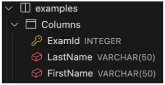

1. 테이블 schema(구조) 확인
    1. “cid”
        1. Column ID를 의미하며, 각 칼럼의 고유한 식별자를 나타내는 정수 값
        2. 직접 사용하지 않으며, PRAGMA 명령과 같은 메타 데이터 조회에서 출력 값으로 활용
        
        ```sql
        PRAGMA table_info('examples')
        ;
        ```
        
        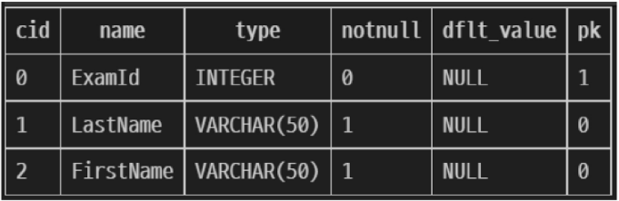
        

#### 4. SQLite 데이터 타입

```sql
-- SQLite 데이터 타입
1. NULL
 - 아무런 값도 포함하지 않음을 나타냄

2. INTEGER
 - 정수

3. REAL
 - 부동 소수점

4. TEXT
 - 문자열

5. BLOB
 - 이미지, 동영상, 문서 등의 바이너리 데이터
```

#### 5. Constraints (제약 조건)

- 테이블의 필드에 적용되는 규칙 또는 제한 사항
- 데이터의 무결성을 유지하고, 데이터베이스의 일관성을 보장

#### 6. 대표적인 제약 조건 3가지

1. PRIMARY KEY
    1. 해당 필드를 기본 키로 지정
    2. INTEGER 타입에만 적용되며 INT, BIGINT 등과 같은 다른 정수 유형은 적용되지 않음
2. NOT NULL
    1. 해당 필드에 NULL 값을 허용하지 않도록 지정
3. FOREIGN KEY
    1. 다른 테이블과의 외래 키 관계를 정의

#### 7. AUTOINCREMENT Keyword

- 자동으로 고유한 정수 값을 생성하고, 할당하는 필드 속성
- 필드의 자동 증가를 나타내는 특수한 키워드
- 주로 Primary Key 필드에 적용
- INTEGER PRIMARY KEY AUTOINREMENT가 작성된 필드는 항상 새로운 레코드에 대해 이전 최댓 값보다 큰 값을 할당
- 삭제된 값은 무시되며 재사용할 수 없게 됨

---

### Modifying Table Fields

#### 1. ALTER TABLE Statement

- 테이블 및 필드 조작

#### 2. ALTER TABLE 역할

```sql
-- ALTER TABLE 역할
1. ALTER TABLE ADD COLUMN
 - 필드 추가
 
2. ALTER TABLE RENAME COLUMN
 - 필드 이름 변경

3. ALTER TABLE DROP COLUMN
 - 필드 삭제

4. ALTER TABLE RENAME TO
 - 테이블 이름 변경
```

#### 3. ALTER TABLE ADD COLUMN Syntax

```sql
ALTER TABLE
    table_name
ADD COLUMN
    column_definition
;
```

- ADD COLUMN 키워드 이후 추가하고자 하는 새 필드 이름과 데이터 타입 및 제약 조건 작성
- 단, 추가하고자 하는 필드에 NOT NULL 제약 조건이 있을 경우 NULL이 아닌 기본 값 설정 필요

#### 4. ALTER TABLE ADD COLUMN 활용

1. examples 테이블에 다음 조건에 맞는 Country 필드 추가
    1. 테이블 생성 시 정의한 필드는 기본 값이 없어도 NOT NULL 제약 조건으로 생성되며, 내부적으로 default value는 NULL로 설정됨
    
    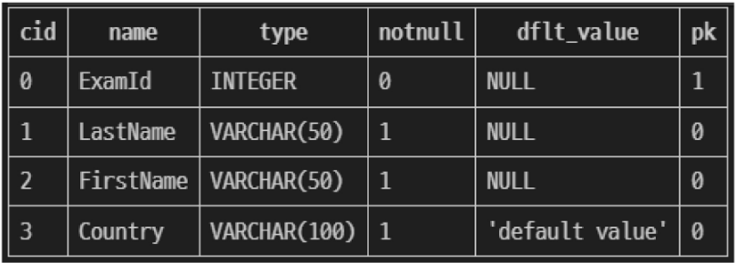
    
    ```sql
    ALTER TABLE
        examples
    ADD COLUMN
        Country VARCHAR(100) NOT NULL DEFAULT 'default value'
    ;
    ```
    

1. examples 테이블에 다음 조건에 맞는 Age, Address 필드 추가
    1. SQLite는 단일 문을 사용하여 한 번에 여러 필드를 추가할 수 없음
    
    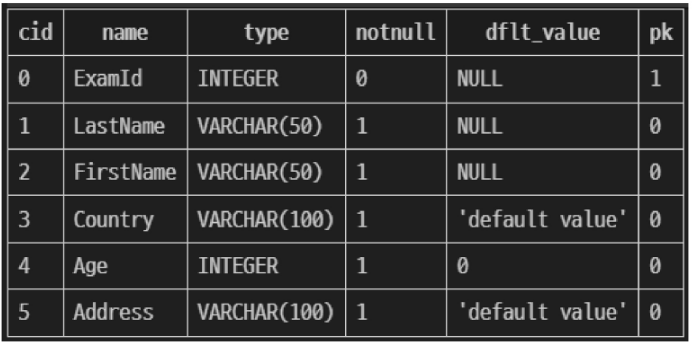
    
    ```sql
    ALTER TABLE
        examples
    ADD COLUMN
        Age INTEGER NOT NULL DEFAULT 0
    ;
    
    ALTER TABLE
        examples
    ADD COLUMN
        Address VARCHAR(100) NOT NULL DEFAULT 'default value'
    ;
    ```
    

#### 5. ALTER TABLE RENAME COLUMN Syntax

```sql
ALTER TABLE
    table_name
RENAME COLUMN
    current_name TO new_name
;
```

- RENAME COLUMN 키워드 뒤에 이름을 바꾸려는 필드의 이름을 지정하고, TO 키워드 뒤에 새 이름을 지정

#### 6. ALTER TABLE RENAME COLUMN 활용

1. examples 테이블 Address 필드의 이름을 PostCode로 변경

```sql
ALTER TABLE
    examples
RENAME COLUMN
    Address TO PostCode
;
```

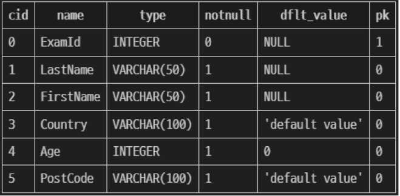

#### 7. ALTER TABLE DROP COLUMN Syntax

```sql
ALTER TABLE
    table_name
DROP COLUMN
    column_name
;
```

- DROP COLUMN 키워드 뒤에 삭제할 필드 이름 지정

#### 8. ALTER TABLE DROP COLUMN 활용

1. examples 테이블의 PostCode 필드를 삭제

```sql
ALTER TABLE
    examples
DROP COLUMN
    PostCode
;
```

#### 9. ALTER TABLE RENAME TO Syntax

```sql
ALTER TABLE
    table_name
RENAME TO
    new_table_name
;
```

- RENAME TO 키워드 뒤에 새로운 테이블 이름 지정

#### 10. ALTER TABLE RENAME TO 활용

1. examples 테이블 이름을 new_examples로 변경

```sql
ALTER TABLE
    examples
RENAME TO
    new_examples
;
```

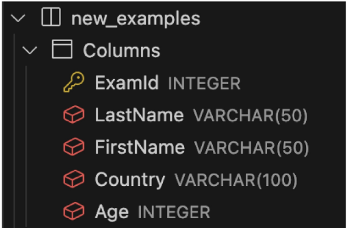

---

### DROP TABLE

#### 1. DROP TABLE Statement

- 테이블 삭제

#### 2. DROP TABLE Syntax

```sql
DROP TABLE
    table_name
;
```

- DROP TABLE Statement 이후 삭제할 테이블 이름 작성

#### 3. DROP TABLE 활용

1. new_examples 테이블 삭제

```sql
DROP TABLE
    new_examples
;
```

---

### INSERT

#### 1. 실습 테이블 생성

```sql
CREATE TABLE articles (
  id          INTEGER       PRIMARY KEY AUTOINCREMENT
  , title     VARCHAR(100)  NOT NULL
  , content   VARCHAR(200)  NOT NULL
  , createdAt DATE          NOT NULL
)
;
```

#### 2. INSERT Statement

- 테이블 레코드 삽입

#### 3. INSERT Syntax

```sql
INSERT INTO table_name(
  c1
  , c2
  , ...
) VALUES(
  v1
  , v2
  , ...
)
;
```

- INSERT INTO 절 다음에 테이블 이름과 괄호 안에 필드 목록 작성
- VALUES 키워드 다음 괄호 안에 해당 필드에 삽입할 값 목록 작성

#### 4. INSERT 활용

- articles 테이블에 다음과 같은 데이터 입력

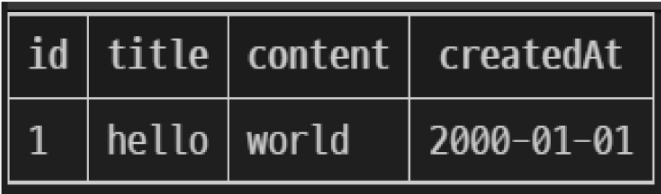

```sql
INSERT INTO articles(
  title
  , content
  , createdAt
) VALUES(
  'hello'
  , 'world'
  , '2000-01-01'
)
;
```

1. articles 테이블에 다음과 같은 데이터 추가 입력

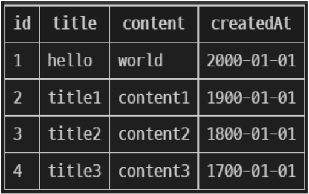

```sql
INSERT INTO
  articles(title, content, createdAt)
VALUES
  ('title1', 'content1', '1900-01-01')
  , ('title2', 'content2', '1800-01-01')
  , ('title3', 'content3', '1700-01-01')
;
```

1. DATE 함수를 사용해 articles 테이블에 다음과 같은 데이터 추가 입력

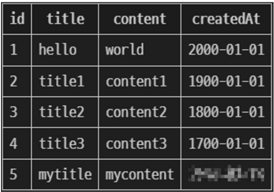

```sql
INSERT INTO articles(
  title
  , content
  , createdAt
) VALUES(
  'mytitle'
  , 'mycontent'
  , DATE()
)
;
```

---

### UPDATE

#### 1. UPDATE Statement

- 테이블 레코드 수정

#### 2. UPDATE Syntax

```sql
UPDATE table_name
SET column_name = expression,
[WHERE
  condition
]
;
```

- SET 절 다음에 수정할 필드와 새 값을 지정
- WHERE 절에서 수정할 레코드를 지정하는 조건 작성
- WHERE 절을 작성하지 않으면 모든 레코드를 수정

#### 3. UPDATE 활용

1. articles 테이블 1번 레코드의 title 필드 값을 ‘update Title’로 변경

```sql
UPDATE
  articles
SET
  title = 'update Title'
WHERE
  id = 1
;
```

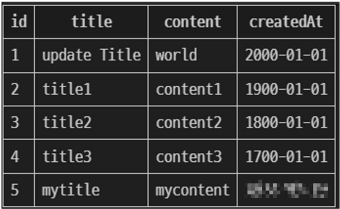

1. articles 테이블 2번 레코드의 title, content 필드 값을 각각 ‘update Title’, ‘update Content’로 변경

```sql
UPDATE
  articles
SET
  title = 'update Title'
  , content = 'update Content'
WHERE
  id = 2
;
```

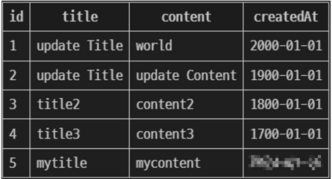

---

### DELETE

#### 1. DELETE Statement

- 테이블 레코드 삭제

#### 2. DELETE Syntax

```sql
DELETE FROM
  table_name
[WHERE
  condition
]
;
```

- DELETE FROM 절 다음에 테이블 이름 작성
- WHERE 절에서 삭제할 레코드를 지정하는 조건 작성
- WHERE 절을 작성하지 않으면 모든 레코드를 삭제

#### 3. DELETE 활용

1. articles 테이블의 1번 레코드 삭제

```sql
DELETE FROM
  articles
WHERE
  id = 1
;
```

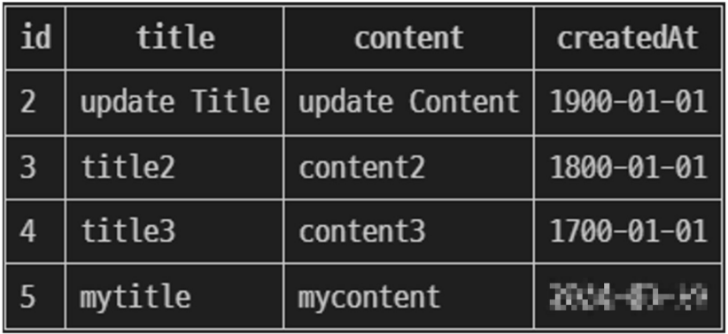

1. articles 테이블에서 작성일이 오래된 순으로 레코드 2개 삭제

```sql
DELETE FROM
  articles
WHERE id IN(
  SELECT id
  FROM articles
  ORDER BY createdAt ASC
  LIMIT 2
)
;
```

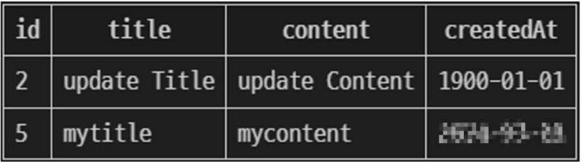

---

### Multi Table Queries

#### 1. 관계

- 여러 테이블 간의 (논리적) 연결

#### 2. 관계의 필요성

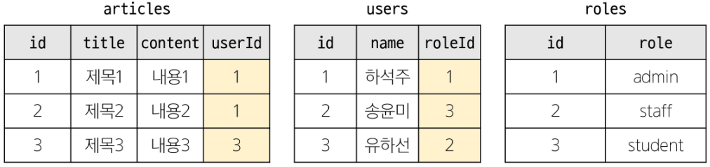

- articles와 users 테이블에 각각 userId, roleId 외래 키 필드 작성
- 관리자인 사람만 보고 싶으면, roleId가 1인 데이터 조회
- 하석주라는 사람이 권미숙으로 개명한다면, users에서 한 번만 변경하면 자동으로 모두 변경

#### 3. JOIN이 필요한 순간

1. 테이블을 분리하면 데이터 관리는 용이해질 수 있으나 출력 시에는 문제가 있음
2. 테이블 한 개 만을 출력할 수 밖에 없어 다른 테이블과 결합하여 출력하는 것이 필요해짐

#### 4. JOIN Clause

- 둘 이상의 테이블에서 데이터를 검색하는 방법

#### 5. JOIN 종류

1. INNER JOIN
2. LEFT JOIN

#### 6. 사전 준비

1. users 및 articles 테이블 생성

```sql
-- users table
CREATE TABLE users (
  id      INTEGER     PRIMARY KEY AUTOINCREMENT
  , name  VARCHAR(50) NOT NULL
)
;

-- articles table
CREATE TABLE articles (
  id        INTEGER       PRIMARY KEY AUTOINCREMENT
  , title   VARCHAR(50)   NOT NULL
  , content VARCHAR(100)  NOT NULL
  , userId  INTEGER       NOT NULL
  , FOREIGN KEY (userId)  REFERENCES users(id)
)
;
```

2. 각 테이블에 실습 데이터 입력

```sql
-- users table
INSERT INTO
  users
  (name)
VALUES 
  ('하석주')
  , ('송윤미')
  , ('유하선')
;

-- articles table
INSERT INTO
  articles
  (title, content, userId)
VALUES 
  ('제목1', '내용1', 1)
  , ('제목2', '내용2', 2)
  , ('제목3', '내용3', 1)
  , ('제목4', '내용4', 4)
  , ('제목5', '내용5', 1)
;
```

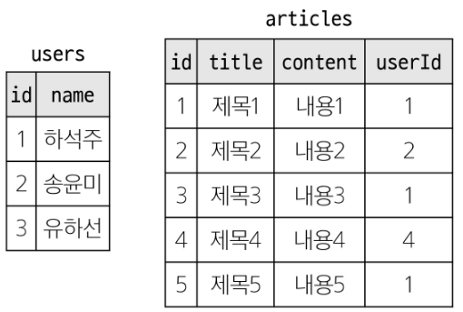

#### 7. INNER JOIN Clause

- 두 테이블에서 값이 일치하는 레코드에 대해서만 결과를 반환

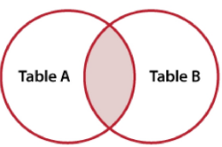

#### 8. INNER JOIN Syntax

```sql
SELECT
  select_list
FROM
  table_a
INNER JOIN table_b
  ON table_b.fk = table_a.pk
;
```

- FROM 절 이후 메인 테이블 지정 (table_a)
- INNER JOIN 절 이후 메인 테이블과 조인할 테이블을 지정 (table_b)
- ON 키워드 이후 조인 조건을 작성
- 조인 조건은 table_a와 table_b 간의 레코드를 일치시키는 규칙을 지정

#### 9. INNER JOIN 예시

- 작성자가 있는(존재하는 회원) 모든 게시글을 작성자 정보와 함께 조회

```sql
SELECT *
FROM articles
INNER JOIN users
  ON users.id = articles.userId
;
```

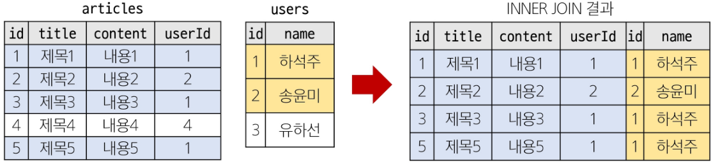

#### 10. INNER JOIN 활용

1. 1번 회원(하석주)가 작성한 모든 게시글의 제목과 작성자 명을 조회

```sql
SELECT
  articles.title
  , users.name
FROM articles
INNER JOIN users
  ON users.id = articles.userId
WHERE users.id = 1
;
```

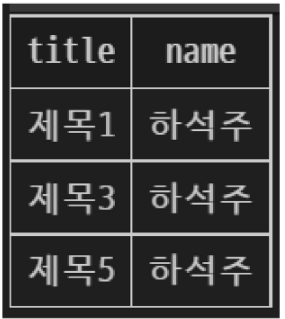

#### 11. LEFT JOIN Clause

- 오른쪽 테이블의 일치하는 레코드와 함께 왼쪽 테이블의 모든 레코드 반환

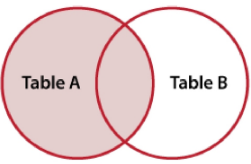

#### 12. LEFT JOIN Syntax

```sql
SELECT
  select_list
FROM
  table_a
LEFT JOIN table_b
  ON table_b.fk = table_a.pk
;
```

- FROM 절 이후 왼쪽 테이블 지정 (table_a)
- LEFT JOIN 절 이후 오른쪽 테이블 지정 (table_b)
- ON 키워드 이후 조인 조건을 작성
    - 왼쪽 테이블의 각 레코드를 오른쪽 테이블의 모든 레코드와 일치시킴

#### 13. LEFT JOIN 예시

- 모든 게시글을 작성자 정보와 함께 조회

```sql
SELECT *
FROM articles
LEFT JOIN users
  ON users.id = articles.userId
;
```

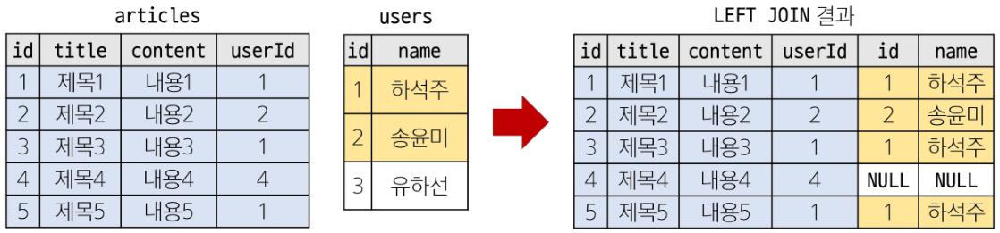

#### 14. LEFT JOIN 특징

- 왼쪽 테이블의 모든 레코드를 표기
- 오른쪽 테이블과 매칭되는 레코드가 없으면 NULL을 표시

#### 15. LEFT JOIN 활용

1. 게시글을 작성한 이력이 없는 회원 정보 조회

```sql
SELECT users.name
FROM users
LEFT JOIN articles
  ON articles.userId = users.id
WHERE articles.userId IS NULL
;
```

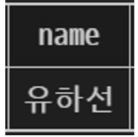

---

### 참고

#### 1. 타입 선호도 (Type Affinity)

- 컬럼에 데이터 타입이 명시적으로 지정되지 않았거나 지원하지 않을 때, SQLite가 자동으로 데이터 타입을 추론하는 것
- 참고 자료
    - https://sqlite.org/datatype3.html

#### 2. SQLite 타입 선호도의 목적

1. 유연한 데이터 타입 지원
    1. 데이터 타입을 명시적으로 지정하지 않고도 데이터를 저장하고 조회할 수 있음
    2. 컬럼에 저장되는 값의 특성을 기반으로 데이터 타입을 유추
2. 간편한 데이터 처리
    1. INTEGER Type Affinity를 가진 열에 문자열 데이터를 저장해도 SQLite는 자동으로 숫자로 변환하여 처리
3. SQL 호환성
    1. 다른 데이터베이스 시스템과 호환성을 유지

#### 3. 반드시 NOT NULL 제약을 사용해야 할까?

- 그런 건 아님
- 하지만 데이터베이스를 사용하는 프로그램에 따라 NULL을 저장할 필요가 없는 경우가 많으므로 대부분 NOT NULL을 정의
- “값이 없다.”라는 표현을 테이블에 기록하는 것은 “0”이나 “빈 문자열” 등을 사용하는 것으로 대체하는 것을 권장

#### 4. SQLite의 날짜와 시간

- SQLite에는 날짜 및/또는 시간을 저장하기 위한 별도 데이터 타입이 없음
- 대신 날짜 및 시간에 대한 함수를 사용해 표기 형식에 따라 TEXT, REAL, INTEGER 값으로 저장
- 참고 자료
    - https://sqlite.org/datatype3.html