## Django 02 (2025.03.25)

### Template System

#### 1. Django Template System

- 데이터 표현을 제어하면서, 표현과 관련된 부분을 담당

#### 2. HTML의 콘텐츠를 변수 값에 따라 변경하기

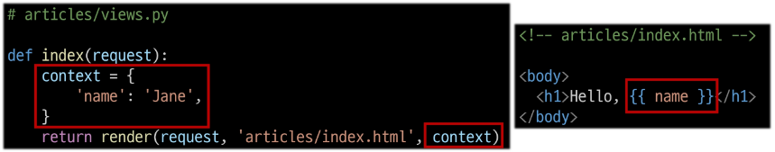

---

### Django Template Language

#### 1. Django Template Language (DTL)

- Template에서 조건, 반복, 변수 등의 프로그래밍적 기능을 제공하는 시스템

#### 2. DTL Syntax

1. Variable
    1. render 함수의 세번째 인자로 딕셔너리 데이터를 사용
    2. 딕셔너리 key에 해당하는 문자열이 template에서 사용 가능한 변수명이 됨
    3. dot(’.’)를 사용하여 변수 속성에 접근할 수 있음
    
    ```html
    {{variable}}
    {{variable.attribute}}
    ```
    
2. Filters
    1. 표시할 변수를 수정할 때 사용 (변수 + ‘|’ + 필터)
    2. chained(연결)이 가능하며 일부 필터는 인자를 받기도 함
    3. 약 60개의 built-in template filters를 제공
    
    ```html
    {{variable|filter}}
    {{name|truncatewords:30}}
    ```
    
3. Tags
    1. 반복 또는 논리를 수행하여 제어 흐름을 만듦
    2. 일부 태그는 시작과 종료 태그가 필요
    3. 약 24개의 built-in template tags를 제공
    
    ```html
    
     
    ```
    
4. Comments
    1. DTL에서의 주석
    
    ```html
    <h1>Hello, {# name #}</h1>
    
    
    ...
    
    ```
    

#### 3. DTL 예시

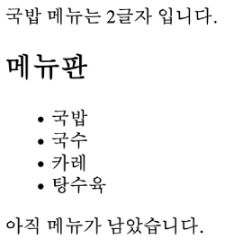

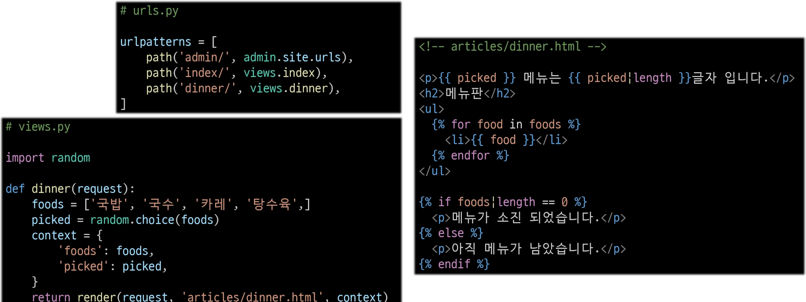

---

### 템플릿 상속

#### 1. 템플릿 상속 (Template Inheritance)

- 페이지의 공통 요소를 포함하고, 하위 템플릿이 재정의할 수 있는 공간을 정의하는 기본 ‘skeleton’ 템플릿을 작성하여 상속 구조를 구축

#### 2. 상속 구조 만들기

- skeleton 역할을 하게 되는 상위 템플릿(base.html) 작성

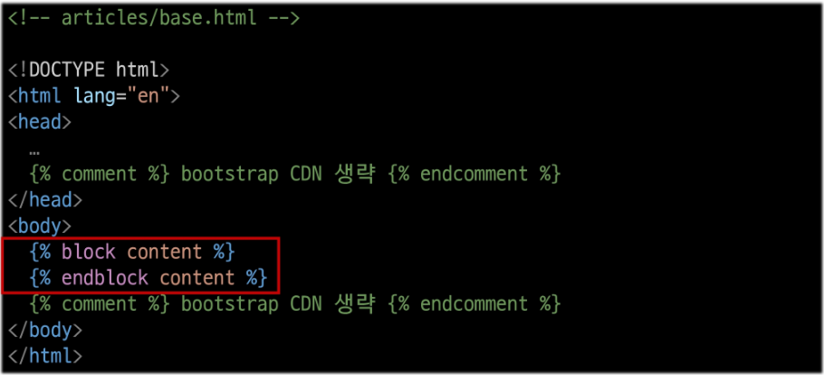

- 기존 하위 템플릿의 변화

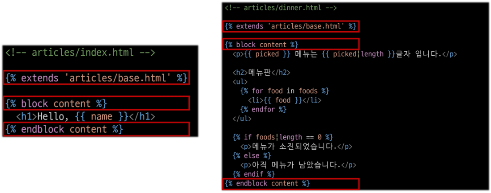

#### 3. 상속 관련 DTL 태그

1. ‘extends’ tag
    1. 자식(하위) 템플릿이 부모 템플릿을 확장한다는 것을 알림
    2. 반드시 자식 템플릿 최상단에 작성되어야 함 (2개 이상 사용 불가)
    
    ```html
    
    ```
    

1. ‘block’ tag
    1. 하위 템플릿에서 재정의할 수 있는 블록을 정의
    2. 상위 템플릿에 작성하며, 하위 템플릿이 작성할 수 있는 공간을 지정하는 것
    
    ```html
    
    ```
    

#### 4. 하위 템플릿이 재정의할 수 있는 block 영역

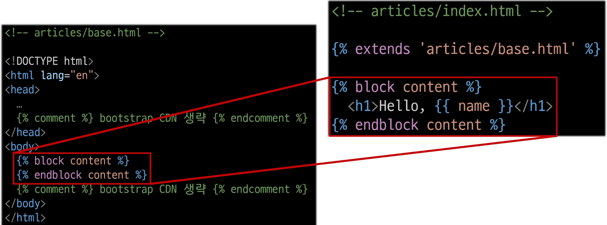

---

### 요청과 응답

#### 1. ‘form’ element

- 사용자로부터 할당된 데이터를 서버로 전송
- 웹에서 사용자 정보를 입력하는 여러 방식
    - text, password, checkbox 등을 제공

#### 2. fake Naver 만들기

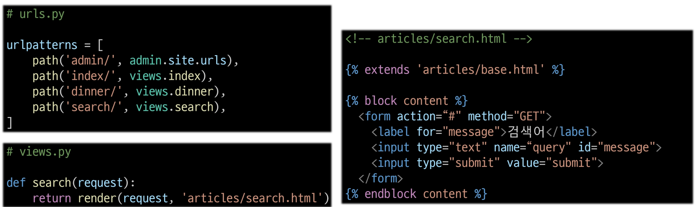

- input에 hello를 입력하고, 제출 버튼을 누른 후 브라우저의 URL 변화 확인

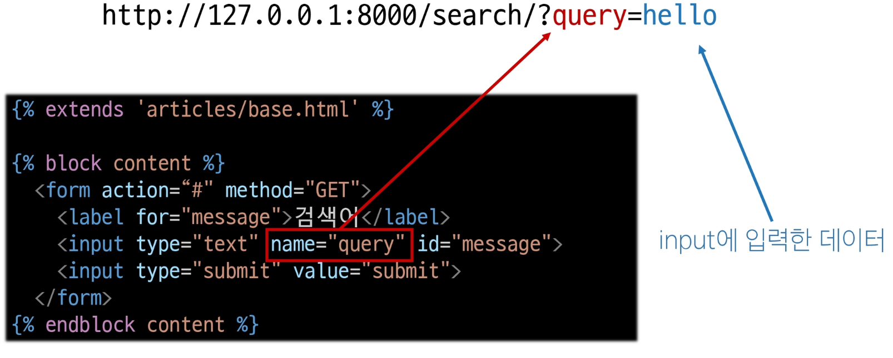

- 실제 Naver에서 검색 후 URL 확인

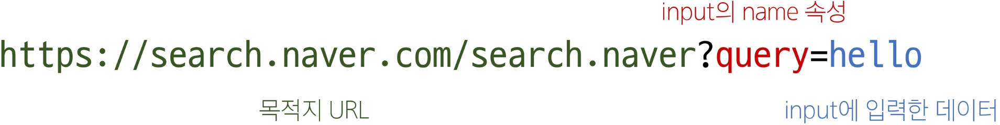

#### 3. form 핵심 속성 2가지

- ‘action’ & ‘method’
- 데이터를 어디(action)로 어떤 방식(method)으로 요청할지

#### 4. action과 method

- action
    - 입력 데이터가 전송될 URL을 지정 (목적지)
    - 만약 이 속성을 지정하지 않으면 데이터는 현재 form이 있는 페이지의 URL로 보내짐
- method
    - 데이터를 어떤 방식으로 보낼 것인지 정의
    - 데이터의 HTTP request methods (GET, POST)를 지정

#### 5. ‘input’ element

- 사용자의 데이터를 입력 받을 수 있는 요소
- type 속성 값에 따라 다양한 유형의 입력 데이터를 받음
- 핵심 속성 ‘name’ attribute
    - input의 핵심 속성
    - 사용자가 입력한 데이터에 붙이는 이름(key)
    - 데이터를 제출했을 때 서버는 name 속성에 설정된 값을 통해서만 사용자가 입력한 데이터에 접근할 수 있음

#### 6. Query String Parameters

- 사용자의 입력 데이터를 URL 주소에 파라미터를 통해 서버로 보내는 방법
- 문자열은 doavjtosem(’&’)로 연결된 key=value 쌍으로 구성되며, 기본 URL과는 물음표(’?’)로 구분됨

```html
http://host:port/path?key=value&key=value
```

#### 7. HTTP request 객체

- form으로 전송한 데이터 뿐만 아니라, Django로 들어오는 모든 요청 관련 데이터가 담겨 있음
- view 함수의 첫 번째 인자로 전달됨

#### 8. request 객체에서 form 데이터 추출

```python
request.GET.get("message")
```

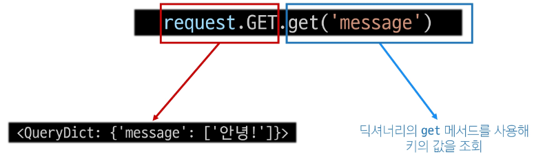

---

### Django URLs

#### 1. 요청과 응답에서 Django URLs의 역할

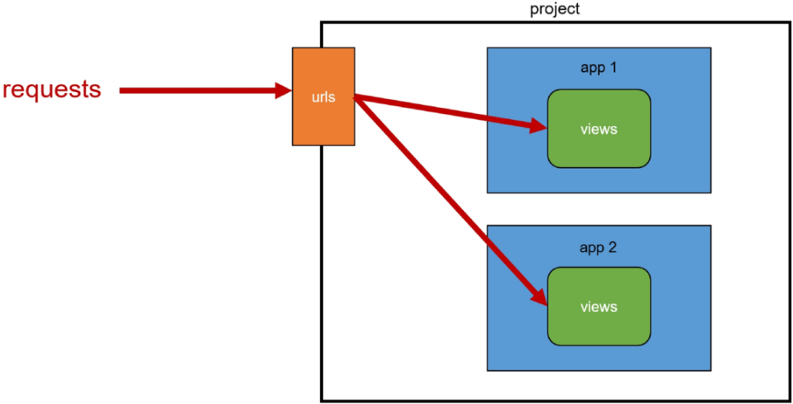

#### 2. URL Dispatcher (운항 관리자, 분배기)

- URL 패턴을 정의하고, 해당 패턴이 일치하는 요청을 처리할 view 함수를 연결 (매핑)

#### 3. Variable Routing

- URL 일부에 변수를 포함시키는 것
- 변수는 view 함수의 인자로 전달할 수 있음

#### 4. Variable Routing 작성법

```python
<path_converter:variable_name>
```

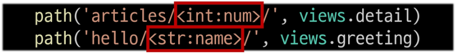

#### 5. path converters

- URL 변수의 타입을 지정
- str, int 등 5가지 타입 지원
- 참고 자료
    - https://docs.djangoproject.com/en/4.2/topics/http/urls/#path-converters

#### 6. Variable routing 실습

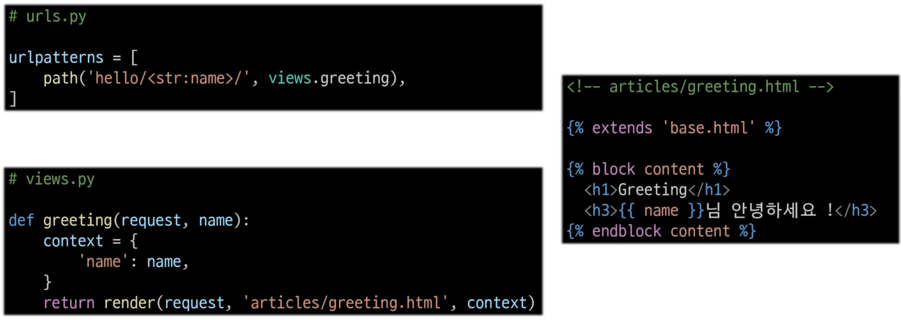

---

### App URL 정의

#### 1. App URL mapping

- 각 앱에 URL을 정의하는 것
- 프로젝트와 각 앱이 URL을 나누어 관리를 편하게 하기 위함

#### 2. url 구조의 변화

- 기존 url 구조

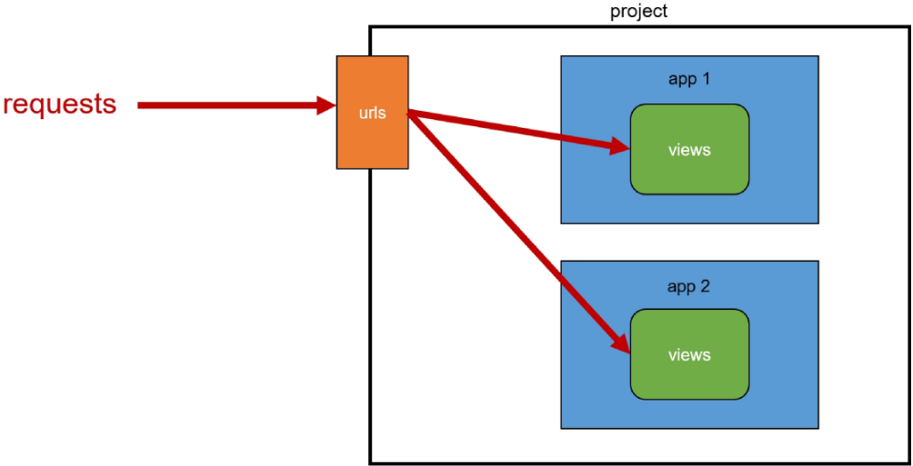

- 변경된 url 구조

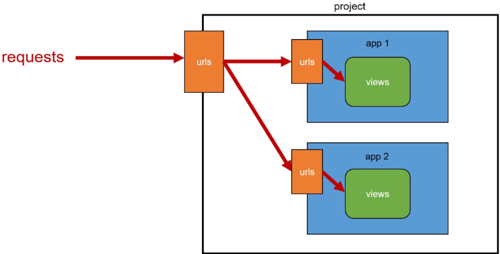

- url 구조 변화

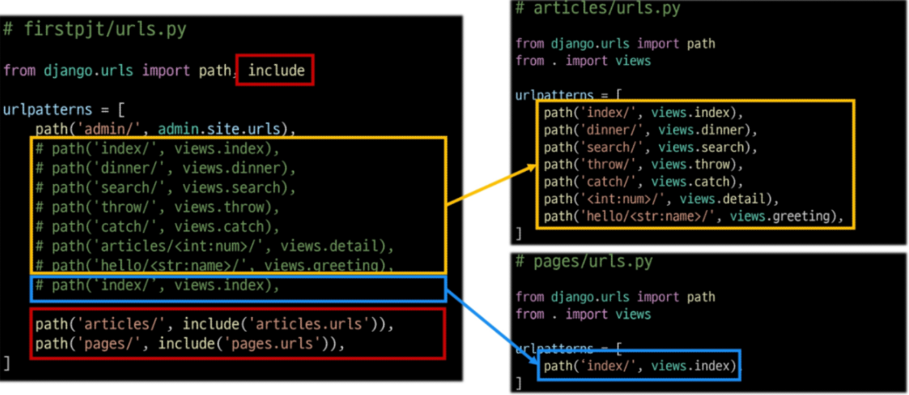

#### 3. include()

- 프로젝트 내부 앱들의 URL을 참조할 수 있도록 매핑하는 함수
- URL의 일치하는 부분까지 잘라내고, 남은 문자열 부분은 후속 처리를 위해 include된 URL로 전달

---

### Naming URL Patterns

#### 1. url 구조 변경에 따른 문제점

- 기존 ‘articles/’ 주소가 ‘articles/index/’로 변경됨에 따라 해당 url을 사용하는 모든 위치를 찾아가 변경해야 함

#### 2. Naming URL Patterns

- URL에 이름을 지정하는 것
- path 함수의 name 인자를 정의해서 사용

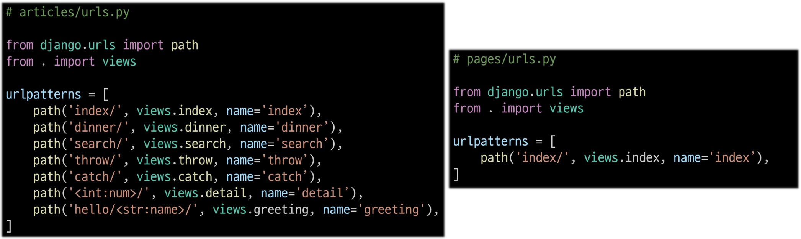

- URL 표기 변화
    - url을 작성하는 모든 곳에서 변경
    - a태그의 href 속성 값 뿐만 아니라, form의 action 속성 등도 포함
    
    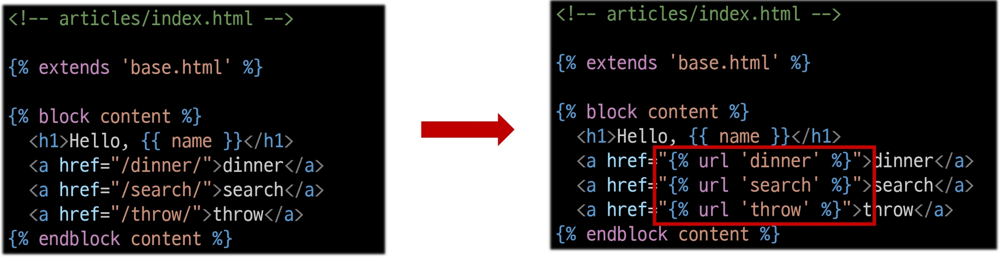
    

#### 3. ‘url’ tag

- 주어진 URL 패턴의 이름과 일치하는 절대 경로 주소를 반환

```html

```

#### 4. app_name 속성

- URL 이름 지정 후 남은 문제
    - articles 앱의 url 이름과 pages 앱의 url 이름이 같은 상황을 가정
    - 단순히 이름만으로는 완벽하게 분리할 수 없음
    
    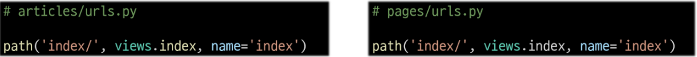
    
    - app_name 변수 값 설정
    
    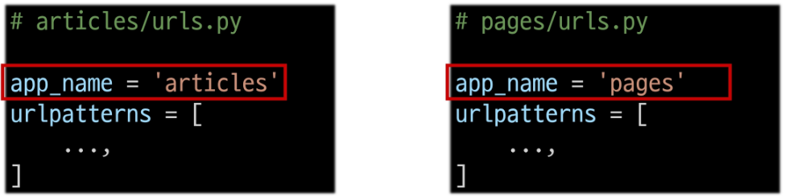
    

#### 5. URL tag의 최종 형태

- 마지막으로 url 태그가 사용하는 모든 곳의 표기 변경

```html

```

---

### 참고

#### 1. 추가 템플릿 경로 지정

- 템플릿 기본 경로 외 커스텀 경로 추가하기

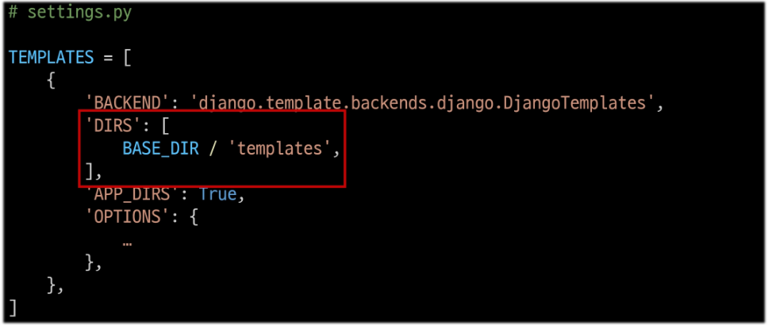

- 새로운 템플릿 경로 생성

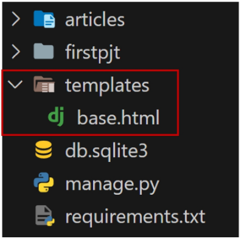

- 각 하위 템플릿에서 extends 경로가 수정됨

```html

```

#### 2. BASE_DIR

- settings에서 경로 지정을 편하게 하기 위해 최상단 지점을 지정해둔 변수
- 참고 자료
    - https://docs.python.org/ko/3.9/library/pathlib.html#module-pathlib

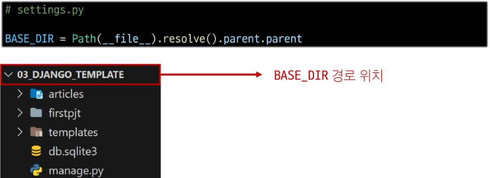

#### 3. DTL 주의사항

- Python처럼 일부 프로그래밍 구조(if, for 등)를 사용할 수 있지만, 명칭을 그렇게 설계했을 뿐이지 Python 코드로 실행되는 것이 아니며 Python과는 관련 없음
- 프로그래밍적 로직이 아니라 표현을 위한 것임을 명심하기
- 프로그래밍적 로직은 되도록 view 함수에서 작성 및 처리할 것
- 참고 자료
    - https://docs.djangoproject.com/en/4.2/ref/templates/builtins/

#### 4. Trailing Slashes

- Django는 URL 끝에 ‘/’가 없다면 자동으로 붙임
- “기술적인 측면에서, [foo.com/bar와](http://foo.com/bar와) [foo.com/bar/는](http://foo.com/bar/는) 서로 다른 URL”
    - 검색 엔진 로봇이나 웹 트래픽 분석 도구에서는 이 두 주소를 서로 다른 페이지로 보기 때문
- Django는 검색 엔진이 혼동하지 않게 하기 위해 무조건 붙이는 것을 선택
- 모든 프레임워크가 이런 방식으로 동작하는 것은 아님