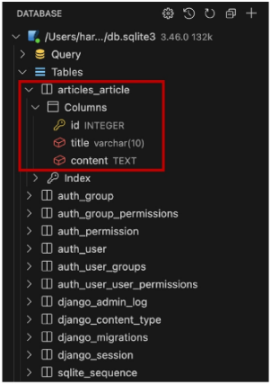

## Django 03 (2025.03.26)

### Model

#### 1. Model을 통한 DB(데이터베이스) 관리


#### 2. Django Model

- DB의 테이블을 정의하고, 데이터를 조작할 수 있는 기능들을 제공
- 테이블 구조를 설계하는 ‘청사진(blueprint)’

```python
# articles/models.py
class Article(models.Model):
    title = models.CharField(max_length=10)
    content = models.TextField()
```

#### 3. model 클래스 살펴보기

- 작성한 모델 클래스는 최종적으로 DB에 다음과 같은 테이블 구조를 만듦


- django.db.models 모듈의 Model이라는 부모 클래스를 상속 받음
- Model은 model에 관련된 모든 코드가 이미 작성 되어있는 클래스
- 개발자는 가장 중요한 테이블 구조를 어떻게 설계할지에 대한 코드만 작성하도록 하기 위한 것
    - 상속을 활용한 프레임워크의 기능 제공
    
    
    

- 클래스 변수명
    - 테이블의 각 “필드(열) 이름”
    
    
    

- Model Field
    - 데이터베이스 테이블의 열(Column)을 나타내는 중요한 구성 요소
    - “데이터의 유형”과 “제약 조건”을 정의
    
    
    

---

### Model Field

#### 1. Model Field

- DB 테이블의 필드(열)을 정의하며, 해당 필드에 저장되는 데이터 타입(Field Types)과 제약 조건(Field Options)을 정의

#### 2. Model Field 구성

1. Field Types (필드 유형)
    1. 데이터베이스에 저장될 “데이터의 종류”를 정의
2. Field Options (필드 옵션)
    1. 필드의 “동작”과 “제약 조건”을 정의

---

### Field Types

#### 1. Field Types

- 데이터베이스에 저장될 “데이터의 종류”를 정의
- models 모듈의 클래스로 정의되어 있음


#### 2. CharField()

- 제한된 길이의 문자열을 저장
- 필드의 최대 길이를 결정하는 max_length는 필수 옵션

#### 3. TextField()

- 길이 제한이 없는 대용량 텍스트를 저장
- 무한대는 아니면 사용하는 시스템에 따라 달라짐

#### 4. 주요 필드 유형

```python
1. 문자열 필드
 - CharField
 - TextField

2. 숫자 필드
 - IntegerField
 - FloatField

3. 날짜/시간 필드
 - DateField
 - TimeField
 - DateTimeField

4. 파일 관련 필드
 - FileField
 - ImageField
```

---

### Field Options

#### 1. Field Options

- 필드의 “동작”과 “제약 조건”을 정의


#### 2. 제약 조건 (Constraint)

- 특정 규칙을 강제하기 위해 테이블의 열이나 행에 적용되는 규칙이나 제한 사항
- 예시
    - 숫자만 저장되도록, 문자가 100자까지만 저장되도록 하는 등

#### 3. 주요 필드 옵션

```python
1. null
 - 데이터베이스에서 NULL 값을 허용할지 여부를 결정 (기본 값: False)

2. blank
 - form에서 빈 값을 허용할지 여부를 결정 (기본 값: False)

3. default
 - 필드의 기본 값을 설정
```

---

### Migrations

#### 1. Migrations

- model 클래스의 변경 사항(필드 생성, 수정 삭제 등)을 DB에 최종 반영하는 방법

#### 2. Migrations 과정


#### 3. Migrations 명령어

- `python manage.py makemigrations`
    - model class를 기반으로 최종 설계도(migration) 작성
- `python manage.py migrate`
    - 최종 설계도를 DB에 전달하여 반영

#### 4. migrate 후 DB 테이블 확인

- Article 모델 클래스로 만들어진 articles_article 테이블



#### 5. 추가 모델 필드 작성

- created_at, update_at 추가하려고 함


1. 코드 추가

```python
# articles/models.py
class Article(models.Model):
    title = models.CharField(max_length=10)
    content = models.TextField()
    # 아래의 created_at, updated_at 필드 추가
    created_at = models.DateTimeField(auto_now_add=True)
    updated_at = models.DateTimeField(auto_now=True)
```

1. `python manage.py makemigrations`
    1. 이미 기존 테이블이 존재하기 때문에 필드를 추가할 때 필드의 기본 값 설정이 필요
        1. 1번을 선택
    2. 1번은 현재 대화를 유지하면서 직접 기본 값을 입력하는 방법
    3. 2번은 현재 대화에서 나간 후 models.py에 기본 값 관련 설정을 하는 방법
    
    
    

1. 기본 값 옵션 선택
    1. 추가하는 필드의 기본 값을 입력해야 하는 상황
    2. 날짜 데이터이기 때문에 직접 입력하기 보다 Django가 제안하는 기본 값을 사용하는 것을 권장
    3. 아무 것도 입력하지 않고, enter를 누르면 Django가 제안하는 기본 값으로 설정 됨
    
    
    

1. migration 파일 생성 
    1. migrations 과정 종료 후 2번째 migration 파일이 생성됨을 확인
    2. Django는 설계도를 쌓아가면서 추후 문제가 생겼을 시 복구하거나 되돌릴 수 있도록 함
        1. ‘git commit’과 유사
        
        
        

1. `python manage.py migrate`
    1. migrate 후 테이블 필드 변화 확인
    
    
    

#### 6. DateTimeField의 필드 옵션 (Optional)

1. auto_now
    1. 데이터가 저장될 때마다 자동으로 현재 날짜시간을 저장
2. auto_now_add
    1. 데이터가 처음 생성될 때만 자동으로 현재 날짜시간을 저장

#### 7. Migrations 순서

1. model class 변경
2. makemigrations
3. migrate

#### 8. Migrations 기타 명령어

- `python manage.py showmigrations`
    - migrations 파일들이 migrate 됐는지, 안 됐는지 여부를 확인하는 명령어
    - [X] 표시가 있으면 migrate가 완료되었음을 의미
- `python manage.py sqlmigrate articles 0001`
    - 해당 migrations 파일이 SQL 언어(DB에서 사용하는 언어)로, 어떻게 번역되어 DB에 전달되는지 확인하는 명령어

---

### Admin Site

#### 1. Automatic admin interface

- Django가 추가 설치 및 설정 없이 자동으로 제공하는 관리자 인터페이스
- 데이터 확인 및 테스트 등을 진행하는데 매우 유용

#### 2. 관리자 인터페이스 이용 순서

1. admin 계정 생성
    1. email은 선택 사항
    2. 비밀번호 입력 시 보안상 터미널에 출력되지 않음
    3. 명령어
        1. python manage.py createsuperuser
2. DB에 생성된 admin 계정 확인


1. admin에 모델 클래스 등록
    1. admin.py에 작성한 모델 클래스를 등록해야만 admin site에서 확인 가능
    
    
    

2. admin site 로그인 후 등록된 모델 클래스 확인


3. 데이터 생성, 수정, 삭제 테스트


4. 테이블 확인


---

### 데이터베이스

#### 1. 데이터베이스 초기화

1. migration 파일 삭제
2. db.sqlite3 파일 삭제
3. 삭제하면 안 되는 파일과 폴더
    1. __init__.py
    2. migrations 폴더
    
    
    

#### 2. SQLite

- 데이터베이스 관리 시스템 중 하나이며, Django의 기본 데이터베이스로 사용됨
- 파일로 존재하며 가볍고 호환성이 좋음