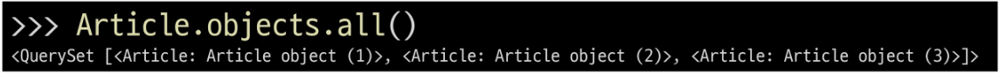

## Django 04 (2025.03.27)

### ORM

#### 1. ORM (Object-Relational-Mapping)

- 객체 지향 프로그래밍 언어를 사용하여 호환되지 않는 유형의 시스템 간에 데이터를 변환하는 기술

#### 2. ORM의 역할

- Django와 DB 간에 사용하는 언어가 다르기 때문에 소통 불가
- Django에 내장된 ORM이 중간에서 이를 해석


---

### QuerySet API

#### 1. QuerySet API

- ORM에서 데이터를 검색, 필터링, 정렬 및 그룹화하는 데 사용하는 도구
- Python의 모델 클래스와 인스턴스를 활용해 DB에 데이터를 저장, 조회, 수정, 삭제하는 것
- API를 사용하여 SQL이 아닌 Python 코드로 데이터를 처리
- QuerySet은 여러 데이터, Instance는 단일 데이터


#### 2. QuerySet API 구문


#### 3. QuerySet API 구문 동작 예시


#### 4. Query

- 데이터베이스에 특정한 데이터를 보여 달라는 요청
- “쿼리문을 작성한다.”
    - “원하는 데이터를 얻기 위해 데이터베이스에 요청을 보낼 코드를 작성한다.”
- 파이썬으로 작성한 코드가 ORM에 의해 SQL로 변환되어 데이터베이스에 전달되며, 데이터베이스의 응답 데이터를 ORM이 QuerySet이라는 자료 형태로 변환하여 우리에게 전달

#### 5. QuerySet

- 데이터베이스에게서 전달 받은 객체 목록 (데이터 모음)
    - 순회가 가능한 데이터로써 1개 이상의 데이터를 불러와 사용할 수 있음
- Django ORM을 통해 만들어진 자료형
- 단, 데이터베이스가 단일한 객체를 반환할 때는 QuerySet이 아닌 모델(Class)의 인스턴스로 반환됨

#### 6. CRUD

- 소프트웨어가 가지는 기본적인 데이터 처리 가능
- CRUD
    - 저장
        - Create
    - 조회
        - Read
    - 갱신
        - Update
    - 삭제
        - Delete

---

### QuerySet API 실습

#### 1. 사전 준비

- 외부 라이브러리 설치 및 설정
    - 자동 완성을 도와주거나, 코드를 식별하기 쉽게 색을 변경해주는 등 보조적인 라이브러리들
    - 명령어
        - `pip install ipython`
        - `pip install django-extensions`
    - setting.py INSTALLED_APPS에 추가해줘야 사용가능한 라이브러리가 있음 (django-extensions)
    
    ```python
    INSTALLED_APPS = [
        # 1. 직접 생성한 앱
        'articles',
        # 2. 설치한 앱 (3rd party library)
        "django_extensions",
        # 3. 내장 앱
        'django.contrib.admin',
        'django.contrib.auth',
        'django.contrib.contenttypes',
        'django.contrib.sessions',
        'django.contrib.messages',
        'django.contrib.staticfiles',
    ]
    ```
    
    - `pip freeze > requirements.txt` 지속적으로 최신화해주기

#### 2. Django shell

- Django 환경 안에서 실행되는 python shell
- 입력하는 QuerySet API 구문이 Django 프로젝트에 영향을 미침
- 실행 명령어
    - `python manage.py shell_plus`

#### 3. 데이터 객체를 만드는(생성하는) 3가지 방법

1. 첫 번째 방법


2. 두 번째 방법
    1. save 메서드를 호출해야 비로소 DB에 데이터가 저장됨
    2. 테이블에 한 행(레코드)이 쓰여진 것
    
    
    

3. 세 번째 방법
    1. QuerySet API 중 create() 메서드 활용
    
    
    

#### 4. save()

- 객체를 데이터베이스에 저장하는 인스턴스 메서드

---

### Read

#### 1. 대표적인 조회 메서드

```python
1. Return new QuerySets
 - all()
 - filter()
 
2. Do not return QuerySets
 - get()
```

#### 2. all()

- 전체 데이터 조회



#### 3. filter()

- 주어진 매개변수와 일치하는 객체를 포함하는 QuerySet 반환


#### 4. get()

- 주어진 매개변수와 일치하는 객체를 반환


#### 5. get() 특징

- 객체를 찾을 수 없으면 DoesNotExist 예외를 발생시키고, 둘 이상의 객체를 찾으면 MultipleObjectsReturned 예외를 발생시킴
- 위와 같은 특징을 가지고 있기 때문에 primary key와 같이 고유성(uniqueness)을 보장하는 조회에서 사용해야 함

---

### Update

#### 1. 데이터 수정

- 인스턴스 변수를 변경 후 save 메서드 호출


---

### Delete

#### 1. 데이터 삭제

- 삭제하려는 데이터 조회 후 delete 메서드 호출


---

### 참고

#### 1. Field Lookups

- Query에서 조건을 구성하는 방법
- QuerySet 메서드 filter(), exclude() 및 get()에 대한 키워드 인자로 지정됨


#### 2. ORM, QuerySet API를 사용하는 이유

1. 데이터베이스 추상화
    1. 개발자는 특정 데이터베이스 시스템에 종속되지 않고, 일관된 방식으로 데이터를 다룰 수 있음
2. 생산성 향상
    1. 복잡한 SQL 쿼리를 직접 작성하는 대신 Python 코드로 데이터베이스 작업을 수행할 수 있음
3. 객체 지향적 접근
    1. 데이터베이스 테이블을 Python 객체로 다룰 수 있어 객체 지향 프로그래밍의 이점을 활용할 수 있음

#### 3. QuerySet API 관련 문서

- https://docs.djangoproject.com/en/4.2/ref/models/querysets/
- https://docs.djangoproject.com/en/4.2/topics/db/queries/