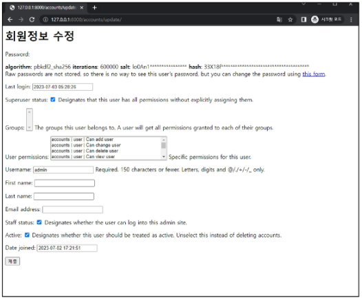
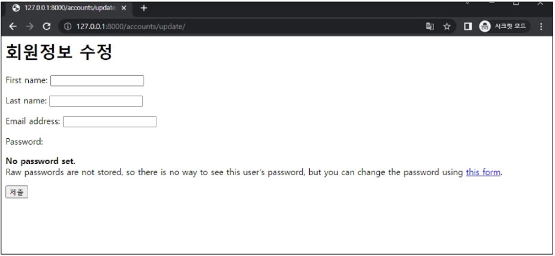

## Django 09 (2025.04.03)

### 회원 가입

#### 1. 회원 가입

- User 객체를 Create하는 과정

#### 2. UserCreationForm()

- 회원 가입 시 사용자 입력 데이터를 받는 built-in ModelForm

#### 3. 회원 가입 페이지 작성

- class Meta: model = User가 작성된 Form이기 때문에 accounts/forms.py 파일로 커스텀해주지 않으면, Manager isn’t available; ‘auth.User’ has been swapped for ‘accounts.User’ 에러가 생성
    - 아래와 같은 설정 때문
    
    ```python
    AUTH_USER_MODEL = 'accounts.User'
    ```
    

- 커스텀 유저 모델을 사용하기 위해 재작성해야 하는 Form
    1. UserCreationForm
    2. UserChangeForm

- accounts/forms.py

```python
# accounts/forms.py
from django.contrib.auth import get_user_model
from django.contrib.auth.forms import UserCreationForm

class CustomUserCreationForm(UserCreationForm):
    class Meta(UserCreationForm.Meta):
        model = get_user_model()
```

- accounts/urls.py

```python
# accounts/urls.py
from django.urls import path
from . import views

app_name = 'accounts'
urlpatterns = [
    path('login/', views.login, name='login'),
    path('logout/', views.logout, name='logout'),
    path("signup", views.signup, name="signup"),
]
```

- accounts/views.py

```python
# accounts/signup.views.py
from .forms import CustomUserCreationForm

def signup(request):
    if request.method == "POST":
        form = CustomUserCreationForm(request.POST)
        if form.is_valid():
            form.save()
            return redirect("articles:index")
    else:
        # 회원 가입 템플릿의 회원 정보 작성을 위한 form을 응답
        form = CustomUserCreationForm()
    context = {
        "form": form,
    }
    return render(request, "accounts/signup.html", context)
```

- accounts/signup.html

```html
 accounts/signup.html 
<!DOCTYPE html>
<html lang="en">
<head>
  <meta charset="UTF-8">
  <meta name="viewport" content="width=device-width, initial-scale=1.0">
  <title>Document</title>
</head>
<body>
  <h1>회원가입</h1>
  <form action="" method="POST">
    
    {{form.as_p}}
    <input type="submit" value="SIGN UP">
  </form>
</body>
</html>
```

#### 4. get_user_model()

- “현재 프로젝트에서 활성화된 사용자 모델(active user model)”을 반환하는 함수

#### 5. User 모델을 직접 참조하지 않는 이유

- get_user_model()을 사용해 User 모델을 참조하면 커스텀 User 모델을 자동으로 반환해주기 때문
- Django는 필수적으로 User 클래스를 직접 참조하는 대신 get_user_model()을 사용해 참조해야 한다고 강조하고 있음
- User model 참조에 대한 자세한 내용은 추후 모델 관계에서 다룰 예정

---

### 회원 탈퇴

#### 1. 회원 탈퇴

- User 객체를 Delete하는 과정

- accounts/urls.py

```python
# accounts/urls.py
from django.urls import path
from . import views

app_name = 'accounts'
urlpatterns = [
    path("delete/", views.delete, name="delete"),
]
```

- accounts/views.py

```python
# accounts/views.py
def delete(request):
    """
    유저를 조회해야 필요 없이,
    회원 탈퇴는 로그인 된 상태에서 요청을 보내서,
    요청 객체 안에 회원 정보가 담겨 있음 (request.user)
    """
    request.user.delete()
    return redirect("articles:index")
```

---

### 회원 정보 수정

#### 1. 회원 정보 수정

- User 객체를 Update하는 과정

- accounts/forms.py

```python
# accounts/forms.py
from django.contrib.auth import get_user_model
from django.contrib.auth.forms import UserChangeForm

class CustomUserChangeForm(UserChangeForm):
    class Meta(UserChangeForm.Meta):
        model = get_user_model()
```

- accounts/urls.py

```python
# accounts/urls.py
from django.urls import path
from . import views

app_name = 'accounts'
urlpatterns = [
    path("delete/", views.delete, name="delete"),
    path("update/", views.update, name="update"),
]

```

- accounts/views.py

```python
# accounts/views.py
def update(request):
    if request.method == "POST":
        # 기존 유저 정보 (request.user)
        form = CustomUserChangeForm(request.POST, instance=request.user)
        if form.is_valid():
            form.save()
            return redirect("articles:index")
    else:
        form = CustomUserChangeForm(instance=request.user)
    context = {
        "form": form,
    }
    return render(request, "accounts/update.html", context)
```

- accounts/update.html

```html
 accounts/update.html 
<!DOCTYPE html>
<html lang="en">
<head>
  <meta charset="UTF-8">
  <meta name="viewport" content="width=device-width, initial-scale=1.0">
  <title>Document</title>
</head>
<body>
  <h1>회원정보 수정</h1>
  <form action="" method="POST">
    
    {{form.as_p}}
    <input type="submit" value="회원 정보 수정">
  </form>
</body>
</html>
```

#### 2. UserChangeForm()

- 회원 정보 수정 시 사용자 입력 데이터를 받는 built-in ModelForm

#### 3. UserChangeForm 사용 시 문제점

- User 모델의 모든 정보들(fields)까지 모두 출력됨



- 일반 사용자들이 접근해서는 안 되는 정보는 출력하지 않도록 해야 함
- CustomUserChangeForm에서 출력 필드 재조정해야 함

```python
# accounts/forms.py
from django.contrib.auth import get_user_model
from django.contrib.auth.forms import UserChangeForm

class CustomUserChangeForm(UserChangeForm):
    class Meta(UserChangeForm.Meta):
        model = get_user_model()
        fields = (
            "first_name",
            "last_name",
            "email",
        )
```



---

### 비밀번호 변경

#### 1. 비밀번호 변경

- 인증된 사용자의 Session 데이터를 Update하는 과정
- Django는 비밀번호 변경 페이지를 회원 정보 수정 form 하단에서 별도 주소로 안내
    - /user_pk/password/

- crud/urls.py

```python
# crud/urls.py
from accounts import views

urlpatterns = [
    path("<int:user_pk>/password/", views.change_password, name="change_password"),
]
```

- accounts/views.py

```python
# accounts/views.py
def change_password(request, user_pk):
    if request.method == "POST":
        form = PasswordChangeForm(request.user, request.POST)
        if form.is_valid():
            form.save()
            return redirect("articles:index")
    else:
        form = PasswordChangeForm(request.user)
    context = {
        "form": form,
    }
    return render(request, "accounts/change_password.html", context)
```

- accounts/change_password.html

```html
 accounts/change_password.html 
<!DOCTYPE html>
<html lang="en">
<head>
  <meta charset="UTF-8">
  <meta name="viewport" content="width=device-width, initial-scale=1.0">
  <title>Document</title>
</head>
<body>
  <h1>비밀번호 변경</h1>
  <form action="" method="POST">
    
    {{form.as_p}}
    <input type="submit" value="비밀번호 변경">
  </form>
</body>
</html>
```

#### 2. PasswordChangeForm()

- 비밀번호 변경 시 사용자 입력 데이터를 받는 built-in Form

#### 3. 암호 변경 시 세션 무효화

- 비밀번호가 변경되면 기존 세션과의 회원 인증 정보가 일치하지 않게 되어 로그인 상태가 유지되지 못하고, 로그아웃 처리됨
- 비밀번호가 변경되면서 기존 세션과의 회원 인증 정보가 일치하지 않기 때문

#### 4. update_session_auth_hash(request, user)

- 암호 변경 시 세션 무효화를 막아주는 함수
- 암호가 변경되면 새로운 password의 Session Data로 기존 session을 자동으로 갱신

```python
# accounts/views.py
from django.contrib.auth import update_session_auth_hash

def change_password(request, user_pk):
    if request.method == "POST":
        form = PasswordChangeForm(request.user, request.POST)
        if form.is_valid():
            user = form.save()
            update_session_auth_hash(request, user)
            return redirect("articles:index")
    else:
        form = PasswordChangeForm(request.user)
    context = {
        "form": form,
    }
    return render(request, "accounts/change_password.html", context)
```

---

### 인증된 사용자에 대한 접근 제한

#### 1. 로그인 사용자에 대해 접근을 제한하는 2가지 방법

1. is_authenticated 속성
2. login_required 데코레이터

#### 2. is_authenticated

- 사용자가 인증 되었는지 여부를 알 수 있는 User model의 속성
- 모든 User 인스턴스에 대해 항상 True인 읽기 전용 속성
    - 메서드가 아닌 속성 값임
- 비인증 사용자에 대해서는 항상 False
- 예시
    - 로그인과 비로그인 상태에서 화면에 출력되는 링크를 다르게 설정하기
    
    ```html
     articles/index.html 
    <!DOCTYPE html>
    <html lang="en">
    <head>
      <meta charset="UTF-8">
      <meta name="viewport" content="width=device-width, initial-scale=1.0">
      <title>Document</title>
    </head>
    <body>
      <h1>Articles</h1>
      
        <h1>안녕하세요, {{ user.username }}님</h1>
        <form action="" method="POST">
          
          <input type="submit" value="로그아웃">
        </form>
        <a href="">[]CREATE]</a>
        <br>
        <form action="">
          
          <input type="submit" value="회원 탈퇴">
        </form>
        <a href="">회원 정보 수정</a>
      
        <a href="">[SIGN UP]</a>
        <br>
        <a href="">로그인</a>
      
      <hr>
      
        <p>글 번호: {{ article.pk }}</p>
        <a href="">
          <p>글 제목: {{ article.title }}</p>
        </a>
        <p>글 내용: {{ article.content }}</p>
        <hr>
      
    </body>
    </html>
    ```
    
    - 인증된 사용자라면 로그인/회원 가입 로직을 수행할 수 없도록 하기
    
    ```python
    # accounts/views.py
    def login(request):
        if request.user.is_authenticated:
            return redirect("articles:index")
        
    def signup(request):
        if request.user.is_authenticated:
            return redirect("articles:index")
    ```
    

#### 3. login_required

- 인증된 사용자에 대해서만 view 함수를 실행시키는 데코레이터
- 비인증 사용자의 경우 /accounts/login/ 주소로 redirect시킴
- 예시
    - 인증된 사용자만 게시글을 작성/수정/삭제할 수 있도록 수정
    
    ```python
    # articles/views.py
    from django.contrib.auth.decorators import login_required
    
    @login_required
    def create(request):
        pass
    
    @login_required
    def delete(request, article_pk):
        pass
    
    @login_required
    def update(request, article_pk):
        pass
    ```
    
    - 인증된 사용자만 로그아웃/탈퇴/수정/비밀번호 변경할 수 있도록 수정
    
    ```python
    # accounts/views.py
    from django.contrib.auth.decorators import login_required
    
    @login_required
    def logout(request):
        pass
    
    @login_required
    def delete(request):
        pass
    
    @login_required
    def update(request):
        pass
    
    @login_required
    def change_password(request):
        pass
    ```
    

---

### 참고

#### 1. 회원 가입 후 로그인까지 이어서 진행하기

- 회원 가입 성공한 user 객체를 활용해 login 진행

```python
# accounts/views.py
def signup(request):
    if request.user.is_authenticated:
        return redirect("articles:index")
    if request.method == "POST":
        form = CustomUserCreationForm(request.POST)
        if form.is_valid():
            user = form.save()
            # 회원 가입 정보로 로그인인
            auth_login(request, user)
            return redirect("articles:index")
    else:
        # 회원 가입 템플릿의 회원 정보 작성을 위한 form을 응답
        form = CustomUserCreationForm()
    context = {
        "form": form,
    }
    return render(request, "accounts/signup.html", context)
```