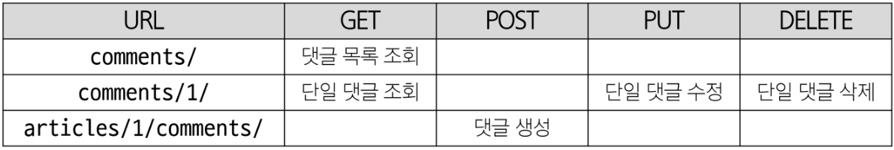

## Django 11 (2025.04.17)

### DRF with N:1 Relation

#### 1. URL 및 HTTP request method 구성



#### 2. 읽기 전용 필드

- 클라이언트가 데이터 생성 또는 수정 요청을 보낼 때 해당 필드에 값을 제공하거나 변경할 수 없으며, 서버가 응답 시에만 값을 표시하는 필드

#### 3. 읽기 전용 필드 사용 목적

- 클라이언트 측에서 직접 수정하면 안 되는 경우
- 서버 로직에 의해 자동 생성/관리되는 값 활용
- 입력은 받지 않지만 정보를 제공해야 하는 경우
- 새로운 필드 값(추가 계산, 가공)을 만들어 제공해야 하는 경우

#### 4. 읽기 전용 필드 특징 및 주의사항

- 유효성 검사에서 제외됨
    - 읽기 전용 필드는 클라이언트가 보내는 요청 데이터에서 고려되지 않으므로, 유효성 검사 대상에서 제외됨
- 생성/수정 요청 모두에서 적용 가능
    - 읽기 전용 필드라 해서 생성(POST) 단계에서만 무의미한 것은 아님
    - 수정(PUT) 요청에서도 해당 필드는 여전히 클라이언트 입력을 받지 않고, 응답 시에만 노출됨

#### 5. 읽기 전용 필드 정리

- 서버가 관리하거나 계산하는 값, 클라이언트가 변경할 수 없어야 하는 값, 또는 단순히 조회 목적으로 제공해야 하는 값을 나타내는 데 유용
- 이를 통해 API 응답 구조를 명확히 하고, 데이터 무결성을 유지하며, 불필요한 클라이언트 입력 처리를 방지

#### 6. 읽기 전용 필드 지정 주의사항

- 특정 필드를 override 혹은 추가한 경우 read_only_fields는 동작하지 않음
- 이런 경우 새로운 필드에 read_only 키워드 인자로 작성해야 함

#### 7. read_only_fields 속성과 read_only 인자

- read_only_fields
    - 기존 외래 키 필드 값을 그대로 응답 데이터에 제공하기 위해 지정하는 경우
    
    ```python
    # articles/serializers.py
    class CommentSerializer(serializers.ModelSerializer):
        class Meta:
            model = Comment
            fields = "__all__"
            read_only_fields = (
    	          "article",
            )
    ```
    

- read_only
    - 기존 외래 키 필드 값의 결과를 다른 값으로 덮어쓰는 경우
    - 새로운 응답 데이터 값을 제공하는 경우
    
    ```python
    # articles/serializers.py
    class CommentSerializer(serializers.ModelSerializer):
        # 외래 키 필드 article의 데이터를 재구성하기 위한 도구
        class ArticleTitleSerializer(serializers.ModelSerializer):
            class Meta:
                model = Article
                fields = (
                    "id",
                    "title",
                )
    
        class Meta:
            model = Comment
            fields = "__all__"
            # read_only_fields = (
    	      #     "article",
            # )
    ```
    

---

### 역참조 데이터 구성

#### 1. Article → Comment 간 역참조 관계를 활용한 JSON 데이터 재구성

- 아래 2가지 사항에 대한 데이터 재구성하기
    1. 단일 게시글 조회 시 해당 게시글에 작성된 댓글 목록도 함께 붙여서 응답
    2. 단일 게시글 조회 시 해당 게시글에 작성된 댓글 개수도 함께 붙여서 응답

#### 2. 단일 게시글 + 댓글 목록

- Nested relationships (역참조 매니저 활용)
    - 모델 관계 상으로 참조하는 대상은 참조되는 대상의 표현에 포함되거나 중첩될 수 있음
    - 이러한 중첩된 관계는 serializers를 필드로 사용하여 표현 가능
    
    ```python
    # articles/serializers.py
    # 게시글의 전체 필드를 직렬화하는 클래스
    class ArticleSerializer(serializers.ModelSerializer):
        class Meta:
            model = Article
            fields = '__all__'
        
        # comment_set에 활용할 댓글 데이터를 가공하는 도구
        class CommentDetailSerializer(serializers.ModelSerializer):
            class Meta:
                model = Comment
                fields = (
                    "id",
                    "content",
                )
    
        # 기존에 있던 역참조 매니저인 comment_set의 값을 덮어쓰기
        # read_only 속성 값을 설정해주지 않으면 is_valid()에서 걸림
        comment_set = CommentDetailSerializer(read_only=True, many=True)
    ```
    

#### 3. View 로직 개선: annotate 사용

- View에서 Article 객체를 조회할 때 annotate를 활용해 num_of_comments 필드를 추가
    - annotate는 Django ORM 함수로, SQL의 집계 함수를 활용하여 쿼리 단계에서 데이터 가공을 수행
- 다음과 같이 댓글 수를 세어 num_of_comments라는 필드를 추가
- 이제 serializer.data를 반환하면, 해당 article 객체네는 num_of_comments라는 “주석(annotate) 필드”가 포함되어 있음

```python
# articles/views.py
from django.db.models import Count

@api_view(['GET', 'DELETE', 'PUT'])
def article_detail(request, article_pk):
    # 단일 게시글 데이터 조회
    # article = Article.objects.get(pk=article_pk)
    # 단일 게시글 데이터 조회 + 그 단일 게시글에 작성된 댓글의 개수도 계산해달라고 DB에 한 번에 요청
    article = Article.objects.annotate(num_of_comments=Count("comment")).get(pk=article_pk)
```

#### 4. Serializer 개선: SerializerMethodField 사용

- SerializerMethodField는 읽기 전용 필드를 커스터마이징 하는데 사용
- 이 필드를 선언한 뒤 get_<필드명> 메서드를 정의하면, 해당 메서드의 반환 값이 직렬화 결과에 포함됨
- 이제 serializer.data를 호출할 때, get_num_of_comments 메서드가 실행되어 num_of_comments 값이 자동으로 포함됨
- 추가적으로 view에서 data를 딕셔너리로 변환하거나 수정할 필요 없이, serializer.data를 바로 반환해도 최종 JSON 응답에 num_of_comments 값이 반영됨

```python
# articles/serializers.py
# 게시글의 전체 필드를 직렬화하는 클래스
class ArticleSerializer(serializers.ModelSerializer):
    # 새로운 필드 생성 (댓글 개수를 담기 위한 새로운 필드)
    num_of_comments = serializers.SerializerMethodField()

    # SerializerMethodField의 값을 채울 함수
    # 이 함수는 반드시 get_<SerializerMethodField의 필드이름>으로 맞춰줘야 자동으로 호출됨
    def get_num_of_comments(self, obj):
        # 여기서 obj는 특정 게시글 인스턴스 (3번 게시글이면 3번 객체, ...)
        # view 함수에서 annotate해서 생긴 새로운 속성 결과를 사용할 수 있게 됨
        return obj.num_of_comments

```

---

### SerializerMethodField

#### 1. SerializerMethodField

- DRF에서 제공하는 읽기 전용 필드
- Serializer에서 추가적인 데이터 가공을 하고 싶을 때 사용
    - 예시
        - 특정 필드 값을 조합해 새로운 문자열 필드를 만들거나, 부가적인 계산(비율, 합계, 평균)을 하는 경우 등

#### 2. SerializerMethodField 동작 원리

```python
class UserSerializer(serializers.ModelSerializer):
    full_name = serializers.SerializerMethodField()
    
    class Meta:
        model = User
        fields = (
            "id",
            "username",
            "full_name",
            "email",
        )
        
    def get_full_name(self, obj):
        return f"{obj.first_name} {obj.last_name}"
```

1. SerializerMethodField를 Serializer 클래스 내에서 필드로 선언하면, DRF는 get_<필드명>이라는 이름을 가진 메서드를 자동으로 찾음
2. 예를 들어, full_name = serializers.SerializerMethodField()라고 선언하면, DRF는 get_full_name(self, obj) 메서드를 찾아 해당 값을 직렬화 결과에 넣어줌
3. obj는 현재 직렬화 중인 모델 인스턴스이며, 이 메서드에서 obj의 속성이나 annotate된 필드를 활용해 새 값을 만들 수 있음

#### 3. SerializerMethodField 주의사항

- 읽기 전용으로 생성(POST), 수정(PUT) 요청 시에는 사용되지 않음
- get_ 메서드는 반드시 (self, obj) 형태로 정의해야 하며, obj는 현재 직렬화 중인 모델 인스턴스를 의미

#### 4. SerializerMethodField 사용 목적

1. 유연성
    1. 다양한 계산 로직을 손쉽게 추가 기능
2. 가독성
    1. 데이터 변환 과정을 Serializer 내부 메서드로 명확히 분리
3. 유지보수성
    1. view나 model에 비해 Serializer 측 로직 변경이 용이
4. 일관성
    1. view에서 별도로 data 수정 없이도 직렬화 결과를 제어

#### 5. 금일 최종 코드

- drf/settings.py

```python
# drf/settings.py
"""
Django settings for drf project.

Generated by 'django-admin startproject' using Django 4.2.20.

For more information on this file, see
https://docs.djangoproject.com/en/4.2/topics/settings/

For the full list of settings and their values, see
https://docs.djangoproject.com/en/4.2/ref/settings/
"""

from pathlib import Path

# Build paths inside the project like this: BASE_DIR / 'subdir'.
BASE_DIR = Path(__file__).resolve().parent.parent

# Quick-start development settings - unsuitable for production
# See https://docs.djangoproject.com/en/4.2/howto/deployment/checklist/

# SECURITY WARNING: keep the secret key used in production secret!
SECRET_KEY = (
    "django-insecure-62#0!((l6y6udl$(ady$pz3xon-hmn#bvm#4tv06@hruvp%t8i"
)

# SECURITY WARNING: don't run with debug turned on in production!
DEBUG = True

ALLOWED_HOSTS = []

# Application definition

INSTALLED_APPS = [
    "articles",
    "drf_spectacular",
    "rest_framework",
    "django.contrib.admin",
    "django.contrib.auth",
    "django.contrib.contenttypes",
    "django.contrib.sessions",
    "django.contrib.messages",
    "django.contrib.staticfiles",
]

REST_FRAMEWORK = {
    # YOUR SETTINGS
    'DEFAULT_SCHEMA_CLASS': 'drf_spectacular.openapi.AutoSchema',
}

SPECTACULAR_SETTINGS = {
    'TITLE': 'Your Project API',
    'DESCRIPTION': 'Your project description',
    'VERSION': '1.0.0',
    'SERVE_INCLUDE_SCHEMA': False,
    # OTHER SETTINGS
}

MIDDLEWARE = [
    "django.middleware.security.SecurityMiddleware",
    "django.contrib.sessions.middleware.SessionMiddleware",
    "django.middleware.common.CommonMiddleware",
    "django.middleware.csrf.CsrfViewMiddleware",
    "django.contrib.auth.middleware.AuthenticationMiddleware",
    "django.contrib.messages.middleware.MessageMiddleware",
    "django.middleware.clickjacking.XFrameOptionsMiddleware",
]

ROOT_URLCONF = "drf.urls"

TEMPLATES = [
    {
        "BACKEND": "django.template.backends.django.DjangoTemplates",
        "DIRS": [],
        "APP_DIRS": True,
        "OPTIONS": {
            "context_processors": [
                "django.template.context_processors.debug",
                "django.template.context_processors.request",
                "django.contrib.auth.context_processors.auth",
                "django.contrib.messages.context_processors.messages",
            ],
        },
    },
]

WSGI_APPLICATION = "drf.wsgi.application"

# Database
# https://docs.djangoproject.com/en/4.2/ref/settings/#databases

DATABASES = {
    "default": {
        "ENGINE": "django.db.backends.sqlite3",
        "NAME": BASE_DIR / "db.sqlite3",
    }
}

# Password validation
# https://docs.djangoproject.com/en/4.2/ref/settings/#auth-password-validators

AUTH_PASSWORD_VALIDATORS = [
    {
        "NAME": "django.contrib.auth.password_validation.UserAttributeSimilarityValidator",
    },
    {
        "NAME": "django.contrib.auth.password_validation.MinimumLengthValidator",
    },
    {
        "NAME": "django.contrib.auth.password_validation.CommonPasswordValidator",
    },
    {
        "NAME": "django.contrib.auth.password_validation.NumericPasswordValidator",
    },
]

# Internationalization
# https://docs.djangoproject.com/en/4.2/topics/i18n/

LANGUAGE_CODE = "en-us"

TIME_ZONE = "UTC"

USE_I18N = True

USE_TZ = True

# Static files (CSS, JavaScript, Images)
# https://docs.djangoproject.com/en/4.2/howto/static-files/

STATIC_URL = "static/"

# Default primary key field type
# https://docs.djangoproject.com/en/4.2/ref/settings/#default-auto-field

DEFAULT_AUTO_FIELD = "django.db.models.BigAutoField"
```

- drf/urls.py

```python
# drf/urls.py
"""
URL configuration for drf project.

The `urlpatterns` list routes URLs to views. For more information please see:
    https://docs.djangoproject.com/en/4.2/topics/http/urls/
Examples:
Function views
    1. Add an import:  from my_app import views
    2. Add a URL to urlpatterns:  path('', views.home, name='home')
Class-based views
    1. Add an import:  from other_app.views import Home
    2. Add a URL to urlpatterns:  path('', Home.as_view(), name='home')
Including another URLconf
    1. Import the include() function: from django.urls import include, path
    2. Add a URL to urlpatterns:  path('blog/', include('blog.urls'))
"""

from django.contrib import admin
from django.urls import path, include

from drf_spectacular.views import SpectacularAPIView, SpectacularRedocView, SpectacularSwaggerView

urlpatterns = [
    path("admin/", admin.site.urls),
    path('api/v1/', include('articles.urls')),
    # YOUR PATTERNS
    path('api/schema/', SpectacularAPIView.as_view(), name='schema'),
    # Optional UI:
    path('api/schema/swagger-ui/', SpectacularSwaggerView.as_view(url_name='schema'), name='swagger-ui'),
    path('api/schema/redoc/', SpectacularRedocView.as_view(url_name='schema'), name='redoc'),
]
```

- articles/urls.py

```python
# articles/urls.py
from django.urls import path
from articles import views

urlpatterns = [
    path('articles/', views.article_list),
    path('articles/<int:article_pk>/', views.article_detail),
    path('comments/', views.comment_list),
    path('comments/<int:comment_pk>/', views.comment_detail),
    path('articles/<int:article_pk>/comments/', views.comment_create),
]
```

- articles/serializers.py

```python
# articles/serializers.py
from rest_framework import serializers
from .models import Article, Comment

# 게시글의 일부 필드를 직렬화하는 클래스
class ArticleListSerializer(serializers.ModelSerializer):
    class Meta:
        model = Article
        fields = (
            'id',
            'title',
            'content',
        )

# 게시글의 전체 필드를 직렬화하는 클래스
class ArticleSerializer(serializers.ModelSerializer):
    class Meta:
        model = Article
        fields = '__all__'
    
    # comment_set에 활용할 댓글 데이터를 가공하는 도구
    class CommentDetailSerializer(serializers.ModelSerializer):
        class Meta:
            model = Comment
            fields = (
                "id",
                "content",
            )

    # 기존에 있던 역참조 매니저인 comment_set의 값을 덮어쓰기
    # read_only 속성 값을 설정해주지 않으면 is_valid()에서 걸림
    comment_set = CommentDetailSerializer(read_only=True, many=True)

    # 새로운 필드 생성 (댓글 개수를 담기 위한 새로운 필드)
    num_of_comments = serializers.SerializerMethodField()

    # SerializerMethodField의 값을 채울 함수
    # 이 함수는 반드시 get_<SerializerMethodField의 필드이름>으로 맞춰줘야 자동으로 호출됨
    def get_num_of_comments(self, obj):
        # 여기서 obj는 특정 게시글 인스턴스 (3번 게시글이면 3번 객체, ...)
        # view 함수에서 annotate해서 생긴 새로운 속성 결과를 사용할 수 있게 됨
        return obj.num_of_comments

# 댓글의 일부 필드를 직렬화하는 클래스
class CommentListSerializer(serializers.ModelSerializer):
    # 외래 키 필드 article의 데이터를 재구성하기 위한 도구
    class ArticleTitleSerializer(serializers.ModelSerializer):
        class Meta:
            model = Article
            fields = (
                "id",
                "title",
            )

    # 외래 키 필드인 article의 데이터를 재구성
    article = ArticleTitleSerializer(read_only=True)

    class Meta:
        model = Comment
        fields = (
            "id",
            "content",
            "article",
        )

# 댓글의 전체 필드를 직렬화하는 클래스
class CommentSerializer(serializers.ModelSerializer):
    # 외래 키 필드 article의 데이터를 재구성하기 위한 도구
    class ArticleTitleSerializer(serializers.ModelSerializer):
        class Meta:
            model = Article
            fields = (
                "id",
                "title",
            )

    # 외래 키 필드인 article의 데이터를 재구성
    article = ArticleTitleSerializer(read_only=True)

    class Meta:
        model = Comment
        fields = "__all__"
        # 외래 키 필드를 유효성 검사 목록에서 제외해야 함
        # 읽기 전용 필드로 설정 -> 하지만 응답 데이터에는 포함되어 있어야 함
        # read_only_fields = (
        #     "article",
        # )
```

- articles/models.py

```python
# articles/models.py
from django.db import models

class Article(models.Model):
    title = models.CharField(max_length=10)
    content = models.TextField()
    created_at = models.DateTimeField(auto_now_add=True)
    updated_at = models.DateTimeField(auto_now=True)

class Comment(models.Model):
    article = models.ForeignKey(Article, on_delete=models.CASCADE)
    content = models.CharField(max_length=200)
    created_at = models.DateTimeField(auto_now_add=True)
    updated_at = models.DateTimeField(auto_now=True)
```

- articles/views.py

```python
# articles/views.py
from rest_framework.response import Response
from rest_framework.decorators import api_view
from rest_framework import status

from django.shortcuts import get_object_or_404, get_list_or_404
from django.db.models import Count

from .models import Article, Comment
from .serializers import ArticleListSerializer, ArticleSerializer, CommentListSerializer, CommentSerializer

@api_view(['GET', 'POST'])
def article_list(request):
    if request.method == 'GET':
        # 전체 게시글 데이터 조회
        articles = get_list_or_404(Article)
        # articles는 django에서는 쓸 수 있는 queryset 데이터 타입이기 때문에
        # 우리가 만든 모델시리얼라이저로 변환 진행
        serializer = ArticleListSerializer(articles, many=True)
        # DRF에서 제공하는 Response를 사용해 JSON 데이터를 응답
        # JSON 데이터는 serializer의 data 속성에 존재
        return Response(serializer.data)

    # 게시글 생성 요청에 대한 응답
    elif request.method == 'POST':
        # 예전 코드
        # form = ArticleFrom(request.POST)
        # 사용자가 보낸 데이터를 클래스로 받아서 직렬화
        serializer = ArticleSerializer(data=request.data)
        # 유효성 검사
        if serializer.is_valid():
            serializer.save()
            return Response(serializer.data, status=status.HTTP_201_CREATED)
        return Response(serializer.errors, status=status.HTTP_400_BAD_REQUEST)

@api_view(['GET', 'DELETE', 'PUT'])
def article_detail(request, article_pk):
    # 단일 게시글 데이터 조회
    # article = Article.objects.get(pk=article_pk)
    # 단일 게시글 데이터 조회 + 그 단일 게시글에 작성된 댓글의 개수도 계산해달라고 DB에 한 번에 요청
    article = Article.objects.annotate(num_of_comments=Count("comment")).get(pk=article_pk)
    print(article.pk)
    print(article.title)
    print(article.content)
    print(article.num_of_comments)
    if request.method == 'GET':
        # ArticleSerializer 클래스로 직렬화를 진행
        serializer = ArticleSerializer(article)
        return Response(serializer.data)
    elif request.method == 'DELETE':
        article.delete()
        return Response(status=status.HTTP_204_NO_CONTENT)
    elif request.method == 'PUT':
        # 사용자가 보낸 수정 데이터를 직렬화
        serializer = ArticleSerializer(article, data=request.data, partial=True)
        # serializer = ArticleSerializer(instance=article, data=request.data, partial=True)
        if serializer.is_valid():
            serializer.save()
            return Response(serializer.data)
        return Response(serializer.errors, status=status.HTTP_400_BAD_REQUEST)

@api_view(["GET"])
def comment_list(request):
    # 댓글 전체 조회
    comments = get_list_or_404(Comment)
    # 댓글 데이터를 가공
    serializer = CommentListSerializer(comments, many=True)
    return Response(serializer.data)

@api_view(["GET", "PUT", "DELETE"])
def comment_detail(request, comment_pk):
    # 특정 댓글 데이터를 조회
    comment = get_object_or_404(Comment, pk=comment_pk)
    if request.method == "GET":
        # 조회한 단일 댓글 데이터를 가공
        serializer = CommentSerializer(comment)
        return Response(serializer.data)
    elif request.method == "PUT":
        # 사용자가 보낸 새로운 댓글 데이터와 기존 데이터를 활용해 가공
        serializer = CommentSerializer(comment, data=request.data)
        # 유효성 검사
        if serializer.is_valid(raise_exception=True):
            serializer.save()
            return Response(serializer.data)
    elif request.method == "DELETE":
        comment.delete()
        return Response(status=status.HTTP_204_NO_CONTENT)

@api_view(["POST"])
def comment_create(request, article_pk):
    # 어떤 게시글에 작성되는 댓글인지 단일 게시글을 조회
    article = get_object_or_404(Article, pk=article_pk)
    # 사용자가 보낸 댓글 데이터를 활용해 가공
    serializer = CommentSerializer(data=request.data)
    # 유효한지 검사
    if serializer.is_valid(raise_exception=True):
        serializer.save(article=article)
        return Response(serializer.data, status=status.HTTP_201_CREATED)
```

---

### API 문서화

#### 1. OpenAPI Specification (OAS)

- RESTful API를 설명하고 시각화하는 표준화된 방법
- API에 대한 세부사항을 기술할 수 있는 공식 표준

#### 2. API 문서 프레임워크

- OAS 기반 API에 대한 문서를 생성하는 데 도움을 주는 오픈 소스 프레임워크의 종류
    1. Swagger
    2. Redoc

#### 3. drf-spectacular 라이브러리

1. DRF 위한 OpenAPI 3.0 구조 생성을 도와주는 라이브러리
    1. 설치 및 등록
    
    ```bash
    $ pip install drf-spectacular
    ```
    
    ```python
    # settings.py
    INSTALLED_APPS = [
    	...,
    	"drf_spectacular",
    	...,
    ]
    ```
    

2. 관련 설정 코드 입력 (OpenAPI 구조 자동 생성 코드)

```python
# settings.py
REST_FRAMEWORK = {
    # YOUR SETTINGS
    'DEFAULT_SCHEMA_CLASS': 'drf_spectacular.openapi.AutoSchema',
}

# 아래 설정은 선택
SPECTACULAR_SETTINGS = {
    'TITLE': 'Your Project API',
    'DESCRIPTION': 'Your project description',
    'VERSION': '1.0.0',
    'SERVE_INCLUDE_SCHEMA': False,
    # OTHER SETTINGS
}
```

3. swagger, redoc 페이지 제공을 위한 url 작성

```bash
# drf/urls.py
from drf_spectacular.views import SpectacularAPIView, SpectacularRedocView, SpectacularSwaggerView
urlpatterns = [
    ...,
    # YOUR PATTERNS
    path('api/schema/', SpectacularAPIView.as_view(), name='schema'),
    # Optional UI:
    path('api/schema/swagger-ui/', SpectacularSwaggerView.as_view(url_name='schema'), name='swagger-ui'),
    path('api/schema/redoc/', SpectacularRedocView.as_view(url_name='schema'), name='redoc'),
]
```

#### 4. “설계 우선” 접근법

- OAS의 핵심 이점
- API를 먼저 설계하고 명세를 작성한 후, 이를 기반으로 코드를 구현하는 방식
- API의 일관성을 유지하고, API 사용자는 더 쉽게 API를 이해하고 사용할 수 있음
- 또한, OAS를 사용하면 API가 어떻게 작동하는지를 시각적으로 보여주는 문서를 생성할 수 있으며, 이는 API를 이해하고 테스트하는 데 매우 유용
- 이런 목적으로 사용되는 도구가 Swagger-UI 또는 ReDoc

---

### 올바르게 404 응답하기

#### 1. Django shortcuts functions

- 포함된 메서드 종류
    1. render()
    2. redirect()
    3. get_object_or_404()
    4. get_list_or_404()

#### 2. get_object_or_404()

- 모델 manager objects에서 get()을 호출하지만, 해당 객체가 없을 땐 기존 DoesNotExist 예외 대신 Http404를 raise함

#### 3. get_object_or_404() 적용

```python
# articles/views.py
articles = Article.objects.get(pk=article_pk)
comments = Comment.objects.get(pk=comment_pk)
```

```python
# articles/views.py
from django.shortcuts import get_object_or_404
from django.db.models import Count

article = get_object_or_404(Article, pk=article_pk)
article = get_object_or_404(
    Article.objects.annotate(num_of_comments=Count("comment")),
    pk=article_pk
)
comment = get_object_or_404(Comment, pk=comment_pk)
```

#### 4. get_list_or_404()

- 모델 manager objects에서 filter()의 결과를 반환하고, 해당 객체 목록이 없을 땐 Http404를 raise함

#### 5. get_list_or_404() 적용

```python
# articles/views.py
articles = Article.objects.all()
comments = Comment.objects.all()
```

```python
# articles/views.py
from django.shortcuts import get_list_or_404

articles = get_list_or_404(Article)
comments = get_list_or_404(Comment)
```

#### 6. 사용하는 이유

- 클라이언트에게 “서버에 오류가 발생하여 요청을 수행할 수 없다(500)”라는 원인이 정확하지 않은 에러를 제공하기 보다는, 적절한 예외 처리를 통해 클라이언트에게 보다 정확한 에러 현황을 전달하는 것도 매우 중요한 개발 요소 중 하나이기 때문

---

### View와 Serializer의 역할

#### 1. View와 Serializer

- DRF에서는 비즈니스 로직(데이터 가공, annotate, 필터링)을 view나 queryset 로직에서 처리하고, serializer는 그 결과물을 직렬화하는 역할에 집중하는 것이 일반적인 권장사항
- 복잡한 query나 로직은 View 함수에서 진행
    - 여러 모델을 조인하거나 복잡한 집계가 필요한 경우 View 함수에서 처리
    - 필요한 경우 View 함수에서 select_related()나 prefetch_related()를 사용하여 query를 최적화