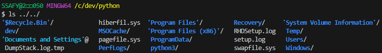
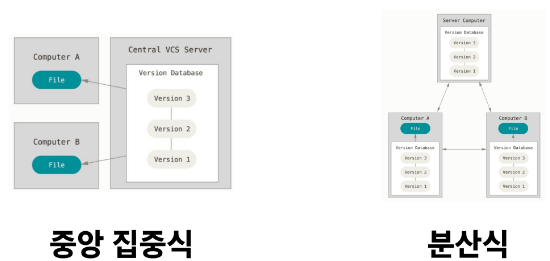

## CLI (2025.01.16)

### 개요

#### 1. CLI (Command Line Interface)

- 명령어를 통해 사용자와 컴퓨터가 상호 작용하는 방식

#### 2. GUI (Graphic User Interface)

- 그래픽을 통해 사용자와 컴퓨터가 상호 작용하는 방식

#### 3. 왜 CLI를 사용해야 할까?

- 효율성
    - CLI는 키보드만으로 모든 작업을 수행할 수 있으며, 메모리와 CPU 사용량이 적어 저사양 시스템에서도 효율적을 동작
- 정밀한 제어
    - 특정 프로그램이나 시스템의 세부 설정을 보다 정밀하게 제어할 수 있음
- 표준성
    - CLI 명령어는 대부분의 Unix 운영체제 기반 시스템에서 동일하게 작동하여 여러 환경에서 적용할 수 있음

---

### 문법 및 활용

#### 1. CLI에서 ‘.’(점)의 역할

- `.`
    - 현재 디렉토리
- `..`
    - 현재의 상위 디렉토리 (부모 폴더)

#### 2. 기초 문법 (1/2)

- `touch`
    - 파일 생성
- `mkdir`
    - Make Directory
    - 새 디렉토리 생성
- `ls`
    - List Segment
    - 현재 작업 중인 디렉토리 내부의 폴더/파일 목록을 출력 (안 보이는 폴더도 출력하려면 -a 명령어 추가)
    - `..` 을 통해 상위 디렉토리의 파일들도 확인 가능
    
    
    

#### 3. 기초 문법 (2/2)

- `cd`
    - Change Directory
    - 현재 작업 중인 디렉토리를 변경 (위치 이동)
- `start`
    - 폴더/파일을 열기 (Mac에서는 open 사용)
- `rm`
    - Remove
    - 파일 삭제 (디렉토리 삭제는 -r 옵션을 추가 사용)
- `clear`
    - 단축키
        - `Ctrl + L`
    - 터미널창 비우기
- `pwd`
    - Print Working Directory
    - 현재 작업 중인 디렉토리 경로 출력
- `code .`
    - VS Code 실행
- Vim 명령어
    - 명령어 (Command-line Mode)
        - `:`
            - 명령어 모드 전환
        - `q`
            - 종료
        - `q!`
            - 강제 종료
        - `wq`
            - 저장 후 종료
        - `wq!`
            - 저장 후 강제 종료
    - 명령어 (Insert Mode)
        - `I`
            - 입력
    - 명령어 (Command Mode)
        - `ESC`
            - 명령 모드로 변경

#### 4. CLI에서 가장 중요한 것

- 내가 어디 있는지(경로) 알아야 한다

#### 5. 절대 경로

- Root 디렉토리부터 목적 지점까지 거치는 모든 경로를 전부 작성한 것
- 예
    - 윈도우 바탕 화면의 절대 경로 예시
        - C:/Users/ssafy/Desktop

#### 6. 상대 경로

- 현재 작업하고 있는 디렉토리를 기준으로 계산된 상대적 위치를 작성한 것
- 예
    - 만약 현재 작업하고 있는 디렉토리가 C:/Users일 때, 윈도우 바탕 화면으로의 상대 경로는 ssafy/Desktop

---

### Git

#### 1. 버전 관리 시스템

- Git
    - 분산 버전 관리 시스템
- 버전 관리
    - 변화를 기록하고 추적하는 것

#### 2. 우리는 버전 관리를 알고 있다

- 파일명에 날짜와 시간 기록하기
- 변경사항을 기록하는 파일 만들
- 마지막 파일과 이전 변경사항만 남기

#### 3. 중앙 vs 분산

- 형상관리 (Version Control Revision Control)
    - VCS (Version Control System)
        - CVCS (Centralized Version Control System)
            - 중앙 집중식
            - 버전은 중앙 서버에 저장되고, 중앙 서버에서 파일을 가져와 다시 중앙에 업로드
            - 예시 Tool
                - SVN (Subversion)
        - DVCS (Distributed Version Control System)
            - 분산식
            - 버전을 여러 개의 복제된 저장소에 저장 및 관리
            - 예시 Tool
                - Git → 분산 버전 관리 시스템
                - Bitbucket

#### 4. 분산 구조에서의 장점

- 중앙 서버에 의존하지 않고도 동시에 다양한 작업을 수행할 수 있음
    - 개발자들 간의 작업 충돌을 줄여주고 개발 생산성을 향상
- 중앙 서버의 장애나 손실에 대비하여 백업과 복구가 용이
- 인터넷에 연결되지 않은 환경에서도 작업을 계속할 수 있음
    - 변경 이력과 코드를 로컬 저장소에 기록하고, 나중에 중앙 서버와 동기화

#### 5. Git의 역할

- 코드의 버전(히스토리)를 관리
- 개발되어 온 과정 파악
- 이전 버전과의 변경 사항 비교
- Git
    - 분산 버전 관리 시스템
        - 코드의 ‘변경 이력’을 기록하고, ‘협업’을 원활하게 하는 도구

#### 6. Git의 영역

- Git의 3가지 영역
    - Working Directory
        - 실제 작업 중인 파일들이 위치하는 영역
        - WD라고 씀
        - 최종버전이 저장
    - Staging Area
        - Working Directory에서 변경된 파일 중, 다음 버전에 포함시킬 파일들을 선택적으로 추가하거나 제외할 수 있는 중간 준비 영역
        - 개념적으로 존재하는 가상의 영역
            - 물리적인 실체가 없음
    - Repository
        - 버전(Commit) 이력과 파일들이 영구적으로 저장되는 영역
        - 모든 버전(Commit)과 변경 이력이 기록
- Commit (버전)
    - 변경된 파일들을 저장하는 행위이며, 마치 사진을 찍듯이 기록한다 하여 ‘Snapshot’이라고도 함
    - History가 저장 됨

#### 7. Git의 동작

- 명령어
    - `git init`
        - 로컬 저장소 설정 (초기화)
            - Git의 버전 관리를 시작할 디렉토리에서 진행
            - 해당 폴더를 Working Directory로 설정
            - .git 폴더 생성 → 이 폴더가 Repository
        - git init 주의사항
            - Git 로컬 저장소 내에 또 다른 Git 로컬 저장소를 만들지 말 것
                - 즉, 이미 Git 로컬 저장소인 디렉토리 내부 하단에서 git init 명렁어를 다시 입력하지 말 것
            - Git 저장소 안에 Git 저장소가 있을 경우 가장 바깥 쪽의 Git 저장소가 안쪽의 Git 저장소의 변경사항을 추적할 수 없기 때문
            - Git 저장소 만들면 안 되는 디렉토리
                - Root
                - 바탕화면
                - C:/
    - `git add 파일명`
        - 변경사항이 있는 파일을 Staging Area에 추가
        - `git add .`
            - 해당 디렉토리의 모든 파일 추가
    - `git commit -m "커밋 메시지"`
        - Staging Area에 있는  파일들을 저장소에 기록
            - 해당 시점의 버전을 생성하고 변경 이력을 남기는 것
    - `git restore --staged 파일명`
        - Stage Area에서 내림
    - Commit 작성자(Author) 정보 설정
        - 명령어
            - `git config —global user.email “메일주소”`
            - `git config —global user.name “유저네임”`
            - 덮어씌울 수 있음
        - Global로 설정 후 앞으로 재입력하지 않음
    - Git 기타 명령어
        - `git status`
            - 현재 로컬 저장소의 파일 상태 보기
        - `git log`
            - Commit History 보기
        - `git log --oneline`
            - Commit 목록 한 줄로 보기
        - `git config --global -l`
            - Git Global 설정 정보 보기
- 로컬 (Local)
    - 현재 사용자가 직접 접속하고 있는 기기 또는 시스템
    - 개인 컴퓨터, 노트북, 태블릿 등 사용자가 직접 조작하는 환경

- Git은 로컬 저장소 내 모든 파일의 ‘변경사항’을 감시하고 있다

#### 8. 바로 직전 생성한 Commit 수정하기

- `git commit --amend`
    - Commit 메시지 수정
        - 명령어
            - `git commit --amend -m “변경할 커밋 메시지”`
    - Commit 전체 수정
- `git commit --amend` 정리
    - 버전관리 측면에서 봤을 때, “앗, 빠진 파일 넣었음”, “이전 Commit에서 오타 살짝 고침”과 같은 Commit은 유효한 버전이라고 보기 어려움
    - 즉, 불필요한 Commit을 생성하지 않고, 직전 Commit을 수정할 수 있기 때문에 Git에서 꼭 필요한 기능 중에 하나라고 볼 수 있음

#### 9. 예제

- 로컬 저장소 초기화
    - `git init`
    - git의 관리를 받기 시작한 디렉토리 내에서는 (master)가 표시
- sample.txt 파일 생성 후 로컬 저장소의 파일 상태 확인
    - `git status`
- sample.txt 파일을 Staging Area에 추가
    - `git add sample.txt`
- 로컬 저장소의 파일 상태 확인
    - `git status`
- commit 생성하기
    - `git commit -m “first commit”`
    - commit을 생성하기 위해서는 commit 작성자 정보가 필요
        - `git config --global user.email “메일주소”`
        - `git config --global user.name “유저네임”`
        - commit 작성자(author) 정보 설정
        - global로 설정 후 앞으로 재입력하지 않음
        - 위에 명령어를 통해 git 사용자 정보 등록
- commit 생성하기 재시도
    - `git commit -m “first commit”`
- commit 목록 확인
    - `git log`
- 로컬 저장소의 파일 상태 확인
    - `git status`