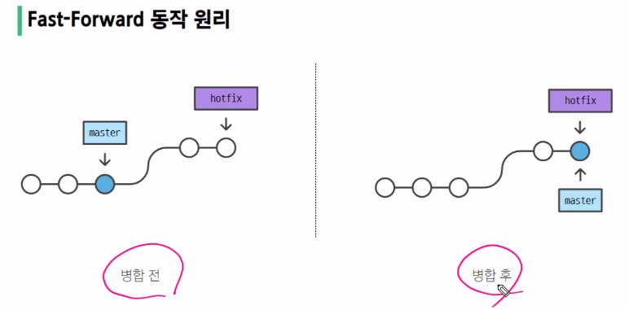

## Git Branch (2025.05.02)

### Branch

#### 1. Branch

- Git에서 브랜치는 단순하게 특정 Commit을 가리키는 Pointer(레퍼런스)
- master라는 브랜치가 새로운 커밋을 남기면, master 브랜치는 자동으로 가장 최신의 커밋을 가리킴
- 브랜치는 독립적인 개발 라인을 나타냄

#### 2. Branch 장점

1. 독립된 개발 환경을 형성하기 때문에 원본(master)에 대해 안전
2. 하나의 작업은 하나의 브랜치로 나누어 진행되므로 체계적으로 협업과 개발이 가능
3. 손쉽게 브랜치를 생성하고, 브랜치 사이를 이동할 수 있음

#### 3. Branch 예시

- 만약 상용 중인 서비스에 발생한 에러를 해결하기기
    1. 브랜치를 통해 별도의 작업 공간을 만듦
    2. 브랜치에서 에러가 발생한 버전을 이전 버전으로 되돌리거나 삭제
    3. 브랜치는 완전하게 독립되어 있어서 작업 내용이 master 브랜치에 아무런 영향을 끼치지 못함
    4. 이후 에러가 해결되면, 그 내용을 master 브랜치에 merge해서 반영

#### 4. master(main) 브랜치의 의미와 역할

- 기본 브랜치 (Default Branch)
    - 저장소의 초기 상태를 나타내며, 일반적으로 프로젝트의 가장 최신 버전 또는 배포 가능한 안정적인 코드를 포함
- 기준점
    - 다른 브랜치가 파생되는 기준점으로 사용됨
- 변경사항 통합
    - 다른 브랜치에서 작업한 기능이나 버그 수정을 완료한 후, 코드 리뷰와 테스트를 거쳐 master(또는 main) 브랜치에 병합

#### 5. git branch

- 브랜치 조회 생성, 삭제 등 브랜치와 관련된 git 명령어
- git branch명령어
    - `git branch`
        - 브랜치 목록 확인
    - `git branch -r`
        - 원격 저장소의 브랜치 목록 확인
    - `git branch <브랜치 이름>`
        - 새로운 브랜치 생성
    - `git branch -d <브랜치 이름>`
        - 브랜치 삭제 (병합된 브랜치만 삭제 가능)
    - `git branch -D <브랜치 이름>`
        - 브랜치 삭제 (강제 삭제)

#### 6. git switch

- 현재 브랜치에서 다른 브랜치로 HEAD를 이동시키는 명령어
- git switch 명령어
    - `git switch <다른 브랜치 이름>`
        - 다른 브랜치로 전환
    - `git switch -c <브랜치 이름>`
        - 새 브랜치 생성 후 전환
    - `git switch -c <브랜치 이름> <commit ID>`
        - 특정 커밋에서 새 브랜치 생성 후 전환

#### 7. git switch 주의사항

- git switch하기 전에, Working Directory 파일이 모두 버전 관리가 되고 있는지 반드시 확인해야 함

#### 8. HEAD

- 현재 브랜치나 commit을 가리키는 포인터 (현재 내가 바라보는 위치)
- HEAD는 일반적으로 현재 내가 작업중인 브랜치를 가리킴
- 만약, HEAD가 master라는 브랜치를 가리키고 있다면, HEAD는 master로 남긴 가장 최신의 커밋을 가리킴
- 따라서, HEAD는 Working Directory의 커밋을 가리키는 포인터

---

### Merge

#### 1. Git Merge

- 두 브랜치를 하나로 병합 (결합)
- git merge 명령어
    - `git merge <병합 브랜치 이름>`

#### 2. 병합 전 확인 및 주의사항

1. 수신 브랜치(병합 브랜치를 가져오고자 하는 브랜치) 확인
    1. git branch 명령어르 통해 HEAD가 올바른 수신 브랜치를 가리키는지 확인
    2. 병합 진행 위치는 반드시 수신 브랜치에서 진행되어야 함
2. 최신 commit 상태 확인
    1. 수신 브랜치와 병합 브랜치 모두 최신 상태인지 확인

#### 3. Merge 종류

1. Fast-Forward Merge
    1. 브랜치를 “실제로” 병합하는 대신 현재 브랜치 상태를 대상 브랜치 상태로 이동시키는 작업 (빨리 감기)
    2. Merge 과정 없이 단순히 브랜치의 포인터가 앞으로 이동
    
    
    
2. 3-Way Merge
    1. 병합하는 각 브랜치의 commit 2개와 공통 조상 commit 하나를 사용하여 병합하는 작업
    
    
    

---

### Merge Conflict

#### 1. Merge Conflict

- 병합하려는 두 브랜치가 “동일한 파일의 동일한 부분”에서 변경된 후 병합 시 충돌이 발생하는 것

#### 2. git이 충돌을 표시하는 방식

- 시각적 마커
    - <<<<<<<
    - =======
    - >>>>>>>
- 일반적으로 ======= 마커 위의 콘텐츠는 수신 브랜치, 아래 콘텐츠는 병합 브랜치

#### 3. git 충돌 해결 과정

- 병합 충돌은 3-Way-merge인 경우에만 발생
    1. 충돌하는 부분을 확인한 후에는 원하는 대로 충돌 내용을 수정
    2. 병합을 완료할 준비가 되면 충돌하는 파일에서 git add 명령을 실행
    3. 그 다음 git commit을 실행하여 merge commit을 생성