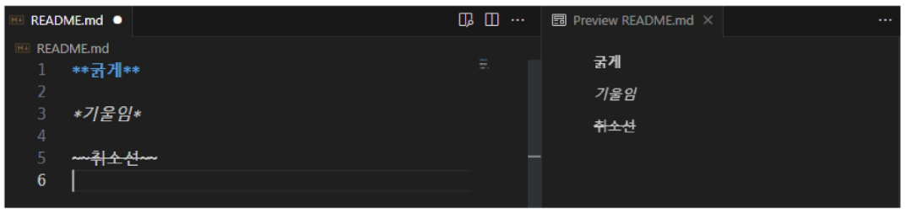

## Markdown (2025.01.15)

### Markdown

#### 1. Markdown Guide

- Markdown Guide: https://www.markdownguide.org/basic-syntax/

#### 2. Markdown Editor

- Typora (유료): https://typora.io/
- MarkText (무료): https://github.com/marktext/marktext#download-and-installation
- Markdown All in One (Visual Studio Code 확장 프로그램): https://marketplace.visualstudio.com/items?itemName=yzhang.markdown-all-in-one

#### 3. Markdown이란?

- 일반 텍스트로 문서를 작성하는 간단한 방법
- 주로 개발자들이 `텍스트와 코드를 작성해 문서화하기 위해 사용`
- 작성된 Markdown 문서는 다른 프로그램에 의해 변환되어 출력됨
    
    
    

---

### 문법

#### 1. Heading

- 문서의 단계별 제목으로 사용
- ‘#’의 개수에 따라 제목의 수준을 구별
    - 변환하는 프로그램에 의해 사용 가능한 ‘#’ 개수가 정해짐
        
        
        

#### 2. 리스트

- 목록을 표시하기 위해 사용
- 순서가 있는 리스트와 순서가 없는 리스트 제공
    
    
    

#### 3. Code Block & Inline Code Block

- 일반 텍스트와 달리 해당 프로그래밍 언어에 맞춰서 텍스트 스타일을 변환
- 개발에서 마크다운을 사용하는 가장 큰 이유
    
    
    

#### 4. 링크 (Link) & 이미지 (Image)

- 특정 주소를 사용해 다른 페이지로 이동하는 링크 혹은 이미지를 출력
- 이미지의 너비와 높이는 마크다운으로 조절할 수 없음 (HTML 필요)
    
    
    

#### 5. 텍스트 관련 문법

- 굵게, 기울임, 취소선
    
    
    

#### 6. 수평선

- 단락을 구분할 때 사용하는 수평선
- - (hypen)을 3개 이상 적으면 작동

