## Remote Repository (2025.01.16)

### 개요

#### 1. 원격 저장소 (Remote Repository)

- 코드와 버전 관리 이력을 온라인 상의 특정 위치에 저장하여 여러 개발자가 협업하고 코드를 공유할 수 있는 저장 공간

#### 2. 다양한 원격 저장소 서비스

- GitLab
- GitHub
- Bitbucket

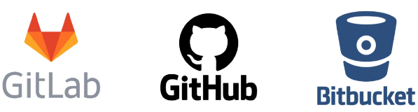

---

### 로컬 & 원격 저장소

#### 1. 로컬 & 원격 저장소

- 명령어
    - `git remote add origin remote_repo_url`
        - 로컬 저장소에 원격 저장소 추가
        - origin
            - 추가하는 원격 저장소 별칭
            - 별칭을 사용해 로컬 저장소 한 개에 여러 원격 저장소를 추가할 수 있음
        - remote_repo_url
            - 추가하는 원격 저장소 주소 (URL)
    - `git push origin master`
        - 원격 저장소에 commit 목록을 업로드
            
            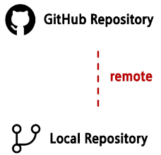
            

#### 2. Push / Pull & Clone

- 원격 저장소에는 commit이 올라가는 것
    - commit 이력이 없다면 push할 수 없다
        
        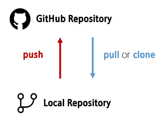
        

- 명령어
    - `git push origin master`
        - 원격 저장소에 commit 목록을 업로드
            - “git아, push해줘 origin이라는 이름의 원격 저장소에 master라는 이름의 브랜치를”
            - 최초 push시에는 GitHub로부터 인증서(git credential) 발급이 필요
            - 해당 원격 저장소에 push할 수 있는 권한이 있는지 확인하기 위함
    - `git pull origin master`
        - 원격 저장소의 변경사항만을 받아옴 (업데이트)
    - `git clone remote_repo_url`
        - 원격 저장소 전체를 복제 (다운로드)
        - clone으로 받은 프로젝트는 이미 git init이 되어 있음
        - remote_repo_url
            - 복제할 repository 주소 (url)
    - `git remote -v`
        - 현재 로컬 저장소에 등록된 원격 저장소 목록 보기
    - `git remote rm 원격 저장소 이름`
        - 현재 로컬 저장소에 등록된 원격 저장소 삭제

#### 3. 예제

- push 예제
    - 로컬 저장소에 commit 생성
        
        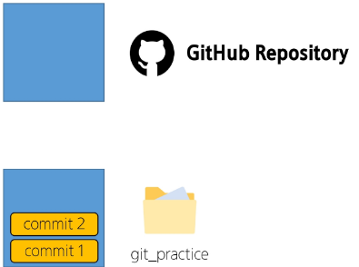
        
    
    - 로컬 저장소의 commit을 push
        
        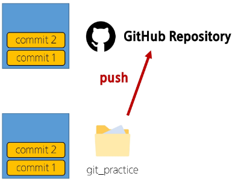
        
    
    - 로컬 저장소에 3번째 commit 생성
        
        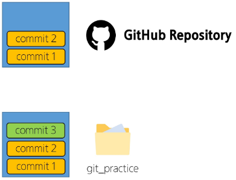
        
    
    - 로컬 저장소의 commit을 push (변경사항 만큼 업로드)
        
        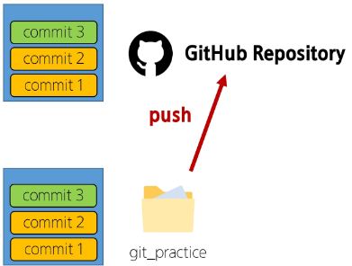
        

- pull & clone 예제
    - 2개의 폴더를 사용해 2명의 사용자가 있다고 가정하기
        
        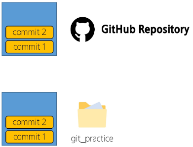
        
    
    - 2번 유저는 해당 프로젝트를 처음 받는 것이기 때문에 저장소 전체를 복제
        
        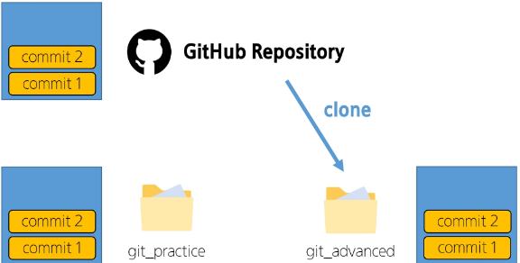
        
    
    - 1번 유저가 추가 commit을 생성 후 원격 저장소에 push
        
        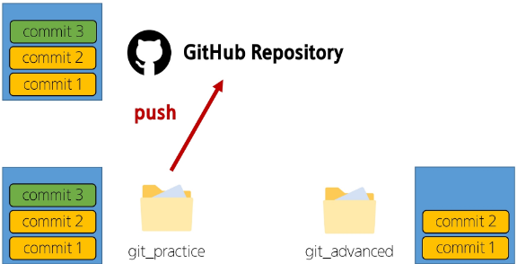
        
    
    - 원격 저장소가 업데이트 되었기 때문에 변경사항만을 다운로드
        
        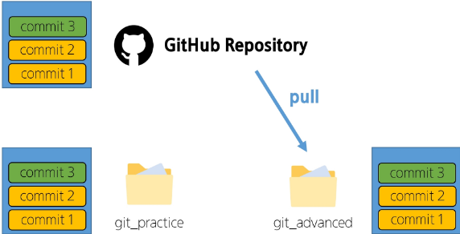
        

---

### gitignore

#### 1. gitignore

- Git에서 특정 파일이나 디렉토리를 추적하지 않도록 설정하는 데 사용되는 텍스트 파일
    - 프로젝트에 따라 공유하지 않아야 하는 것들도 존재하기 때문
- gitignore 주의사항
    - 이미 git의 관리를 받은 이력이 있는 파일이나 디렉토리는 나중에 gitignore에 작성해도 적용되지 않음
    - `git rm --cached` 명령어를 통해 git 캐시에서 삭제 필요

#### 2. gitignore 예시

- .gitignore 파일 생성
    - 파일명 앞에 `‘.’` 입력
        - 확장자 없음
- a.txt와 b.txt 파일 생성
- gitignore에 a.txt 작성
- `git init`
- `git status`

#### 3. gitignore 목록 생성 서비스

- 운영체제, 프레임워크, 프로그래밍 언어 등 개발 환경에 따라 gitignore 목록을 만들어주는 사이트
    - https://www.toptal.com/developers/gitignore/

---

### GitHub 활용

#### 1. GitHub는 어디에 활용할까

- 프로젝트 협업
- 개인 포트폴리오

#### 2. GitHub 활용하기

- TIL을 통해 내가 학습하는 것을 기록
- 개인, 팀 프로젝트 코드를 공유
    - 개발 면접 지원 시 본인의 GitHub 주소를 공유해 어떤 프로젝트들을 진행했고, 어떤 코드를 작성했는지 공유하고 평가 받기 위해 사용
- 오픈 소스 프로젝트에 기여

#### 3. TIL (Today I learned)

- 매일 내가 배운 것을 마크다운으로 정리해서 문서화하는 것
- 단순히 배운 것만을 필기하는 것이 아닌 스스로 더 나아가 어떤 학습을 했는지를 기록하는 것
- TIL 폴더 구조는 어떻게 만들어야 하나요?
    - 정답은 없음
    - 여러 개발자들의 GitHub를 방문하면서 그들의 TIL을 참고해보

#### 4. ‘문서화’의 중요성

- 신입 개발자에게 요구되는 가장 중요한 덕복
- 꾸준히 스스로 학습해 성장할 수 있고 문서화를 통해 내 생각을 정리하고 팀에게 공유할 수 있는 능력

#### 5. 문서화 연습의 중요성

- https://d2.naver.com/news/3435170
- 레벨2
    - 개발도구의 공식 레퍼런스를 보고 사용법을 스스로 익힐 수 있음
    - 자신이 경험한 사용법을 문서화해서 팀 내에 전파할 수 있음

#### 6. README.md 파일이란?

- 프로젝트에 대한 설명, 사용 방법, 문서화된 정보 등을 포함하는 역할
- Markdown 형식으로 작성되며, 프로젝트의 사용자, 개발자, 혹은 기여자들에게 프로젝트에 대한 전반적인 이해와 활용 방법을 제공하는데 사용
- 주로 프로젝트으 소개, 설치 및 설정 방법, 사용 예시, 라이선스 정보, 기여 방법 등을 포함
- 반드시 저장소 최상단에 위치해야 원격 저장소에서 올바르게 출력됨

#### 7. 지금의 테스트: [README.m](http://README.me)d는 하나만 있을 수 있는가?

- 우리의 repo: TIL
- TIL/README.md
    - [README.md](http://README.md) ← README.md의 역할은 repo의 대문 역할
- TIL/algo/디렉토리 생성
- TIL/algo/README.md 새로 생성
- TIL/algo/README.md에 내용 기입
- 커밋

#### 8. 진자림님 깃허브 TIL 참고 링크

- https://github.com/milooy