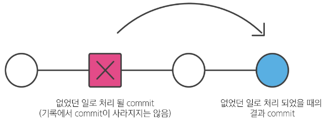
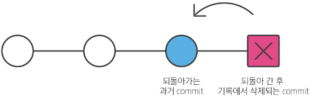
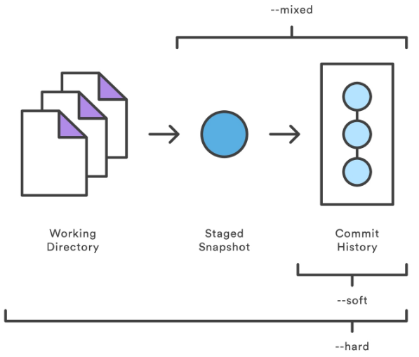

## Revert & Reset (2025.01.17)

### git revert

#### 1. git revert

- 특정 commit을 없었던 일로 만드는 작업
- git revert 작동 원리
    - “재설정”
    - 단일 commit을 실행 취소하는 것
    - 프로젝트 기록에서 commit을 없었던 일로 처리 후 그 결과를 새로운 commit으로 추가함

- revert 명령어
    - `git revert <commit id> <commit id> 등`
        - 공백을 사용해 여러 commit을 한꺼번에 실행 취소 가능
    - `git revert <commit>..<commit>`
        - ‘..’을 사용해 범위를 지정하여 여러 commit을 한꺼번에 실행 취소 가능
    - `git revert --no-edit <commit id>`
        - commit 메시지 작성을 위한 편집기를 열지 않음 (자동으로 commit 진행)
    - `git revert --no-commit <commit id>`
        - 자동으로 commit하지 않고, staging area에만 올림 (이후에 직접 commit해야 함)
        - 이 옵션은 여러 commit을 revert할 때 하나의 commit으로 묶는 것이 가능
- git revert 정리
    - 변경 사항을 안전하게 실행 취소할 수 있도록 도와주는 순방향 실행 취소 작업
    - commit 기록에서 commit을 삭제하거나 분리하는 대신, 지정된 변경 사항을 반전시키는 새 commit을 생성
        - git에서 기록이 손실되는 것을 방지하며 기록의 무결성과 협업의 신뢰성을 높임

---

### git reset

#### 1. git reset

- 특정 commit으로 되돌아가는 작업
- git reset 작동 원리
    - “되돌리기”
    - 시계를 마치 과거로 돌리는 듯한 행위
    - 특정 commit으로 되돌아 갔을 때, 되돌아간 commit 이후의 commit은 모두 삭제

- reset 명령어
    - `git reset [옵션] <commit id>`
- reset의 3가지 옵션
    - `--soft, --mixed, --hard`
        - `--soft`
            - 삭제된 commit의 기록을 staging area에 남김
        - `--mixed`
            - 삭제된 commit의 기록을 working directory에 남김 (기본 옵션 값)
        - `--hard`
            - 삭제된 commit의 기록을 남기지 않음
    - reset의 옵션에 따라 제거(수정)되는 영역
    - reset은 과거 commit으로 되돌아간 후 되돌아간 commit 이후 commit들이 삭제됨
    - 그런데 삭제되는 commit들의 기록을 어떤 영역에 남겨둘 것인지 옵션을 활용해 조정할 수 있음
    
    
    

#### 2. 참고

- 이미 삭제한 commit으로 다시 돌아가기
    - git reflog
        - HEAD가 이전에 가리켰던 모든 commit을 보여줌
        - reset의 `--hard` 옵션을 통해 지워진 commit도 reflog로 조회하여 복구 가능
        - 명령어
            - `git reset --hard <복구하고자 하는 commit id>`

---

### git undoing

#### 1. git restore

- modified 상태의 파일 되돌리기
- working directory에서 파일을 수정한 뒤, 파일의 수정 사항을 취소하고, 원래 모습대로 되돌리는 작업
- restore 주의사항
    - 원래 파일로 덮어쓰는 원리이기 때문에 수정한 내용은 전부 사라짐
    - git restore를 통해 수정 취소 후에는 해당 내용을 복원할 수 없

#### 2. staging area에 올라간 파일을 unstage하기

- unstage하는 명령어
    - `git rm --cached`
        - staging area에서 working directory로 되돌리기
        - git 저장소에 “commit이 없는 경우”
        - to unstage and remove paths only from the staging area
    - `git restore --staged`
        - staging area에서 working directory로 되돌리기
        - git 저장소에 “commit이 존재하는 경우”
        - the contents are restored from HEAD
- 정리
    - 파일 내용을 수정 전으로 되돌리기
        - `git restore`
    - staging area에 올라간 파일을 unstage하기
        - `git rm --cached`
        - `git restore --staged`