## JavaScript 04 (2025.04.24)

### 이벤트

#### 1. 웹에서의 이벤트

- 화면을 스크롤하는 것
- 버튼을 클릭했을 때 팝업 창이 출력되는 것
- 마우스 커서의 위치에 따라 드래그 앤 드롭하는 것
- 사용자의 키보드 입력 값에 따라 새로운 요소를 생성하는 것
- 웹에서의 모든 동작은 이벤트 발생과 함께 함

#### 2. event

- 웹 페이지 상에서 ‘무언가 일어났다는 신호 또는 사건’
- 사용자가 버튼을 클릭하거나, 키보드를 누르거나, 입력 필드에 값을 변경하는 행위 등

#### 3. DOM 요소와 이벤트

- 모든 DOM 요소는 다양한 형태의 이벤트를 발생시킬 수 있음
- DOM 요소에서 event가 발생하면, 해당 event는 연결된 이벤트 처리기(event handler)에 의해 처리 됨
- 예
    - button 요소를 클릭하면 click 이벤트 발생
    - input 요소 값 변경 시 input 이벤트 발생 등

#### 4. ‘event’ object

- DOM에서 이벤트가 발생하면 브라우저는 해당 이벤트에 관한 정보를 담은 ‘event object’를 자동으로 생성
    - 이벤트 종류
        - mouse
        - input
        - keyboard
        - touch 등

#### 5. ‘event’ object 역할

- 이벤트 객체는 이벤트 발생 순간의 상황(어떤 요소에서 이벤트가 발생했는지, 마우스 좌표는 어디인지, 눌린 키는 무엇인지 등)과 관련된 상세 정보를 담고 있음
- 이를 통해 이벤트와 관련된 구체적인 정보를 참조할 수 있음

---

### event handler

#### 1. event handler

- 특정 이벤트가 발생했을 때, 실행되는 (콜백)함수
- 보통 addEventListener를 통해 DOM 요소에 등록

#### 2. .addEventListener()

- 이벤트가 발생했을 때, 실행할 이벤트 핸들러를 특정 DOM 요소에 등록하는 메서드
- 이벤트 핸들러를 DOM 요소에 “연결”하는 역할을 담당

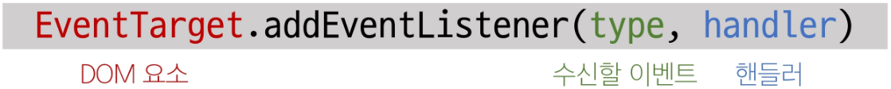

- “특정 대상(DOM 요소)에 특정 Event(수신할 이벤트)가 발생했을 때, 실행할 함수(핸들러)를 등록”

#### 3. .addEventListener() 예시

- handleClick 함수가 이벤트 핸들러이며, button.addEventListener()는 그 핸들러를 click 이벤트에 연결해주는 역할

```jsx
const button = document.querySelector("button")

// 이벤트 핸들러
const handleClick = function(){
    window.alert("버튼이 클릭 되었습니다!")
}

// addEventListener 메서드를 이용해 버튼에 이벤트 핸들러를 등록
button.addEventListener("click", handleClick)
```

#### 4. addEventListener 구조

```jsx
// 문법
.addEventListener(type, handler)

// 예시
element.addEventListener("click", function(event){
    // 이벤트 처리 로직
})
```

- type
    - 수신할 이벤트 유형
    - 문자열로 작성
        - 예시
            - “click”
            - “mouseover” 등
- handler
    - 이벤트 발생 시 호출되는 콜백 함수
    - 자동으로 event 객체를 첫 번째 매개변수로 받음
    - 반환 값 없음

#### 5. 이벤트 객체 전달

- 이벤트 발생 시, 이벤트 객체는 자동으로 이벤트 핸들러 함수에 인자로 전달됨
- 핸들러 함수는 이 인자를 통해 이벤트에 대한 상세 정보(이벤트 발생 요소, 이벤트 타입, 추가 데이터 등)에 접근하고, 적절한 동작을 수행

```html
<button id="btn">버튼</button>
```

```jsx
// 1. 버튼 요소 선택
const btn = document.querySelector("#btn")

// 2. 이벤트 핸들러
const detectClick = function(event){
    console.log(event)      // PointerEvent
    console.log(event.type) // click
}

// 3. 버튼에 이벤트 핸들러를 등록
btn.addEventListener("click", detectClick)
```

#### 6. 이벤트 핸들러에서의 this

- 요소에 addEventListener를 연결하게 되면 핸들러 내부의 this 값은 연결된 요소를 가리키게 됨
    - event 객체의 currentTarget 속성 값과 동일
    
    ```html
    <button id="btn">버튼</button>
    ```
    
    ```jsx
    // 1. 버튼 선택
    const btn = document.querySelector("#btn")
    
    // 2. 이벤트 핸들러
    const detectClick = function(event){
        console.log(event.currentTarget) // <button id="btn">버튼</button>
        console.log(this)                // <button id="btn">버튼</button>
    }
    
    // 3. 버튼에 이벤트 핸들러를 등록
    btn.addEventListener("click", detectClick)
    ```
    

---

### 버블링

#### 1. 버블링 (Bubbling)

- “한 요소에 이벤트가 발생하면, 이 요소에 할당된 핸들러가 동작하고, 이어서 부모 요소의 핸들러가 동작하는 현상”
- 가장 최상단의 조상 요소(document)를 만날 때까지 이 과정이 반복되면서 요소 각각에 할당된 핸들러가 동작
- 이벤트가 제일 깊은 곳에 있는 요소에서 시작해 부모 요소를 거슬러 올라가며 발생하는 것이 마치 물속 거품과 닮았기 때문
- 최하위의 \<p> 요소를 클릭하면 p → div → form 순서로 3개의 이벤트 핸들러가 모두 순차적으로 동작

```html
<form id="form">
    form
    <div id="div">
        div
        <p id="p">p</p>
    </div>
</form>
```

```jsx
const formElement = document.querySelector("#form")
const divElement = document.querySelector("#div")
const pElement = document.querySelector("#p")

const clickHandler1 = function(event){
    console.log("form이 클릭되었습니다.")
}
const clickHandler2 = function(event){
    console.log("div이 클릭되었습니다.")
}
const clickHandler3 = function(event){
    console.log("p이 클릭되었습니다.")
}

formElement.addEventListener("click", clickHandler1)
divElement.addEventListener("click", clickHandler2)
pElement.addEventListener("click", clickHandler3)
```

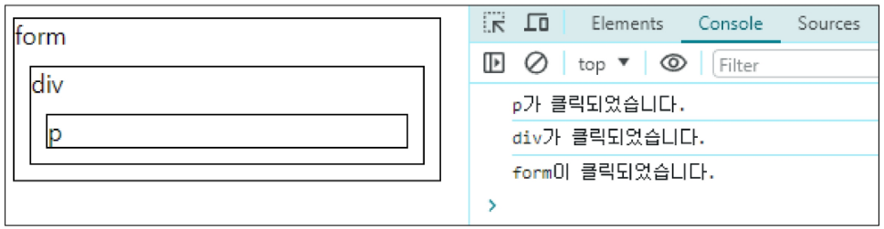

#### 2. 이벤트가 정확히 어디서 발생했는지 접근할 수 있는 방법

```jsx
1. event.currentTarget

2. event.target
```

#### 3. ‘currentTarget’ & ‘target’ 속성

```jsx
1. 'currentTarget' 속성
    - '현재' 요소
    - 항상 이벤트 핸들러가 연결된 요소만을 참조하는 속성
    - 'this'와 같음

2. 'target' 속성
    - 이벤트가 발생한 가장 안쪽의 요소(target)를 참조하는 속성
    - 실제 이벤트가 시작된 요소
    - 버블링이 진행되어도 변하지 않음
```

#### 4. ‘currentTarget’ & ‘target’ 예시

- 세 요소 중 가장 최상위 요소인 outerouter 요소에만 핸들러가 연결
- ‘currentTarget’
    - 핸들러가 연결된 outerouter 요소만을 가리킴
- ‘target’
    - 실제 이벤트가 발생하는 요소를 가리킴
- 핸들러는 outerouter에만 연결되어 있지만 하위 요소 outer와 inner를 클릭해도 해당 핸들러가 동작함
    - 클릭 이벤트가 어디서 발생했든 상관 없이 outerouter까지 이벤트가 버블링되어 핸들러를 실행시키기 때문
    
    ```css
    <style>
      #outerouter{
        width: 300px;
        height: 300px;
        background-color: yellowgreen;
      }
      #outer{
        width: 200px;
        height: 200px;
        background-color: crimson;
      }
      #inner{
        width: 100px;
        height: 100px;
        background-color: skyblue;
      }
    </style>
    ```
    
    ```html
    <div id="outerouter">
      outerouter
      <div id="outer">
        outer
        <div id="inner">inner</div>
      </div>
    </div>
    
    <script>
      const outerOuterElement = document.querySelector("#outerouter")
      const clickHandler = function(event){
        console.log("currentTarget: ", event.currentTarget.id)
        console.log("target: ", event.target.id)
      }
      outerOuterElement.addEventListener("click", clickHandler)
    </script>
    ```
    
    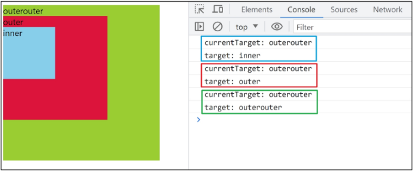
    

---

### 캡처링과 버블링

#### 1. 캡처링 (capturing)

- 이벤트가 하위 요소로 전파되는 단계
    - 버블링과 반대
    
    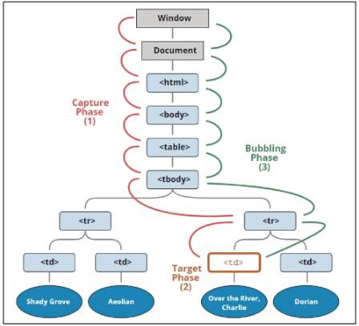
    

#### 2. 캡처링과 버블링

- table의 하위 요소 td를 클릭하면 이벤트는 먼저 최상위 요소부터 아래로 전파됨 (캡처링)
- 실제 이벤트가 발생한 지점(event.target)에서 실행된 후 다시 위로 전파 (버블링)
    - 이 전파 과정에서 상위 요소에 할당된 이벤트 핸들러들이 호출되는 것
- 캡처링은 실제 개발자가 다루는 경우가 거의 없으므로 버블링에 집중하기


#### 3. 버블링이 필요한 이유

- 요소의 공통 조상에 이벤트 핸들러를 단 하나만 할당하면, 여러 버튼 요소에서 발생하는 이벤트를 한꺼번에 다룰 수 있음
- 공통 조상에 할당한 핸들러에서 event.target을 이용하면 실제 어떤 버튼에서 이벤트가 발생했는지 알 수 있기 때문

```html
<div>
    <button></button>
    <button></button>
    ...
    <button></button>
    <button></button>
</div>
```

```jsx
const divTag = document.querySelector("div")
divTag.addEventListener("click", function(event){
    console.log(event.target)
})
```

---

### event handler 활용

#### 1. click 이벤트 실습

- 버튼을 클릭하면 숫자를 1씩 증가해서 출력하기

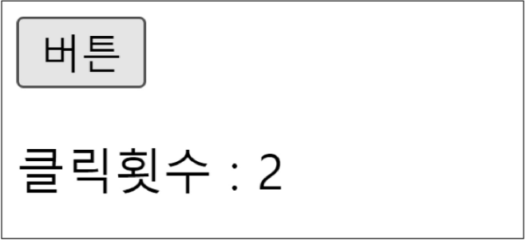

```html
<button id="btn">버튼</button>
<p>클릭횟수: <span id="counter">0</span></p>
```

```jsx
// 1. 초기 값 할당
let counterNumber = 0

// 2. 버튼 요소 선택
const btn = document.querySelector("#btn")

// 3. 콜백 함수 (버튼에 클릭 이벤트가 발생할 때마다 실행할 코드)
const clickHandler = function(){
  // 3-1. 초기 값 += 1
  counterNumber += 1

  // 3-2. p 요소를 선택
  const spanTag = document.querySelector("#counter")

  // 3-3. p 요소의 컨텐츠를 1 증가한 초기 값으로 설정
  spanTag.textContent = counterNumber
}
// 4. 버튼에 이벤트 핸들러 등록 (클릭 이벤트)
btn.addEventListener("click", clickHandler)
```

#### 2. input 이벤트 실습

- 사용자의 입력 값을 실시간으로 출력하기

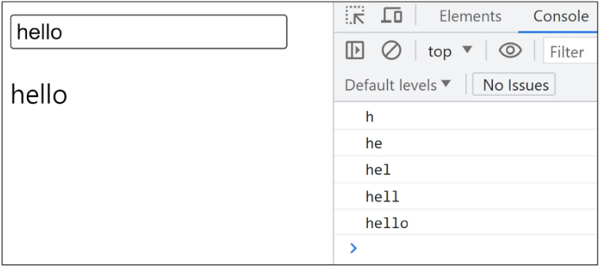

```html
<input type="text" id="text-input">
<p></p>
```

```jsx
// 1. input 요소 선택
const inputTag = document.querySelector("#text-input")

// 2. p 요소 선택
const pTag = document.querySelector("p")

// 3. 콜백 함수 (input 요소에 input 이벤트가 발생할 때마다 실행할 코드)
const inputHandler = function(event){
  // 3-1. 작성하는 데이터가 어디에 누적되고 있는지 찾기
  // console.log(event.currentTarget)
  console.log(event.currentTarget.value)

  // 3-2. p 요소의 컨텐츠에 작성하는 데이터를 추가
  pTag.textContent = event.currentTarget.value
}
// 4. input 요소에 이벤트 핸들러 등록 (input 이벤트)
inputTag.addEventListener("input", inputHandler)
```

#### 3. ‘currentTarget’ 주의사항

- console.log()로 event 객체를 출력할 경우, currentTarget 키의 값은 null을 가짐
- currentTarget은 이벤트가 처리되는 동안에만 사용할 수 있기 때문
- 대신 console.log(event.currentTarget)을 사용하여 콘솔에서 확인 가능
- currentTarget 이후의 속성 값들은 ‘target’을 참고해서 사용하기

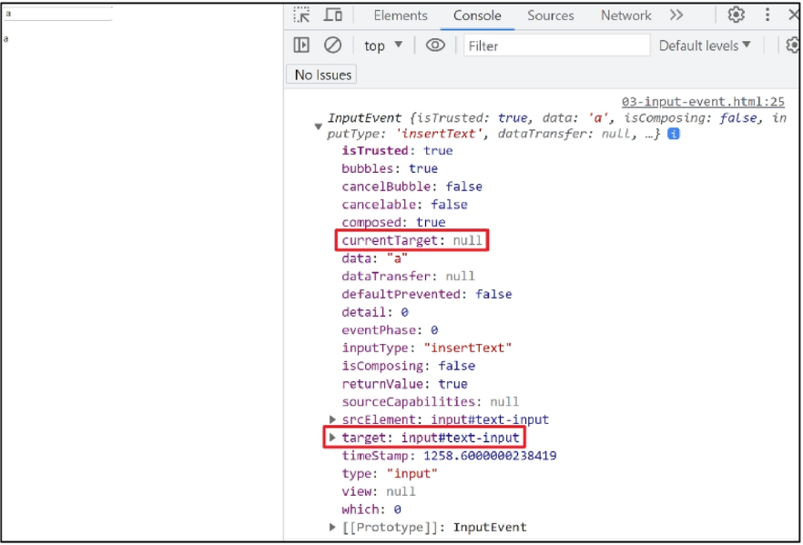

#### 4. click & input 이벤트 실습

- 사용자의 입력 값을 실시간으로 출력하기 + 버튼을 클릭하면 출력한 값의 CSS 스타일을 변경하기
    
    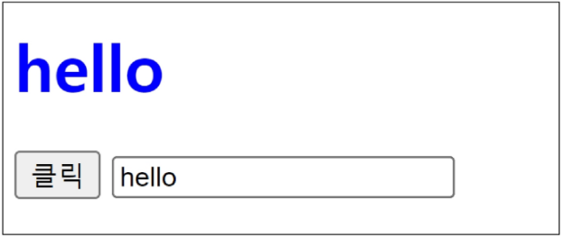
    
    ```html
    <h1></h1>
    <button id="btn">클릭</button>
    <input type="text" id="text-input">
    ```
    
    ```css
    .blue{
      color: blue;
    }
    ```
    
    ```jsx
    // input 구현
    const inputTag = document.querySelector("#text-input")
    const h1Tag = document.querySelector("h1")
    const inputHandler = function(event){
      h1Tag.textContent = event.currentTarget.value
    }
    inputTag.addEventListener("input", inputHandler)
    
    // click 구현
    const btn = document.querySelector("#btn")
    const clickHandler = function(){
      // 1. add 방법
      h1Tag.classList.add("blue")
      
      // 2. toggle 방법
      h1Tag.classList.toggle("blue")
    
      // 3. if 방법
      if(h1Tag.classList.value){
        h1Tag.classList.remove("blue")
      } else{
        h1Tag.classList.add("blue")
      }
    }
    btn.addEventListener("click", clickHandler)
    ```
    

#### 5. todo 실습

- todo 프로그램 구현
    - todo 추가 기능 구현
        1. 빈 문자열 입력 방지
        2. 입력이 없을 경우 경고 대화상자를 띄움
        
        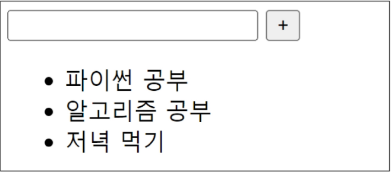
        
        ```html
        <input type="text" class="input-text">
        <button id="btn">+</button>
        <ul></ul>
        ```
        
        ```jsx
        // 1. 필요한 요소 선택
        const inputTag = document.querySelector(".input-text")
        const btn = document.querySelector("#btn")
        const ulTag = document.querySelector("ul")
        const addTodo = function(event){
          // 2-1. 사용자 입력 데이터 저장
          const inputData = inputTag.value
          if(inputData.trim()){
            // 2-2. 데이터를 저장할 li 요소를 생성
            const liTag = document.createElement("li")
            
            // 2-3. li 요소 컨텐츠에 데이터 입력
            liTag.textContent = inputData  
            
            // 2-4. li 요소를 부모 ul 요소의 자식 요소로 추가
            ulTag.appendChild(liTag)
            
            // 2-5. todo 추가 후 input의 입력 데이터는 초기화
            inputTag.value = ""
          } else{
            alert("할 일을 입력하세요..")
          }
        }
        ```
        

#### 6. 로또 번호 생성기 실습

- 로또 번호 생성기 구현

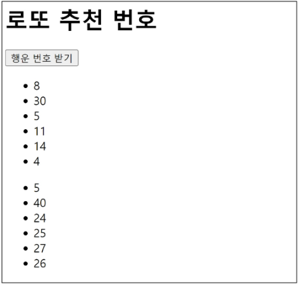

```html
<h1>로또 추천 번호</h1>
<button id="btn">행운 번호 받기</button>
<div></div>
```

```jsx
<script src="https://cdn.jsdelivr.net/npm/lodash@4.17.21/lodash.min.js"></script>
<script>
  // 1. 필요한 요소 선택
  const h1Tag = document.querySelector("h1")
  const btn = document.querySelector("#btn")
  const divTag = document.querySelector("div")

  // 2. 로또 번호를 생성하는 함수
  const getLottery = function(event){
    // 2-1. 1부터 45까지의 값이 필요
    const numbers = _.range(1, 46)
    // 2-2. 45개의 요소가 있는 배열에서 6개 번호 추출
    const sixNumbers = _.sampleSize(numbers, 6)
    
    // 2-5. 6개의 li 요소를 담을 ul 요소 생성
    const ulTag = document.createElement("ul")
    
    // 2-3. 추출한 번호 배열을 "반복"하면서 li 요소를 생성
    sixNumbers.forEach((number) => {
      // 2-4. 번호를 담을 li 요소 생성 후 입력
      const liTag = document.createElement("li")
      liTag.textContent = number
      // 2-6. 만들어진 li를 ul 요소에 추가
      ulTag.appendChild(liTag)
    })
    // 2-7. 완성한 ul 요소를 div 요소에 추가
    divTag.appendChild(ulTag)
  }
  // 3. 버튼 요소에 이벤트 핸들러를 등록
  btn.addEventListener("click", getLottery)
</script>
```

#### 7. lodash

- 모듈성, 성능 및 추가 기능을 제공하는 JavaScript 유틸리티 라이브러리
- array, object 등 자료 구조를 다룰 때 사용하는 유용하고, 간편한 함수들을 제공

---

### 이벤트 기본 동작 취소하기

#### 1. 이벤트 기본 동작 취소하기

- HTML의 각 요소가 기본적으로 가지고 있는 이벤트가 때로는 방해가 되는 경우가 있어 이벤트의 기본 동작을 취소할 필요가 있음
- 예시
    - form 요소의 제출 이벤트를 취소하여 페이지 새로고침을 막을 수 있음
    - a 요소를 클릭할 때 페이지 이동을 막고 추가 로직을 수행할 수 있음

#### 2. .preventDefault()

- 해당 이벤트에 대한 기본 동작을 실행하지 않도록 지정

#### 3. 이벤트 동작 취소 실습

1. copy 이벤트 동작 취소
    - 콘텐츠를 복사하는 것을 방지
    
    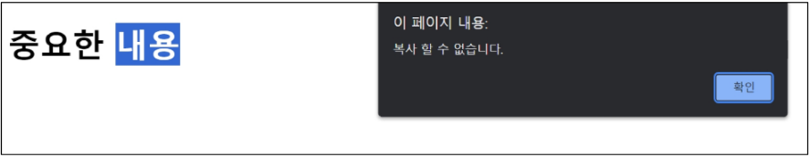
    
    ```jsx
      <h1>중요한 내용</h1>
    
      <script>
        const h1Tag = document.querySelector("h1")
        h1Tag.addEventListener("copy", function(event){
          console.log(event)
          event.preventDefault()
          alert("복사할 수 없습니다.")
        })
      </script>
    ```
    

2. form 제출 시 페이지 새로고침 동작 취소
    1. form 요소의 submit 동작(action 값으로 요청)을 취소시킴
    
    ```jsx
      <form id="my-form">
        <input type="text" name="username">
        <button type="submit">Submit</button>
      </form>
    
      <script>
        const formTag = document.querySelector("#my-form")
        const handleSubmit = function(event){
          event.preventDefault()
        }
        formTag.addEventListener("submit", handleSubmit)
      </script>
    ```
    

---

### 참고

#### 1. addEventListener에서의 화살표 함수 주의사항

- 화살표 함수는 자신만의 this를 생성하지 않음
- 대신, 화살표 함수가 정의된 곳의 상위 스코프의 this를 그대로 사용
- 대부분의 경우, 이는 전역 객체(브라우저에서는 window)를 가리키게 됨
- 해결책
    1. 일반 함수로 사용하기
    2. 화살표 함수일 경우 event.currentTarget을 사용하기
    
    ```jsx
    element.addEventListener("click", function(){
        console.log(this) // <button id="function">function</button>
    })
    
    element.addEventListener("click", () => {
        console.log(this) // window
    })
    ```
