## Basic Syntax 1 (2025.01.20)

### 프로그래밍

#### 학습자료: https://lab.ssafy.com/s13/python

#### 1. 프로그램 (Program)

- 정의
    - 명령어들의 집합
- 프로그래밍의 핵심
    - 새 연산을 정의하고 조합해 유용한 작업을 수행하는 것
        - ‘문제를 해결’하는 매우 강력한 방법
- 프로그램이 언어
    - 컴퓨터에게 작업을 지시하고 문제를 해결하는 도구

---

### 파이썬

#### 1. Python의 장점

- 쉽고 간결한 문법
    - 읽기 쉽고, 쓰기 쉬운 문법을 가지고 있어 쉽게 배우고 활용할 수 있음
- 파이썬 커뮤니티의 지원
    - 세계적인 규모의 풍부한 온라인 포럼 및 커뮤니티 생태계
- 광범위한 응용 분야
    - 웹 개발, 데이터 분석, 인공지능, 자동화 스크립트 등 다양한 분야에서 사용
- 직관적인 문법
    - 복잡한 논리 구조의 알고리즘을 이해하고 구현하기에 쉬움
- 강력한 표준 라이브러리
    - 다양한 알고리즘 구현에 필요한 도구를 제공
- 빠른 프로토타이핑
    - 알고리즘을 빠르게 테스트하고 수정할 수 있음

#### 2. 파이썬 프로그램이 실행 과정

- 컴퓨터는 기계어로 소통하기 때문에 사람이 기계어를 직접 작성하기 어려움

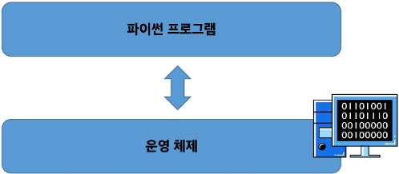

- 인터프리터가 사용자의 명령어를 운영체제가 이해하는 언어로 바꿈
    - 훨씬 더 사용하기 쉽고 운영체제간 이식도 가능 (확장성)


#### 3. 파이썬 인터프리터를 사용하는 2가지 방법

- shell이라는 프로그램으로 한 번에 한 명령어씩 입력해서 실행
- 확장자가 .py인 파일에 작성된 파이썬 프로그램을 실행

#### 4. 표현식 (Expression)

- 정의
    - 값으로 평가될 수 있는 코드 조각
- 값 (Value)
    - 표현식이 평가된 결과
- 평가 (Evaluate)
    - 표현식을 실행하여 값을 얻는 과정
    - 표현식을 순차적으로 평가하여 프로그램의 동작을 결정

```python
3 + 5 # 표현식
8 # 값
# 표현식이 평가되어 값이 반환됨
```

- 문장 (Statement)
    - 실행 가능한 동작을 기술하는 코드
    - 조건문, 반복문, 함수 정의
- 표현식과 문장
    - 문장은 보통 여러 개의 표현식을 포함

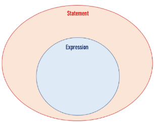

#### 5. 연산자

- 산술 연산자

```python
-  # 음수 부호
+  # 덧셈
-  # 뺄셈
*  # 곱셈
/  # 나눗셈
// # 정수 나눗셈 (몫)
%  # 나머지
** # 지수 (거듭제곱)
```

- 연산자 우선 순위

```python
# 위로 갈수록 우선순위 높아짐
**          # 지수
-           # 음수 부호
*, /, //, % # 곱셈, 나눗셈, 정수 나눗셈, 나머지
+, -        # 덧셈, 뺄셈
```

- 문제

```python
-2 ** 4   # 답: -16
-(2 ** 4) # 답: -16
(-2) ** 4 # 답: 16
```

- 복합 연산자

```python
+=  # a = a + 1 -> a += 1
-=  # a = a - 1 -> a -= 1
*=  # a = a * 1 -> a *= 1
/=  # a = a / 1 -> a /= 1
//= # a = a // 1 -> a //= 1
%=  # a = a % 1 -> a %= 1
**= # a = a ** 1 -> a **= 1
```

#### 6. 변수 (Variable)

- 정의
    - 값을 저장하기 위한 이름
    - 값을 참조하기 위한 이름
- 변수 할당
    - 표현식을 통해 변수에 값을 저장
    - 할당문
        - “변수 degrees에 값 36.5를 할당했다.”
        
        ```python
        degrees = 36.5
        ```
        
    
    - 재할당
        - “변수 degrees에 값 ‘abc’를 재할당했다.”
        
        ```python
        degrees = 'abc'
        ```
        
    - 할당문
        - 할당 연산자(=) 오른쪽에 있는 표현식을 평가해서 값(메모리 주소)을 생성
        - 값의 메모리 주소를 ‘=’ 왼쪽에 있는 변수에 저장
        - 존재하지 않는 변수라면
            - 새 변수를 생성
        - 기존에 존재했던 변수라면
            - 기존 변수를 재사용해서 변수에 들어 있는 메모리 주소를 변경
        
        ```python
        variable = expression
        ```
        

- 변수, 값 그리고 메모리
    - 거리에 집 주소가 있듯이
    - 메모리의 모든 위치에는 그 위치를 고유하게 식별하는 메모리 주소가 존재
    
    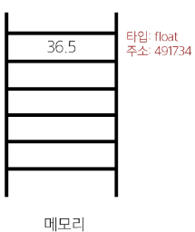
    
    - 객체 (Object)
        - 타입을 갖는 메모리 주소 내 값
        - “값이 들어있는 상자”
    
    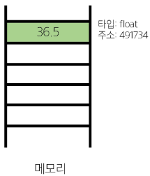
    
    - 변수는 그 변수가 참조하는 객체의 메모리 주소를 가짐
    - 변수 degrees는 값 36.5를 참조
    
    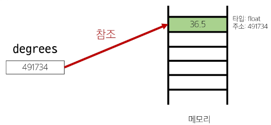
    

---

### Data Types

#### 1. 타입 (Type)

- 정의
    - 변수나 값이 가질 수 있는 데이터의 종류를 의미
- 어떤 종류의 데이터인지, 어떻게 해석되고 처리되어야 하는지를 정의
- 타입의 중요성
    - 데이터 타입에 맞는 연산을 수행할 수 있기 때문
- 타입은 2가지 요소로 이루어짐
    - “값”과 “값에 적용할 수 있는 연산”

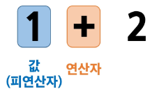

#### 2. Data Types

- 정의
    - 값의 종류와 그 값에 적용 가능한 연산과 동작을 결정하는 속성
- 데이터 타입
    - Numeric Type
        - int (정수)
        - float (실수)
        - complex (복소수)
    - Sequence Types
        - list
        - tuple
        - range
    - Text Sequence Type
        - str (문자열)
    - Non-sequence Types
        - set
        - dict
    - 기타
        - Boolean
        - None
        - Functions
- 데이터 타입이 필요한 이유
    - 값들을 구분하고, 어떻게 다뤄야 하는지를 알 수 있음
    - 요리 재료마다 특정한 도구가 필요하듯이 각 데이터 타입 값들도 각자에게 적합한 도구를 가짐
    - 타입을 명시적으로 지정하면 코드를 읽는 사람이 변수의 의도를 더 쉽게 이해할 수 있고, 잘못된 데이터 타입으로 인한 오류를 미리 예방

#### 3. Numeric Types

- int (Integer)
    - 정수 자료형
    - 정수를 표현하는 자료형
    
    ```python
    a = 10
    b = 0
    c = -5
    ```
    

- 진수 표현
    - 2진수 (Binary)
        - 0b
    - 8진수 (Octal)
        - 0o
    - 16진수 (Hexadecimal)
        - 0x
    
    ```python
    print(0b10) # 2
    print(0o30) # 24
    print(0x10) # 16
    ```
    

- float
    - 실수 자료형
    - 실수를 표현하는 자료형
    - 프로그래밍 언어에서 float는 실수에 대한 근삿값
    
    ```python
    d = 3.14
    e = -2.7
    
    # 파이썬에서는 4.24e10 또는 4.24E10처럼 표현 (컴퓨터식 지수 표현 방식)
    a = 4.24E10  # 4.24^10
    a = 4.24e-10 # 4.24^(-10)
    ```
    
    - 지수 표현 방식
    
    ```python
    # 314 * 0.01
    number = 314e-2
    
    # 3.14
    print(number)
    ```
    
    - 유한 정밀도
        - 컴퓨터 메모리 용량이 한정돼 있고 한 숫자에 대해 저장하는 용량이 제한 됨
        - 0.6666666666666666과 1.6666666666666667은 제한된 양의 메모리에 저장할 수 있는 2/3과 5/3에 가장 가까운 값
    
    ```python
    # 0.6666666666666666
    print(2 / 3)
    
    # 1.6666666666666667
    print(5 / 3)
    ```
    
    - 실수 연산 시 주의사항
        - 컴퓨터는 2진수를 사용, 사람은 10진법을 사용
        - 이 때 10진수 0.1은 2진수로 표현하면 0.0001100110011001100110… 같이 무한대로 반복됨
        - 무한대 숫자를 그대로 저장할 수 없어서 사람이 사용하는 10진법의 근삿값만 표시
        - 0.1의 경우 3602879701896397 / 2 ** 55이며 0.1에 가깝지만 정확히 동일하지는 않음
        - 이 과정에서 예상치 못한 결과가 나타남
        - 이런 증상을 Floating Point Rounding Error(부동소수점 에러)라고 함
    - 부동소수점 에러
        - 정의
            - 컴퓨터가 실수를 표현하는 방식으로 인해 발생하는 작은 오차
        - 원인
            - 실수를 2진수로 변환하는 과정에서 발생하는 근사치 표현
        - 부동소수점 에러 해결책
            - 대표적으로 decimal 모듈을 사용해 부동소수점 연산의 정확성을 보장하는 방법
            - 이외에도 다양한 해결 방법이 존재
        
        ```python
        # 해결 전
        a = 3.2 - 3.1
        b = 1.2 - 1.1
        
        print(a)      # 0.10000000000000009
        print(b)      # 0.09999999999999987
        print(a == b) # False
        
        # 해결 후
        from decimal import Decimal
        a = Decimal('3.2') - Decimal('3.1')
        b = Decimal('1.2') - Decimal('1.1')
        
        print(a)      # 0.1
        print(b)      # 0.1
        print(a == b) # True
        ```
        
    
- Sequence Types
    - 여러 개의 값들을 순서대로 나열하여 저장하는 자료형
        - str
            - 문자열
            - 문자들의 순서가 있는 변경 불가능한 시퀀스 자료
            - 문자열 표현
                - 문자열은 단일 문자나 여러 문자의 조합으로 이루어짐
                - 문자열 표현 방식
                    - 작은 따옴표(’)로 감싸서 표현
                    - 큰 따옴표(”)로 감싸서 표현
                    - 작은 따옴표(’’’)로 감싸서 표현
                    - 큰 따옴표(”””)로 감싸서 표현
                    
                    ```python
                    # Hello World!
                    print('Hello, World')
                    print("Hello, World")
                    print('''Hello, World''')
                    print("""Hello, World""")
                    
                    # 작은 따옴표('''), 큰 따옴표(""")로 여러 줄을 한 번에 표현 가능
                    multiline = """
                    life if too short
                    you need python
                    """
                    multiline = '''
                    life if too short
                    you need python
                    '''
                    
                    # str
                    print(type('Hello, World'))
                    ```
                    
                
                - 중첩 따옴표
                    - 따옴표 안에 따옴표를 표현할 경우
                        - 작은 따옴표가 들어 있는 경우는 큰 따옴표로 문자열 생성
                        - 큰 따옴표가 들어 있는 경우는 작은 따옴표로 문자열 생성
                        
                        ```python
                        # 문자열 안에 "큰 따옴표"를 사용하려면 작은 따옴표로 묶는다.
                        print('문자열 안에 "큰 따옴표"를 사용하려면 작은 따옴표로 묶는다.')
                        
                        # 문자열 안에 '작은 따옴표'를 사용하려면 큰 따옴표로 묶는다.
                        print("문자열 안에 '작은 따옴표'를 사용하려면 큰 따옴표로 묶는다.")
                        ```
                        
                
                - 문자열 연산
                
                ```python
                # python is fun!
                head = "python"
                tail = " is fun!"
                print(head + tail)
                
                # pythonpython
                a = "python"
                print(a * 2)
                ```
                
                - 이스케이프 코드 (Escape Sequence)
                    - 역슬래시(Backslash, \) 뒤에 특정 문자가 와서 특수한 기능을 하는 문자 조합
                    - 파이썬의 일반적인 문법 규칙을 잠시 탈출한다는 의미
                    
                    ```python
                    # 예약 문자, 내용(의미)
                    \n # 줄 바꿈
                    \t # 탭
                    \\ # 백슬래시
                    \' # 작은 따옴표
                    \" # 큰 따옴표
                    
                    # 예시
                    # 철수야 '안녕'
                    print('철수야 \'안녕\'')
                    
                    '''
                    이 다음은 엔터
                    입니다.
                    '''
                    print('이 다음은 엔터\n입니다.')
                    ```
                    
            
            - String Interpolation
                - 정의
                    - 문자열 내에 변수나 표현식을 삽입하는 방법
                - f-string
                    - 문자열에 f 또는 F 접두어를 붙이고 표현식을 {expression}로 작성하는 문법
                    - 문자열에 파이썬 표현식의 값을 삽입할 수 있음
                
                ```python
                bugs = 'roaches'
                counts = 13
                area = 'living room'
                
                # Debugging roaches 13 living room
                print(f'Debugging {bugs} {counts} {area}')
                ```
                
            - 문자열의 시퀀스 특징
                
                ```python
                my_str = 'hello'
                
                # 인덱싱
                print(my_str[1])   # e
                
                # 슬라이싱
                print(my_str[2:4]) # ll
                
                # 길이
                print(len(my_str)) # 5
                ```
                
                - 인덱스 (Index)
                    - 정의
                        - 시퀀스 내의 값들에 대한 고유한 번호로, 각 값의 위치를 식별하는 데 사용되는 숫자
                    - 문자열 hello의 인덱스
                    
                    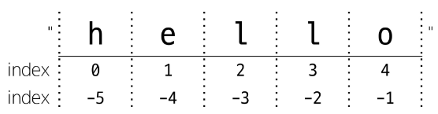
                    
                
                - 슬라이싱 (Slicing)
                    - 정의
                        - 시퀀스의 일부분을 선택하여 추출하는 작업
                    - 시작 인덱스와 끝 인덱스를 지정하여 해당 범위의 값을 포함하는 새로운 시퀀스를 생성
                    - Slicing 예시
                    
                    ```python
                    my_str[2:4]
                    ```
                    
                    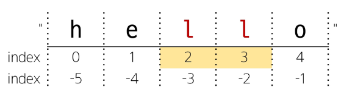
                    
                    ```python
                    my_str[:3]
                    ```
                    
                    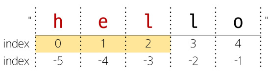
                    
                    ```python
                    my_str[3:]
                    ```
                    
                    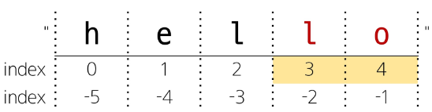
                    
                    - Step을 지정하여 추출
                    
                    ```python
                    my_str[0:5:2]
                    ```
                    
                    
                    
                    - Step이 음수일 경우
                    
                    ```python
                    my_str[::-1]
                    ```
                    
                    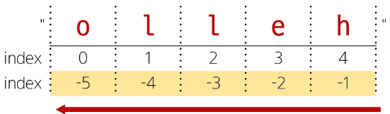
                    
            
            - 문자열은 불변 (변경 불가)
                
                ```python
                my_str = 'hello'
                
                # TypeError: 'str' object does not support item assignment
                my_str[1] = 'z'
                ```
                
                - 그래도 문자열을 바꾸고 싶다면?
                
                ```python
                # pithon을 python으로 바꾸기
                a = "pithon"
                print(a[:1] + "y" + a[2:])
                ```
                
        
        - list
        - tuple
        - range
    - Sequence Types 특징
        - 순서 (Sequence)
            - 값들이 순서대로 저장 (정렬 X)
        - 인덱싱 (Indexing)
            - 각 값에 고유한 인덱스(번호)를 가지고 있으며, 인덱스를 사용하여 특정 위치의 값을 선택하거나 수정할 수 있음
        - 슬라이싱 (Slicing)
            - 인덱스 범위를 조절해 부분적인 값을 추출할 수 있음
        - 길이 (Length)
            - len() 함수를 사용하여 저장된 값의 개수(길이)를 구할 수 있음
        - 반복 (Iteration)
            - 반복문을 사용하여 저장된 값들을 반복적으로 처리할 수 있음

---

### 참고

#### 1. Style Guide

- 코드의 일관성과 가독성을 향상시키기 위한 규칙과 권장 사항들의 모음

#### 2. 파이썬 Style Guide

- 변수명은 무엇을 위한 변수인지 직관적인 이름을 가져야 함
- 공백(Spaces) 4칸을 사용하여 코드 블록을 들여쓰기
- 한 줄의 길이는 79자로 제한하며, 길어질 경우 줄 바꿈을 사용
- 문자와 밑줄(_)을 사용하여 함수, 변수, 속성의 이름을 작성
    - 함수, 변수, 속성을 Snake Case로 작성
- 함수 정의나 클래스 정의 등의 블록 사이에는 빈 줄을 추가
- 참고 문서
    - https://peps.python.org/pep-0008/

#### 3. 변수명 규칙

- 영문 알파벳, 언더 스코어(_), 숫자로 구성
    - Case 종류
        - Snake Case
            - 단어와 단어를 구분하기 위해 언더 스코어(_)를 사용하는 방식
        - Camel Case
            - 제일 앞에 오는 단어는 소문자로 작성하고, 그 다음 단어부터 첫 글자만 대문자로 작성하는 방식
        - Pascal Case
            - 단어의 제일  첫 글자는 무조건 대문자, 나머지 단어는 소문자로 표기하는 방식
            
            ```python
            # Snake Case
            happy_day
            
            # Camel Case
            happyDay
            
            # Pascal Case
            Happyday
            ```
            

- 숫자로 시작할 수 없음
- 대소문자를 구분
- 아래 키워드는 파이썬의 내부 예약어로 사용할 수 없음

```python
'False'
'None'
'True'
'__peg_parser__'
'and'
'as'
'assert'
'async'
'await'
'break'
'class'
'continue'
'def'
'del'
'elif'
'else'
'except'
'finally'
'for'
'from'
'global'
'if'
'import'
'in'
'is'
'lambda'
'nonlocal'
'not'
'or'
'pass'
'raise'
'return'
'try'
'while'
'with'
'yield'
```

#### 4. 주석 (Comment)

- 프로그램 코드 내에 작성되는 설명이나 메모
- 인터프리터에 의해 실행되지 않음

```python
# 이것은
age = 10

# 주석입니다
print(age)

"""
여러 줄 주석
"""
```

- 주석의 목적
    - 코드의 특정 부분을 설명하거나 임시로 코드를 비활성화할 때
    - 코드를 이해하거나 문서화하기 위해
    - 다른 개발자나 자신에게 코드의 의도나 동작을 설명하는 데 도움

#### 5. Python Tutor

- 파이썬 프로그램이 어떻게 실행되는지 도와주는 시각화 도우미
- 참고 문서
    - https://pythontutor.com/

---

### 추가 학습

#### 1. 파이썬 메모리 구조

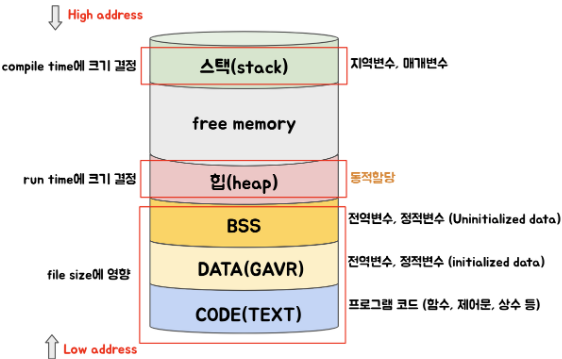

- Code(Text) Region
    - 실행할 프로그램의 코드 저장
    - CPU가 저장된 명령어를 하나씩 처리
    - 기계어로 저장
- Data Region
    - 전역 변수(Global), 정적 변수(Static) 저장
    - 프로그램 시작 시 메모리 할당, 프로그램 종료 시 소멸
- Heap Region
    - 동적 할당 영역
    - Run Time에 메모리 할당
    - 메모리 해제 안 했을 시 Memory Leak 발생
        - Python Memory Manager가 모든 객체를 Heap 영역에서 할당 및 해제
        - Memory Leak을 생각하지 않아도 됨
            - 하지만 Memory를 최적화하여 최고의 퍼포먼스를 내지 못함
    - Reference Type이 저장되는 공간
    - FIFO 구조 (First in First out)
        - 선입선출
            - 먼저 넣은 것이 먼저 빠져나감
        - FIFO 구조의 대표적인 예
            - Queue
            
            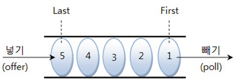
            
    
- Stack Region
    - 지역 변수(Local), 매개 변수(Param) 저장
    - Compile Time에 할당
    - 함수가 호출될 때 메모리 할당, 호출이 완료되면 메모리 해제
    - LIFO 구조 (Last in First out)
        - 후입선출
            - 나중에 넣은 것이 먼저 빠져나감
        - LIFO의 대표적인 예
            - Stack
            
            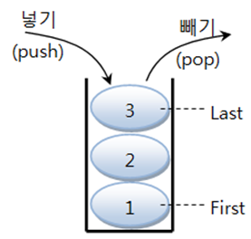
            

#### 2. 문자열 관련 함수

- count
    - 문자 개수 세기
    
    ```python
    # a에서 문자 b의 개수 리턴
    a = "hobby"
    print(a.count('b')) # 2
    ```
    

- find
    - 위치 알려주기 1
    
    ```python
    # a 문자열 중 문자 b가 처음으로 나온 위치 반환
    a = "python is the best choice"
    print(a.find('b')) # 14
    
    # a 문자열 중 문자 k가 처음으로 나온 위치 반환
    # 만약 찾는 문자나 문자열이 존재하지 않는다면 -1을 반환
    print(a.find('k')) # -1
    ```
    

- index
    - 위치 알려주기 2
    
    ```python
    # a 문자열 중 문자 t가 맨 처음으로 나온 위치 반환
    a = "life is too short"
    a.index('t') # 8
    
    # a 문자열 중 문자 k가 맨 처음으로 나온 위치 반환
    # 만약 찾는 문자나 문자열이 존재하지 않는다면 오류 발생
    a.index('k') # 오류
    ```
    

- join
    - 문자열 삽입
    
    ```python
    # abcd 문자열의 각각의 문사 사이에 ','를 삽입
    print(",".join('abcd')) # a,b,c,d
    
    # 문자열뿐만 아니라 리스트나 튜플도 입력으로 사용 가능
    print(",".join(['a', 'b', 'c', 'd'])) # a,b,c,d
    ```
    

- upper
    - 소문자를 대문자로 바꾸기
    
    ```python
    # 소문자를 대문자로 바꿔줌
    a = "hi"
    print(a.upper()) # HI
    
    ```
    

- lower
    - 대문자를 소문자로 바꾸기
    
    ```python
    # 대문자를 소문자로 바꿔줌
    a = "HI"
    print(a.lower()) # hi
    ```
    

- lstrip
    - 왼쪽 공백 지우기
    
    ```python
    # 문자열 중 가장 왼쪽에 있는 한 칸 이상의 연속된 공백을 모두 지움
    # lstrip에서 l은 left를 의미
    a = " hi "
    print(a.lstrip()) # 'hi '
    ```
    

- rstrip
    - 오른쪽 공백 지우기
    
    ```python
    # 문자열 중 가장 오른쪽에 있는 한 칸 이상의 연속된 공백을 모두 지움
    # rstrip에서 r은 right를 의미
    a = " hi "
    print(a.rstrip()) # ' hi'
    ```
    

- strip
    - 양쪽 공백 지우기
    
    ```python
    # 문자열 양쪽에 있는 한 칸 이상의 연속된 공백을 모두 지움
    a = " hi "
    print(a.strip()) # 'hi'
    ```
    

- replace
    - 문자열 바꾸기
    
    ```python
    # replace(바뀔 문자열, 바꿀 문자열)처럼 사용해서 문자열 안의 특정한 값을 다른 값으로 치환
    a = "life is too short"
    print(a.replace("life", "your leg")) # your leg is too short
    ```
    

- split
    - 문자열 나누기
    
    ```python
    # a.split()처럼 괄호 안에 아무 값도 넣어주지 않으면 공백([Space], [Tab], [Enter])을 기준으로 문자열을 나줌
    # 이렇게 나눈 값은 리스트에 하나씩 들어감
    a = "life is too short"
    print(a.split()) # ['life', 'is', 'too', 'short']
    
    # 만약 b.split(':')처럼 괄호 안에 특정 값이 있을 경우에는 괄호 안의 값을 구분자로 해서 문자열을 나눔
    # 이렇게 나눈 값은 리스트에 하나씩 들어감
    b = "a:b:c:d"
    print(b.split(':')) # ['a', 'b', 'c', 'd']
    ```
