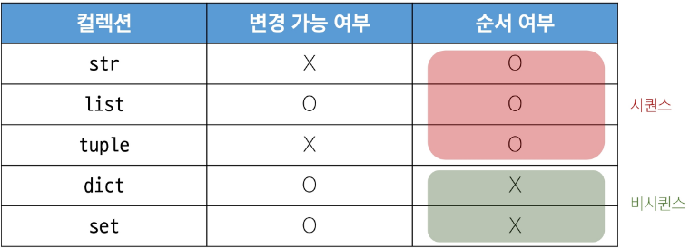
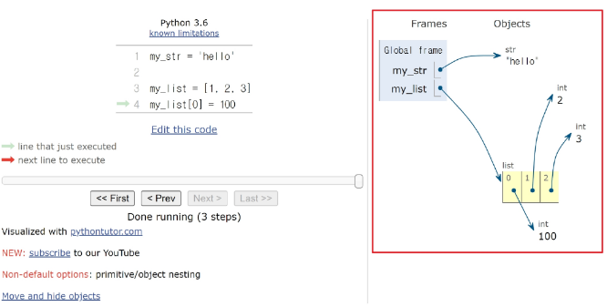
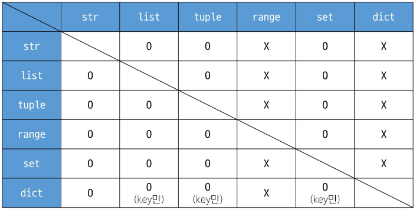

## Basic Syntax 2 (2025.01.21)

### Sequence Types

#### 1. Data Types

- 값의 종류와 그 값에 적용 가능한 연산과 동작을 결정하는 속성
- 데이터 타입 분류
    - Numeric Types
        - int (정수)
        - float (실수)
        - complex (복소수)
    - Text Sequence Type
        - str (문자열)
    - Sequence Types
        - list
        - tuple
        - range
    - Non-sequence Types
        - set
        - dict
    - 기타
        - Boolean
        - None
        - Functions
- 데이터 타입이  필요한 이유
    - 값들을 구분하고, 어떻게 다뤄야 하는지를 알 수 있음
    - 요리 재료마다 특정한 도구가 필요하듯이 각 데이터 타입 값들도 각자에게 적합한 도구를 가짐
    - 타입을 명시적으로 지정하면 코드를 읽는 사람 변수의 의도를 더 쉽게 이해할 수 있고, 잘못된 데이터 타입으로 인한 오류를 미리 예방

#### 2. list (리스트)

- 여러 개의 값을 순서대로 저장하는 변경 가능한 시퀀스 자료형
- 리스트 표현
    - 0개 이상의 객체를 포함하며 데이터 목록을 저장
    - 대괄호([])로 표기
    - 데이터는 어떤 자료형도 저장할 수 있음
    
    ```python
    # list 생성
    리스트 명 = [요소 1, 요소 2, 요소 3, ...]
    
    # 빈 list 생성
    my_list_1 = []
    a = list()
    
    my_list_2 = [1, 'a', 3, 'b', 5]
    my_list_3 = [1, 2, 3, 'Python', ['hello', 'world', '!!!']]
    ```
    

- 리스트의 시퀀스 특징

```python
my_list = [1, 'a', 3, 'b', 5]

# 인덱싱
print(my_list[1]) # a

# 슬라이싱
print(my_list[2:4])   # [3, 'b']
print(my_list[:3])    # [1, 'a', 3]
print(my_list[3:])    # ['b', 5]
print(my_list[0:5:2]) # [1, 3, 5]
print(my_list[::-1])  # [5, 'b', 3, 'a', 1]

# 길이
print(len(my_list)) # 5
```

- 중첩된 리스트 접근

```python
my_list = [1, 2, 3, 'Python', ['hello', 'world', '!!!']]

print(len(my_list))      # 5
print(my_list[4][-1])    # !!!
print(my_list[-1][1][0]) # w
```

- 리스트는 가변 (변경 가능)

```python
my_list = [1, 2, 3]
my_list[0] = 100

print(my_list) # [100, 2, 3]
```

- 리스트 연산
    - 리스트 더하기 (+)
    
    ```python
    a = [1, 2, 3]
    b = [4, 5, 6]
    
    print(a + b) # [1, 2, 3, 4, 5, 6]
    ```
    
    - 리스트 반복 (*)
    
    ```python
    a = [1, 2, 3]
    
    print(a * 3) # [1, 2, 3, 1, 2, 3, 1, 2, 3]
    ```
    

- 리스트 삭제

```python
a = [1, 2, 3, 4, 5]

# del a[x]는 x번째 요솟값을 삭제
del a[1]
print(a) # [1, 3, 4, 5]

b = [1, 2, 3, 4, 5]

del b[2:0]
print(b) # [1, 2]
```

#### 2. tuple (튜플)

- 여러 개의 값을 순서대로 저장하는 변경 불가능한 시퀀스 자료형
- 튜플 표현
    - 0개 이상의 객체를 포함하며 데이터 목록을 저장
    - 소괄호(())로 표기
    - 데이터는 어떤 자료형도 저장할 수 있음
    - 단일 요소 튜플을 만들 때는 반드시 Trailing comma(후행 쉼표)를 사용해야 함
    
    ```python
    my_tuple_1 = ()
    
    # my_tuple = (1)은 int
    # my_tuple = (1,)은 tuple
    my_tuple_2 = (1,)
    my_tuple_3 = (1, 'a', 3, 'b', 5)
    ```
    

- 튜플의 시퀀스 특징

```python
my_tuple = (1, 'a', 3, 'b', 5)

# 인덱싱
print(my_tuple[1]) # a

# 슬라이싱
print(my_tuple[2:4])   # (3, 'b')
print(my_tuple[:3])    # (1, 'a', 3)
print(my_tuple[3:])    # ('b', 5)
print(my_tuple[0:5:2]) # (1, 3, 5)
print(my_tuple[::-1])  # (5, 'b', 3, 'a', 1)

# 길이
print(len(my_tuple)) # 5
```

- 튜플은 불변 (변경 불가)

```python
my_tuple = (1, 'a', 3, 'b', 5)

# TypeError: 'tuple' object does not support item assignment
my_tuple[1] = 'z'
```

- 튜플의 쓰임
    - 튜플의 불변 특성을 사용하여 내부 동작과 안전한 데이터 전달에 사용됨
        - 다중 할당, 값 교환, 그룹화, 함수 다중 반환 값 등
        
        ```python
        # 다중 할당
        x, y = 10, 20
        
        print(x) # 10
        print(y) # 20
        
        # 실제 내부 동작
        (x, y) = (10, 20)
        ```
        
        ```python
        # 값 교환
        x, y = 1, 2
        
        x, y = y, x
        
        # 실제 내부 동작
        temp = (y, x) # 튜플 생성
        x, y = temp   # 튜플 언패킹
        
        print(x, y) # 2 1
        ```
        
        ```python
        # 그룹화
        student = ('Kim', 20, 'CS')
        name, age, major = student # 언패킹
        
        print(name, age, major) # Kim 20 CS
        ```
        

#### 3. range

- 연속된 정수 시퀀스를 생성하는 변경 불가능한 자료형
- 모든 매개변수는 정수만 사용 가능

```python
range(시작 값, 끝 값, 증가 값)
```

- range 매개변수별 특징
    - range(n)
        - 0부터 n-1까지 1씩 증가
    - range(n, m)
        - n부터 m-1까지의 1씩 증가
    - range(n, m, step)
        - n부터 m-1까지 step만큼 증가
    - 증가 값 규칙
        - 기본 증가 값은 1
        - 음수 증가 값
            - 감소하는 수열 생성
        - 양수 증가 값
            - 증가하는 수열 생성
        - 증가 값이 0이면 에러
        
        ```python
        my_range_1 = range(5)
        my_range_2 = range(1, 10)
        my_range_3 = range(5, 0, -1)
        
        print(my_range_1) # range(0, 5)
        print(my_range_2) # range(1, 10)
        print(my_range_3) # range(5, 0, -1)
        
        print(list(my_range_1)) # [0, 1, 2, 3, 4]
        print(list(my_range_2)) # [1, 2, 3, 4, 5, 6, 7, 8, 9]
        print(list(my_range_3)) # [5, 4, 3, 2, 1]
        ```
        
    
    - 값의 범위 규칙
        - 음수 증가 시
            - 시작 값이 끝 값보다 커야 함
        - 양수 증가 시
            - 시작 값이 끝 값보다 작아야 함
            
            ```python
            **# 시작 값이 끝 값보다 큰 경우 (정상)
            print(list(range(5, 1, -1))) # [5, 4, 3, 2]
            
            # 시작 값이 끝 값보다 작은 경우
            print(list(range(1, 5, -1))) # []
            
            # 시작 값이 끝 값보다 작은 경우 (정상)
            print(list(range(1, 5))) # [1, 2, 3, 4]
            
            # 시작 값이 끝 값보다 큰 경우
            print(list(range(5, 1))) # []**
            ```
            

- 활용 예시
    - 주로 반복문과 함께 활용 예정
    
    ```python
    for i in range(1, 10):
        print(i) # 1 2 3 4 5 6 7 8 9
    
    for i in range(1, 10, 2):
        print(i) # 1 3 5 7 9
    ```
    

---

### Non-sequence Types

#### 1. dict (딕셔너리)

- Key - Value 쌍으로 이루어진 순서와 중복이 없는 변경 가능한 자료형
- 딕셔너리 표현
    - Key는 변경 불가능한 자료형만 사용 가능
        - str
        - int
        - float
        - tuple
        - range 등
    - Value는 모든 자료형 사용 가능
    - 중괄호({})로 표기
    
    ```python
    # 딕셔너리 표현
    my_dict_1 = {}
    my_dict_2 = {'key': 'value'}
    my_dict_3 = {'apple': 12, 'list': [1, 2, 3]}
    
    print(my_dict_1)  # {}
    print(my_dict_2)  # {'key': 'value'}
    print(my_dict_3)  # {'apple': 12, 'list': [1, 2, 3]}
    ```
    

- 딕셔너리 사용
    - Key를 통해 Value에 접근
    
    ```python
    my_dict = {'apple': 12, 'list': [1, 2, 3]}
    
    print(my_dict['apple']) # 12
    print(my_dict['list'])  # [1, 2, 3]
    
    # 추가
    my_dict['banana'] = 50
    print(my_dict)  # {'apple': 12, 'list': [1, 2, 3], 'banana': 50}
    
    # 변경
    my_dict['apple'] = 100
    print(my_dict)  # {'apple': 100, 'list': [1, 2, 3], 'banana': 50}
    ```
    

#### 2. set (세트)

- 순서와 중복이 없는 변경 가능한 자료형
- 집합 자료형
- 세트 표현
    - 수학에서의 집합과 동일한 연산 처리 가능
    - 중괄호({})로 표기
    
    ```python
    # 세트 표현
    # 빈 set 만들기
    # my_set_1 = {}로 하면 dict가 만들어짐
    my_set_1 = set()
    
    my_set_2 = {1, 2, 3}
    my_set_3 = {1, 1, 1}
    
    print(my_set_1)  # set()
    print(my_set_2)  # {1, 2, 3}
    print(my_set_3)  # {1}
    ```
    

- 세트의 집합 연산

```python
# 세트의 집합 연산산
my_set_1 = {1, 2, 3}
my_set_2 = {3, 6, 9}

# 합집합
print(my_set_1 | my_set_2)  # {1, 2, 3, 6, 9}

# 차집합
print(my_set_1 - my_set_2)  # {1, 2}

# 교집합
print(my_set_1 & my_set_2)  # {3}
```

---

### Other Types

#### 1. None

- 파이썬에서 ‘값이 없음’을 표현하는 자료형
- None 표현

```python
# None
variable = None

print(variable)  # None
```

#### 2. Boolean

- 참(True)과 거짓(False)을 표현하는 자료형
- 불리언 표현
    - 비교 / 논리 연산의 평가 결과로 사용됨
    - 주로 조건 / 반복문과 함께 사용
    
    ```python
    # Boolean
    bool_1 = True
    bool_2 = False
    
    print(bool_1)  # True
    print(bool_2)  # False
    print(3 > 1)  # True
    print('3' != 3)  # True
    ```
    

---

### Collection

#### 1. Collection

- 여러 개의 항목 또는 요소를 담는 자료 구조
    - str
    - list
    - tuple
    - set
    - dict
- 컬렉션 정리



- 불변과 가변의 차이

```python
my_str = 'hello'

# TypeError: 'str' object does not support item assignment
my_str[0] = 'z'

my_list = [1, 2, 3]
my_list[0] = 100

print(my_list) # [100, 2, 3]
```



---

### 형변환

#### 1. 형변환 (Type Conversion)

- 한 데이터 타입을 다른 데이터 타입으로 변환하는 과정
- 형변환의 종류
    - 암시적 형변환
    - 명시적 형변화
- 컬렉션 간 형변환 정리



#### 2. 암시적 형변환 (Implicit Type Conversion)

- 파이썬이 자동으로 수행하는 형변환
- 암시적 형변환 예시
    - 정수와 실수의 연산에서 정수가 실수로 변환됨
    - Boolean과 Numeric Type에서만 가능
    
    ```python
    print(3 + 5.0)      # 8.0
    print(True + 3)     # 4
    print(True + False) # 1
    ```
    

#### 3. 명시적 형변환 (Explicit Type Conversion)

- 프로그래머가 직접 지정하는 형변환
- 암시적 형변환이 아닌 경우를 모두 포함
- 명시적 형변환 예시
    - str → int
        - 형식에 맞는 숫자만 가능
        
        ```python
        print(int('1')) # 1
        
        # ValueError: invalid literal for int() with base 10: '3.5'
        print(int('3.5'))
        
        print(int(3.5))     # 3
        print(float('3.5')) # 3.5
        ```
        
    - int → str
        - 모두 가능
        
        ```python
        print(str(1) + '등') # 1등
        ```
        

---

### 연산자

#### 1. 산술 연산자

```python
-  # 음수 부호
+  # 덧셈
-  # 뺄셈
*  # 곱셈
/  # 나눗셈
// # 정수 나눗셈 (몫)
%  # 나머지
** # 지수 (거듭제곱)
```

#### 2. 복합 연산자

- 연산과 할당이 함께 이뤄짐

```python
+=  # a += b -> a = a + b
-=  # a -= b -> a = a - b
*=  # a *= b -> a = a * b
/=  # a /= b -> a = a / b
//= # a //= b -> a = a // b
%=  # a %= b -> a = a % b
**= # a **= b -> a = a ** b
```

- 복합 연산자 예시

```python
y = 10
y -= 4
print(y) # 6

z = 7
z *= 2
print(z) # 14

w = 15
w /= 4
print(w) # 3.75

q = 20
q //= 3
print(q) # 6
```

#### 3. 비교 연산자

```python
<      # 미만
<=     # 이하
>      # 초과
>=     # 이상
==     # 같음
!=     # 같지 않음
is     # 같음
is not # 같지 않음
```

- 값(데이터)가 같은지를 비교
- 동등성 (Equality)
- 예를 들어, 1 == True의 경우 파이썬이 내부적으로 True를 1로 간주할 수 있으므로 True 결과가 나옴

```python
print(2.0 == 2) # True
print(2 != 2) # False
print('HI' == 'hi') # False
print(1 == True) # True
```

- is 비교 연산자
    - 객체 자체가 같은지를 비교
    - 식별성 (Identity)
    - 두 변수가 동일한 메모리 주소(레퍼런스)를 가리키고 있을 때만 True
    
    ```python
    # SyntaxWarning: "is" with a literal. Did you mean "=="?
    print(1 is True) # False
    print(2 is 2.0)  # False
    ```
    

- is 대신 ==를 사용하는 이유
    - is는 객체의 식별성(Identity)을 비교하므로, 숫자나 문자열 같은 값 자체를 비교하려는 상황에서는 적절하지 않음
    - is 연산자를 이용하면 코드 상에서 의도치 않게 False가 나오거나 파이썬 버전에 따라 내부 구현 차이 때문에 기대하는 결과가 달라질 수 있음
    - 예를 들어, 다음 코드에서 is를 사용하면 항상 False가 나오지만 실제로 데이터 값은 논리적으로 같기 때문에 ==를 써야 의미가 더 맞음
    
    ```python
    print(1 is True) # False
    print(2 is 2.0)  # False
    print(1 == True) # True
    print(2 == 2.0)  # True
    ```
    

- is 연산자 사용 시기
    - None을 비교할 때
    - 싱글턴 객체를 비교할 때
    - “같은 주소에 있는가?”라는 질문에 답해야 할 때 사용
    - 파이썬 공식 스타일 가이드에서는 None 비교 시 == 대신 is를 사용하라고 권장
    
    ```python
    x = None
    
    # 권장
    if x is None:
        print('x는 None입니다.')
    
    # 비권장
    if x == None:
        print('x는 None입니다.')
    ```
    
    - 싱글턴(Singleton) 객체
        - 프로그램 전체에서 오직 1개만 존재하도록 만들어진 특별한 객체
        - None, True, False
    - 이들은 파이썬 전체에서 딱 1개만 사용되며, 새로 만들어지는 게 아니라, 미리 정해진 하나의 객체가 재사용되기 때문에, 여러 곳에서 쓰더라도 같은 메모리 주소를 가리킴
    
    ```python
    x = True
    y = True
    
    print(x is y)         # True
    print(True is True)   # True
    print(False is False) # True
    print(None is None)   # True
    ```
    

- 추가 예시: 리스트나 객체 비교
    - 리스트 또는 다른 가변 객체(Mutable)를 비교할 때, 값 자체가 같은 지 확인하려면 ==를 사용
    - 두 변수가 완전히 동일한 객체를 가리키는지를 확인해야 한다면 is를 사용
    
    ```python
    a = [1, 2, 3]
    b = [1, 2, 3]
    
    print(a == b) # True (두 리스트의 값은 동일)
    print(a is b) # False (서로 다른 리스트 객체)
    
    # b가 a를 그대로 참조하도록 할 경우
    b = a
    print(a is b) # True (같은 객체를 가리키므로 True)
    ```
    

- ==와 is 정리
    - 값 비교에는 ==을 사용하고, 객체(레퍼런스) 비교에는 is를 사용하는 것이 원칙
    - 숫자나 문자열, 불리언 값 등 동등성(값)을 판단해야 할 때, is를 쓰면 의도치 않은 결과(False)가 나올 수 있으며, 이는 파이썬 내부적인 최적화나 타입 차이로 인해 일관성이 깨질 수 있기 때문
    - is는 주로 None 비교나, 싱글턴 객체(예: True, False)에 대한 정체성 체크에 사용

#### 4. 논리 연산자

```python
# 논리곱
# 두 피연산자 모두 True인 경우에만, 전체 표현식을 True로 평가
and

# 논리합
# 두 피연산자 중 하나라도 True인 경우, 전체 표현식을 True로 평가
or

# 논리부정
# 단일 피연산자를 부정
not
```

- 논리 연산자 예시
    
    ```python
    print(True and False) # False
    print(True or False) # True
    print(not True) # False
    print(not 0) # Trueㅇ
    ```
    
    - 비교 연산자와 함 사용 가능
    
    ```python
    num = 15
    result = (num > 10) and (num % 2 == 0)
    print(result) # False
    
    name = 'Alice'
    age = 25
    result = (name == 'Alice') or (age == 30)
    print(result) # True
    ```
    

#### 5. 단축평가

- 논리 연산에서 두 번째 피연산자를 평가하지 않고, 결과를 결정하는 동작
- 단축평가 예시 및 동작
    - and
        - 첫 번째 피연산자가 False인 경우, 전체 표현식은 False로 결정. 두 번째 피연산자는 평가되지 않고, 그 값이 무시
        - 첫 번째 피연산자가 True인 경우, 전체 표현식의 결과는 두 번째 피연산자에 의해 결정. 두 번째 피연산자가 평가되고, 그 결과가 전체 표현식의 결과로 반환
    - or
        - 첫 번째 피연산자가 True일 경우, 전체 표현식은 True로 결정. 두 번째 피연산자는 평가되지 않고, 그 값이 무시
        - 첫 번째 피연산자가 False인 경우, 전체 표현식의 결과는 두 번째 피연산자에 의해 결정. 두 번째 피연산자가 평가되고, 그 결과가 전체 표현식의 결과로 반환
        
        ```python
        vowels = 'aeiou'
        
        print(('a' and 'b') in vowels) # False
        print(('b' and 'a') in vowels) # True
        
        print(3 and 5) # 5
        print(3 and 0) # 0
        print(0 and 3) # 0
        print(0 and 0) # 0
        
        print(5 or 3) # 5
        print(3 or 0) # 3
        print(0 or 3) # 3
        print(0 or 0) # 0
        ```
        
- 단축평가 이유
    - 코드 실행을 최적화하고, 불필요한 연산을 피할 수 있도록

#### 6. 멤버십 연산자

- 특정 값이 시퀀스나 다른 컬렉션에 속하는지 여부를 확인

```python
# 왼쪽 피연산자가 오른쪽 피연산자의 시퀀스에 속하는지를 확인
in

# 왼쪽 피연ㄴ산자가 오른쪽 피연산자의 시퀀스에 속하지 않는지를 확
not in 
```

- 멤버십 연산자 예시

```python
word = 'hello'
numbers = [1, 2, 3, 4, 5]

print('h' in word) # True
print('z' in word) # False

print(4 not in numbers) # False
print(6 not in numbers) # True
```

#### 7. 시퀀스형 연산자

- +와 *는 시퀀스 간 연산에서 산술 연산자일 때와 다른 역할을 가짐

```python
# 결합 연산자
+

# 반복 연산자
*
```

- 시퀀스형 연산자 예시

```python
# Gildong Hong
print('Gildong' + 'Hong')

# hihihihihi
print('hi' * 5)

# [1, 2, 'a', 'b']
print([1, 2] + ['a', 'b'])

# [1, 2, 1, 2]
print([1, 2] * 2)
```

#### 8. 연산자 우선순위 정리

```python
# 위로 갈수록 우선순위 높음
()                   # 소괄호 Grouping
[]                   # 인덱싱, 슬라이싱
**                   # 거듭제곱
+, -                 # 단항 연산자 양수/음수
*, /, //, %          # 산술 연산자
+, =                 # 산술 연산자
<, <=, >, >=, ==, != # 비교 연산자
is, is not           # 객체 비교
in, not in           # 멤버십 연산자
not                  # 논리 부정
and                  # 논리 AND
or                   # 논리 OR
```

---

### 참고

#### 1. Trailing Comma

- 컬렉션의 마지막 요소 뒤에 붙는 쉼표
- 일반적으로 작성은 ‘선택사항’
- 단, 하나의 요소로 구성된 튜플을 만들 때는 필수

```python
x = 1   # 정수
x = (1) # 정수

x = 1,   # 튜플
x = (1,) # 튜플
```

- Trailing Comma 기본 규칙
    - 각 요소를 별도의 줄에 작성
    - 마지막 요소 뒤에 Trailing Comma 추가
    - 닫는 괄호는 새로운 줄에 배치
    
    ```python
    item = [
        'item1',
        'item2',
        'item3',
    ]
    
    config = {
        'host': 'localhost',
        'port': 8080,
        'debug': True,
    }
    ```
    

- Trailing Comma 좋은 예시와 나쁜 예시

```python
# Good
items = [
    'item1',
    'item2',
]
my_func(
    'value1',
    'value2',
)

# Bad
items = ['item1', 'item2',]
my_func('value1', 'value2',)

# 한 줄 작성 시에는 불필요
items = ['item1', 'item2']
my_func('value1', 'value2')
```

- Trailing Comma 장점
    - 가독성 향상
        - 각 줄이 동일한 패턴을 가짐
        - 코드 리뷰가 용이함
    - 유지보수 용이성
        - 항목 추가/제거가 간단
        - 실수로 인한 구문 오류 방지

---

### 추가 학습

#### 1. 리스트 관련 함수

- 리스트에 요소 추가

```python
a = [1, 2, 3]

# append(x)는 리스트의 맨 마지막에 x를 추가하는 함수
a.append(4)
print(a) # [1, 2, 3, 4]

# 리스트 안에는 어떤 자료형도 추가할 수 있음
# 리스트 안에 리스트 추가
a.append([5, 6])
print(a) # [1, 2, 3, 4, [5, 6]]
```

- 리스트 정렬

```python
# sort 함수는 리스트의 요소를 순서대로 정렬
a = [1, 4, 3, 2]
a.sort()
print(a) # [1, 2, 3, 4]

# 문자 역시 알파벳 순서로 정렬
a = ['a', 'c', 'b']
a.sort()
print(a) # ['a', 'b', 'c']
```

- 리스트 뒤집기

```python
# reverse 함수는 현재의 리스트를 역순으로 뒤집어 줌
a = ['a', 'c', 'b']
a.reverse()
print(a) # ['b', 'c', 'a']
```

- 인덱스 반환

```python
# index(x) 함수는 리스트에 x 값이 있으면 x의 인덱스 값(위칫 값)을 리턴
a = [1, 2, 3]
print(a.index(3)) # 2
print(a.index(1)) # 0

# 값 0은 a 리스트에 존재하지 않기 때문에 오류 발생
print(a.index(0))
```

- 리스트에 요소 삽입

```python
# insert(a, b)는 리스트의 a번째 위치에 b를 삽입하는 함수
a = [1, 2, 3]
a.insert(0, 4)
print(a) # [4, 1, 2, 3]

a.insert(3, 5)
print(a) # [4, 1, 2, 5, 3]
```

- 리스트 요소 제거

```python
# remove(x)는 리스트에서 첫 번째로 나오는 x를 삭제하는 함수
a = [1, 2, 3, 1, 2, 3]
a.remove(3)
print(a) # [1, 2, 1, 2, 3]

a.remove(3)
print(a) # [1, 2, 1, 2]
```

- 리스트 요소 끄집어 내기

```python
# pop()은 리스트의 맨 마지막 요소를 리턴하고, 그 요소를 삭제
a = [1, 2, 3]
print(a.pop()) # 3
print(a) # [1, 2]

# pop(x)는 리스트의 x 번째 요소를 리턴하고, 그 요소를 삭제
a = [1, 2, 3]
print(a.pop(1)) # 2
print(a) # [1, 3]
```

- 리스트에 포함된 요소 x의 개수 세기

```python
# count(x)는 리스트 안에 x가 몇 개 있는지 조사하여 그 개수를 리턴하는 함수
a = [1, 2, 3, 1]
print(a.count(1)) # 2
```

- 리스트 확장

```python
# extend(x)에서 x에는 리스트만 올 수 있으며 원래의 a 리스트에 x 리스트를 더함
# a.extend([4, 5])는 a = a + [4, 5]와 동일한 표현식
a = [1, 2, 3]
a.extend([4, 5])
print(a) # [1, 2, 3, 4, 5]

b = [6, 7]
a.extend(b)
print(a) # [1, 2, 3, 4, 5, 6, 7]
```

#### 2. 딕셔너리 관련 함수

- Key 리스트 만들기

```python
# a.keys()는 딕셔너리 a의 Key만을 모아 dict_keys 객체를 리턴
a = {'name': 'pey', 'phone': '010-9999-1234', 'birth': '1118'}
print(a.keys()) # dict_keys(['name', 'phone', 'birth'])

# 리턴 값으로 리스트가 필요한 경우
print(list(a.keys())) # ['name', 'phone', 'birth']

# dict_keys 객체의 활용
for k in a.keys():
    print(k)
"""
name
phone
birth
"""
```

- Value 리스트 만들기

```python
# a.values() 함수를 호출하면 dict_values 객체를 리턴
a = {'name': 'pey', 'phone': '010-9999-1234', 'birth': '1118'}
print(a.values()) # dict_keys(['pey', '010-9999-1234', '1118'])
```

- Key, Value 쌍 얻기

```python
# items 함수는 Key와 Value의 쌍을 튜플로 묶은 값을 dict_items 객체로 리턴
a = {'name': 'pey', 'phone': '010-9999-1234', 'birth': '1118'}
print(a.items()) # dict_items([('name', 'pey'), ('phone', '010-9999-1234'), ('birth', '1118')])

```

- Key: Value 쌍 모두 지우기

```python
# clear 함수는 딕셔너리 안의 모든 요소를 삭제
a = {'name': 'pey', 'phone': '010-9999-1234', 'birth': '1118'}
a.clear()
print(a) # {}
```

- Key로 Value 얻기

```python
# get(x) 함수는 x라는 Key에 대응되는 Value를 리턴
a = {'name': 'pey', 'phone': '010-9999-1234', 'birth': '1118'}
print(a.get('name'))  # pey
print(a.get('phone')) # 010-9999-1234

"""
a['nokey']처럼 딕셔너리에 존재하지 않는 키로 값을 가져오려고 할 경우,
a['nokey'] 방식은 오류를 발생시키고,
a.get('nokey') 방식은 None을 리턴
"""

# 딕셔너리 안에 찾으려는 Key가 없을 경우, 미리 정해둔 디폴트 값을 대신 가져오게 하고 싶을 때는 get(x, '디폴트 값')을 사용
a = {'name': 'pey', 'phone': '010-9999-1234', 'birth': '1118'}
print(a.get('nokey', 'foo')) # foo
```

- 해당 Key가 딕셔너리 안에 있는지 조사하기

```python
# 'name' 문자열은 a 딕셔너리의 Key 중 하나이다. 따라서 'name' in a를 호출하면 참(True)를 리턴
# 이와 반대로 'email'은 a 딕셔너리 안에 존재하지 않는 Key이므로 거짓(False)를 리턴
a = {'name':'pey', 'phone':'010-9999-1234', 'birth': '1118'}
print('name' in a)  # True
print('email' in a) # False
```

#### 3. 집합 관련 함수

- 값 1개 추가하기

```python
# s1.add(추가할 값) 함수를 통해 set 자료형의 한 개의 값을 추가
s1 = set([1, 2, 3])
s1.add(4)
print(s1) # {1, 2, 3, 4}
```

- 값 여러 개 추가하기

```python
# s1.updat(추가할 값) 함수를 통해 set 자료형의 여러 개의 값을 추가
s1 = set([1, 2, 3])
s1.update([4, 5, 6])
print(s1) # {1, 2, 3, 4, 5, 6}
```

- 특정 값 제거하기

```python
# s1.remove(제거할 값) 함수를 통해 set 자료형의 특정 값을 제거
s1 = set([1, 2, 3])
s1.remove(2)
print(s1) # {1, 3}
```
