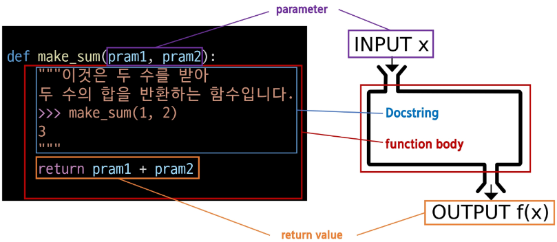
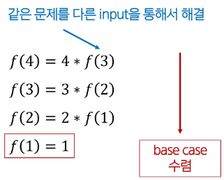
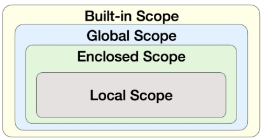

## Python 03 Function (2025.01.22))

### 함수

#### 1. 함수 (Functions)

- 특정 작업을 수행하기 위한 재사용 가능한 코드 묶음
- 함수를 사용하는 이유
    - 코드의 중복을 방지
    - 재사용성이 높아지고, 코드의 가독성과 유지보수성 향상
    
    ```python
    # 두 수의 합을 구하는 코드
    num1 = 5
    num2 = 3
    sum_result = num1 + num2
    print(sum_result) # 8
    
    # 두 수의 합을 구하는 함수
    def get_sum(num1, num2):
        return num1 + num2
    
    # 함수를 호출하여 결과 출력
    num1 = 5
    num2 = 3
    sum_result = get_sum(num1, num2)
    print(sum_result) # 8
    ```
    

#### 2. 함수 호출 (function call)

- 함수를 실행하기 위해 함수의 이름을 사용하여 해당 함수의 코드 블록을 실행하는 것

```python
function_name(arguments)
```

#### 3. 함수 구조 및 함수 정의와 호출

- 함수 정의 (정의)
    - 함수 정의는 def 키워드로 시작
    - def 키워드 이후 함수 이름 작성
    - 괄호안에 매개변수를 정의할 수 있음
    - 매개변수(parameter)는 함수에 전달되는 값을 나타냄
    
    ```python
    def make_sum(pram1, pram2):
        """
        이것은 두 수를 받아 두 수의 함을 반환하는 함수입니다.
        >>> make_sum(1, 2)
        3
        """
        return pram1 + pram2
    
    result = make_sum(100, 30)
    print(result) # 130
    ```
    
   
    

- 함수 body
    - 콜론(:) 다음에 들여쓰기 된 코드 블록
    - 함수가 실행될 때 수행되는 코드를 정의
- Docstring
    - 함수 body 앞에 선택적으로 작성 가능한 함수 설명서
- 함수 반환 값
    - 함수는 필요한 경우 결과를 반환할 수 있음
    - return 키워드 이후에 반환할 값을 명시
    - return문은 함수의 실행을 종료하고, 결과를 호출 부분으로 반환
    - 함수 내에서 return문이 없다면 None이 반환됨
- 함수 호출
    - 함수를 사용하기 위해서는 호출이 필요
    - 함수의 이름과 소괄호를 활용해 호출
    - 필요한 경우 인자(argument)를 전달해야 함
    - 호출 부분에서 전달된 인자는 함수 정의 시 작성한 매개변수에 대입

#### 4. 함수와 반환 값

- print() 함수는 반환 값이 없음
    - print() 함수는 화면에 값을 출력하기만 할 뿐, 반환(return) 값이 없음
    - 파이썬에서 반환 값이 없는 함수는 기본적으로 None을 반환한다고 간주되기 때문
    - 출력을 담당하는 함수는 결과를 ‘반환(return)’하지 않으므로, 내부적으로 아무 값도 반환하지 않는 함수와 마찬가지로 None이 나옴
    
    ```python
    return_value = print(1) # 1
    print(return_value) # None
    
    def my_func():
        print('hello') # hello
    
    result = my_func()
    print(result) # None
    ```
    

---

### 매개변수와 인자

#### 1. 매개변수(parameter)와 인자(argument)

- 매개변수의 정의
    - 함수를 정의할 때, 함수가 받을 값을 나타내는 변수
- 인자의 정의
    - 함수를 호출할 때, 실제로 전달되는 값
- 매개변수와 인자 예시

```python
# x와 y는 매개변수(parameter)
def add_numbers(x, y):
    result = x + y
    return result

a = 2
b = 3
sum_result = add_numbers(a, b) # a와 b는 인자(argument)
print(sum_result) # 5
```

#### 2. 다양한 인자 종류

- 다양한 인자 종류
    - 위치 인자 (Positional Arguments)
        - 함수 호출 시 인자의 위치에 따라 전달되는 인자
        - 위치 인자는 함수 호출 시 반드시 값을 전달해야 함
        
        ```python
        def greet(name, age):
            print(f"안녕하세요, {name}님! {age}살이시군요.")
        
        # 안녕하세요, Alice님! 25살이시군요.
        greet("Alice", 25)
        # 안녕하세요, 25님! Alice살이시군요.
        greet(25, "Alice")
        # TypeError: greet() missing 1 required positional argument: 'age'
        greet("Alice")
        ```
        
    - 기본 인자 값 (Default Argument Values)
        - 함수 정의에서 매개변수에 기본 값을 할당하는 것
        - 함수 호출 시 인자를 전달하지 않으면, 기본 값이 매개변수에 할당됨
        
        ```python
        def greet(name, age=30):
            print(f"안녕하세요, {name}님! {age}살이시군요.")
        
        # 안녕하세요, Bob님! 30살이시군요.
        greet("Bob")
        # 안녕하세요, Charlie님! 40살이시군요.
        greet("Charlie", 40)
        ```
        
    
    - 키워드 인자 (Keyword Arguments)
        - 함수 호출 시 인자의 이름과 함께 값을 전달하는 인자
        - 매개변수와 인자를 일치시키지 않고, 특정 매개변수에 값을 할당할 수 있음
        - 인자의 순서는 중요하지 않으며, 인자의 이름을 명시하여 전달
        - 단, 호출 시 키워드 인자는 위치 인자 뒤에 위치해야 함
        
        ```python
        def greet(name, age):
            print(f"안녕하세요, {name}님! {age}살이시군요.")
        
        # 안녕하세요, Dave님! 35살이시군요.
        greet(name="Dave", age=35)
        # 안녕하세요, Dave님! 35살이시군요.
        greet(age=35, name="Dave")
        # positional argument follows keyword argument
        greet(age=35, "Dave")
        ```
        
    
    - 임의의 인자 목록 (Arbitrary Argument Lists)
        - 정해지지 않은 개수의 인자를 처리하는 인자
        - 함수 정의 시 매개변수 앞에 ‘*’를 붙여 사용
        - 여러 개의 인자를 tuple로 처리
        
        ```python
        def caculate_sum(*args):
            # (1, 100, 5000, 30)
            print(args)
            # <class 'tuple'>
            print(type(args))
        
        caculate_sum(1, 100, 5000, 30)
        ```
        
    
    - 임의의 키워드 인자 목록 (Arbitrary Keyword Argument Lists)
        - 정해지지 않은 개수의 키워드 인자를 처리하는 인자
        - 함수 정의 시 매개변수 앞에 ‘**’를 붙여 사용
        - 여러 개의 인자를 dictionary로 묶어 처리
        
        ```python
        def print_info(**kwargs):
            print(kwargs)
        
        # {"name": "Eve", "age": 30}
        print_info(name="Eve", age=30)
        ```
        

- 함수 인자 권장 작성순서
    - 위치 → 기본 → 가변 → 가변 키워드
    - 호출 시 인자를 전달하는 과정에서 혼란을 줄일 수 있도록 함
    - 단, 모든 상황에 적용되는 절대적인 규칙은 아니며, 상황에 따라 유연하게 조정될 수 있음
    
    ```python
    def func(pos1, pos2, default_arg="default", *args, **kwargs):
        ...
        
    # 인자의 모든 종류를 적용한 예시
    def func(pos1, pos2, default_arg='default', *args, **kwargs):
        print('pos1: ', pos1)
        print('pos2: ', pos2)
        print('default: ', default_arg)
        print('args: ', args)
        print('kwargs: ', kwargs)
    
    """
    pos1: 1
    pos2: 2
    dafault_arg: 3
    args: (4, 5, 6)
    kwargs: {'key1': 'value1', 'key2':'value2'}
    """
    func(1, 2, 3, 4, 5, 6, key1='value1', key2='value2')
    ```
    

---

### 재귀 함수

#### 1. 재귀 함수

- 함수 내부에서 자기 자신을 호출하는 함수
- 재귀 함수 예시 - 팩토리얼
    - factorial 함수는 자기 자신을 재귀적으로 호출하여 입력된 숫자 n의 팩토리얼을 계산
    - 재귀 호출은 n이 0이 될 때까지 반복되며, 종료 조건을 설정하여 재귀 호출이 멈추도록 함
    - 재귀 호출의 결과를 이용하여 문제를 작은 단위의 문제로 분할하고, 분할된 문제들의 결과를 조합하여 최종 결과를 도출
    
    ```python
    n!
    n * (n - 1)!
    n * (n - 1) * (n - 2)!
    ...
    
    # 팩토리얼 예시
    4!
    = 4 * 3!
    = 4 * 3 * 2!
    = 4 * 3 * 2 * 1
    = 24
    
    3!
    = 3 * 2!
    = 3 * 2 * 1
    = 6
    
    2!
    = 2 * 1
    = 2
    
    1!
    = 1
    ```
    
    ```python
    def factorial(n):
        # 종료 조건: n이 0이면 1을 반환
        if n == 0:
            return 1
        else:
            # 재귀 호출: n과 n-1의 팩토리얼을 곱한 결과를 반환
            return n * factorial(n - 1)
        
    # 팩토리얼 계산 예시
    print(factorial(5)) # 120
    ```
    
    
    

- 재귀 함수 특징
    - 특정 알고리즘 식을 표현할 때 변수의 사용이 줄어들며, 코드의 가독성이 높아짐
    - 1개 이상의 base case(종료되는 상황)가 존재하고, 수렴하도록 작성

- 재귀 함수를 사용하는 이유
    - 문제의 자연스러운 표현
        - 복잡한 문제를 간결하고 직관적으로 표현 가능
    - 코드 간결성
        - 상황에 따라 반복문보다 알고리즘 코드가 더 간결하고 명확해질 수 있음
    - 수학적 문제 해결
        - 수학적 정의가 재귀적으로 표현되는 경우, 직접적인 구현 가능
- 재귀 함수 활용 시 기억해야 할 것
    - 종료 조건을 명확히
    - 반복되는 호출이 종료 조건을 향하도록

---

### 내장 함수

#### 1. 내장 함수 (Built-in Function)

- 파이썬이 기본적으로 제공하는 함수
- 별도의 import 없이 바로 사용 가능

```python
# 자주 사용되는 내장 함수 예시
numbers = [1, 2, 3, 4, 5]

print(numbers)                       # [1, 2, 3, 4, 5]
print(len(numbers))                  # 5
print(max(numbers))                  # 5
print(min(numbers))                  # 1
print(sum(numbers))                  # 15
print(sorted(numbers, reverse=True)) # [5, 4, 3, 2, 1]
```

#### 2. map

- map의 정의
    - 순회 가능한 데이터 구조(iterable)의 모든 요소에 함수를 적용하고, 그 결과를 map object로 반환
    
    ```python
    # map(function, iterable)
    """
    function: 각 요소에 적용할 함수
    iterable: 함수를 적용할 데이터 집합
    """
    
    # map(function, iterable1, iterable2, ...)
    """
    function: 각 요소에 적용할 함수
    iterable1, iterable2, ...: 함수를 적용할 데이터 집합
    """
    
    # map 함수 활용 예시
    numbers = [1, 2, 3]
    result = map(str, numbers)
    
    print(result)       # <map object at 0x0000022FA35D13D0>
    print(list(result)) # ['1', '2', '3']
    ```
    

- map의 활용
    - SWEA 문제의 input처럼 문자열 ‘1 2 3’이 입력 되었을 때, 활용 예시
    
    ```python
    # SWEA 문제의 input처럼 문자열 ‘1 2 3’이 입력 되었을 때, 활용 예시
    numbers1 = input().split()
    print(numbers1) # ['1', '2', '3']
    
    numbers2 = list(map(int, input().split()))
    print(numbers2) # [1, 2, 3]
    ```
    

#### 3. zip (*iterables)

- zip의 정의
    - 임의의 iterable을 모아 튜플을 원소로 하는 zip object를 반환
    
    ```python
    girls = ['jane', 'ashley']
    boys = ['peter', 'jay']
    pair = zip(girls, boys)
    
    print(pair)       # <zip object at 0x0000028285110F00>>
    print(list(pair)) # [('jane', 'peter'), ('ashley', 'jay')]
    ```
    

- zip() 활용

```python
# 여러 개의 리스트를 동시에 조회할 때
kr_scores = [10, 20, 30, 50]
math_scores = [20, 40, 50, 70]
en_scores = [40, 20, 30, 50]

for student_scores in zip(kr_scores, math_scores, en_scores):
    """
    (10, 20, 40)
    (20, 40, 20)
    (30, 50, 30)
    (50, 70, 50)
    """
    print(student_scores)

# 2차원 리스트의 같은 컬럼(열) 요소를 동시에 조회할 때
scores = [
    [10, 20, 30],
    [40, 50, 39],
    [20, 40, 50],
]

for score in zip(*scores):
    """
    (10, 20, 30)
    (40, 50, 39)
    (20, 40, 50)
    """
    print(score)
```

---

### 함수와 Scope

#### 1. Scope (Python의 범위)

- 함수는 코드 내부에 local scope를 생성하며, 그 외의 공간인 global scope로 구분
- 범위와 변수 관계
    - scope
        - global scope
            - 코드 어디에서든 참조할 수 있는 공간
        - local scope
            - 함수가 만든 scope
            - 함수 내부에서만 참조 가능
    - variable
        - global variable
            - global scope에 정의된 변수
        - local variable
            - local scope에 정의된 변수
- scope 예시
    - num은 local scope에 존재하기 때문에 global scope에서 사용할 수 없음
        - 이는 변수의 수명주기와 연관이 있음
        
        ```python
        def func():
            num = 20
            print('local', num) # local 20
        
        func()
        print('global', num) # NameError: name 'num' is not defined
        ```
        

- 변수 수명주기 (Lifecycle)
    - 변수의 수명주기는 변수가 선언되는 위치와 scope에 따라 결정됨
    - scope 종류
        - built-in scope
            - 파이썬이 실행된 이후부터 영원히 유지
        - global scope
            - 모듈이 호출된 시점 이후 혹은 인터프리터가 끝날 때까지 유지
        - local scope
            - 함수가 호출될 때 생성되고, 함수가 종료될 때까지 유지

- 이름 검색 규칙 (Name Resolution)
    - 파이썬엣 사용되는 이름(식별자)들은 특정한 이름공간(namespace)에 저장되어 있음
    - 아래와 같은 순서로 이름을 찾아 나가며, LEGB Rule이라고 부름
        - Local Scope
            - 지역 범위 (현재 작업 중인 범위)
        - Enclosed Scope
            - 지역 범위 한 단계 위 범위
        - Global Scope
            - 최상단에 위치한 범위
        - Built-in Scope
            - 모든 것을 담고 있는 범위 (정의하지 않고 사용할 수 있는 모든 것)
    - 함수 내에서는 바깥 Scope의 변수에 접근 가능하나 수정은 할 수 없음
    
    
    

- LEGB Rule 예시
    - sum이라는 이름을 global scope에서 사용하게 되면서, 기존에 built-in scope에 있던 내장함수 sum를 사용하지 못하게 됨
    - sum을 참조 시 LEGB Rule에 따라 global에서 먼저 찾기 때문
    
    ```python
    print(sum)           # <built-in function sum>
    print(sum(range(3))) # 3
    
    sum = 5
    
    print(sum)           # 5
    print(sum(range(3))) # TypeError: 'int' object is not callable
    ```
    

- LEGB Rule 퀴즈

```python
a = 1
b = 2

def enclose():
    a = 10
    c = 3

    def local(c):
        print(a, b, c) # 10 2 500

    local(500)
    print(a, b, c)     # 10 2 3

enclose()
print(a, b)            # 1 2
```

#### 2. ‘global’ 키워드

- 변수의 스코프를 전역 범위로 지정하기 위해 사용
- 일반적으로 함수 내에서 전역 변수를 수정하려는 경우에 사용

```python
num = 0 # 전역 변수

def increment():
    global num # num를 전역 변수로 선언
    num += 1

print(num) # 0
increment()
print(num) # 1
```

- ‘global’ 키워드 주의사항

```python
# global 키워드 선언 전에 참조 불가
num = 0

def increment():
    # SyntaxError: name 'num' is used prior to global declaration
    print(num)
    global num
    num += 1
    
# 매개변수에는 global 키워드 사용 불가
num = 0

def increment(num):
    # 'num' is assigned before global declaration
    global num
    num += 1
```

---

### 함수 스타일 가이드

#### 1. 함수 이름 작성 규칙

- 기본 규칙
    - 소문자와 언더 스코어(__ 사용
    - 동사로 시작하여 함수의 동작 설명
    - 약어 사용 지양
    
    ```python
    # Good
    def calculate_total_price(price, tax):
        return price + (price * tax)
    
    # Bad
    def calc_price(p, t):
        return p + (p * t)
    ```
    

- 함수 이름 구성 요소

```python
# 동사 + 명사
save_user()

# 동사 + 형용사 + 명사
calculate_total_price()

# get/set 접두사
get_username()
set_username()
```

#### 2. 단일 책임 원칙 (Single Responsibility Principle)

- 모든 객체는 하나의 명확한 목적과 책임만을 가져야 함
- 잘못된 설계 예시
    - 여러 책임이 섞인 함수
    
    ```python
    def process_user_data(user_data):
        # 책임 1: 데이터 유효성 검사
        if len(user_data['password']) < 8:
            raise ValueError('비밀번호는 8자 이상이어야 합니다.')
        
        # 책임 2: 비밀번호 암호화 및 저장
        user_data['password'] = hash_password(user_data['password'])
        db.users.insert(user_data)
    
        # 책임 3: 환영 이메일 발송
        send_email(user_data['email'], '가입을 환영합니다.')
    ```
    

- 올바른 설계 예시
    - 책임을 분리한 함수들
    
    ```python
    def validate_password(password):
        # 책임 1: 비밀번호 유효성 검사
        if len(password) < 8:
            raise ValueError('비밀번호는 8자 이상이어야 합니다.')
    
    def save_user(user_data):
        # 책임 2: 비밀번호 암호화 및 저장
        user_data['password'] = hash_password(user_data['password'])
        db.users.insert(user_data)
    
    def send_welcome_email(email):
        # 책임 3: 환영 이메일 발송
        send_email(email, '가입을 환영합니다.')
    
    # 메인 함수에서 순차적으로 실행
    def process_user_data(user_data):
        validate_password(user_data['password'])
        save_user(user_data)
        send_welcome_email(user_data['email'])
    ```
    

#### 3. 함수 설계 원칙

- 명확한 목적
    - 함수는 한 가지 작업만 수행
    - 함수 이름으로 목적을 명확히 표현
- 책임 분리
    - 데이터 검증, 처리, 저장 등을 별도 함수로 분리
    - 각 함수는 독립적으로 동작 가능하도록 설계
- 유지보수성
    - 작은 단위의 함수로 나누어 관리
    - 코드  수정 시 영향 범위를 최소화

---

### Packing & Unpacking

#### 1. Packing (패킹)

- 여러 개의 값을 하나의 변수에 묶어서 담는 것
- 패킹 예시

```python
# 1. 한 변수에 콤(,)로 구분된 값을 넣으면 자동으로 튜플로 처리
packed_values = 1, 2, 3, 4, 5
print(packed_values) # (1, 2, 3, 4, 5)

# 2. '*'을 활용한 패킹 (변수 할당 시)
# '*변수명'을 사용하면 "나머지 모든 값"을 리스트로 묶어서 받을 수 있음
numbers = [1, 2, 3, 4, 5]
a, *b, c = numbers

print(a) # 1
print(b) # [2, 3, 4]
print(c) # 5

# 3. '*'을 활용한 패킹 (함수 매개변수 작성 시)
# '*매개변수'를 사용하면 호출 시 여러 개의 인자를 한 변수에 묶어서 받을 수 있음
# 이 때, 함수 내부에서 해당 매개변수는 튜플 형태로 취급
def my_func(*args):
    print(args)      # (1, 2, 3, 4, 5)
    print(type(args)) # <class 'tuple'>

my_func(1, 2, 3, 4, 5)
```

- print 함수의 패킹 예시

```python
# print 함수에서 임의의 가변 인자를 작성할 수 있었던 이유
# 인자 개수에 상관 없이 튜플 하나로 패킹 되어서 내부에서 처리
"""
print(*objects, sep=' ', end='\n', file=sys.stdout, flush=False)
objects를 텍스트 스트림 file로 인쇄하는데, sep로 구분되고 end를 뒤에 붙입니다.
있다면 sep, end, file 및 flush는 반드시 키워드 인자로 제공해야 합니다.
모든 비 키워드 인자는 str()이 하듯이 문자열로 변환된 후 스트림에 쓰이는데, sep로 구분되고 end를 뒤에 붙입니다.
"""

def my_func(*objects):
    print(objects)       # (1, 2, 3, 4, 5)
    print(type(objects)) # <class 'tuple'>

# (1, 2, 3, 4, 5)
# <class 'tuple'>
my_func(1, 2, 3, 4, 5)
```

#### 2. Unpacking (언패킹)

- 패킹된 변수를 풀어서 개별 변수나 함수 인자로 전달
- 언패킹 예시

```python
# 1. 튜플이나 리스트 등의 객체의 요소들을 개별 변수에 할당
packed_value = 1, 2, 3, 4, 5
a, b, c, d, e = packed_value
print(a, b, c, d, e) # 1 2 3 4 5

# 2. '*'을 활용한 언패킹 (함수 인자 전달)
# 시퀀스(리스트, 튜플 등)를 함수에 전달할 때, 각 요소를 "풀어서" 개별 인자로 넘겨줄 수 있음
def my_function(x, y, z):
    print(x, y, z)
names = ['alice', 'jane', 'peter']
my_function(*names) # alice jane peter

# 3. '**'을 활용한 언패킹 (딕셔너리 -> 함수 키워드 인자)
# 딕셔너리의 키-값 쌍을 분리해, 함수의 키워드 인자로 전달할 때 사용
def my_function(x, y, z):
    print(x, y, z)
my_dict = {'x': 1, 'y': 2, 'z': 3}
my_function(**my_dict) # 1 2 3
```

#### 3. *, ** 패킹 / 언패킹 연산자 정리

- ‘*’
    - 패킹 연산자로 사용될 때, 여러 개의 인자를 하나의 리스트나 튜플로 묶음
    - 언패킹 연산자로 사용될 때, 시퀀스나 반복 가능한 객체를 각각의 요소로 언패킹하여 함수의 인자로 전달
- ‘**’
    - 언패킹 연산자로 사용될 때, 딕셔너리의 키-값 쌍을 개별 키워드 인자로 전달

---

### 참고

#### 1. 람다 표현식 (Lambda Expressions)

- 익명 함수를 만드는 데 사용되는 표현식
- 한 줄로 간단한 함수를 정의

#### 2. 람다 표현식 구조

- lambda 키워드
    - 람다 함수를 선언하기 위해 사용되는 키워드
- 매개변수
    - 함수에 전달되는 매개변수들
    - 여러 개의 매개변수가 있을 경우 쉼표로 구분
- 표현식
    - 함수의 실행되는 코드 블록으로, 결과값을 반환하는 표현식으로 작성
    
    ```python
    lambda 매개변수: 표현
    ```
    

#### 3. 람다 표현식 예시

```python
# 1. 간단한 연산이나 함수를 한 줄로 표현할 때 사용
# 함수를 매개변수로 전달한느 경우에도 유용하게 활용
def addition(x, y):
    return x + y
    
# 위에 함수를 람다 표현식으로 변경
lambda x, y: x + y

# 2. 간단한 연산이나 함수를 한 줄로 표현할 때 사용
# 함수를 매개변수로 전달하는 경우에도 유용하게 활용
def addition(x, y):
    return x + y
result = addition(3, 5)
print(result) # 8

# 위에 함수를 람다 표현식으로 변경
addition = lambda x, y: x + y
result = addition(3, 5)
print(result) # 8
```

#### 4. 람다 표현식 활용 (with map 함수)

```python
# lambda 미사용
numbers = [1, 2, 3, 4, 5]
def square(x):
    return x**2
squared1 = list(map(square, numbers))
print(squared1) # [1, 4, 9, 16, 25]

# lambda 사용
numbers = [1, 2, 3, 4, 5]
squared2 = list(map(lambda x: x**2, numbers))
print(squared2) # [1, 4, 9, 16, 25]
```
