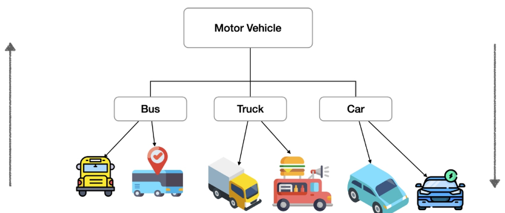
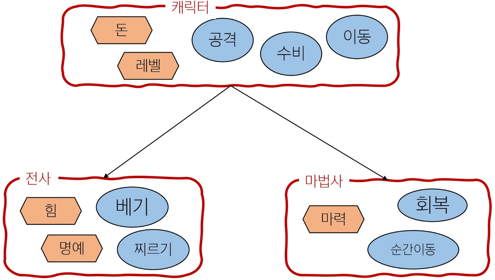
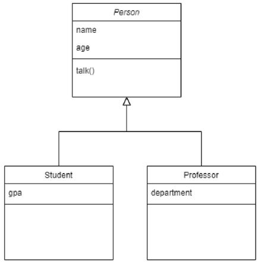
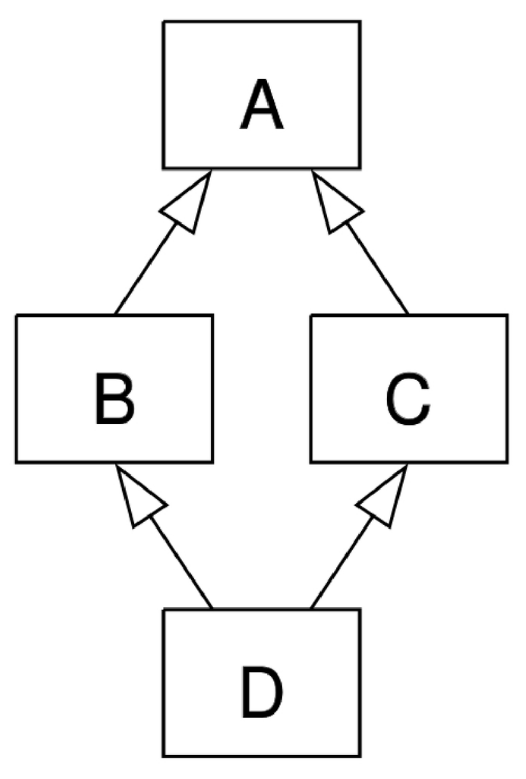
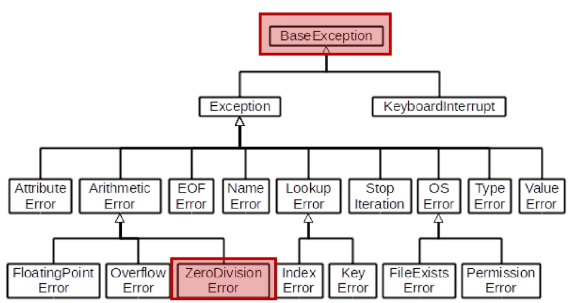
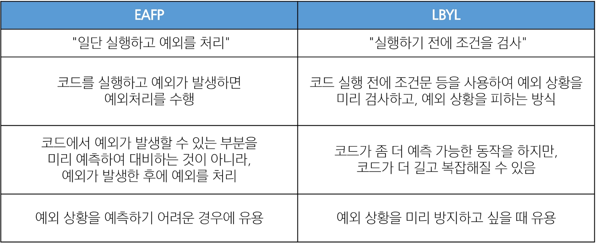

## Python 08 OOP 2 & Exception (2025.02.04)

### 상속

#### 1. 상속 (Inheritance)

- 한 클래스(부모)의 속성과 메서드를 다른 클래스(자식)가 물려받는 것

#### 2. 상속이 필요한 이유

1. 코드 재사용
    1. 상속을 통해 기존 클래스의 속성과 메서드를 재사용할 수 있음
    2. 기존 클래스를 수정하지 않고도 기능을 확장할 수 있음
2. 계층 구조
    1. 상속을 통해 클래스들 간의 계층 구조를 형성할 수 있음
    2. 부모 클래스와 자식 클래스 간의 관계를 표현하고, 더 구체적인 클래스를 만들 수 있음
3. 유지 보수의 용이성
    1. 상속을 통해 기존 클래스의 수정이 필요한 경우, 해당 클래스만 수정하면 되므로 유지 보수가 용이해짐
    2. 코드의 일관성을 유지하고, 수정이 필요한 범위를 최소화할 수 있음



#### 3. 상속 예시

- 클래스
- 속성
- 메서드



```python
class Animal:
    def eat(self):
        print("먹는 중")

class Dog(Animal):
    def bark(self):
        print("멍멍")

my_dog = Dog()
my_dog.bark() # 멍멍

# 부모 클래스(Animal) 메서드 사용 가능
my_dog.eat() # 먹는 중
```

#### 4. 상속 없이 구현하는 경우

- 학생/교수 정보를 별도로 표현하기 어려움

```python
class Person:
    def __init__(self, name, age):
        self.name = name
        self.age = age

    def talk(self):
        print(f"반갑습니다. {self.name}입니다.")

s1 = Person("김학생", 23)
s1.talk() # 반갑습니다. 김학생입니다.

p1 = Person("박교수", 59)
p1.talk() # 반갑습니다. 박교수입니다.
```

- 교수/학생 클래스로 분리했지만, 메서드가 중복으로 정의될 수 있음

```python
class Professor:
    def __init__(self, name, age, department):
        self.name = name
        self.age = age
        self.department = department
    
    def talk(self): # 중복
        print(f"반갑습니다. {self.name}입니다.")

class Student:
    def __init__(self, name, age, gpa):
        self.name = Name
        self.age = age
        self.gpa = gpa
    
    def talk(self): # 중복
        print(f"반갑습니다. {self.name}입니다.")
```

#### 5. 상속을 사용한 계층구조 변경

```python
class Person:
    def __init__(self, name, age):
        self.name = name
        self.age = age

    def talk(self): # 메서드 재사용
        print(f"반갑습니다. {self.name}입니다.")

class Professor(Person):
    def __init__(self, name, age, department):
        self.name = name
        self.age = age
        self.department = department

class Student(Person):
    def __init__(self, name, age, gpa):
        self.name = name
        self.age = age
        self.gpa = gpa

p1 = Professor("박교수", 49, "컴퓨터공학과")
s1 = Student("김학생", 20, 3.5)

# 부모 Person 클래스의 talk 메서드를 활용
p1.talk() # 반갑습니다. 박교수입니다.

# 부모 Person 클래스의 talk 메서드를 활용
s1.talk() # 반갑습니다. 김학생입니다.
```



---

### 메서드 오버라이딩

#### 1. 메서드 오버라이딩 (Method Overriding)

- 부모 클래스의 메서드를 같은 이름, 같은 파라미터 구조로 재정의하는 것

#### 2. 메서드 오버라이딩 예시

- 자식 클래스가 부모 클래스의 메서드를 덮어써서 새로운 동작을 구현할 수 있음

```python
class Animal:
    def eat(self):
        print("Animal이 먹는 중")

class Dog(Animal):
    # 부모 클래스(Animal)의 eat 메서드를 재정의 (오버라이딩)
    def eat(self):
        print("Dog가 먹는 중")

my_dog = Dog()
my_dog.eat() # Dog가 먹는 중
```

#### 3. [참고] 오버로딩 (Overloading)

- 같은 이름, 다른 파라미터를 가진 여러 메서드를 정의하는 것 (파이썬은 미지원)
- 파이썬은 실제로 하나의 메서드만 인식하며, 인자의 형태가 다르다는 이유로 메서드를 여러 개 구분하여 불러주지 않음

```python
class Example:
    def do_something(self, x):
        print("첫 번째 do_something 메서드: ", x)

    # 파이썬에서는 메서드가 "이름"이 같으면 앞선 정의를 덮어써버림
    def do_something(self, x, y):
        print("두 번째 do_something 메서드: ", x, y)

example = Example()
# TypeError: do_something() missing 1 required positional argument: 'y'
example.do_something(10)
```

---

### 다중 상속

#### 1. 다중 상속

- 둘 이상의 상위 클래스로부터 여러 행동이나 특징을 상속 받을 수 있는 것
- 상속 받은 모든 클래스의 요소를 활용 가능함
- 중복된 속성이나 메서드가 있는 경우 상속 순서에 의해 결정됨

```python
class Person:
    def __init__(self, name):
        self.name = name

    def greeting(self):
        return f"안녕, {self.name}"
    
class Mom(Person):
    gene = "XX"

    def swim(self):
        return "엄마가 수영"
    
class Dad(Person):
    gene = "XY"

    def walk(self):
        return "아빠가 걷기"
    
class FirstChild(Dad, Mom):
    def swim(self):
        return "첫째가 수영"
    
    def cry(self):
        return "첫째가 응애"
    
baby1 = FirstChild("아가")
print(baby1.cry())  # 첫째가 응애
print(baby1.swim()) # 첫째가 수영
print(baby1.walk()) # 아빠가 걷기
print(baby1.gene)   # XY
```

#### 2. 다이아몬드 문제 (The Diamond Problem)

- 두 클래스 B와 C가 A에서 상속되고, 클래스 D가 B와 C 모두에서 상속될 때 발생하는 모호함
- B와 C가 재정의한 메서드가 A에 있고 D가 이를 재정의하지 않은 경우라면, D는 B의 메서드 중 어떤 버전을 상속하는가? 아니면 C의 메서드 버전을 상속하는가?
- 파이썬에서의 해결책
    - MRO(Method Resolution Order) 알고리즘을 사용하여 클래스 목록을 생성
    - 부모 클래스로부터 상속된 속성들의 검색을 깊이 우선으로, 왼쪽에서 오른쪽으로, 계층 구조에서 겹치는 같은 클래스를 두 번 검색하지 않음
    - 그래서, 속성이 D에서 발견되지 않으면 B에서 찾고, 거기에서도 발견되지 않으면, C에서 찾고, 이런 식으로 진행 됨
        
        
        

- MRO (Method Resolution Order)
    - 파이썬이 메서드를 찾는 순서에 대한 규칙
    - 메서드 결정 순서

---

### super() 메서드

#### 1. super()

- 부모 클래스(또는 상위 클래스)의 메서드를 호출하기 위해 사용하는 내장 함수

#### 2. super() 기능

- 다중 상속 상황에서 특히 유용하며, MRO를 따르기 때문에 여러 부모 클래스를 가진 자식 클래스에서 다음에 호출해야 할 부모 메서드를 순서대로 호출할 수 있게 함

#### 3. super()의 2가지 사용 사례

1. 단일 상속 구조
    1. 명시적으로 이름을 지정하지 않고 부모 클래스를 참조할 수 있으므로, 코드를 더 유지 관리하기 쉽게 만들 수 있음
    2. 클래스 이름이 변경되거나 부모 클래스가 교체되어도 super()를 사용하면, 코드 수정이 더 적게 필요
2. 다중 상속 구조
    1. MRO를 따른 메서드 호출
    2. 복잡한 다중 상속 구조에서 발생할 수 있는 문제를 방지

#### 4. super() 사용 예시 (단일 상속)

- 명시적으로 부모 클래스 이름을 적지 않아도, 부모 메서드를 안전하게 호출할 수 있음
- Student의 생성자에서 super().__init()__를 호출하면, Person의 __init__() 메서드가 호출되어 name, age, number, email 속성을 초기화한 뒤 Student 고유의 student_id 속성을 추가
- 이 때 Person 클래스를 직접 명시하지 않고 super()를 사용하므로, 나중에 클래스 이름이 바뀌거나 상속 구조가 변경되어도 super() 호출 부분을 그대로 사용할 수 있어 유지보수성이 향상

```python
# super()를 사용하지 않았을 때 (단일 상속)
class Person:
    def __init__(self, name, age, number, email):
        self.name = name
        self.age = age
        self.number = number
        self.email = email

class Student(Person):
    def __init__(self, name, age, number, email, student_id):
        self.name = name
        self.age = age
        self.number = number
        self.email = email
        self.student_id = student_id

# super()를 사용할 때 (단일 상속)
class Person:
    def __init__(self, name, age, number, email):
        self.name = name
        self.age = age
        self.number = number
        self.email = email

class Student(Person):
    def __init__(self, name, age, number, email, student_id):
        # super()를 통해 Person의 __init__ 메서드 호출
        super().__init__(name, age, number, email)
        self.student_id = student_id
```

#### 5. super() 사용 예시 (다중 상속)

1. Child 클래스는 ParentA, ParentB를 순서대로 상속
2. child = Child()를 실행하면 Child의 init 메서드에서 super().__init__()를 호출
3. MRO에 의해 Child → ParentA → ParentB 순으로 메서드를 찾는데, 이 상황에서 super().__init__()는 바로 다음 순서에 해당하는 ParentA의 init을 호출
4. ParentA의 init이 실행되어 value_a가 초기화
    1. ParentB의 init은 이 예제에서는 자동으로 호출되지 않음
    2. 만약 ParentA의 init 안에서도 super().__init__()를 호출한다면, 그 다음으로 ParentB의 init이 실행되어 value_b도 초기화할 수 있음
    3. 이렇게 여러 부모 클래스의 초기화가 순서대로 이루어질 수 있음
5. child.show_value()를 호출하면 child의 show_value에서 super().show_value()를 호출
6. show_value() 메서드를 찾기 위해 Child → ParentA → ParentB 순서로 탐색하므로, 첫 번째로 ParentA의 show_value()가 실행됨

```python
# super()를 사용할 때 (다중 상속)
class ParentA:
    def __init__(self):
        super().__init__()
        self.value_a = 'ParentA'

    def show_value(self):
        print(f'Value from ParentA: {self.value_a}')

class ParentB:
    def __init__(self):
        self.value_b = 'ParentB'

    def show_value(self):
        print(f'Value from ParentB: {self.value_b}')

class Child(ParentA, ParentB):
    def __init__(self):
        super().__init__()  # ParentA 클래스의 __init__ 메서드 호출
        self.value_c = 'Child'

    def show_value(self):
        super().show_value()  # ParentA 클래스의 show_value 메서드 호출
        print(f'Value from Child: {self.value_c}')

child = Child()
child.show_value()
"""
Value from ParentA: ParentA
Value from Child: Child
"""

print(child.value_c)  # Child
print(child.value_a)  # ParentA
print(
    child.value_b
) # AttributeError: 'Child' object has no attribute 'value_b'

"""
<ParentA에 super().__init__()를 추가하면?>
그 다음으로 ParentB의 __init__가 실행되어 value_b도 초기화할 수 있음
그러면 print(child.value_b)는 ParentB를 출력하게 됨

print(child.value_b)  # ParentB
"""

"""
<Child 클래스의 MRO>
Child -> ParentA -> ParentB

super()는 단순히 “직계 부모 클래스를 가리킨다”가 아니라, 
MRO 순서를 기반으로 “현재 클래스의 다음 순서” 클래스(또는 메서드)를 가리킴

따라서 ParentA에서 super()를 부르면 MRO상 다음 클래스인 ParentB.__init__()가 호출됨
"""

"""
1.1 Child 클래스의 인스턴스를 생성할 때 일어나는 일
    1.	child = Child() 호출 시, Child.__init__()가 실행
    2.	Child.__init__() 내부에서 super().__init__()를 호출
        - 여기서 Child의 super()는 MRO에 의해 ParentA의 __init__()를 가리킴
    3.	ParentA.__init__()로 진입

1.2. ParentA.__init__() 내부
	1.	ParentA.__init__()에는 다시 super().__init__()가 있음
	2.	ParentA를 기준으로 MRO에서 “다음 클래스”는 ParentB, 따라서 ParentA의 super().__init__()는 ParentB.__init__() 호출
    3.	ParentB.__init__()가 실행되면서 self.value_b = 'ParentB'가 설정됨
	4.	ParentB.__init__()가 종료된 후, 다시 ParentA.__init__()로 돌아와 self.value_a = 'ParentA'가 설정됨
	5.	ParentA.__init__() 종료 후, 다시 Child.__init__()로 돌아감
	6.	마지막으로 Child.__init__() 내에서 self.value_c = 'Child'가 설정되고 종료

1.3 결과적으로 child 인스턴스는 value_a, value_b, value_c 세 속성을 모두 갖게 됨
	- child.value_a → 'ParentA'
	- child.value_b → 'ParentB' 
	- child.value_c → 'Child'
"""
```

#### 6. super()의 이점

- 다중 상속 상황에서 super()는 다음에 호출해야 할 부모 메서드를 MRO 순서에 따라 결정하기 때문에, 명시적으로 특정 부모 클래스를 가리키지 않고도 올바른 순서로 부모 초기화나 메서드 호출이 가능
- 이를 통해 복잡한 상속 구조에서도 코드를 유연하고 깔끔하게 유지할 수 있음

#### 7. super() 정리

- super()를 사용할 때는 MRO를 잘 이해하고 있어야 함
- ClassName.__mro__ 또는 ClassName.mro()를 확인해 MRO 순서를 파악한 뒤 적절히 활용하는 연습을 하면, 보다 복잡한 상속 구조에서도 코드를 잘 관리할 수 있음

#### 8. mro(), __mro__ 사용 예시

```python
class A:
    def __init__(self):
        print('A Constructor')

class B(A):
    def __init__(self):
        super().__init__()
        print('B Constructor')

class C(A):
    def __init__(self):
        super().__init__()
        print('C Constructor')

class D(B, C):
    def __init__(self):
        super().__init__()
        print('D Constructor')

# [<class '__main__.D'>, <class '__main__.B'>, <class '__main__.C'>, <class '__main__.A'>, <class 'object'>]
print(D.mro())

# (<class '__main__.D'>, <class '__main__.B'>, <class '__main__.C'>, <class '__main__.A'>, <class 'object'>)
print(D.__mro__)
```

#### 9. MRO가 필요한 이유

- 부모 클래스들이 여러 번 액세스 되지 않도록, 각 클래스에서 지정된 왼쪽에서 오른쪽으로 가는 순서를 보존하고, 각 부모를 오직 한 번만 호출하고, 부모들의 우선순위에 영향을 주지 않으면서 서브 클래스를 만드는 단조적인 구조 형성
- 프로그래밍 언어의 신뢰성 있고, 확장성 있는 클래스를 설계할 수 있도록 도움
- 클래스 간의 메서드 호출 순서가 예측 가능하게 유지되며, 코드의 재사용성과 유지보수성이 향상

---

### 에러와 예외

#### 1. 버그 (Bug)

- 소프트웨어에서 발생하는 오류 또는 결함, 프로그램의 예상된 동작과 실제 동작 사이의 불일치

#### 2. 버그의 기원

- 최초의 버그는 1945년 프로그래밍 언어의 일종인 코볼 발명자 그레이스 호퍼가 발견
- 역사상 최초의 컴퓨터 버그는 Mark Ⅱ라는 컴퓨터 회로에 벌레인 나방이 들어가 합선을 일으켜 비정상적으로 동작한 것을 기록한 것
- “버그”라는 용어는 이전부터 사용되어 왔지만 이 사건을 계기로 컴퓨터 시스템에서 발생하는 오류 또는 결함을 지칭하는 용어로 널리 사용되기 시작

#### 3. 디버깅 (Debugging)

- 소프트웨어에서 발생하는 버그를 찾아내고, 수정하는 과정
- 프로그램의 오작동 원인을 식별하여 수정하는 작업

#### 4. 디버깅 방법

1. print 함수 활용
    1. 특정 함수 결과, 반복/조건 결과 등 나눠서 생각, 코드를 bisection으로 나눠서 생각
2. 개발 환경(text editor, IDE) 등에서 제공하는 기능 활용
    1. breakpoint, 변수 조회 등
3. Python tutor 활용 (단순 파이썬 코드인 경우)
4. 뇌 컴파일, 눈 디버깅 등

#### 5. 에러 (Error)

- 프로그램 실행 중에 발생하는 예외 상황

#### 6. 파이썬의 에러 유형

1. 문법 에러 (Syntax Error)
    1. 프로그램의 구문이 올바르지 않은 경우 발생
    2. 오타, 괄호 및 콜론 누락 등의 문법적 오류
2. 예외 (Exception)
    1. 프로그램 실행 중에 감지되는 에러

#### 7. 문법 에러 예시

- invalid syntax (문법 오류)
- assign to literal (잘못된 할당)
- EOL (End of Line)
- EOF (End of File)

```python
# SyntaxError: invalid syntax
while

# SyntaxError: cannot assign to literal
5=3

# SyntaxError: EOL while scanning string literal
print("hello
      
# SyntaxError: unexpected EOF while parsing
print(
```

#### 8. 예외 (Exception)

- 프로그램 실행 중에 감지되는 에러

#### 9. 내장 예외 (Built-in Exceptions)

- 예외 상황을 나타내는 예외 클래스들
- 파이썬에서 이미 정의되어 있으며, 특정 예외 상황에 대한 처리를 위해 사용
- 참고 자료
    - https://docs.python.org/ko/3/library/exceptions.html#ValueError

#### 10. 내장 예외 예시

```python
# ZeroDivisionError: division by zero
# 나누기 또는 모듈로 연산의 두 번째 인자가 0일 때 발생
10/0

# NameError: name 'name_error' is not defined
# 지역 또는 전역 이름을 찾을 수 없을 때 발생
print(name_error)

# TypeError: can only concatenate str (not "int") to str
"""
[TypeError]
 - 타입 불일치
 - 인자 누락
 - 인자 초과
 - 인자 타입 불일치
"""
'2' + 2

# TypeError: sum() takes at least 1 positional argument (0 given)
sum()

# TypeError: sum() takes at most 2 arguments (3 given)
sum(1, 2, 3)

# TypeError: Population must be a sequence. For dicts or sets, use sorted(d)
import random
random.sample(1, 2)

# ValueError: invalid literal for int() with base 10: '3.5'
"""
[ValueEroor]
연산이나 함수에 문제가 없지만 부적절한 값을 가진 인자를 받았고,
상황이 IndexError처럼 더 구체적인 예외로 설명되지 않는 경우 발생
"""
int('1.5')

# ValueError: 6 is not in range
range(3).index(6)

# IndexError: list index out of range
# 시퀀스 인덱스가 범위를 벗어날 때 발생
empty_list = []
empty_list[2]

# KeyError: 'age'
# 딕셔너리에 해당 키가 존재하지 않는 경우
person = {'name': 'Alice'}
person['age']

# ModuleNotFoundError: No module named 'hahaha'
# 모듈을 찾을 수 없을 때 발생
import hahaha

# ImportError: cannot import name 'hahaha' from 'random'
# import하려는 이름을 찾을 수 없을 때 발생
from random import hahaha

"""
[KeyboardInterrupt]
Traceback (most recent call last):
  File "...", line 2, in <module>
    continue
KeyboardInterrupt  
"""
# 사용자가 Control-C 또는 Delete를 누를 때 발생
# 무한루프 시 강제 종료
while True:
    continue

# IndentationError: expected an indented block
# 잘못된 들여쓰기와 관련된 문법 오류
for i in range(10):
print(i)
```

---

### 예외 처리

#### 1. 예외 처리 (Exception Handling)

- 예외가 발생했을 때 프로그램이 비정상적으로 종료되지 않고, 적절하게 처리할 수 있도록 하는 방법

#### 2. 예외 처리 사용 구문

- try
    - 예외가 발생할 수 있는 코드 작성
- except
    - 예외가 발생했을 때 실행할 코드 작성
- else
    - 예외가 발생하지 않았을 때 실행할 코드 작성
- finally
    - 예외 발생 여부와 상관 없이 항상 실행할 코드 작성
    
    ```python
    try:
        x = int(input('숫자를 입력하세요: '))
        y = 10 / x
    except ZeroDivisionError:
        print('0으로 나눌 수 없습니다.')
    except ValueError:
        print('유효한 숫자가 아닙니다.')
    else:
        print(f'결과: {y}')
    finally:
        print('프로그램이 종료되었습니다.')
    ```
    

#### 3. try & except

- try 블록 안에는 예외가 발생할 수 있는 코드를 작성
- except 블록 안에는 예외가 발생했을 때 처리할 코드를 작성
- 예외가 발생하면 프로그램 흐름은  try 블록을 빠져나와 해당 예외에 대응하는 except 블록으로 이동

```python
try:
    # 예외가 발생할 수 있는 코드
except 예외:
    # 예외 처리 코드
```

#### 4. 예외 처리 예시

```python
try:
    result = 10 / 0
except ZeroDivisionError:
    print('0으로 나눌 수 없습니다.')
# 0으로 나눌 수 없습니다.

try:
    num = int(input('숫자 입력: '))
except ValueError:
    print('숫자가 아닙니다.')
"""
숫자 입력: a
숫자가 아닙니다.
"""
```

#### 5. 복수 예외 처리 예시

```python
try:
    num = int(input('100을 나눌 값을 입력하시오 : '))
    print(100 / num)
except ValueError:
    print('숫자를 넣어주세요.')
except ZeroDivisionError:
    print('0으로 나눌 수 없습니다.')
except:
    print('에러가 발생했습니다.')
```

#### 6. else & finally

- else 블록은 예외가 발생하지 않았을 때 추가 작업을 진행
- finally 블록은 예외 발생 여부와 상관 없이 항상 실행할 코드를 작성

```python
try:
    x = int(input('숫자를 입력하세요: '))
    y = 10 / x
except ZeroDivisionError:
    print('0으로 나눌 수 없습니다.')
except ValueError:
    print('유효한 숫자가 아닙니다.')
else:
    print(f'결과: {y}')
finally:
    print('프로그램이 종료되었습니다.')
```

---

### 참고

#### 1. 내장 예외의 상속 계층구조 주의

- 아래와 같이 예외를 작성하면 코드는 2번째 except 절에 이후로 도달하지 못함
- 내장 예외 클래스는 상속 계층구조를 가지기 때문에 except절로 분기 시 반드시 하위 클래스를 먼저 확인할 수 있도록 작성해야 함
- 참고 자료
    - https://docs.python.org/ko/3/library/exceptions.html#exception-hierarchy
    
    ```python
    try:
        num = int(input('100을 나눌 값을 입력하시오 : '))
        print(100 / num)
    except ValueError:
        print('숫자를 넣어주세요.')
    except ZeroDivisionError:
        print('0으로 나눌 수 없습니다.')
    except:
        print('에러가 발생했습니다.')
        
    # 수정 후
    try:
        num = int(input('100을 나눌 값을 입력하시오 : '))
        print(100 / num)
    except BaseException:
        print('숫자를 넣어주세요.')
    except ZeroDivisionError:
        print('0으로 나눌 수 없습니다.')
    except:
        print('에러가 발생했습니다.')
    ```
    
    
    

---

### 예외 객체 다루기

#### 1. as 키워드

- 예외 객체
    - 예외가 발생했을 때 예외에 대한 정보를 담고 있는 객체
- except 블록에서 예외 객체를 받아 상세한 예외 정보를 활용 가능

```python
my_list = []

try:
    number = my_list[1]
except IndexError as error:
    # list index out of range가 발생했습니다.
    print(f'{error}가 발생했습니다.')
```

#### 2. try-except와 if-else

- try-except와 if-else를 함께 사용할 수 있음

```python
try:
    x = int(input('숫자를 입력하세요: '))
    if x < 0:
        print('음수는 허용되지 않습니다.')
    else:
        print('입력한 숫자: ', x)
except ValueError:
    print('오류 발생')
```

---

### EAFP & LBYL

#### 1. 예외 처리와 값 검사에 대한 2가지 접근 방식

1. EAFP
2. LBYL

#### 2. EAFP (Easier to Ask for Forgiveness than Permission)

- 예외 처리를 중심으로 코드를 작성하는 접근 방식
- try-except

#### 3. LBYL (Look Before You Leap)

- 값 검사를 중심으로 코드를 작성하는 접근 방식
- if-else

#### 4. 접근 방식 비교

```python
my_dict = {'key': 'value'}

# EAFP (Easier to Ask for Forgiveness than Permission, 허락보다 용서 구하기)
try:
    result = my_dict['key']
    print(result)
except KeyError:
    print('Key가 존재하지 않습니다.')

# LBYL (Look Before You Leap, 돌다리도 두들겨보고 건너기)
if 'key' in my_dict:
    result = my_dict['key']
    print(result)
else:
    print('Key가 존재하지 않습니다.')
```



---

### 클래스의 의미와 활용

#### 1. 클래스의 이점

- 프로그램 규모가 커지면 서로 관련 있는 정보와 기능을 따로따로 관리하기가 점점 어려워짐
- 클래스를 사용하면 관련된 데이터와 기능을 ‘한 덩어리’로 묶어 구조를 명확히 할 수 있음
- 코드가 더 깔끔해지고, 나중에 수정하거나 기능을 추가할 때 더 쉽고 안전해짐
