## List 1 (2025.02.05)

### 알고리즘

#### 1. 알고리즘

- 유한한 단계를 통해 문제를 해결하기 위한 절차나 방법
- 주로 컴퓨터 용어로 쓰이며, 컴퓨터가 어떤 일을 수행하기 위한 단계적 방법
- 다시 말해서 어떠한 문제를 해결하기 위한 절차

#### 2. 알고리즘 표현 방법

- 의사코드 (슈도 코드, Pseudocode)와 순서도
    - 의사코드의 예
    
    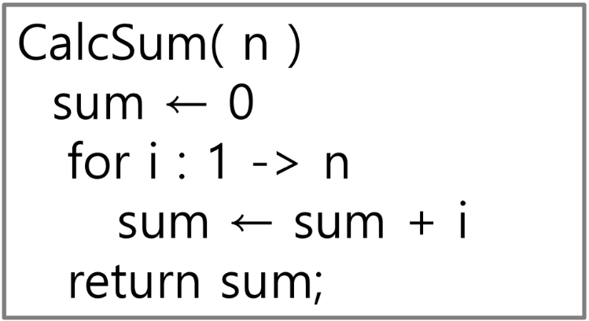
    
    - 순서도의 예
    
    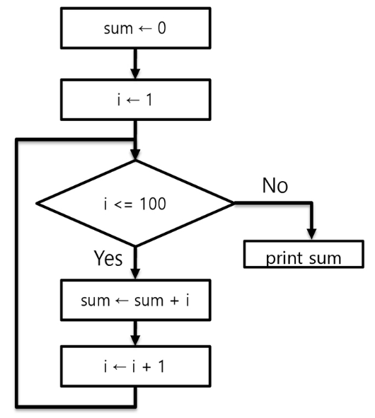
    

#### 3. APS (Algorithm Problem Solving)

- APS 과정의 목표 중 하나는 보다 좋은 알고리즘을 이해하고, 활용하는 것

#### 4. 무엇이 좋은 알고리즘인가?

1. 정확성
    1. 얼마나 정확하게 동작하는가
2. 작업량
    1. 얼마나 적은 연산으로 원하는 결과를 얻어내는가
3. 메모리 사용량
    1. 얼마나 적은 메모리를 사용하는가
4. 단순성
    1. 얼마나 단순한가
5. 최적성
    1. 더 이상 개선할 여지 없이 최적화되었는가

#### 5. 시간 복잡도 (Time Complexity)

- 알고리즘의 작업량을 표현할 때 시간 복잡도로 표현
- 실제 걸리는 시간 측정
- 실행되는 명령문의 개수를 계산

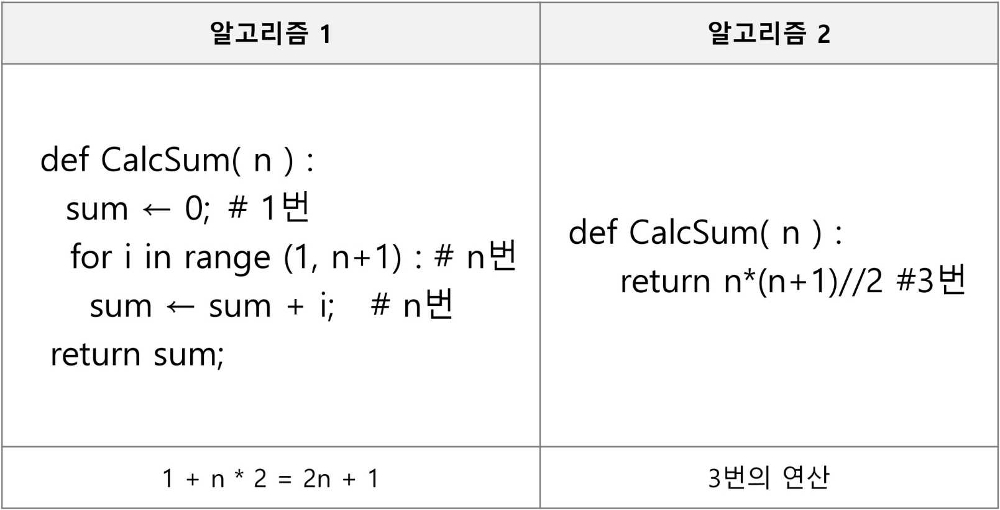

#### 6. 빅-오 표기법 (Big-O Notation)

- 시간 복잡도 ≒ 빅-오(O) 표기법
- 시간 복잡도 함수 중에서 가장 큰 영향력을 주는 n에 대한 항만을 표시
- 계수(Coefficient)는 생략하여 표시

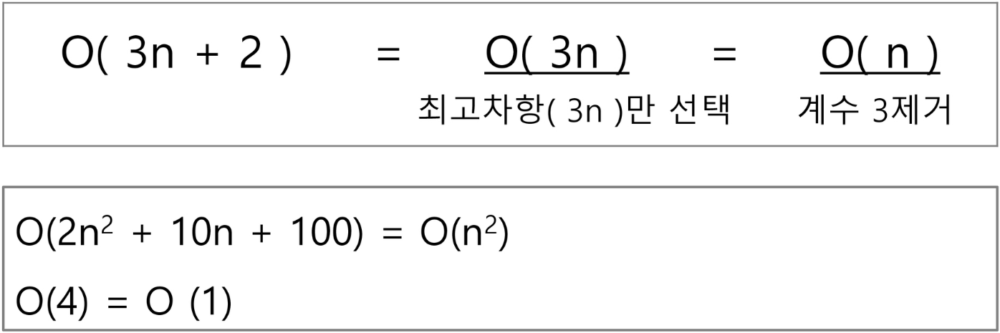

```python
"""
n개의 데이터를 입력 받아 저장한 후
각 데이터에 1씩 증가시킨 후
각 데이터를 화면에 출력하는 알고리즘의 시간 복잡도는?
"""
# 답: O(n)
```

- 요소 수가 증가함에 따라 각기 다른 시간 복잡도의 알고리즘은 아래와 같은 연산 수를 보임

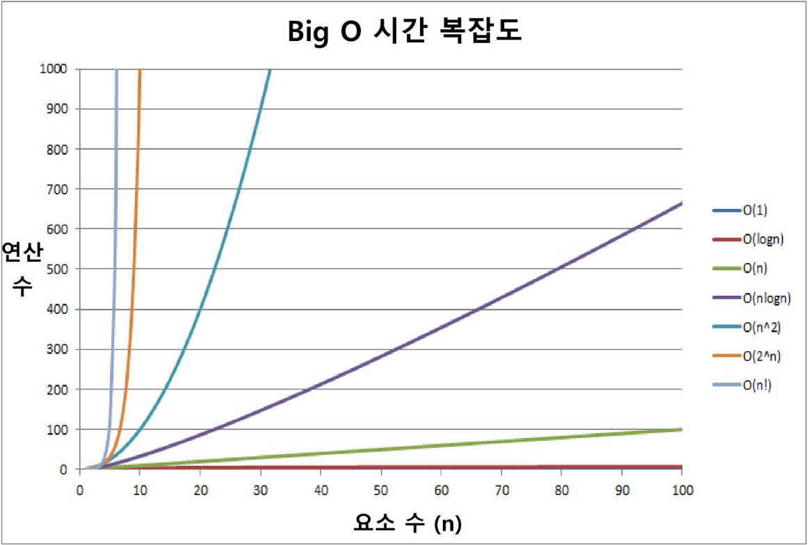

- 시간 복잡도별 실제 실행 시간 비교
- 5천만에 대한 연산을 수행한다면?

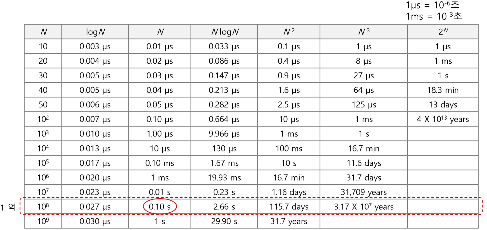

---

### 배열 (Array)

#### 1. 배열이란 무엇인가?

- 일정한 자료형의 변수들을 하나의 이름으로 열거하여 사용하는 자료구조
- 6개의 변수를 사용해야 하는 경우, 이를 배열로 바꾸어 사용하는 예

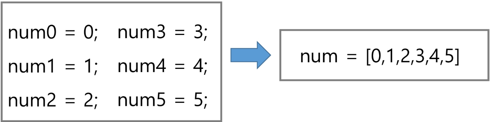

#### 2. 배열의 필요성

- 프로그램 내에서 여러 개의 변수가 필요할 때, 일일이 다른 변수명을 이용하여 자료에 접근하는 것은 매우 비효율적
- 배열을 사용하면 하나의 선언을 통해서 둘 이상의 변수를 선언할 수 있음
- 단순히 다수의 변수 선언을 의미하는 것이 아니라, 다수의 변수로는 하기 힘든 작업을 배열을 활용해 쉽게 할 수 있음

#### 3. 1차원 배열

- 프로그램에서 사용할 배열의 이름이 필요함
- 1차원 배열의 예

```python
# 1차원 배열의 선언
arr = list()
arr = []
arr = [0] * 10
arr = [1, 2, 3]

# 1차원 배열의 접근
arr[0] = 10   # 배열 arr의 0번 원소에 10을 저장하라
arr[idx] = 20 # 배열 arr의 idx번 원소에 20을 저장하라
```

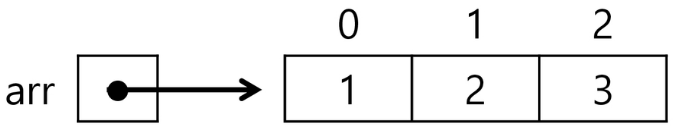

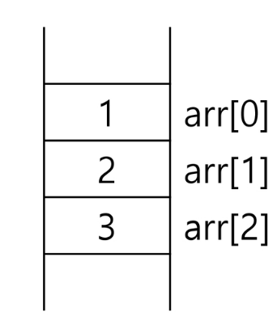

#### 4. 1차원 배열 예시

1. 입력 받은 정수를 1차원 배열에 저장하는 방법

```python
# 입력 받은 정수를 1차원 배열에 저장하는 방법
"""
첫 줄에 양수의 개수 N이 주어진다. (5 ≤ N ≤ 1000)
다음 줄에 빈칸으로 구분된 N개의 양수 Ai가 주어진다. (5 ≤ Ai ≤ 1000000)
"""

# 예시 출력
"""
6
2 7 5 3 1 4
"""

# 정답 코드
N = int(input())
arr = list(map(int, input().split()))
```

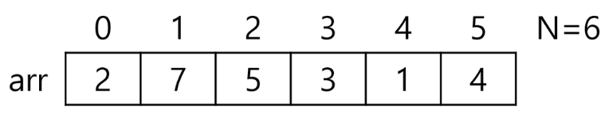

2. 배열 원소의 합 s 계산하기

```python
# 배열 원소의 합 s 계산하기
N = int(input())
arr = list(map(int, input().split()))
s = 0
for i in range(N): # for x in arr:
    s += arr[i] # s += x
```

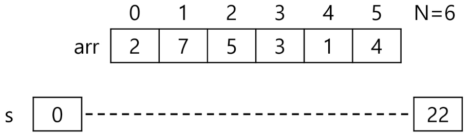

3. 배열 원소 중 최댓 값 max_v 찾기

```python
# 배열 원소 중 최댓 값 max_v 찾기
N = int(input())
arr = list(map(int, input().split()))
max_v = arr[0] # 첫 원소를 최대로 가정
for i in range(1, N):
    if max_v < arr[i]:
        max_v = arr[i] # arr[i]가 더 크면 max_v 갱신
```

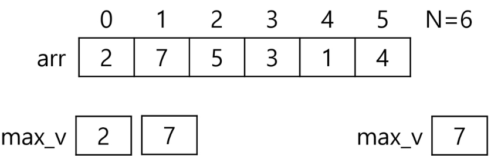

4. 배열 원소 중 최댓 값의 인덱스 max_idx 찾기

```python
# 배열 원소 중 최댓 값의 인덱스 max_idx 찾기
N = int(input())
arr = list(map(int, input().split()))
max_idx = 0 # 첫 원소를 최대로 가정
for i in range(1, N):
    if arr[max_idx] < arr[i]: # 더 큰 값을 만나면
        max_idx = i # max_idx 갱신
        
# 최댓 값이 여러 개인 경우?
# 가장 왼쪽의 최댓 값 인덱스가 저장됨
```

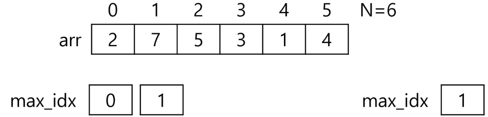

5. 최댓 값이 여러 개인 경우 마지막 인덱스 max_idx 찾기

```python
# 최댓 값이 여러 개인 경우 마지막 인덱스 max_idx 찾기
N = int(input())
arr = list(map(int, input().split()))
max_idx = 0 # 첫 원소를 최대로 가정
for i in range(1, N):
    if arr[max_idx] <= arr[i]: # 더 큰 값 또는 같은 값이면
        max_idx = i # max_idx 갱신
```

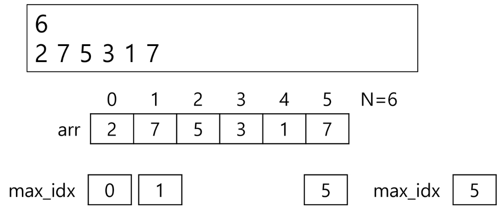

6. 찾는 값이 배열에 있으면 해당 원소의 인덱스, 없으면 -1을 idx에 넣기

```python
# 찾는 값이 배열에 있으면 해당 원소의 인덱스, 없으면 -1을 idx에 넣기
N, V = map(int, input().split()) # N, 찾는 값 V
arr = list(map(int, input().split()))
idx = -1 # 찾는 값이 없다고 가정
for i in range(N):
    if arr[i] == V: # arr[i]가 찾는 값이면
        idx = i # 인덱스 저장
        break    # for i
```


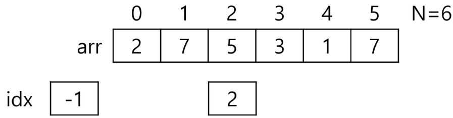

#### 5. 1차원 배열 연습문제

1. N개의 양의 정수에서 가장 큰 수와 가장 작은 수의 차이를 출력하라.

```python
# N개의 양의 정수에서 가장 큰 수와 가장 작은 수의 차이를 출력하라.
# [입력]
"""
첫 줄에 테스트 케이스의 수 T가 주어진다. (1 ≤ T ≤ 50)
각 케이스의 첫 줄에 양수의 개수 N이 주어진다. (5 ≤ N ≤ 1000)
다음 줄에 N개의 양수 ai가 주어진다. (1 ≤ ai ≤ 1000000)
"""

# [출력]
"""
각 줄마다 "#T"(T는 테스트 케이스 번호)를 출력한 뒤, 빈칸에 이어 답을 출력한다.
"""

# [입력 예시]
3
5
477162 658880 751280 927930 297191
5
565469 851600 460874 148692 111090
10
786186 279993 982220 996285 614710 992232 195265 359810
919192 158175

# [출력 예시]
#1 630739
#2 740510
#3 838110

# 정답 코드
T = int(input())           # 테스트 케이스 갯수
for tc in range(1, T + 1): # 케이스 별로 처리
    N = int(input())       # 케이스 별로 처리
    arr = list(map(int, input().split()))

    max_v = arr[0]         # 첫 원소를 최댓 값으로 가정
    min_v = arr[0]         # 첫 원소를 최솟 값으로 가정

    for i in range(1, N):
        if max_v < arr[i]: # arr[i] > max_v (다음 연산식과 비교식 순서를 맞출 것)
            max_v = arr[i]
        if min_v > arr[i]:
            min_v = arr[i]

    print(f"#{tc} {max_v - min_v}")
```

2. 배열 활용 예제: Gravity
    1. 상자들이 쌓여있는 방이 있다. 방이 오른쪽으로 90도 회전하여 상자들이 중력의 영향을 받아 낙하한다고 할 때, 낙차가 가장 큰 상자를 구하여 그 낙차를 리턴하는 프로그램을 작성하시오.
    2. 중력은 회전이 완료된 후 적용된다.
    3. 상자들은 모두 한 쪽 벽면에 붙여진 상태로 쌓여 2차원의 형태를 이루며, 벽에서 떨어져서 쌓인 상자는 없다.
    4. 상자의 가로, 세로 길이는 각각 1이다.
    5. 방의 가로 길이는 100이며, 세로 길이도 항상 100이다.
    6. 즉, 상자는 최소 0, 최대 100 높이로 쌓을 수 있다.
    7. 상자가 놓인 가로 칸의 수 N, 다음 줄에 각 칸의 상자 높이가 주어진다.
    8. 그림 설명
        1. 아래 예) 총 26개의 상자가 회전 후, 오른쪽 방 그림의 상태가 된다. A 상자의 낙차가 7로 가장 크므로 7을 리턴하면 된다.
        2. 회전 결과, B 상자의 낙차는 6, C 상자의 낙차는 1이다.
        
        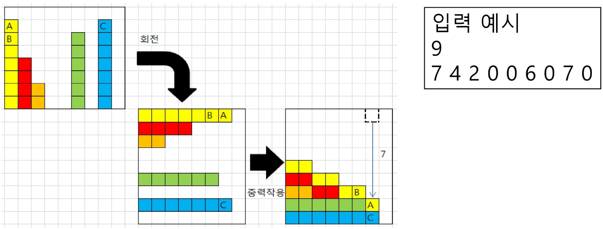
        

---

### 정렬

#### 1. 정렬

- 정렬의 정의
    - 2개 이상의 자료를 특정 기준에 의해 작은 값부터 큰 값(오름차순: Ascending), 혹은 그 반대의 순서대로(내림차순: Descending) 재배열하는 것
- 키의 정의
    - 자료를 정렬하는 기준이 되는 특정 값

#### 2. 대표적인 정렬 방식의 종류

- 버블 정렬 (Bubble Sort)
- 카운팅 정렬 (Counting Sort)
- 선택 정렬 (Selection Sort)
- 퀵 정렬 (Quick Sort)
- 삽입 정렬 (Insertion Sort)
- 병합 정렬 (Merge Sort)

---

### 버블 정렬

#### 1. 버블 정렬 (Bubble Sort)

- 인접한 두 개의 원소를 비교하며 자리를 계속 교환하는 방식
- 정렬 과정
    1. 첫 번째 원소부터 인접한 원소끼리 계속 자리를 교환하면서 맨 마지막 자리까지 이동한다.
    2. 한 단계가 끝나면 가장 큰 원소가 마지막 자리로 정렬된다.
    3. 교환하며 자리를 이동하는 모습이 물 위에 올라오는 거품 모양과 같다고 하여 버블 정렬이라고 한다.
- 시간 복잡도: O(n²)
- 버블 정렬의 예시
    - [55, 7, 78, 12, 42]를 버블 정렬하는 과정 (오름차순)
        - 첫 번째 패스
        
        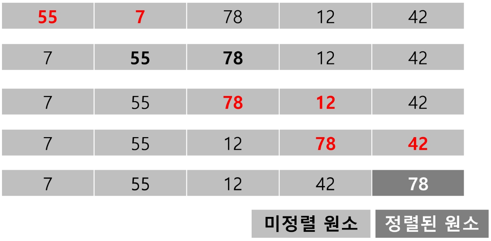
        
        - 두 번째 패스
        
        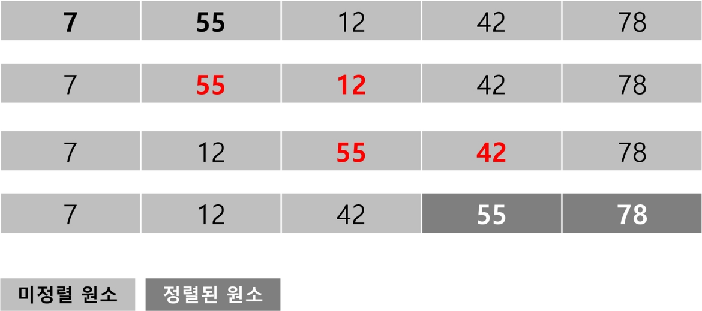
        
        - 세 번째 패스
        
        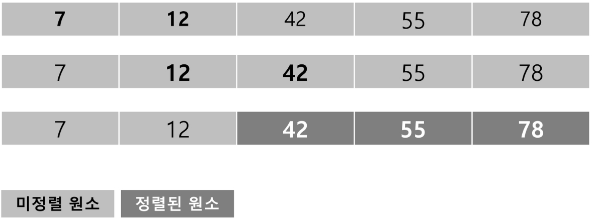
        
        - 네 번째 패스
        
        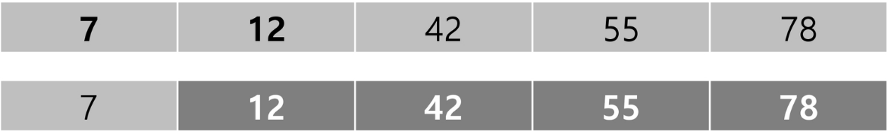
        
        - 정렬
        
        
        

#### 2. 배열을 활용한 버블 정렬

- 앞서 살펴 본 정렬 과정을 의사코드(Pseudocode)로 구현하면 아래와 같음 (오름차순)

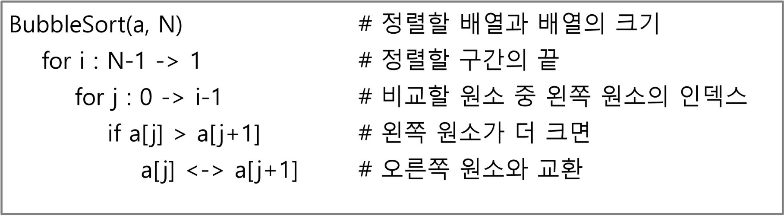

- 앞서 살펴 본 정렬 과정을 코드로 구현하면 아래와 같음 (오름차순)

```python
# 배열을 활용한 버블 정렬
# 앞서 살펴 본 정렬 과정을 코드로 구현하면 아래와 같음 (오름차순)
def BubbleSort(a, N):             # 정렬할 List, N 원소 수
    for i in range(N - 1, 0, -1): # 범위의 끝 위치
        for j in range(i):        # 비교할 왼쪽 원소 인덱스 j
            if a[j] > a[j + 1]:
                a[j], a[j + 1] = a[j + 1], a[j]
```
