## List 1 (2025.02.07)

### 2차원 배열

#### 1. 2차원 배열의 선언

- 1차원 List를 묶어놓은 List
- 2차원 이상의 다차원 List는 차원에 따라 Index를 선언
- 2차원 List의 선언
    - 세로 길이(행의 갯수), 가로 길이(열의 갯수)를 필요로 함
    - Python에서는 데이터 초기화를 통해 변수 선언과 초기화가 가능함
    
    ```python
    # 2행 4열의 2차원 List
    arr = [[0, 1, 2, 3], [4, 5, 6, 7]]
    ```
    
    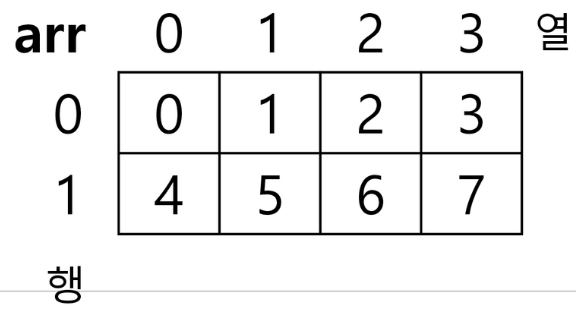
    

#### 2. 입력을 2차원 배열에 저장하기

```python
# 예시1
N = int(input())
arr = [list(map(int, input().split())) for _ in range(N)]
# 입력
"""
3
1 2 3
4 5 6
7 8 9
"""
# 출력
# [[1, 2, 3], [4, 5, 6], [7, 8, 9]]

# 예시2
N = int(input())
arr = [list(map(int, input())) for _ in range(N)]
# 입력
"""
3
123
456
789
"""
# 출력
# [[123], [456], [789]]
```

#### 3. 0으로 채워진 3 x 4 배열 만들기

```python
# 첫 번째 방법
arr = [[0] * 4 for _ in range(3)]

# 두 번째 방법
arr = [[0 for in range(4)] for _ in range(3)]

# 주의할 점
arr = [[0] * 4] * 3
arr[2][1] = 1
print(arr)
# [[0, 1, 0, 0], [0, 1, 0, 0], [0, 1, 0, 0]]
"""
[0] * 4의 참조 값을 3번 복사하는 것이기 때문
"""
```

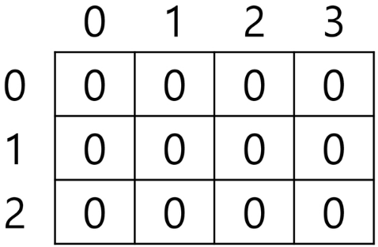

#### 4. 2차원 배열의 접근

- 배열 순회
    - n x m 배열의 n * m 개의 모든 원소를 조사하는 방법
- 행 우선 순회

```python
# i 행의 좌표
# j 열의 좌표
for i in range(n):
    for j in range(m):
        print(arr[i][j])
```

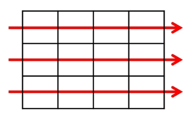

- 열 우선 순회

```python
# i 행의 좌표
# j 열의 좌표
for j in range(m):
    for i in range(n):
        print(arr[i][j])
```

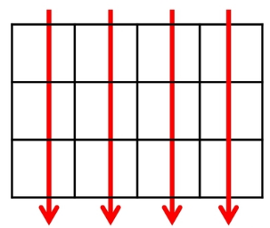

- 지그재그 순회

```python
# i 행의 좌표
# j 열의 좌표
for i in range(n):
    for j in range(m):
        print(arr[i][j + (m - 1 - 2*j) * (i % 2)])
```

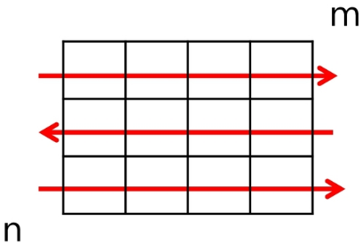

#### 5. N x M 배열의 크기와 저장된 값이 주어질 때 합을 구하는 방법

```python
"""
[입력 예시]
3 4
1 7 2 8
6 2 9 3
5 7 4 2
"""
N, M = map(int, input().split())
arr = [list(map(int, input().split())) for _ in range(N)]

s = 0
for i in range(N):
    for j in range(M):
        s += arr[i][j]
print(s) # 56
```

---

### 델타

#### 1. 델타를 이용한 2차원 배열 탐색

- 2차 배열의 한 좌표에서 4방향의 인접 배열 요소를 탐색하는 방법
- 인덱스 (i, j)인 칸의 상하좌우 칸 (ni, nj)

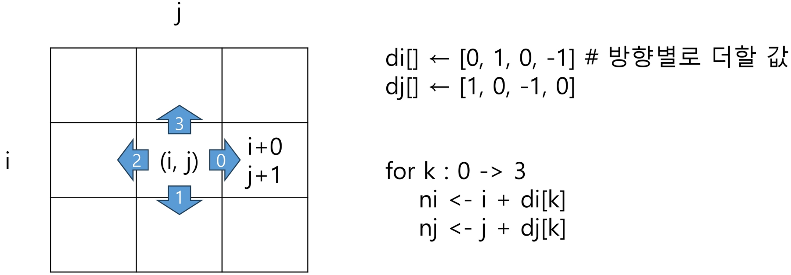

```python
# 첫 번째 방법
for i in range(N):
    for j in range(N):
        for di, dj in [[0, 1], [1, 0], [0, -1], [-1, 0]]:
            ni = i + di
            nj = j + dj
            if 0 <= ni < N and 0 <= nj < N:
                print(ni, nj)

# 두 번째 방법
di = [0, 1, 0, -1]
dj = [1, 0, -1, 0]
for i in range(N):
    for j in range(N):
        for k in range(4):
            ni = i + di[k]
            nj = j + dj[k]
            if 0 <= ni < N and 0 <= nj < N:
                print(ni, nj)
```

#### 2. 델타 응용

- N x N 배열에서 각 원소를 중심으로, 상하좌우 k칸의 합계 중 최대 값 (k = 2)

```python
for i in range(N):
    for j in range(N):
        s = arr[i][j]
        for di, dj in [[0, 1], [1, 0], [0, -1], [-1, 0]]:
            for c in range(i, k + 1):
                ni, nj = i + di*c, j + dj*c
                if 0 <= ni < N and 0 <= nj < N:
                    s += arr[ni][nj]
        if max_v < s:
            max_v = s
```

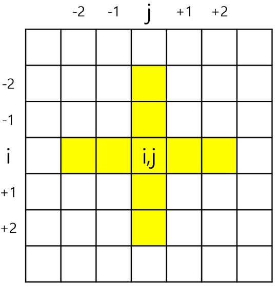

#### 3. 전치 행렬

```python
# i: 행의 좌표, len(arr)
# j: 열의 좌표, len(arr[0])
# 첫 번째 방법
arr = [[1, 2, 3], [4, 5, 6], [7, 8, 9]]
for i in range(3):
    for j in range(3):
        if i < j:
            arr[i][j], arr[j][i] = arr[j][i], arr[i][j]

# 두 번째 방법
arr = [[1, 2, 3], [4, 5, 6], [7, 8, 9]]
for i in range(3):
    for j in range(i):
        arr[i][j], arr[j][i] = arr[j][i], arr[i][j]
```

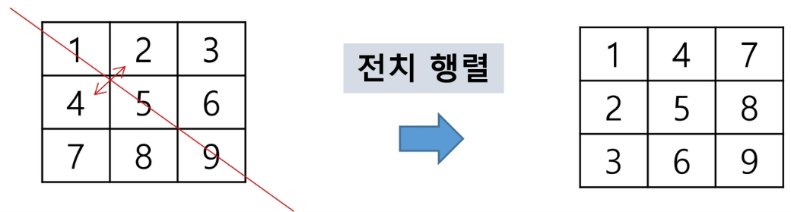

- i, j의 크기에 따라 접근하는 원소 비교 (N x N)
    - i < j
    
    ```python
    for i in range(N):
        for j in range(N):
            if i < j:
                f(arr[i][j], arr[j][i] = arr[j][i], arr[i][j])
    ```
    
    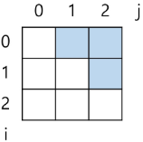
    
    - i > j
    
    ```python
    for i in range(N):
        for j in range(N):
            if i > j:
                f(arr[i][j], arr[j][i] = arr[j][i], arr[i][j])
    ```
    
    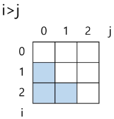
    
    - i == j
    
    ```python
    for i in range(N):
        f(arr[i][i])
    ```
    
    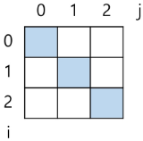
    
    - N - 1 - i == j
    
    ```python
    for i in range(N):
        f(arr[i][N - 1 - i])
    ```
    
    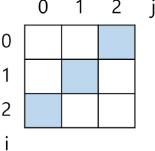
    

---

### 부분집합

#### 1. 부분집합 합(Subset Sum) 문제

- 유한 개의 정수로 이루어진 집합이 있을 때, 이 집합의 부분집합 중에서 그 집합의 원소를 모두 더한 값이 0이 되는 경우가 있는지를 알아내는 문제
- 예를 들어, [-7, -3, -2, 5, 8]라는 집합이 있을 때, [-3, -2, 5]는 이 집합의 부분집합이면서 (-3) + (-2) + 5 = 0이므로 이 경우의 답은 참이 된다

#### 2. 부분집합 생성하기

- 완전검색 기법으로 부분집합 합 문제를 풀기 위해서는, 우선 집합의 모든 부분집합을 생성한 후에 각 부분집합의 합을 계산해야 한다
- 주어진 집합의 부분집합을 생성하는 방법에 대해서 생각해보자

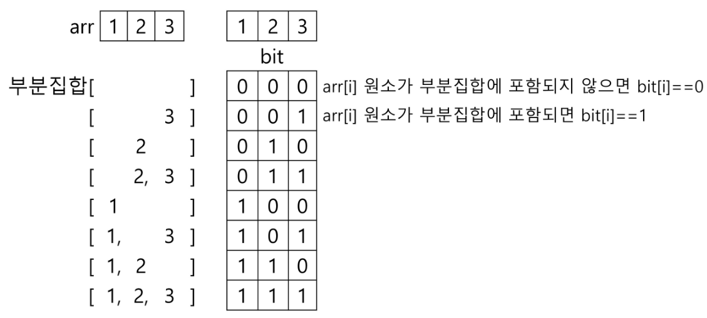

```python
# 직관적이지만 비효율적인 부분집합 생성 과정
bit = [0, 0, 0, 0]
for i in range(2):
    bit[0] = i                            # 0번 원소
    for j in range(2):
        bit[1] = j                        # 1번 원소
        for k in range(2):
            bit[2] = k                    # 2번 원소
            for l in range(2):
                bit[3] = l                # 3번 원소
                print(f"{i} {j} {k} {l}") # 생성된 부분 집합 출력 (비트)
                """
                0 0 0 0
                0 0 0 1
                0 0 1 0
                0 0 1 1
                0 1 0 0
                0 1 0 1
                0 1 1 0
                0 1 1 1
                1 0 0 0
                1 0 0 1
                1 0 1 0
                1 0 1 1
                1 1 0 0
                1 1 0 1
                1 1 1 0
                1 1 1 1
                """
```

#### 3. 부분집합의 수

- 집합의 원소가 n개일 때, 공집합을 포함한 부분집합의 수는 2ⁿ개이다
- 이는 각 원소를 부분집합에 포함시키거나 포함시키지 않는 2가지 경우를 모든 원소에 적용한 경우의 수와 같다
- 예
    - {1, 2, 3, 4} → 2 x 2 x 2 x 2 = 16가지

#### 4. 비트 연산자

```python
&  # AND 연산
"""
i & (1 << j): i의 j번째 비트가 1인지 아닌지를 검사
"""

|  # OR 연산

<< # 피연산자의 비트 열을 왼쪽으로 이동
"""
1 << n: 2ⁿ 즉, 원소가 n개일 경우의 모든 부분집합의 수를 의미
"""

>> # 피연산자의 비트 열을 오른쪽으로 이동
```

```python
# 4837. 부분집합의 합
"""
1 ~ 12까지의 숫자를 원소로 가진 집합 A의 부분집합 중 N개의 원소를 갖고 있고,
원소의 합이 K인 부분집합의 갯수를 출력하는 프로그램
해당하는 부분집합이 있으면 1을 출력, 없는 경우 0을 출력
"""
def solve(N, K):
    # 집합 A = {1, 2, ..., 12}
    arr = list(range(1, 13))
    M = len(arr)
    cnt = 0
    # 2^12개의 부분 집합 생성
    for bit in range(1 << M):
        subset = []
        subset_sum = 0
        subset_size = 0
        for i in range(M):
            # i번째 원소가 포함된 경우
            if bit & (1 << i):
                subset.append(arr[i])
                subset_sum += arr[i]
                subset_size += 1
        if subset_size == N and subset_sum == K:
            cnt += 1
    return cnt

T = int(input())
for tc in range(1, T + 1):
    N, K = map(int, input().split())
    print(f"#{tc} {solve(N, K)}")
```
