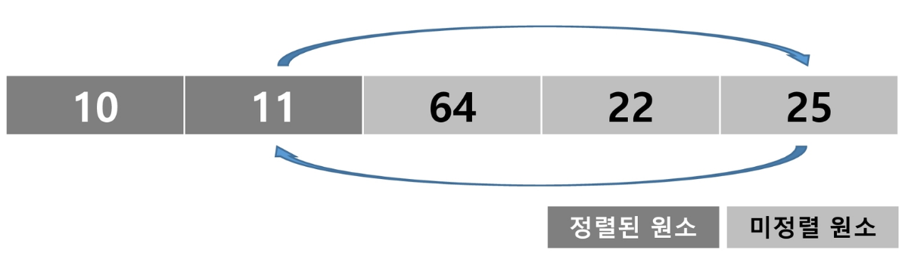

## List 2 (2025.02.10)

### 검색

#### 1. 검색 (Search)

- 저장되어 있는 자료 중에서 원하는 항목을 찾는 작업
- 목적하는 탐색 키를 가진 항목을 찾는 것
    - 탐색 키(Search Key)
        - 자료를 구별하여 인식할 수 있는 키
- 검색의 종류
    1. 순차 검색 (Sequential Search)
    2. 이진 검색 (Binary Search)
    3. 해쉬 (Hash)

#### 2. 순차 검색 (Sequential Search)

- 일렬로 되어 있는 자료를 순서대로 검색하는 방법
    - 가장 간단하고 직관적인 검색 방법
    - 배열이나 연결 리스트 등 순차 구조로 구현된 자료 구조에서 원하는 항목을 찾을 때 유용함
    - 알고리즘이 단순하여 구현이 쉽지만, 검색 대상의 수가 많은 경우에는 수행시간이 급격히 증가하여 비효율적임
- 2가지 경우
    - 정렬되어 있지 않은 경우
        - 첫 번째 원소를 찾을 때는 1번 비교, 두 번째 원소를 찾을 때는 2번 비교
        - 정렬되지 않은 자료에서의 순차 검색의 평균 비교 회수
        
        ```python
        (1 / n) * (1 + 2 + 3 + ... + n) = (n + 1) / 2
        ```
        
        - 시간 복잡도: O(n)
        - 구현 예
        
        ```python
        # 예시 1
        def seq_search(a, n, key):
            for i in range(n):
                if a[i] == key:
                    return i
            return -1
        
        arr = [4, 9, 11, 23, 2, 19, 7]
        print(seq_search(arr, len(arr), 8))
        
        # 예시 2
        def seq_search(arr, n, key):
            for i in range(N):
                for j in range(N):
                    if arr[i][j] == key:
                        return 1 # key를 찾은 경우
            return 0
        
        arr = [[1, 2, 3], [4, 5, 6], [7, 8, 9]]
        N = 3
        key = 5
        
        print(seq_search(arr, len(arr), 10))
        ```
        
        - 검색 과정
            1. 첫 번째 원소부터 순서대로 검색 대상과 키 값이 같은 원소가 있는지 비교하며 찾음
            2. 키 값이 동일한 원소를 찾으면 그 원소의 인덱스를 반환
            3. 자료 구조의 마지막에 이를 때까지 검색 대상을 찾지 못하면 검색 실패
        - 예
            - 2를 검색하는 경우
            
            
            
            - 8을 검색하는 경우
            
            
            
    - 정렬되어 있는 경우
        - 찾고자 하는 원소의 순서에 따라 비교횟수가 결정됨
            - 정렬이 되어 있으므로, 검색 실패를 반환하는 경우 평균 비교 회수가 반으로 줄어듦
        - 시간 복잡도: O(n)
        - 구현의 예
        
        ```python
        def seq_search(a, n, key):
            for i in range(n):
                if a[i] == key:
                    return i
                elif a[i] > key:
                    return -1
            return -1 # 모든 원소가 key보다 작으면
        
        arr = [4, 9, 11, 23, 2, 19, 7]
        arr.sort()
        print(arr)
        print(seq_search(arr, len(arr), 11))
        print(seq_search(arr, len(arr), 100))
        ```
        
        - 검색 과정
            1. 자료가 오름차순으로 정렬된 상태에서 검색을 실시한다고 가정
            2. 자료를 순차적으로 검색하면서 키 값을 비교하여, 원소의 키 값이 검색
            3. 대상의 키 값보다 크면 찾는 원소가 없다는 것이므로, 더 이상 검색하지 않고 검색을 종료
        - 예
            - 11을 검색하는 경우
            
            
            
            - 10을 검색하는 경우
            
            
            

---

### 이진 검색

#### 1. 이진 검색 (Binary Search)

- 자료의 가운데에 있는 항목의 키 값과 비교하여 다음 검색의 위치를 결정하고, 검색을 계속 진행하는 방법
    - 목적 키를 찾을 때까지 이진 검색을 순환적으로 반복 수행함으로써 검색 범위를 반으로 줄여가면서 보다 빠르게 검색을 수행함
- 이진 검색을 하기 위해서는 자료가 정렬된 상태여야 함
- 검색 과정
    1. 자료의 중앙에 있는 원소를 고름
    2. 중앙 원소의 값과 찾고자 하는 목표 값을 비교
    3. 목표 값이 중앙 원소의 값보다 작으면 자료의 왼쪽 반에 대해서 새로 검색을 수행하고, 크다면 자료의 오른쪽 반에 대해서 새로 검색을 수행
    4. 찾고자 하는 값을 찾을 때까지 1 ~ 3의 과정을 반복
- 구현
    - 검색 범위의 시작점과 종료점을 이용하여 검색을 반복 수행
    - 이진 검색의 경우, 자료에 삽입이나 삭제가 발생했을 때, 배열의 상태를 항상 정렬 상태로 유지하는 추가 작업이 필요
    
    ```python
    def binary_search(a, N, key):
        start = 0                       # 검색 구간 설정
        end = N - 1
    
        while start <= end:             # 검색 구간에 1개 이상의 원소가 있으면 검색
            middle = (start + end) // 2 # 기준 위치 계산
            if a[middle] == key:
                return middle
            elif a[middle] > key:       # 키보다 크면 왼쪽 구간 선택
                end = middle - 1
            else:                       # a[middle] < key, 키보다 작으면 오른쪽 구간 선택
                start = middle + 1
        return -1
    
    # # for문으로 구현한 예
    # def binary_search(a, N, key):
    #     start = 0
    #     end = N - 1
    #
    #     for _ in range(N):              # 최대 N번 반복
    #         middle = (start + end) // 2 # 기준 위치 계산
    #         if a[middle] == key:
    #             return middle
    #         elif a[middle] > key:       # 키보다 크면 왼쪽 구간 선택
    #             end = middle - 1
    #         else:                       # a[middle] < key, 키보다 작으면 오른쪽 구간 선택
    #             start = middle + 1
    #     return -1
    
    # 이진 검색을 정렬된 배열에 사용
    # 오름차순으로 정렬된 배열
    a = [2, 4, 7, 9, 11, 19, 23]
    print(binary_search(a, len(a), 19))  # 5
    print(binary_search(a, len(a), 100)) # -1
    print(binary_search(a, len(a), 1))   # -1
    
    ```
    
- 예
    - 이진 검색으로 7을 찾는 경우
    
    
    
    - 이진 검색으로 20을 찾는 경우
    
    
    

#### 2. 인덱스

- 인덱스라는 용어는 Database에서 유래했으며, 테이블에 대한 동작 속도를 높여주는 자료 구조를 일컬음
- Database 분야가 아닌 곳에서는 Look up table 등의 용어를 사용하기도 함
- 인덱스를 저장하는데 필요한 디스크 공간은 보통 테이블을 저장하는데 필요한 디스크 공간보다 작음
    - 보통 인덱스는 키-필드만 갖고 있고, 테이블의 다른 세부 항목들은 갖고 있지 않기 때문
- 대량의 데이터를 매번 정렬하면, 프로그램의 반응은 느려질 수 밖에 없음
    - 이러한 대량 데이터의 성능 저하 문제를 해결하기 위해 배열 인덱스를 사용할 수 있음
    - Database 인덱스는 `이진 탐색 트리` 구조로 되어 있음
- 다음 예에서 원본 데이터 배열과 별개로, 배열 인덱스를 추가한 예를 보여줌
    - 원본 데이터에 데이터가 삽입될 경우 상대적으로 크기가 작은 인덱스 배열을 정렬하기 때문에 속도가 빠름
    
    
    

---

### 선택 정렬

#### 1. 선택 정렬 (Selection Sort)

- 주어진 자료들 중 가장 작은 값의 원소부터 차례대로 선택하여 위치를 교환하는 방식 (오름차순의 경우)
- 정렬 과정
    1. 주어진 리스트 중에서 최소 값을 찾음
    2. 그 값을 리스트의 맨 앞에 위치한 값과 교환
    3. 맨 처음 위치를 제외한 나머지 리스트를 대상으로 위의 과정을 반복
- 시간 복잡도: O(n²)
- 선택 정렬의 예
    1. 주어진 리스트에서 최소 값을 찾음
    
    
    
    2. 리스트의 맨 앞에 위치한 값과 교환
    
    
    
    3. 미정렬 리스트에서 최소 값을 찾
    
    
    
    4. 리스트의 맨 앞에 위치한 값과 교환
    
    
    
    5. 미정렬 리스트에서 최소 값을 찾음
    
    
    
    6. 리스트의 맨 앞에 위치한 값과 교환
    
    
    
    7. 미정렬 리스트에서 최소 값을 찾음
    
    
    
    8. 리스트의 맨 앞에 위치한 값과 교환
        - 미정렬 원소가 하나 남은 상황에서는 마지막 원소가 가장 큰 값을 갖게 되므로, 실행을 종료하고 선택 정렬이 완료됨

    

- 선택 정렬 구현의 예

```python
def selection_sort(a, N):
    for i in range(N - 1):                  # 기준 위치 (최솟 값을 찾는 구간의 시작 인덱스)
        min_idx = i                         # 최솟 값 인덱스 초기화, 구간의 맨 앞 원소를 최소로 가정
        for j in range(i + 1, N):           # 실제 최솟 값인지 비교하는 위치
            if a[min_idx] > a[j]:           # 최소 원소 위치 갱신
                min_idx = j
        a[i], a[min_idx] = a[min_idx], a[i] # 구간 최솟 값을 구간 맨 앞으로

a = [10, 25, 64, 22, 11]
print(a) # [10, 25, 64, 22, 11]
selection_sort(a, len(a))
print(a) # [10, 11, 22, 25, 64]
```

#### 2. 셀렉션 알고리즘 (Selection Algorithm)

- 저장되어 있는 자료로부터 k번째로 큰 혹은 작은 원소를 찾는 방법을 셀렉션 알고리즘이라 함
    - 최소 값, 최대 값 혹은 중간 값을 찾는 알고리즘을 의미하기도 함
- 선택 과정
    1. 정렬 알고리즘을 이용하여 자료 정렬하기
    2. 원하는 순서에 있는 원소 가져오기
- 셀렉션 알고리즘의 예
    - k번째로 작은 원소를 찾는 알고리즘
        - 1번부터 k번째까지 작은 원소들을 찾아 배열의 앞쪽으로 이동시키고, 배열의 k번째를 반환
        - k가 비교적 작을 때 유용하며 O(kn)의 수행시간을 필요로 함
        
        ```python
        def selection_sort(a, k):
            for i in range(0, k):
                min_idx = i
                for j in range(i + 1, len(a)):
                    if a[min_idx] > a[j]:
                        min_idx = j
                a[i], a[min_idx] = a[min_idx], a[i]
            return a[k - 1]
        
        a = [10, 25, 64, 22, 11]
        print(selection_sort(a, 4)) # 25
        ```
        

#### 3. 정렬 알고리즘의 특성 비교


