## Queue 1 (2025.02.20)

### Queue

#### 1. BFS (Breadth First Search)

- 그래프를 탐색하는 방법에는 크게 두 가지가 있음
    - 깊이 우선 탐색 (Depth First Search, DFS)
    - 너비 우선 탐색 (Breadth First Search, BFS)
- 너비우선탐색은 탐색 시작점의 인접한 정점들을 먼저 모두 차례로 방문한 후에, 방문했던 정점을 시작점으로 하여 다시 인접한 정점들을 차례로 방문하는 방식
- 인접한 정점들에 대해 탐색을 한 후, 차례로 다시 너비 우선 탐색을 진행해야 하므로, 선입선출 형태의 자료 구조인 큐를 활용함

#### 2. BFS 예시

- BFS의 예제 그래프를 아래와 같은 순서로 탐색함

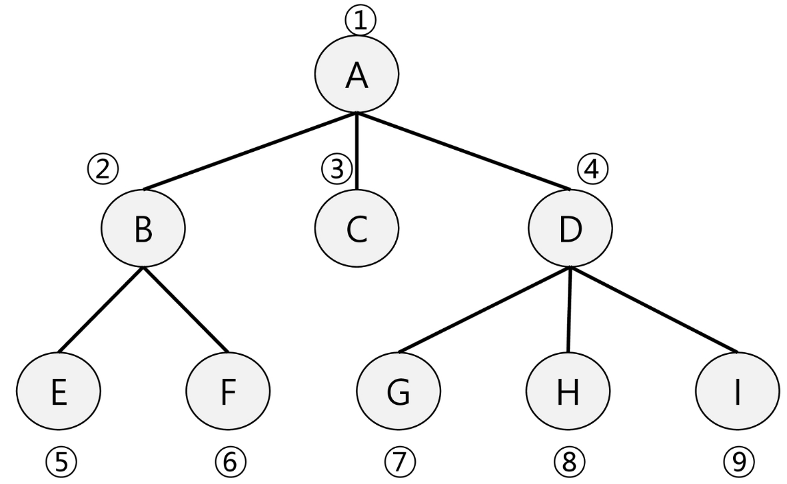

- BFS 탐색 순서
    1. 초기 상태
        1. Visited 배열 초기화
        2. Q 생성
        3. 시작점 enqueue
        
        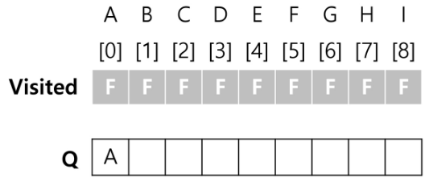
        
        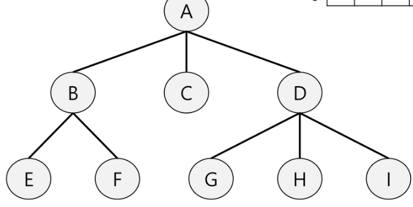
        
    2. A점부터 시작
        1. dequeue: A
        2. A 방문한 것으로 표시
        3. A의 인접점 enqueue
        
        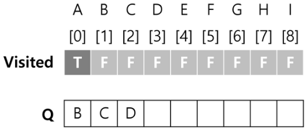
        
        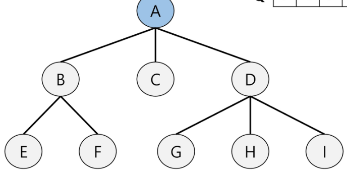
        
    3. 탐색 진행
        1. dequeue: B
        2. B 방문한 것으로 표시
        3. B의 인접점 enqueue
        
        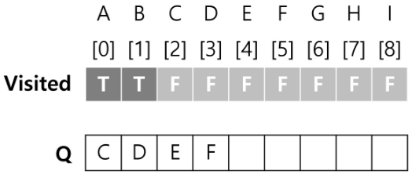
        
        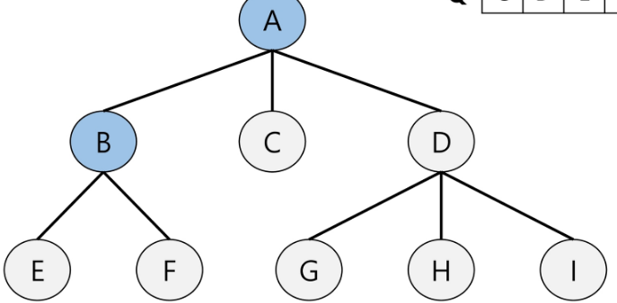
        
    4. 탐색 진행
        1. dequeue: C
        2. C 방문한 것으로 표시
        3. C의 인접점 enqueue
        
        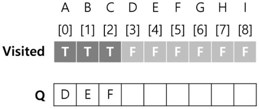
        
        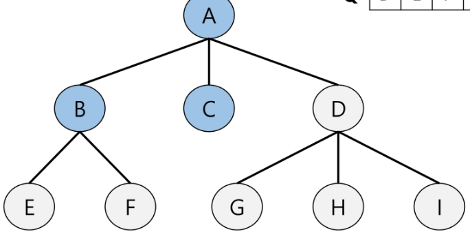
        
    5. 탐색 진행
        1. dequeue: D
        2. D 방문한 것으로 표시
        3. D의 인접점 enqueue
        
        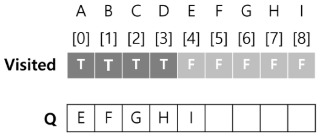
        
        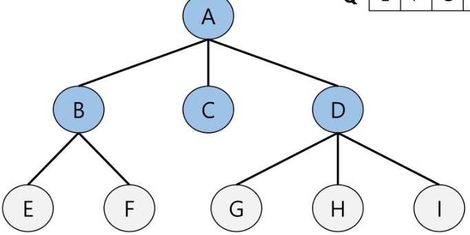
        
    6. 탐색 진행
        1. dequeue: E
        2. E 방문한 것으로 표시
        3. E의 인접점 enqueue
        
        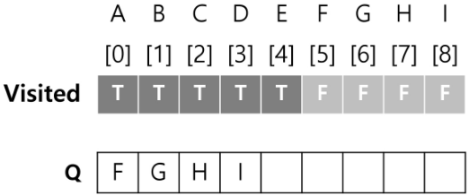
        
        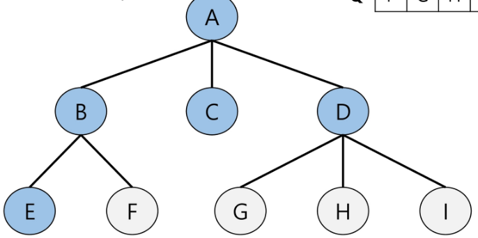
        
    7. 탐색 진행
        1. dequeue: F
        2. F 방문한 것으로 표시
        3. F의 인접점 enqueue
        
        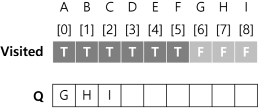
        
        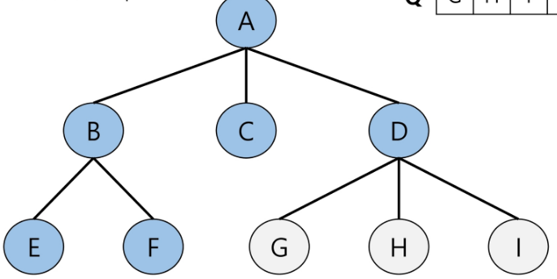
        
    8. 탐색 진행
        1. dequeue: G
        2. G 방문한 것으로 표시
        3. G의 인접점 enqueue
        
        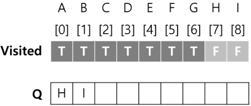
        
        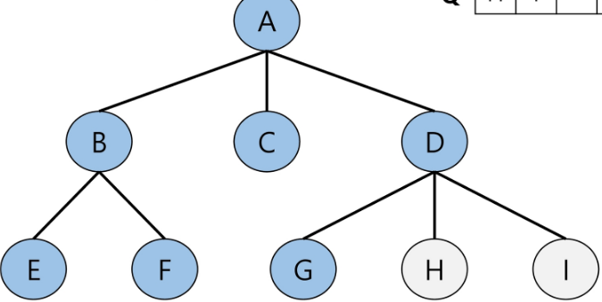
        
    9. 탐색 진행
        1. dequeue: H
        2. H 방문한 것으로 표시
        3. H의 인접점 enqueue
        
        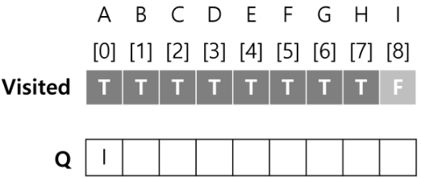
        
        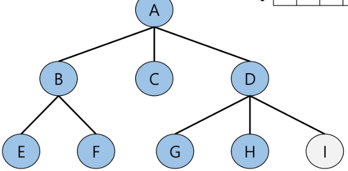
        
    10. 탐색 진행
        1. dequeue: I
        2. I 방문한 것으로 표시
        3. I의 인접점 enqueue
        
        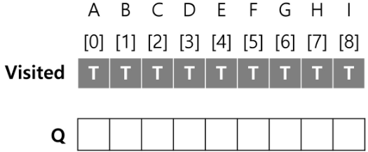
        
        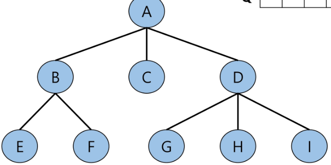
        
    11. Q가 비었으므로 탐색 종료
        
        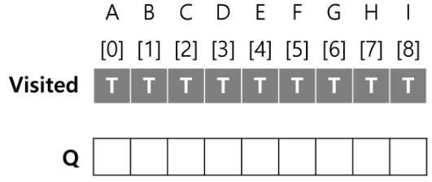
        
        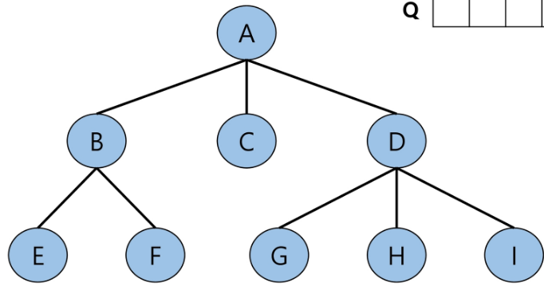

#### 3. 연습문제

- 다음은 연결되어 있는 두 개의 정점 사이의 간선을 순서대로 나열 해 놓은 것이다.
- 모든 정점을 너비 우선 탐색 하여 경로를 출력하시오.
- 시작 정점을 1로 시작하시오.

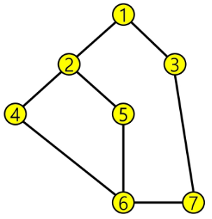

```python
# 입력
"""
7 8
4 2 1 2 1 3 5 2 4 6 5 6 6 7 3 7
"""

"""
s == 시작정점
V == 마지막 정점
"""
def bfs(s, V):
    # visited 생성
    visited = [0] * (V + 1)
    # 큐 생성
    q = []
    # 시작점 인큐
    q.append(s)
    # 시작점 인큐 표시
    visited[s] = 1
    """
    큐가 비워질 때까지 반복
    front != rear
    """
    while q:
        # 디큐해서 t에 저장
        t = q.pop(0)
        # 방문한 정점에서 할 일
        """
        1 2 3 4 5 7 6
        """
        print(t, end=" ")
        # t 정점에 대한 처리
        for w in adj_l[t]:
            # t에 인접한 정점 w 중, 인큐되지 않은 정점이 있으면
            if visited[w] == 0:
                # w에 인큐
                q.append(w)
                # 인큐 표시
                visited[w] = visited[t] + 1

# 1번부터 V번 정점, E개의 간선
V, E = map(int, input().split())
arr = list(map(int, input().split()))
# 인접 리스트
adj_l = [[] for _ in range(V + 1)]
for i in range(0, E * 2, 2):
    v1, v2 = arr[i], arr[i + 1]
    adj_l[v1].append(v2)
    # 방향이 없는 경우
    adj_l[v2].append(v1)
bfs(1, V)
```

---

### 응용 문제

#### 1. 미로의 거리

- N x N 크기의 미로에서 출발지 목적지가 주어진다.
- 이 때 최소 몇 개의 칸을 지나면 출발지에서 도착지에 다다를 수 있는지 알아내는 프로그램을 작성하시오.
- 경로가 있는 경우 출발에서 도착까지 가는데 지나야 하는 최소한의 칸 수를 , 경로가 없는 경우 0을 출력한다.
- 다음은 5 x 5 미로의 예이다. 1은 벽, 0은 통로를 나타내며 미로 밖으로 벗어나서는 안 된다.

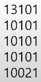

```python
def find_start(N):
    for i in range(N):
        for j in range(N):
            if maze[i][j] == "2":
                return i, j

"""
i, j == 시작위치
N == 크기
"""
def bfs(i, j, N):
    # visited 생성
    visited = [[0] * N for _ in range(N)]
    # 큐 생성
    q = []
    # 시작점 인큐
    q.append([i, j])
    # 시작점 인큐 표시
    visited[i][j] = 1
    """
    큐에 남은 칸이 없을 때까지
    큐가 비워질 때까지
    """
    while q:
        # 디큐해서 t에 넣어주기
        ti, tj = q.pop(0)
        # t에서 할 일
        if maze[ti][tj] == "3":
            # 입구에서 출구 사이의 빈칸 수
            return visited[ti][tj] - 2
        # t에 인접 w 중, 인큐되지 않은 곳이면
        for di, dj in [[0, 1], [1, 0], [0, -1], [-1, 0]]:
            wi, wj = ti + di, tj + dj
            """
            미로를 벗어나지 않고,
            벽이 아니고,
            방문하지 않았으면            
            """
            if 0 <= wi < N and 0 <= wj < N and maze[wi][wj] != "1" and visited[wi][wj] == 0:
                # 인큐
                q.append([wi, wj])
                # 인큐 표시
                visited[wi][wj] = visited[ti][tj] + 1

def solve(N, maze):
    sti, stj = find_start(N)
    ans = bfs(sti, stj, N)
    return ans

T = int(input())
for tc in range(1, T + 1):
    # 미로의 가로 크기
    N = int(input())
    maze = [input() for _ in range(N)]
    print(f"#{tc} {solve(N, maze)}")
```
