## Stack 1 (2025.02.13)

### 스택

#### 1. 스택의 특성

- 물건을 쌓아 올리듯 자료를 쌓아 올린 형태의 자료 구조
- 스택에 저장된 자료는 선형 구조를 가짐
    - 선형 구조
        - 자료 간의 관계가 1대1의 관계를 가짐
    - 비선형 구조
        - 자료 간의 관계가 1대N의 관계를 가짐
        - 예
            - 트리
- 스택에 자료를 삽입하거나 스택에서 자료를 꺼낼 수 있음
- 마지막에 삽입한 자료를 가장 먼저 꺼냄
    - 후입 선출 (LIFO, Lat In First Out)
    - 예를 들어 스택에 1, 2, 3 순으로 자료를 삽입한 후 꺼내면 역순, 즉 3, 2, 1순으로 꺼낼 수 있음

#### 2. 스택을 프로그램에서 구현하기 위해서 필요한 자료 구조와 연산

- 자료 구조
    - 자료를 선형으로 저장할 저장소
        - 배열을 사용할 수 있음
    - 저장소 자체를 스택이라 부르기도 함
    - 스택에서 마지막 삽입된 원소의 위치를 Top이라 부름
        - 일반적으로는 top을 `Stack Pointer(SP)`로 부름
- 연산
    - 삽입
        - 저장소에 자료를 저장함
        - 보통 push라고 부름
    - 삭제
        - 저장소에서 자료를 꺼냄
        - 꺼낸 자료는 삽입한 자료의 역순으로 꺼냄
        - 보통 pop이라고 부름
    - 스택이 공백인지 아닌지를 확인하는 연산
        - isEmpty
    - 스택의 top에 있는 item(원소)을 반환하는 연산
        - peek

#### 3. 스택의 삽입/삭제 과정

- 빈 스택에 원소 A, B, C를 차례로 삽입 후 한 번 삭제하는 연산 과정

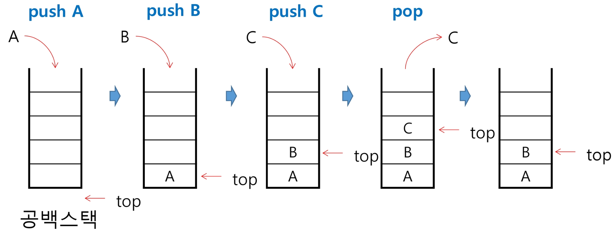

#### 4. 스택의 push 알고리즘

- append 메소드를 통해 리스트의 마지막에 데이터를 삽입

```python
# 예시
def push(item, stack, size):
    global top
    top += 1
    if top != size:
        stack[top] = item

size = 10
stack = [0] * size
top = -1
push(10, stack, size)
```

#### 5. 스택의 pop 알고리즘

```python
def pop(stack):
    global top
    if top == -1:
        return 0
    else:
        top -= 1
        return stack[top + 1]

size = 10
stack = [0] * size
top = -1
pop(stack)
```

#### 6. 스택 구현 고려 사항

- 1차원 배열을 사용하여 구현할 경우 구현이 용이하다는 장점이 있지만 스택의 크기를 변경하기가 어렵다는 단점이 있음
- 이를 해결하기 위한 방법으로 저장소를 동적으로 할당하여 스택을 구현하는 방법이 있음
- 동적 연결리스트를 이용하여 구현하는 방법을 의미함
- 구현이 복잡하다는 단점이 있지만 메모리를 효율적으로 사용한다는 장점을 가짐
- 스택의 동적 구현은 생략함

---

### 스택의 응용 1: 괄호 검사

#### 1. 괄호 검사

- 괄호의 종류
    - 대괄호 ([])
    - 중괄호 ({})
    - 소괄호 (())
- 조건
    1. 왼쪽 괄호의 개수와 오른쪽 괄호의 개수가 같아야 함
    2. 같은 괄호에서 왼쪽 괄호는 오른쪽 괄호보다 먼저 나와야 함
    3. 괄호 사이에는 포함 관계만 존재함
- 잘못된 괄호 사용의 예
    - (a(b)
    - a(b)c)
    - a{b(c[d]e}f)

#### 2. 스택을 이용한 괄호 검사

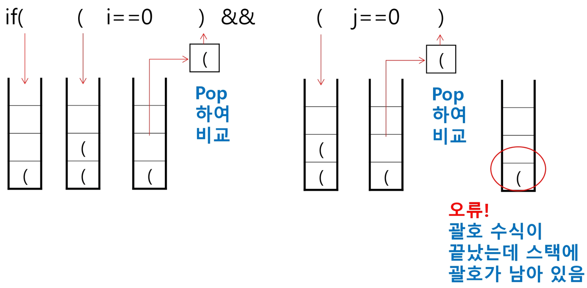

#### 3. 괄호를 조사하는 알고리즘 개요

- 문자열에 있는 괄호를 차례대로 조사하면서 왼쪽 괄호를 만나면 스택에 삽입하고, 오른쪽 괄호를 만나면 스택에서 top 괄호를 삭제한 후 오른쪽 괄호와 짝이 맞는지를 검사
- 이 때, 스택이 비어 있으면 조건 1 또는 조건 2에 위배되고 괄호의 짝이 맞지 않으면 조건 3에 위배됨
- 마지막 괄호까지를 조사한 후에도 스택에 괄호가 남아 있으면 조건 1에 위배됨

---

### 스택의 응용 2: Function Call

#### 1. Function Call

- 프로그램에서의 함수 호출과 복귀에 따른 수행 순서를 관리
    - 가장 마지막에 호출된 함수가 가장 먼저 실행을 완료하고 복귀하는 후입 선출 구조이므로, 후입 선출 구조의 스택을 이용하여 수행순서 관리
    
    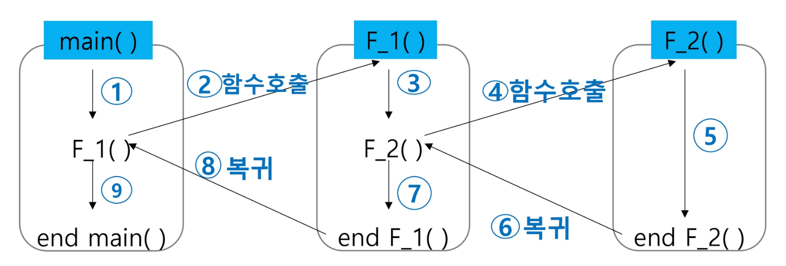
    
    - 함수 호출이 발생하면 호출한 함수 수행에 필요한 지역변수, 매개변수 및 수행 후 복귀할 주소 등의 정보를 스택 프레임(Stack Frame)에 저장하여 시스템 스택에 삽입
    
    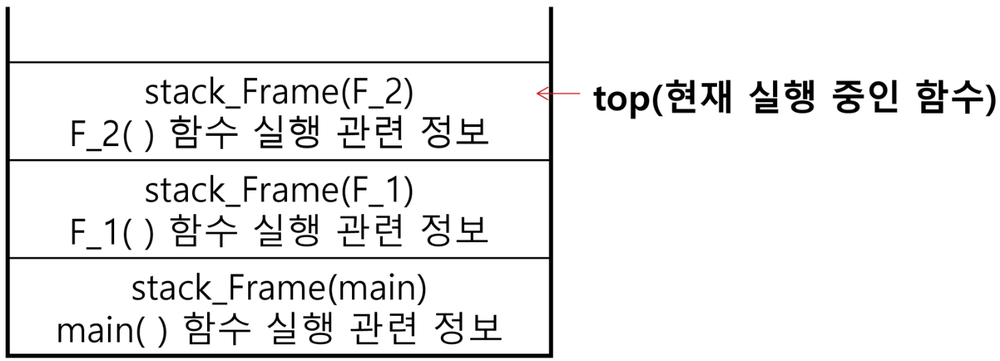
    
    - 함수의 실행이 끝나면 시스템 스택의 top 원소(스택 프레임)를 삭제(pop)하면서 프레임에 저장되어 있던 복귀 주소를 확인하고 복귀
    - 함수 호출과 복귀에 따라 이 과정을 반복하여 전체 프로그램 수행이 종료되면 시스템 스택은 공백 스택이 됨
    
    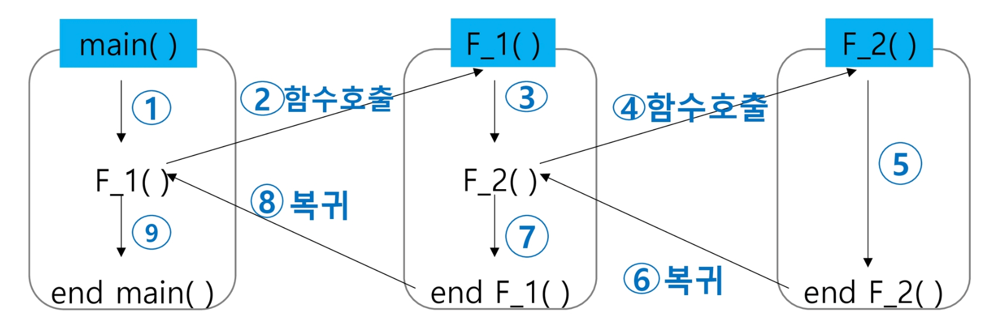
    

---

### 재귀 호출

#### 1. 재귀 호출

- 필요한 함수가 자신과 같은 경우 자신을 다시 호출하는 구조
- 함수에서 실행해야 하는 작업의 특성에 따라 일반적인 호출 방식보다 재귀 호출 방식을 사용하여 함수를 만들면 프로그램의 크기를 줄이고, 간단하게 작성
    - 재귀 호출의 예
        - factorial

#### 2. 재귀 호출의 예

- n에 대한 factorial
    - 1부터 n까지의 모든 자연수를 곱하여 구하는 연산
    - 마지막에 구한 하위 값을 이용하여 상위 값을 구하는 작업을 반복
    
    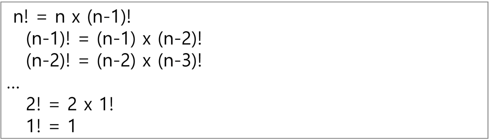
    
    - factorial 함수에서 n = 4인 경우의 실행
    
    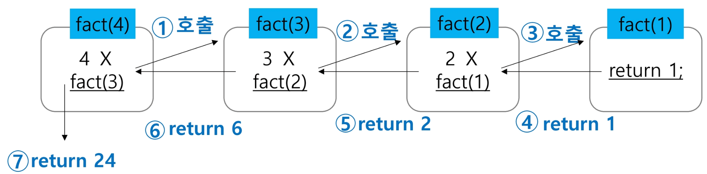
    

- 피보나치 수열
    - 0과 1로 시작하고 이전의 두 수 합을 다음 항으로 하는 수열을 피보나치라 함
        - 0, 1, 1, 2, 3, 5, 8, 13, …
    - 피보나치 수열의 i번째 값을 계산하는 함수 F를 정의하면 다음과 같음
    
    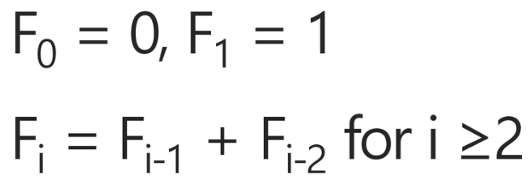
    
    - 위의 정의로부터 피보나치 수열의 i번째 항을 반환하는 함수를 재귀 함수로 구현할 수 있음
    - 피보나치 수를 구하는 재귀 함수
    
    ```python
    def fibo(n):
        if n < 2:
            return n
        else:
            return fibo(n - 1) + fibo(n - 2)
    ```
    

---

### 재귀 호출

#### 1. 모든 배열 원소에 접근하기

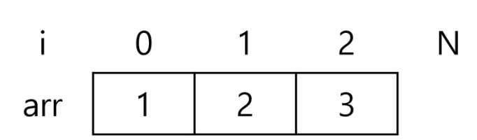

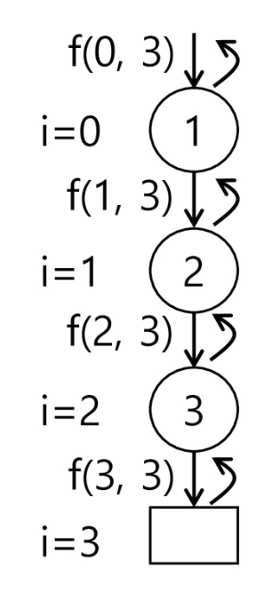

```python
def f(i, N): # 크기 N인 배열 arr[i]에 접근
    if i == N:
        return
    else:
        print(arr[i])
        f(i + 1, N)
```

#### 2. 배열에 v가 있으면 1, 없으면 0을 리턴

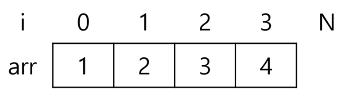

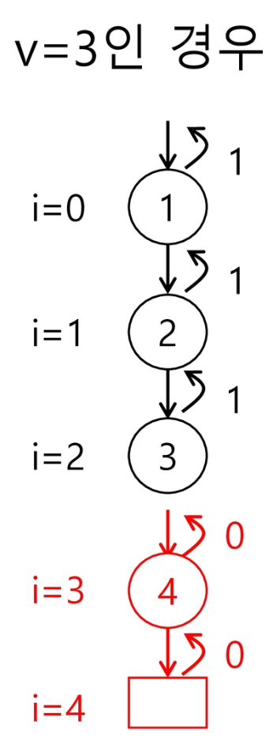

```python
def f(i, N, v): # v 찾는 값
    if i == N:
        return 0
    elif arr[i] == v:
        return 1
    else:
        return f(i + 1, N)
```
