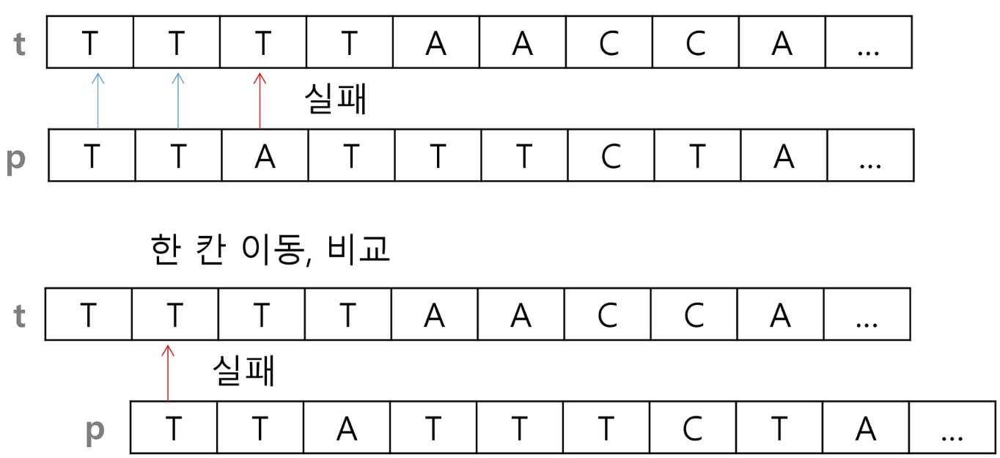
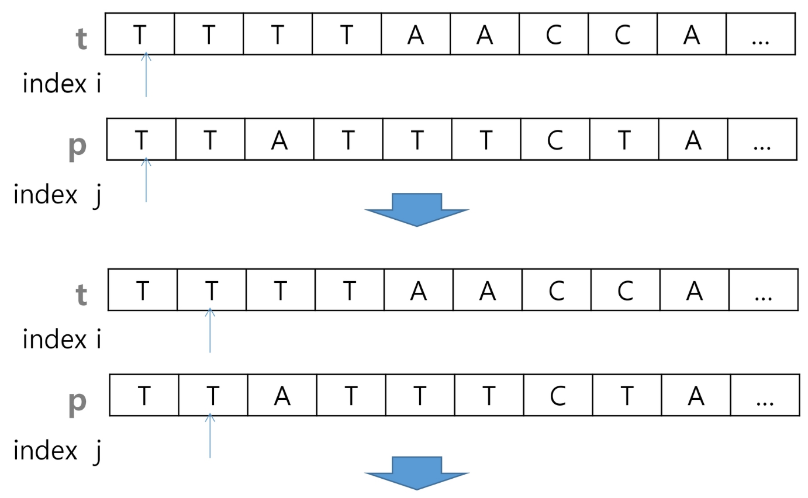
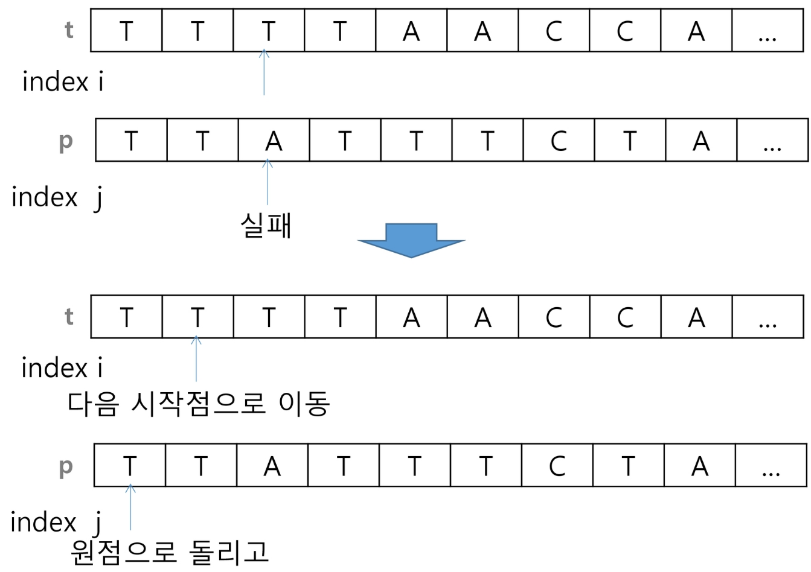
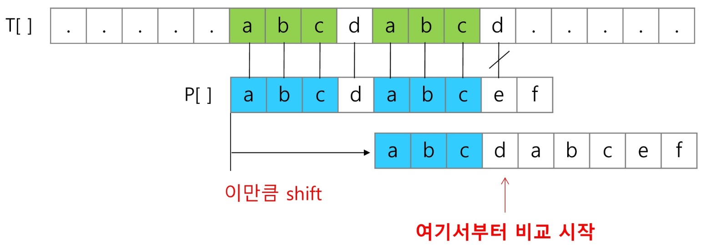
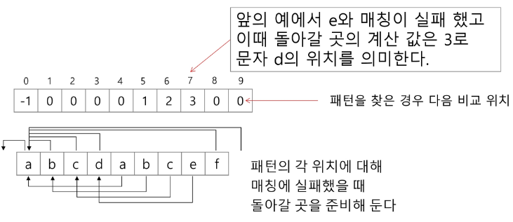
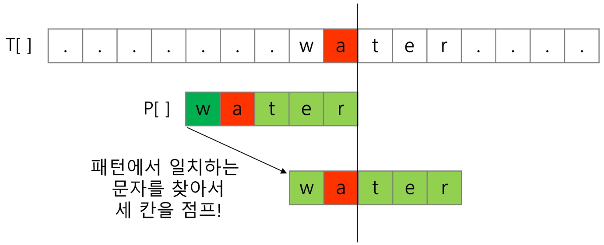
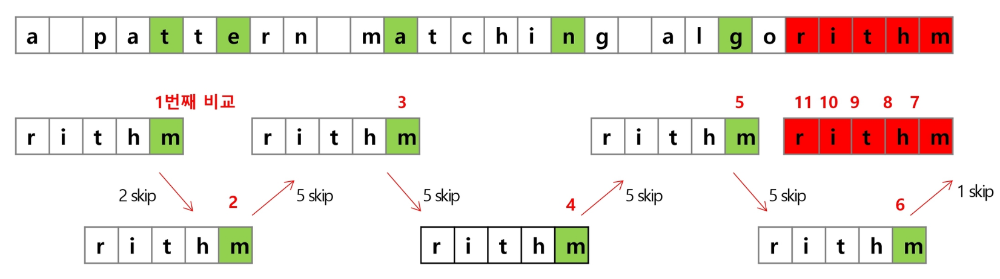
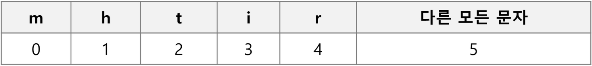

## String 1 (2025.02.12)

### 패턴 매칭

#### 1. 패턴 매칭에 사용되는 알고리즘들

- 고지식한 패턴 검색 알고리즘
- 카프-라빈 알고리즘
- KMP 알고리즘
- 보이어-무어 알고리즘

#### 2. 고지식한 알고리즘 (Brute Force)

- 본문 문자열을 처음부터 끝까지 차례대로 순회하면서 패턴 내의 문자들을 일일이 비교하는 방식으로 동작



- 알고리즘 설명





```python
# while문 예시
# 최초 인덱스 발견 (왼쪽부터)
def brute_force(p, t, M, N):
    i, j = 0, 0
    while j < M and i < N:
        if t[i] != p[j]:
            i -= j
            j = -1
        i += 1
        j += 1
    if j == M:
        return i - M
    else:
        return -1

# 패턴 갯수 계산
def cnt_pattern(p, t, M, N):
    i, j, cnt = 0, 0, 0
    while j < M and i < N:
        if t[i] != p[j]:
            i -= j
            j = -1
        i += 1
        j += 1
        if j == M:
            cnt += 1
            i -= j
            j = -1
    return cnt

p = "is"
t = "This is a book~!"
M = len(p)
N = len(t)
print(brute_force(p, t, M, N)) # 2
print(cnt_pattern(p, t, M, N)) # 2

# for문 예시
def search(p, t):
    N = len(t)
    M = len(p)
    for i in range(N - M + 1): # t에서 패턴을 비교할 시작 위치 인덱스
        for j in range(M):     # p에서 비교할 위치 인덱스
            if t[i + j] != p[j]:
                break
        else:                  # break에 걸리지 않고, for가 끝난 경우 실행
            return i
    return -1
t = "TTTTTATTAATA"
p = "TTA"
N = len(t)
M = len(p)
print(search(p, t))
```

#### 3. 고지식한 패턴 검색 알고리즘의 시간 복잡도

- 최악의 경우 시간 복잡도는 텍스트의 모든 위치에서 패턴을 비교해야 하므로 O(MN)이 됨
- 길이가 10000인 문자열에서 길이 80인 패턴을 찾는다고 할 때, 최악의 경우 약 10,000*80 = 800,000번의 비교가 일어남

---

### KMP 알고리즘

#### 1. KMP 알고리즘

- 불일치가 발생한 텍스트 스트링의 앞 부분에 어떤 문자가 있는지를 미리 알고 있으므로, 불일치가 발생한 앞 부분에 대하여 다시 비교하지 않고 매칭을 수행
- 패턴을 전처리하여 배열 next[M]을 구해서 잘못된 시작을 최소화함
    - next[M]: 불일치가 발생했을 경우 이동할 다음 위치
- 시간 복잡도: O(M + N)

#### 2. 아이디어 설명

- 텍스트에서 abcdabc까지는 매치되고, e에서 실패한 상황 패턴의 맨앞의 abc와 실패 직전의 abc는 동일함을 이용할 수 있음
- 실패한 텍스트 문자와 P[4]를 비교





```python
def kmp(t, p):
    N = len(t)
    M = len(p)
    lps = [0] * (M + 1)
    # preprocessing
    # 일치한 개수 == 비교할 패턴 위치
    j = 0
    lps[0] = -1
    for i in range(1, M):
        # p[i]이전에 일치한 개수
        lps[i] = j
        if p[i] == p[j]:
            j += 1
        else:
            j = 0
    lps[M] = j
    # search
    # 비교할 텍스트 위치
    i = 0
    # 비교할 패턴 위치
    j = 0
    while i < N and j <= M:
        # 첫글자자 불일치했거나, 일치하면
        if j == -1 or t[i] == p[j]:
            i += 1
            j += 1
        # 불일치
        else:
            j = lps[j]
        # 패턴을 찾을 경우
        if j == M:
            # 패턴의 인덱스 출력
            print(i - M, end = ' ')
            j = lps[j]
    print()
    return

t = 'zzzabcdabcdabcefabcd'
p = 'abcdabcef'
kmp(t, p)
t = 'AABAACAADAABAABA'
p = 'AABA'
kmp(t, p)
t = "AAAAABAAABA"
p =  "AAAA"
kmp(t, p)
t = "AAAAABAAABA"
p =  "AA"
kmp(t, p)
```

---

### 보이어-무어 알고리즘

#### 1. 보이어-무어 알고리즘

- 오른쪽에서 왼쪽으로 비교
- 대부분의 상용 소프트웨어에서 채택하고 있는 알고리즘
- 보이어-무어 알고리즘은 패턴에 오른쪽 끝에 있는 문자가 불일치 하고 이 문자가 패턴 내에 존재하지 않는 경우, 이동 거리는 무려 패턴의 길이 만큼이 됨


- 오른쪽 끝에 있는 문자가 불일치 하고 이 문자가 패턴 내에 존재할 경우



#### 2. 보이어-무어 알고리즘을 이용한 예



- rithm 문자열의 skip 배열



#### 3. 문자열 매칭 알고리즘 비교

- 찾고자 하는 문자열 패턴의 길이 m, 총 문자열 길이 n
- 고지식한 패턴 검색 알고리즘
    - 수행시간 O(mn)
- 카프-라빈 알고리즘
    - 수행시간 Θ(mn)
- KMP 알고리즘
    - 수행시간 Θ(n)
- 보이어-무어 알고리즘
    - 앞의 두 매칭 알고리즘들의 공통점 텍스트 문자열의 문자를 적어도 한 번씩 훑는다는 것
        - 따라서 최선의 경우에도 Ω(n) → 빅-오메가 표기법 (Omega Notation)
    - 보이어-무어 알고리즘은 텍스트 문자를 다 보지 않아도 됨
    - 발상의 전환
        - 패턴의 오른쪽부터 비교
    - 최악의 경우 수행시간
        - Θ(mn) → 빅-세타 표기법 (Theta Notation)
    - 입력에 따라 다르지만 일반적으로 Θ(n)보다 시간이 덜 듦

---

### 연습문제

```python
# A와 B의 글자를 차례로 늘어놓기
def search(A, B):
    N = len(A)
    M = len(B)
    i = j = 0            # A[i], B[j]
    ans = []
    while i + j < N + M: # 복사할 문자가 남아있으면
        if i < N:        # A에 남은 문자가 있으면
            ans += A[i]
            i += 1
        if j < M:
            ans += B[j]
            j += 1
    return ans

# A와 B의 글자를 차례로 늘어놓기 (숫자 리스트일 때)
def search(A, B):
    N = len(A)
    M = len(B)
    i = j = 0            # A[i], B[j]
    ans = [0] * (N + M)
    while i + j < N + M: # 복사할 문자가 남아있으면
        if i < N:        # A에 남은 문자가 있으면
            ans[i + j] = A[i]
            i += 1
        if j < M:
            ans[i + j] = B[j]
            j += 1
    return ans

A = "ABCD"
B = "EFGHIJKLMN"
print(search(A, B))
```
