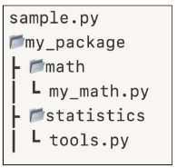
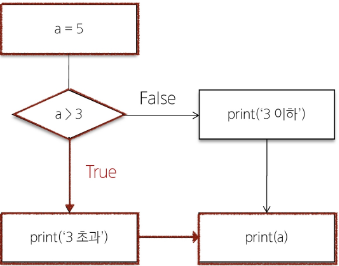
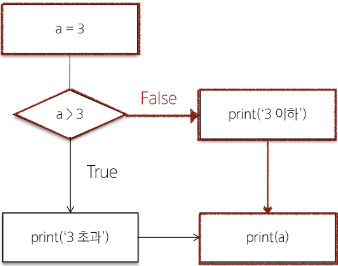

## Python 04 Modules & Control of Flow (2025.01.23)

### 모듈

#### 1. 개요

- 과학자, 수학자가 모든 이론을 새로 만들거나 증명하지 않는 것처럼, 개발자 또한 프로그램 전체를 모두 혼자 힘으로 작성하는 것은 드문 일
- 다른 프로그래머가 이미 작성해 놓은 수천, 수백만 줄의 코드를 활용하는 것은 생산성에서 매우 중요한 일

#### 2. 모듈 (Module)

- 한 파일로 묶인 변수와 함수의 모음
- 특정한 기능을 하는 코드가 작성된 파이썬 파일 (.py)
- 모듈 예시
    - math 내장 모듈
        - 파이썬이 미리 작성해 둔 수학 관련 변수와 함수가 작성된 모듈
    - 참고 자료
        - https://docs.python.org/ko/3/library/math.html
        
        ```python
        import math
        import random
        import time
        
        print(math.pi)               # 3.141592653589793
        print(math.sqrt(4))          # 2.0
        print(random.randint(1, 10)) # 난수 생성
        ```
        

#### 3. 모듈 활용

- 모듈을 가져오는 방법
    - import문 사용
        - `명시성과 직관성을 위해 파이썬에서는 from절보다 import문을 권장함`
    
    ```python
    import math
    
    print(math.sqrt(4)) # 2.0
    ```
    
    - from절 사용
    
    ```python
    from math import sqrt
    
    print(sqrt(4)) # 2.0
    ```
    

- 모듈 사용하기
    - ‘. (dot)’ 연산자
        - “점의 왼쪽 객체에서 점의 오른쪽 이름을 찾아라”라는 의미
        
        ```python
        import math
        
        # 모듈명.변수명
        print(math.pi)
        
        # 모듈명.함수명
        print(math.sqrt(4))
        ```
        

- 모듈 주의사항
    - 서로 다른 모듈이 같은 이름의 함수를 제공할 경우 문제 발생
    - 마지막에 import된 이름으로 대체됨
    
    ```python
    from math import pi, sqrt
    from my_math import sqrt
    
    # 그래서 모듈 내 모든 요소를 한 번에 import하는 * 표기는 권장하지 않음
    from math import *
    ```
    

- ‘as’ 키워드
    - as 키워드를 사용하여 별칭(alias)을 부여
        - 두 개 이상의 모듈에서 동일한 이름의 변수, 함수 클래스 등을 가져올 때 발생하는 이름 충돌 해결
        
        ```python
        from math import sqrt
        from my_math import sqrt as my_sqrt
        
        sqrt(4)
        my_sqrt(4)
        ```
        

#### 4. 사용자 정의 모듈

- 직접 정의한 모듈 사용하기
    - 모듈 my_math.py 작성
    - 두 수의 합을 구하는 add 함수 작성
    - my_math 모듈 import 후 add 함수 호출
    
    ```python
    # my_math.py 파일에 정의된 add() 함수
    def add(x, y):
        return x + y
        
    # my_math.py 파일을 모듈로 가져와서 add() 함수 호출
    import my_math
    print(my_math.add(1, 2))
    ```
    

---

### 파이썬 표준 라이브러리

#### 1. 파이썬 표준 라이브러리 (Python Standard Library)

- 파이썬 언어와 함께 제공되는 다양한 모듈과 패키지의 모음
- 참고 자료
    - https://docs.python.org/ko/3/library/index.html

#### 2. 패키지 (Package)

- 연관된 모듈들을 하나의 디렉토리에 모아 놓은 것
- 패키지 사용하기
    - 아래와 같은 디렉토리 구조로 작성
        - 패키지 3개
            - my_package
            - math
            - statistics
        - 모듈 2개
            - my_math
            - tools
    - 각 패키지의 모듈을 import하여 사용하기
    
    
    
    ```python
    # my_math.py (모듈)
    def add(x, y):
        return x + y
    
    # tools.py (모듈)
    def mod(x, y):
        return x % y
        
    # sample.py
    from my_package.math import my_math
    from my_package.statistics import tools
    
    print(my_math.add(1, 2)) # 3
    print(tools.mod(1, 2))   # 1
    ```
    

- 패키지 종류
    - PSL 내부 패키지
        - 설치 없이 바로 import하여 사용
    - 외부 패키지
        - pip를 사용하여 설치 후 import 필요
- pip (파이썬 패키지 관리자)
    - 외부 패키지들을 설치하도록 도와주는 파이썬의 패키지 관리 시스템
    - 참고 자료
        - https://pypi.org/
    - PyPI(Python Package Index)에 저장된 외부 패키지들을 설치
    - 패키지 설치
        - 최선 버전 / 특정 버전 / 최소 버전을 명시하여 설치할 수 있음
        
        ```python
        # 해당 패키지 설치
        """
        패키지 버전 지정 안 하면 최신 버전 설치
        """
        pip install SomePackage
        
        # 지정한 패키지 버전 설치
        pip install SomePackage==1.0.5
        
        # 지정한 패키지 버전이 없으면 그 이상의 버전으로 설치
        pip install SomePackage>=1.0.4
        
        # 해당 패키지 삭제
        pip uninstall SomePackage
        ```
        
    
    - requests 외부 패키지 설치 및 사용 예시
    
    ```python
    # 설치된 패키지 목록 및 버전 확인
    pip list
    
    # requests 외부 패키지 설치
    pip install requests
    
    # requests 외부 패키지 사용 예시
    import requests
    
    url = 'https://random-data-api.com/api/v2/users'
    response = requests.get(url).json()
    
    print(response)
    ```
    

- 패키지 사용 목적
    - 모듈들의 이름공간을 구분하여 충돌을 방지
    - 모듈들을 효율적으로 관리하고 재사용할 수 있도록 돕는 역할

---

### 제어문

#### 1. 제어문 (Control Statement)

- 코드의 실행 흐름을 제어하는 데 사용되는 구문
- 조건에 따라 코드 블록을 실행하거나 반복적으로 코드를 실행
- 제어문의 종류
    - 조건문
        - if
        - elif
        - else
    - 반복문
        - form
        - while
    - 반복문 제어
        - break
        - continue
        - pass

#### 2. 조건문 (Conditional Statement)

- 주어진 조건식을 평가하여 해당 조건이 참(True)인 경우에만 코드 블록을 실행하거나 건너뜀
- 파이썬 조건문에 사용되는 키워드
    - if
    - elif
    - else
- if statement의 기본 구조

```python
if 표현식:
    코드 블록
elif 표현식:
    코드 블록
else:
    코드 블록
```

- 조건문 예시

```python
a = 5

if a > 3:
    print('3 초과')
else:
    print('3 이하')

print(a)
```





- 복수 조건문
    - 조건식을 동시에 검사하는 것이 아니라 “순차적”으로 비교
    
    ```python
    dust = 35
    
    if dust > 150:
        print('매우 나쁨')
    elif dust > 80:
        print('나쁨')
    elif dust > 30:
        print('보통')
    else:
        print('좋음')
    ```
    

- 중첩 조건문

```python
dust = 480

if dust > 150:
    print('매우 나쁨')
    if dust > 300:
        print('위험해요! 나가지 마세요!')
elif dust > 80:
    print('나쁨')
elif dust > 30:
    print('보통')
else:
    print('좋음')
```

---

### 반복문

#### 1. 반복문 (Loop Statement)

- 주어진 코드 블록을 여러 번 반복해서 실행하는 구문
- 파이썬 반복문에 사용되는 키워드
    - for
        - 특정 작업을 반복적으로 수행
    - while
        - 주어진 조건이 참인 동안 반복해서 실행

#### 2. ‘for’ statement

- 임의의 시퀀스의 항목들을 그 시퀀스에 들어있는 순서대로 반복
- for statement의 기본 구조

```python
for 변수 in 반복 가능한 객체:
    코드 블록
```

- 반복 가능한 객체 (iterable)
    - 반복문에서 순회할 수 있는 객체
    - 시퀀스 객체 뿐만 아니라 dict, set 등도 포함
- for문 작동원리
    - 리스트 내 첫 항목이 반복 변수에 할당되고 코드 블록이 실행
    - 다음으로 반복 변수에 리스트의 2번째 항목이 할당되고 코드 블록이 다시 실행
    - … 마지막으로 반복 변수에 리스트의 마지막 요소가 할당되고 코드 블록이 실행
    
    ```python
    items = ['apple', 'banana', 'cocount']
    
    for item in items:
        print(item)
        """
        apple
        banana
        cocount
        """
    ```
    

- 문자열 순회

```python
country = 'Korea'

for char in country:
    print(char)
    """
    K
    o
    r
    e
    a
    """
```

- range 순회

```python
for i in range(5):
    print(i)
    """
    0
    1
    2
    3
    4
    """
```

- 딕셔너리 순회

```python
my_dict = {
    'x': 10,
    'y': 20,
    'z': 30,
}

for key in my_dict:
    print(key)
    print(my_dict[key])
    """
    x
    10
    y
    20
    z
    30
    """
```

- 인덱스로 리스트 순회
    - 리스트의 요소가 아닌 인덱스로 접근하여 해당 요소들을 변경하기
    
    ```python
    numbers = [4, 6, 10, -8, 5]
    
    for i in range(len(numbers)):
        numbers[i] = numbers[i] * 2
    
    print(numbers) # [8, 12, 20, -16, 10]
    ```
    

- 중첩된 반복문
    - 안쪽 반복문은 outers 리스트의 각 항목에 대해 한 번씩 실행됨
    - print가 호출되는 횟수 ⇒ `len(outers) * len(inners)`

```python
outers = ['A', 'B']
inners = ['c', 'd']

for outer in outers:
    for inner in inners:
        print(outer, inner)
        """
        A, c
        A, d
        B, c
        B, d
        """
```

- 중첩 리스트 순회
    - 안쪽 리스트 요소에 접근하려면 바깥 리스트를 순회하면서 중첩 반복을 사용해 각 안쪽 반복을 순회
    
    ```python
    elements = [['A', 'B'], ['c', 'd']]
    
    for elem in elements:
        print(elem)
        """
        ['A', 'B']
        ['c', 'd']
        """
    
    for elem in elements:
        for item in elem:
            print(item)
            """
            A
            B
            c
            d
            """
    ```
    

#### 3. ‘while’ statement

- 주어진 조건식이 참(True)인 동안 코드를 반복해서 실행
- 조건식이 거짓(False)가 될 때까지 반복
- while statement의 기본 구조

```python
while 조건식:
    코드 블록
```

- while문 예시

```python
a = 0

while a < 3:
    print(a)
    a += 1

print('끝')
"""
0
1
2
끝
"""
```

- 사용자 입력에 따른 반복
    - while문을 사용한 특정 입력 값에 대한 종료 조건 활용하기
    
    ```python
    number = int(input('양의 정수를 입력해주세요: '))
    
    while number <= 0:
        if number < 0:
            print('음수를 입력했습니다.')
        else:
            print('0은 양의 정수가 아닙니다.')
    
        number = int(input('양의 정수를 입력해주세요: '))
    
    print('잘했습니다!')
    
    """
    양의 정수를 입력해주세요: 0
    0은 양의 정수가 아닙니다.
    양의 정수를 입력해주세요: -1
    음수를 입력했습니다.
    양의 정수를 입력해주세요: 1
    잘했습니다!
    """
    ```
    

- `while문은 반드시 종료 조건이 필요`

#### 4. 적절한 반복문 활용하기

- for
    - 반복 횟수가 명확하게 정해져 있는 경우에 유용
    - 리스트, 튜플, 문자열 등과 같은 시퀀스 형식의 데이터를 처리할 때 유용
- while
    - 반복 횟수가 불명확하거나 조건에 따라 반복을 종료해야 할 때 유용
    - 사용자의 입력을 받아서 특정 조건이 충족될 때까지 반복하는 경우 유

#### 5. 반복 제어

- for문과 while은 매 반복마다 본문 내 모든 코드를 실행하지만 때때로 일부만 실행하는 것이 필요할 때가 있음
- 반복문 제어 키워드
    - break
        - 반복을 즉시 중지
    - continue
        - 다음 반복으로 건너뜀
    - pass
        - 아무런 동작도 수행하지 않고 넘어감

- 반복문 제어 예시

```python
# break
for i in range(10):
    if i == 5:
        break
    print(i) # 0 1 2 3 4

# continue
for i in range(10):
    if i % 2 == 0:
        continue
    print(i) # 1 3 5 7 9

# pass
for i in range(10):
    pass # 아무 작업도 안 함
```

- break 예시
    - 프로그램 종료 조건 만들기
    
    ```python
    number = int(input('양의 정수를 입력해주세요: '))
    
    while number <= 0:
        if number == -9999:
            print('프로그램을 종료합니다.')
            break
    
        if number < 0:
            print('음수를 입력했습니다.')
        else:
            print('0은 양의 정수가 아닙니다.')
    
        number = int(input('양의 정수를 입력해주세요: '))
    
    print('잘했습니다!')
    
    """
    양의 정수를 입력해주세요: -9999
    프로그램을 종료합니다.
    잘했습니다.
    """
    
    """
    양의 정수를 입력해주세요: -45
    음수를 입력했습니다.
    양의 정수를 입력해주세요: 1
    잘했습니다.
    """
    ```
    
    - 리스트에서 첫 번째 짝수만 찾은 후 반복 종료하기
    
    ```python
    numbers = [1, 3, 5, 6, 7, 9, 10, 11]
    found_even = False
    
    for num in numbers:
        if num % 2 == 0:
            print('첫 번째 짝수를 찾았습니다: ', num)
            found_even = True
            break
    
    if not found_even:
        print('짝수를 찾지 못했습니다.')
    
    """
    첫 번째 짝수를 찾았습니다: 6
    """
    ```
    

- continue 예시
    - 리스트에서 홀수만 출력하기
    - 현재 반복문의 남은 코드를 건너뛰고, 다음 반복으로 넘어감
    
    ```python
    numbers = [1, 2, 3, 4, 5, 6, 7, 8, 9, 10]
    
    for num in numbers:
        if num % 2 == 0:
            continue
        print(num)
        """
        1
        3
        5
        7
        9
        """
    ```
    

- pass 예시
    - 코드 작성 중 미완성 부분
        - 구현해야 할 부분이 나중에 추가될 수 있고, 코드를 컴파일하는 동안 오류가 발생하지 않음
        
        ```python
        def my_function():
            pass
        ```
        
    
    - 조건문에서 아무런 동작을 수행하지 않아야 할 때
    
    ```python
    if condition:
        pass # 아무런 동작도 수행하지 않음
    else:
        # 다른 동작 수
    ```
    
    - 무한 루프에서 조건이 충족되지 않을 때, pass를 사용하여 루프를 계속 진행하는 방법
    
    ```python
    while True:
        if condition:
            break
        elif condition:
            pass # 루프 계속 진행
        else:
            print('..')
    ```
    

---

### List Comprehension

#### 1. List Comprehension

- 간결하고 효율적인 리스트 생성 방법
- List Comprehension 구조

```python
# [expression for 변수 in iterable]
list(expression for 변수 in iterable)

# [expression for 변수 in iterable if 조건식]
list(expression for 변수 in iterable if 조건식)
```

- List Comprehension 사용 전/후 비교

```python
# 사용 전
numbers = [1, 2, 3, 4, 5]
squared_numbers = []

for num in numbers:
    squared_numbers.append(num**2)

print(squared_numbers) # [1, 4, 9, 16, 25]

# 사용 후
numbers = [1, 2, 3, 4, 5]
squared_numbers = [num**2 for num in numbers]
print(squared_numbers) # [1, 4, 9, 16, 25]
```

- List Comprehension 활용 예시
    - 2차원 배열 생성 시 (인접행렬 생성 시)
    
    ```python
    data1 = [[0] * (5) for _ in range(5)]
    print(data1) # [[0, 0, 0, 0, 0], [0, 0, 0, 0, 0], [0, 0, 0, 0, 0], [0, 0, 0, 0, 0], [0, 0, 0, 0, 0]]
    
    # 또는
    data2 = [[0 for _ in range(5)] for _ in range(5)]
    print(data2) # [[0, 0, 0, 0, 0], [0, 0, 0, 0, 0], [0, 0, 0, 0, 0], [0, 0, 0, 0, 0], [0, 0, 0, 0, 0]]
    ```
    

- 리스트를 생성하는 3가지 방법 (기본 loop, list comprehension, map) 비교

```python
# 리스트를 생성하는 3가지 방법 (기본 loop, list comprehension, map) 비교
# 1. 기본 loop
"""
특징
 - 직관적으로 이해하기 쉽고, 복잡한 로직을 담기에도 용이
 - 반복문 내부에서 여러 변수를 업데이트하거나, 특정 조건에 따라 continue/break가 필요한 경우 유리
"""
result1 = []
for i in range(10):
    result1.append(i)
print(result1) # [0, 1, 2, 3, 4, 5, 6, 7, 8, 9]

# 2. List Comprehension
"""
특징
 - 파이썬스러운(Pythonic) 방식으로 간결한 코드 작성 가능
 - 조건문을 넣거나, 중첩 for문을 사용하는 등 다양한 패턴을 구현하기에도 용이
 - 가독성을 해치지 않을 선에서 사용하는 것이 중요
"""
result2 = [i for i in range(10)]
print(result2) # [0, 1, 2, 3, 4, 5, 6, 7, 8, 9]
# result2 = list(i for i in range(10))
# print(result2) # [0, 1, 2, 3, 4, 5, 6, 7, 8, 9]

# 3. map
"""
특징
 - 함수형 프로그래밍 스타일을 선호하거나, 이미 정의된 함수를 적용해야 할 때 유용
 - 이미 존재하는 함수에 여러 값을 한꺼번에 적용할 때, 가독성이 좋아짐
 - 복잡한 로직은 map 내부에서 처리하기가 난해하므로, 코드가 오히려 읽기 어려워질 수 있음
"""
result3 = list(map(lambda i: i, range(10)))
print(result3) # [0, 1, 2, 3, 4, 5, 6, 7, 8, 9]

# 성능 비교
# 1. list comprehension
"""
 - 대부분의 경우 가장 빠른 속도를 보임
"""

# 2. map
"""
 - 특정 상황(예: 기존 함수를 사용할 때, 매우 간단한 변환)의 경우
   list comprehension과 비슷하거나 약간 더 빠른 성능을 보일 수도 있음
   (파이썬 버전 및 구현 세부사항에 따라 다름)
"""

# 3. loop
"""
 - 일반적으로는 list comprehension이나 map에 비해 조금 더 느린 경향을 보이지만
   python 버전이 올라가면서 다른 방식과 비슷하거나 떄로는 더 나은 결과를 보이기도 함
"""

# 결론
"""
 - 성능 차이는 대부분의 경우 미미하므로,
   미세한 차이가 아니라면, 가독성과 유지보수성이 성능보다 더 중요
"""
```

- `Comprehension을 남용하지 말자`
    - 경우에 따라서 코드의 직관성, 가독성, 명시성이 떨어질 수 있음
    - “Simple is better than complex”
    - “keep it simple, stupid"
    
    ```python
    # List Comprehension 적용 코드
    result = [i for i in range(10) if i % 2 == 1]
    print(result) # [1, 3, 5, 7, 9]
    
    # List Comprehension 적용 안 한 코드
    result = []
    for i in range(10):
        if i % 2 == 1:
            result.append(i)
    print(result) # [1, 3, 5, 7, 9]
    ```
    

---

### 참고

#### 1. 모듈 내부 살펴보기

- 내장 함수 help를 사용해 모듈에 무엇이 들어있는지 확인 가능

```python
# help(모듈 명) 함수 사용
import math

help(math)
"""
Help on built-in module math:

NAME
    math

DESCRIPTION
    This module provides access to the mathematical functions
    defined by the C standard.

FUNCTIONS
    acos(x, /)
        Return the arc cosine (measured in radians) of x.

        The result is between 0 and pi.

    acosh(x, /)
        Return the inverse hyperbolic cosine of x.

    asin(x, /)
        Return the arc sine (measured in radians) of x.

        The result is between -pi/2 and pi/2.

    asinh(x, /)
        Return the inverse hyperbolic sine of x.

    atan(x, /)
        Return the arc tangent (measured in radians) of x.

        The result is between -pi/2 and pi/2.

    atan2(y, x, /)
        Return the arc tangent (measured in radians) of y/x.

        Unlike atan(y/x), the signs of both x and y are considered.

    atanh(x, /)
        Return the inverse hyperbolic tangent of x.

    ceil(x, /)
        Return the ceiling of x as an Integral.

        This is the smallest integer >= x.

    comb(n, k, /)
        Number of ways to choose k items from n items without repetition and without order.

        Evaluates to n! / (k! * (n - k)!) when k <= n and evaluates
        to zero when k > n.

        Also called the binomial coefficient because it is equivalent
        to the coefficient of k-th term in polynomial expansion of the
        expression (1 + x)**n.

        Raises TypeError if either of the arguments are not integers.
        Raises ValueError if either of the arguments are negative.

    copysign(x, y, /)
        Return a float with the magnitude (absolute value) of x but the sign of y.

        On platforms that support signed zeros, copysign(1.0, -0.0)
        returns -1.0.

    cos(x, /)
        Return the cosine of x (measured in radians).

    cosh(x, /)
        Return the hyperbolic cosine of x.

    degrees(x, /)
        Convert angle x from radians to degrees.

    dist(p, q, /)
        Return the Euclidean distance between two points p and q.

        The points should be specified as sequences (or iterables) of
        coordinates.  Both inputs must have the same dimension.

        Roughly equivalent to:
            sqrt(sum((px - qx) ** 2.0 for px, qx in zip(p, q)))

    erf(x, /)
        Error function at x.

    erfc(x, /)
        Complementary error function at x.

    exp(x, /)
        Return e raised to the power of x.

    expm1(x, /)
        Return exp(x)-1.

        This function avoids the loss of precision involved in the direct evaluation of exp(x)-1 for small x.

    fabs(x, /)
        Return the absolute value of the float x.

    factorial(x, /)
        Find x!.

        Raise a ValueError if x is negative or non-integral.

    floor(x, /)
        Return the floor of x as an Integral.

        This is the largest integer <= x.

    fmod(x, y, /)
        Return fmod(x, y), according to platform C.

        x % y may differ.

    frexp(x, /)
        Return the mantissa and exponent of x, as pair (m, e).

        m is a float and e is an int, such that x = m * 2.**e.
        If x is 0, m and e are both 0.  Else 0.5 <= abs(m) < 1.0.

    fsum(seq, /)
        Return an accurate floating point sum of values in the iterable seq.

        Assumes IEEE-754 floating point arithmetic.

    gamma(x, /)
        Gamma function at x.

    gcd(*integers)
        Greatest Common Divisor.

    hypot(...)
        hypot(*coordinates) -> value

        Multidimensional Euclidean distance from the origin to a point.

        Roughly equivalent to:
            sqrt(sum(x**2 for x in coordinates))

        For a two dimensional point (x, y), gives the hypotenuse
        using the Pythagorean theorem:  sqrt(x*x + y*y).

        For example, the hypotenuse of a 3/4/5 right triangle is:

            >>> hypot(3.0, 4.0)
            5.0

    isclose(a, b, *, rel_tol=1e-09, abs_tol=0.0)
        Determine whether two floating point numbers are close in value.

          rel_tol
            maximum difference for being considered "close", relative to the
            magnitude of the input values
          abs_tol
            maximum difference for being considered "close", regardless of the
            magnitude of the input values

        Return True if a is close in value to b, and False otherwise.

        For the values to be considered close, the difference between them
        must be smaller than at least one of the tolerances.

        -inf, inf and NaN behave similarly to the IEEE 754 Standard.  That
        is, NaN is not close to anything, even itself.  inf and -inf are
        only close to themselves.

    isfinite(x, /)
        Return True if x is neither an infinity nor a NaN, and False otherwise.

    isinf(x, /)
        Return True if x is a positive or negative infinity, and False otherwise.

    isnan(x, /)
        Return True if x is a NaN (not a number), and False otherwise.

    isqrt(n, /)
        Return the integer part of the square root of the input.

    lcm(*integers)
        Least Common Multiple.

    ldexp(x, i, /)
        Return x * (2**i).

        This is essentially the inverse of frexp().

    lgamma(x, /)
        Natural logarithm of absolute value of Gamma function at x.

    log(...)
        log(x, [base=math.e])
        Return the logarithm of x to the given base.

        If the base not specified, returns the natural logarithm (base e) of x.

    log10(x, /)
        Return the base 10 logarithm of x.

    log1p(x, /)
        Return the natural logarithm of 1+x (base e).

        The result is computed in a way which is accurate for x near zero.

    log2(x, /)
        Return the base 2 logarithm of x.

    modf(x, /)
        Return the fractional and integer parts of x.

        Both results carry the sign of x and are floats.

    nextafter(x, y, /)
        Return the next floating-point value after x towards y.

    perm(n, k=None, /)
        Number of ways to choose k items from n items without repetition and with order.

        Evaluates to n! / (n - k)! when k <= n and evaluates
        to zero when k > n.

        If k is not specified or is None, then k defaults to n
        and the function returns n!.

        Raises TypeError if either of the arguments are not integers.
        Raises ValueError if either of the arguments are negative.

    pow(x, y, /)
        Return x**y (x to the power of y).

    prod(iterable, /, *, start=1)
        Calculate the product of all the elements in the input iterable.

        The default start value for the product is 1.

        When the iterable is empty, return the start value.  This function is
        intended specifically for use with numeric values and may reject
        non-numeric types.

    radians(x, /)
        Convert angle x from degrees to radians.

    remainder(x, y, /)
        Difference between x and the closest integer multiple of y.

        Return x - n*y where n*y is the closest integer multiple of y.
        In the case where x is exactly halfway between two multiples of
        y, the nearest even value of n is used. The result is always exact.

    sin(x, /)
        Return the sine of x (measured in radians).

    sinh(x, /)
        Return the hyperbolic sine of x.

    sqrt(x, /)
        Return the square root of x.

    tan(x, /)
        Return the tangent of x (measured in radians).

    tanh(x, /)
        Return the hyperbolic tangent of x.

    trunc(x, /)
        Truncates the Real x to the nearest Integral toward 0.

        Uses the __trunc__ magic method.

    ulp(x, /)
        Return the value of the least significant bit of the float x.

DATA
    e = 2.718281828459045
    inf = inf
    nan = nan
    pi = 3.141592653589793
    tau = 6.283185307179586

FILE
    (built-in)
"""
```

#### 2. enumerate

- iterable 객체의 각 요소에 대해 인덱스와 함께 변환하는 내장 함수

```python
enumerate(iterable, start=0)
```

- enumerate 예시

```python
# start = 0
fruits = ['apple', 'banana', 'cherry']

for index, fruit in enumerate(fruits):
    print(index, fruit)

"""
0 apple
1 banana
2 cherry
"""

# start = 3
fruits = ['apple', 'banana', 'cherry']

for index, fruit in enumerate(fruits, 3):
    print(index, fruit)

"""
3 apple
4 banana
5 cherry
"""
```
