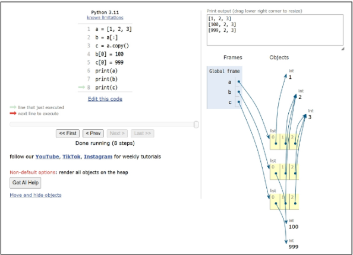

## Python 05 Data Structure (2025.01.24)

### Data Structure

#### 1. 데이터 구조 (Data Structure)

- 여러 데이터를 효과적으로 사용, 관리하기 위한 구조
- str, list, dict 등

#### 2. 자료 구조

- 컴퓨터 공학에서는 ‘자료 구조’라고 함
- 각 데이터의 효율적인 저장, 관리를 위한 구조를 나눠 놓은 것


#### 3. 데이터 구조 활용

- 문자열, 리스트, 딕셔너리 등 각 데이터 구조의 메서드를 호출하여, 다양한 기능을 활용하기

---

### 메서드

#### 1. 메서드 (Method)

- 객체에 속한 함수
- 객체의 상태를 조작하거나 동작을 수행
- 메서드는 어딘가(클래스)에 속해 있는 함수이며, 각 데이터 타입별로 다양한 기능을 가진 메서드가 존재
- 메서드 호출 방법

```python
# 데이터 타입 객체.메서드()
'hello'.capitalize()
```

- 메서드 호출 예시

```python
# 문자열 메서드 예시
print('hello'.capitalize()) # Hello

# 리스트 메서드 예시
numbers = [1, 2, 3]
numbers.append(4)

print(numbers) # [1, 2, 3, 4]
```

- 메서드 특징
    - 메서드는 클래스(class) 내부에 정의되는 함수
    - 클래스는 파이썬에서 ‘타입을 표현하는 방법’이며 은연 중에 사용해왔음
    - help 함수를 통해 str을 호출해보면 class였다는 것을 확인 가능
    
    ```python
    print(help(str))
    """
    Help on class str in module builtins:
    
    class str(object)
     |  str(object='') -> str
     |  str(bytes_or_buffer[, encoding[, errors]]) -> str
     |
     |  Create a new string object from the given object. If encoding or
     |  errors is specified, then the object must expose a data buffer
     |  that will be decoded using the given encoding and error handler.
     |  Otherwise, returns the result of object.__str__() (if defined)
     |  or repr(object).
     |  encoding defaults to sys.getdefaultencoding().
    -- More  --
    """
    ```
    

---

### 시퀀스 데이터 구조

#### 1. 문자열

- 문자열 조회/탐색 및 검증 메서드

```python
# s.find(x)
# x의 첫 번째 위치를 반환, 없으면 -1을 반환
print('banana'.find('a')) # 1
print('banana'.find('z')) # -1

# s.index(x)
# x의 첫 번째 위치를 반환, 없으면, 오류 발생
print('banana'.index('a')) # 1
print('banana'.index('z')) # ValueError: substring not found

# s.isupper()
# 문자열 내의 모든 문자가 대문자인지 확인
string1 = 'HELLO'
string2 = 'Hello'
print(string1.isupper()) # True
print(string2.isupper()) # False

# s.islower()
# 문자열 내의 모든 문자가 소문자인지 확인
string1 = 'HELLO'
string2 = 'Hello'
print(string1.islower()) # False
print(string2.islower()) # False

# s.isalpha()
# 문자열 내의 모든 문자가 알파벳인지 확인
# 단순 알파벳이 아닌 유니코드 상 Letter (한국어도 포함)
string1 = 'Hello'
string2 = '123heis98576ssh'
print(string1.isalpha()) # True
print(string2.isalpha()) # False
```

- 문자열 조작 메서드 (새 문자열 반환)

```python
# s.replace(old, new[, count]) -> 대괄호([])는 옵션 값
# 바꿀 대상 글자를 새로운 글자로 바꿔서 반환환
text = "Hello, world! world world"
new_text1 = text.replace('world', 'Python')
new_text2 = text.replace('world', 'Python', 1)
print(new_text1) # Hello, Python! Python Python
print(new_text2) # Hello, Python! world world

# s.strip([chars])
# 공백이나 특정 문자를 제거
text = '    Hello, world!   '
new_text = text.strip()
print(new_text) # 'Hello, world'

# s.split(sep=None, maxsplit=-1)
# sep를 구분자 문자열로 사용하여 문자열에 있는 단어들의 리스트를 반환
text = 'Hello, world!'
words1 = text.split(',')
words2 = text.split()
print(words1) # ['Hello', 'world!']
print(words2) # ['Hello,', 'world!']

# 'separator'.join(iterable)
# 구분자로 iterable의 문자열을 연결한 문자열을 반환
words = ['Hello', 'world!']
text = '-'.join(words)
print(text) # 'Hello-world!'

# s.capitalize()
# 가장 첫 번째 글자를 대문자로 변경
text = 'heLLo, woRld!'
new_text = text.capitalize()
print(new_text) # Hello, world!

# s.title()
# 문자열 내 띄어쓰기 기준으로 각 단어의 첫 글자는 대문자로, 나머지는 소문자로 변환
text = 'heLLo, woRld!'
new_text = text.title()
print(new_text) # Hello, World!

# s.lower()
# 모두 소문자로 변경
text = 'heLLo, woRld!'
new_text = text.lower()
print(new_text) # hello, world!

# s.upper()
# 모두 대문자로 변경
text = 'heLLo, woRld!'
new_text = text.upper()
print(new_text) # HELLO, WORLD!

# s.swapcase()
# 대문자, 소문자 서로 변경
text = 'heLLo, woRld!'
new_text = text.swapcase()
print(new_text) # HELLO, WOrLD!
```

#### 2. 리스트

- 리스트 값 추가 및 삭제 메서드

```python
# L.append(x)
# 리스트 마지막에 항목 x를 추가
my_list = [1, 2, 3]
my_list.append(4)
print(my_list) # [1, 2, 3, 4]

# L.extend(m)
# iterable m의 모든 항목들을 리스트 끝에 추가 (+=과 같은 기능)
my_list = [1, 2, 3]
my_list.extend([4, 5, 6])
print(my_list) # [1, 2, 3, 4, 5, 6]

# extend 주의사항
# 반복 가능한 객체가 아니면 추가 불가
# append()와의 비교
my_list.append([5, 6, 7])
print(my_list) # [1, 2, 3, 4, 5, 6, [5, 6, 7]]

my_list.append([5, 6, 7])
my_list.extend(100) # TypeError: 'int' object is not iterable

# L.insert(i, x)
# 리스트 인덱스 i에 항목 x를 삽입
my_list = [1, 2, 3]
my_list.insert(1, 5)
print(my_list) # [1, 5, 2, 3]

# L.remove(x)
# 리스트 가장 왼쪽에 있는 항목(첫 번째) x를 제거
# 항목이 존재하지 않을 경우, ValueError
my_list = [1, 2, 3, 2, 2, 2]
my_list.remove(2)
print(my_list) # [1, 3, 2, 2, 2]

# L.pop()
# 리스트 가장 오른쪽에 있는 항목(마지막)을 반환 후 제거
# L.pop(i)
# 리스트의 인덱스 i에 있는 항목을 반환 후 제거
my_list = [1, 2, 3, 4, 5]
item1 = my_list.pop()
item2 = my_list.pop(0)

print(item1)   # 5
print(item2)   # 1
print(my_list) # [2, 3, 4]

# L.clear()
# 리스트의 모든 항목 삭제
my_list = [1, 2, 3]
my_list.clear()
print(my_list) # []
```

- 리스트 탐색 및 정렬 메서드

```python
# L.index(x)
# 리스트에서 첫 번째로 일치하는 항목 x의 인덱스를 반환
my_list = [1, 2, 3]
index = my_list.index(2)
print(index) # 1

# L.count(x)
# 리스트에서 항목 x의 개수를 반환
my_list = [1, 2, 2, 3, 3, 3]
count = my_list.count(3)
print(count) # 3

# L.reverse()
# 리스트의 순서를 역순으로 변경 (정렬 X)
my_list = [1, 3, 2, 8, 1, 9]
my_list.reverse()
print(my_list.reverse()) # None
print(my_list)           # [9, 1, 8, 2, 3, 1]

# L.sort()
# 리스트를 정렬 (매개변수 이용가능)
my_list = [3, 2, 100, 1]
my_list.sort()
print(my_list) # [1, 2, 3, 100]

# 내림차순 정렬
my_list.sort(reverse=True)
print(my_list) # [100, 3, 2, 1]
```

- 다양한 리스트 메서드
    - https://docs.python.org/3.9/tutorial/datastructures.html#data-structures

---

### 복사

#### 1. 객체와 참조

- 가변/불변 객체 개념
    - Mutable(가변) 객체: 생성 후 내용을 변경할 수 있는 객체
        - 예
            - 리스트(list)
            - 딕셔너리(dict)
            - 집합(set)
    - Immutable(불변) 객체: 생성 후 내용을 변경할 수 없는 객체
        - 예
            - 정수(int)
            - 실수(float)
            - 문자열(str)
            - 튜플(tuple)
- 변수 할당의 의미
    - 파이썬에서 변수 할당은 객체에 대한 참조를 생성하는 과정
        - 변수는 객체의 메모리 주소를 가리키는 Label 역할을 함
        - ‘=’ 연산자를 사용하여 변수에 값을 할당
        - 할당 시 새로운 객체가  생성되거나 기존 객체에 대한 참조가 생성됨
- 메모리 참조 방식
    - 변수는 객체의 ‘메모리 주소’를 저장
    - 여러 변수가 동일한 객체를 참조할 수 있음
- 가변 객체 예시

```python
a = [1, 2, 3, 4]
b = a
b[0] = 100

print(a)      # [100, 2, 3, 4]
print(b)      # [100, 2, 3, 4]
print(a is b) # True
```


- 불변 객체 예시

```python
a = 20
b = a
b = 10

print(a)      # 20
print(b)      # 10
print(a is b) # False
```


- id() 함수를 사용한 메모리 주소 확인
    - id() 함수를 사용하여 객체의 메모리 주소를 확인 가능
    - is 연산자를 통해 두 변수가 같은 객체를 참조하는지 확인 가능
    
    ```python
    x = [1, 2, 3]
    y = x
    z = [1, 2, 3]
    
    print(f'x의 id: {id(x)}') # x의 id: 1235739444608
    print(f'x의 id: {id(y)}') # y의 id: 1235739444608
    print(f'x의 id: {id(z)}') # z의 id: 1235739474688
    print(f'x와 y는 같은 객체인가? {x is y}') # x와 y는 같은 객체인가? True
    print(f'x와 z는 같은 객체인가? {x is z}') # x와 z는 같은 객체인가? False
    ```
    

- 가변/불변 메모리 관리 방식
    - 가변 객체
        - 생성 후에도 그 내용을 수정할 수 있음
        - 객체의 내용이 변경되어도 같은 메모리 주소를 유지
    - 불변 객체
        - 생성 후 그 값을 변경할 수 없음
        - 새로운 값을 할당하면 새로운 객체가 생성되고, 변수는 새 객체를 참조하게 됨
    - 이러한 동작의 이유
        - 성능 최적화
            - 불변 객체는 변경이 불가능하므로, 여러 변수가 같은 객체를 안전하게 공유할 수 있음
            - 가변 객체는 내용 수정이 빈번한 경우 새 객체를 생성하지 않고, 직접 수정하여 성능을 향상시킴
        - 메모리 효율성
            - 불변 객체는 동일한 값을 가진 여러 객체가 메모리를 공유할 수 있어 효율적
            - 가변 객체는 크기가 큰 데이터를 효율적으로 수정할 수 있음

#### 2. 얕은 복사 (Shallow Copy)

- 얕은 복사의 정의
    - 객체의 최상위 요소만 새로운 메모리에 복사하는 방법
    - 내부에 중첩된 객체가 있다면, 그 객체의 참조만 복사됨
- 얕은 복사 구현 방법
    - 리스트 슬라이싱
    - copy() 메서드
    - list() 함수
- 얕은 복사 예시
    - 1차원 리스트에서의 얕은 복사
    
    ```python
    # 1차원 리스트
    a = [1, 2, 3]
    b = a[:]     # 슬라이싱
    c = a.copy() # copy() 메서드
    d = list(a)  # list() 함수
    
    b[0] = 100
    c[0] = 999
    d[0] = 8080
    print(a) # [1, 2, 3]
    print(b) # [100, 2, 3]
    print(c) # [999, 2, 3]
    print(d) # [8080, 2, 3]
    ```
    
    
    

- 얕은 복사의 한계
    - 2차원 리스트와 같이 변경 가능한 객체 안에 변경 가능한 객체가 있는 경우
    - a와 b의 주소는 다르지만, 내부 객체의 주소는 같기 때문에 함께 변경됨
    
    ```python
    a = [1, 2, [3, 4, 5]]
    b = a[:]
    
    b[0] = 999
    print(a) # [1, 2, [3, 4, 5]]
    print(b) # [999, 2, [3, 4, 5]]
    
    b[2][1] = 100
    print(a) # [1, 2, [3, 100, 5]]
    print(b) # [999, 2, [3, 100, 5]]
    
    print(f'a[2]와 b[2]가 같은 객체인가? {a[2] is b[2]}') # True
    ```
    
    
    

- 1차원 리스트와 다차원 리스트에서의 차이점
    - 1차원 리스트
        - 얕은 복사로 충분히 독립적인 복사본을 만들 수 있음
    - 다차원 리스트
        - 최상위 리스트만 복사되고, 내부 리스트는 여전히 원본과 같은 객체를 참조

#### 3. 깊은 복사 (Deep Copy)

- 깊은 복사의 정의
    - 객체의 모든 수준의 요소를 새로운 메모리에 복사하는 방법
    - 중첩된 객체까지 모두 새로운 객체로 생성됨
- copy 모듈에서 제공하는 deepcopy() 함수를 사용

```python
import copy

new_object = copy.deepcopy(original_object)
```

- 깊은 복사 예시

```python
import copy

a = [1, 2, [3, 4, 5]]
b = copy.deepcopy(a)

b[2][1] = 100
print(a) # [1, 2, [3, 4, 5]]
print(b) # [1, 2, [3, 100, 5]]
# a[2]와 b[2]가 같은 객체인가? False
print(f'a[2]와 b[2]가 같은 객체인가? {a[2] is b[2]}')
```


- 중첩된 객체에서의 깊은 복사

```python
import copy

original = {'a': [1, 2, 3], 'b': {'c': 4, 'd': [5, 6]}}
copied = copy.deepcopy(original)

# 원본: {'a': [1, 2, 3], 'b': {'c': 4, 'd': [5, 6]}}
print(f'원본: {original}')
# 복사본: {'a': [1, 100, 3], 'b': {'c': 4, 'd': [500, 6]}}
print(f'복사본: {copied}')
# original['b']와 copied['b']가 같은 객체인가? False
print(f"original['b']와 copied['b']가 같은 객체인가? {original['b'] is copied['b']}")
```

---

### 참고

#### 1. 메서드 체이닝 (Method Chaining)

- 메서드 체이닝의 정의
    - 여러 메서드를 연속해서 호출하는 방식
- 문자열에서의 메서드 체이닝 예시
    - 코드 실행 순서
        - text.swapcase(): 대소문자를 반전시킴
            - ‘heLLo, woRld!’ → ‘HEllO, WOrLD!’
        - .replace(’l’, ‘z’): 소문자 ‘l’을 ‘z’로 교체
            - ‘HEllO, WOrLD!’ → “HEzzO, WOrLD!’
            
            ```python
            # 1. 단계별로 실행하기
            text = 'heLLo, woRld!'
            step1 = text.swapcase()
            print('1단계 결과:', step1)   # 1단계 결과: HEllO, WOrLD!
            
            step2 = step1.replace('l', 'z')
            print('2단계 결과:', step2)   # 2단계 결과: HEzzO, WOrLD!
            
            # 2. 한 줄로 실행하기 (위와 동일한 결과)
            new_text = text.swapcase().replace('l', 'z')
            print('최종 결과:', new_text) # 최종 결과: HEzzO, WOrLD!
            ```
            

- 리스트에서의 메서드 체이닝 예시
    - copy()로 리스트를 복사한 후, sorted() 함수로 정렬
    
    ```python
    numbers = [3, 1, 4, 1, 5, 9, 2]
    result = numbers.copy().sort()
    print(numbers) # [3, 1, 4, 1, 5, 9, 2] (원본은 변경되지 않음)
    print(result)  # None (sort() 메서드는 None을 반환하기 때문)
    
    # 올바른 체이닝 예시
    ssorted_numbers = sorted(numbers.copy())
    print(ssorted_numbers) # [1, 1, 2, 3, 4, 5, 9]
    
    # 잘못된 체이닝 방식 1
    result = numbers.copy().sort()
    print(result)  # None (sort()는 None을 반환하므로 체이닝이 중단됨)
    print(numbers) # [3, 1, 4, 1, 5, 9, 2] (원본은 변경되지 않음)
    
    # 잘못된 체이닝 방식 2
    result = numbers.append(7).extend([8, 9]) # AttributeError
    
    # 개선된 방식
    # 리스트 조작에서 메서드 체이닝을 사용할 때는 각 메서드가 적절한 값을 반환하는지 확인하고,
    # 필요한 경우 새로운 리스트 객체를 반환하는 함수를 사용하는 것이 좋음
    sorted_numbers = sorted(numbers.copy())
    print(sorted_numbers)  # [1, 1, 2, 3, 4, 5, 9]
    ```
    

- 메서드 체이닝 주의사항
    - 모든 메서드가 체이닝을 지원하는 것은 아님
        - 메서드가 객체를 반환할 때만 체이닝이 가능
    - None을 반환하는 메서드는 메서드 체이닝이 불가능
        - ex) 리스트의 append(), sort()
    - 메서드 체이닝을 사용할 때는 각 메서드의 반환 값을 잘 이해하고 있어야 함

#### 2. 문자 유형 판별 메서드

- 문자열에 포함된 문자들의 유형을 판별하는 메서드
    - isdecimal()
        - 문자열이 모두 숫자 문자(0 ~ 9)로만 이루어져 있어야 True
    - isdigit()
        - isdecimal()과 비슷하지만, 유니코드 숫자도 인식 (’①’도 숫자로 인식)
    - isnumeric()
        - isdigit()과 유사하지만, 몇 가지 추가적인 유니코드 문자들을 인식
        - 분수, 지수, 루트 기호도 숫자로 인식
- 문자열에 포함된 문자들의 유형을 판별하는 메서드
    - `isdecimal() ≤ isdigit() ≤ isnumeric()`
    
    
    
    ```python
    # isdecimal()
    # 가장 엄격한 기준을 적용
    # 오직 일반적인 십진수 숫자(0 ~ 9)만 True로 인식
    print("isdecimal() 메서드 예시:")
    print("'12345'.isdecimal():", '12345'.isdecimal())
    print("'123.45'.isdecimal():", '123.45'.isdecimal())
    print("'-123'.isdecimal():", '-123'.isdecimal())
    print("'Ⅳ'.isdecimal():", 'Ⅳ'.isdecimal())
    print("'½'.isdecimal():", '½'.isdecimal())
    print("'²'.isdecimal():", '²'.isdecimal())
    print()
    
    # isdigit()
    # 일반 숫자뿐만 아니라 지수 표현(²)도 True로 인식
    print("isdigit() 메서드 예시:")
    print("'12345'.isdigit():", '12345'.isdigit())
    print("'123.45'.isdigit():", '123.45'.isdigit())
    print("'-123'.isdigit():", '-123'.isdigit())
    print("'Ⅳ'.isdigit():", 'Ⅳ'.isdigit())
    print("'½'.isdigit():", '½'.isdigit())
    print("'²'.isdigit():", '²'.isdigit())
    print()
    
    # isnumeric()
    # 일반 숫자, 로마 숫자, 분수, 지수 등 다양한 형태의 숫자 표현을 True로 인식
    print("isnumeric() 메서드 예시:")
    print("'12345'.isnumeric():", '12345'.isnumeric())
    print("'123.45'.isnumeric():", '123.45'.isnumeric())
    print("'-123'.isnumeric():", '-123'.isnumeric())
    print("'Ⅳ'.isnumeric():", 'Ⅳ'.isnumeric())
    print("'½'.isnumeric():", '½'.isnumeric())
    print("'²'.isnumeric():", '²'.isnumeric())
    ```
