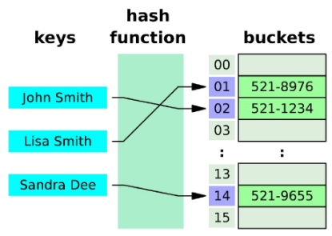
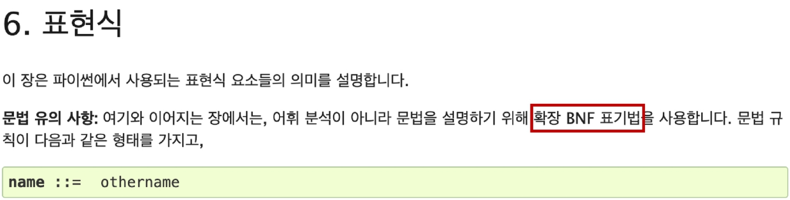
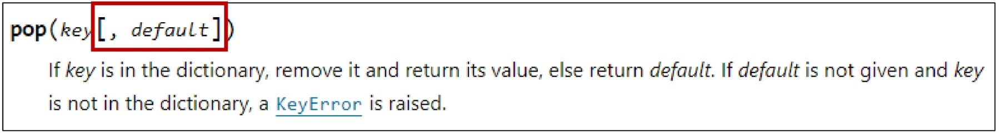

## Python 06 Data Structure (2025.01.31)

### 비시퀀스 데이터 구조

#### 1. 딕셔너리 (dictionary)

- 딕셔너리의 정의
    - 고유한 항목들의 정렬되지 않은 컬렉션
- 딕셔너리의 특징
    1. 키 - 값으로 쌍을 이룸
    2. 순서가 없음
        1. 삽입 순서 유지는 보장되는 구조
            1. 출력할 때, 동일한 출력값 유지
            2. 리스트로 형변환에 유리
    3. 키는 고유해야 함
        1. 키는 불변(Immutable)하는 타입만 가능
            1. 예: 문자열 등
    4. 값은 모두 허용
    5. 가변형 (Mutable)
        - 키와 값을 추가, 수정, 삭제할 수 있음
    
    ```python
    # 딕셔너리 생성
    my_dict = {}
    my_dict2 = dict()                       # 빈 딕셔너리를 반환 return {}
    my_dict3 = {'name': 'Alice', 'age': 25} # 초기화 (초기값을 준 상태로)
    
    # .clear()
    # 딕셔너리의 모든 키/값 쌍을 제거
    my_dict3 = {'name': 'Alice', 'age': 25} # 초기화 (초기값을 준 상태로)
    my_dict3.clear()
    print(my_dict3)                         # {}
    
    # .get(key[, default])
    # 키 연결된 값을 반환하거나 키가 없으면 None 혹은 기본 값을 반환
    
    # .keys()
    # 딕셔너리 키를 모은 객체를 반환
    # .values()
    # 딕셔너리 값을 모은 객체를 반환
    # .items()
    # 딕셔너리 키/값 쌍을 모은 객체를 반환
    person = {'name': 'Alice', 'age': 25, 'gender': 'Female'}
    print(person.keys())         # dict_keys(['name', 'age', 'gender'])
    print(person.items())        # dict_items([('name', 'Alice'), ('age', 25), ('gender', 'Female')])
    print(person.values())       # dict_values(['Alice', 25, 'Female'])
    print(type(person.keys()))   # <class 'dict_keys'>
    print(type(person.items()))  # <class 'dict_items'>
    print(type(person.values())) # <class 'dict_values'>
    """
    dict_keys, dict_items, dict_values는 리스트처럼 보이지만, 인덱스 접근이 불가능함
    왜냐하면 딕셔너리는 삽입 순서 유지가 보장되는 구조이지만, 순서가 없기 때문
    필요 시, list() 형변환해서 사용 가능
    """
    # keys(), values(), items()의 공통점
    """
    딕셔너리에 있는 특별한 view 객체
    원본 객체의 실시간 상태를 반영해서 보여줌
    """
    
    # .pop(key[, default])
    # 키를 제거하고 연결됐던 값을 반환 (없으면 에러나 default를 반환)
    person = {'name': 'Alice', 'age': 25, 'gender': 'Female'}
    print(person.pop('name'))        # Alice
    print(person.pop('name2'))       # KeyError
    print(person.pop('name2', None)) # None
    
    # .setdefault(key[, default])
    # 키와 연결된 값을 반환
    # 키가 없다면 default와 연결한 키를 딕셔너리에 추가하고 default를 반환
    student = {'name': 'isaac'}
    print(student.setdefault('age', 20))     # 20
    print(student)                           # {'name': 'isaac', 'age': 20}
    print(student.setdefault('name', 'kim')) # isaac
    
    # .update([other])
    # other가 제공하는 키/값 쌍으로 딕셔너리를 갱신
    # 기존 키를 덮어씀
    person = {'name': 'Alice', 'age': 25}
    other_person = {'name': 'Jane', 'country': 'KOREA'}
    person.update(other_person)
    print(person) # {'name': 'Jane', 'age': 25, 'country': 'KOREA'}
    person.update(age=100, address='SEOUL')
    print(person) # {'name': 'Jane', 'age': 100, 'country': 'KOREA', 'address': 'SEOUL'}
    ```
    

- 다양한 딕셔너리 메서드
    - https://docs.python.org/3/library/stdtypes.html#dict

---

### 세트

#### 1. set (세트)

- 세트의 정의
    - 고유한 항목들의 정렬되지 않은 컬렉션
- 세트의 특징
    1. 중복 없음
    2. 순서 없음
    3. 해시가 가능한 객체만 담음
    4. 가변형 (Mutable)
    
    ```python
    # 세트 생성
    my_set = {'a', 'b', 'c', 1, 2, 3}
    my_set1 = set()
    my_set2 = set(1, 2, 3, 4)
    
    # .add(x)
    # 세트에 x를 추가
    # .clear()
    # 세트의 모든 항목을 제거
    my_set = {'a', 'b', 'c', 1, 2, 3}
    my_set.add('d')
    print(my_set) # {1, 2, 3, 'c', 'b', 'd', 'a'} (실행마다 순서 달라짐)
    my_set.clear()
    print(my_set) # set()
    
    # .remove(x)
    # 세트에서 항목 x를 제거
    # 항목 x가 세트 내에 존재하지 않으면 에러 발생
    my_set = {'a', 'b', 'c', 'd', 1, 2, 3}
    my_set.remove('d')
    print(my_set)      # {1, 2, 3, 'c', 'a', 'b'} (실행마다 순서 달라짐)
    my_set.remove('x') # KeyError
    
    # .pop()
    # 세트에서 임의의 요소를 제거하고 반환
    my_set = {'a', 'b', 'c', 'd', 1, 2, 3}
    el = my_set.pop()
    print(el)     # 1 (실행마다 달라짐)
    print(my_set) # {2, 3, 'b', 'd', 'a', 'c'} (실행마다 순서 달라짐)
    
    # .discard()
    # 세트 s에서 항목 x를 제거
    # remove와 달리 에러 없음
    my_set = {'a', 'b', 'c', 'd', 1, 2, 3}
    my_set.discard(2)
    print(my_set)      # {1, 3, 'b', 'd', 'c', 'a'} (실행마다 순서 달라짐)
    my_set.discard(10) # 에러가 발생하지 않음
    
    # .update(iterable)
    # 세트에 다른 iterable 요소를 추가
    
    # 세트의 집합 메서드
    # set1.difference(set2)
    # 연산자
    """
    set1 - set2
    """
    
    # set1.difference(set2)
    """
    set1에는 들어있지만 set2에는 없는 항목으로 세트를 생성 후 반환
    """
    # 연산자
    """
    set1 - set2
    """
    
    # set1.intersection(set2)
    """
    set1과 set2 모두 들어있는 항목으로 세트를 생성 후 반환
    """
    # 연산자
    """
    set1 & set2
    """
    
    # set1.issubset(set2)
    """
    set1의 항목이 모두 set2에 들어있으면 True를 반환
    """
    # 연산자
    """
    set1 <= set2
    """
    
    # set1.issuperset(set2)
    """
    set1가 set2의 항목을 모두 포함하면 True를 반환
    """
    # 연산자
    """
    set1 >= set2
    """
    
    # set1.union(set2)
    """
    set1 또는 set2에(혹은 둘 다) 들어있는 항목으로 세트를 생성 후 반환
    """
    # 연산자
    """
    set1 | set2
    """
    
    set1 = {0, 1, 2, 3, 4}
    set2 = {1, 3, 5, 7, 9}
    set3 = {0, 1}
    
    print(set1.difference(set2))   # {0, 2, 4}
    print(set1.intersection(set2)) # {1, 3}
    print(set1.issubset(set2))     # False
    print(set3.issubset(set1))     # True
    print(set1.issuperset(set2))   # False
    print(set1.union(set2))        # {0, 1, 2, 3, 4, 5, 7, 9}
    ```
    

---

### 참고

#### 1. 해시 테이블 (Hash Table)

- 해시 함수를 사용하여 변환한 값을 인덱스로 삼아, 키(key)와 데이터(value)를 저장하는 자료구조
- 데이터를 빠르게 저장하고 검색하기 위해 사용

#### 2. 해시 테이블(Hash Table) 원리

- 키를 해시 함수를 통해 해시 값으로 변환
- 변환된 해시 값을 인덱스로 삼아 데이터를 저장하거나 찾음
    - 삽입 순서 보장해줌
- 이로 인해 검색, 삽입, 삭제가 매우 빠르게 수행



#### 3. 해시 (Hash)

- 임의의 크기를 가진 데이터를 고정된 크기의 고유한 값으로 변환하는 것
- 생성된 해시 값(고유한 정수)은 해당 데이터를 식별하는 ‘지문’ 역할을 함
- 파이썬에서는 이 해시 값을 이용해 해시 테이블에 데이터를 저장

#### 4. 해시 함수 (Hast Function)

- 임의 길이 데이터를 입력 받아 고정 길이(정수)로 변환해 주는 함수
- 주로 해시 테이블을 구현할 때, 매우 빠른 검색을 위해 활용
- ‘해시 알고리즘’이라고도 부름

#### 5. set의 요소 & dictionary의 키와 해시 테이블 관계

- set
    - 각 요소를 해시 함수로 변환해 나온 해시 값에 맞춰 해시 테이블 내부 버킷(bucket)에 위치시킴
    - 그래서 “순서”라기보다 “버킷 위치(인덱스)”가 요소의 위치를 결정
    - 따라서 set는 순서를 보장하지 않음
- dict
    - 키(key) → 해시 함수 → 해시 값 → 해시 테이블에 저장
    - 단 set와 달리 “삽입 순서”는 유지한다는 것이 언어 사양으로 보장 됨 (Python 3.7 이상)
        - 즉, 키를 추가한 순서대로 반복문 순회할 때 나오게 됨
        - 사용자에게 보여지는 키 순서는 삽입 순서가 유지되도록 설계된

#### 6. set의 pop 메서드 예시

- 정수(숫자) 값은 해시 값이 숫자 자기 자신과 동일하거나 단순 계산으로 고정됨
- 문자열은 해시 계산 시 파이썬의 해시 난수화(Hash Randomization)가 적용되므로, 실행마다 순서가 달라질 수 있음

#### 7. 파이썬에서의 해시 함수

- 정수
    - 같은 정수는 항상 같은 해시 값을 가짐
    - 예
        - hash(1)은 여러 번 호출해도 결과가 동일
- 문자열
    - 문자열 해시 시, 파이썬 인터프리터 시작 때 설정되는 난수 시드(seed)가 달라질 수 있음
    - 보안상 이유로 해시 난수화 도입
    - 각 실행마다 달라질 수 있어 ‘a’의 해시 값도 매번 바뀔 수 있음

#### 8. 해시 난수화와 난수 시드

- 파이썬 프로세스가 새로 시작될 때마다 해시를 계산할 때 사용하는 난수 시드가 달라짐
    - 해시 함수가 매번 바뀌는 것이 아니라, 해시 계산에 쓰이는 시드 값이 실행마다 달라지는 것
- 이로 인해 동일한 데이터라도 매번 해시 값이 달라져 결과적으로 버킷 배치가 달라짐

#### 9. set의 pop 메서드 결과와 해시 테이블의 관계

- set의 pop()은 “임의의 요소”를 제거하고 반환함
    - 실행할 때마다 다른 요소를 얻는다는 의미에서의 “무작위”가 아니라 “임의”라는 의미에서의 “무작위” (By “arbitrary” the docs mean “random”)
- 내부적으로 해시 테이블(버킷)을 참조하기 때문에, 실행 때마다 다른 요소가 먼저 나올 수 있음
- 해시 난수화로 인해 문자열 같은 해시 값이 실행마다 달라질 수 있고, 따라서 set 내부 요소의 배치가 달라질 수 있음
- 정수는 해시 값이 항상 동일하기 때문에, 파이썬을 동일 프로세스에서 연속 실행할 때는 결과가 어느 정도 일정해 보이기도 하지만, 여전히 set은 순서가 없으므로 pop되는 순서는 예측 불가능

---

### 해시 테이블

#### 1. hashable

- hash() 함수에 넣어 해시 값을 구할 수 있는 객체를 의미
- 대부분의 불변 타입(int, float, str, 불변만 담은 tuple)은 해시 가능
- 가변형 객체(list, dict, set)는 기본적으로 해시 불가능
    - 값이 변하면 해시 값도 달라질 수 있어 해시 테이블 무결성이 깨짐

#### 2. hashable과 불변성 간의 관계

- 해시 테이블(set, dict의 키)에는 해시가 가능한 객체만 저장 가능
- 불변 객체는 생성 후 값 변경이 불가능하므로, 항상 같은 해시 값을 유지
    - 해시 테이블이 안정적으로 동작
- 다만, “hash 가능하다 ≠ 불변이다”가 절대적이지는 않지만, 일반적으로 내장 자료형 기준에서는 불변이어야 해시 가능

#### 3. 가변형 객체가 hashable하지 않은 이유

- 값이 변경될 수 있으므로, 같은 객체라도 값이 바뀌면 해시 값도 달라질 수 있음
- 해시 테이블에서는 “동일 키 → 동일 위치”로 가정하고 빠른 검색을 수행하는데, 이 가정이 깨짐
- list, set, dict 자체를 dict의 키나 set으로 쓸 수 없음

#### 4. hashable 객체가 필요한 이유

1. 해시 테이블 기반 자료 구조 사용
    1. set의 요소, dict의 키
    2. 중복 방지 & 빠른 검색, 조회
2. 불변성을 통한 일관된 해시 값
    1. 한 번 해시 값이 정해지면 바뀌지 않아야 해시 테이블 무결성이 유지
3. 안전성과 예측 가능성 유지
    1. 동일한 데이터는 항상 동일한 해시 값을 반환 → 로직을 단순화

#### 5. 정리

- 해시 테이블은 해시 값을 인덱스로 삼아 데이터를 저장, 검색
- 파이썬의 set은 순서가 없고, pop() 시 어떤 요소가 반환될지 정해져 있지 않음
- dict은 파이썬 3.7+ 버전에서 삽입 순서가 보장되지만, 내부 구현은 여전히 해시 테이블
- 해시 함수는 정수/문자열 등 타입에 따라 다르게 동작하며, 문자열 해시 시 난수화로 실행마다 달라질 수 있음
- hashable(해시 가능) 객체만 set과 dict의 키로 사용 가능하며, 일반적으로 불변 타입이 이에 해당

---

### 파이썬 문법 규격

#### 1. 파이썬 공식문서 예시

- 참고 자료
    - https://docs.python.org/3.9/reference/expressions.html



#### 2. BNF (Backus-Naur Form)

- 프로그래밍 언어의 문법을 표현하기 위한 표기법

#### 3. EBNF (Extended Backus-Naur Form)

- BNF를 확장한 표기법
- 메타 기호를 추가하여 더 간결하고 표현력이 강해진 형태

#### 4. 대표적인 EBNF 메타기호

```python
[] # 선택적 요소
{} # 0번 이상 반복
() # 그룹화
```

#### 5. EBNF 메타기호 [] 사용 예시

- 딕셔너리의 pop 메서드
- 참고 자료
    - https://docs.python.org/3/library/stdtypes.html#dict.pop
    
    
    

#### 6. BNF와 같은 표기법을 사용하는 이유

- 서로 다른 프로그래밍 언어, 데이터 형식, 프로토콜 등의 문법을 통일하여 정의하기 위함
