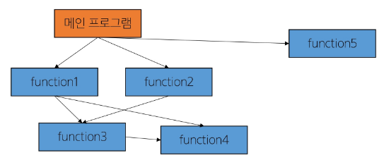
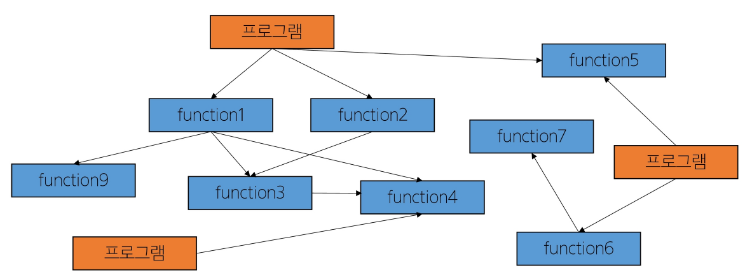
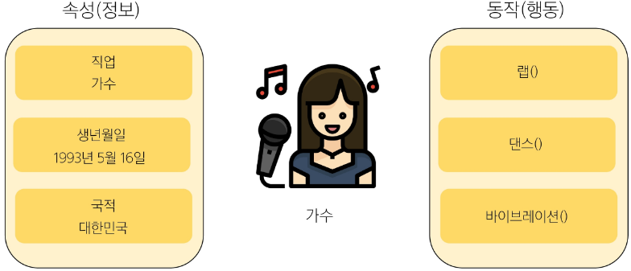
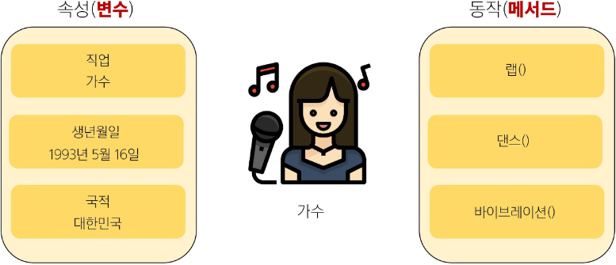
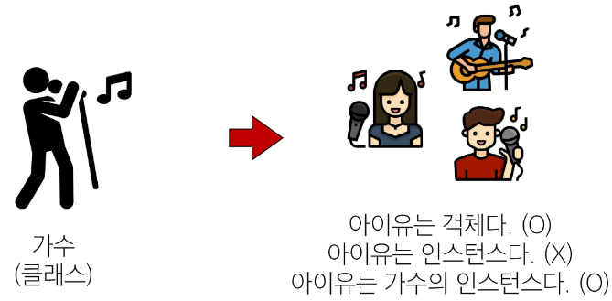
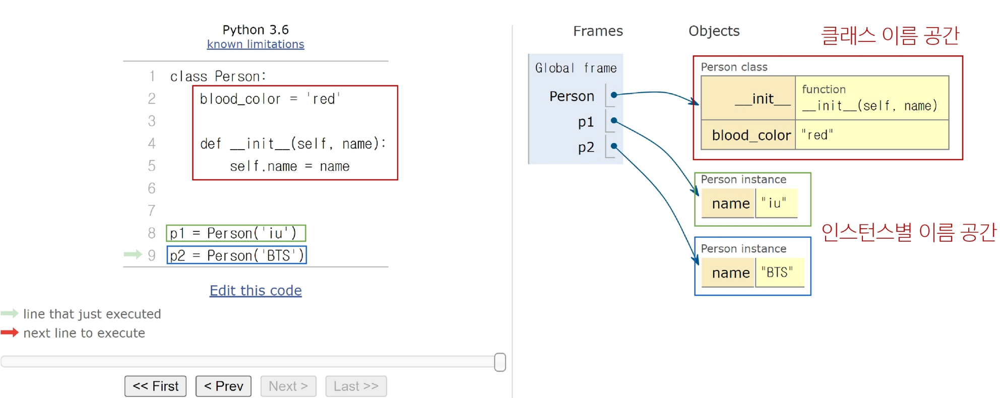
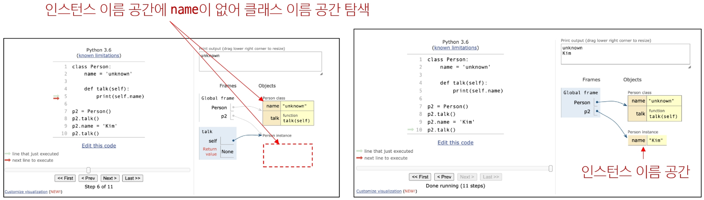

## Python 07 OOP 1 (2025.02.03)

### 절차 지향 프로그래밍

#### 1. 절차 지향 프로그래밍 (Procedural Programming)

- 프로그램을 함수와 로직(절차) 중심으로 작성
- 데이터를 함수에 전달하며 순차적으로 처리

#### 2. 절차 지향 사고 예시

- 변수와 함수를 별개로 다룸

```python
# 절차 지향 사고
# 예: 변수와 함수를 별개로 다룸
name = 'Alice'
age = 25

def introduce(name, age):
    print(f'안녕하세요, {name}입니다. 나이는 {age}살입니다.')

introduce(name, age)
```

#### 3. 절차 지향 프로그래밍 특징

- 입력을 받고, 처리하고, 결과를 내는 과정이 위에서 아래로 순차적을 흐르는 형태
- 순차적인 명령어 실행
- 데이터와 함수(절차)의 분리
- 함수 호출의 흐름이 중요
- 요리 레시피를 차례대로 따라가는 것과 비슷, 레시피 순서를 하나씩 밟아 나가는 형식
- 데이터의 재사용보다는 처음부터 끝까지 실행되는 결과물이 중요



#### 4. 절차 지향적 프로그래밍의 한계

1. 복잡성 증가
    1. 프로그램 규모가 커질수록 데이터와 함수의 관리가 어려움
    2. 전역 변수의 증가로 인한 관리의 어려움
2. 유지보수 문제
    1. 코드 수정 시 영향 범위 파악이 어려움



---

### 객체 지향 프로그래밍

#### 1. 객체 지향 프로그래밍 (Object Oriented Programming)

- 데이터와 함수를 하나의 단위(객체)로 묶어서 관리
- 객체들을 조합하고 재활용하는 방식으로 프로그램 구성

#### 2. 객체 지향 사고 예시

- 사람(객체) 안에 name, age와 이와 관련되 기능(메서드) 포함

```python
# 객체 지향 사고
# 예: 사람(객체) 안에 name, age와 이와 관련된 기능(메서드) 포함
class Person:
    def __init__(self, name, age):
        self.name = name
        self.age = age

    def introduce(self):
        print(f'안녕하세요, {self.name}입니다. 나이는 {self.age}살입니다.')

alice = Person('Alice', 25)
alice.introduce() # 객체가 자신의 정보를 출력
```

#### 3. 객체 지향 프로그래밍 특징

- 프로그램을 데이터(변수)와 그 데이터를 처리하는 함수(메서드)를 하나의 단위(객체)로 묶어서 조직적으로 관리
- 데이터와 메서드의 결합
- 주방 도구(프라이팬, 칼), 재료(야채, 고기), 행동(볶기, 썰기)를 각각 별개로 생각하지 않고, “볶음밥 기계”라는 객체로 만들어 놓고 그 기계가 알아서 해당 행동과 재료를 관리하는 방식

#### 4. 절차 지향 & 객체 지향

- 절차 지향
    - 데이터와 해당 데이터를 처리하는 함수(절차)가 분리
    - 함수 호출의 흐름이 중요
    - “어떤 순서로 처리할까?”
- 객체 지향
    - 데이터와 해당 데이터를 처리하는 메서드(함수)를 하나의 객체(클래스)로 묶음
    - 객체 간 상호작용과 메시지 전달이 중요
    - “어떤 객체가 이 문제를 해결할까?”
    - “이 객체는 어떤 속성과 기능을 가질까?”

#### 5. 객체 지향 - “데이터가 살아나다”

- 객체 지향은 수동적인 데이터가 능동적인 객체로 변화한 것
- 절차 지향에서는 데이터가 함수의 매개변수로 전달되어 처리되는 수동적 존재였지만, 객체 지향에서는 데이터와 해당 데이터를 처리하는 메서드가 하나의 객체로 통합되어 스스로 기능을 수행하는 능동적 존재가 됨
- 이는 코드의 구조화와 재사용성을 높이는 동시에, 실제 세계의 모델링 방식과 더 유사한 프로그래밍을 가능하게 함
- 절차 지향과 객체 지향은 대조되는 개념이 아니다
    - 객체 지향은 기존 절차 지향을 기반으로 두고 보완하기 위해 객체라는 개념을 도입해 상속, 코드 재사용성, 유지보수성 등의 이점을 가지는 패러다임

---

### 객체와 클래스

#### 1. 객체 (Object)

- 실제 존재하는 사물을 추상화한 것
- “속성”과 “동작”을 가짐
- 예를 들어, “강아지”라는 객체는 이름, 종, 나이(특징)와 짖기, 뛰기(행동) 등으로 표현할 수 있음

#### 2. 클래스 (Class)

- 객체를 만들기 위한 설계도
- 데이터와 기능을 함께 묶는 방법을 제공
- 파이썬에서 타입을 표현하는 방법
- 클래스로부터 여러 개의 객체를 쉽게 찍어낼 수 있음

#### 3. 객체 예시




#### 4. 객체와 클래스



#### 5. 객체 특징

- 속성 (Attribute)
    - 객체의 상태/데이터
- 메서드 (Method)
    - 객체의 행동/기능
- 고유성
    - 각 객체는 고유한 특성을 가짐

---

### 클래스 기초

#### 1. 클래스 (Class)

- 데이터와 기능을 하나의 틀로 묶어 관리하는 방법
- 사용자 정의 객체를 만드는 수단이자 속성과 메서드를 정의

#### 2. 클래스 정의

- class 키워드
- 클래스 이름은 파스칼 케이스(Pascal Case) 방식으로 작성

```python
class MyClass:
    pass
```

#### 3. 클래스 예시

- __init__ 메서드는 ‘생성자 메서드’로 불리며, 새로운 객체를 만들 때 필요한 초기값을 설정 (메서드 챕터에서 진행)

```python
class Person:
    def __init__(self, name, age):
        self.name = name # 인스턴스 속성
        self.age = age   # 인스턴스 속성

    def introduce(self):
        print(f'안녕하세요. 저는 {self.name}, 나이는 {self.age}살입니다.')
```

---

### 인스턴스

#### 1. 인스턴스 (Instance)

- 클래스를 통해 생성된 객체

#### 2. 인스턴스 예시

- 클래스가 설계도라면, 인스턴스는 그 설계도로부터 실제로 만든 ‘개별 물건’
- Person(”Alice”, 25)라고 하면 Person이라는 설계도로부터 이름이 Alice이고 나이가 25인 ‘사람 객체’가 탄생

```python
class Person:
    def __init__(self, name, age):
        self.name = name # 인스턴스 속성
        self.age = age   # 인스턴스 속성

    def introduce(self):
        print(f'안녕하세요. 저는 {self.name}, 나이는 {self.age}살입니다.')

# 인스턴스 생성
p1 = Person("Alice", 25)
p1.introduce() # "안녕하세요. 저는 Alice, 나이는 25살입니다."

# 인스턴스 메서드 호출
p2 = Person("Bella", 30)
p2.introduce() # "안녕하세요. 저는 Bella, 나이는 30살입니다."
```

---

### 클래스와 인스턴스

#### 1. 클래스와 인스턴스

- 클래스(가수)와 인스턴스(아이유) → 타입
    - 클래스를 만든다는 말은 타입을 만든다는 말
        
        
        

- 변수 name의 타입은 str 클래스
    - 변수 name은 str 클래스의 인스턴스
    - 파이썬의 데이터 타입은 모두 클래스
    
    ```python
    name = "Alice"
    print(type(name)) # <class 'str'>
    ```
    

- 하나의 객체(Object)는 특정 클래스의 인스턴스(Instance)
    - 예
        - 123, 900, 5는 클래스 int의 인스턴스
        - ‘hello’, ‘bye’는 클래스 str의 인스턴스
        - [232, 89, 1], []은 클래스 list의 인스턴스

---

### 클래스 구성요소

#### 1. 클래스 구조

- 생성자 메서드
    - 인스턴스 생성 시 자동 호출되는 특별한 메서드
    - __init__이라는 이름의 메서드로 정의
    - 인스턴스 변수의 초기화 담당
- 인스턴스 변수 (속성)
    - 각 인스턴스별 고유한 속성
    - self.변수명 형태로 정의
    - 인스턴스마다 독립적인 값 유지
- 클래스 변수 (속성)
    - 모든 인스턴스가 공유하는 속성
    - 클래스 내부에서 직접 정의
    
    ```python
    class Circle:
        pir = 3.14
    
        def __init__(self, radius):
            self.radius = radius
    
    # 인스턴스 생성
    c1 = Circle(1)
    c2 = Circle(2)
    
    # 인스턴스 변수 (속성)
    print(c1.radius) # 1
    print(c2.radius) # 2
    
    # 클래스 변수 (속성)
    print(c1.pi) # 3.14
    print(c2.pi) # 3.14
    ```
    

#### 2. 클래스 변수와 인스턴스 변수

- 클래스 변수와 동일한 이름으로 인스턴스 변수 생성 시
- 클래스 변수가 아닌 인스턴스 변수를 먼저 참조하게 됨
- class.class_variable로 클래스 변수 참조 가능

```python
class Circle:
    pi = 3.14

    def __init__(self, radius):
        self.radius = radius

c1 = Circle(5)
c2 = Circle(10)
print(c1.radius) # 5
print(c2.radius) # 10

# c1의 인스턴스 변수 pi를 생성
c1.pi = 100
print(c1.pi)     # 100
print(Circle.pi) # 3.14

# c2는 인스턴스 변수 pi가 없으므로 클래스 변수 pi를 참조
print(c2.pi) # 3.14
```

---

### 메서드

#### 1. 메서드 (Method)

- 클래스 내부에 정의된 함수로, 해당 객체가 어떻게 동작할지를 정의

#### 2. 메서드 종류

1. 인스턴스 메서드
2. 클래스 메서드
3. 스태틱 메서드



#### 3. 인스턴스 메서드 (Instance Method)

- 클래스로부터  생성된 각 인스턴스에서 호출할 수 있는 메서드
- 인스턴스의 상태를 조작하거나 동작을 수행

#### 4. 인스턴스 메서드 구조

- 클래스 내부에 정의되는 메서드의 기본
- 반드시 첫 번째 인자로 인스턴스 자신(self)을 받음
- 인스턴스의 속성에 접근하거나 변경 가능

```python
# self는 매개변수 이름일 뿐이며 다른 이름으로 설정 가능
# 하지만 다른 이름을 사용하지 않을 것을 강력히 권장
class MyClass:
    def instance_method(self, arg1, ...):
        pass
```

#### 5. self 동작 원리

- str 클래스가 upper 메서드를 호출했고, 그 첫 번째 인자로 문자열 인스턴스가 들어간 것
- 인스턴스 메서드의 첫 번째 인자가 반드시 인스턴스 자기 자신인 이유

```python
# upper 메서드를 사용해 문자열 ‘hello’를 대문자로 변경
'hello'.upper()

# 실제 파이썬 내부 동작
str.upper('hello')

# 'hello'.upper()은 str.upper('hello')를 객체 지향 방식의 메서드로 호출하는 표현 (단축형 호출)
"""
'hello'라는 문자열 객체가 단순히 어딘가의 함수로 들어가는 인자로 활용되는 것이 아닌
객체 스스로 메서드를 호출하여 코드를 동작하는 객체 지향적인 표현인 것
"""
```

#### 6. 인스턴스 메서드 활용

```python
class Counter:
    def __init__(self):
        self.count = 0

    def increment(self):
        self.count += 1

c = Counter()
c.increment()
print(c.count) # 1
```

#### 7. 생성자 메서드 (Constructor Method)

- 인스턴스 객체가 생성될 때 자동으로 호출되는 메서드
- 인스턴스 변수들의 초기값을 설정

#### 8. 생성자 메서드 활용

```python
class Person:
    def __init__(self, name):
        # 왼쪽 name: 인스턴스 변수 name
        # 오른쪽 name: 생성자 메서드의 매개변수 이름
        self.name = name
        print("인스턴스가 생성되었습니다.")

    def greeting(self):
        print(f"안녕하세요 {self.name}입니다.")

person1 = Person("지민") # 인스턴스가 생성되었습니다.
person1.greeting()       # 안녕하세요. 지민입니다.
# Person.greeting(person1)
```

#### 9. 클래스 메서드 (Class Method)

- 클래스가 호출하는 메서드
- 클래스 변수를 조작하거나 클래스 레벨의 동작을 수행

#### 10. 클래스 메서드 구조

- @classmethod 데코레이터를 사용하여 정의
- 호출 시, 첫 번째 인자로 해당 메서드를 호출하는 클래스(cls)가 전달됨
- 클래스를 인자로 받아 클래스 속성을 변경하거나 읽는 데 사용
- cls는 매개변수 이름일 뿐이며 다른 이름으로 설정 가능 하지만 다른 이름을 사용하지 않을 것을 강력히 권장

```python
class MyClass:
    @classmethod
    def class_method(cls, arg1, ...):
        pass
```

#### 11. 클래스 메서드 활용

```python
class Person:
    population = 0
    
    def __init__(self, name):
        self.name = name
        Person.increase_population()
    
    @classmethod
    def increase_population(cls):
        cls.population += 1

person1 = Person("Alice")
person2 = Person("Bella")
print(Person.population) # 2
```

#### 12. 스태틱(정적) 메서드 (Static Method)

- 클래스, 인스턴스와 상관 없이 독립적으로 동작하는 메서드

#### 13. 스태틱 메서드 구조

- @staticmethod 데코레이터를 사용하여 정의
- 호출 시 자동으로 전달 받는 인자가 없음 (self, cls를 받지 않음)
- 인스턴스나 클래스 속성에 직접 접근하지 않는, ‘도우미 함수’와 비슷한 역할

```python
class MyClass:
    @staticmethod
    def static_method(arg1, ...):
        pass
```

#### 14. 스태틱 메서드 예시

- 수학에 관련 기능을 담은 MathUtils 클래스에서 덧셈 기능을 제공하는 예시

```python
class MathUtils:
    @staticmethod
    def add(a, b):
        return a + b
    
print(MathUtils.add(3, 5)) # 8
```

---

### 메서드 활용

#### 1. 입출금이 가능한 은행 계좌 클래스 만들기

```python
class BankAccount:
    interest_rate = 0.02 # 이자율

    def __init__(self, owner, balance=0):
        self.owner = owner     # 계좌 소유자
        self.balance = balance # 초기 잔액
        
    # 입금
    def deposit(self, amount):
        self.balance += amount

    # 출금
    def withdraw(self, amount):
        if self.balance >= amount:
            self.balance -= amount
        else:
            print("잔액 부족!")
    
    # 이자율 설정
    @classmethod
    def set_interest_rate(cls, rate):
        cls.interest_rate = rate

    # 금액이 양수인지 검증
    @staticmethod
    def is_positive(amount):
        return amount > 0
```

#### 2. 입출금이 가능한 은행 계좌 클래스 활용

```python
# 계좌 개설 (인스턴스 생성)
alice_acc = BankAccount("Alice", 1000)

# 입금 및 출금 (인스턴스 메서드 호출)
alice_acc.deposit(500)
alice_acc.withdraw(200)

# 잔액 확인 (인스턴스 변수 참조)
print(alice_acc.balance) # 1300

# 이자율 변경 (클래스 메서드 호출)
BankAccount.set_interest_rate(0.03)
print(BankAccount.interest_rate) # 0.03

# 잔액이 양수인지 확인 (정적 메서드 호출)
print(BankAccount.is_positive(alice_acc.balance)) # True
```

---

### 메서드 정리

#### 1. 메서드 정리

- 인스턴스 메서드
    - 인스턴스의 상태를 변경하거나, 해당 인스턴스의 특정 동작을 수행
- 클래스 메서드
    - 인스턴스의 상태에 의존하지 않는 기능을 정의
    - 클래스 변수를 조작하거나 클래스 레벨의 동작을 수행
- 스태틱 메서드
    - 클래스 및 인스턴스와 관련이 없는 일반적인 기능을 수행

#### 2. 누가 어떤 메서드를 사용해야 할까?

- 클래스가 사용해야 할 것
    - 클래스 메서드
    - 스태틱 메서드
- 인스턴스가 사용해야 할 것
    - 인스턴스 메서드
- 예시 클래스로 클래스와 인스턴스가 각각 모든 메서드를 호출해보기

```python
class MyClass:
    def instance_method(self):
        return "instance method", self
    
    @classmethod
    def class_method(cls):
        return "class method", cls
    
    @staticmethod
    def static_method():
        return "static method"
```

#### 3. 클래스가 할 수 있는 것

- 클래스는 모든 메서드를 호출할 수 있음
- 하지만 클래스는 클래스 메서드와 스태틱 메서드만 사용하도록 한다

```python
isinstance = MyClass()

print(MyClass.instance_method(isinstance)) # ('instance method', <__main__.MyClass object at 0x000001AAA2153F10>)
print(MyClass.class_method())              # ('class method', <class '__main__.MyClass'>)
print(MyClass.static_method())             # static method
```

#### 4. 인스턴스가 할 수 있는 것

- 인스턴스는 모든 메서드를 호출할 수 있음
- 하지만 인스턴스는 인스턴스 메서드만 사용하도록 한다

```python
isinstance = MyClass()

print(isinstance.instance_method()) # ('instance method', <__main__.MyClass object at 0x000001F353F43F10>)
print(isinstance.class_method())    # ('class method', <class '__main__.MyClass'>)
print(isinstance.static_method())   # static method
```

#### 5. 할 수 있다 ≠ 써도 된다

- 각자의 메서드는 OOP 패러다임에 따라 명확한 목적에 따라 설계된 것이기 때문에 클래스와 인스턴스 각각 올바른 메서드만 사용한다

---

### 참고

#### 1. 클래스와 인스턴스 간 이름 공간

- 클래스를 정의하면, 클래스와 해당하는 이름 공간 생성
- 인스턴스를 만들면, 인스턴스 객체가 생성되고 독립적인 이름 공간 생성
- 인스턴스에서 특정 속성에 접근하면,  인스턴스 → 클래스 순으로 탐색



```python
class Person:
    name = "unknown"
    
    def talk(self):
        print(self.name)

p1 = Person()
p1.talk() # unknown
"""
p1은 인스턴스 변수가 정의되어 있지 않아
클래스 변수(unknown)가 출력됨
"""

# p2 인스턴스 변수 설정 전/후
p2 = Person()
p2.talk() # unknown
p2.name = "Kim"
p2.talk() # Kim
"""
p2는 인스턴스 변수가 정의되어
인스턴스 변수(Kim)가 출력됨
"""

print(Person.name) # unknown
print(p1.name)     # unknown
print(p2.name)     # Kim
"""
클래스 변수 name 값이 Kim으로 변경된 것이 아닌
p2 인스턴스의 인스턴스 변수 name이 Kim으로 저장됨됨
"""
```



#### 2. 독립적인 이름공간을 가지는 이점

- 각 인스턴스는 독립적인 메모리 공간을 가지며, 클래스와 다른 인스턴스 간에는 서로의 데이터나 상태에 직접적인 접근이 불가능
- 객체 지향 프로그래밍의 중요한 특성 중 하나로, 클래스와 인스턴스를 모듈화하고 각각의 객체가 독립적으로 동작하도록 보장
- 이를 통해 클래스와 인스턴스는 다른 객체들과의 상호작용에서 서로 충돌이나 영향을 주지 않으면서 독립적으로 동작할 수 있음
- 코드의 가독성, 유지보수성, 재사용성을 높이는데 도움을 줌

---

### 매직 메서드

#### 1. 매직 메서드 (Magic Method)

- Double underscore(’__’)가 있는 메서드는 특수한 동작을 위해 만들어진 메서드
- 인스턴스 메서드
- 특정 상황에 자동으로 호출됨
- 스페셜 메서드 혹은 매직 메서드라고 불림

```python
__str__(self)
__len__(self)
__lt__(self, other)
__le__(self, other)
__eq__(self, other)
__gt__(self, other)
__ge__(self, other)
__ne__(self, other)

# __str__(self) 예시
# 내장함수 print에 의해 호출되어 객체 출력을 문자열 표현으로 변경
class Circle:
    def __init__(self, radius):
        self.radius = radius

    def __str__(self):
        return f"원의 반지름: {self.radius}"
    
c1 = Circle(10)
c2 = Circle(1)

print(c1) # 원의 반지름: 10
print(c2) # 원의 반지름: 1
```

---

### 데코레이터

#### 1. 데코레이터 (Decorator)

- 다른 함수의 코드를 유지한 채로 수정하거나 확장하기 위해 사용되는 함수

```python
# 데코레이터 정의
def my_decorator(func):
    def wrapper():
        # 함수 실행 전에 수행할 작업
        print("함수 실행 전")
        # 원본 함수 호출
        result = func()
        # 함수 실행 후에 수행할 작업
        print("함수 실행 후")
        return result
    return wrapper

# 데코레이터 사용
@my_decorator
def my_function():
    print("원본 함수 실행")

my_function()
"""
함수 실행 전
원본 함수 실행
함수 실행 후
"""
```
