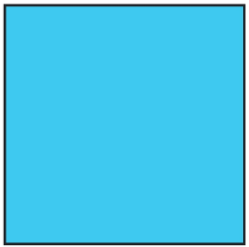

## Responsive (2025.02.27)

### Bootstrap

#### 1. Bootstrap

- CSS 프론트엔드 프레임워크 (Toolkit)
- 미리 만들어진 다양한 디자인 요소들을 제공하여 웹 사이트를 빠르고 쉽게 개발할 수 있도록 함

#### 2. CDN (Content Delivery Network)

- 지리적 제약 없이 빠르고 안전하게 콘텐츠를 전송할 수 있는 전송 기술
- 서버와 사용자 사이의 물리적인 거리를 줄여 콘텐츠 로딩에 소요되는 시간을 최소화
    - 웹 페이지 로드 속도를 높임
- 지리적으로 사용자와 가까운 CDN 서버에 컨텐츠를 저장해서 사용자에게 전달

#### 3. Bootstrap 기본 사용법


#### 4. Bootstrap에서 클래스 이름으로 Spacing을 표현하는 방법

- Bootstrap에는 특정한 규칙이 있는 클래스 이름으로 스타일 및 레이아웃이 미리 작성되어 있음
- 자세한 사항은 Bootstrap docs에서 확인해서 사용


---

### Reset CSS

#### 1. Reset CSS

- 모든 HTML 요소 스타일을 일관된 기준으로 재설정하는 간결하고 압축된 규칙 세트
- HTML Element, Table, List 등의 요소들에 일관성 있게 스타일을 적용하는 기본 단계

#### 2. Reset CSS 사용 배경

- 모든 브라우저는 각자의 ‘user agent stylesheet’를 가지고 있음
    - 웹 사이트를 보다 읽기 편하게 하기 위해
- 문제는 이 설정이 브라우저마다 상이하다는 것
- 모든 브러우저에서 웹 사이트를 동일하게 보이게 만들어야 하는 개발자에겐 매우 골치 아픈 일
- 모두 똑같은 스타일 상태로 만들고 스타일 개발을 위해 Reset CSS가 필요

#### 3. Normalize CSS

- Reset CSS 방법 중 대표적인 방법
- 웹 표준 기준으로 브라우저 중 하나가 불일치 한다면 차이가 있는 브라우저를 수정하는 방법
    - 경우에 따라 IE 또는 EDGE 브라우저는 표준에 따라 수정할 수 없는 경우도 있는데, 이 경우 IE 또는 EDGE의 스타일을 나머지 브라우저에 적용시킴

---

### Bootstrap 활용

#### 1. Typography

- 제목, 본문 텍스트, 목록 등

#### 2. Display Headings

- 기존 Heading보다 더 눈에 띄는 제목이 필요한 경우 (더 크고 약간 다른 스타일)

#### 3. Inline Text Elements

- HTML inline 요소에 대한 스타일

#### 4. Lists

- HTML list 요소에 대한 스타일

---

### Colors

#### 1. Bootstrap Color System

- Bootstrap이 지정하고 제공하는 색상 시스템

#### 2. Colors

- Text, Border, Background 및 다양한 요소에 사용하는 Bootstrap의 색상 키워드


#### 3. Text Colors

#### 4. Background Colors

#### 5. Bootstrap 실습

- 너비와 높이가 각각 200px인 정사각형 작성하기
- 너비와 높이를 제외한 스타일은 모두 bootstrap으로 작성




---

### Component

#### 1. Bootstrap Component

- Bootstrap에서 제공하는 UI 관련 요소
    - UI 관련 요소 종류
        - 버튼
        - 네비게이션 바
        - 카드
        - 폼
        - 드롭 다운 등

#### 2. 대표 Component

- Alerts
- Badges
- Buttons
- Cards
- Navbar

#### 3. Component 이점

- 일관된 디자인을 제공하여 웹 사이트의 구성 요소를 구축하는 데 유용하게 활용

---

### Semantic Web

#### 1. Semantic Web

- 웹 데이터를 의미론적으로 구조화된 형태로 표현하는 방식

```css
"이 요소가 시각적으로 어떻게 보여질까?" -> "이 요소가 가진 목적과 역할은 무엇일까?"
```

#### 2. Semantic Web in HTML

- HTML 요소가 의미를 가진다는 것
- 비교
    1. 단순히 제목처럼 보이게 큰 글자로 만드는 것
    
    
    
    1. “페이지 내 최상위 제목”이라는 의미를 제공하는 요소 h1
        1. 브라우저에 의해 스타일이 지정됨
    
    
    

#### 3. HTML Semantic Element

- 기본적인 모양과 기능 이외에 의미를 가지는 HTML 요소
- 검색 엔진 및 개발자가 웹 페이지 콘텐츠를 이해하기 쉽게 해줌

#### 4. 대표적인 Semantic Element

- header
- nav
- main
- article
- section
- aside
- footer

#### 5. Semantic Element 예시


```html
<!DOCTYPE html>
<html lang="ko">
<head>
    <meta charset="UTF-8">
    <meta name="viewport" content="width=device-width, initial-scale=1.0">
    <title>Semantic Element 예시</title>
</head>
<body class="d-flex flex-column">
    <header>
        <h1>Header</h1>
    </header>
    
    <nav>
        <ul>
            <li><a href="#">Home</a></li>
        </ul>
    </nav>
    <main>
        <article>
            <h2>Article Title</h2>
            <p>Article Content</p>
        </article>
        <aside>
            <h3>Aside</h3>
            <ol>
                <li><a href="#">Lorem, ipsum.</a></li>
            </ol>
        </aside>
    </main>
    <footer>
        <p>&copy; All rights reserved.</p>
    </footer>
</body>
</html>
```

#### 6. CSS 방법론

- CSS를 효율적이고 유지 보수가 용이하게 작성하기 위한 일련의 가이드

#### 7. OOCSS (Object Oriented CSS)

- 객체 지향적 접근법을 적용하여 CSS를 구성하는 방법론

#### 8. OOCSS 기본 원칙

1. 구조와 스킨을 분리
    1. 구조와 스킨을 분리함으로써 재사용 가능성을 높임
    2. 모든 버튼의 공통 구조를 정의 + 각각의 스킨(배경색과 폰트 색상)을 정의
    
    
    
2. 컨테이너와 콘텐츠를 분리
    1. 객체에 직접 적용하는 대신 객체를 둘러싸는 컨테이너에 스타일을 적용
    2. 스타일을 정의할 때 위치에 의존적인 스타일을 사용하지 않도록 함
    3. 콘텐츠를 다른 컨테이너로 이동시키거나 재배치할 때 스타일이 깨지는 것을 방지

#### 9. OOCSS 예시 1

- 변경 전
    - .header와 .footer 클래스가 폰트 크기와 색 둘 다 영향을 주고 있음
- 변경 후
    - .container, .title은 폰트 크기 담당 (콘텐츠 스타일)
    - .header, .footer는 폰트 색 담당 (컨테이너 스타일)
    
    
    

#### 10. OOCSS 예시 2


---

### 참고

#### 1. Bootstrap을 사용하는 이유

- 가장 많이 사용되는 CSS 프레임워크
- 사전에 디자인된 다양한 컴포넌트 및 기능
    - 빠른 개발과 유지보수
- 손쉬운 반응형 웹 디자인 구현
- 커스터마이징(Customizing)이 용이
- 크로스 브라우징(Cross Browsing) 지원
    - 모든 주요 브라우저에서 작동하도록 설계되어 있음

#### 2. 의미론적인 마크업이 필요한 이유

- “검색 엔진 최적화(SEO)”
    - 검색 엔진이 해당 웹 사이트를 분석하기 쉽게 만들어 검색 순위에 영향을 줌
- “웹 접근성(Web Accessibility)”
    - 웹 사이트, 도구, 기술이 고령자나 장애를 가진 사용자들이 사용할 수 있도록 설계 및 개발하는 것
    - 예
        - 스크린 리더를 통해 전맹 시각장애 사용자에게 웹의 글씨를 읽어줌
    - 참고 자료
        - https://nuli.navercorp.com/

#### 3. 책임과 역할

- HTML
    - 콘텐츠의 구조와 의미
- CSS
    - 레이아웃과 디자인
