## Web 01 HTML & CSS (2025.02.21)

### 웹

#### 1. 웹

- Web site, Web application 등을 통해 사용자들이 정보를 검색하고, 상호 작용하는 기술
- Web site
    - 인터넷에서 여러 개의 Web page가 모인 것으로, 사용자들에게 정보나 서비스를 제공하는 공간
- Web page
    - HTML, CSS 등의 웹 기술을 이용하여 만들어진 “Web site”를 구성하는 하나의 요소
- World Wide Web
    - 인터넷으로 연결된 컴퓨터들이 정보를 공유하는 거대한 정보 공간

#### 2. Web page 구성 요소

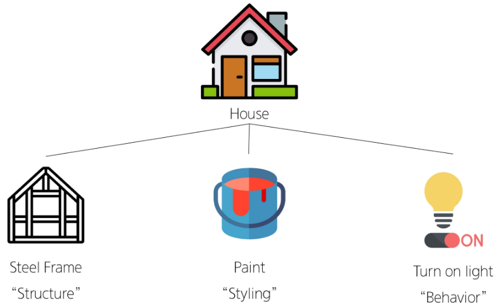

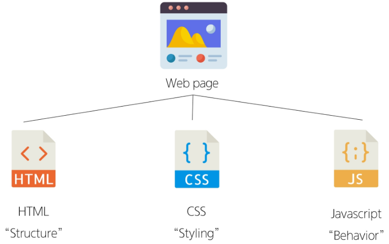

---

### 웹 구조화

#### 1. HTML (HyperText Markup Language)

- 웹 페이지의 의미와 구조를 정의하는 언어

#### 2. Hypertext

- 웹 페이지를 다른 페이지로 연결하는 링크
- 참조를 통해 사용자가 한 문서에서 다른 문서로 즉시 접근할 수 있는 텍스트

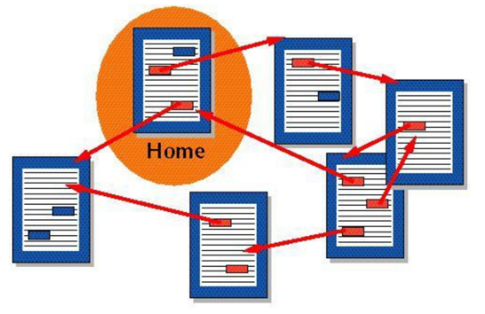

#### 3. Hypertext 특징

- 비선형성
- 상호연결성
- 사용자 주도적 탐색

#### 4. Markup Language

- 태그 등을 이용하여 문서나 데이터의 구조를 명시하는 언어
- 예
    - HTML
    - Markdown

#### 5. Markup Language 예시

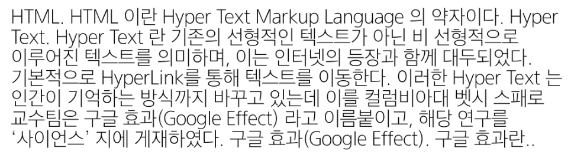

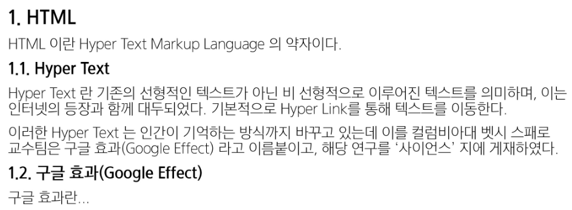

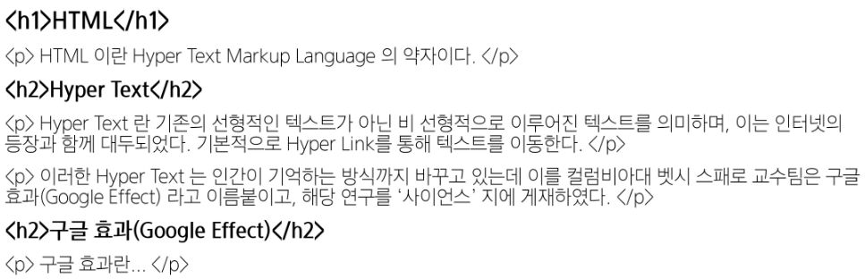

```html
<h1>HTML</h1>
<p>HTML이란 Hyper Text Markup Language 의 약자이다.</p>
<h2>Hyper Text</h2>
<p>Hyper Text 란 기존의 선형적인 텍스트가 아닌 비 선형적으로 이루어진 텍스트를
의미하며, 이는 인터넷의 등장과 함께 대두되었다. 기본적으로 Hyper Link를 통해
텍스트를 이동한다.</p>
<p>이러한 Hyper Text 는 인간이 기억하는 방식까지 바꾸고 있는데 이를
컬럼비아대 벳시 스패로 교수팀은 구글 효과(Google Effect) 라고 이름 붙이고, 해당
연구를 '사이언스' 지에 게재하였다.</p>
<h2>구글 효과(Google Effect)</h2>
<p>구글 효과란...</p>
```

---

### Structure of HTML

#### 1. HTML 구조

```html
<!-- 해당 문서가 html로 문서라는 것을 나타냄 -->
<!DOCTYPE html>
<!-- 전체 페이지의 콘텐츠를 포함 -->
<html lang="en">
<!-- HTML 문서에 관련된 설명, 설정 등 컴퓨터가 식별하는 메타데이터를 작성 -->
<!-- 사용자에게 보이지 않음 -->
<head>
    <meta charset="UTF-8">
    <!-- 브라우저 탭 및 즐겨찾기 시 표시되는 제목으로 사용 -->
    <title>My page</title>
</head>
<!-- HTML 문서의 내용을 나타냄 -->
<!-- 페이지에 표시되는 모든 콘텐츠를 작성 -->
<!-- 한 문서에 하나의 body 요소만 존재 -->
<body>
    <p>This is my page</p>
</body>
</html>
```
    

#### 2. HTML Element (요소)

- 하나의 요소는 여는 태그와 닫는 태그 그리고 그 안의 내용으로 구성됨
- 닫는 태그는 태그 이름 앞에 슬래시가 포함됨
    - 닫는 태그가 없는 태그도 존재
    
    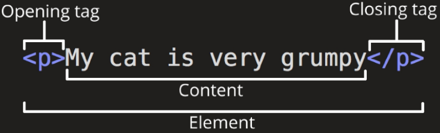
    

#### 3. HTML Attributes (속성)

- 사용자가 원하는 기준에 맞도록 요소를 설정하거나 다양한 방식으로 요소의 동작을 조절하기 위한 값
- 목적
    - 나타내고 싶지 않지만 추가적인 기능, 내용을 담고 싶을 때 사용
    - CSS에서 스타일 적용을 위해 해당 요소를 선택하기 위한 값으로 활용됨
    
    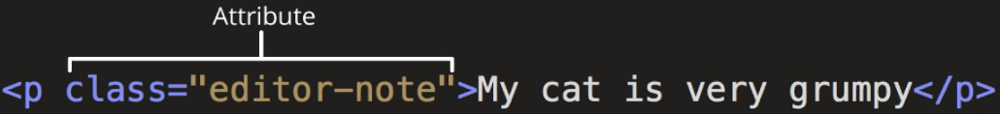
    

#### 4. HTML Attributes(속성) 작성 규칙

1. 속성은 요소 이름과 속성 사이에 공백이 있어야 함
2. 하나 이상의 속성들이 있는 경우엔 속성 사이에 공백으로 구분함
3. 속성 값은 열고 닫는 따옴표로 감싸야 함

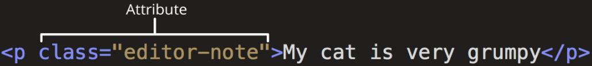

#### 5. HTML 구조 예시

```html
<!DOCTYPE html>
<html lang="en">
<head>
    <meta charset="UTF-8">
    <title>My page</title>
</head>
<body>
    <p>This is my page</p>
    <a href="https://www.google.co.kr">Google</a>
    
    
</body>
</html>
```

- 웹 페이지의 HTML 코드는 크롬 개발자 도구에서 확인 가능

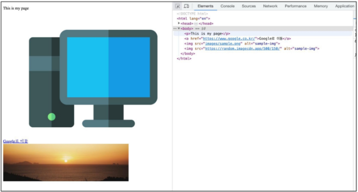

---

### Text Structure

#### 1. 웹 구조화

- HTML Text structure
    - HTML의 주요 목적 중 하나는 텍스트 구조와 의미를 제공하는 것
- 예를 들어 h1 요소는 단순히 텍스트를 크게만 만드는 것이 아닌, 현재 문서의 최상위 제목이라는 의미를 부여하는 것

```html
<h1>Heading</h1>
```

#### 2. 대표적인 HTML Text structure

```html
1. Heading & Paragraphs
 - h1
 - h2
 - h3
 - h4
 - h5
 - h6
 - P

2. List
 - ol
 - ul
 - li
 
3. Emphasis & Importance
 - em
 - strong
```

#### 3. HTML Text structure 예시

```html
<body>
    <h1>Main Heading</h1>
    <h2>Sub Heading</h2>
    <p>This is my page</p>
    <p>This is <em>emphasis</em></p>
    <p>Hi <strong>my name</strong> is Air</p>
    <ol>
        <li>파이썬</li>
        <li>알고리즘</li>
        <li>웹웹</li>
    </ol>
</body>
```

---

### 웹 스타일링

#### 1. CSS (Cascading Style Sheet)

- 웹 페이지의 디자인과 레이아웃을 구성하는 언어

#### 2. CSS 구문

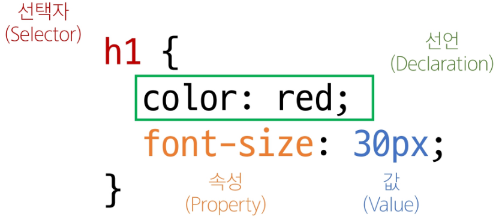

```css
h1{
    color: red;
    font-size: 30px;
}
```

#### 3. CSS 적용 방법

1. 인라인(Inline) 스타일
    1. HTML 요소 안에 style 속성 값으로 작성
    
    ```html
    <h1 style="color: blue; background-color: yellow;">Hello World!</h1>
    ```
    

1. 내부(Internal) 스타일 시트
    1. head 태그 안에 style 태그에 작성
    
    ```html
    <!DOCTYPE html>
    <html lang="en">
    <head>
        <meta charset="UTF-8">
        <meta name="viewport" content="width=device-width, initial-scale=1.0">
        <title>Document</title>
        <style>
            h1{
                color: blue;
                background-color: yellow;
            }
        </style>
    </head>
    <body>
        <h1>Hello World!</h1>
    </body>
    </html>
    ```
    

1. 외부(External) 스타일 시트
- 별도 CSS 파일 생성 후 HTML link 태그를 사용해 불러오기

```html
<!DOCTYPE html>
<html lang="en">
<head>
    <meta charset="UTF-8">
    <meta name="viewport" content="width=device-width, initial-scale=1.0">
    <link rel="stylesheet" href="style.css">
    <title>Document</title>
</head>
<body>
    <h1>Hello World!</h1>
</body>
</html>
```

```css
/* style.css */
h1{
    color: blue;
    background-color: yellow;
}
```

#### 4. CSS Selectors

- HTML 요소를 선택하여 스타일을 적용할 수 있도록 하는 선택자

#### 5. CSS Selectors 종류

- 기본 선택자
    - 전체(*) 선택자
        - HTML 모든 요소를 선택
    - 요소(tag) 선택자
        - 지정한 모든 태그를 선택
    - 클래스(class) 선택자 (’.’ (dot))
        - 주어진 클래스 속성을 가진 모든 요소를 선택
    - 아이디(id) 선택자 (’#’)
        - 주어진 아이디 속성을 가진 요소 선택
        - 문서에는 주어진 아이디를 가진 요소가 하나만 있어야 함
    - 속성(attr) 선택자 등

#### 6. CSS Selectors 예시

```html
<body>
    <h1 class="green">Heading</h1>
    <h2>선택자 연습</h2>
    <h3>Hello</h3>
    <h4>Nice to meet you</h4>
    <p id="purple">과목 목록</p>
    <ul class="green">
        <li>파이썬</li>
        <li>알고리즘</li>
        <li>웹
            <ol>
                <li>HTML</li>
                <li>CSS</li>
                <li>PYTHON</li>
            </ol>
        </li>
    </ul>
    <p 
    class="green">Lorem, <span>ipsum</span> dolor</p>
</body>
```

```css
<style>
    /* 전체 선택자 */
    *{
        color: red;
    }
    
    /* 타입 선택자 */
    h2{
        color: orange;
    }
    h3,
    h4{
        color: blue;
    }
    
    /* 클래스 선택자 */
    .green{
        color: green;
    }

    /* id 선택자 */
    #purple{
        color: purple;
    }
</style>
```

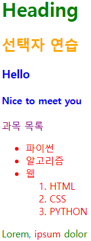

#### 7. CSS 결합자(Combinators) 종류

- 자손 결합자 (” “ (space))
    - 첫 번째 요소의 자손 요소들 선택
    - 예
        - p span은 <p> 안에 있는 모든 <span>를 선택 (하위 레벨 상관 없이)
- 자식 결합자 (”>”)
    - 첫 번째 요소의 직계 자식만 선택
    - 예
        - ul > li은 <ul> 안에 있는 모든 <li>를 선택 (한단계 아래 자식들만)

#### 8. CSS 결합자 예시

```html
<body>
    <h1 class="green">Heading</h1>
    <h2>선택자 연습</h2>
    <h3>Hello</h3>
    <h4>Nice to meet you</h4>
    <p id="purple">과목 목록</p>
    <ul class="green">
        <li>파이썬</li>
        <li>알고리즘</li>
        <li>웹
            <ol>
                <li>HTML</li>
                <li>CSS</li>
                <li>PYTHON</li>
            </ol>
        </li>
    </ul>
    <p class="green">Lorem, <span>ipsum</span> dolor</p>
</body>
```

```css
<style>
    /* 전체 선택자 */
    *{
        color: red;
    }
    
    /* 타입 선택자 */
    h2{
        color: orange;
    }
    h3,
    h4{
        color: blue;
    }
    
    /* 클래스 선택자 */
    .green{
        color: green;
    }

    /* id 선택자 */
    #purple{
        color: purple;
    }

    /* 자식 결합자 */
    .green > span{
        font-size: 50px;
    }

    /* 자손 결합자 */
    .green li{
        color: brown;
    }
</style>
```

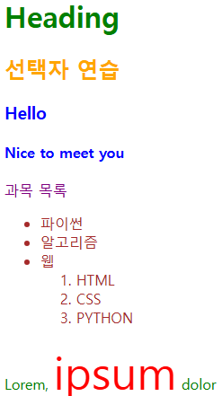

#### 9. 명시도 (Specificity)

- 결과적으로 요소에 적용할 CSS 선언을 결정하기 위한 알고리즘
- CSS Selector에 가중치를 계산하여 어떤 스타일을 적용할지 결정
    - 동일한 요소를 가리키는 2개 이상의 CSS 규칙이 있는 경우, 가장 높은 명시도를 가진 Selector가 승리하여 스타일이 적용됨

#### 10. Cascade (계단식)

- 한 요소에 동일한 가중치를 가진 선택자가 적용될 때, CSS에서 마지막에 나오는 선언이 사용됨

#### 11. 명시도가 높은 순

```css
1. Importance
 - !important
 - 다른 우선순위 규칙보다 우선하여 적용하는 키워드
 - Cascade의 구조를 무시하고 강제로 스타일을 적용하는 방식이므로 사용을 권장하지 않음

2. Inline 스타일

3. 선택자
 - id 선택자 > class 선택자 > 요소 선택자

4. 소스 코드 선언 순서
```

#### 12. 명시도 예시

```html
<p>1</p>
<p class="orange">2</p>
<p class="green orange">3</p>
<p class="orange green">4</p>
<p id="red" class="orange">5</p>
<h2 id="red" class="orange">6</h2>
<p id="red" class="orange" style="color: brown;">7</p>
<h2 id="red" class="orange" style="color: brown;">8</h2>
```

```css
h2{
    color: darkviolet !important;
}
p{
    color: blue;
}
.orange{
    color: orange;
}
.green{
    color: green;
}
#red{
    color: red;
}
```

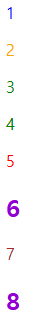

---

### 상속

#### 1. CSS 상속

- 기본적으로 CSS는 상속을 통해 부모 요소의 속성을 자식에게 상속해 재사용성을 높임

#### 2. CSS 속성 2가지 분류

- 상속되는 속성
    - Text 관련 요소
        - font
        - color
        - text-align
    - opacity
    - visibility 등
- 상속되지 않는 속성 (레이아웃에 관련된 것들)
    - Box model 관련 요소
        - width
        - height
        - border
        - box-sizing 등
    - position 관련 요소
        - position
        - top/right/bottom/left
        - z-index 등

#### 3. 상속 예시

```html
<ul class="parent">
    <li class="child">Hello</li>
    <li class="child">Bye</li>
</ul>
```

```css
.parent{
    /* 상속 O */
    color: red;

    /* 상속 X */
    border: 1px solid black;
}
```

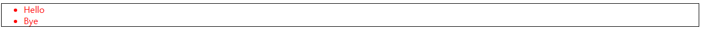

#### 4. CSS 상속 여부 확인

- MDN의 각 속성별 문서 하단에서 상속 여부를 확인할 수 있음

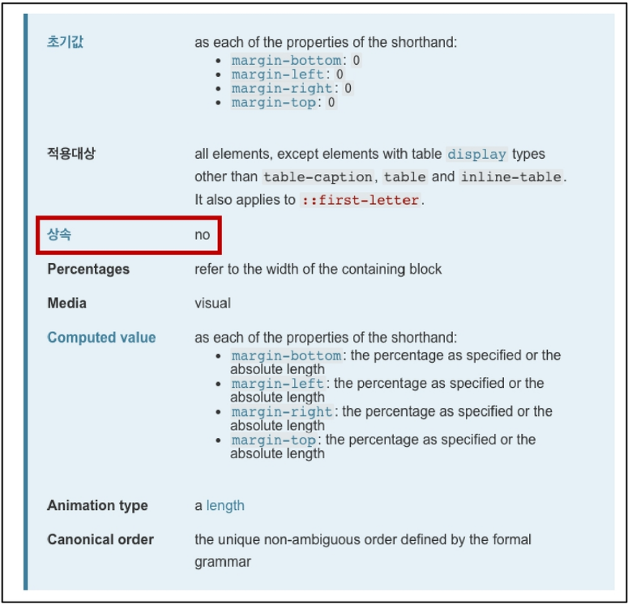

---

### CSS Box Model

#### 1. CSS Box Model

- 웹 페이지의 모든 HTML 요소를 감싸는 사각형 상자 모델
- 원은 네모 박스를 깎은 것

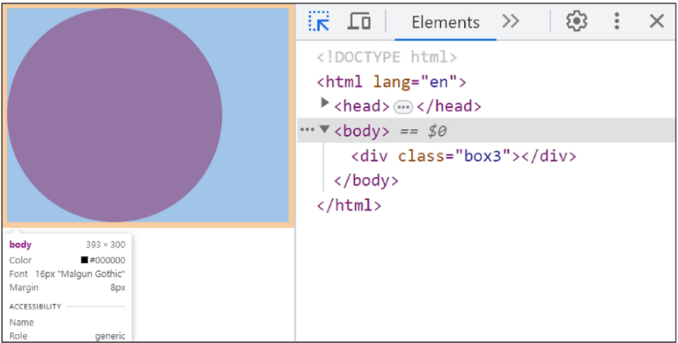

- 박스로 구성된 웹 페이지 레이아웃

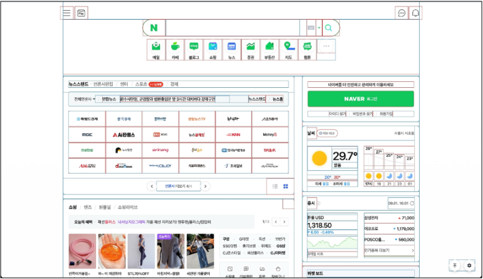

#### 2. 박스 타입

1. Block box
2. Inline box
- 박스 타입에 따라 페이지에서의 배치 흐름 및 다른 박스와 관련하여 박스가 동작하는 방식이 달라짐

#### 3. 박스 표시(Display) 타입

1. Outer display type
    1. 박스가 문서 흐름에서 어떻게 동작할지를 결정
    2. 속성
        1. block
            1. 항상 새로운 행으로 나뉨
            2. width와 height 속성 사용 가능
            3. padding, margin, border로 인해 다른 요소를 상자로부터 밀어냄
            4. width 속성을 지정하지 않으면 박스는 inline 방향으로 사용 가능한 공간을 모두 차지함
                1. 상위 컨테이너 너비 100%로 채우는 것
            5. 대표적인 block 타입 태그
                1. h1
                2. h2
                3. h3
                4. h4
                5. h5
                6. h6
                7. p
                8. div
        2. inline
            1. 새로운 행으로 넘어가지 않음
            2. width와 height 속성을 사용할 수 없음
            3. 수직 방향
                1. padding, margin, border가 적용되지만 다른 요소를 밀어낼 수는 없음
            4. 수평 방향
                1. padding, margin, border가 적용되어 다른 요소를 밀어낼 수 있음
            5. 대표적인 inline 타입 태그
                1. a
                2. img
                3. span
                4. strong
                5. em
                
                ```css
                /* Block */
                .index{
                    display: block;
                }
                
                /* Inline */
                .index{
                    display: inline;
                }
                ```
                
    
2. Inner display type
    1. 박스 내부의 요소들이 어떻게 배치될지를 결정
    2. 속성
        1. flex
    3. 추후 CSS layout - Flexbox에서 진행 예정
    
    ```css
    /* Flexbox */
    .container{
        display: flex;
    }
    ```
    

#### 4. Normal flow

- 일반적인 흐름 또는 레이아웃을 변경하지 않은 경우, 웹 페이지 요소가 배치되는 방식

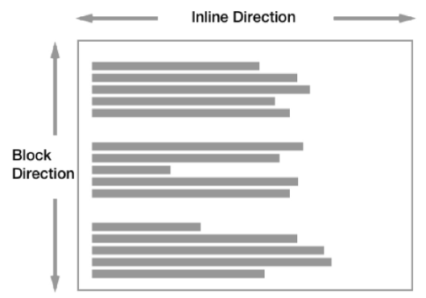

#### 5. Normal flow 예시

```html
<h1>Normal flow</h1>
<p>Lorem, ipsum dolor sit amet consect explicabo?</p>
<div>
	    <p>block 요소는 기본적으로 부모 요소의 너비 100%를 차지하며, 자식 콘텐츠의 최대 높이를 취한다.</p>
    <p>block 요소의 총 너비와 총 높이는 content + padding + border width/height다.</p>
</div>
<p>block 요소는 서로 margins로 구분된다.</p>
<p>inline 요소는 <span>이 것처럼</span> 자체 콘텐츠의 너비와 높이만 차지한다.
    그리고 inline 요소는 <a href="#">width나 height 속성을 지정할 수 없다.</a>
</p>
<p>
    물론 이미지도  인라인 요소다.
    단, 이미지는 다른 inline 요소와 달리 width나 height로 크기를 조정할 수 있다.
</p>
<p>
    만약 inline 요소의 크기를 제어하려면 block 요소로 변경하거나 inline-block 요소로 설정해주어야 한다.
</p>
```

```css
a,
span,
img{
    border: 3px solid red;
}
h1,
p,
div{
    border: 1px solid blue;
}
```

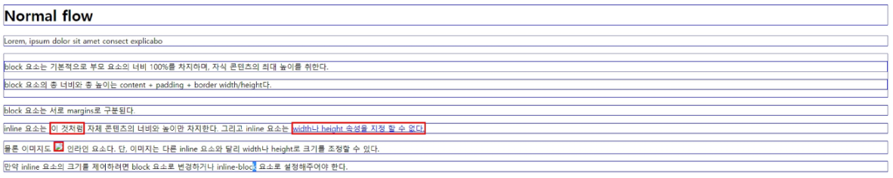

---

### 참고

#### 1. 명시도 관련 문서

- 그림으로 보는 명시도
    - https://specifishity.com/
- 명시도 계산기
    - https://specificity.keegan.st/

#### 2. HTML 스타일 가이드

- 대소문자 구분
    - HTML은 대소문자를 구분하지 않지만, 소문자 사용을 강력히 권장
    - 태그명과 속성명 모두 소문자로 작성
- 속성 따옴표
    - 속성 값에는 큰 따옴표(”)를 사용하는 것이 일반적
- 코드 구조와 포맷팅
    - 일관된 들여쓰기를 사용 (보통 2칸 공백)
    - 각 요소는 한 줄에 하나씩 작성
    - 중첩된 요소는 한 단계 더 들여쓰기
- 공백 처리
    - HTML은 연속된 공백을 하나로 처리
    - Enter키로 줄 바꿈을 해도 브라우저에서 인식하지 않음
        - 줄 바꿈 태그를 사용해야 함
- 에러 출력 없음
    - HTML은 문법 오류가 있어도 별도의 에러 메시지를 출력하지 않음

#### 3. CSS 스타일 가이드

- 코드 구조와 포맷팅
    - 일관된 들여쓰기를 사용
        - 보통 2칸 공백
    - 선택자와 속성은 각각 새 줄에 작성
    - 중괄호 앞에 공백 넣기
    - 속성 뒤에는 콜론(:)과 공백 넣기
    - 마지막 속성 뒤에는 세미콜론(;) 넣기
- 선택자 사용
    - class 선택자를 우선적으로 사용
    - id, 요소 선택자 등은 가능한 피할 것
        - 여러 선택자들과 함께 사용할 경우 우선순위 규칙에 따라 예기치 못한 스타일 규칙이 적용되어 전반적인 유지보수가 어려워지기 때문
- 속성과 값
    - 속성과 값은 소문자로 작성
    - 0 값에는 단위를 붙이지 않음
- 명명 규칙
    - 클래스 이름은 의미 있고, 목적을 나타내는 이름을 사용
    - 케밥 케이스(kebab-case)를 사용
    - 약어보다는 전체 단어를 사용
- CSS 적용 스타일
    - 인라인(inline) 스타일은 되도록 사용하지 말 것
        - CSS와 HTML 구조 정보가 혼합되어 작성되기 때문에 코드를 이해하기 어렵게 만듦

#### 4. MDN Web Docs

- Mozilla Developer Network에서 제공하는 온라인 문서로, 웹 개발자와 디자이너를 위한 종합적인 참고 자료
- HTML, CSS, JavaScript, 웹 API, 개발 도구 등 웹 기술에 대한 정보를 제공

#### 5. MDN 문서 특징

1. 정확성 및 신뢰성
    1. Mozilla와 웹 커뮤니티의 전문가들에 의해 작성되고 유지 관리
    2. 웹 표준을 정확하게 반영하고 있으며, 신뢰할 수 있는 정보 소스를 제공
2. 최신 웹 기술
    1. 최신 웹 표준과 기술을 다루고 있어, 웹 개발자들이 최신 정보를 쉽게 접할 수 있음
3. 명확한 설명과 예제
    1. 복잡한 개념을 이해하기 쉽게 설명하고, 실습 가능한 예제 코드를 제공
