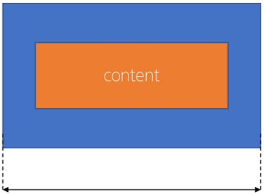
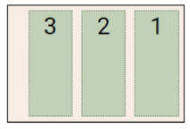

## Web 02 CSS Layout (2025.02.25)

### 박스 구성 요소

#### 1. CSS Box Model

- 웹 페이지의 모든 HTML 요소를 감싸는 사각형 상자 모델
- 내용(Content), 안쪽 여백(Padding), 테두리(Border), 외부 간격(Margin)으로 구성되어 요소의 크기와 배치를 결정

#### 2. Box 구성 요소

- Content box
    - 실제 콘텐츠가 표시되는 영역 크기
    - width 및 height 속성을 사용하여 크기 조정
- Padding box
    - 콘텐츠 주위에 공백
    - padding 관련 속성을 사용하여 크기 조정
- Border box
    - 콘텐츠와 패딩을 래핑
    - border 관련 속성을 사용하여 크기 조정
- Margin box
    - 콘텐츠, 패딩 및 테두리를 래핑
    - 박스와 다른 요소 사이의 공백
    - margin 관련 속성을 사용하여 크기 조


#### 3. Box 구성의 방향 별 속성 값


#### 4. Box 구성 요소 예시


```html
<body>
    <div class="box1">box1</div>
    <div class="box2">box2</div>
</body>
```

```css
.box1{
    width: 200px;
    padding-left: 25px;
    padding-bottom: 25px;
    margin-left: 25px;
    margin-top: 50px;
    border-width: 3px;
    border-style: solid;
    border-color: black;
}
.box2{
    width: 200px;
    padding: 25px 50px;
    margin: 25px auto;
    border: 1px dashed black;
}
```

---

### shorthand 속성

#### 1. shorthand 속성 - ‘border’

- border-width, border-style, border-color를 한 번에 설정하기 위한 속성

```css
/* 작성 순서는 영향을 주지 않음 */
border: 2px solid black;
```

#### 2. shorthand 속성 - ‘margin’ & ‘padding’

- 4방향의 속성을 각각 지정하지 않고 한 번에 지정할 수 있는 속성

```css
/* 4개 - 상우하좌 */
margin: 10px 20px 30px 40px;
padding: 10px 20px 30px 40px;

/* 3개 - 상/좌우/하 */
margin: 10px 20px 30px;
padding: 10px 20px 30px;

/* 2개 - 상하/좌우 */
margin: 10px 20px;
padding: 10px 20px;

/* 1개 - 공통 */
margin: 10px;
padding: 10px;
```

---

### box-sizing 속성

#### 1. The Standard CSS Box Model

- 표준 상자 모델에서 width와 height 속성 값을 설정하면 이 값은 content box의 크기를 조정하게 됨
- CSS는 border box가 아닌 content box의 크기를 width 값으로 지정
- 참고 자료
    - https://developer.mozilla.org/en-US/docs/Learn_web_development/Core/Styling_basics/Box_model#outer_display_type
- 실제 박스 크기는 350px이 아닌 테두리, 패딩 값을 모두 더한 값을 가짐


```css
*{
    box-sizing: content-box;
}
```

#### 2. The Alternative CSS Box Model

- 대체 상자 모델에서 모든 width와 height는 실제 상자의 너비
- 실제 박스 크기를 정하기 위해 테두리와 패딩을 조정할 필요 없음




```css
*{
    box-sizing: border-box;
}
```

#### 3. box-sizing 예시


```html
<!DOCTYPE html>
<html lang="en">
<head>
    <meta charset="UTF-8">
    <meta name="viewport" content="width=device-width, initial-scale=1.0">
    <title>Document</title>
    <link rel="stylesheet" href="style.css">
</head>
    <div class="box content-box">content-box</div>
    <div class="box border-box">border-box</div>
</body>
</html>
```

```css
.box{
    width: 100px;
    border: 2px solid black;
    padding: 10px;
    margin: 20px;
    background-color: yellow;
}
.content-box{
    /* box-sizing: content-box; */
}
.border-box{
    /* box-sizing: border-box; */
}
```

---

### 기타 Display 속성

#### 1. inline-block

- inline과 block 요소 사이의 중간 지점을 제공하는 display 값
- width 및 height  속성 사용 가능
- padding, margin 및 border로 인해 다른 요소가 상자에서 밀려남
- 새로운 행으로 넘어가지 않음
- 요소가 줄 바꿈 되는 것을 원하지 않으면서 너비와 높이를 적용하고 싶은 경우에 사용


```html
<!DOCTYPE html>
<html lang="en">
<head>
    <meta charset="UTF-8">
    <meta name="viewport" content="width=device-width, initial-scale=1.0">
    <title>Document</title>
    <link rel="stylesheet" href="style.css">
</head>
<body>
    <!-- 1. 이제 다른 요소를 밀어낼 수 있는 span -->
    <p>Lorem ipsum dolor sit amet <span>consectetur</span> adipisicing elit. Animi iusto enim officia exercitationem
        dolorque, quasi velit, dolores, tempora illum odio necessitatibus. Fugit,
        cumque eligendi!</p>

    <!-- 2. 리스트 요소를 가로로 정렬 -->
    <ul>
        <li><a href="#">link</a></li>
        <li><a href="#">link</a></li>
        <li><a href="#">link</a></li>
    </ul>

    <!-- 3. div 요소를 가로로 정렬 -->
    <div class="container">
        <div class="box"></div>
        <div class="box"></div>
        <div class="box"></div>
    </div>
</body>
</html>
```

```css
span{
    margin: 20px;
    padding: 20px;
    width: 80px;
    height: 50px;
    background-color: lightblue;
    border: 2px solid blue;
    display: inline-block;
}
ul > li{
    background-color: crimson;
    padding: 10px 20px;
    display: inline-block;
}
.container{
    text-align: center;
}
.box{
    width: 100px;
    height: 100px;
    background-color: #4CAF50;
    margin: 10px;
    display: inline-block;
}
```

#### 2. none

- 요소를 화면에 표시하지 않고, 공간조차 부여되지 않음


```html
<!DOCTYPE html>
<html lang="en">
<head>
    <meta charset="UTF-8">
    <meta name="viewport" content="width=device-width, initial-scale=1.0">
    <title>Document</title>
    <link rel="stylesheet" href="style.css">
</head>
<body>
    <div class="box"></div>
    <div class="box"></div>
    <div class="box none"></div>
</body>
</html>
```

```css
.box{
    width: 100px;
    height: 100px;
    background-color: red;
    border: 2px solid black;
}
.none{
    display: none;
}
```

---

### CSS Position

#### 1. CSS Layout

- 각 요소의 위치와 크기를 조정하여 웹 페이지의 디자인을 결정하는 것
- Display, Position, Flexbox 등

#### 2. CSS Position

- 요소를 Normal Flow에서 제거하여 다른 위치로 배치하는 것
- 다른 요소 위에 올리기, 화면의 특정 위치에 고정시키기 등

#### 3. Position 이동 방향


#### 4. Position 유형

1. static
    1. 요소를 Normal Flow에 따라 배치
    2. top, right, bottom, left 속성이 적용되지 않음
    3. 기본 값
2. relative
    1. 요소를 Normal Flow에 따라 배치
    2. 자신의 원래 위치(static)을 기준으로 이동
    3. top, right, bottom, left 속성으로 위치를 조정
    4. 다른 요소의 레이아웃에 영향을 주지 않음
        1. 요소가 차지하는 공간은 static일 때와 같음
3. absolute
    1. 요소를 Normal Flow에서 제거
    2. 가장 가까운 relative 부모 요소를 기준으로 이동
        1. 만족하는 부모 요소가 없다면 body 태그를 기준으로 함
    3. top, right, bottom, left 속성으로 위치를 조정
    4. 문서에서 요소가 차지하는 공간이 없어짐
    
    ```html
    <!DOCTYPE html>
    <html lang="en">
    <head>
        <meta charset="UTF-8">
        <meta name="viewport" content="width=device-width, initial-scale=1.0">
        <title>Document</title>
        <link rel="stylesheet" href="style.css">
    </head>
    <body>
        <div class="card">
            <div class="card-content">
                <h3>Card Title</h3>
                <p>Lorem ipsum dolor sit amet, consectetur adipiscing elit.</p>
                <span class="badge">New</span>
            </div>
        </div>
    </body>
    </html>
    ```
    
    ```css
    .card{
        position: relative;
        width: 300px;
        height: 200px;
        border: 1px solid black;
    }
    .card-content{
        padding: 10px;
    }
    .badge{
        position: absolute;
        top: 0;
        right: 0;
        background-color: red;
        color: white;
        padding: 5px 10px;
    }
    ```
    

1. fixed
    1. 요소를 Normal Flow에서 제거
    2. 현재 화면영역(viewport)을 기준으로 이동
    3. 스크롤해도 항상 같은 위치에 유지됨
    4. top, right, bottom, left 속성으로 위치를 조정
    5. 문서에서 요소가 차지하는 공간이 없어짐
2. sticky
    1. relative와 fixed의 특성을 결합한 속성
    2. 스크롤 위치가 임계점에 도달하기 전에는 relative처럼 동작
    3. 스크롤 특정 임계점에 도달하면 fixed처럼 동작하여 화면에 고정됨
    4. 만약 다음 sticky 요소가 나오면 다음 sticky 요소가 이전 sticky 요소의 자리르 대체
        1. 이전 sticky 요소가 고정되어 있던 위치와 다음 sticky 요소가 고정되어야 할 위치가 겹치게 되기 때문
        
        ```html
        <!DOCTYPE html>
        <html lang="en">
        <head>
            <meta charset="UTF-8">
            <meta name="viewport" content="width=device-width, initial-scale=1.0">
            <title>Document</title>
            <link rel="stylesheet" href="style.css">
        </head>
        <body>
            <h1>Sticky positioning</h1>
            <div>
                <div class="sticky">첫 번째 Sticky</div>
                <div>
                    <p>내용1</p>
                    <p>내용2</p>
                    <p>내용3</p>
                </div>
                <div class="sticky">두 번째 Sticky</div>
                <div>
                    <p>내용4</p>
                    <p>내용5</p>
                    <p>내용6</p>
                </div>
                <div class="sticky">세 번째 Sticky</div>
                <div>
                    <p>내용7</p>
                    <p>내용8</p>
                    <p>내용9</p>
                </div>
            </div>
        </body>
        </html>
        ```
        
        ```css
        body{
            height: 1500px;
        }
        .sticky{
            position: sticky;
            top: 0;
            background-color: lightblue;
            padding: 20px;
            border: 2px solid black;
        }
        ```
        

#### 4. Position 활용


```html
<!DOCTYPE html>
<html lang="en">
<head>
    <meta charset="UTF-8">
    <meta name="viewport" content="width=device-width, initial-scale=1.0">
    <title>Document</title>
    <link rel="stylesheet" href="style.css">
</head>
<body>
    <div class="container">
        <div class="box static">Static</div>
        <div class="box absolute">Absolute</div>
        <div class="box relative">Relative</div>
        <div class="box fixed">Fixed</div>
    </div>
</body>
</html>
```

```css
*{
    box-sizing: border-box;
}
body{
    height: 1500px;
}
.container{
    position: relative;
    height: 300px;
    width: 300px;
    border: 1px solid black;
}
.box{
    height: 100px;
    width: 100px;
    border: 1px solid black;
}
.static{
    position: static;
    background-color: lightcoral;
}
.absolute{
    position: absolute;
    background-color: lightgreen;
    top: 100px;
    left: 100px;
}
.relative{
    position: relative;
    background-color: lightblue;
    top: 100px;
    left: 100px;
}
.fixed{
    position: fixed;
    background-color: gray;
    top: 0;
    right: 0;
}
```

---

### z-index

#### 1. z-index

- 요소의 쌓임 순서(stack order)를 정의하는 속성
- 정수 값을 사용해 z축 순서를 지정
- 값이 클수록 요소가 위에 쌓이게 됨
- static이 아닌 요소에만 적용됨

#### 2. z-index 특징

- 기본 값은 auto
- 부모 요소의 z-index 값에 영향을 받음
- 같은 부모 내에서만 z-index 값을 비교
- 부모의 z-index가 낮으면 자식의 z-index가 아무리 높아도 부모보다 위로 올라갈 수 없음
- z-index 값이 같으면 HTML 문서 순서대로 쌓임

#### 3. z-index 예시


```html
<!DOCTYPE html>
<html lang="en">
<head>
    <meta charset="UTF-8">
    <meta name="viewport" content="width=device-width, initial-scale=1.0">
    <title>Document</title>
    <link rel="stylesheet" href="style.css">
</head>
<body>
    <div class="container">
        <div class="box red">z-index: 3</div>
        <div class="box green">z-index: 2</div>
        <div class="box blue">z-index: 1</div>
    </div>
</body>
</html>
```

```css
.container{
    position: relative;
}
.box{
    position: absolute;
    width: 100px;
    height: 100px;
}
.red{
    background-color: red;
    top: 50px;
    left: 50px;
    z-index: 3;
}
.green{
    background-color: green;
    top: 100px;
    left: 100px;
    z-index: 2;
}
.blue{
    background-color: blue;
    top: 150px;
    left: 150px;
    z-index: 1;
}
```

#### 4. Position의 목적

- 전체 페이지에 대한 레이아웃을 구성하는 것보다는 페이지 특정 항목의 위치를 조정하는 것

---

### CSS Flexbox

#### 1. CSS Flexbox

- 요소를 행과 열 형태로 배치하는 1차원 레이아웃 방식
    - ‘공간 배열’ & ‘정렬’
- 요소를 행과 열 형태로 배치하는 1차원 레이아웃 방식


#### 2. Flexbox 구성 요소

1. Main Axis (주 축)
    1. Flex Item들이 배치되는 기본 축
    2. Main Start에서 시작하여 Main End 방향으로 배치 (기본 값)
2. Cross Axis (교차 축)
    1. Main Axis에 수직인 축
    2. Cross Start에서 시작하여 Cross End 방향으로 배치 (기본 값)
3. Flex Container
    1. display: flex; 혹은 display: inline-flex;가 설정된 부모 요소
    2. 이 컨테이너의 1차 자식 요소들이 Flex Item이 됨
    3. Flexbox 속성 값들을 사용하여 자식 요소 Flex Item들을 배치하는 주체
4. Flex Item
    1. Flex Container 내부에 레이아웃 되는 항목


#### 3. Flexbox 속성 목록

- Flex Container 관련 속성
    - display
    - flex-direction
    - flex-wrap
    - justify-content
    - align-item
    - align-content
- Flex Item 관련 속성
    - align-self
    - flex-grow
    - flex-basis
    - order

#### 4. Flexbox 속성

1. Flex Container 지정
    1. Flex Item은 기본적으로 행(주 축의 기본 값인 가로 방향)으로 나열
    2. Flex Item은 주 축의 시작 선에서 시작
    3. Flex Item은 교차 축의 크기를 채우기 위해 늘어남
    
    
    
2. flex-direction
    1. Flex Item이 나열되는 방향을 지정
    2. column으로 지정할 경우 주 축이 변경됨
    3. “-reverse”로 지정하면 Flex Item 배치의 시작 선과 끝 선이 서로 바뀜
    
    
    
3. flex-wrap
    1. Flex Item 목록이 Flex Container의 한 행에 들어가지 않을 경우, 다른 행에 배치할지 여부 설정
    
    
    
4. justify-content
    1. 주 축을 따라 Flex Item과 주위에 공간을 분배
    
    
    
5. align-content
    1. 교차 축을 따라 Flex Item과 주위에 공간을 분배
    2. flex-wrap이 wrap 또는 wrap-reverse로 설정된 여러 행에만 적용됨
    3. 한 줄 짜리 행에는 효과 없음 (flex-wrap이 nowrap으로 설정된 경우)
    
    
    
6. align-items
    1. 교차 축을 따라 Flex Item 행을 정렬
    
    
    
7. align-self
    1. 교차 축을 따라 개별 Flex Item을 정렬
    
    
    
8. flex-grow
    1. 남는 행 여백을 비율에 따라 각 Flex Item에 분배
        1. 아이템이 컨테이너 내에서 확장하는 비율을 지정
        2. flex-grow의 반대는 flex-shrink
        
        
        
        
        
        ```html
        <!DOCTYPE html>
        <html lang="en">
        <head>
            <meta charset="UTF-8">
            <meta name="viewport" content="width=device-width, initial-scale=1.0">
            <title>Document</title>
            <link rel="stylesheet" href="style.css">
        </head>
        <body>
            <div class="container">
                <div class="item item-1">1</div>
                <div class="item item-2">2</div>
                <div class="item item-3">3</div>
            </div>
        </body>
        </html>
        ```
        
        ```css
        .container{
            display: flex;
            width: 100%;
        }
        .item{
            height: 100px;
            color: white;
            font-size: 3rem;
        }
        .item-1{
            background-color: red;
            /* flex-grow: 1; */
        }
        .item-2{
            background-color: green;
            /* flex-grow: 2; */
        }
        .item-3{
            background-color: blue;
            /* flex-grow: 3; */
        }
        ```
        
9. flex-basis
    1. Flex Item의 초기 크기 값을 지정
    2. flex-basis와 width 값을 동시에 적용한 경우 flex-basis가 우선
    
    
    
    ```html
    <!DOCTYPE html>
    <html lang="en">
    <head>
        <meta charset="UTF-8">
        <meta name="viewport" content="width=device-width, initial-scale=1.0">
        <title>Document</title>
        <link rel="stylesheet" href="style.css">
    </head>
    <body>
        <div class="container">
            <div class="item item-1">1</div>
            <div class="item item-2">2</div>
            <div class="item item-3">3</div>
        </div>
    </body>
    </html>
    ```
    
    ```css
    .container{
        display: flex;
        width: 100%;
    }
    .item{
        height: 100px;
        color: white;
        font-size: 3rem;
    }
    .item-1{
        background-color: red;
        /* flex-basis: 300px; */
    }
    .item-2{
        background-color: green;
        /* flex-basis: 600px; */
    }
    .item-3{
        background-color: blue;
        /* flex-basis: 300px; */
    }
    ```
    

#### 5. Flexbox 예제

```html
<!DOCTYPE html>
<html lang="en">
<head>
    <meta charset="UTF-8">
    <meta name="viewport" content="width=device-width, initial-scale=1.0">
    <title>Document</title>
    <link rel="stylesheet" href="style.css">
</head>
<body>
    <div class="container">
        <div class="post item1">
            <h2>Post Title 1</h2>
            <p>Post Content 1</p>
        </div>
        <div class="post item2">
            <h2>Post Title 2</h2>
            <p>Post Content 2</p>
        </div>
        <div class="post item3">
            <h2>Post Title 3</h2>
            <p>Post Content 3</p>
        </div>
        <div class="post item4">
            <h2>Post Title 4</h2>
            <p>Post Content 4</p>
        </div>
    </div>
</body>
</html>
```

```css
.container{
    height: 500px;
    border: 1px solid black;
    /* display: flex; */
    /* flex-direction: row; */
    /* flex-direction: column; */
    /* flex-direction: row-reverse; */
    /* flex-direction: column-reverse; */

    /* flex-wrap: nowrap; */
    /* flex-wrap: wrap; */
    /* flex-wrap: wrap-reverse; */

    /* justify-content: flex-start; */
    /* justify-content: center; */
    /* justify-content: flex-end; */

    /* align-content: flex-start; */
    /* align-content: center; */
    /* align-content: flex-end; */

    /* align-items: flex-start; */
    /* align-items: center; */
    /* align-items: flex-end; */
}
.post{
    background-color: grey;
    border: 1px solid black;
    margin: 0.5rem;
    padding: 0.5rem;
}
.item1{
    /* align-self: center; */
}
.item2{
    /* align-self: flex-end; */
}
```

#### 6. 목적에 따른 속성 분류

1. 배치
    1. flex-direction
    2. flex-wrap
2. 공간 분배
    1. justify-content
    2. align-content
3. 정렬
    1. align-items
    2. align-self

#### 7. 속성명 Tip

- justify
    - 주축
- align
    - 교차 축

#### 8. justify-items 및 justify-self 속성이 없는 이유

- 필요 없기 때문
- margin auto를 통해 정렬 및 배치가 가능

---

### flex-wrap 응용

#### 1. 반응형 레이아웃

- 다양한 디바이스와 화면 크기에 자동으로 적응하여 콘텐츠를 최적으로 표시하는 웹 레이아웃 방식

#### 2. 반응형 레이아웃 작성

- flex-wrap을 사용해 반응형 레이아웃 작성
    - flex-grow & flex-basis 활용
    
    
    
    ```html
    <!DOCTYPE html>
    <html lang="en">
    <head>
        <meta charset="UTF-8">
        <meta name="viewport" content="width=device-width, initial-scale=1.0">
        <title>Document</title>
        <link rel="stylesheet" href="style.css">
    </head>
        <div class="card">
            
            <div class="content">
                <h2>Heading</h2>
                <p>Lorem, ipsum dolor sit amet consectetur adipisicing elit. Perspiciatis minus sed expedita ut nihil tempora
                neque autem odio eos, repudiandae blanditiis, molestiae consequatur. Adipisci illo dolor repellat alias
                maiores.
                Aut?</p>
            </div>
        </div>
    </body>
    </html>
    ```
    
    ```css
    .card{
        width: 80%;
        border: 1px solid black;
        /* 1 */
        display: flex;
        /* 2 */
        flex-wrap: wrap;
    }
    img{
        width: 100%;
    }
    .thumbnail{
        /* 3 */
        flex-basis: 700px;
        /* 4 */
        flex-grow: 1;
    }
    .content{
        /* 3 */
        flex-basis: 350px;
        /* 4 */
        flex-grow: 1;
    }
    ```
    

---

### 참고

#### 1. Margin Collapsing (마진 상쇄)

- 두 block 타입 요소의 martin top과 bottom이 만나 더 큰 margin으로 결합되는 현상
- 좌우에는 적용되지 않음
- 일관된 레이아웃 때문에 일부로 마진 상쇄를 발생시킴
- 참고 자료
    - https://developer.mozilla.org/en-US/docs/Web/CSS/CSS_box_model/Mastering_margin_collapsing


#### 2. 마진 상쇄 예시

- 두 요소 모두 margin 20px이지만 실제 두 요소의 상/하 공간은 40이 아닌 20으로 상쇄


---

### 박스 타입 별 수평 정렬

#### 1. Block 요소의 수평 정렬

- margin: auto;
    - 블록 요소의 너비를 지정하고 좌우 마진을 auto로 설정
    
    
    

#### 2. Inline 요소의 수평 정렬

- text-align
    - 부모 요소에 적용
    
    
    

#### 3. Inline-block 요소의 수평 정렬

- text-align
    - 부모 요소에 적용
    
    
    

---

### 실제 Position 활용 예시

#### 1. 실제 Position 활용 예시

- absolute


- fixed


- sticky


---

### Flexbox Shorthand 속성

#### 1. shorthand - “flex-flow”


#### 2. shorthand - “flex”


---

### Flexbox 속성

#### 1. Flexbox 속성 정리

1. flex-direction
    - row
    
    
    
    - row-reverse
    
    
    

- column


- column-reverse


1. flex-wrap
    - wrap
    
    
    

- nowrap


1. justify-content
    - flex-start
    
    
    

- flex-end


- center


- space-between


- space-around


- space-evenly


1. align-content
    - flex-start
    
    
    

- flex-end


- center


- space-between


- space-around


- space-evenly


1. align-items
    - stretch
    
    
    

- flex-start


- flex-end


- center


1. align-self
    - stretch
    
    
    
    - flex-start
    
    
    

- flex-end


- center


