## Vue 02 (2025.05.08)

### Template Syntax

#### 1. Template Syntax

- DOM을 기본 구성 요소 인스턴스의 데이터에 선언적으로 바인딩(Vue Instance와 DOM을 연결)할 수 있는 HTML 기반 템플릿 구문(확장된 문법 제공)을 사용

#### 2. Template Syntax 종류

1. Text Interpolation
2. Raw HTML
3. Attribute Bindings
4. JavaScript Expressions

#### 3. Text Interpolation

- 데이터 바인딩의 가장 기본적인 형태
- 이중 중괄호 구문(콧수염 구문)을 사용
- 콧수염 구문은 해당 구성 요소 인스턴스의 msg 속성 값으로 대체
- msg 속성이 변경될 때마다 업데이트 됨

```html
<p>Message: {{msg}}</p>
```

#### 4. Raw HTML

- 콧수염 구문은 데이터를 일반 텍스트로 해석하기 때문에 실제 HTML을 출력하려면 v-html을 사용해야 함

```html
<div v-html="rawHtml"></div>
```

```jsx
const rawHtml = ref("<span style='color: red'>This should be red</span>")
```

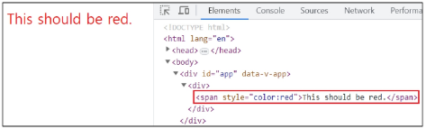

#### 5. Attribute Bindings

- 콧수염 구문은 HTML 속성 내에서 사용할 수 없기 때문에 v-bind를 사용
- HTML의 id 속성 값을 vue의 dynamicId 속성과 동기화 되도록 함
- 바인딩 값이 null이나 undefined인 경우 렌더링 요소에서 제거됨

```html
<div v-bind:id="dynamicId"></div>
```

```jsx
const dynamicId = ref("my-id")
```

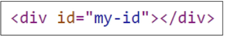

#### 6. JavaScript Expressions

- Vue는 모든 데이터 바인딩 내에서 JavaScript 표현식의 모든 기능을 지원
- Vue 템플릿에서 JavaScript 표현식을 사용할 수 있는 위치
    1. 콧수염 구문 내부
    2. 모든 directive의 속성 값 (”v-”로 시작하는 특수 속성)
    
    ```html
    {{number + 1}}
    
    {{ok ? "YES" : "NO"}}
    
    {{message.split("").reverse().join("")}}
    
    <div v-bind:id="`list-${id}`"></div>
    ```
    

#### 7. Expression 주의사항

- 각 바인딩에는 하나의 단일 표현식만 포함될 수 있음
    - 표현식은 값으로 평가할 수 있는 코드 조각
        - return 뒤에 사용할 수 있는 코드여야 함
- 작동하지 않는 경우

```html
<!-- 표현식이 아닌 선언식 -->
{{const number = 1}}

<!-- 제어문은 삼항 표현식을 사용해야 함 -->
{{if(ok){return message}}}
```

---

### Directive

#### 1. Directive

- ‘v-’ 접두사가 있는 특수 속성

#### 2. Directive 특징

- Directive의 속성 값은 단일 JavaScript 표현식이어야 함
    - v-for, v-on 제외
- 표현식 값이 변경될 때 DOM에 반응적으로 업데이트를 적용

```html
<p v-if="seen">Hi There</p>
```

#### 3. Directive 전체 구문

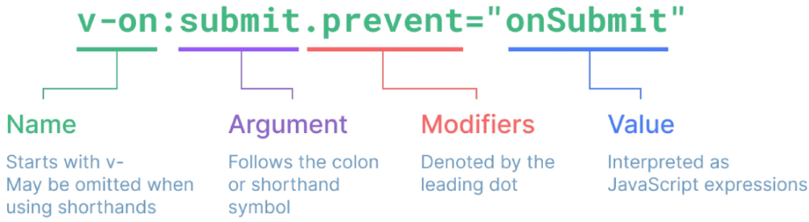

#### 4. Directive - “Arguments”

- 일부 directive는 directive 뒤에 콜론(”:”)으로 표시되는 인자를 사용할 수 있음
- 아래 예시의 href는 HTML <a> 요소의 href 속성 값을 myUrl 값에 바인딩하도록 하는 v-bind의 인자

```html
<a v-bind:href="myUrl">Link</a>
```

- 아래 예시의 click은 이벤트 수신할 이벤트 이름을 작성하는 v-on의 인자

```html
<button v-on:click="doSomething">Button</button>
```

#### 5. Directive - “Modifiers”

- “.(dot)”로 표시되는 특수 접미사로, directive가 특별한 방식으로 바인딩되어야 함을 나타냄
- 아래 예시의 .prevent는 발생한 이벤트에서 event.preventDefault()를 호출하도록 v-on에 지시하는 modifier

```html
<form v-on:submit.prevent="onSubmit">
    <input type="submit">
</form>
```

#### 6. Built-in Directives

- v-text
- v-show
- v-if
- v-for 등

---

### Dynamically Data Binding

#### 1. v-bind

- 하나 이상의 속성 또는 컴포넌트 데이터를 표현식에 동적으로 바인딩

#### 2. v-bind 사용처

1. Attribute Bindings
2. Class and Style Bindings

#### 3. Attribute Bindings (속성 바인딩)

- HTML의 속성 값을 Vue의 상태 속성 값과 동기화 되도록 함

```html

<a v-bind:href="myUrl">Move to url</a>
```

- v-bind shorthand (약어)
    - ‘:’ (colon)
    
    ```html
    
    <a :href="myUrl">Move to url</a>
    ```
    

#### 4. Dynamic Attribute Name (동적 인자 이름)

- 대괄호([])로 감싸서 directive argument에 JavaScript 표현식을 사용할 수 있음
- 표현식에 따라 동적으로 평가된 값이 최종 argument 값으로 사용됨
- 대괄호 안에 작성하는 이름은 반드시 소문자로만 구성 가능
    - 브라우저가 속성 이름을 소문자로 강제 변환하기 때문
    
    ```html
    <button :[key]="myValue"></button>
    ```
    

#### 5. Attribute Bindings 예시

```html
<div id="app">
    
    <a v-bind:href="myUrl">Move to url</a>
    
    <a :href="myUrl">Move to url</a>
    <p :[dynamicattr]="dynamicValue">...</p>
</div>
```

```jsx
const {createApp, ref} = Vue
const app = createApp({
    setup(){
        const imageSrc = ref("https://picsum.photos/200")
        const myUrl = ref("https://www.google.co.kr/")
        const dynamicattr = ref("title")
        const dynamicValue = ref("Hello Vue.js")
        
        return{
            imageSrc,
            myUrl,
            dynamicattr,
            dynamicValue,
        }
    }
})
app.amount("#app")
```

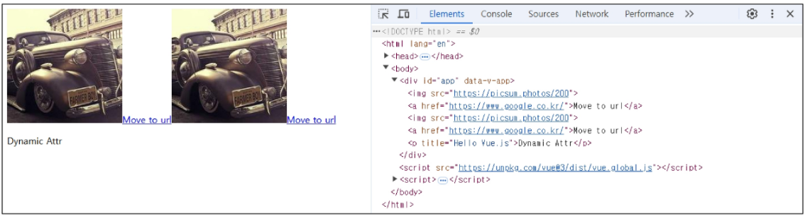

---

### Class and Style Bindings

#### 1. Class and Style Bindings (클래스와 스타일 바인딩)

- class와 style은 모두 HTML 속성이므로 다른 속성과 마찬가지로 v-bind를 사용하여 동적으로 문자열 값을 할당할 수 있음
- Vue는 class 및 style 속성 값을 v-bind로 사용할 때, 객체 또는 배열을 활용하여 작성할 수 있도록 함
    - 단순히 문자열 연결을 사용하여 이러한 값을 생성하는 것을 번거롭고, 오류가 발생하기 쉽기 때문

#### 2. Class and Style Bindings가 가능한 경우

1. Binding HTML Classes
    1. Binding to Objects
    2. Binding to Arrays
2. Binding Inline Styles
    1. Binding to Objects
    2. Binding to Arrays

#### 3. Binding HTML Classes - Binding to Objects

- 객체를 :class에 전달하여 클래스를 동적으로 전환할 수 있음
- 예시 1
    - isActive의 Boolean 값에 의해 active 클래스의 존재가 결정됨
    
    ```html
    <div :class="{active: isActive}">Text</div>
    ```
    
    ```jsx
    const isActive = ref(true)
    ```
    
    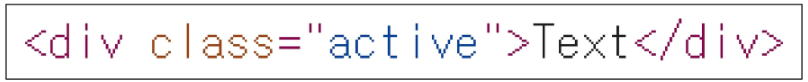
    

- 객체에 더 많은 필드를 포함하여 여러 클래스를 전환할 수 있음
- 예시 2
    - :class directive를 일반 클래스 속성과 함께 사용 가능
    
    ```html
    <div class="static" :class="{active: isActive, "text-primary": hasInfo}">Text</div>
    ```
    
    ```jsx
    const isActive = ref(false)
    const hasInfo = ref(true)
    ```
    
    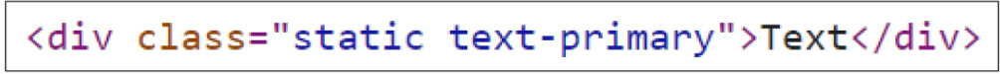
    

- inline 방식이 아닌 반응형 변수를 활용해 객체를 한 번에 작성하는 방법
- 예시 3

```html
<div class="static" :class="classObj">Text</div>
```

```jsx
const isActive = ref(false)
const hasInfo = ref(true)

// ref는 반응 객체의 속성으로 액세스되거나 변경될 때 자동으로 unwrap
const classObj = ref({
    active: isActive,
    "text-primary": hasInfo,
})
```

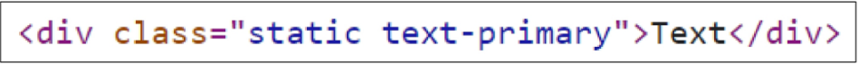

#### 4. Binding HTML Classes - Binding to Arrays

- :class를 배열에 바인딩하여 클래스 목록을 적용할 수 있음
- 예시 1

```html
<div :class="[activeClass, infoClass]">Text</div>
```

```jsx
const activeClass = ref("active")
const infoClass = ref("text-primary")
```

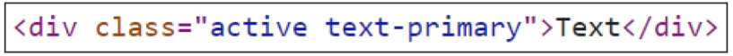

- 배열 구문 내에서 객체 구문을 사용하는 경우
- 예시 2

```html
<div :class="[{active: isActive}, infoClass]">Text</div>
```

```jsx
const isActive = ref(false)
const infoClass = ref("text-primary")
```

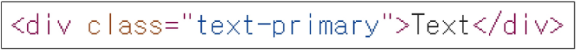

#### 5. Binding Inline Styles - Binding to Objects

- :style은 JavaScript 객체 값에 대한 바인딩을 지원
    - HTML style 속성
- 예시 1

```html
<div :style="{color: activeColor, fontSize: fontSize + "px"}">Text</div>
```

```jsx
const activeColor = ref("crimson")
const fontSize = ref(50)
```

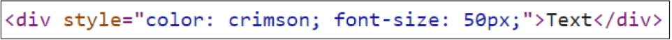

- 실제 CSS에서 사용하는 것처럼 :style은 kebab-cased 키 문자열도 지원
    - 단, camelCase 작성을 권장
- 예시 2

```html
<div :style="{color: activeColor, "font-size": fontSize + "px"}">Text</div>
```

```jsx
const activeColor = ref("crimson")
const fontSize = ref(50)
```

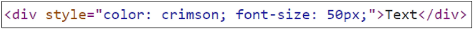

- inline 방식이 아닌 반응형 변수를 활용해 객체를 한 번에 작성하는 방법
- 예시 3

```html
<div :style="styleObj">Text</div>
```

```jsx
const activeColor = ref("crimson")
const fontSize = ref(50)
const styleObj = ref({
    color: activeColor,
    fontSize: fontSize.value + "px",
})
```

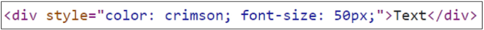

#### 6. Binding Inline Styles - Binding to Arrays

- 여러 스타일 객체를 배열에 작성해서 :style을 바인딩할 수 있음
- 작성한 객체는 병합되어 동일한 요소에 적용
- 예시

```html
<div :style="[styleObj, styleObj2]">Text</div>
```

```jsx
const styleObj = ref({
    color: activeColor,
    fontSize: fontSize.value + "px",
})
const styleObj2 = ref({
    color: "blue",
    border: "1px solid black",
})
```

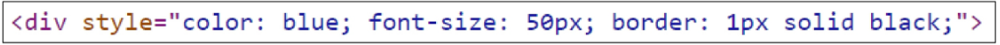

---

### Event Handling

#### 1. v-on

- DOM 요소에 이벤트 리스너를 연결 및 수신

#### 2. v-on 구성

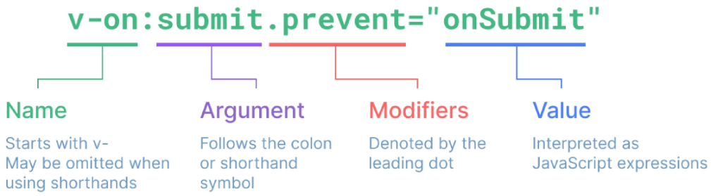

```html
v-on:event="handler"
```

- Handler 종류
    1. Inline Handlers
        1. 이벤트가 트리거될 때 실행될 JavaScript 코드
    2. Method Handlers
        1. 컴포넌트에 정의된 메서드 이름
- v-on shorthand (약어)
    - @
    
    ```html
    @event="handler"
    ```
    

#### 3. Inline Handlers

- Inline Handlers는 주로 간단한 상황에 사용

```html
<button @click="count++">Add 1</button>
<p>Count: {{count}}</p>
```

```jsx
const count = ref(0)
```

#### 4. Method Handlers

- 메서드를 작성하여 호출하는 방식
- Inline Handlers로는 불가능한 대부분의 상황에서 사용

```html
<button @click="increase">Hello</button>
```

```jsx
const increase = function(){
    count.value += 1
}
```

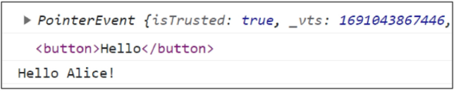

```html
<button @click="myFunc">Hello</button>
```

```jsx
const name = ref("Alice")
const myFunc = function(event){
    console.log(event)
    console.log(event.currentTarget)
    console.log(`Hello ${name.value}!`)
}
```

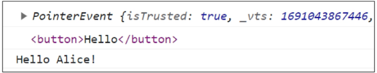

#### 5. Method Handlers에서의 event 객체

- Method Handlers는 이를 트리거하는 기본 DOM Event 객체를 자동으로 수신

```jsx
const myFunc = function(event){
    console.log(event)
    console.log(event.currentTarget)
    console.log(`Hello ${name.value}!`)
}
```

#### 6. 사용자 지정 인자 전달

- 기본 이벤트 대신 사용자 지정 인자를 전달할 수도 있음

```html
<button @click="greeting("hello")">Say hello</button>
<button @click="greeting("bye")">Say bye</button>
```

```jsx
const greeting = function(message){
    console.log(message)
}
```

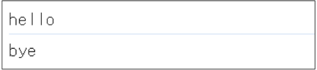

#### 7. Inline Handlers에서의 event 인자 접근

- Inline Handlers에서 원래 DOM 이벤트에 접근하기
- $event 변수를 사용하여 메서드에 전달

```html
<button @click="warning("경고입니다", $event)">Warning</button>
```

```jsx
const warning = function(message, event){
    console.log(message)
    console.log(event)
}

```

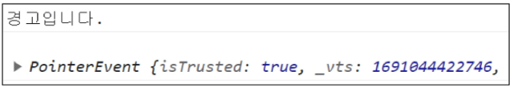

- $event 변수를 전달하는 위치는 상관 없음

```html
<button @click="danger("위험", $event, "합니다")">Danger</button>
```

```jsx
const danger = function(msg1, event, msg2){
    console.log(msg1)
    console.log(event)
    console.log(msg2)
}
```

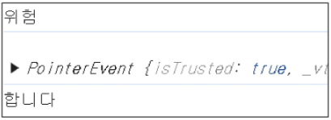

---

### Modifiers

#### 1. Event Modifiers

- Vue에서는 Event Modifiers를 활용해 event.preventDefault()와 같은 구문을 메서드에서 작성하지 않도록 함
- 대신 stop, prevent, self 등 다양한 modifiers를 제공
    - 메서드는 DOM 이벤트에 대한 처리보다는 데이터에 관한 논리를 작성하는 것에 집중하기 위함
    - Modifiers는 chained 되게끔 작성할 수 있으며, 이 때는 작성된 순서로 실행되기 때문에 작성 순서에 유의
    
    ```html
    <form @submit.prevent="onSubmit">...</form>
    a
    <a @click.stop.prevent="onLink">...</a>
    ```
    

#### 2. Event Modifiers 예시

1. form 요소에서 submit 이벤트가 발생하면, submit 이벤트의 기본 동작을 취소하고, onSubmit 메서드를 호출

```html
<form @submit.prevent="onSubmit">
    <input type="submit">
</form>
```

```jsx
const onSubmit = function(){
    console.log("onSubmit")
}
```

2. 첫 번째 a 태그 클릭 시
    1. 버블링 현상으로 인해 detectBubble 메서드가 호출되고 google 페이지로 이동
    
    ```html
    <div>
        <a href="https://www.google.com/">onLink</a>
        <br>
        <a @click.prevent="onLink" href="https://www.google.com/">onLink</a>
        <br>
        <a @click.stop.prevent="onLink" href="https://www.google.com/">onLink</a>
    </div>
    ```
    
    ```jsx
    const detectBubble = function(){
        console.log("detectBubble")
    }
    const onLink = function(){
        console.log("onLink")
    }
    ```
    

3. 두 번째 a 태그 클릭 시
    1. click 이벤트로 인해 onLink 메서드 호출
    2. 버블링 현상으로 인해 detectBubble 메서드가 호출
    3. prevent modifier로 인해 a 태그 이벤트의 기본 동작이 취소되어 페이지가 이동하지 않음
    
    
    

3. 세 번째 a 태그 클릭 시
    1. click 이벤트로 인해 onLink 메서드 호출
    2. stop modifier로 인해 버블링 현상이 중단되어 detectBubble 메서드가 호출되지 않음
    3. prevent modifier로 인해 a 태그 이벤트의 기본 동작이 취소되어 페이지가 이동하지 않음
    
    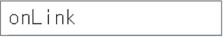
    

#### 3. Key Modifiers

- 키보드 이벤트를 수신할 때 특정 키에 관한 별도 modifiers를 사용할 수 있음
- 예시
    - Enter 키가 입력되었을 때만 onSubmit 이벤트 호출하기
    
    ```html
    <input @keyup.enter="onSubmit">
    ```
    

---

### Form Input Bindings

#### 1. Form Input Bindings (폼 입력 바인딩)

- form을 처리할 때 사용자가 input에 입력하는 값을 실시간으로 JavaScript 상태에 동기화해야 하는 경우
    - 양방향 바인딩
- 양방향 바인딩 방법
    1. v-bind와 v-on을 함께 사용
    2. v-model 사용

## 2. v-bind와 v-on을 함께 사용

1. v-bind를 사용하여 input 요소의 value 속성 값을 입력 값으로 사용
2. v-on을 사용하여 input 이벤트가 발생할 때마다 input 요소의 value 값을 별도 반응형 변수에 저장하는 핸들러를 호출

```html
<p>{{inputText1}}</p>
<input :value="inputText1" @input="onInput">
```

```jsx
const inputText1 = ref("")
const onInput = function(event){
    inputText1.value = event.currentTarget.value
}
```

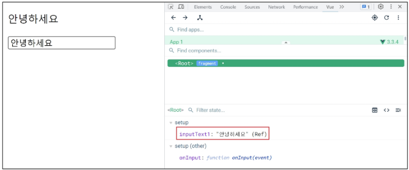

#### 3. v-model

- form input 요소 또는 컴포넌트에서 양방향 바인딩을 만듦

#### 4. v-model 사용

- 사용자 입력 데이터와 반응형 변수를 실시간 동기화
    - IME가 필요한 언어(한국어, 중국어, 일본어 등)의 경우 v-model이 제대로 업데이트되지 않음
    - 해당 언어에 대해 올바르게 응답하려면 v-bind와 v-on 방법을 사용해야 함
    
    ```html
    <p>{{inputText2}}</p>
    <input v-model="inputText2">
    ```
    
    ```jsx
    const inputText2 = ref("")
    ```
    
    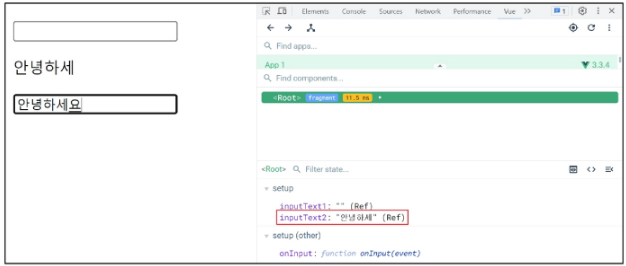
    

#### 5. v-model과 다양한 입력(input) 양식

- v-model은 단순 Text input 뿐만 아니라 Checkbox, Radio, Select 등 다양한 타입의 사용자 입력 방식과 함께 사용 가능

#### 6. Checkbox 활용

1. 단일 체크박스와 boolean 값 활용

```html
<input type="checkbox" id="checkbox" v-model="checked">
<label for="checkbox">{{checked}}</label>
```

```jsx
const checked = ref(false)
```

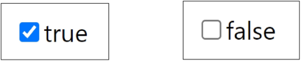

2. 여러 체크박스와 배열 활용
    1. 해당 배열에는 현재 선택된 체크박스의 값이 포함됨
    
    ```html
    <div>Checked names: {{checkedNames}}</div>
    
    <input type="checkbox" id="alice" value="Alice" v-model="checkedNames">
    <label for="alice">Alice</label>
    
    <input type="checkbox" id="bella" value="Bella" v-model="checkedNames">
    <label for="bella">Bella</label>
    ```
    
    ```jsx
    const checkedNames = ref([])
    ```
    
    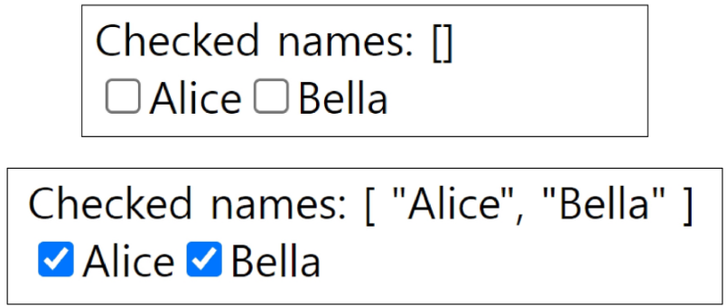
    

#### 7. Select 활용

- select에서 v-model 표현식의 초기 값이 어떤 option과도 일치하지 않는 경우 select 요소는 “선택되지 않은(unselected)” 상태로 렌더링 됨

```html
<div>Selected: {{selected}}</div>

<select v-model="selected">
    <option disabled value="">Please select one</option>
    <option>Alice</option>
    <option>Bella</option>
    <option>Cathy</option>
</select>
```

```jsx
const selected = ref("")
```

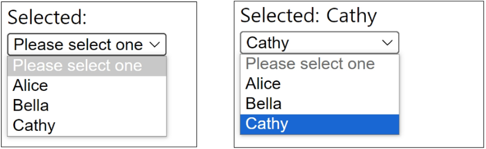

---

### 참고

#### 1. ‘$’ 접두어가 붙은 변수

- Vue 인스턴스 내에서 제공되는 내부 변수
    - 사용자가 지정한 반응형 변수나 메서드와 구분하기 위함
    - 주로 Vue 인스턴스 내부 상태를 다룰 때 사용

#### 2. IME (Input Method Editor)

- 사용자가 입력 장치에서 기본적으로 사용할 수 없는 문자(비영어권 언어)를 입력할 수 있도록 하는 운영 체제 구성 프로그램
- 일반적으로 키보드 키보다 자모가 더 많은 언어에서 사용해야 함
- IME가 동작하는 방식과 Vue의 양방향 바인딩(v-model) 동작 방식이 상충하기 때문에 한국어 입력 시 예상대로 동작하지 않았던 것
