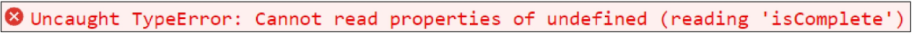
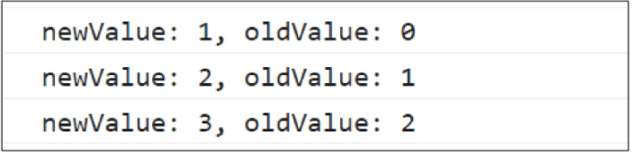

## Vue 03 (2025.05.09)

### Computed Properties

#### 1. computed()

- “계산된 속성”을 정의하는 함수
- 미리 계산된 속성을 사용하여 템플릿에서 표현식을 단순하게 하고 불필요한 반복 연산을 줄임

#### 2. computed가 필요한 경우

```html
<h2>남은 할 일</h2>
<p>{{todos.length > 0 ? "아직 남았다" : "퇴근!"}}</p>
```

```jsx
const todos = ref([
    {text: "Vue 실습"},
    {text: "자격증 공부"},
    {text: "TIL 작성"},
])
```

- 할 일이 남았는지 여부에 따라 다른 메시지를 출력하기
- 템플릿이 복잡해지며 todos에 따라 계산을 수행하게 됨
- 만약 이 계산을 템플릿에 여러 번 사용하는 경우에는 반복이 발생

```html
<h2>남은 할 일</h2>
<p>{{restOfTodos}}</p>
```

```jsx
const {createApp, ref, computed} = Vue
const todos = ref([
    {text: "Vue 실습"},
    {text: "자격증 공부"},
    {text: "TIL 작성"},
])
const restOfTodos = computed(() => {
    return todos.value.length > 0 ? "아직 남았다" : "퇴근!"
})
```

- computed 적용 후
- 반응형 데이터를 포함하는 복잡한 로직의 경우 computed를 활용하여 미리 값을 계산하여 계산된 값을 사용

#### 3. computed 특징

- 반환되는 값은 computed ref이며 일반 refs와 유사하게 계산된 결과를 .value로 참조할 수 있음
    - 템플릿에서는 .value 생략 가능
- computed 속성은 의존된 반응형 데이터를 자동으로 추적
- 의존하는 데이터가 변경될 때만 재평가
    - restOfTodos의 계산은 todos에 의존하고 있음
    - 따라서 todos가 변경될 때만 restOfTodos가 업데이트 됨
    
    ```jsx
    const restOfTodos = computed(() => {
        return todos.value.length > 0 ? "아직 남았다" : "퇴근!"
    })
    ```
    

---

### Computed vs Methods

#### 1. computed와 동일한 로직을 처리할 수 있는 method

- computed 속성 대신 method로도 동일한 기능을 정의할 수 있음

```html
<p>{{getRestOfTodos()}}</p>
```

```jsx
const getRestOfTodos = function(){
    return todos.value.length > 0 ? "아직 남았다" : "퇴근!"
}
```

#### 2. computed와 method 차이

- computed 속성은 의존된 반응형 데이터를 기반으로 캐시(cached) 됨
- 의존하는 데이터가 변경된 경우에만 재평가됨
- 즉, 의존된 반응형 데이터가 변경되지 않는 한 이미 계산된 결과에 대한 여러 참조는 다시 평가할 필요 없이 이전에 계산된 결과를 즉시 반환
- 반면, method 호출은 다시 렌더링이 발생할 때마다 항상 함수를 실행

#### 3. Cache (캐시)

- 데이터나 결과를 일시적으로 저장해두는 임시 저장소
- 이후에 같은 데이터나 결과를 다시 계산하지 않고, 빠르게 접근할 수 있도록 함

#### 4. Cache 예시

- “웹 페이지의 캐시 데이터”
    - 과거 방문한 적이 있는 페이지에 다시 접속할 경우
    - 페이지 일부 데이터를 브라우저 캐시에 저장 후 같은 페이지에 다시 요청 시 모든 데이터를 다시 응답 받는 것이 아닌 일부 캐시된 데이터를 사용하여 더 빠르게 웹 페이지를 렌더링
    
    
    

#### 5. computed와 method의 적절한 사용처

- computed
    - 의존하는 데이터에 따라 결과가 바뀌는 계산된 속성을 만들 때 유용
    - 동일한 의존성을 가진 여러 곳에서 사용할 때 계산 결과를 캐싱하여 중복 계산 방지
- method
    - 단순히 특정 동작을 수행하는 함수를 정의할 때 사용
    - 데이터에 의존하는지 여부와 관계 없이 항상 동일한 결과를 반환하는 함수

#### 6. method와 computed 정리

- computed
    - 의존된 데이터가 변경되면 자동으로 업데이트
- method
    - 호출해야만 실행됨
- 무조건 computed만 사용하는 것이 아니라 사용 목적과 상황에 맞게 computed와 method를 적절히 조합하여 사용

---

### Conditional Rendering

#### 1. v-if

- 표현식 값의 true/false를 기반으로 요소를 조건부로 렌더링
- ‘v-if’ directive를 사용하여 조건부로 렌더링

```html
<p v-if="isSeen">true일 때 보여요</p>
```

```jsx
const isSeen = ref(true)
```

#### 2. v-else

- ‘v-else’ directive를 사용하여 v-if에 대한 else 블록을 나타낼 수 있음

```html
<p v-if="isSeen">true일 때 보여요</p>
<p v-else>false일 때 보여요</p>
<button @click="isSeen = !isSeen">토글</button>
```

```jsx
const isSeen = ref(true)
```

#### 3. v-else-if

- ‘v-else-if’ directive를 사용하여 v-if에 대한 else if 블록을 나타낼 수 있음

```html
<div v-if="name === 'Alice'">Alice입니다</div>
<div v-else-if="name === 'Bella'">Bella입니다</div>
<div v-else-if="name === 'Cathy'">Cathy입니다</div>
<div v-else>아무도 아닙니다</div>
```

```jsx
const name = ref("Cathy")
```

#### 4. 여러 요소에 대한 v-if 적용

- HTML template 요소에 v-if를 사용하여 하나 이상의 요소에 대해 적용할 수 있음
    - v-else, v-else-if 모두 적용 가능
    
    ```html
    <template v-if="name === 'Cathy'">
        <div>Cathy입니다</div>
        <div>나이는 30살입니다</div>
    </template>
    ```
    
    
    

#### 5. HTML <template> element

- 페이지가 로드될 때 렌더링되지 않지만 JavaScript를 사용하여 나중에 문서에서 사용할 수 있도록 하는 HTML을 보유하기 위한 메커니즘
- “보이지 않는 wrapper 역할”

---

### v-if vs v-show

#### 1. v-show

- 표현식 값의 true/falses를 기반으로 요소의 가시성(visibility)을 전환

#### 2. v-show 예시

- v-show 요소는 항상 DOM에 렌더링 되어있음
- CSS display 속성만 전환하기 때문

```html
<div v-show="isShow">v-show</div>
```

```jsx
const isShow = ref(false)
```


#### 3. v-if와 v-show의 적절한 사용처

- v-if (Cheap initial load, expensive toggle)
    - 초기 조건이 false인 경우 아무 작업도 수행하지 않음
    - 토글 비용이 높음
- v-show
    - 초기 조건에 관계 없이 항상 렌더링
    - 초기 렌더링 비용이 더 높음
- 콘텐츠를 매우 자주 전환해야 하는 경우에는 v-show를 실행 중에 조건이 변경되지 않는 경우에는 v-if를 권장

---

### List Rendering

#### 1. v-for

- 소스 데이터(Array, Object, Number, String, Interable)를 기반으로 요소 또는 템플릿 블록을 화면에 반복적으로 렌더링

#### 2. v-for 구조

- v-for는 alias in expression 형식의 특수 구문을 사용

```html
<div v-for="item in items">
    {{item.text}}
</div>
```

- 인덱스(객체에서는 key)에 대한 별칭을 지정할 수 있음

```html
<div v-for="(item, index) in arr"></div>

<div v-for="value in object"></div>
<div v-for="(value, key) in object"></div>
<div v-for="(value, key, index) in object"></div>
```

#### 3. v-for 예시

1. 배열 반복

```html
<div v-for="(item, index) in myArr">
    {{index}} / {{item}}
</div>
```

```jsx
const myArr = ref([
    {name: "Alice", age: 20},
    {name: "Bella", age: 21},
])
```

2. 객체 반복

```html
<div v-for="(value, key, index) in myObj">
    {{index}} / {{key}} / {{value}}
</div>
```

```jsx
const myObj = ref({
    name: "Cathy",
    age: 30,
})
```

#### 4. 여러 요소에 대한 v-for 적용

- HTML template 요소에 v-for를 사용하여 하나 이상의 요소에 대해 반복 렌더링할 수 있음

```html
<ul>
    <template v-for="item in myArr">
        <li>{{item.name}}</li>
        <li>{{item.age}}</li>
        <hr>
    </template>
</ul>
```

```jsx
const myArr = ref([
    {name: "Alice", age: 20},
    {name: "Bella", age: 21},
])
```

#### 5. 중첩된 v-for

- 각 v-for의 하위 영역(scope)은 상위 영역에 접근할 수 있음

```html
<ul v-for="item in myInfo">
    <li v-for="friend in item.friends">
        {{item.name}} - {{friend}}
    </li>
</ul>
```

```jsx
const myInfo = ref([
    {name: "Alice", age: 20, friends: ["Bella", "Cathy", "Dan"]},
    {name: "Bella", age: 21, friends: ["Alice", "Cathy"]},
])
```

---

### v-for with key

#### 1. v-for와 key

- 반드시 v-for와 key를 함께 사용
    - 내부 컴포넌트의 상태를 일관되게 하여 데이터의 예측 가능한 행동을 유지하기 위함
- key는 반드시 각 요소에 대한 고유한 값을 나타낼 수 있는 식별자여야 함

```html
<div v-for="item in items" :key="item.id">
    <!-- content -->
</div>
```

```jsx
let id = 0
const items = ref([
    {id: id++, name: "Alice"},
    {id: id++, name: "Bella"},
])
```

#### 2. 내장 특수 속성 ‘key’의 필요성

- 각 항목이 서로 구분되는 고유 식별자 역할
- number 혹은 string으로만 사용해야 함
- Vue의 내부 가상 DOM 알고리즘이 이전 목록과 새 노드 목록을 비교할 때 각 node를 식별하는 용도로 사용
    - key를 통해 “이 항목은 이 데이터에 해당한다”는 힌트를 줌으로써 변경 시에도 올바른 항목만 효율적으로 업데이트할 수 있음
- Vue 내부 동작 관련된 부분이기에 최대한 작성하려고 노력할 것

#### 3. 올바른 key 선택 기준

- 권장되는 key 값
    - 데이터베이스의 고유 ID
    - 항목 고유 식별자 (예: UUID)
- 피해야 할 key 값
    - 배열 인덱스 (index)
    - 객체 자체

---

### v-for with v-if

#### 1. v-for with v-if

- 동일 요소에 v-for와 v-if를 함께 사용하지 않음
    - 동일한 요소에서 v-if가 v-for보다 우선순위가 더 높기 때문
- v-if에서의 조건은 v-for 범위의 변수에 접근할 수 없음

#### 2. v-for와 v-if 문제 상황

- todo 데이터 중 이미 처리한(isComplete === true) todo만 출력하기
    - v-if가 더 높은 우선순위를 가지므로, v-for 범위의 todo 데이터를 v-if에서 사용할 수 없음
    
    ```html
    <ul>
        <li v-for="todo in todos" v-if="!todo.isComplete" :key="todo.id">
            {{todo.name}}
        </li>
    </ul>
    ```
    
    ```jsx
    let id = 0
    const todos = ref([
        {id: id++, name: "복습", isComplete: true},
        {id: id++, name: "예습", isComplete: false},
        {id: id++, name: "저녁식사", isComplete: true},
        {id: id++, name: "노래방", isComplete: false},
    ])
    ```
    
    
    

#### 3. v-for와 v-if 해결법 2가지

1. computed 활용
2. v-for와 <template> 요소 활용

#### 4. v-for와 v-if 해결법

1. computed를 활용해 이미 필터링된 목록을 반환하여 반복하도록 설정

```html
<ul>
    <li v-for="todo in completeTodos" :key="todo.id">
        {{todo.name}}
    </li>
</ul>
```

```jsx
let id = 0
const todos = ref([
    {id: id++, name: "복습", isComplete: true},
    {id: id++, name: "예습", isComplete: false},
    {id: id++, name: "저녁식사", isComplete: true},
    {id: id++, name: "노래방", isComplete: false},
])
const completeTodos = computed(() => {
    return todos.value.filter((todo) => !todo.isComplete)
})
```

2. v-for와 template 요소를 사용하여 v-if 위치를 이동

```html
<ul>
    <template v-for="todo in todos" :key="todo.id">
        <li v-if="!todo.isComplete">
            {{todo.name}}
        </li>
    </template>
</ul>
```

```jsx
let id = 0
const todos = ref([
    {id: id++, name: "복습", isComplete: true},
    {id: id++, name: "예습", isComplete: false},
    {id: id++, name: "저녁식사", isComplete: true},
    {id: id++, name: "노래방", isComplete: false},
])
```

---

### Watchers

#### 1. watch()

- 하나 이상의 반응형 데이터를 감시하고, 감시하는 데이터가 변경되면 콜백 함수를 호출

#### 2. watch 구조

```jsx
watch(source, (newValue, oldValue) => {
    // do something
})
```

- 첫 번째 인자 (source)
    - watch가 감시하는 대상
        - 반응형 변수
        - 값을 반환하는 함수 등
- 두 번째 인자 (callback function)
    - source가 변경될 때 호출되는 콜백 함수
        1. newValue
            1. 감시하는 대상이 변화된 값
        2. oldValue (optional)
            1. 감시하는 대상의 기존 값

#### 3. watch 기본 동작

```html
<button @click="count++">Add 1</button>
<p>Count: {{count}}</p>
```

```jsx
watch(count, (newValue, oldValue) => {
    console.log(`newValue: ${newValue}, oldValue: ${oldValue}`)
})
```



#### 4. watch 예시

- 감시하는 변수에 변화가 생겼을 때 연관 데이터 업데이트하기

```html
<input v-model="message">
<p>Message length: {{messageLength}}</p>
```

```jsx
const message = ref("")
const messageLength = ref(0)
watch(message, (newValue) => {
    messageLength.value = newValue.length
})
```


#### 5. 여러 source를 감시하는 watch

- 배열을 활용하여 여러 대상을 감시할 수 있음

```jsx
watch([foo, bar], ([newFoo, newBar], [prevFoo, prevBar]) => {
    /* ... */
})
```

---

### computed vs watch

#### 1. Computed와 Watchers

- computed와 watch 모두 의존(감시)하는 원본 데이터를 직접 변경하지 않음

```python
1. Computed
	# 동작
		"""
		의존하는 데이터 속성의 계산된 값을 반환
		"""
		
	# 사용 목적
		"""
		계산한 값을 캐싱하여 재사용 중복 계산 방지
		"""
		
	# 사용 예시
		"""
		연산된 길이, 필터링된 목록 계산 등
		"""

2. Watchers
	# 동작
		"""
		특정 데이터 속성의 변화를 감시하고 작업을 수행 (side-effects)
		"""
		
	# 사용 목적
		"""
		데이터 변화에 따른 특정 작업을 수행
		"""
		
	# 사용 예시
		"""
		DOM 변경, 다른 비동기 작업 수행, 외부 API와 연동 등
		"""

3. 공통점
	"""
	데이터의 변화를 감지하고 처리
	"""
```


---

### Lifecycle Hooks

#### 1. Lifecycle Hooks

- Vue 컴포넌트의 생성부터 소멸까지 각 단계에서 실행되는 함수

#### 2. Lifecycle Hooks Diagram

- 컴포넌트의 생애 주기 중간 중간에 함수를 제공
- 개발자는 컴포넌트의 특정 시점에 원하는 로직을 실행할 수 있음


#### 3. 주요 Lifecycle Hooks

- 생성 단계 / 마운트 단계 / 업데이트 단계 / 소멸 단계 등 다양한 단계 존재
- 가장 일반적으로 사용되는 것은 onMounted, onUpdated, onUnmounted

#### 4. 주요 Lifecycle Hooks - Mounting

- Vue 컴포넌트 인스턴스가 초기 렌더링 및 DOM 요소 생성이 완료된 후 특정 로직을 수행하기

```jsx
const {createApp, ref, onMounted} = Vue
const app = createApp({
    setup(){
        onMounted(() => {
            console.log("mounted")
        })
    }
})
```


#### 5. 주요 Lifecycle Hooks - Updating

- 반응형 데이터의 변경으로 인해 컴포넌트의 DOM이 업데이트된 후 특정 로직을 수행하기

```html
<button @click="count++">Add 1</button>
<p>Count: {{count}}</p>
<p>{{message}}</p>
```

```jsx
const {createApp, ref, onUpdated} = Vue
const count = ref(0)
const message = ref(null)
onUpdated(() => {
    message.value = "updated!"
})
```


#### 6. Lifecycle Hooks with Cat API

- Mounting 시점에 Cat API에 요청을 보내고 애플리케이션 시작하기

```jsx
const {createApp, ref, onMounted} = Vue
const getCatImage = function(){
    axios({
        method: "get",
        url: URL,
    })
        .then((response) => {
            const imgUrl = response.data[0].url
            return imgUrl
        })
        .then((imgData) => {
            const imgElem = document.createElement("img")
            imgElem.setAttribute("src", imgData)
            document.body.appendChild(imgElem)
        })
        .catch((error) => {
            console.log("실패했다옹")
        })
}
const app = createApp({
    setup(){
        onMounted(() => {
            getCatImage()
        })
    }
})
```

---

### Vue Style Guide

#### 1. Vue Style Guide

- Vue의 스타일 가이드 규칙은 우선순위에 따라 4가지 범주로 나뉨
- 규칙 범주
    - 우선순위 A
        - 필수 (Essential)
            - 오류를 방지하는 데 도움이 되므로 어떤 경우에도 규칙을 학습하고 준수
    - 우선순위 B
        - 적극 권장 (Strongly Recommended)
            - 가독성 및/또는 개발자 경험을 향상시킴
            - 규칙을 어겨도 코드는 여전히  실행되겠지만, 정당한 사유가 있어야 규칙을 위반할 수 있음
    - 우선순위 C
        - 권장 (Recommended)
            - 일관성을 보장하도록 임의의 선택을 할 수 있음
    - 우선순위 D
        - 주의 필요 (Use with Caution)
            - 잠재적 위험 특성을 고려함

#### 2. 우선순위 A

1. v-for에 key 작성하기


2. 동일 요소에 v-if와 v-for 함께 사용하지 않기


---

### 참고

#### 1. computed 주의사항

1. computed의 반환 값은 변경하지 말 것
    1. computed의 반환 값은 의존하는 데이터의 파생된 값
        1. 이미 의존하는 데이터에 의해 계산이 완료된 값
    2. 일종의 snapshot이며 의존하는 데이터가 변경될 때만 새 snapshot이 생성됨
    3. 계산된 값은 읽기 전용으로 취급되어야 하며 변경되어서는 안 됨
    4. 대신 새 값을 얻기 위해서는 의존하는 데이터를 업데이트해야 함
2. computed에서 reverse() 및 sort() 사용 시 원본 배열을 변경하기 때문에 원본 배열의 복사본을 만들어서 진행해야 함

```jsx
// 바람직하지 않은 방식
return numbers.reverse()

// 바람직한 방식
return [...numbers].reverse()
```

#### 2. Lifecycle Hooks 주의사항

- Lifecycle Hooks는 동기적으로 작성해야 함
- Vue는 컴포넌트가 초기화될 때 모든 Hooks를 한 번에 스캔하고 준비하기 때문
- 만약 비동기로(예: setTimeout) 훅을 등록하려고 하면, 이미 라이프사이클 단계가 지나간 후에 hooks를 설정하는 상황이 발생
- 비동기로 작성할 경우 Vue는 해당 훅을 인식하지 못하며, 원래 의도한 타이밍에 실행되지 않게 됨
- Lifecycle Hooks는 컴포넌트 로딩 과정에서 동기적으로 정의함으로써, Vue가 올바른 타이밍에 해당 로직을 수행할 수 있도록 보장해야 함

```jsx
setTimeout(() => {
    onMounted(() => {
        console.log("이 코드는 실행되지 않습니다!")
    })
}, 100)
```

#### 3. v-for와 배열을 활용한 “필터링 / 정렬” 활용

- 원본 데이터를 수정하거나 교체하지 않고, 필터링하거나 정렬된 새로운 데이터를 표시하는 방법
    1. computed 활용
        1. 원본 기반으로 필터링된 새로운 결과를 생성
        
        ```html
        <li v-for="number in evenNumbers">
            {{number}}
        </li>
        ```
        
        ```jsx
        const numbers = ref([1, 2, 3, 4, 5])
        const evenNumbers = computed(() => {
            return numbers.value.filter((number) => number % 2 === 0)
        })
        ```
        
    2. method 활용
        1. computed가 불가능한 중첩된 v-for에 경우 사용
        
        ```html
        <ul v-for="numbers in numberSets">
            <li v-for="num in evenNumbers(numbers)">{{num}}</li>
        </ul>
        ```
        
        ```jsx
        const numberSets = ref([
            [1, 2, 3, 4, 5],
            [6, 7, 8, 9, 10],
        ])
        const evenNumbers = function(numbers){
            return numbers.filter((number) => number % 2 === 0)
        }
        ```
        

#### 4. 배열 변경 관련 메서드

- v-for와 배열을 함께 사용 시 배열의 메서드를 주의해서 사용해야 함
    1. 변화 메서드
        1. 호출하는 원본 배열을 변경
        
        ```jsx
        1. push()
        
        2. pop()
        
        3. shift()
        
        4. unshift()
        
        5. splice()
        
        6. sort()
        
        7. reverse()
        ```
        
    2. 배열 교체
        1. 원본 배열을 수정하지 않고, 항상 새 배열을 반환
        
        ```jsx
        1. filter()
        
        2. concat()
        
        3. slice()
        ```
        

#### 5. Todo 애플리케이션 구현

- v-model, v-on, v-bind, v-for를 활용

```html
<form @submit.prevent="addTodo">
    <input v-model="newTodo">
    <button>Add Todo</button>
</form>
<ul>
    <li v-for="todo in todos" :key="todo.id">
        {{todo.text}}
        <button @click="removeTodo(todo)">X</button>
    </li>
</ul>
```

```jsx
let id = 0
const newTodo = ref(null)
const todos = ref([
    {id: id++, text: "Learn HTML"},
    {id: id++, text: "Learn JS"},
    {id: id++, text: "Learn Vue"},
])
const addTodo = function(){
    todos.value.push({id: id++, text: newTodo.value})
    newTodo.value = null
}
const removeTodo = function(selectedTodo){
    todos.value = todos.value.filter((todo) => todo !== selectedTodo)
}
```