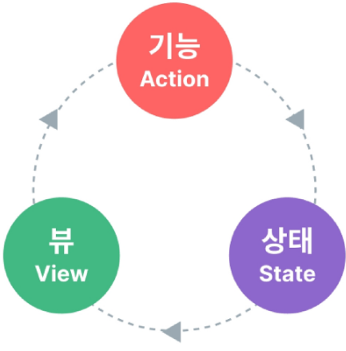
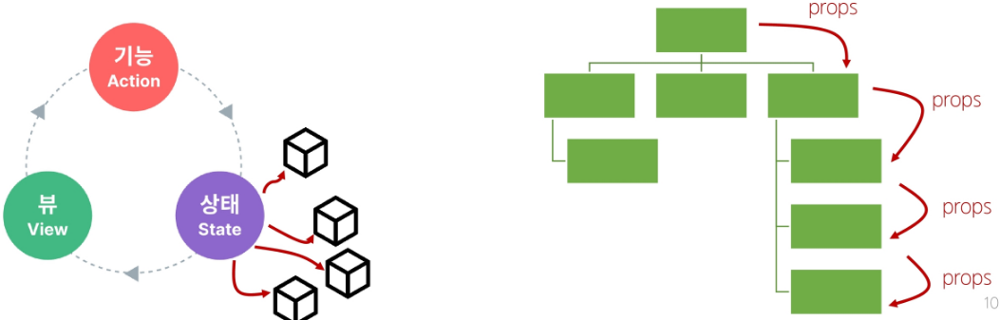
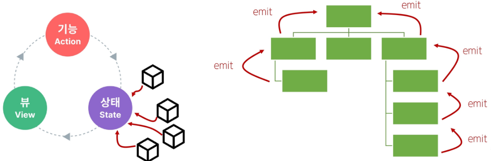
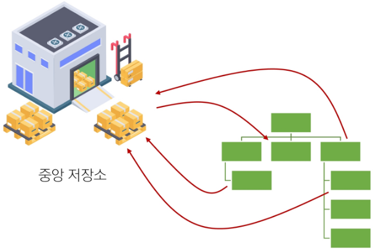
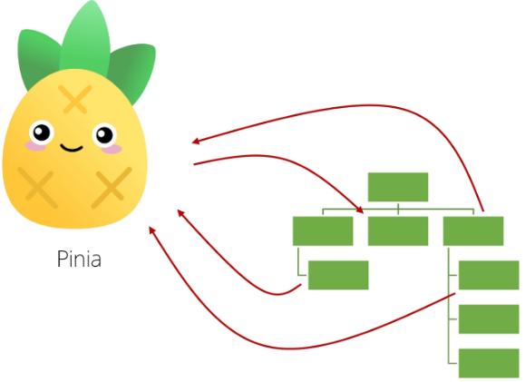
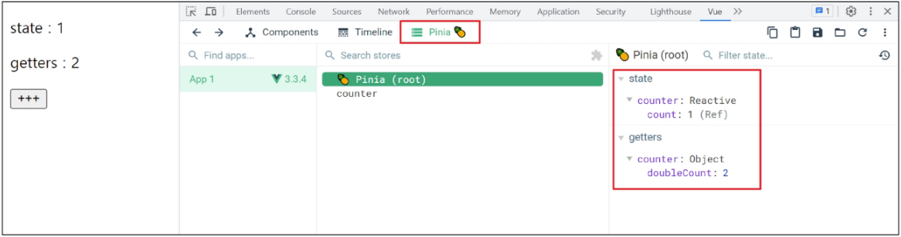
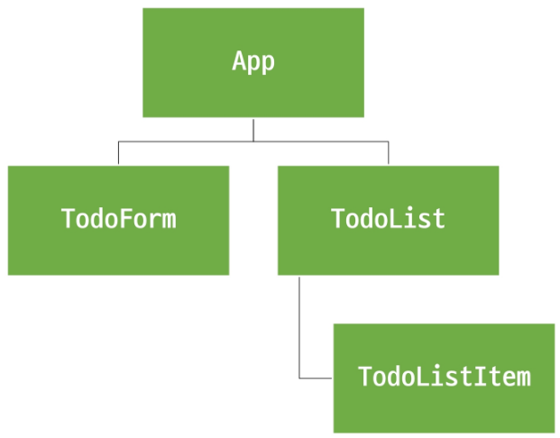
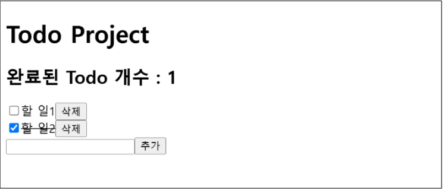
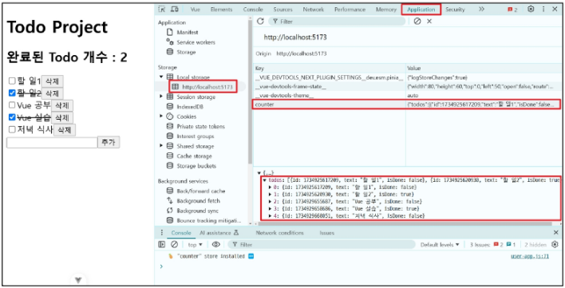

## Vue 07 (2025.05.15)

### State Management

#### 1. State Management (상태 관리)

- Vue 컴포넌트는 이미 반응형 상태를 관리하고 있음
- 상태 === 데이터

#### 2. 컴포넌트 구조의 단순화

1. 상태 (State)
    1. 앱 구동에 필요한 기본 데이터
2. 뷰 (View)
    1. 상태를 선언적으로 매핑하여 시각화
3. 기능 (Actions)
    1. 뷰에서 사용자 입력에 대해 반응적으로 상태를 변경할 수 있게 정의된 동작
    
    ```html
    <template>
      <!-- 뷰(View) -->
      <div>{{ count }}</div>
    </template>
    
    <script setup>
      import { ref } from 'vue';
    
      // 상태 (State)
      const count = ref(0)
    
      // 기능 (Actions)
      const increment = () => {
        count.value++
      }
    </script>
    ```
    

- “단방향 데이터 흐름”의 간단한 표현



#### 3. 상태 관리의 단순성이 무너지는 시점

- “여러 컴포넌트가 상태를 공유할 때”
    1. 여러 뷰가 동일한 상태에 종속되는 경우
        1. 공유 상태를 공통 조상 컴포넌트로 “끌어올린” 다음 props로 전달하는 것
        2. 하지만 계층 구조가 깊어질 경우 비효율적, 관리가 어려워짐
        
        
        
    2. 서로 다른 뷰의 기능이 동일한 상태를 변경시켜야 하는 경우
        1. 발신(emit)된 이벤트를 통해 상태의 여러 복사본을 변경 및 동기화하는 것
        2. 마찬가지로 관리의 패턴이 깨지기 쉽고, 유지 관리할 수 없는 코드가 됨
        
        
        

#### 4. 해결책

- 각 컴포넌트의 공유 상태를 추출하여, 전역에서 참조할 수 있는 저장소에서 관리





- 컴포넌트 트리는 하나의 큰 View가 되고 모든 컴포넌트는 트리 계층 구조에 관계 없이 상태에 접근하거나 기능을 사용할 수 있음
- Vue의 공식 상태 관리 라이브러리 === “Pinia”

---

### State Management Library (Pinia)

#### 1. Pinia

- Vue 공식 상태 관리 라이브러리

#### 2. Pinia 구성 요소

```jsx
1. store

2. state

3. getters

4. actions

5. plugin
```

```jsx
// stores/counter.js
import { ref, computed } from 'vue'
import { defineStore } from 'pinia'

export const useCounterStore = defineStore('counter', () => {
	// state
	const count = ref(0)
	
	// getters
	const doubleCount = computed(() => count.value * 2)
	
	// actions
	const increment = () => {
		count.value++
	}
	
	// 반환 값
	return {count, doubleCount, increment}
})
```

#### 3. Pinia 구성 요소 - ‘store’

- 중앙 저장소
- 모든 컴포넌트가 공유하는 상태, 기능 등일 작성됨
- defineStore()의 반환 값의 이름은 use와 store를 사용하는 것을 권장
- defineStore()의 첫 번째 인자는 애플리케이션 전체에 걸쳐 사용하는 store의 고유 ID

```jsx
// stores/counter.js
import { ref, computed } from 'vue'
import { defineStore } from 'pinia'

export const useCounterStore = defineStore('counter', () => {
	const count = ref(0)
})
```

#### 4. Pinia 구성 요소 - ‘state’

- 반응형 상태 (데이터)
- ref() === state

```jsx
// stores/counter.js
import { ref, computed } from 'vue'
import { defineStore } from 'pinia'

export const useCounterStore = defineStore('counter', () => {
	// state
	const count = ref(0)
})
```

#### 5. Pinia 구성 요소 - ‘getters’

- 계산된 값
- computed() === getters

```jsx
// stores/counter.js
import { ref, computed } from 'vue'
import { defineStore } from 'pinia'

export const useCounterStore = defineStore('counter', () => {
	// state
	const count = ref(0)
	
	// getters
	const doubleCount = computed(() => count.value * 2)
})
```

#### 6. Pinia 구성 요소 - ‘actions’

- 메서드
- function() === actions

```jsx
// stores/counter.js
import { ref, computed } from 'vue'
import { defineStore } from 'pinia'

export const useCounterStore = defineStore('counter', () => {
	// state
	const count = ref(0)
	
	// getters
	const doubleCount = computed(() => count.value * 2)
	
	// actions
	const increment = () => {
		count.value++
	}
})
```

#### 7. Setup Stores의 반환 값

- pinia의 상태들을 사용하려면 반드시 반환해야 함
- store에서는 공유하지 않는 private한 상태 속성을 가지지 않음

```jsx
// stores/counter.js
import { ref, computed } from 'vue'
import { defineStore } from 'pinia'

export const useCounterStore = defineStore('counter', () => {
	// state
	const count = ref(0)
	
	// getters
	const doubleCount = computed(() => count.value * 2)
	
	// actions
	const increment = () => {
		count.value++
	}
	
	// 반환 값
	return {count, doubleCount, increment}
})
```

#### 8. Pinia 구성 요소 - ‘plugin’

- 애플리케이션의 상태 관리에 필요한 추가 기능을 제공하거나 확장하는 도구나 모듈
- 애플리케이션의 상태 관리를 더욱 간편하고 유연하게 만들어주며 패키지 매니저로 설치 이후 별도 설정을 통해 추가됨

#### 9. Pinia 구성 요소 정리

- Pinia는 store라는 저장소를 가짐
- store는 state, getters, actions으로 이루어지며 각각 ref(), computed(), function()과 동일함

---

### Pinia 구성 요소 활용

#### 1. State

- 각 컴포넌트 깊이에 관계 없이 store 인스턴스로 state에 접근하여 직접 읽고 쓸 수 있음
- 만약 store에 state를 정의하지 않았다면 컴포넌트에서 새로 추가할 수 없음

```html
<!-- App.vue -->
<template>
	<div>
		<p>state: {{store.count}}</p>
	</div>
</template>
```

```jsx
// App.vue
import {useCounterStore} from "@/stores/counter"

const store = useCounterStore()

// state 참조 및 변경
console.log(store.count)
const newNumber = store.count + 1
```

#### 2. Getters

- store의 모든 getters 또한 state처럼 직접 접근할 수 있음

```html
<!-- App.vue -->
<template>
	<div>
		<p>getters: {{store.doubleCount}}</p>
	</div>
</template>
```

```jsx
// App.vue
console.log(store.doubleCount)
```

#### 3. Actions

- store의 모든 actions 또한 직접 접근 및 호출할 수 있음
- getters와 달리 state 조작, 비동기 API 호출이나 다른 로직을 진행할 수 있음

```html
<!-- App.vue -->
<template>
	<div>
		<button @click="store.increment()">+++</button>
	</div>
</template>
```

```jsx
// App.vue
store.increment()
```

#### 4. Vue devtools로 Pinia 구성 요소 확인하기



---

### Pinia 실습

#### 1. Pinia를 활용한 Todo 프로젝트 구현

- Todo CRUD 구현
- Todo 개수 계산
    - 완료된 Todo 개수

#### 2. 컴포넌트 구성



#### 3. 사전 준비

- 초기 생성된 컴포넌트 모두 삭제 (App.vue 제외)
- src/assets 내부 파일 모두 삭제
- main.js 해당 코드 삭제

```jsx
// main.js
import "./assets/main.css"
```

#### 4. 금일 최종 코드

1. counter.js

```jsx
// stores/counter.js
import { ref, computed } from 'vue'
import { defineStore } from 'pinia'

export const useCounterStore = defineStore('counter', () => {
  let id = 0

  // 사용자가 값을 CUD할 때 반응할 수 있도록 반응형으로 작성
  const todos = ref([
    // todo 객체들을 만들기
    // input:checkbox에 쓰일 id도 필요하고, v-for로 순회할 때 쓸 key도 필요함
    {id: id++, text: "vue 공부", isDone: false},
    {id: id++, text: "JS 공부", isDone: false},
    {id: id++, text: "django 공부", isDone: true},
  ])

  const addTodo = function(todoText){
    todos.value.push({
      id: id++,
      isDone: false,
      text: todoText,
    })
  }
  
  const deleteTodo = function(selectedId){
    /*
      넘겨 받은 id 값을 기준으로,
      내가 가진 todos를 전체 순회하면서,
      각각의 todo 객체가 가진 id와 비교함
      그리고 비교한 결과가 true인 값을 반환할 때의 todo들만 모아서,
      새로운 배열을 만듦
    */
    todos.value = todos.value.filter(todo => todo.id != selectedId)
  }

  const updateTodo = (selectedId) => {
    todos.value = todos.value.map((todo) => {
      if(todo.id === selectedId){
        todo.isDone = !todo.isDone
      }

      return todo
    })
  }

  return{
    todos,
    addTodo,
    deleteTodo,
    updateTodo,
  }
})
```

2. App.vue

```html
<!-- App.vue -->
<template>
  <div>
    <h1>Todo Project</h1>
    <TodoForm />
    <TodoList />
  </div>
</template>

<script setup>
  import TodoForm from './components/TodoForm.vue';
  import TodoList from './components/TodoList.vue';
</script>

<style scoped>

</style>
```

3. TodoForm.vue

```html
<!-- components/TodoForm.vue -->
<template>
  <!--
    store.addTodo(todoText)를 써도 되는데,
    따로 함수를 만들어서 사용함
    왜냐하면 하나의 함수는 하나의 기능만을 정의해야 하기 때문
  -->
  <form @submit.prevent="addTodo">
    <!-- 양방향 바인딩으로, 사용자가 입력한 값을 사용하자 -->
    <input type="text" v-model="todoText">
    <button>CREATE</button>
  </form>
</template>

<script setup>
  import { ref } from 'vue';
  import { useCounterStore } from '@/stores/counter';

  const store = useCounterStore()
  const todoText = ref("")
  const addTodo = function(){
    store.addTodo(todoText.value)
    todoText.value = ""
  }
</script>

<style scoped>

</style>
```

4. TodoList.vue

```html
<!-- components/TodoList.vue -->
<template>
  <div>
    <!--
      v-for는 반복문을 실행한 것일 뿐이고,
      TodoListItem 컴포넌트에게 todo 정보를 prop시켜 주자
    -->
    <TodoListItem
      v-for="todo in store.todos"
      :key="todo.id"
      :todo="todo"
    />
  </div>
</template>

<script setup>
  import TodoListItem from './TodoListItem.vue';
  import { useCounterStore } from '@/stores/counter';

  const store = useCounterStore()
</script>

<style scoped>

</style>
```

5. TodoListItem.vue

```html
<!-- components/TodoListItem.vue -->
<template>
  <div>
    <input type="checkbox" :id="todo.id" v-model="todo.isDone">
    <!--
      label의 for와 같은 값을 가진 id를 찾아서,
      label에 작성된 textContent를 click하면,
      찾아둔 동일 id를 가진 요소가 focusing됨
    -->
    <label :for="todo.id">{{todo.text}}</label>
    <button @click="onDeleteTodo()">삭제</button>
  </div>
</template>

<script setup>
  import { useCounterStore } from '@/stores/counter';
  import { ref, watch } from 'vue';

  const props = defineProps({
    todo: Object
  })
  const store = useCounterStore()
  const isDone = ref(props.todo.isDone)

  watch(isDone, () => {
    store.updateTodo(props.todo.id)
  })

  const onDeleteTodo = () => {
    store.deleteTodo(props.todo.id)
  }
</script>

<style scoped>

</style>
```

---

### 수정과 삭제 구현 방식

#### 1. 수정과 삭제 구현에 대한 2가지 관점

1. In-place 방식 (하나만 수정/삭제)
    1. 배열 전체 재생성 없이 필요한 항목만 바로 수정 또는 제거
2. 전체 배열 재생성 방식
    1. 배열을 순회하면서 특정 조건을 만족하지 않으면 누락하거나, 필요한 변경 사항만 반영해 새로운 배열을 만든 뒤 기존 배열을 재할당
- 두 가지 접근 모두 성능과 가독성 면에서 큰 차이가 없는 경우가 많지만, 프로젝트나 팀 컨벤션에 따라 방식이 달라질 수 있음
- 중요한 것은 무엇을 의도하고 있는지(단일 항목 수정/삭제 vs 전체 재생성)를 명확히 알고 선택하는 것

---

### Counting Todo

#### 1. 완료된 todo 개수 계산

- todos 배열의 길이 값을 반환하는 함수 doneTodosCount 작성 (getters)

```jsx
// stores/counter.js
const doneTodosCount = computed(() => {
	const doneTodos = todos.value.filter((todo) => todo.isDone)
	return doneTodos.length
})

return { todos, addTodo, deleteTodo, updateTodo, doneTodosCount }
```

- App 컴포넌트에서 doneTodosCount getter를 참조

```html
<!-- App.vue -->
<div>
	<h1>Todo Project</h1>
	<h2>완료된 Todo 개수: {{store.doneTodosCount}}</h2>
	<TodoList />
	<TodoForm />
</div>
```

```jsx
// App.vue
import { useCounterStore } from "@/stores/counter"
const store = useCounterStore()
```



---

### Local Storage

#### 1. Local Storage

- 브라우저 내에 key-value 쌍을 저장하는 웹 스토리지 객체

#### 2. Local Storage 특징

- 페이지를 새로 고침하고 브라우저를 다시 실행해도 데이터가 유지
- 쿠키와 다르게 네트워크 요청 시 서버로 전송되지 않음
- 여러 탭이나 창 간에 데이터를 공유할 수 있음

#### 3. Local Storage 사용 목적

- 웹 애플리케이션에서 사용자 설정, 상태 정보, 캐시 데이터 등을 클라이언트 측에서 보관하여 웹사이트의 성능을 향상시키고, 사용자 경험을 개선하기 위함

#### 4. pinia-plugin-persistedstate

- Pinia의 플러그인(plugin) 중 하나
- 웹 애플리케이션의 상태(state)를 브라우저의 local storage나 session storage에 영구적으로 저장하고 복원하는 기능을 제공

#### 5. pinia-plugin-persistedstate 설정

- 설치 및 등록
    - 설치 명령어
        - `npm i pinia-plugin-persistedstate`
    - 등록
    
    ```jsx
    // main.js
    import piniaPluginPersistedstate from "pinia-plugin-persistedstate"
    
    const app = createApp(App)
    const pinia = createPinia()
    
    pinia.use(piniaPluginPersistedstate)
    
    // app.use(createPinia())
    app.use(pinia)
    
    app.mount("#app")
    ```
    
    - defineStore()의 3번째 인자로 관련 객체 추가
    
    ```jsx
    // stores/counter.js
    export const useCounterStore = defineStore("counter", () => {
    	...,
    	return {todos, addTodo, deleteTodo, updateTodo, doneTodosCount}
    }, {persist: true})
    ```
    

- 적용 결과
    - 개발자 도구 → Application → Local Storage
    - 브라우저의 Local Storage에 저장되는 todos state 확인
    
    
    

---

### 참고

#### 1. 모든 데이터를 store에서 관리해야 할까?

- Pinia를 사용한다고 해서 모든 데이터를 state에 넣어야 하는 것은 아님
- pass props, emit event를 함께 사용하여 애플리케이션을 구성해야 함
- 상황에 따라 적절하게 사용하는 것이 필요

#### 2. Pinia 사용 시기

- Pinia는 공유된 상태를 관리하는 데 유용하지만, 구조적인 개념에 대한 이해와 시작하는 비용이 큼
- 애플리케이션이 단순하다면 Pinia가 없는 것이 더 효율적일 수 있음
- 그러나 중대한 규모의 SPA를 구축하는 경우 Pinia는 자연스럽게 선택할 수 있는 단계가 오게 됨
- 결과적으로 적절한 상황에서 활용했을 때 Pinia 효용을 극대화할 수 있음