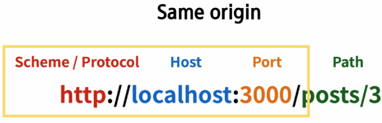
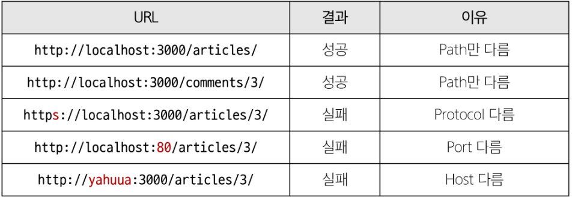
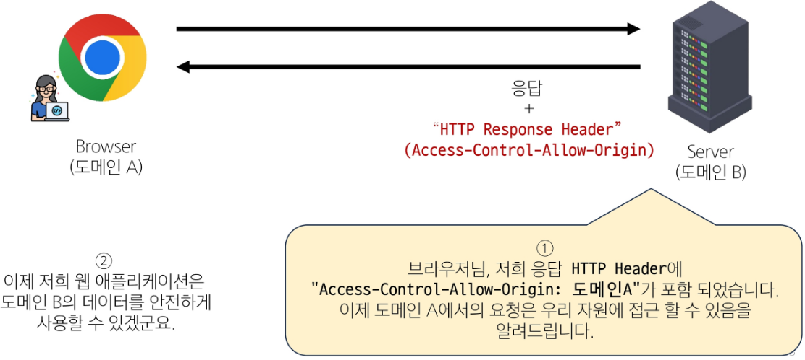

## Vue with DRF 01 (2025.05.19)

### CORS Policy

#### 1. SOP (Same-origin policy)

- 동일 출처 정책
- 어떤 출처(Origin)에서 불러온 문서나 스크립트가 다른 출처에서 가져온 리소스와 상호 작용하는 것을 제한하는 보안 방식
- “다른 곳에서 가져온 자료는 일단 막는다”
- 웹 애플리케이션의 도메인이 다른 도메인의 리소스에 접근하는 것을 제어하여 사용자의 개인 정보와 데이터의 보안을 보호하고, 잠재적인 보안 위협을 방지
- 잠재적으로 해로울 수 있는 문서를 분리함으로써 공격받을 수 있는 경로를 줄임

#### 2. Origin (출처)

- URL의 Protocol, Host, Port를 모두 포함하여 “출처”라고 부름
- Samew Origin 예시
    - 아래 세 영역이 일치하는 경우에만 동일 출처(Same-origin)로 인정
    
    
    
    - http://localhost:3000/articles/3/을 기준으로 동일 출처 여부를 비교
    
    
    

#### 3. CORS policy의 등장

- 기본적으로 웹 브라우저는 같은 출처에서만 요청하는 것을 허용하며, 다른 출처로의 요청은 보안상의 이유로 차단됨
    - SOP에 의해 다른 출처의 리소스와 상호작용 하는 것이 기본적으로 제한되기 때문
- 하지만 현대 웹 애플리케이션은 다양한 출처로부터 리소스를 요청하는 경우가 많기 때문에 CORS 정책이 필요하게 되었음
- CORS는 웹 서버가 리소스에 대한 서로 다른 출처 간 접근을 허용하도록 선택할 수 있는 기능을 제공

#### 4. CORS (Cross-Origin Resource Sharing)

- 교차 출처 리소스 공유
- 특정 출처에서 실행 중인 웹 애플리케이션이 다른 출처의 자원에 접근할 수 있는 권한을 부여하도록 브라우저에 알려주는 체제
- 만약 다른 출처의 리소스를 가져오기 위해서는 이를 제공하는 서버가 브라우저에게 다른 출처지만 접근해도 된다는 사실을 알려야 함
- “CORS policy (교차 출처 리소스 공유 정책)”

#### 5. CORS Policy (Cross-Origin Resource Sharing Policy)

- 교차 출처 리소스 공유 정책
- 다른 출처에서 온 리소스를 공유하는 것에 대한 정책
- 서버에서 설정되며, 브라우저가 해당 정책을 확인하여 요청이 허용되는지 여부를 결정
- 다른 출처의 리소스를 불러오려면 그 다른 출처에서 올바른 CORS header를 포함한 응답을 반환해야 함

#### 6. CORS 적용 방법



#### 7. CORS policy 정리

- 웹 애플리케이션이 다른 도메인에 있는 리소스에 안전하게 접근할 수 있도록 허용 또는 차단하는 보안 메커니즘
- 서버가 약속된 CORS Header를 포함하여 응답한다면 브라우저는 해당 요청을 허용
- 서버에서 CORS Header를 만들어야 함

---

### CORS Headers 설정

#### 1. CORS Headers 설정하기

- Django에서는 django-cors-headers 라이브러리 활용
- 손쉽게 응답 객체에 CORS header를 추가해주는 라이브러리

#### 2. django-cors-headers 사용하기

- 설치
    - 명령어
        - `pip install django-cors-headers`
    - 관련 코드 작성
    
    ```python
    # settings.py
    INSTALLED_APPS = [
    	...,
    	"corsheaders",
    	...,
    ]
    MIDDLEWARE = [
    	...,
    	"corsheaders.middleware.CorsMiddleware",
    	"django.middleware.common.CommonMiddleware",
    	...,
    ]
    # CORS를 허용할 Vue 프로젝트의 Domain 등록
    CORS_ALLOWED_ORIGINS = [
    	"http://127.0.0.1:5173",
    	"http://localhost:5173",
    ]
    ```
    

---

### 코드

#### 1. 금일 최종 코드

1. router/index.js

```jsx
// router/index.js
import { createRouter, createWebHistory } from 'vue-router'
import ArticleView from '@/views/ArticleView.vue'
import DetailView from '@/views/DetailView.vue'
import CreateView from '@/views/CreateView.vue'
// import SignUpView from '@/views/SignUpView.vue'
// import LogInView from '@/views/LogInView.vue'

const router = createRouter({
  history: createWebHistory(import.meta.env.BASE_URL),
  routes: [
    {
      path: '/',
      name: 'ArticleView',
      component: ArticleView
    },
    {
      path: '/articles/:id',
      name: 'DetailView',
      component: DetailView
    },
    {
      path: '/create',
      name: 'CreateView',
      component: CreateView
    },
    {
      path: '/signup',
      name: 'SignUpView',
      component: SignUpView
    },
    {
      path: '/login',
      name: 'LogInView',
      component: LogInView
    }
  ]
})

export default router
```

2. stores/articles.js

```jsx
// stores/articles.js
import axios from "axios"
import { ref, computed } from 'vue'
import { defineStore } from 'pinia'

export const useArticleStore = defineStore('article', () => {
  // 해야 할 일
  // 1. axios 요청으로 api/v1/articles에 GET 요청을 보낼 함수 작성
  // 2. 그 게시글 조회 함수를 어딘가에서 요청을 보내야 함
  const articles = ref([
    {id: 1, title: "title 1", content: "content 1"},
    {id: 2, title: "title 2", content: "content 2"},
  ])

  // 자주 요청을 보내게 될 API_URL 문자열로 지정
  const API_URL = "http://127.0.0.1:8000"
  const getArticles = function(){
    axios({
      method: "GET",
      url: `${API_URL}/api/v1/articles`,
    })
      .then(res => {
        articles.value = res.data
      })
      .catch(err => console.log(err))
  }
  
  return {
    articles, API_URL,
    getArticles,
  }
}, { persist: true })
```

3. components/ArticleListItem.vue

```html
<!-- components/ArticleListItem.vue -->
<template>
  <div>
    <h5>{{ article.id }}</h5>
    <p>{{ article.title }}</p>
    <p>{{ article.content }}</p>
    <!-- 디테일 페이지로 이동할 수 있는 링크를 만드는 방법 2가지 -->
    <!-- RouterLink or router.push -->
    <RouterLink :to="{name: 'DetailView', params: {id: article.id}}">[DETAIL]</RouterLink>
    <hr>
  </div>
</template>

<script setup>
  import { RouterLink } from "vue-router";
  
  const props = defineProps({
    article: Object,
  })
</script>
```

4. components/ArticleList.vue

```html
<!-- components/ArticleList.vue -->
<template>
  <div>
    <h3>Article List</h3>
    <!--
      하위 컴포넌트에서 데이터 사용할 수 있도록 prop
    -->
    <ArticleListItem
      v-for="article in store.articles"
      :key="article.id"
      :article="article"
    />
  </div>
</template>

<script setup>
  import ArticleListItem from '@/components/ArticleListItem.vue'
  import {useArticleStore} from "@/stores/articles.js"

  const store = useArticleStore()
</script>
```

5. views/ArticleView.vue

```html
<!-- views/ArticleView.vue -->
<template>
  <div>
    <h1>Article page</h1>
    <ArticleList />
    <RouterLink :to="{name: 'CreateView'}">[CREATE]</RouterLink>
  </div>
</template>

<script setup>
  import ArticleList from "@/components/ArticleList.vue"
  import {useArticleStore} from "@/stores/articles.js"
  import {onMounted} from "vue"
  import { RouterLink } from "vue-router";

  const store = useArticleStore()
  // 이 컴포넌트가 mount될 때 게시글 전체 조회
  // onMounted 함수가 실행되었을 때, 어떤 일을 수행하도록 하기 => 함수 실행 
  onMounted(() => {
    store.getArticles()
  })
</script>

<style>

</style>
```

6. views/CreateView.vue

```html
<!-- views/CreateView.vue -->
<template>
  <div>
    <h1>CREATE PAGE</h1>
    <form @submit.prevent="createArticle">
      <label for="title">title: </label>
      <input type="text" id="title" name="title" v-model="title">

      <label for="content">content: </label>
      <textarea id="content" name="content" v-model="content"></textarea>
      
      <input type="submit" value="[CREATE]">
    </form>
  </div>
</template>

<script setup>
  // 1. axios
  import axios from "axios";
  // 2. 게시글 상세 조회 요청 경로: 출처가 이미 스토어에 있음
  import { useArticleStore } from "@/stores/articles.js";
  // 3. 응답 받은 게시글을 저장할 위치: 반응성
  import { ref } from "vue";
  // 4. 게시글 생성 완료 후 router.push
  import { useRouter } from "vue-router";
  
  const title = ref(null)
  const content = ref(null)
  const store = useArticleStore()
  const router = useRouter()

  const createArticle = function(){
    axios({
      method: "POST",
      url: `${store.API_URL}/api/v1/articles/`,
      data: {
        title: title.value,
        content: content.value,
      },
    })
      .then(res => {
        console.log(res.data);
        router.push({name: "DetailView", params: {id: res.data.id}})
      })
      .catch(err => console.log(err))
  }
</script>

<style>

</style>
```

7. views/DetailView.vue

```html
<!-- views/DetailView.vue -->
<template>
  <div v-if="article">
    <h5>{{ article.id }}</h5>
    <p>{{ article.title }}</p>
    <p>{{ article.content }}</p>
    <p>{{ article.created_at }}</p>
    <p>{{ article.updated_at }}</p>
  </div>
</template>

<script setup>
  // 1. axios
  import axios from "axios";
  // 2. 게시글 상세 조회 요청 경로: 출처가 이미 스토어에 있음
  import { useArticleStore } from "@/stores/articles.js";
  // 3. 조회하고자 하는 게시글 id: route
  import { useRoute } from "vue-router";
  // 4. 응답 받은 게시글을 저장할 위치: 반응성
  import { ref, onMounted } from "vue";
  
  const article = ref(null)
  const store = useArticleStore()
  const route = useRoute()

  // 이 함수가 실행되면 params에 있는 id를 기준으로, 게시글 상세 조회 요청을 보냄
  const getArticle = function(){
    axios({
      method: "GET",
      url: `${store.API_URL}/api/v1/articles/${route.params.id}/`
    })
      .then(res => {
        article.value = res.data
      })
      .catch(err => console.log(err))
  }

  onMounted(() => {
    getArticle()
  })
</script>

<style>

</style>
```

8. App.vue

```html
<template>
  <header>
    <nav>
      <RouterLink :to="{name: 'ArticleView'}">Articles</RouterLink>
    </nav>
  </header>
  <RouterView />
</template>

<script setup>
  import { RouterView, RouterLink } from 'vue-router'
</script>

<style scoped>

</style>
```