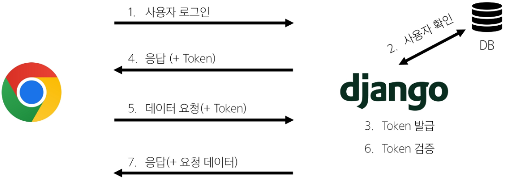

## Vue with DRF 02 (2025.05.20)

### 인증 with DRF

#### 1. Authentication (인증)

- 수신된 요청을 해당 요청의 사용자 또는 자격 증명과 연결하는 메커니즘
- 누구인지를 확인하는 과정

#### 2. Permissions (권한)

- 요청에 대한 접근 허용 또는 거부 여부를 결정

#### 3. 인증과 권환

- 순서상 인증이 먼저 진행되며 수신 요청을 해당 요청의 사용자 또는 해당 요청이 서명된 토큰(token)과 같은 자격 증명 자료와 연결
- 그런 다음 권한 및 제한 정책은 인증이 완료된 해당 자격 증명을 사용하여 요청을 허용해야 하는 지를 결정

#### 4. DRF에서의 인증

- 인증은 항상 view 함수 시작 시, 권한 및 제한 확인이 발생하기 전, 다른 코드의 진행이 허용되기 전에 실행됨
- 인증 자체로는 들어오는 요청을 허용하거나 거부할 수 없으며, 단순히 요청에 사용된 자격 증명만 식별함

#### 5. 승인되지 않은 응답 및 금지된 응답

- 인증되지 않은 요청이 권한을 거부하는 경우 해당되는 두 가지 오류 코드를 응답
    1. `HTTP 401 Unauthorized`
        1. 요청된 리소스에 대한 유효한 인증 자격 증명이 없기 때문에 클라이언트 요청이 완료되지 않았음을 나타냄
            1. 누구인지를 증명할 자료가 없음
    2. `HTTP 403 Forbidden (Permission Denied)`
        1. 서버에 요청이 전달되었지만, 권한 때문에 거절되었다는 것을 의미
        2. 401과 다른 점은 서버는 클라이언트가 누구인지 알고 있음

---

### 인증 정책 설정

#### 1. 인증 정책 설정 방법 2가지

1. 전역 설정
2. View 함수 별 설정

#### 2. 전역 설정

- 프로젝트 전체에 적용되는 기본 인증 방식을 정의
- DEFAULT_AUTHENTICATION_CLASSES를 사용
- 기본 값
    - SessionAuthentication과 BasicAuthentication
- 사용 예시

```python
REST_FRAMEWORK = {
    # Authentication
    'DEFAULT_AUTHENTICATION_CLASSES': [
        'rest_framework.authentication.TokenAuthentication',
    ],
}
```

#### 3. View 함수 별 설정

- authentication_classes 데코레이터를 사용
- 개별 view에 지정하여 재정의
- 사용 예시

```python
from rest_framework.decorators import api_view

from rest_framework.decorators import authenticataion_classes
from rest_framework.authentication import TokenAuthentication, BasicAuthentication

@api_view(["GET", "POST"])
@authentication_classes([TokenAuthentication, BasicAuthentication])
def article_list(request):
		pass
```

#### 4. DRF가 제공하는 인증 체계

```python
1. BasicAuthentication

2. TokenAuthentication

3. SessionAuthentication

4. RemoteUserAuthentication
```

#### 5. TokenAuthentication

- token 기반 HTTP 인증 체계
- 기본 데스크톱 및 모바일 클라이언트와 같은 클라이언트-서버 설정에 적합
- 서버가 인증된 사용자에게 토큰을 발급하고, 사용자는 매 요청마다 발급 받은 토큰을 요청과 함께 보내 인증 과정을 거침

---

### Token 인증 설정

#### 1. TokenAuthentication 적용 과정

1. 인증 클래스 설정
2. INSTALLED_APPS 추가
3. Migrate 진행

#### 2. 인증 클래스 설정

- 전역 인증 정책을 Token 방식으로 설정

```python
# settings.py
REST_FRAMEWORK = {
    # Authentication
    'DEFAULT_AUTHENTICATION_CLASSES': [
        'rest_framework.authentication.TokenAuthentication',
    ],
}
```

#### 3. INSTALLED_APPS 추가

```python
# settings.py
INSTALLED_APPS = [
    ...,
    'rest_framework.authtoken',
    ...,
]
```

#### 4. Migrate

- 명령어
    - `python manage.py migrate`

#### 5. 토큰 인증 방식 과정



---

### Dj-Rest-Auth 라이브러리

#### 1. Dj-Rest-Auth

- 회원가입, 인증(소셜미디어 인증 등), 비밀번호 재설정, 사용자 세부 정보 검색, 회원 정보 수정 등 다양한 인증 관련 기능을 제공하는 라이브러리

#### 2. Dj-Rest-Auth 설치 및 적용

- 설치
    - 명령어
        - `pip install dj-rest-auth`
- 적용

```python
# settings.py
INSTALLED_APPS = [
		...,
    'dj_rest_auth',
    ...,
]
```

```python
# my_api/urls.py
from django.urls import path, include

urlpatterns = [
		...,
    path('accounts/', include('dj_rest_auth.urls')),
		...,
]

```

#### 3. Dj-Rest-Auth의 Registration(등록) 기능 추가 설정

1. 패키지 추가 설치
2. 추가 App 등록
3. 추가 URL 등록
4. Migrate

#### 4. Registration 기능 추가

1. 패키지 추가 설치
    1. 명령어
        1. pip install ‘dj-rest-auth[with-social]’
2. django 설정

```python
# settings.py
INSTALLED_APPS = [
		...,
    'django.contrib.sites',
    'allauth',
    'allauth.account',
    'allauth.socialaccount',
    'dj_rest_auth.registration',
    ...,
]

SITE_ID = 1

MIDDLEWARE = [
		...,
    'allauth.account.middleware.AccountMiddleware',
    ...,
]
```

```python
# my_api/urls.py
from django.urls import path, include

urlpatterns = [
		...,
		path('accounts/signup/', include('dj_rest_auth.registration.urls')),
		...,
]

```

3. Migrate
    1. 명령어
        1. `python manage.py migrate`

---

### 권한 with DRF

#### 1. 권한 설정 방법

1. 전역 설정
2. View 함수 별 설정

#### 2. 전역 설정

- 프로젝트 전체에 적용되는 기본 권한 방식을 정의
- DEFAULT_PERMISSION_CLASSES를 사용
- 기본 값
    - rest_framework.permissions.AllowAny
- 사용 예시

```python
REST_FRAMEWORK = {
    # permission
    'DEFAULT_PERMISSION_CLASSES': [
        'rest_framework.permissions.IsAuthenticated',
    ],
}
```

#### 3. View 함수 별 설정

- permission_classes 데코레이터를 사용
- 개별 view에 지정하여 재정의
- 사용 예시

```python
from rest_framework.decorators import api_view

from rest_framework.decorators import permission_classes
from rest_framework.permissions import IsAuthenticated

@api_view(["GET", "POST"])
@permission_classes([IsAuthenticated])
def article_list(request):
		pass
```

#### 4. DRF가 제공하는 권한 정책

```python
1. IsAuthenticated

2. IsAdminUser

3. IsAuthenticatedOrReadOnly

4. ...
```

#### 5. IsAuthenticated

- 개념
    - 인증된 사용자만 접근을 허용하는 권한 클래스
    - 인증되지 않은 사용자의 모든 요청을 거부
- 특징
    - request.user가 존재하고 인증된 상태인지 확인
    - 보호해야 할 중요한 데이터나 리소스에 적합
        - 예
            - 회원 전용 페이지
            - 결제
            - 프로필 수정 등

#### 6. AllowAny

- 개념
    - 모든 요청을 무조건 허용하는 권한 클래스
    - 인증된 사용자든, 인증되지 않은 사용자든 상관 없이 모두에게 접근을 허용
- 특징
    - 권한 검사(Authorization) 로직을 전혀 수행하지 않음
    - API 엔드포인트를 완전히 공개하고 싶을 때 사용
    - 보안이 필요한 리소스에는 부적합하므로, 회원가입, 로그인 또는 공개 게시글 조회 등 공개 API에 주로 적용

---

### IsAuthenticated 설정

#### 1. IsAuthenticated 권한 설정

- 기본적으로 모든 View 함수에 대한 접근을 허용

```python
# settings.py
REST_FRAMEWORK = {
    # Authentication
    'DEFAULT_AUTHENTICATION_CLASSES': [
        'rest_framework.authentication.TokenAuthentication',
    ],
    # permission
    'DEFAULT_PERMISSION_CLASSES': [
        'rest_framework.permissions.AllowAny',
    ],
}
```

- 전체 게시글 조회 및 생성 시에만 인증된 사용자만 진행할 수 있도록 권한 설정

```python
# articles/views.py
from rest_framework.decorators import api_view

from rest_framework.decorators import permission_classes
from rest_framework.permissions import IsAuthenticated

@api_view(['GET', 'POST'])
@permission_classes([IsAuthenticated])
def article_list(request):
		pass
```

#### 2. 권한 활용

- 관리자만 전체 게시글 조회 가능하게 하기

```python
# articles/views.py
from rest_framework.decorators import api_view

from rest_framework.decorators import permission_classes
from rest_framework.permissions import IsAdminUser

@api_view(['GET', 'POST'])
@permission_classes([IsAdminUser])
def article_list(request):
		pass
```

---

### 코드

#### 1. 금일 최종 코드

1. articles/serializers.py

```python
# articles/serializers.py
from rest_framework import serializers
from .models import Article

class ArticleListSerializer(serializers.ModelSerializer):
    class Meta:
        model = Article
        fields = ('id', 'title', 'content')

class ArticleSerializer(serializers.ModelSerializer):
    class Meta:
        model = Article
        fields = '__all__'
        read_only_fields = ('user',)
```

2. articles/models.py

```python
# articles/models.py
from django.db import models
from django.conf import settings

class Article(models.Model):
    user = models.ForeignKey(
        settings.AUTH_USER_MODEL,
        on_delete=models.CASCADE,
    )
    title = models.CharField(max_length=100)
    content = models.TextField()
    created_at = models.DateTimeField(auto_now_add=True)
    updated_at = models.DateTimeField(auto_now=True)
```

3. articles/views.py

```python
# articles/views.py
from rest_framework.response import Response
from rest_framework.decorators import api_view
from rest_framework import status

# permission Decorators
from rest_framework.decorators import permission_classes
from rest_framework.permissions import IsAuthenticated, IsAuthenticatedOrReadOnly

from django.shortcuts import get_object_or_404, get_list_or_404

from .serializers import ArticleListSerializer, ArticleSerializer
from .models import Article

@api_view(['GET', 'POST'])
# @permission_classes([IsAuthenticated])
@permission_classes([IsAuthenticatedOrReadOnly])
def article_list(request):
    if request.method == 'GET':
        articles = get_list_or_404(Article)
        serializer = ArticleListSerializer(articles, many=True)
        return Response(serializer.data)
    elif request.method == 'POST':
        serializer = ArticleSerializer(data=request.data)
        if serializer.is_valid(raise_exception=True):
            # django의 form을 사용할 때에는
            # article = form.save(commit=False)
            # article.user = request.user
            # article.save()
            # DRF가 제공하는 serializer는 편의성 제공
            # serializer.save()
            serializer.save(user=request.user)
            return Response(serializer.data, status=status.HTTP_201_CREATED)

@api_view(['GET'])
def article_detail(request, article_pk):
    article = get_object_or_404(Article, pk=article_pk)

    if request.method == 'GET':
        serializer = ArticleSerializer(article)
        print(serializer.data)
        return Response(serializer.data)
```

4. settings.py

```python
"""
Django settings for my_api project.

Generated by 'django-admin startproject' using Django 4.2.4.

For more information on this file, see
https://docs.djangoproject.com/en/4.2/topics/settings/

For the full list of settings and their values, see
https://docs.djangoproject.com/en/4.2/ref/settings/
"""
from pathlib import Path

# Build paths inside the project like this: BASE_DIR / 'subdir'.
BASE_DIR = Path(__file__).resolve().parent.parent

# Quick-start development settings - unsuitable for production
# See https://docs.djangoproject.com/en/4.2/howto/deployment/checklist/

# SECURITY WARNING: keep the secret key used in production secret!
SECRET_KEY = (
    'django-insecure-@fn#327r=8uv%&a25(l(jc-e5ir*pu)v_%cyy*l%u@o)(^fnzs'
)

# SECURITY WARNING: don't run with debug turned on in production!
DEBUG = True

ALLOWED_HOSTS = []

# Application definition
INSTALLED_APPS = [
    'articles',
    'accounts',
    'rest_framework',
    'rest_framework.authtoken',
    'dj_rest_auth',
    'corsheaders',
    'django.contrib.sites',
    'allauth',
    'allauth.account',
    'allauth.socialaccount',
    'dj_rest_auth.registration',
    'django.contrib.admin',
    'django.contrib.auth',
    'django.contrib.contenttypes',
    'django.contrib.sessions',
    'django.contrib.messages',
    'django.contrib.staticfiles',
]

SITE_ID = 1

REST_FRAMEWORK = {
    # Authentication
    'DEFAULT_AUTHENTICATION_CLASSES': [
        'rest_framework.authentication.TokenAuthentication',
    ],
    # permission
    'DEFAULT_PERMISSION_CLASSES': [
        'rest_framework.permissions.AllowAny',
    ],
}

MIDDLEWARE = [
    'django.middleware.security.SecurityMiddleware',
    'django.contrib.sessions.middleware.SessionMiddleware',
    'corsheaders.middleware.CorsMiddleware',
    'django.middleware.common.CommonMiddleware',
    'django.middleware.csrf.CsrfViewMiddleware',
    'django.contrib.auth.middleware.AuthenticationMiddleware',
    'django.contrib.messages.middleware.MessageMiddleware',
    'django.middleware.clickjacking.XFrameOptionsMiddleware',
    'allauth.account.middleware.AccountMiddleware',
]

CORS_ALLOWED_ORIGINS = [
    'http://127.0.0.1:5173',
    'http://localhost:5173',
]

ROOT_URLCONF = 'my_api.urls'

TEMPLATES = [
    {
        'BACKEND': 'django.template.backends.django.DjangoTemplates',
        'DIRS': [],
        'APP_DIRS': True,
        'OPTIONS': {
            'context_processors': [
                'django.template.context_processors.debug',
                'django.template.context_processors.request',
                'django.contrib.auth.context_processors.auth',
                'django.contrib.messages.context_processors.messages',
            ],
        },
    },
]

WSGI_APPLICATION = 'my_api.wsgi.application'

# Database
# https://docs.djangoproject.com/en/4.2/ref/settings/#databases
DATABASES = {
    'default': {
        'ENGINE': 'django.db.backends.sqlite3',
        'NAME': BASE_DIR / 'db.sqlite3',
    }
}

# Password validation
# https://docs.djangoproject.com/en/4.2/ref/settings/#auth-password-validators
AUTH_PASSWORD_VALIDATORS = [
    {
        'NAME': 'django.contrib.auth.password_validation.UserAttributeSimilarityValidator',
    },
    {
        'NAME': 'django.contrib.auth.password_validation.MinimumLengthValidator',
    },
    {
        'NAME': 'django.contrib.auth.password_validation.CommonPasswordValidator',
    },
    {
        'NAME': 'django.contrib.auth.password_validation.NumericPasswordValidator',
    },
]

# Internationalization
# https://docs.djangoproject.com/en/4.2/topics/i18n/
LANGUAGE_CODE = 'en-us'

TIME_ZONE = 'UTC'

USE_I18N = True

USE_TZ = True

# Static files (CSS, JavaScript, Images)
# https://docs.djangoproject.com/en/4.2/howto/static-files/
STATIC_URL = 'static/'

# Default primary key field type
# https://docs.djangoproject.com/en/4.2/ref/settings/#default-auto-field
DEFAULT_AUTO_FIELD = 'django.db.models.BigAutoField'

AUTH_USER_MODEL = 'accounts.User'
```

5. my_api/urls.py

```python
from django.contrib import admin
from django.urls import path, include

urlpatterns = [
    path('admin/', admin.site.urls),
    path('api/v1/', include('articles.urls')),
    path('accounts/', include('dj_rest_auth.urls')),
    path('accounts/signup/', include('dj_rest_auth.registration.urls')),
]
```
