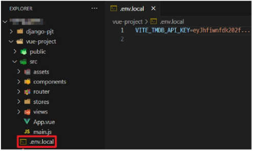

## Vue with DRF 03 (2025.05.21)

### 코드

#### 1. 금일 최종 코드 (Django)

1. accounts/models.py

```python
# accounts/models.py
from django.db import models
from django.contrib.auth.models import AbstractUser

class User(AbstractUser):
    age = models.PositiveIntegerField(
        blank=True,
        null=True,
    )
```

2. accounts/serializers.py

```python
# accounts/serializers.py
from dj_rest_auth.registration.serializers import RegisterSerializer
from rest_framework import serializers

class CustomRegisterSerializer(RegisterSerializer):
  age = serializers.IntegerField(required=True)

  def get_cleaned_data(self):
    data = super().get_cleaned_data()
    data["age"] = self.validated_data.get("age", "")
    return data

  def save(self, request):
    user = super().save(request)
    user.age = self.validated_data.get("age", "")
    user.save()
    return user
```

3. settings,py

```python
# settings.py
"""
Django settings for my_api project.

Generated by 'django-admin startproject' using Django 4.2.4.

For more information on this file, see
https://docs.djangoproject.com/en/4.2/topics/settings/

For the full list of settings and their values, see
https://docs.djangoproject.com/en/4.2/ref/settings/
"""
from pathlib import Path

# Build paths inside the project like this: BASE_DIR / 'subdir'.
BASE_DIR = Path(__file__).resolve().parent.parent

# Quick-start development settings - unsuitable for production
# See https://docs.djangoproject.com/en/4.2/howto/deployment/checklist/

# SECURITY WARNING: keep the secret key used in production secret!
SECRET_KEY = (
    'django-insecure-@fn#327r=8uv%&a25(l(jc-e5ir*pu)v_%cyy*l%u@o)(^fnzs'
)

# SECURITY WARNING: don't run with debug turned on in production!
DEBUG = True

ALLOWED_HOSTS = []

# Application definition
INSTALLED_APPS = [
    'articles',
    'accounts',
    'rest_framework',
    'rest_framework.authtoken',
    'dj_rest_auth',
    'corsheaders',
    'django.contrib.sites',
    'allauth',
    'allauth.account',
    'allauth.socialaccount',
    'dj_rest_auth.registration',
    'django.contrib.admin',
    'django.contrib.auth',
    'django.contrib.contenttypes',
    'django.contrib.sessions',
    'django.contrib.messages',
    'django.contrib.staticfiles',
]

SITE_ID = 1

REST_FRAMEWORK = {
    # Authentication
    'DEFAULT_AUTHENTICATION_CLASSES': [
        'rest_framework.authentication.TokenAuthentication',
    ],
    # permission
    'DEFAULT_PERMISSION_CLASSES': [
        'rest_framework.permissions.AllowAny',
    ],
}

MIDDLEWARE = [
    'django.middleware.security.SecurityMiddleware',
    'django.contrib.sessions.middleware.SessionMiddleware',
    'corsheaders.middleware.CorsMiddleware',
    'django.middleware.common.CommonMiddleware',
    'django.middleware.csrf.CsrfViewMiddleware',
    'django.contrib.auth.middleware.AuthenticationMiddleware',
    'django.contrib.messages.middleware.MessageMiddleware',
    'django.middleware.clickjacking.XFrameOptionsMiddleware',
    'allauth.account.middleware.AccountMiddleware',
]

CORS_ALLOWED_ORIGINS = [
    'http://127.0.0.1:5173',
    'http://localhost:5173',
]

ROOT_URLCONF = 'my_api.urls'

TEMPLATES = [
    {
        'BACKEND': 'django.template.backends.django.DjangoTemplates',
        'DIRS': [],
        'APP_DIRS': True,
        'OPTIONS': {
            'context_processors': [
                'django.template.context_processors.debug',
                'django.template.context_processors.request',
                'django.contrib.auth.context_processors.auth',
                'django.contrib.messages.context_processors.messages',
            ],
        },
    },
]

WSGI_APPLICATION = 'my_api.wsgi.application'

# Database
# https://docs.djangoproject.com/en/4.2/ref/settings/#databases

DATABASES = {
    'default': {
        'ENGINE': 'django.db.backends.sqlite3',
        'NAME': BASE_DIR / 'db.sqlite3',
    }
}

# Password validation
# https://docs.djangoproject.com/en/4.2/ref/settings/#auth-password-validators
AUTH_PASSWORD_VALIDATORS = [
    {
        'NAME': 'django.contrib.auth.password_validation.UserAttributeSimilarityValidator',
    },
    {
        'NAME': 'django.contrib.auth.password_validation.MinimumLengthValidator',
    },
    {
        'NAME': 'django.contrib.auth.password_validation.CommonPasswordValidator',
    },
    {
        'NAME': 'django.contrib.auth.password_validation.NumericPasswordValidator',
    },
]

# Internationalization
# https://docs.djangoproject.com/en/4.2/topics/i18n/
LANGUAGE_CODE = 'en-us'

TIME_ZONE = 'UTC'

USE_I18N = True

USE_TZ = True

# Static files (CSS, JavaScript, Images)
# https://docs.djangoproject.com/en/4.2/howto/static-files/
STATIC_URL = 'static/'

# Default primary key field type
# https://docs.djangoproject.com/en/4.2/ref/settings/#default-auto-field
DEFAULT_AUTO_FIELD = 'django.db.models.BigAutoField'

AUTH_USER_MODEL = 'accounts.User'

REST_AUTH = {
    'REGISTER_SERIALIZER': 'accounts.serializers.CustomRegisterSerializer',
}
```

4. articles/admin.py

```python
# articles/admin.py
from django.contrib import admin
from .models import Article

admin.site.register(Article)
```

5. articles/models.py

```python
# articles/models.py
from django.db import models
from django.conf import settings

class Article(models.Model):
    user = models.ForeignKey(
        settings.AUTH_USER_MODEL,
        on_delete=models.CASCADE,
    )
    title = models.CharField(max_length=100)
    content = models.TextField()
    created_at = models.DateTimeField(auto_now_add=True)
    updated_at = models.DateTimeField(auto_now=True)
```

6. articles/serializers.py

```python
# articles/serializers.py
from rest_framework import serializers
from .models import Article

class ArticleListSerializer(serializers.ModelSerializer):
    class Meta:
        model = Article
        fields = ('id', 'title', 'content')

class ArticleSerializer(serializers.ModelSerializer):
    class Meta:
        model = Article
        fields = '__all__'
        read_only_fields = ('user',)
```

7. articles/urls.py

```python
# articles/url.py
from django.urls import path
from . import views

urlpatterns = [
    path('articles/', views.article_list),
    path('articles/<int:article_pk>/', views.article_detail),
]
```

8. articles/views.py

```python
# articles/views.py
from rest_framework.response import Response
from rest_framework.decorators import api_view
from rest_framework import status

# Permissions
from rest_framework.decorators import permission_classes
from rest_framework.permissions import IsAuthenticated

from django.shortcuts import get_object_or_404, get_list_or_404

from .serializers import ArticleListSerializer, ArticleSerializer
from .models import Article

# articles/views.py
@api_view(['GET', 'POST'])
# @permission_classes([IsAuthenticated])
def article_list(request):
    if request.method == 'GET':
        articles = get_list_or_404(Article)
        serializer = ArticleListSerializer(articles, many=True)
        return Response(serializer.data)

    elif request.method == 'POST':
        serializer = ArticleSerializer(data=request.data)
        if serializer.is_valid(raise_exception=True):
            serializer.save(user=request.user)
            return Response(serializer.data, status=status.HTTP_201_CREATED)

@api_view(['GET'])
def article_detail(request, article_pk):
    article = get_object_or_404(Article, pk=article_pk)

    if request.method == 'GET':
        serializer = ArticleSerializer(article)
        print(serializer.data)
        return Response(serializer.data)
```

#### 2. 금일 최종 코드 (Vue)

1. router/index.js

```jsx
// router/index.js
import { createRouter, createWebHistory } from 'vue-router'
import ArticleView from '@/views/ArticleView.vue'
import DetailView from '@/views/DetailView.vue'
import CreateView from '@/views/CreateView.vue'
import SignUpView from '@/views/SignUpView.vue'
import LogInView from '@/views/LogInView.vue'

import { useAccountStore } from "@/stores/accounts";

const router = createRouter({
  history: createWebHistory(import.meta.env.BASE_URL),
  routes: [
    {
      path: '/',
      name: 'ArticleView',
      component: ArticleView
    },
    {
      path: '/articles/:id',
      name: 'DetailView',
      component: DetailView
    },
    {
      path: '/create',
      name: 'CreateView',
      component: CreateView
    },
    {
      path: '/signup',
      name: 'SignUpView',
      component: SignUpView
    },
    {
      path: '/login',
      name: 'LogInView',
      component: LogInView
    },
  ]
})

router.beforeEach((to, from) => {
  const accountStore = useAccountStore()
  if(to.name === "ArticleView" && !accountStore.isLogin){
    return {name: "LogInView"}
  }
})

export default router
```

2. stores/articles.js

```jsx
// stores/articles.js
import { ref, computed } from 'vue'
import { defineStore } from 'pinia'
import { useAccountStore } from './accounts'
import axios from 'axios'

export const useArticleStore = defineStore('article', () => {
  const accountStore = useAccountStore()
  
  const articles = ref([])
  const API_URL = 'http://127.0.0.1:8000'

  const getArticles = function () {
    axios({
      method: 'get',
      url: `${API_URL}/api/v1/articles/`,
      header: {
        "Authorization": `Token ${accountStore.token}`
      },
    })
      .then(res => {
        articles.value = res.data
      })
      .catch(err => console.log(err))
  }
  return { articles, API_URL, getArticles }
}, { persist: true })
```

3. stores/accounts.js

```jsx
// stores/accounts.js
import { ref, computed } from 'vue'
import { defineStore } from 'pinia'
import { useRouter } from 'vue-router'
import axios from 'axios'
import router from '@/router'

export const useAccountStore = defineStore('account', () => {
  const ACCOUNT_API_URL = "http://127.0.0.1:8000/accounts"
  const token = ref("")
  const isLogin = computed(() => {
    return token.value ? true : false
  })

  const signUp = function({username, password1, password2, age}){
    axios({ 
      method: "POST",
      url: `${ACCOUNT_API_URL}/signup/`,
      data: {
        username,
        password1,
        password2,
        age,
      },
    })
      .then(res => {
        const password = password1
        logIn({username, password})
      })
      .catch(err => console.log(err))
  }

  const logIn = function({username, password}){
    console.log(username, password)
    axios({
      method: "POST",
      url: `${ACCOUNT_API_URL}/login/`,
      data: {
        username,
        password,
      },
    })
      .then(res => {
        token.value = res.data.key
        router.push({name: "ArticleView"})
      })
      .catch(err => console.log(err))
  }

  const logOut = function(){
    axios({
      method: "POST",
      url: `${ACCOUNT_API_URL}/accounts/logout/`,
    })
      .then(res => {
        token.value = null
        router.push({name: "ArticleView"})
      })
      .catch(err => console.log(err))
  }

  return {
    token, isLogin,
    signUp, logIn, logOut,
  }
}, { persist: true })
```

4. App.vue

```html
<!-- App.vue -->
<template>
  <header>
    <nav>
      <RouterLink :to="{ name:'ArticleView' }">Articles</RouterLink> | 
      <RouterLink :to="{ name: 'SignUpView'}">SignUp</RouterLink> | 
      <RouterLink :to="{ name: 'LogInView'}">LogIn</RouterLink>
      <form @submit.prevent="logOut">
        <input type="submit" value="Logout">
      </form>
    </nav>
  </header>
  <RouterView />
</template>

<script setup>
  import { RouterView, RouterLink } from 'vue-router'
  import { useAccountStore } from "@/stores/accounts";

  const accountStore = useAccountStore()
  const logOut = function(){
    accountStore.logOut()
  }
</script>

<style scoped>

</style>
```

5. views/SignUpView.vue

```html
<!-- views/SignUpView.vue -->
<template>
  <div>
    <form @submit.prevent="onSignUp">
      <label for="username">username: </label>
      <input type="text" id="username" v-model="username">
      
      <label for="age">age: </label>
      <input type="number" id="age" v-model="age">

      <label for="password1">password1: </label>
      <input type="password" id="password1" v-model="password1">
      
      <label for="password2">password2: </label>
      <input type="password" id="password2" v-model="password2">

      <input type="submit" value="signup">
    </form>
  </div>
</template>

<script setup>
  import { ref } from "vue";
  import { useAccountStore } from "@/stores/accounts.js";
  
  const accountStore = useAccountStore()

  const username = ref("")
  const password1 = ref("")
  const password2 = ref("")
  const age = ref("")

  const onSignUp = function(){
    const userInfo = {
      username: username.value,
      password1: password1.value,
      password2: password2.value,
      age: age.value,
    }
    accountStore.signUp(userInfo)
  }
</script>

<style>

</style>
```

6. views/LogInView.vue

```html
<!-- views/LogInView.vue -->
<template>
  <div>
    <form @submit.prevent="onLogIn">
      <label for="username">username: </label>
      <input type="text" id="username" v-model="username">
      
      <label for="password">password: </label>
      <input type="password" id="password" v-model="password">      

      <input type="submit" value="signup">
    </form>
  </div>
</template>

<script setup>
  import { ref } from "vue";
  import { useAccountStore } from "@/stores/accounts.js";

  const accountStore = useAccountStore()

  const username = ref("")
  const password = ref("")

  const onLogIn = function(){
    const userInfo = {
      username: username.value,
      password: password.value,
    }
    accountStore.logIn(userInfo)
  }
</script>

<style>

</style>
```

---

### 참고

#### 1. Django Signals

- “이벤트 알림 시스템”
- 애플리케이션 내에서 특정 이벤트가 발생할 때, 다른 부분에게 신호를 보내어 이벤트가 발생했음을 알릴 수 있음
- 주로 모델의 데이터 변경 또는 저장, 삭제와 같은 작업에 반응하여 추가적인 로직을 실행하고자 할 때 사용
    - 예를 들어, 사용자가 새로운 게시글을 작성할 때마다 특정 작업(예: 이메일 알림 보내기)을 수행하려는 경우

#### 2. 환경 변수 (Environment Variable)

- 애플리케이션의 설정이나 동작을 제어하기 위해 사용되는 변수

#### 3. 환경 변수의 목적

- 개발, 테스트 및 프로덕션 환경에서 다르게 설정되어야 하는 설정 값이나 민감한 정보(ex. API Key)를 포함
- 환경 변수를 사용하여 애플리케이션의 설정을 관리하면, 다양한 환경에서 일관된 동작을 유지하면서 필요에 따라 변수를 쉽게 변경할 수 있음
- 보안적인 이슈를 피하고, 애플리케이션을 다양한 환경에 대응하기 쉽게 만들어 줌

#### 4. Vite에서 환경 변수를 사용하는 법

- .env.local 파일 생성 및 API 변수 작성
- 주의사항
    - 변수 명은 반드시 VITE_ 접두어를 작성해야 함
    - 변수 명과 값 사이에 공백이 없어야 함
    
    
    
    ```jsx
    const API_KEY = import.meta.env.VITE_TMDB_API_KEY
    ```
    

#### 5. Vue 프로젝트 진행 시 유용한 자료

- Awesome Vue.js
    - Vue와 관련하여 선별된 유용한 자료를 아카이빙 및 관리하는 프로젝트
    - https://github.com/vuejs/awesome-vue
    - https://awesome-vue.js.org/
- Vuetify
    - Vue를 위한 UI 라이브러리 (ex. ‘Bootstrap’)
    - https://vuetifyjs.com/en/