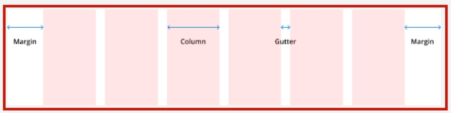
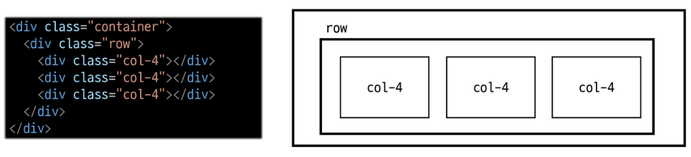
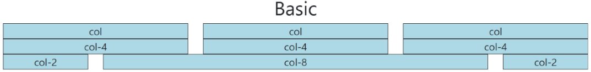
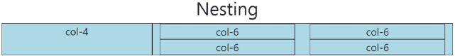
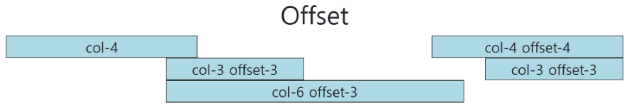
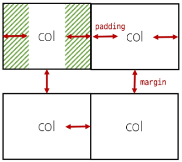
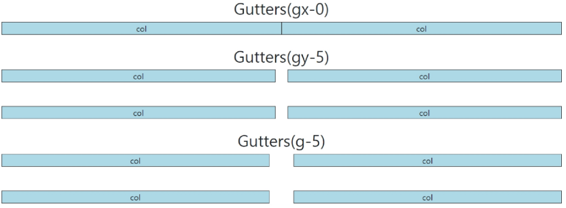
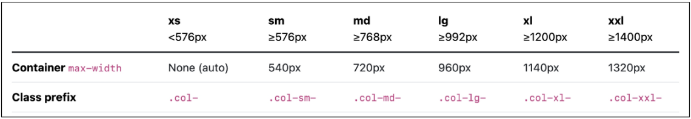
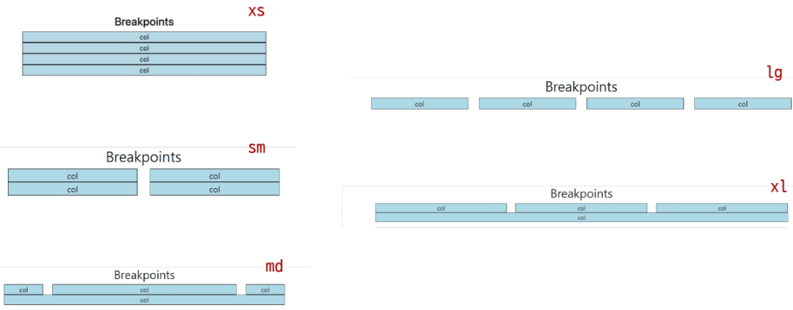
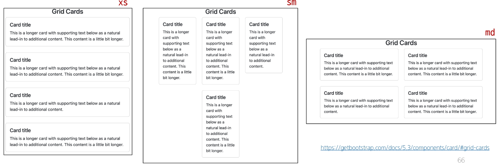

## Responsive (2025.02.27)

### Bootstrap Grid System

#### 1. Bootstrap Grid System

- 웹 페이지의 레이아웃을 조정하는 데 사용되는 12개의 컬럼으로 구성된 시스템
- 12개의 컬럼으로 구성된 이유는 12가 약수가 많기 때문
- 12개 이상의 컬럼으로 구성된 Grid System이 있긴 함

#### 2. Grid System 목적

- 반응형 디자인을 지원해 웹 페이지를 모바일, 태블릿, 데스크탑 등 다양한 기기에서 적절하게 표시할 수 있도록 도움

#### 3. 반응형 웹 디자인 (Responsive Web Design)

- 디바이스 종류나 화면 크기에 상관 없이, 어디서든 일관된 레이아웃 및 사용자 경험을 제공하는 디자인 기술

---

### Grid System 구조

#### 1. Grid System 기본 요소

- Grid System의 기본 요소
    1. Container
        1. Column들을 담고 있는 공간
    2. Column
        1. 실제 컨텐츠를 포함하는 부분
    3. Gutter
        1. 컬럼과 컬럼  사이의 여백 영역 (상하좌우)
    
    
    

- 1개의 row 안에 12개의 Column 영역이 구성
- 각 요소는 12개 중 몇 개를 차지할 것인지 지정됨



---

### Grid System 실습

#### 1. Grid System 실습 - 기본



```html
<!DOCTYPE html>
<html lang="en">
<head>
    <meta charset="UTF-8">
    <meta name="viewport" content="width=device-width, initial-scale=1.0">
    <link href="https://cdn.jsdelivr.net/npm/bootstrap@5.3.3/dist/css/bootstrap.min.css" rel="stylesheet"
    integrity="sha384-QWTKZyjpPEjISv5WaRU9OFeRpok6YctnYmDr5pNlyT2bRjXh0JMhjY6hW+ALEwIH" crossorigin="anonymous">
    <style>
        .box{
            border: 1px solid black;
            background-color: lightblue;
            text-align: center;
        }
    </style>
</head>
<body>
    <h2 class="text-center">Basic</h2>
    <div class="container">
        <div class="row">
            <div class="col">
                <div class="box">col</div>
            </div>
            <div class="col">
                <div class="box">col</div>
            </div>
            <div class="col">
                <div class="box">col</div>
            </div>
        </div>
        <div class="row">
            <div class="col-4">
                <div class="box">col-4</div>
            </div>
            <div class="col-4">
                <div class="box">col-4</div>
            </div>
            <div class="col-4">
                <div class="box">col-4</div>
            </div>
        </div>
        <div class="row">
            <div class="col-2">
                <div class="box">col-2</div>
            </div>
            <div class="col-8">
                <div class="box">col-8</div>
            </div>
            <div class="col-2">
                <div class="box">col-2</div>
            </div>
        </div>
    </div>

    <script src="https://cdn.jsdelivr.net/npm/bootstrap@5.3.3/dist/js/bootstrap.bundle.min.js"
    integrity="sha384-YvpcrYf0tY3lHB60NNkmXc5s9fDVZLESaAA55NDzOxhy9GkcIdslK1eN7N6jIeHz"
    crossorigin="anonymous"></script>
</body>
</html>
```

#### 2. Grid System 실습 - 중첩 (Nesting)



```html
<!DOCTYPE html>
<html lang="en">
<head>
    <meta charset="UTF-8">
    <meta name="viewport" content="width=device-width, initial-scale=1.0">
    <link href="https://cdn.jsdelivr.net/npm/bootstrap@5.3.3/dist/css/bootstrap.min.css" rel="stylesheet"
    integrity="sha384-QWTKZyjpPEjISv5WaRU9OFeRpok6YctnYmDr5pNlyT2bRjXh0JMhjY6hW+ALEwIH" crossorigin="anonymous">
    <style>
        .box{
            border: 1px solid black;
            background-color: lightblue;
            text-align: center;
        }
    </style>
</head>
<body>
    <h2 class="text-center">Nesting</h2>
    <div class="container">
        <div class="row">
            <div class="col-4 box">
                <div>col-4</div>
            </div>
            <div class="col-8 box">
                <div class="row">
                    <div class="col-6">
                        <div class="box">col-6</div>
                    </div>
                    <div class="col-6">
                        <div class="box">col-6</div>
                    </div>
                    <div class="col-6">
                        <div class="box">col-6</div>
                    </div>
                    <div class="col-6">
                        <div class="box">col-6</div>
                    </div>
                </div>
            </div>
        </div>
    </div>

    <script src="https://cdn.jsdelivr.net/npm/bootstrap@5.3.3/dist/js/bootstrap.bundle.min.js"
    integrity="sha384-YvpcrYf0tY3lHB60NNkmXc5s9fDVZLESaAA55NDzOxhy9GkcIdslK1eN7N6jIeHz"
    crossorigin="anonymous"></script>
</body>
</html>
```

#### 3. Grid System 실습 - 상쇄 (Offset)



```html
<!DOCTYPE html>
<html lang="en">
<head>
    <meta charset="UTF-8">
    <meta name="viewport" content="width=device-width, initial-scale=1.0">
    <link href="https://cdn.jsdelivr.net/npm/bootstrap@5.3.3/dist/css/bootstrap.min.css" rel="stylesheet"
    integrity="sha384-QWTKZyjpPEjISv5WaRU9OFeRpok6YctnYmDr5pNlyT2bRjXh0JMhjY6hW+ALEwIH" crossorigin="anonymous">
    <style>
        .box{
            border: 1px solid black;
            background-color: lightblue;
            text-align: center;
        }
    </style>
</head>
<body>
    <h2 class="text-center">Offset</h2>
    <div class="container">
        <div class="row">
            <div class="col-4">
                <div class="box">col-4</div>
            </div>
            <div class="col-4 offset-4">
                <div class="box">col-4 offset-4</div>
            </div>
        </div>
        <div class="row">
            <div class="col-3 offset-3">
                <div class="box">col-3 offset-3</div>
            </div>
            <div class="col-3 offset-3">
                <div class="box">col-3 offset-3</div>
            </div>
        </div>
        <div class="row">
            <div class="col-6 offset-3">
                <div class="box">col-6 offset-3</div>
            </div>
        </div>
    </div>

    <script src="https://cdn.jsdelivr.net/npm/bootstrap@5.3.3/dist/js/bootstrap.bundle.min.js"
    integrity="sha384-YvpcrYf0tY3lHB60NNkmXc5s9fDVZLESaAA55NDzOxhy9GkcIdslK1eN7N6jIeHz"
    crossorigin="anonymous"></script>
</body>
</html>
```

#### 4. Gutters

- Grid System에서 Column 사이에 여백 영역
- x축은 padding, y축은 margin으로 여백 생성
    - 좌우의 크기는 12로 고정이기 때문
    - 실제 컬럼 간에 좌우 간격(x축)은 변하지 않으며, padding으로 인해 컬럼 안에 contents의 너비가 변하는 것



#### 5. Grid System 실습 - Gutters



```html
<!DOCTYPE html>
<html lang="en">
<head>
    <meta charset="UTF-8">
    <meta name="viewport" content="width=device-width, initial-scale=1.0">
    <link href="https://cdn.jsdelivr.net/npm/bootstrap@5.3.3/dist/css/bootstrap.min.css" rel="stylesheet"
    integrity="sha384-QWTKZyjpPEjISv5WaRU9OFeRpok6YctnYmDr5pNlyT2bRjXh0JMhjY6hW+ALEwIH" crossorigin="anonymous">
    <style>
        .box{
            border: 1px solid black;
            background-color: lightblue;
            text-align: center;
        }
    </style>
</head>
<body>
    <h2 class="text-center">Gutters(gx-0)</h2>
    <div class="container">
        <div class="row gx-0">
            <div class="col-6">
                <div class="box">col</div>
            </div>
            <div class="col-6">
                <div class="box">col</div>
            </div>
        </div>
    </div>

    <h2 class="text-center">Gutters(gy-5)</h2>
    <div class="container">
        <div class="row gy-5">
            <div class="col-6">
                <div class="box">col</div>
            </div>
            <div class="col-6">
                <div class="box">col</div>
            </div>
            <div class="col-6">
                <div class="box">col</div>
            </div>
            <div class="col-6">
                <div class="box">col</div>
            </div>
        </div>
    </div>

    <h2 class="text-center">Gutters(g-5)</h2>
    <div class="container-fluid">
        <div class="row g-5">
            <div class="col-6">
                <div class="box">col</div>
            </div>
            <div class="col-6">
                <div class="box">col</div>
            </div>
            <div class="col-6">
                <div class="box">col</div>
            </div>
            <div class="col-6">
                <div class="box">col</div>
            </div>
        </div>
    </div>

    <script src="https://cdn.jsdelivr.net/npm/bootstrap@5.3.3/dist/js/bootstrap.bundle.min.js"
    integrity="sha384-YvpcrYf0tY3lHB60NNkmXc5s9fDVZLESaAA55NDzOxhy9GkcIdslK1eN7N6jIeHz"
    crossorigin="anonymous"></script>
</body>
</html>
```

---

### Grid System for Responsive Web

#### 1. Responsive Web Design

- 디바이스 종류나 화면 크기에 상관 없이, 어디서든 일관된 레이아웃 및 사용자 경험을 제공하는 디자인 기술
- Bootstrap Grid System에서는 12개 Column과 6개 Breakpoints를 사용하여 반응형 웹 디자인을 구현

#### 2. Grid System Breakpoints

- 웹 페이지를 다양한 화면 크기에서 적절하게 배치하기 위한 분기점
- 화면 너비에 따라 6개의 분기점 제공
    - xs
    - sm
    - md
    - lg
    - xl
    - xxl
- 각 Breakpoints 마다 설정된 최대 너비 값 “이상으로” 화면이 커지면 Grid System 동작이 변경됨



---

### Breakpoints 실습

#### 1. Breakpoints 실습



```html
<!DOCTYPE html>
<html lang="en">
<head>
    <meta charset="UTF-8">
    <meta name="viewport" content="width=device-width, initial-scale=1.0">
    <link href="https://cdn.jsdelivr.net/npm/bootstrap@5.3.3/dist/css/bootstrap.min.css" rel="stylesheet"
    integrity="sha384-QWTKZyjpPEjISv5WaRU9OFeRpok6YctnYmDr5pNlyT2bRjXh0JMhjY6hW+ALEwIH" crossorigin="anonymous">
    <style>
        .box{
            border: 1px solid black;
            background-color: lightblue;
            text-align: center;
        }
    </style>
</head>
<body>
    <h2 class="text-center">Breakpoints</h2>
    <div class="container">
        <div class="row">
            <div class="col-12 col-sm-6 col-md-2 col-lg-3 col-lg-3 col-xl-4">
            <div class="box">col</div>
            </div>
            <div class="col-12 col-sm-6 col-md-8 col-lg-3 col-xl-4">
                <div class="box">col</div>
            </div>
            <div class="col-12 col-sm-6 col-md-2 col-lg-3 col-xl-4">
                <div class="box">col</div>
            </div>
            <div class="col-12 col-sm-6 col-md-12 col-lg-3 col-xl-12">
                <div class="box">col</div>
            </div>
        </div>
    </div>

    <hr>

    <h2 class="text-center">Breakpoints + offset</h2>
    <div class="container">
        <div class="row g-4">
            <div class="col-12 col-sm-4 col-md-6">
                <div class="box">col</div>
            </div>
            <div class="col-12 col-sm-4 col-md-6">
                <div class="box">col</div>
            </div>
            <div class="col-12 col-sm-4 col-md-6">
                <div class="box">col</div>
            </div>
            <div class="col-12 col-sm-4 offset-sm-4 col-md-6 offset-md-0">
                <div class="box">col</div>
            </div>
        </div>
    </div>

    <script src="https://cdn.jsdelivr.net/npm/bootstrap@5.3.3/dist/js/bootstrap.bundle.min.js"
    integrity="sha384-YvpcrYf0tY3lHB60NNkmXc5s9fDVZLESaAA55NDzOxhy9GkcIdslK1eN7N6jIeHz"
    crossorigin="anonymous"></script>
</body>
</html>
```

---

### UX & UI

#### 1. UX (User Experience)

- 제품이나 서비스를 사용하는 사람들이 느끼는 전체적인 경험과 만족도를 개선하고 최적화하기 위한 디자인과 개발 분야

#### 2. UX 예시

- 백화점 1층에서 느껴지는 좋은 향수 향기
- 러쉬 매장 근처만 가도 맡을 수 있는 러쉬 향기
- 원하는 음악을 검색할 때, 검색 기능이 적절하게 작동하고, 검색 결과가 정확하게 나오는 것

#### 3. UX 설계

- 사람들의 마음과 생각을 이해하고, 정리해서 제품에 녹여내는 과정
- 유저 리서치, 데이터 설계 및 정제, 유저 시나리오, 프로토타입 설계

#### 4. UI (User Interface)

- 서비스와 사용자 간의 상호작용을 가능하게 하는 디자인 요소들을 개발하고 구현하는 분야

#### 5. UI 예시

- 리모컨
    - 사용자가 버튼을 누르면 TV까 켜지고, 채널을 변경하거나 볼륨을 조절할 수 있음
- ATM
    - 사용자가 터치스크린을 통해 사용자 정보를 입력하고, 원하는 금액을 선택할 수 있음
- 웹 사이트
    - 사용자가 로그인 버튼을 누르면, 이동하는 화면의 디자인 및 레이아웃

#### 6. UI 설계

- 예쁜 디자인보다는 사용자가 더 쉽고 편리하게 사용할 수 있도록 고려
- 이를 위해서는 디자인 시스템, 중간 산출물, 프로토타입 등이 필요

---

### The Grid System

#### 1. The Grid System

- CSS가 아닌 편집 디자인에서 나온 개념으로 구성 요소를 잘 배치해서 시각적으로 좋은 결과물을 만들기 위함
- 기본적으로 안쪽에 있는 요소들의 오와 열을 맞추는 것에서 기인
- 정보 구조와 배열을 체계적으로 작성하여 정보의 질서를 부여하는 시스템

#### 2. Grid Cards

- row-cols 클래스를 사용하여 행당 표시할 열(카드) 수를 손쉽게 제어할 수 있음
- Grid System과는 문법이 다름



```html
<!DOCTYPE html>
<html lang="en">
<head>
    <meta charset="UTF-8">
    <meta name="viewport" content="width=device-width, initial-scale=1.0">
    <link href="https://cdn.jsdelivr.net/npm/bootstrap@5.3.3/dist/css/bootstrap.min.css" rel="stylesheet"
    integrity="sha384-QWTKZyjpPEjISv5WaRU9OFeRpok6YctnYmDr5pNlyT2bRjXh0JMhjY6hW+ALEwIH" crossorigin="anonymous">
</head>
<body>
    <h2 class="text-center">Grid Cards</h2>
    <div class="container">
        <div class="row row-cols-1 row-cols-sm-3 row-cols-md-2 g-4">
            <div class="col">
                <div class="card">
                    <div class="card-body">
                        <h5 class="card-title">Card title</h5>
                        <p class="card-text">This is a longer card with supporting text below as a natural lead-in to additional
                            content. This content is a little bit longer.</p>
                    </div>
                </div>
            </div>
            <div class="col">
                <div class="card">
                    <div class="card-body">
                        <h5 class="card-title">Card title</h5>
                        <p class="card-text">This is a longer card with supporting text below as a natural lead-in to additional
                            content. This content is a little bit longer.</p>
                    </div>
                </div>
            </div>
            <div class="col">
                <div class="card">
                    <div class="card-body">
                        <h5 class="card-title">Card title</h5>
                        <p class="card-text">This is a longer card with supporting text below as a natural lead-in to additional
                            content.</p>
                    </div>
                </div>
            </div>
            <div class="col">
                <div class="card">
                    <div class="card-body">
                        <h5 class="card-title">Card title</h5>
                        <p class="card-text">This is a longer card with supporting text below as a natural lead-in to additional
                            content. This content is a little bit longer.</p>
                    </div>
                </div>
            </div>
        </div>
    </div>

    <script src="https://cdn.jsdelivr.net/npm/bootstrap@5.3.3/dist/js/bootstrap.bundle.min.js"
    integrity="sha384-YvpcrYf0tY3lHB60NNkmXc5s9fDVZLESaAA55NDzOxhy9GkcIdslK1eN7N6jIeHz"
    crossorigin="anonymous"></script>
</body>
</html>
```
