## Database 01 (2025.04.07)

### 데이터베이스

#### 1. 데이터베이스

- 체계적인 데이터 모음

#### 2. 데이터

- 저장이나 처리에 효율적인 형태로 변환된 정보

#### 3. 기존의 데이터 저장 방식

1. 파일(File) 이용
    1. 파일을 이용한 데이터 관리
        1. 어디에서나 쉽게 사용 가능
        2. 데이터를 구조적으로 관리하기 어려움
        
        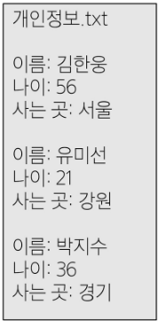
        
    
2. 스프레드 시트(Spread Sheet) 이용
    1. 스프레드 시트를 이용한 데이터 관리
        1. 테이블의 열과 행을 사용해 데이터를 구조적으로 관리 가능
    2. 스프레드 시트의 한계
        1. 크기
            1. 일반적으로 약 100만 행까지만 저장 가능
        2. 보안
            1. 단순히 파일이나 링크 소유 여부에 따른 단순한 접근 권한 기능 제공
        3. 정확성
            1. 공식적으로 “강원”의 지명이 “강언”으로 바뀌었다고 가정해보자
            2. 이 변경으로 인해 테이블 모든 위치에서 해당 값을 업데이트해야 함
            3. 찾기 및 바꾸기 기능을 사용해 바꿀 수 있지만 만약 데이터가 여러 시트에 분산되어 있다면 변경에 누락이 생기거나 추가 문제가 발생할 수 있음
            
            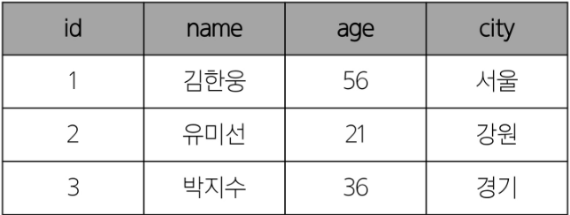
            

#### 4. 데이터베이스 역할

- 데이터를 저장하고 조작 (CRUD)

---

### Relational Database

#### 1. 데이터베이스 역할

- 데이터를 저장(구조적 저장)하고 조작(CRUD)

#### 2. 관계형 데이터베이스

- 데이터 간에 관계가 있는 데이터 항목들의 모음
- 테이블, 행, 열의 정보를 구조화하는 방식
- 서로 관련된 데이터 포인터를 저장하고, 이에 대한 액세를 제공

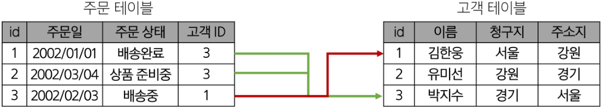

#### 3. 관계

- 여러 테이블 간의 (논리적) 연결

#### 4. 관계로 할 수 있는 것

- 이 관계로 인해 두 테이블을 사용하여 데이터를 다양한 형식으로 조회할 수 있음
    - 특정 날짜에 구매한 모든 고객 조회
    - 지난 달에 배송일이 지연된 고객 조회 등
    
    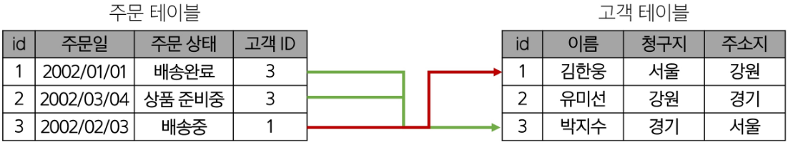
    

#### 5. 관계형 데이터베이스 예시

- 각 데이터에 고유한 식별 값을 부여하기
    - 기본 키 (Primary Key, PK)
    
    
    

- 주문 정보에 고객의 고유한 식별 값을 저장하기
    - 외래 키 (Foreign Key, FK)
    
    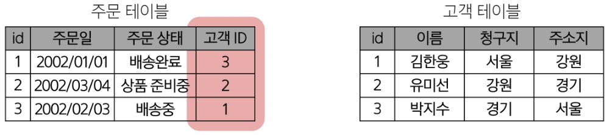
    

#### 6. 관계형 데이터베이스 관련 키워드

1. Table (aka Relation)
    1. 데이터를 기록하는 곳
    
    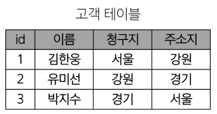
    

2. Field (aka Column, Attribute)
    1. 각 필드에는 고유한 데이터 형식(타입)이 지정됨
    
    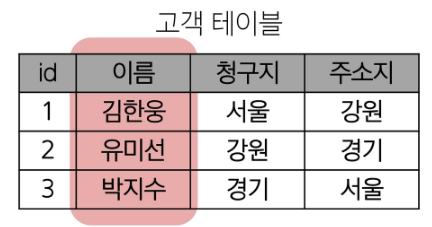
    

3. Record (aka Row, Tuple)
    1. 각 레코드에는 구체적인 데이터 값이 저장됨
    
    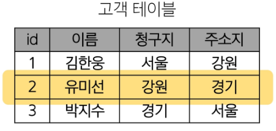
    

4. Database (aka Schema)
    1. 테이블의 집합
    
    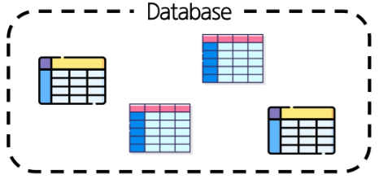
    

5. Primary Key (기본 키, PK)
    1. 각 레코드의 고유한 값
    2. 관계형 데이터베이스에서 레코드의 식별자로 활용
    
    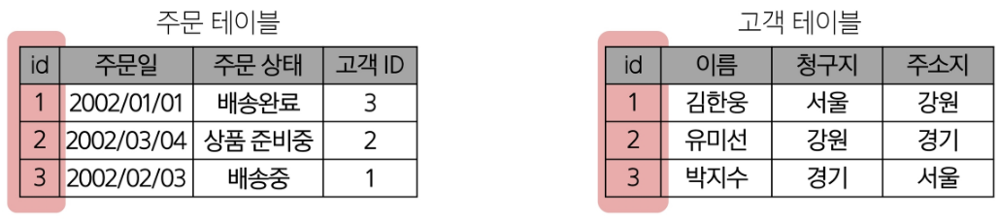
    

6. Foreign Key (외래 키, FK)
    1. 테이블의 필드 중 다른 테이블의 레코드를 식별할 수 있는 키
    2. 다른 테이블의 기본 키를 참조
    3. 각 레코드에서 서로 다른 테이블 간의 관계를 만드는 데 사용
    
    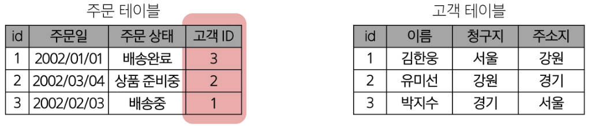
    

---

### RDBMS

#### 1. DBMS (Database Management System)

- 데이터베이스를 관리하는 소프트웨어 프로그램
- 데이터 저장 및 관리를 용이하게 하는 시스템
- 데이터베이스와 사용자 간의 인터페이스 역할
- 사용자가 데이터 구성, 업데이트, 모니터링, 백업, 복구 등을 할 수 있도록 도움

#### 2. RDBMS (Relational Database Management System)

- 관계형 데이터베이스를 관리하는 소프트웨어 프로그램

#### 3. RDBMS 서비스 종류

- SQLite
- MySQL
- PostgreSQL
- Oracle Database 등

#### 4. SQLite

- 경량의 오픈 소스 데이터베이스 관리 시스템
- 컴퓨터나 모바일 기기에 내장되어 간단하고 효율적인 데이터 저장 및 관리를 제공

---

### SQL

#### 1. SQL (Structure Query Language)

- 테이블의 형태로 구조화된 관계형 데이터베이스에게 요청을 질의 (요청)
- 데이터베이스에 정보를 저장하고, 처리하기 위한 프로그래밍 언어
- 관계형 데이터베이스와의 대화를 위해 사용하는 프로그래밍 언어


#### 2. SQL Syntax

1. SQL 키워드는 대소문자를 구분하지 않음
    1. 하지만 대문자로 작성하는 것을 권장 (명시적 구분)
2. 각 SQL Statements의 끝에는 세미콜론(’;’)이 필요
    1. 세미콜론은 각 SQL Statements을 구분하는 방법 (명령어의 마침표)
    
    ```sql
    SELECT column_name FROM table_name;
    ```
    

#### 3. SQL Statements

- SQL을 구성하는 가장 기본적인 코드 블록

#### 4. SQL Statements 예시

```sql
SELECT column_name FROM table_name;
```

- 해당 예시 코드는 SELECT Statement라 부름
- 이 Statement는 SELECT, FROM 2개의 keyword로 구성됨

#### 5. 수행 목적에 따른 SQL Statements 4가지 유형

1. DDL (Data Definition Language)
    1. 데이터 정의
    2. 데이터의 기본 구조 및 형식 변경
    3. SQL 키워드
        1. CREATE
        2. DROP
        3. ALTER
2. DQL (Data Query Language)
    1. 데이터 검색
    2. SQL 키워드
        1. SELECT
3. DML (Data Manipulation Language)
    1. 데이터 조작 (추가, 수정, 삭제)
    2. SQL 키워드
        1. INSERT
        2. UPDATE
        3. DELETE
4. DCL (Data Control Language)
    1. 데이터 제어
    2. 데이터 및 작업에 대한 사용자 권한 제어
    3. SQL 키워드
        1. COMMIT
        2. ROLLBACK
        3. GRANT
        4. REVOKE

---

### Querying Data

#### 1. SELECT Statement

- 테이블에서 데이터를 조회
- 테이블의 데이터를 조회 및 반환
- ‘*’(asterisk)를 사용하여 모든 필드 선택

#### 2. SELECT Syntax

```sql
SELECT
    select_list
FROM
    table_name
;
```

- SELECT 키워드 이후 데이터를 선택하려는 필드를 하나 이상 지정
- FROM 키워드 이후 데이터를 선택하려는 테이블의 이름을 지정

#### 3. SELECT 활용

1. 테이블 employees에서 LastName 필드의 모든 데이터를 조회

```sql
SELECT
    LastName
FROM
    employees
;
```

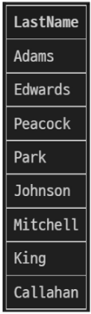

2. 테이블 employess에서 LastName, FirstName 필드의 모든 데이터를 조회

```sql
SELECT
    LastName
    , FirstName
FROM
    employees
;
```

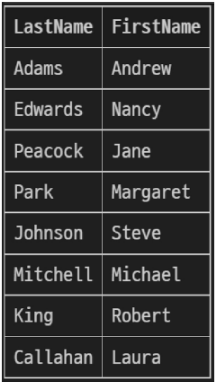

3. 테이블 employees에서 모든 필드 데이터를 조회

```sql
SELECT
    *
FROM
    employees
;
```

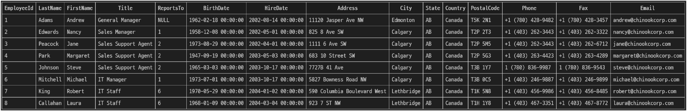

4. 테이블 employees에서 FirstName 필드의 모든 데이터를 조회
    1. 단, 조회 시 FirstName이 아닌 ‘이름’으로 출력될 수 있도록 변경
    
    ```sql
    SELECT
        FirstName AS '이름'
    FROM
        employees
    ;
    ```
    
    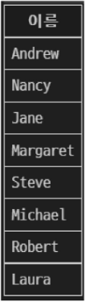
    

5. 테이블 tracks에서 Name, Milliseconds 필드의 모든 데이터 조회
    1. 단, Milliseconds 필드는 60000으로 나눠 분 단위 값으로 출력
    
    ```sql
    SELECT
        Name
        , Millisecond / 60000 AS '재생 시간 (분)'
    FROM
        tracks
    ;
    ```
    
    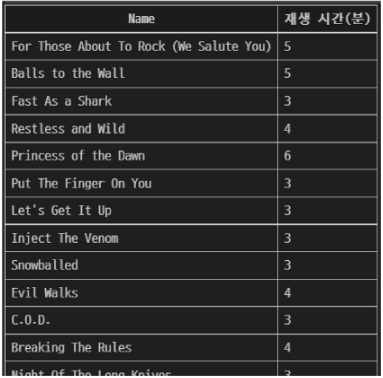
    

---

### Sorting Data

#### 1. ORDER BY Statement

- 조회 결과의 레코드를 정렬

#### 2. ORDER BY Syntax

```sql
SELECT
    select_list
FROM
    table_name
ORDER BY
    column1 [ASC|DESC]
    , column2 [ASC|DESC]
    , ...
;
```

- FROM Clause 뒤에 위치
- 하나 이상의 컬럼을 기준으로 결과를 오름차순(ASC, 기본 값), 내림차순(DESC)으로 정렬

#### 3. ORDER BY 활용

1. 테이블 employees에서 FirstName 필드의 모든 데이터를 오름차순으로 조회

```sql
SELECT
    FirstName
FROM
    employees
ORDER BY
    FirstName
;
```

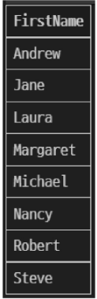

2. 테이블 employees에서 FirstName 필드의 모든 데이터를 내림차순으로 조회

```sql
SELECT
    FirstName
FROM
    employees
ORDER BY
    FirstName DESC
;
```

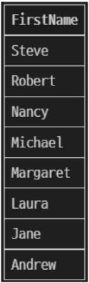

3. 테이블 customers에서 Country 필드를 기준으로 내림차순 정렬한 다음 City 필드 기준으로 오름차순 정렬하여 조회

```sql
SELECT
    Country
    , City
FROM
    customers
ORDER BY
    Country DESC
    , City
;
```

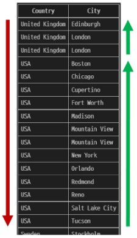

4. 테이블 tracks에서 Milliseconds 필드를 기준으로 내림차순 정렬한 다음 Name, Milliseconds 필드의 모든 데이터를 조회
    1. 단, Milliseconds 필드는 60,000으로 나눠 분 단위 값으로 출력
    
    ```sql
    SELECT
        Name
        , Milliseconds / 60000 AS '재생 시간 (분)'
    FROM
        tracks
    ORDER BY
        Milliseconds DESC
    ;
    ```
    
    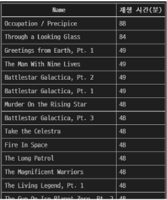
    

#### 5. 정렬에서의 NULL

- NULL 값이 존재할 경우 오름차순 정렬 시 결과에 NULL이 먼저 출력

```sql
SELECT
    ReportsTo
FROM
    employees
ORDER BY
    ReportsTo
;
```

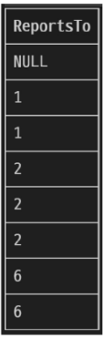

---

### Filtering Data

#### 1. Filtering Data 관련 Keywords

- Clause
    - DISTINCT
    - WHERE
    - LIMIT
- Operator
    - BETWEEN
    - IN
    - LIKE
    - Comparison
    - Logical

---

### Clause

#### 1. DISTINCT Statement

- 조회 결과에서 중복된 레코드를 제거

#### 2. DISTINCT Syntax

```sql
SELECT DISTINCT
    select_list
FROM
    table_name
;
```

- SELECT 키워드 바로 뒤에 작성해야 함
- SELECT DISTINCT 키워드 다음에 고유한 값을 선택하려는 하나 이상의 필드를 지정

#### 3. DISTINCT 활용

1. 테이블 customers에서 Country 필드의 모든 데이터를 오름차순 조회

```sql
SELECT
    Country
FROM
    customers
ORDER BY
    Country
;
```

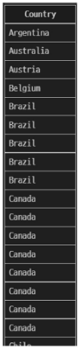

2. 테이블 customers에서 Country 필드의 모든 데이터를 중복 없이 오름차순 조회

```sql
SELECT DISTINCT
    Country
FROM
    customers
ORDER BY
    Country
;
```

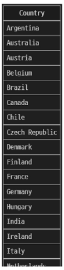

#### 4. WHERE Statement

- 조회 시 특정 검색 조건을 지정

#### 5. WHERE Syntax

```sql
SELECT
    select_list
FROM
    table_name
WHERE
    search_condition
;
```

- FROM Clause 뒤에 위치
- search_condition은 비교 연산자 및 논리 연산자(AND, OR, NOT 등)를 사용하는 구문이 사용됨

#### 6. WHERE 활용

1. 테이블 customers에서 City 필드 값이 ‘Prague’인 데이터의 LastName, FirstName, City 조회

```sql
SELECT
    LastName
    , FirstName
    , City
FROM
    customers
WHERE
    City = 'Prague'
;
```

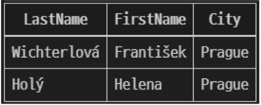

2. 테이블 customers에서 City 필드 값이 ‘Prague’가 아닌 데이터의 LastName, FirstName, City 조회

```sql
SELECT
    LastName
    , FirstName
    , City
FROM
    customers
WHERE
    City != 'Prague'
;
```

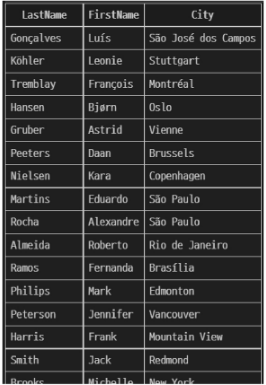

3. 테이블 customers에서 Company 필드 값이 NULL이고, Country 필드 값이 ‘USA’인 데이터의 LastName, FirstName, Company, Country 조회

```sql
SELECT
    LastName
    , FirstName
    , Company
    , Country
FROM
    customers
WHERE
    Company IS NULL
    AND Country = 'USA'
;
```

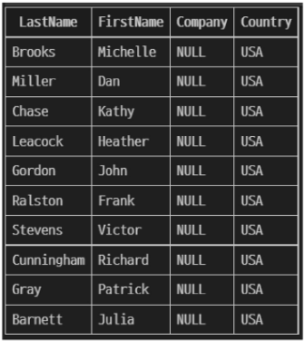

4. 테이블 customers에서 Company 필드 값이 NULL이거나, Country 필드 값이 ‘USA’인 데이터의 LastName, FirstName, Company, Country 조회

```sql
SELECT
    LastName
    , FirstName
    , Company
    , Country
FROM
    customers
WHERE
    Company IS NULL
    OR Country = 'USA'
;
```

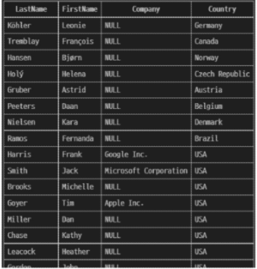

5. 테이블 tracks에서 Bytes 필드 값이 100,000 이상 500,000 이하인 데이터의 Name, Bytes 조회

```sql
SELECT
    Name
    , Bytes
FROM
    tracks
WHERE
    Bytes BETWEEN 100000 AND 500000
;
```

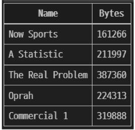

6. 테이블 tracks에서 Bytes 필드 값이 100,000 이상 500,000 이하인 데이터의 Name, Bytes를 Bytes 기준으로 오름차순 조회

```sql
SELECT
    Name
    , Bytes
FROM
    tracks
WHERE
    Bytes BETWEEN 100000 AND 500000
ORDER BY Bytes
;
```

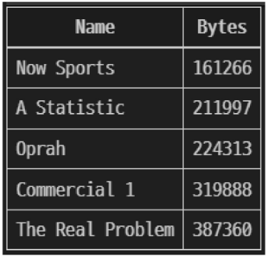

7. 테이블 customers에서 Country 필드 값이 ‘Canada’ 또는 ‘Germany’ 또는 ‘France’인 데이터의 LastName, FirstName, Country 조회

```sql
SELECT
    LastName
    , FirstName
    , Country
FROM
    customers
WHERE
    Country IN ('Canada', 'Germany', 'France')
;
```

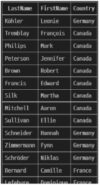

8. 테이블 customers에서 Country 필드 값이 ‘Canada’ 또는 ‘Germany’ 또는 ‘France’가 아닌 데이터의 LastName, FirstName, Country 조회

```sql
SELECT
    LastName
    , FirstName
    , Country
FROM
    customers
WHERE
    Country NOT IN ('Canada', 'Germany', 'France')
;
```

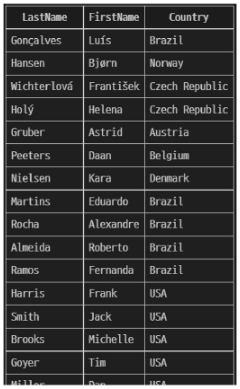

9. 테이블 customers에서 LastName 필드 값이 ‘son’으로 끝나는 데이터의 LastName, FirstName 조회

```sql
SELECT
    LastName
    , FirstName
FROM
    customers
WHERE
    LastName LIKE '%son'
;
```

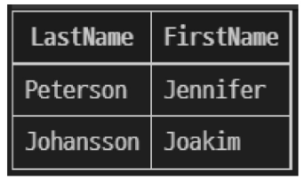

10. 테이블 customers에서 FirstName 필드 값이 4자리면서 ‘a’로 끝나는 데이터의 LastName, FirstName 조회

```sql
SELECT
    LastName
    , FirstName
FROM
    customers
WHERE
    FirstName LIKE '___a'
;
```

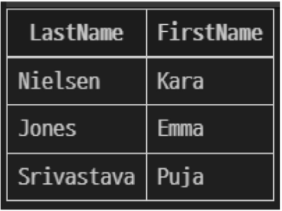

#### 7. LIMIT Clause

- 조회하는 레코드 수를 제한

#### 8. LIMIT Syntax

```sql
SELECT
    select_list
FROM
    table_name
LIMIT [offset, ] row_count
;
```

- 하나 또는 두 개의 인자를 사용
    - 0 또는 양의 정수
- row_count는 조회하는 최대 레코드 수를 지정

#### 9. LIMIT & OFFSET 예시

```sql
SELECT
    ..
FROM
    ..
LIMIT 2, 5
;
```

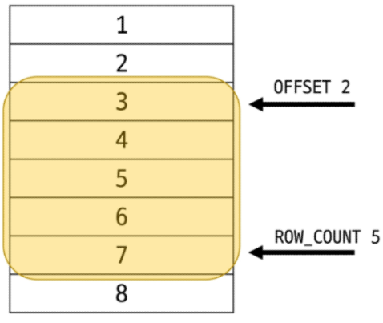

#### 10. LIMIT 활용

1. 테이블 tracks에서 TrackId, Name, Bytes 필드 데이터를 Bytes 기준 내림차순으로 7개만 조회

```sql
SELECT
    TrackId
    , Name
    , Bytes
FROM
    tracks
ORDER BY
    Bytes DESC
LIMIT 7
;
```

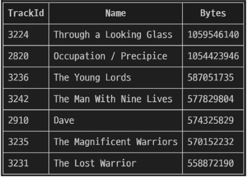

2. 테이블 tracks에서 TrackId, Name, Bytes 필드 데이터를 Bytes 기준 내림차순으로 4번째부터 7번째 데이터만 조회

```sql
SELECT
    TrackId
    , Name
    , Bytes
FROM
    tracks
ORDER BY
    Bytes DESC
LIMIT 3, 4
;
```

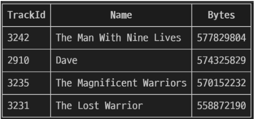

---

### Operator

#### 1. Comparison Operators (비교 연산자)

```sql
-- 비교 연산자 종류
=
>=
<=
!=
IS
LIKE
IN
BETWEEN
AND
...
```

#### 2. Logical Operators (논리 연산자)

```sql
-- 논리 연산자 종류
AND (&&)
OR (||)
NOT (!)
```

#### 3. IN Operator

- 값이 특정 목록 안에 있는지 확인

#### 4. LIKE Operator

- 값이 특정 패턴에 일치하는지 확인
- Wildcards와 함께 사용

#### 5. Wildcard Characters

```sql
-- Wildcard Characters
1. '%'
 - 0개 이상의 문자열과 일치하는지 확인

2. '_'
 - 단일 문자와 일치하는지 확인
```

---

### Grouping Data

#### 1. GROUP BY Clause

- 레코드를 그룹화하여 요약본 생성
- ‘집계 함수’와 함께 사용

#### 2. Aggregation Functions (집계 함수)

- 값에 대한 계산을 수행하고, 단일한 값을 반환하는 함수

```sql
-- 집계 함수 종류
SUM
AVG
MAX
MIN
COUNT
```

#### 3. GROUP BY Syntax

```sql
SELECT
    c1
    , c2
    , ...
    , cn
    , aggregate_function(ci)
FROM
    table_name
GROUP BY
    c1
    , c2
    , ...
    , cn
;
```

- FROM 및 WHERE 절 뒤에 배치
- GROUP BY 절 뒤에 그룹화할 필드 목록을 작성

#### 4. GROUP BY 예시

1. Country 필드를 그룹화

```sql
SELECT
    Country
FROM
    customers
GROUP BY
    Country
;
```

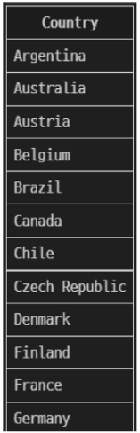

2. COUNT 함수가 각 그룹에 대한 집계된 값을 계산

```sql
SELECT
    Country
    , COUNT(*)
FROM
    customers
GROUP BY
    Country
;
```

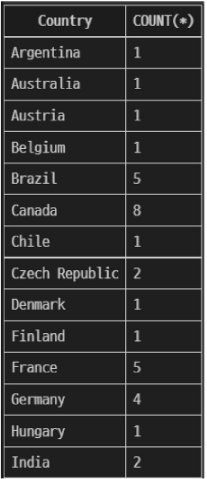

#### 5. GROUP BY 활용

1. 테이블 tracks에서 Composer 필드를 그룹화하여 각 그룹에 대한 Bytes의 평균 값을 내림차순 조회

```sql
SELECT
    Composer
    , AVG(Bytes)
FROM
    tracks
GROUP BY
    Composer
ORDER BY
    AVG(Bytes) DESC
;

-- 별칭 버전
SELECT
    Composer
    , AVG(Bytes) AS avgOfBytes
FROM
    tracks
GROUP BY
    Composer
ORDER BY
    avgOfBytes DESC
;
```

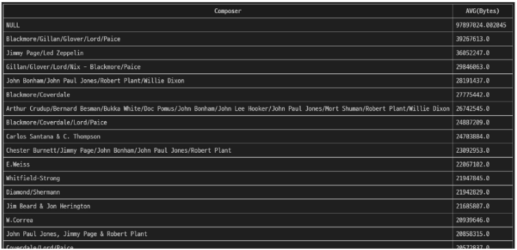

2. 테이블 tracks에서 Composer 필드를 그룹화하여 각 그룹에 대한 Milliseconds의 평균 값이 10 미만인 데이터 조회
    1. 단, Milliseconds 필드는 60,000으로 나눠 분 단위 값의 평균으로 계산
    
    ```sql
    SELECT
        Composer
        , AVG(Milliseconds / 60000) AS avgOfMinute
    FROM
        tracks
    GROUP BY
        Composer
    HAVING
        avgOfMinute < 10
    ;
    ```
    
    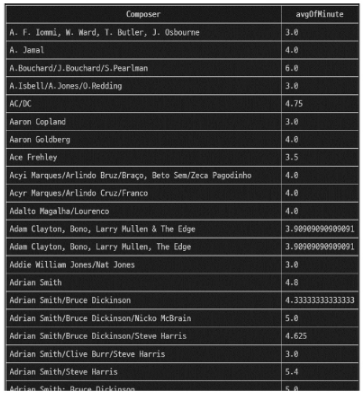
    

#### 6. HAVING Clause

- 집계 항목에 대한 세부 조건을 지정
- 주로 GROUP BY와 함께 사용되며 GROUP BY가 없다면 WHERE처럼 동작

#### 7. SELECT Statement 실행 순서

1. 테이블에서 (FROM)
2. 특정 조건에 맞추어 (WHERE)
3. 그룹화하고 (GROUP BY)
4. 만약 그룹 중에서 조건이 있다면 맞추고 (HAVING)
5. 조회하여 (SELECT)
6. 정렬하고 (ORDER BY)
7. 특정 위치의 값을 가져옴 (LIMIT)


---

### 참고

#### 1. Query

- “데이터베이스로부터 정보를 요청”하는 것
- 일반적으로 SQL로 작성하는 코드를 쿼리문(SQL문)이라 함

#### 2. SQL 표준

- SQL은 미국 국립 표준 협회(ANSI)와 국제 표준화 기구(ISO)에 의해 표준이 채택됨
- 모든 RDBMS에서 SQL 표준을 지원
- 다만 각 RDBMS마다 독자적인 기능에 따라 표준을 벗어나는 문법이 존재하니 주의