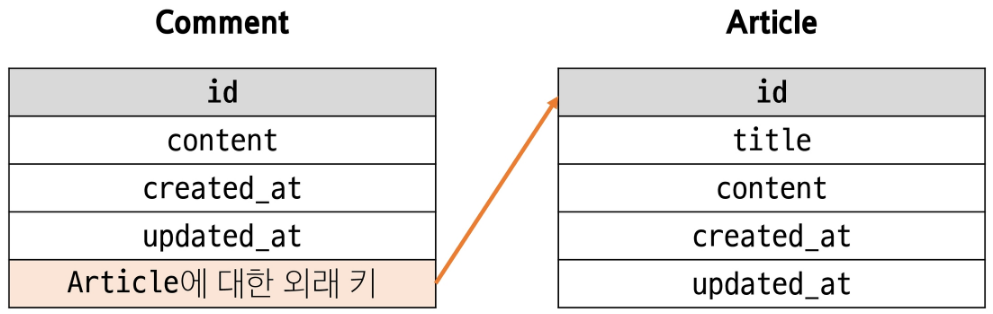
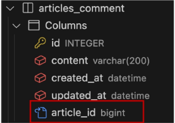
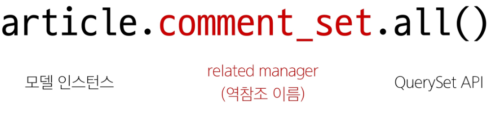

## Database 03 (2025.04.09)

### 모델 관계

#### 1. Many to One Relationships

- N:1 or 1:N
- 한 테이블의 0개 이상의 레코드가 다른 테이블의 레코드 한 개와 관련된 관계

#### 2. Comment(N) - Article(1)

- 0개 이상의 댓글은 1개의 게시글에 작성될 수 있음

#### 3. 테이블 관계



---

### 댓글 모델 정의

#### 1. ForeignKey()

- 한 모델이 다른 모델을 참조하는 관계를 설정하는 필드
- N:1 관계 표현
- 데이터베이스에서 외래 키로 구현

#### 2. 댓글 모델 정의

- ForeignKey 클래스의 인스턴스 이름은 참조하는 모델 클래스 이름의 단수형으로 작성하는 것을 권장
- 외래 키는 ForeignKey 클래스를 작성하는 위치와 관계 없이 테이블의 마지막 필드로 생성됨

```python
# articles/models.py
class Comment(models.Model):
    article = models.ForeignKey(Article, on_delete=models.CASCADE)
```

#### 3. ForeignKey(to, on_delete)

- to
    - 참조하는 모델 class 이름
- on_delete
    - 외래 키가 참조하는 객체(1)가 사라졌을 때, 외래 키를 가진 객체(N)를 어떻게 처리할 지를 정의하는 설정 (데이터 무결성)

#### 4. on_delete의 ‘CASCADE’

- 참조된 객체(부모 객체)가 삭제될 때, 이를 참조하는 모든 객체도 삭제되도록 지정
- 참고 자료
    - https://docs.djangoproject.com/en/4.2/ref/models/fields/#arguments

#### 5. Migration 이후 댓글 테이블 확인

- 댓글 테이블의 article_id 외래 키 필드 확인
- 만들어지는 필드 이름
    - ‘참조 대상 클래스 단수형 변수명’ + ‘_’ + ‘id’
- 참조하는 클래스 이름의 소문자(단수형)로 작성하는 것이 권장되었던 이유



---

### 관계 모델 참조

#### 1. 역참조

- N:1 관계에서 1에서 N을 참조하거나 조회하는 것 (1 → N)
- 모델 간의 관계에서 관계를 정의한 모델이 아닌, 관계의 대상이 되는 모델에서 연결된 객체들에 접근하는 바식
- N은 외래 키를 가지고 있어 물리적으로 참조가 가능하지만, 1은 N에 대한 참조 방법이 존재하지 않아 별도의 역참조 키워드가 필요

#### 2. 역참조 사용 예시



- 특정 게시글에 작성된 댓글 전체를 조회하는 요청

#### 3. related manager

- N:1 혹은 M:N 관계에서 역참조 시에 사용하는 매니저
- ‘objects’ 매니저를 통해 QuerySet API를 사용했던 것처럼 related manager를 통해 QuerySet API를 사용할 수 있게 됨

#### 4. related manager 이름 규칙

- N:1 관계에서 생성되는 related manager의 이름은 “모델명_set” 형태로 자동 생성됨
    - 관계를 직접 정의하지 않은 모델에서 연결된 객체들을 조회할 수 있게 함
- 특정 댓글의 게시글 참조 (Comment → Article)
    
    ```python
    comment.article
    ```
    

- 특정 게시글의 댓글 목록 참조 (Article → Comment)
    
    ```python
    article.comment_set.all()
    ```
    

#### 5. save(commit=False)

- DB에 저장 요청을 보내지 않고 인스턴스만 반환
    - CREATE, but don’t save the new instance

---

### 참고

#### 1. 데이터 무결성

- 데이터베이스에 저장된 데이터의 정확한, 일관성, 유효성을 유지하는 것
- 데이터베이스에 저장된 데이터 값의 정확성을 보장하는 것
- 중요성
    1. 데이터의 신뢰성 확보
    2. 시스템 안정성
    3. 보안 강화

#### 2. 댓글 추가 구현

1. 댓글이 없는 경우 대체 콘텐츠 출력
    1. DTL의 ‘for empty’ 태그 활용
2. 댓글 갯수 출력하기
    1. DTL filter - ‘length’ 사용
    2. QuerySet API - ‘count()’ 사용
    
    ```html
     1. 댓글이 없는 경우 대체 콘텐츠 출력 
     DTL의 'for empty' 태그 활용 
    
    
    
    
     2. 댓글 갯수 출력하기 
     (1) DTL filter - 'length' 사용 
    {{comments|length}}
    {{article.comment_set.all|length}}
    
     (2) QuerySet API - 'count()' 사용 
    {{article.comment_set.count}}
    ```