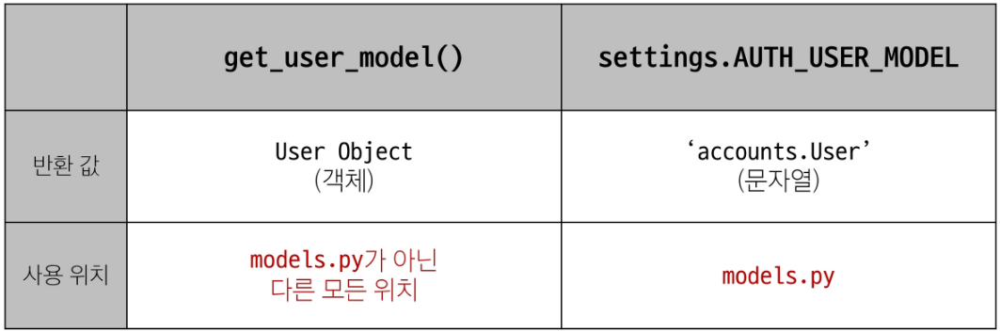
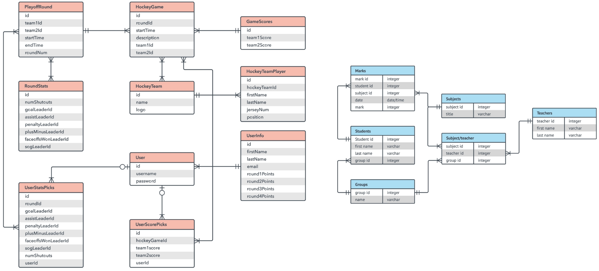
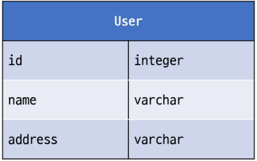
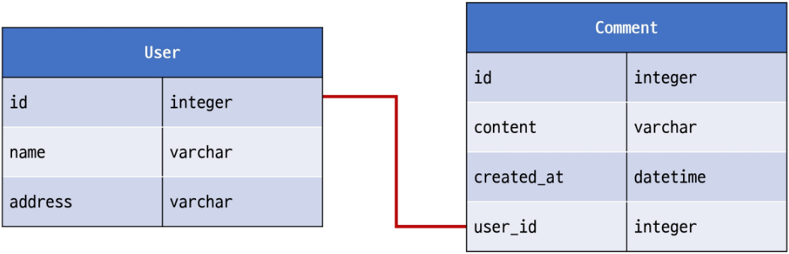
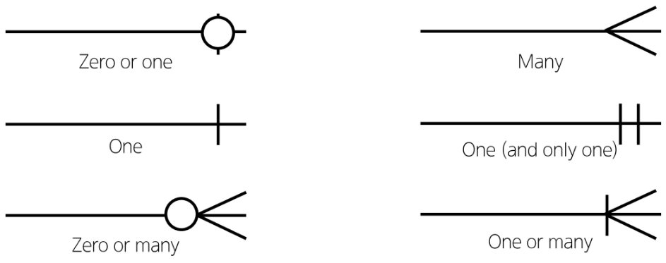
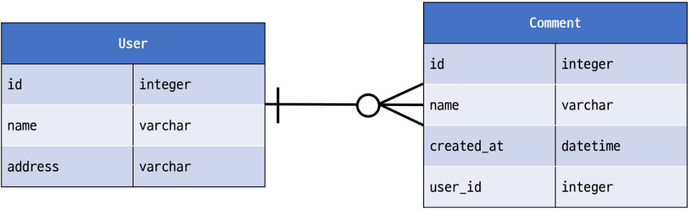

## Database 04 (2025.04.10)

### Many to One Relationships

#### 1. User와 다른 모델 간의 모델 관계 설정

1. User & Article
2. User & Comment

#### 2. Article(N) - User(1)

- 0개 이상의 게시글은 1명의 회원에 의해 작성될 수 있음

#### 3. Comment(N) - User(1)

- 0개 이상의 댓글은 1명의 회원에 의해 작성될 수 있음

---

### 모델 관계 설정 (Article & User)

#### 1. Article - User 모델 관계 설정

- User 외래 키 정의

```python
# articles/models.py
from django.conf import settings

class Article(models.Model):
    user = models.ForeignKey(settings.AUTH_USER_MODEL, on_delete=models.CASCADE)
```

#### 2. User 모델을 참조하는 2가지 방법 (1/2)

1. get_user_model()
2. settings.AUTH_USER_MODEL

#### 3. User 모델을 참조하는 2가지 방법 (2/2)

- django 프로젝트 ‘내부적인 구동 순서’와 ‘반환 값’에 따른 이유
- 기억해야 할 것은 User 모델은 직접 참조하지 않는다는 것
- get_user_model()은 models.py를 기반으로 객체를 생성해서 반환해주기 때문에, 서버에 models.py가 업로드되기 전엔 settings.AUTH_USER_MODEL을 사용해야 함
- 그래서 models.py에는 settings.AUTH_USER_MODEL을 사용함



#### 4. 댓글 DELETE

- 댓글 삭제 요청 사용자와 댓글 작성 사용자를 비교하여, 본인의 댓글만 삭제할 수 있도록 하기

```python
# articles/views.py
def comments_delete(request, article_pk, comment_pk):
    comment = Comment.objects.get(pk=comment_pk)
    if request.user == comment.user:
        comment.delete()
```

- 해당 댓글의 작성자가 아니라면, 댓글 삭제 버튼을 출력하지 않도록 함

```html
 articles/detail.html 
<ul>
  
    <li>
      {{comment.user}} - {{comment.content}}
      
        <form action="" method="POST">
          
          <input type="submit" value="삭제">
        </form>
      
    </li>
  
</ul>
```

---

### View Decorators

#### 1. View Decorators

- View 함수의 동작을 수정하거나 추가 기능을 제공하는 데 사용되는 Python 데코레이터
- 코드의 재사용성을 높이고, 뷰 로직을 간결하게 유지

#### 2. View Decorators 종류

- Allowed HTTP methods
- Conditional view processing
- GZip compression 등

#### 3. Allowed HTTP methods

- 특정 HTTP method로만 View 함수에 접근할 수 있도록 제한하는 데코레이터

#### 4. 주요 Allowed HTTP methods

```python
1. require_http_methods(["METHOD1", "METHOD2", ...])
 - 지정된 HTTP method만 허용

2. require_safe()
 - GET과 HEAD method만 허용

3. require_POST()
 - POST method만 허용
```

#### 5. require_http_methods()

- 지정된 HTTP method만 허용

```python
from django.views.decorators.http import require_http_methods

@require_http_methods(["GET", "POST"])
def index(request):
    pass
```

#### 6. require_safe()

- GET과 HEAD method만 허용

```python
from django.views.decorators.http import require_safe

@require_safe
def index(request):
    pass
```

#### 7. require_POST()

- POST method만 허용

```python
from django.views.decorators.http import require_POST

@require_POST
def index(request):
    pass
```

#### 8. Allowed HTTP methods 주요 특징

- 지정되지 않은 HTTP method로 요청이 들어오면 HttpResponseNotAllowed(405)를 반환
- 대문자로 HTTP method를 지정

#### 9. require_GET 대신 require_safe를 권장하는 주요 이유

- 웹 표준 준수
    - GET과 HEAD는 “안전한(safe)” 메서드로 간주됨
- 호환성
    - 일부 소프트웨어는 HEAD 요청에 의존
- 웹 표준을 준수하고, 더 넓은 범위의 클라이언트와 호환되며, 안전한 HTTP 메서드만을 허용하는 view 함수를 구현할 수 있음

#### 10. login_required

- 로그인 된 사용자만 views 메서드에 접근할 수 있게 해주는 데코레이터

```python
from django.contrib.auth.decorators import login_required

@login_required
def delete(request, pk):
    pass
```

---

### ERD

#### 1. ERD

- “Entity-Relationship Diagram”
- 데이터베이스의 구조를 시각적으로 표현하는 도구
- Entity(개체), 속성, 그리고 엔티티 간의 관계를 그래픽 형태로 나타내어 시스템의 논리적 구조를 모델링하는 다이어그램



#### 2. ERD 구성 요소

1. 엔티티 (Entity)
    1. 데이터베이스에 저장되는 객체나 개념
    2. 예시
        1. 고객, 주문, 제품
2. 속성 (Attribute)
    1. 엔티티의 특성이나 성질
    2. 예시
        1. 고객 (이름, 주소, 전화번호)
3. 관계 (Relationship)
    1. 엔티티 간의 연관성
    2. 예시
        1. 고객이 ‘주문’한 제품

#### 3. 개체와 속성

- 개체
    - 회원 (User)
- 속성
    - 개체가 지닌 속성 및 속성의 데이터 타입
    - 속성의 예시
        - 회원번호 (id)
        - 이름 (name)
        - 주소 (address) 등
        
        
        
    
- 관계
    - 예시
        - 회원과 댓글 간의 관계
            - 회원이 “작성”한 댓글
            
            
            

#### 4. Cardinality

- 한 엔티티와 다른 엔티티 간의 수적 관계를 나타내는 표현
- 주요 유형
    1. 일대일 (one-to-one, 1:1)
    2. 다대일 (many-to-one, N:1)
    3. 다대다 (many-to-many, M:N)

#### 5. Cardinality 표현

- 선의 끝부분에 표시되며 일반적으로 숫자나 기호(까마귀 발)로 표현됨



#### 6. Cardinality 적용

- 회원은 여러 댓글을 작성함
- 각 댓글은 하나의 회원만 존재함



#### 7. ERD의 중요성

- 데이터베이스 설계의 핵심 도구
- 시각적 모델링으로 효과적인 의사소통 지원
- 실제 시스템 개발 전 데이터 구조 최적화에 중요

#### 8. 무료 ERD 제작 사이트

- Draw.io (diagrams.net)
    - 별도의 회원가입 없이 바로 사용 가능
    - 다양한 다이어그램 템플릿 제공
    - https://app.diagrams.net/
- ERDCloud
    - 실시간 협업 기능 지원
    - https://www.erdcloud.com/