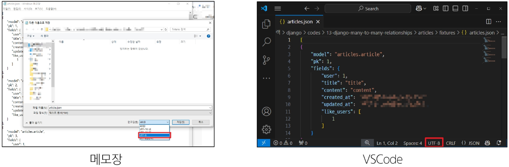

## Database 06 (2025.04.15)

### 팔로우 기능 구현

#### 1. User(M) - User(N)

- 0명 이상의 회원은 0명 이상의 회원과 관련
- 회원은 0명 이상의 팔로워를 가질 수 있고, 0명 이상의 다른 회원들을 팔로잉 할 수 있음

#### 2. 모델 관계 설정

- ManyToManyField 작성

```python
from django.db import models
from django.contrib.auth.models import AbstractUser

class User(AbstractUser):
    followings = models.ManyToManyField(
        'self', 
        symmetrical=False, 
        related_name='followers',
    )
```

- 참조
    - 내가 팔로우하는 사람들 (팔로잉, followings)
- 역참조
    - 상대방 입장에서 나는 팔로워 중 한 명 (팔로워, followers)
- 바뀌어도 상관 없으나 관계 조회 시 생각하기 편한 방향으로 정하기

#### 3. 금일 최종 코드

- accounts/models.py

```python
from django.db import models
from django.contrib.auth.models import AbstractUser

class User(AbstractUser):
    followings = models.ManyToManyField(
        'self', 
        symmetrical=False, 
        related_name='followers',
    )
```

- accounts/urls.py

```python
from django.urls import path
from . import views

app_name = 'accounts'
urlpatterns = [
    path('login/', views.login, name='login'),
    path('logout/', views.logout, name='logout'),
    path('signup/', views.signup, name='signup'),
    path('delete/', views.delete, name='delete'),
    path('update/', views.update, name='update'),
    path('profile/<str:username>/', views.profile, name='profile'),
    path('<int:user_pk>/follow/', views.follow, name='follow'),
]
```

- accounts/views.py

```python
from django.contrib.auth import login as auth_login
from django.contrib.auth import logout as auth_logout
from django.contrib.auth import update_session_auth_hash, get_user_model
from django.contrib.auth.forms import AuthenticationForm, PasswordChangeForm
from django.shortcuts import redirect, render

from .forms import CustomUserChangeForm, CustomUserCreationForm

def login(request):
    if request.user.is_authenticated:
        return redirect('articles:index')

    if request.method == 'POST':
        form = AuthenticationForm(request, request.POST)
        if form.is_valid():
            auth_login(request, form.get_user())
            return redirect('articles:index')
    else:
        form = AuthenticationForm()
    context = {
        'form': form,
    }
    return render(request, 'accounts/login.html', context)

def logout(request):
    auth_logout(request)
    return redirect('articles:index')

def signup(request):
    if request.user.is_authenticated:
        return redirect('articles:index')

    if request.method == 'POST':
        form = CustomUserCreationForm(request.POST)
        if form.is_valid():
            form.save()
            return redirect('articles:index')
    else:
        form = CustomUserCreationForm()
    context = {
        'form': form,
    }
    return render(request, 'accounts/signup.html', context)

def delete(request):
    request.user.delete()
    return redirect('articles:index')

def update(request):
    if request.method == 'POST':
        form = CustomUserChangeForm(request.POST, instance=request.user)
        if form.is_valid():
            form.save()
            return redirect('articles:index')
    else:
        form = CustomUserChangeForm(instance=request.user)
    context = {
        'form': form,
    }
    return render(request, 'accounts/update.html', context)

def change_password(request, user_pk):
    if request.method == 'POST':
        form = PasswordChangeForm(request.user, request.POST)
        if form.is_valid():
            user = form.save()
            update_session_auth_hash(request, user)
            return redirect('articles:index')
    else:
        form = PasswordChangeForm(request.user)
    context = {
        'form': form,
    }
    return render(request, 'accounts/change_password.html', context)

def profile(request, username):
    # username으로 어떤 유저인지 조회
    # get_user_model().objects.get(username=username)
    User = get_user_model()
    person = User.objects.get(username=username)
    context = {
        'person': person,
    }
    return render(request, 'accounts/profile.html', context)

def follow(request, user_pk):
    # 팔로우 할 상대방 조회
    User= get_user_model()
    you = User.objects.get(pk=user_pk)
    me = request.user

    # 내가 나를 팔로우 하려는 것은 아닌지 먼저 확인
    # 나와 저 사람이 다른 사람일 경우 팔로우 로직 진행
    if me != you:
        # 좋아요를 추가하는 건지 / 취소하는 건지 구분
        # 상대방의 팔로워 목록에 내가 있는지 없는지를 확인
        if me in you.followers.all():
            you.followers.remove(me)
            # me.followings.remove(you)
        else:
            you.followers.add(me)
            # me.followings.add(you)
    return redirect('accounts:profile', you.username)
```

- accounts/profile.html

```html
 accounts/profile.html 
<!DOCTYPE html>
<html lang="en">
<head>
  <meta charset="UTF-8">
  <meta name="viewport" content="width=device-width, initial-scale=1.0">
  <title>Document</title>
</head>
<body>
  <h1>{{ person.username }}의 프로필 페이지</h1>
   팔로잉 / 팔로워 수 출력 
  <div>
    팔로잉 : {{ person.followings.all|length }} / 팔로워 : {{ person.followers.all|length }}
  </div>

   팔로우 버튼 
  
    <form action="" method="POST">
      
      
        <input type="submit" value="언팔로우">
      
        <input type="submit" value="팔로우">
      
    </form>
  

  <hr>
  <h2>{{ person.username }}가 작성한 게시글</h2>
  
    <p>{{ article.title }}</p>
  
  <hr>
  <h2>{{ person.username }}가 작성한 댓글</h2>
  
    <p>{{ comment.content }}</p>
  
  <hr>
  <h2>{{ person.username }}가 좋아요를 누른 게시글</h2>
  
    <p>{{ article.title }}</p>
  
</body>
</html>
```

---

### Fixtures

#### 1. Fixtures

- Django 개발 시 데이터베이스 초기화 및 공유를 위해 사용되는 파일 형식
- Fixtures 파일을 직접 만들지 않기
    - 반드시 dumpdata 명령어를 사용하여 생성
    - 혹은 생성형 AI를 학습 후 이용해서 생성

#### 2. Fixtures 사용 목적

- 샘플, 초기 데이터 세팅
- 협업 시 동일한 데이터 환경 맞추기

#### 3. 초기 데이터의 필요성

- 협업하는 유저 A, B가 있다고 생각해보기
    1. A가 먼저 프로젝트를 작업 후 원격 저장소에 push 진행
        1. gitignore로 인해 DB는 업로드하지 않기 때문에 A가 생성한 데이터도 업로드 X
    2. B가 원격 저장소에서 A가 push한 프로젝트를 pull (혹은 clone)
        1. 결과적으로 B는 DB가 없는 프로젝트를 받게 됨
- 이처럼 프로젝트의 앱을 처음 설정할 때 동일하게 준비된 데이터로 데이터베이스를 미리 채우는 것이 필요한 순간이 있음
- Django에서는 fixtures를 사용해 앱에 초기 데이터(initial data)를 제공

#### 4. Fixtures 관련 명령어

- dumpdata
    - 생성 (데이터 추출)
    - 데이터베이스의 특정 모델 혹은 앱 전체 데이터를 추출
    - dumpdata 기본 명령어
        - `python manage.py dumpdata [앱이름.모델이름] [옵션] > 추출파일명.json`
            - 앱 이름.모델이름 지정
                - 특정 모델의 데이터를 추출
            - 앱이름만 지정
                - 해당 앱의 모든 모델에 대한 데이터를 추출
            - 앱 혹은 모델 명을 지정하지 않은 경우
                - 프로젝트 전체의 모델 데이터를 추출
            - `--format` 옵션을 통해 JSON, YAML 등의 형식 지정 가능
                - 기본 값: JSON
            - dumpdata 명령어 예시
                - `python manage.py dumpdata --indent 4 accounts.user > users.json`
                - `python manage.py dumpdata --indent 4 articles.comment > comments.json`
- loaddata
    - 로드 (데이터 입력)
    - dumpdata를 통해 추출한 데이터 파일을 다시 데이터베이스에 반영
    - loaddata 기본 명령어
        - `python manage.py loaddata 파일경로`
            - Fixtures 파일의 기본 경로에 있는 파일을 DB에 반영
            - Fixtures 파일의 기본 경로
                - app_name/fixtures/
            - Django는 설치된 모든 app의 디렉토리에서 fixtures 폴더 이후의 경로로 fixtures 파일을 찾아 load를 진행
            - loaddata 명령어 예시
                - `python manage.py loaddata articles.json users.json comments.json`
                    - dumpdata로 생성한 파일들을 모두 DB에 반영
                    - 파일은 작성 순서에 상관 없음
                - `python manage.py loaddata user.json`
                - `python manage.py loaddata articles.json`
                - `python manage.py loaddata comments.json`
                    - 단, loaddata를 한 번에 실행하지 않고 별도로 실행한다면, 모델 관계에 따라 load 순서가 중요할 수 있음
                        - comment는 article에 대한 key 및 user에 대한 key가 필요
                        - article은 user에 대한 key가 필요
                    - 즉, 현재 모델 관계에서는 user → article → comment 순으로 data를 load해야 오류가 발생하지 않음

#### 5. dumpdata 정리

- dumpdata 명령어를 사용하면 프로젝트 내 특정 앱 혹은 모델에 대한 데이터를 JSON 등 원하는 포맷으로 추출 가능
- 이렇게 생성된 데이터 파일은 추후 다른 환경에서 loaddata로 불러와 동일한 데이터 상태를 재현할 수 있으며, 협업 및 배포에 큰 장점이 있음

#### 6. loaddata 주의사항

- loaddata를 실행하기 전에 해당 모델에 대한 마이그레이션이 완료되어 있어야 함
- 같은 PK를 가진 데이터가 이미 있는 경우 중복 에러가 발생할 수 있음
    - 이 경우 기존 데이터를 지우거나, 새로운 Fixture 파일을 사용해야 함

#### 7. loaddata 정리

- loaddata 명령어는 dumpdata로 추출한 Fixture 파일을 DB로 불러오는 명령어이며, 개발 환경 준비나 협업 시 매우 유용
- 마이그레이션 상태를 먼저 확인하고, 인코딩 문제 등을 사전에 해결하면 매끄럽게 데이터를 복원할 수 있음

---

### Improve query

#### 1. Improve query

- “query 개선하기”
- 같은 결과를 얻기 위해 DB 측에 보내는 query 개수를 점차 줄여 조회하기

#### 2. annotate

- SQL의 GROUP BY를 사용
- 쿼리셋의 각 객체에 계산된 필드를 추가
- 집계 함수(Count, Sum 등)와 함께 자주 사용됨

#### 3. annotate 예시

```python
Book.objects.annotate(num_authors=Count("authors"))
```

- 의미
    - 결과 객체에 ‘num_authors’라는 새로운 필드를 추가
    - 이 필드는 각 책과 연관된 저자의 수를 계산
- 결과
    - 결과에는 기존 필드와 함께 ‘num_authors’ 필드를 가지게 됨
    - book.num_authors로 해당 책의 저자 수에 접근할 수 있게 됨
- 문제 원인
    - 각 게시글마다 댓글 개수를 반복 평가
    
    ```html
     articles/index_1.html 
    <p>댓글 갯수: {{article.comment_set.count}}</p>
    ```
    

- 문제 해결
    - 게시글을 조회하면서 댓글 개수까지 한 번에 조회해서 가져오기
    
    ```python
    # articles/views.py
    def index_1(request):
        # articles = Article.objects.order_by('-pk')
        articles = Article.objects.annotate(Count('comment')).order_by('-pk')
        context = {
            'articles': articles,
        }
        return render(request, 'articles/index_1.html', context)
    ```
    
    ```html
     articles/index_1.html 
    <p>댓글 갯수: {{article.comment__count}}</p>
    ```
    

#### 4. select_related

- SQL의 INNER JOIN를 사용
- 1:1 또는 N:1 참조 관계에서 사용
    - ForeignKey나 OneToOneField 관계에 대해 JOIN을 수행
- 단일 쿼리로 관련 객체를 함께 가져와 성능을 향상

#### 5. select_related 예시

```python
Book.objects.select_related("publisher")
```

- 의미
    - Book 모델과 연관된 Publisher 모델의 데이터를 함께 가져옴
    - ForeignKey 관계인 ‘publisher’를 JOIN하여 단일 쿼리 만으로 데이터를 조회
- 결과
    - Book 객체를 조회할 때 연관된 Publisher 정보도 함께 로드
    - book.publisher.name과 같은 접근이 추가적인 데이터베이스 쿼리 없이 가능
- 문제 원인
    - 각 게시글마다 작성한 유저 명까지 반복 평가
    
    ```html
     articles/index_2.html 
    
      <h3>작성자 : {{ article.user.username }}</h3>
      <p>제목 : {{ article.title }}</p>
      <hr>
    
    ```
    

- 문제 해결
    - 게시글을 조회하면서 유저 정보까지 한 번에 조회해서 가져오기
    
    ```python
    # articles/views.py
    from django.db.models import Count
    
    def index_2(request):
        # articles = Article.objects.order_by('-pk')
        articles = Article.objects.select_related('user').order_by('-pk')
        context = {
            'articles': articles,
        }
        return render(request, 'articles/index_2.html', context)
    ```
    

#### 6. prefetch_related

- SQL이 아닌 Python을 사용한 JOIN을 진행
    - 관련 객체들을 미리 가져와 메모리에 저장하여 성능을 향상
- M:N 또는 N:1 역참조 관계에서 사용
    - ManyToManyField나 역참조 관계에 대해 별도의 쿼리를 실행

#### 7. prefetch_related 예시

```python
Book.objects.prefetch_related("authors")
```

- 의미
    - Book과 Author는 ManyToMany 관계로 가정
    - Book 모델과 연관된 모든 Author 모델의 데이터를 미리 가져옴
    - Django가 별도의 쿼리로 Author 데이터를 가져와 관계를 설정
- 결과
    - Book 객체들을 조회한 후, 연관된 모든 Author 정보가 미리 로드 됨
    - for author in book.authors.all()와 같은 반복이 추가적인 데이터베이스 쿼리 없이 실행됨
- 문제 원인
    - 각 게시글 출력 후 각 게시글의 댓글 목록까지 개별적으로 모두 평가
    
    ```html
     articles/index_3.html 
    
      <p>제목 : {{ article.title }}</p>
      <p>댓글 목록</p>
      
        <p>{{ comment.content }}</p>
      
      <hr>
    
    ```
    

- 문제 해결
    - 게시글을 조회하면서 참조된 댓글까지 한 번에 조회해서 가져오기
    
    ```python
    # articles/views.py
    def index_3(request):
        # articles = Article.objects.order_by('-pk')
        articles = Article.objects.prefetch_related('comment_set').order_by('-pk')
        context = {
            'articles': articles,
        }
        return render(request, 'articles/index_3.html', context)
    ```
    

#### 8. select_related & prefetch_related

- 문제 원인
    - “게시글” + “각 게시글의 댓글 목록” + “댓글의 작성자”를 단계적으로 평가
    
    ```html
     articles/index_4.html 
    
      <p>제목 : {{ article.title }}</p>
      <p>댓글 목록</p>
      
        <p>{{ comment.user.username }} : {{ comment.content }}</p>
      
      <hr>
    
    ```
    

- 문제 해결
    - 1단계
        - 게시글을 조회하면서 참조된 댓글까지 한 번에 조회
        
        ```python
        # articles/views.py
        def index_4(request):
            # articles = Article.objects.order_by('-pk')
            articles = Article.objects.prefetch_related('comment_set').order_by('-pk')
            # articles = Article.objects.prefetch_related(
            #    Prefetch('comment_set', queryset=Comment.objects.select_related('user'))
            # ).order_by('-pk')
        
            context = {
                'articles': articles,
            }
            return render(request, 'articles/index_4.html', context)
        ```
        
    
    - 2단계
        - “게시글” + “각 게시글의 댓글 목록” + “댓글의 작성자”를 한 번에 조회
        
        ```python
        # articles/views.py
        from django.db.models import Prefetch
        
        def index_4(request):
            articles = Article.objects.order_by('-pk')
            # articles = Article.objects.prefetch_related('comment_set').order_by('-pk')
            articles = Article.objects.prefetch_related(
                Prefetch('comment_set', queryset=Comment.objects.select_related('user'))
            ).order_by('-pk')
        
            context = {
                'articles': articles,
            }
            return render(request, 'articles/index_4.html', context)
        ```
        

---

### 참고

#### 1. .exists()

- QuerySet에 결과가 하나 이상 존재하는지 여부를 확인하는 메서드
- 결과가 포함되어 있으면 True를 반환하고, 결과가 포함되어 있지 않으면 False를 반환

#### 2. exists() 특징

- 데이터베이스에 최소한의 쿼리만 실행하여 효율적
- 전체 QuerySet을 평가하지 않고 결과의 존재 여부만 확인
- 대량의 QuerySet에 있는 특정 객체 검색에 유용

#### 3. exists 적용 예시

1. likes 예시

```python
# articles/views.py
# 적용 전
def likes(request, article_pk):
    article = Article.objects.get(pk=article_pk)
    if request.user in article.like_users.all():
        article.like_users.remove(request.user)
    else:
        article.like_users.add(request.user)
    return redirect('articles:index')
    
# 적용 후
def likes(request, article_pk):
    article = Article.objects.get(pk=article_pk)
    if article.like_users.filter(pk=request.user.pk).exists:
        article.like_users.remove(request.user)
    else:
        article.like_users.add(request.user)
    return redirect('articles:index')
```

2. follow 예시

```python
# accounts/views.py
# 적용 전
def follow(request, user_pk):
    User= get_user_model()
    you = User.objects.get(pk=user_pk)
    me = request.user
    if me != you:
        if me in you.followers.all():
            you.followers.remove(me)
        else:
            you.followers.add(me)
    return redirect('accounts:profile', you.username)

# 적용 후
def follow(request, user_pk):
    User= get_user_model()
    you = User.objects.get(pk=user_pk)
    me = request.user
    if me != you:
        if me.followers.filter(pk=request.user.pk).exists():
            you.followers.remove(me)
        else:
            you.followers.add(me)
    return redirect('accounts:profile', you.username)
```

#### 4. 한꺼번에 dump하기

```bash
# 모델 3개를 json 파일 1개로 추출
$ python manage.py dumpdata --indent 4 articles.article articles.comment accounts.user > data.json

# 모든 모델을 json. 파일 1개로 추출
$ python manage.py dumpdata --indent 4 > data.json
```

- 다만 모든 데이터를 한 번에 추출할 경우 파일 용량이 커질 수 있으므로, 필요에 따라 특정 앱만 추출하거나, 파일을 압축하여 관리하는 방법을 고려
- 데이터베이스 변경이 잦은 경우 전체 추출보다는 앱 단위 또는 모델 단위로 관리하는 편이 유지 보수에 용이

#### 5. loaddata 인코딩 문제 에러

- JSON 파일 생성 및 로딩 시, 파일이 특정 문자 인코딩(예: UTF-8)으로 저장되지 않으면 한글 등 비ASCII 문자가 깨지거나, UnicodeDecodeError 등의 에러가 발생할 수 있음
- 윈도우 환경에서 생성한 파일을 리눅스 환경에서 로딩할 때, 혹은 반대 상황에서 인코딩 이슈가 빈번히 발생

```bash
UnicodeDecodeError: 'utf-8' codec can't decode byte 0xc0 in position ...
```

- 해결 방법
    - 방법 1
        - dumpdata 시 추가 명령어 작성
        
        ```bash
        $ python -Xutf8 manage.py dumpdata [생략]
        ```
        
    
    - 방법 2
        - 이미 추출된 fixtures 파일이 있다면, 에디터(메모장, VSCode 등)에서 파일을 열고 인코딩을 UTF-8로 지정한 뒤 다시 저장
        
        