## Django 01 (2025.03.24)

### Web Application

#### 1. Web Application (Web Service) 개발

- 인터넷을 통해 사용자에게 제공되는 소프트웨어 프로그램을 구축하는 과정
- 다양한 디바이스(모바일, 태블릿, PC 등)에서 웹 브라우저를 통해 접근하고 사용할 수 있음

#### 2. 클라이언트와 서버

- ‘클라이언트-서버’ 구조

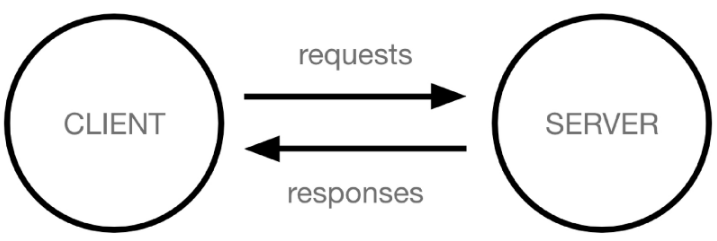

- 클라이언트 (Client)
    - 서비스를 요청하는 주체
        - 클라이언트 예시
            - 사용자의 웹 브라우저
            - 모바일 앱
- 서버 (Server)
    - 클라이언트의 요청에 응답하는 주체
        - 서버 예시
            - 웹 서버
            - 데이터베이스 서버

#### 3. 웹 페이지를 보게 되는 과정

1. 웹 브라우저(클라이언트)에서 ‘google.com’을 입력 후 엔터
2. 웹 브라우저는 인터넷에 연결된 전세계 어딘 가에 있는 구글 컴퓨터(서버)에게 ‘메인 홈페이지.html’ 파일을 달라고 요청
3. 요청을 받은 구글 컴퓨터는 데이터베이스에서 ‘메인 홈페이지.html’ 파일을 찾아 응답
4. 웹 브라우저는 전달 받은 ‘메인 홈페이지.html’ 파일을 사람이 볼 수 있도록 해석해주고, 사용자는 구글의 메인 페이지를 보게 됨

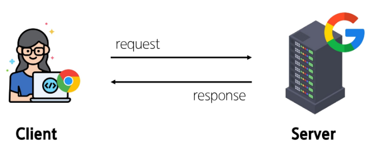

---

### Frontend & Backend

#### 1. 웹 개발에서의 Frontend와 Backend

- Frontend (프론트엔드)
    - 사용자 인터페이스(UI)를 구성하고, 사용자가 애플리케이션과 상호작용할 수 있도록 함
        - 프론트엔드 예시
            - HTML
            - CSS
            - JavaScript
            - 프론트엔드 프레임워크 등
- Backend (백엔드)
    - 서버 측에서 동작하며, 클라이언트의 요청에 대한 처리와 데이터베이스와의 상호 작용 등을 담당
        - 백엔드 예시
            - 서버 언어(Python, Java 등) 및 백엔드 프레임워크
            - 데이터베이스
            - API
            - 보안 등
            
            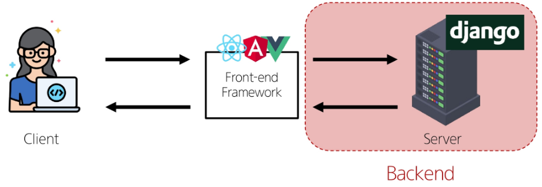
            

---

### Framework

#### 1. Web Framework

- 웹 애플리케이션을 빠르게 개발할 수 있도록 도와주는 도구
- 개발에 필요한 기본 구조, 규칙, 라이브러리 등을 제공

#### 2. Django

- Python 기반의 대표적인 웹 프레임워크
- Django의 특징
    1. 다양성
        1. Python 기반으로 웹, 모바일 앱 백엔드, API 서버 및 빅데이터 관리 등 광범위한 서비스 개발에 적합
    2. 확장성
        1. 대량의 데이터에 대해 빠르고 유연하게 확장할 수 있는 기능을 제공
    3. 보안
        1. 취약점으로부터 보호하는 보안 기능이 기본적으로 내장되어 있음
    4. 커뮤니티 지원
        1. 개발자를 위한 지원, 문서 및 업데이트를 제공하는 활성화된 커뮤니티

---

### 가상 환경

#### 1. 가상 환경 (Virtual Environment)

- 하나의 컴퓨터 안에서 또 다른 ‘독립된’ 파이썬 환경

#### 2. 가상 환경이 필요한 시나리오 1

1. 한 개발자가 2개의 프로젝트(A와 B)를 진행해야 한다
2. 프로젝트 A는 requests 패키지 버전 1을 사용해야 한다
3. 프로젝트 B는 requests 패키지 버전 2를 사용해야 한다
4. 하지만 파이썬 환경에서 패키지는 1개의 버전만 존재할 수 있다
5. A와 B 프로젝트의 다른 패키지 버전 사용을 위한 독립적인 개발 환경이 필요하다

#### 3. 가상 환경이 필요한 시나리오 2

1. 한 개발자가 2개의 프로젝트(A와 B)를 진행해야 한다
2. 프로젝트 A는 water라는 패키지를 사용해야 한다
3. 프로젝트 B는 fire라는 패키지를 사용해야 한다
4. 하지만 파이썬 환경에서 water 패키지와 fire 패키지를 함께 사용하면 충돌이 발생하기 때문에 설치할 수 없다고 한다
5. A와 B 프로젝트의 패키지 충돌을 피하기 위해 각각 독립적인 개발 환경이 필요하다

#### 4. Python 환경 구조 예시

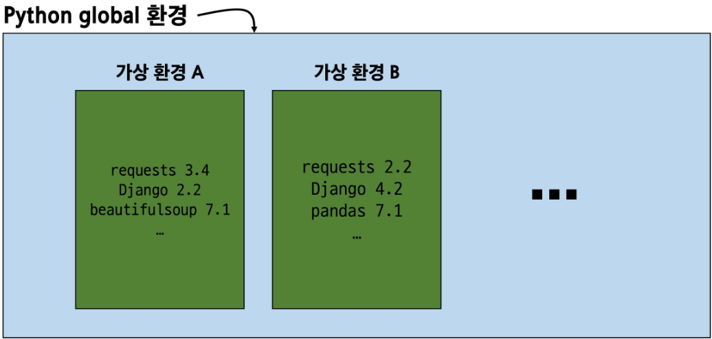

#### 5. 가상 환경 생성 및 활성화

1. 가상 환경 생성
    1. 명령어
        1. `python -m venv 가상 환경 명` 
        2. `python -m venv venv`
            1. 사실상 가상 환경 명은 venv로 고정임
    2. 현재 디렉토리에 venv라는 폴더가 생성됨
    3. venv 폴더 안에는 파이썬 실행 파일, 라이브러리 등을 담을 공간이 마련됨
    4. venv라는 이름의 가상 환경을 생성한 것이며, 임의의 이름으로 생성이 가능하나 관례적으로 venv 이름을 사용
2. 가상 환경 활성화
    1. 명령어
        1. `source venv/Scripts/activate`
    2. 활성화 후, 프롬프트 앞에 (venv)와 같이 표시된다면 성공한 것
    3. Mac / Linux에서는 명령어가 다르니 주의
        1. `source venv/bin/activate`
3. 가상 환경 종료
    1. 명령어
        1. `deactivate`
    2. 활성화한 상태에서 deactivate 명령을 입력하면, 다시 기본 Global 파이썬 환경으로 돌아옴

---

### 의존성 패키지

#### 1. 의존성 (Dependencies)

- 하나의 소프트웨어가 동작하기 위해 필요로 하는 다른 소프트웨어나 라이브러리

#### 2. 의존성 패키지

- 프로젝트가 의존하는 ‘개별 라이브러리들’을 가리키는 말
- ‘프로젝트가 실행되기 위해 꼭 필요한 패키지’ 하나하나

#### 3. 패키지 목록 확인

- 명령어
    - `pip list`
- 현재 가상 환경에 설치된 라이브러리 목록을 확인
- 갓 생성된 가상 환경은 별도의 패키지가 없어, 주로 pip, setuptools 정도만 표시됨

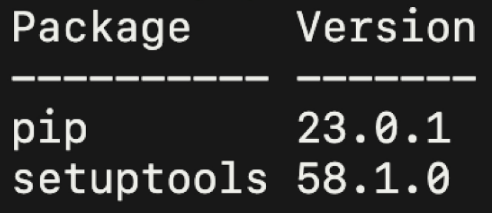

#### 5. 의존성 기록

- 명령어
    - `pip freeze > requirements.txt`
- pip freeze 명령어는 가상 환경에 설치된 모든 패키지를 버전과 함께 출력
- 이를 requirements.txt 파일에 저장하면, 나중에 동일한 환경을 재현할 때 유용
    - 다른 파일명으로도 가능하나 관례적으로 requirements를 사용
- 협업 시에도 팀원들이 똑같은 버전의 라이브러리를 설치하도록 공유 가능

#### 6. 의존성 리스트 공유 시나리오

- 만약 2명(A와 B)의 개발자가 하나의 프로젝트를 함께 개발한다고 하자
- 팀원 A가 먼저 가상 환경을 생성 후 프로젝트를 설정하고 관련된 패키지를 설치하고 개발하다가 협업을 위해 github에 프로젝트를 push한다
- 팀원 B는 해당 프로젝트를 clone 받고 실행해보려 하지만 실행되지 않는다
- 팀원 A가 이 프로젝트를 위해 어떤 패키지를 설치했고, 어떤 버전을 설치했는지 A의 가상 환경 상황을 알 수 없다
- 가상 환경에 대한 정보 즉 패키지 목록이 공유되어야 한다

#### 7. 의존성 패키지 관리가 필요한 이유

1. 패키지마다 버전이 다르고, 버전이 다른 경우 함수명이나 동작이 달라질 수 있음
2. 프로젝트가 커질수록 사용하는 패키지의 개수도 늘어나므로, 어떤 버전을 쓰고 있는지 기록 및 공유가 필수적
3. 다른 PC나 팀원들이 같은 환경을 구성할 때 의존성 리스트가 반드시 필요

#### 8. 의존성 패키지 기반 설치

- requirements.txt를 활용하여 다른 환경(혹은 팀원의 PC)에서도 동일한 패키지 버전을 설치하는 방법
- 순서
    1. 가상 환경 준비
        1. 새로운 가상 환경 생성 및 활성화
    2. requirements.txt로부터 패키지 설치
        1. 명령어
            1. `pip install -r requirements.txt`
            2. requirements.txt에 기록된 패키지와 버전을 읽어와, 같은 환경으로 설치

---

### 가상 환경 주의사항

#### 1. 가상 환경 주의사항 및 권장사항

1. 가상 환경에 “들어가고 나오는” 것이 아니라 사용할 Python 환경을 “On/Off”로 전환하는 개념
    1. 가상 환경 활성화는 현재 터미널 환경에만 영향을 끼침
    2. 새 터미널 창을 열면 다시 활성화해야 함
2. 프로젝트마다 별도의 가상 환경을 사용
3. 일반적으로 가상 환경 폴더 venv는 관련된 프로젝트와 동일한 경로에 위치시킴
4. 폴더 venv는 .gitignore 파일에 작성되어 원격 저장소에 공유되지 않음
    1. 저장소 크기를 줄여 효율적인 협업과 배포를 가능하게 하기 위함
        1. 대신 requirements.txt를 공유

#### 2. 가상 환경이 필요한 이유

1. 프로젝트마다 다른 버전의 라이브러리 사용
    1. 한 프로젝트에서는 Django 3.2를, 다른 프로젝트에서는 Django 4.1을 사용해야 할 수도 있는데 이 때, 가상 환경을 사용하면 서로 다른 버전을 동시에 설치해도 충돌 없이 각각의 프로젝트를 유지할 수 있음
2. 의존성 충돌 방지
    1. 프로젝트별로 라이브러리를 독립적으로 관리하게 해주어 여러 프로젝트가 동시에 같은 라이브러리를 쓰더라도 버전 충돌 문제를 예방
3. 팀원 간 협업
    1. 누구든지 동일한 방식으로 가상 환경을 만들어서, 똑같은 버전의 라이브러리를 설치하면 에러 가능성을 줄일 수 있음

---

### Django

#### 1. Django 프로젝트 생성 및 서버 실행

1. 프로젝트 생성
    1. 명령어
        1. `django-admin startproject firstpjt .` 
        2. firstpjt라는 이름의 django 프로젝트를 생성
        3. cli에서의 .은 현재 디렉토리를 의미
2. 서버 실행
    1. 명령어
        1. `python manage.py runserver`
        2. manage.py와 동일한 위치에서 명령어 진행
3. 서버 확인
    1. http://127.0.0.1:8000/ 접속 후 확인
    
    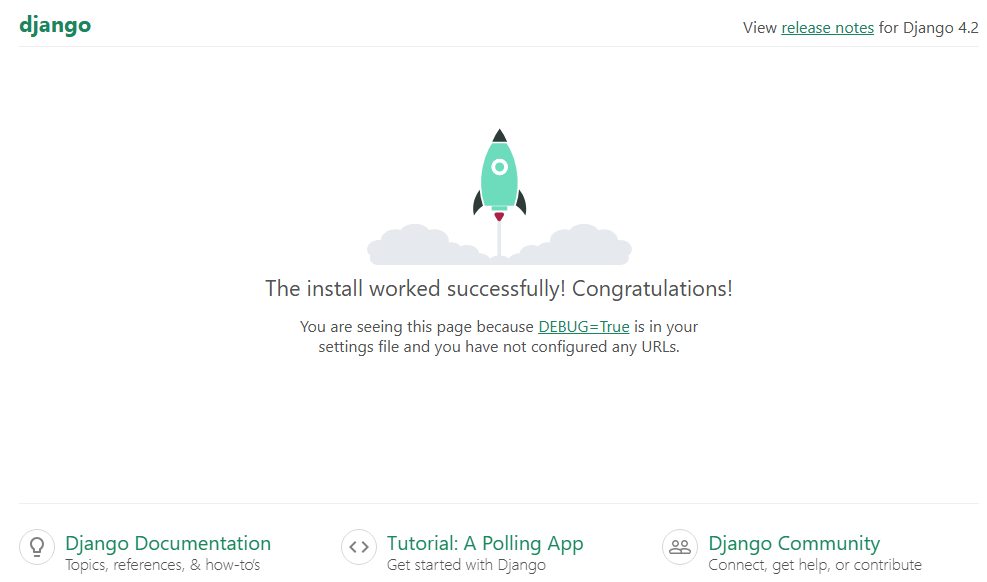
    

---

### Django Design Pattern

#### 1. 디자인 패턴 (Design Pattern)

- 소프트웨어 설계에서 발생하는 문제를 해결하기 위한 일반적인 해결책
- 공통적인 문제를 해결하는 데 쓰이는 형식화된 관행
- “애플리케이션의 구조는 이렇게 구성하자”라는 관행

#### 2. MVC 디자인 패턴 (Model, View, Controller)

- 애플리케이션을 구조화하는 대표적인 패턴
- “데이터” & “사용자 인터페이스” & “비즈니스 로직”을 분리
    - 시각적 요소와 뒤에서 실행되는 로직을 서로 영향 없이, 독립적이고 쉽게 유지 보수할 수 있는 애플리케이션을 만들기 위해

#### 3. MTV 디자인 패턴 (Model, Template, View)

- Django에서 애플리케이션을 구조화하는 패턴
- 기존 MVC 패턴과 동일하나 단순히 명칭을 다르게 정의한 것
- 단순한 명칭 변경
    - View → Template
    - Controller → View

---

### 프로젝트와 앱

#### 1. 프로젝트와 앱

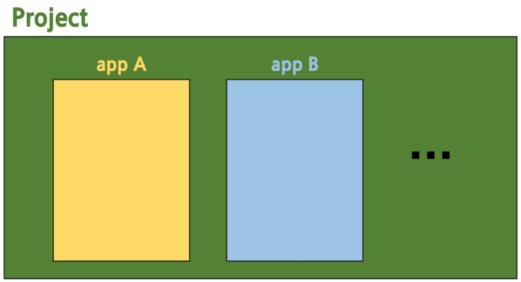

#### 2. Django Project

- 애플리케이션의 집합
- DB 설정, URL 연결, 전체 앱 설정 등을 처리

#### 3. Django Application

- 독립적으로 작동하는 기능 단위 모듈
- 각자 특정한 기능을 담당하며 다른 앱들과 함께 하나의 프로젝트를 구성

#### 4. 앱을 사용하기 위한 순서

1. 앱 생성
    1. 명령어
        1. `python manage.py startapp articles` 
    2. 앱의 이름은 ‘복수형’으로 지정하는 것을 권장
2. 앱 등록
    1. 반드시 앱을 생성한 후에 등록해야 함
    2. 등록 후 생성은 불가능

#### 5. 프로젝트 및 앱 구조

- 프로젝트 구조
    - settings.py
        - 프로젝트의 모든 설정을 관리
    - urls.py
        - 요청 들어오는 URL에 따라 이에 해당하는 적절한 views를 연결
    - __init__.py
        - 해당 폴더를 패키지로 인식하도록 설정하는 파일
    - asgi.py
        - 비동기식 웹 서버와의 연결 관련 설정
        
        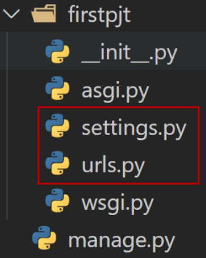
        

- 앱 구조
    - admin.py
        - 관리자용 페이지 설정
    - models.py
        - DB와 관련된 Model을 정의
        - MTV 패턴의 M
    - views.py
        - HTTP 요청을 처리하고 해당 요청에 대한 응답을 반환
            - url, model, template과 연계
        - MTV 패턴의 V
    - apps.py
        - 앱의 정보가 작성된 곳
    - tests.py
        - 프로젝트 테스트 코드를 작성하는 곳

---

### 요청과 응답

#### 1. Django와 요청 & 응답

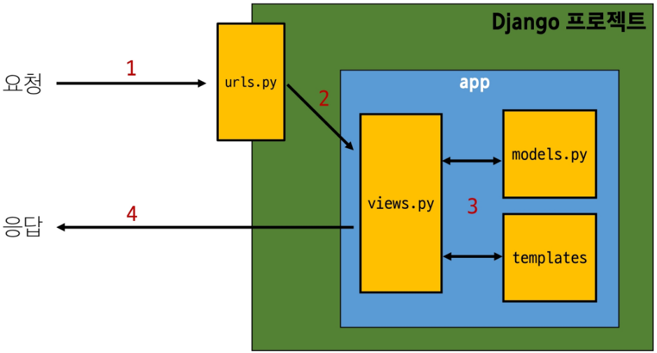

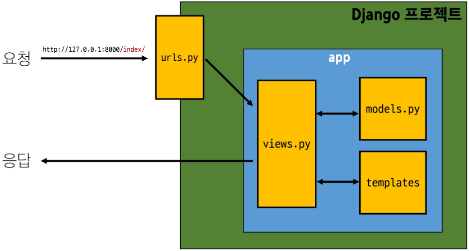

#### 2. URLs

- http://127.0.0.1:8000/index/로 요청이 왔을 때, request 객체를 views 모듈의 index view 함수에게 전달하며 호출

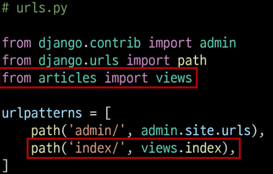

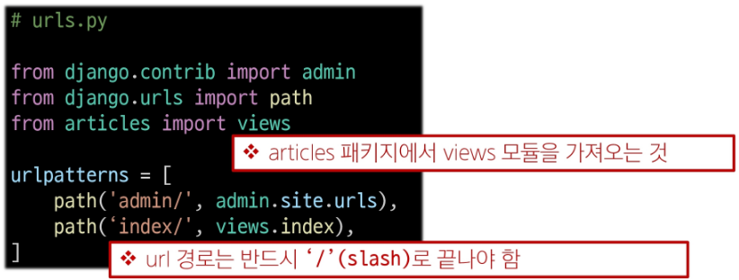

#### 3. View

- view 함수가 정의되는 곳
- 특정 경로에 있는 template과 request 객체를 결합해 응답 객체를 반환
- 모든 view 함수는 첫 번째 인자로 요청 객체를 필수적으로 받음
- 매개변수 이름이 request가 아니어도 되지만 그렇게 작성하지 않음

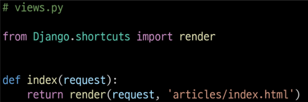

#### 4. Template

1. articles 앱 폴더 안에 templates 폴더 생성
    1. 폴더 명은 반드시 templates여야 하며, 개발자가 직접 생성해야 함
2. templates 폴더 안에 articles 폴더 생성
3. articles 폴더 안에 템플릿 파일 생성

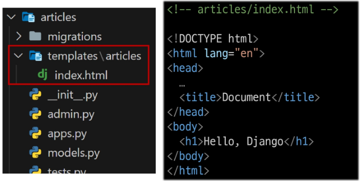

#### 5. Django에서 template을 인식하는 경로 규칙

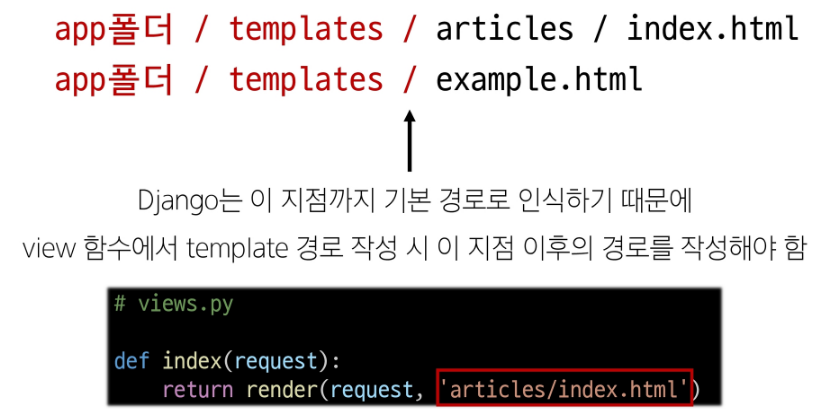

#### 6. 요청과 응답 과정 정리

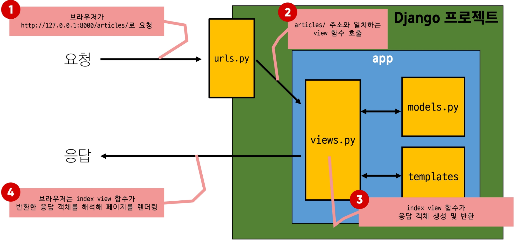

---

### 가상 환경 생성 루틴

#### 1. Django 프로젝트 생성 전 루틴

1. 가상 환경 생성
2. 가상 환경 활성화
3. Django 설치
4. 패키지 목록 파일 생성
    1. 패키지 설치 시마다 진행
    
    ```python
    1. 가상 환경(venv) 생성
    $ python -m venv venv
    
    2. 가상 환경 활성화
    $ source venv/Scripts/activate
    
    3. Django 설치
    $ pip install django
    
    4. 패키지 목록 파일 생성
    $ pip freeze > requirements.txt
    ```
    

#### 2. Django 프로젝트 생성 루틴 정리 + git

1. 가상 환경 생성
2. 가상 환경 활성화
3. Django 설치
4. 패키지 목록 파일 생성 (패키지 설치 시마다 진행)
5. .gitignore 파일 생성 (첫 add 전)
6. git 저장소 생성 (git init)
7. Django 프로젝트 생성

---

### 참고

#### 1. LTS (Long-Term Support)

- 프레임워크나 라이브러리 등의 소프트웨어에서 장기간 지원되는 안정적인 버전을 의미할 때 사용
- 기업이나 대규모 프로젝트에서는 소프트웨어 업그레이드에 많은 비용과 시간이 필요하기 때문에 안정적이고 장기간 지원되는 버전이 필요

#### 2. Python 패키지 설치법

- Python 패키지 설치 시 버전 지정 방법

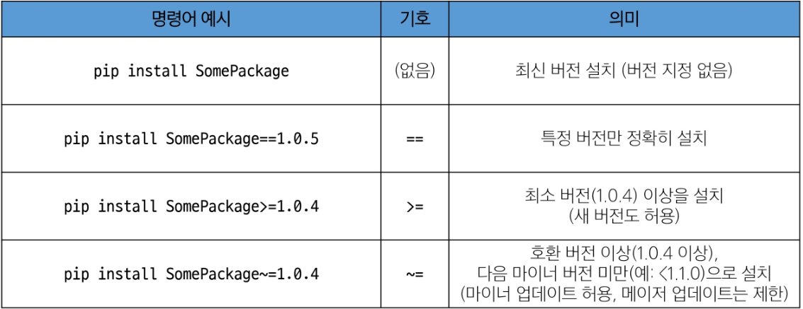

#### 3. render 함수

- 주어진 템플릿을 주어진 컨텍스트 데이터와 결합하고 렌더링된 텍스트와 함께 HttpResponse 응답 객체를 반환하는 함수
1. request
    1. 응답을 생성하는 데 사용되는 요청 객체
2. template_name
    1. 템플릿 이름의 경로
3. context
    1. 템플릿에서 사용할 데이터 (딕셔너리 타입으로 작성)
    
    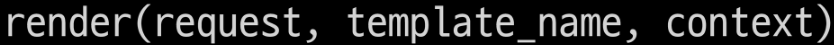
    

#### 4. MTV 디자인 패턴 정리

- Model
    - 데이터와 관련된 로직을 관리
    - 응용 프로그램의 데이터 구조를 정의하고, 데이터베이스의 기록을 관리
- Template
    - 레이아웃과 화면을 처리
    - 화면 상의 사용자 인터페이스 구조와 레이아웃을 정의
- View
    - Model & Template과 관련한 로직을 처리해서 응답을 반환
    - 클라이언트의 요청에 대해 처리를 분기하는 역할
    - 예시
        - 데이터가 필요하다면 model에 접근해서 데이터를 가져오고, 가져온 데이터를 template로 보내 화면을 구성하고, 구성된 화면을 응답으로 만들어 클라이언트에게 반환
        
        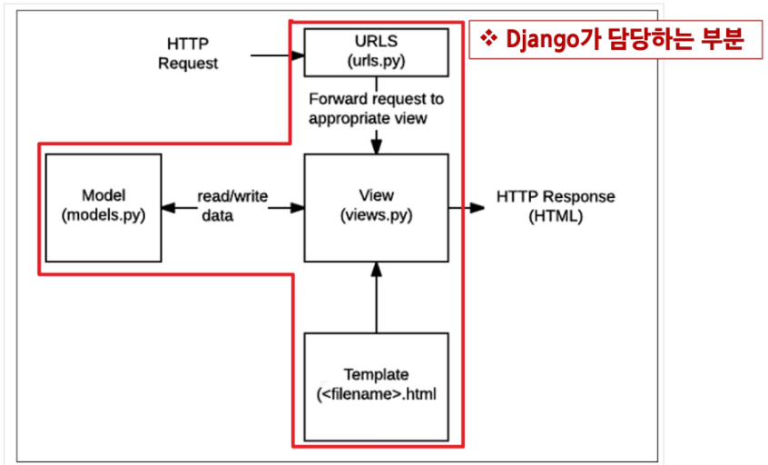
        

#### 5. Trailing Comma

- Trailing Comma 정의
    - “후행 쉼표”
    - 리스트, 딕셔너리, 튜플 등의 자료 구조에서 마지막 요소 뒤에 쉼표를 추가하는 것
- 문법적으로 아무런 영향을 주지 않음
- 일반적으로 선택 사항 (단일 요소 튜플을 만들 때는 예외)

#### 6. Trailing Comma 사용 이유

- 새로운 요소를 추가하거나 순서를 변경할 때 편리
- 값의 목록, 인자, 또는 import 항목들이 시간이 지남에 따라 확장될 것으로 예상되는 경우에 주로 사용
- 여러 줄에 걸쳐 작성된 데이터 구조에서 유용하며, 코드의 가독성과 유지보수성을 향상시키는 데 도움
- 일반적인 패턴은 각 값(등)을 별도의 줄에 배치하고, 항상 후행 쉼표를 추가한 뒤, 닫는 괄호/대괄호/중괄호를 다음 줄에 배치하는 것
- 닫는 구분 기호와 같은 줄에 후행 쉼표를 두는 것은 권장하지 않음

#### 7. 현재까지 Django의 규칙 정리

1. urls.py에서 각 url 문자열 경로는 반드시 ‘/’로 끝남
2. [views.py](http://views.py)에서 모든 view 함수는 첫번째 인자로 요청 객체를 받음
    1. 매개변수 이름은 반드시 request로 지정하기
3. Django는 특정 경로에 있는 template 파일만 읽어올 수 있음
    1. 특정 경로: app 폴더/template/

#### 8. 프레임워크의 규칙

- 프레임워크를 사용할 때는 일정한 규칙을 따라야 하며 이는 저마다의 설계 철학이나 목표를 반영하고 있음
    - 일관성 유지, 보안 강화, 유지보수성 향상, 최적화 등과 같은 이유
- 프레임워크는 개발자에게 도움을 주는 도구와 환경을 제공하기 위해 규칙을 정해놓은 것이며, 우리는 이를 잘 활용하여 특정 기능을 구현하는 방법을 표준화하고 개발 프로세스를 단순화할 수 있도록 해야 함
