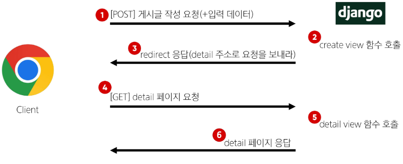
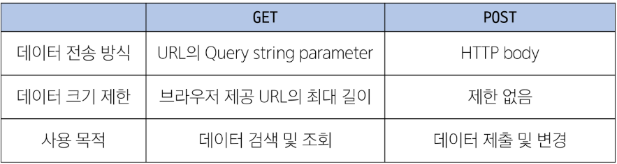

## Django 05 (2025.03.28)

### HTTP request methods

#### 1. HTTP

- 네트워크 상에서 데이터(리소스)를 주고 받기 위한 약속

#### 2. HTTP request methods

- 데이터에 대해 수행을 원하는 작업(행동)을 나타내는 것
    - 서버에게 원하는 작업의 종류를 알려주는 역할
- 클라이언트가 웹 서버에 특정 동작을 요청하기 위해 사용하는 표준 명령어
- 대표 메서드
    - GET
    - POST

#### 3. GET method

- 서버로부터 데이터를 요청하고 받아오는 데(조회) 사용
- ‘GET’ method 특징
    1. 데이터 전송
        1. URL의 쿼리 문자열(Query String)을 통해 데이터를 전송
        2. 예시
            1. http://127.0.0.1:8000/articles/create?title=제목&content=내용
    2. 데이터 제한
        1. URL 길이에 제한이 있어 대량의 데이터 전송에는 적합하지 않음
    3. 브라우저 히스토리
        1. 요청 URL이 브라우저 히스토리에 남음
    4. 캐싱
        1. 브라우저는 GET 요청의 응답을 로컬에 저장할 수 있음
        2. 동일한 URL로 다시 요청할 때, 서버에 접속하지 않고 저장된 결과를 사용
        3. 페이지 로딩 시간을 크게 단축
- ‘GET’ method 사용 예시
    1. 검색 쿼리 전송
    2. 웹 페이지 요청
    3. API에서 데이터 조회

#### 4. POST method

- 서버에 데이터를 제출하여 리소스를 변경(생성, 수정, 삭제)하는 데 사용
- ‘POST’ method 특징
    1. 데이터 전송
        1. HTTP Body를 통해 데이터를 전송
    2. 데이터 제한
        1. GET에 비해 더 많은 양의 데이터를 전송할 수 있음
    3. 브라우저 히스토리
        1. POST 요청은 브라우저 히스토리에 남지 않음
    4. 캐싱
        1. POST 요청은 기본적으로 캐시할 수 없음
        2. POST 요청이 일반적으로 서버와 상태를 변경하는 작업을 수행하기 때문
- ‘POST’ method 사용 예시
    1. 로그인 정보 제출
    2. 파일 업로드
    3. 새 데이터 생성 (예: 새 게시글 작성)
    4. API에서 데이터 변경 요청

#### 5. ‘GET’ & ‘POST’ method 정리

- GET과 POST는 각각의 특성에 맞게 적절히 사용해야 함
- GET
    - 데이터 조회
- POST
    - 데이터 생성이나 수정에 주로 사용

---

### HTTP response status code

#### 1. HTTP response status code

- 서버가 클라이언트의 요청에 대한 처리 결과를 나타내는 3자리 숫자

#### 2. HTTP response status code의 역할

1. 클라이언트에게 요청 처리 결과를 명확히 전달
2. 문제 발생 시 디버깅에 도움
3. 웹 애플리케이션의 동작을 제어하는 데 사용

#### 3. 403 Forbidden

- 서버에 요청이 전달되었지만, 권한 때문에 거절되었다는 것을 의미

---

### CSRF

#### 1. CSRF (Cross-Site-Request-Forgery)

- “사이트 간 요청 위조”
- 사용자가 자신의 의지와 무관하게 공격자가 의도한 행동을 하여 특정 웹 페이지를 보안에 취약하게 하거나 수정, 삭제 등의 작업을 하게 만드는 공격 방법

#### 2. 요청 시 CSRF Token을 함께 보내야 하는 이유

- Django 서버는 해당 요청이 DB에 데이터를 하나 생성하는(DB에 영향을 주는) 요청에 대해 “Django가 직접 제공한 페이지에서 데이터를 작성하고 있는 것인지”에 대한 확인 수단이 필요한 것
- 겉모습이 똑같은 위조 사이트나 정상적이지 않은 요청에 대한 방어 수단
- 기존
    - 요청 데이터 → 게시글 작성
- 변경
    - 요청 데이터 + 인증 토큰 → 게시글 작성

#### 3. POST일 때 Token을 확인하는 이유

- POST는 단순 조회를 위한 GET과 달리 특정 리소스에 변경(생성, 수정, 삭제)을 요구하는 의미와 기술적인 부분을 가지고 있기 때문
- DB에 조작을 가하는 요청은 반드시 인증 수단이 필요
- 데이터베이스에 대한 변경사항을 만드는 요청이기 때문에 토큰을 사용해 최소한의 신원 확인을 하는 것

---

### redirect

#### 1. redirect()

- 클라이언트가 인자에 작성된 주소로 다시 요청을 보내도록 하는 함수

#### 2. redirect 동작 원리

1. redirect 응답을 받은 클라이언트는 detail url로 다시 요청을 보내게 됨
2. 결과적으로 detail view 함수가 호출되어 detail view 함수의 반환 결과인 detail 페이지를 응답 받게 되는 것
3. 결국 사용자는 게시글 작성 후 작성된 게시글의 detail 페이지로 이동하는 것으로 느끼게 됨

---

### 참고

#### 1. GET과 POST

#### 2. GET 요청이 필요한 경우

1. 캐싱 및 성능
    1. GET 요청은 캐시(Cache)될 수 있고, 이전에 요청한 정보를 새로 요청하지 않고, 사용할 수 있음
    2. 특히, 동일한 검색 결과를 여러 번 요청하는 경우 GET 요청은 캐시를 활용하여 더 빠르게 응답할 수 있음
2. 가시성 및 공유
    1. GET 요청은 URL에 데이터가 노출되어 있기 때문에 사용자가 해당 URL을 북마크하거나 다른 사람과 공유하기 용이
3. RESTful API 설계
    1. HTTP 메서드의 의미에 따라 동작하도록 디자인된 API의 일관성을 유지할 수 있음

#### 3. 캐시 (Cache)

- 데이터나 정보를 임시로 저장해두는 메모리나 디스크 공간
- 이전에 접근한 데이터를 빠르게 검색하고 접근할 수 있도록 함