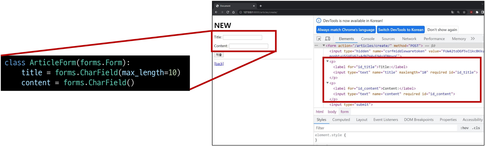
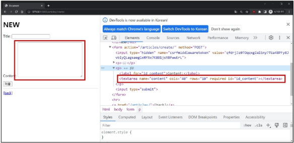
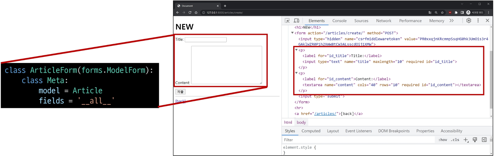
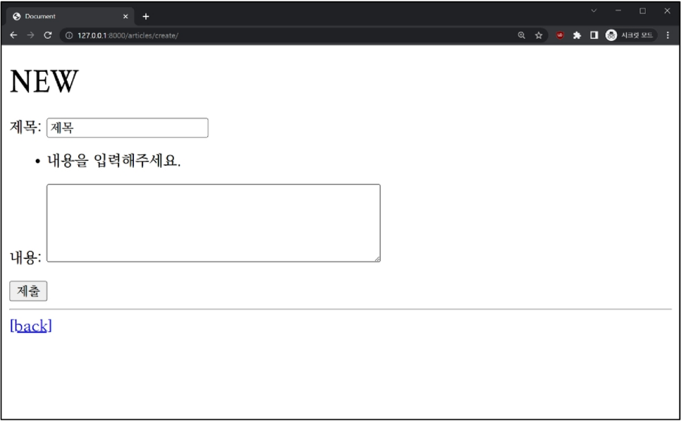

## Django 06 (2025.03.31)

### Django Form

#### 1. HTML ‘form’

- 사용자로부터 데이터를 제출 받기 위해 활용한 방법
- 비정상적 혹은 악의적인 요청을 필터링할 수 없음
- 유효한 데이터인지에 대한 확인이 필요

#### 2. 유효성 검사

- 수집한 데이터가 정확하고 유효한지 확인하는 과정

#### 3. 유효성 검사 구현의 어려움

- 유효성 검사를 구현하기 위해서는 입력 값, 형식, 중복, 범위, 보안 등 많은 것들을 고려해야 함
- 이런 과정과 기능을 직접 개발하는 것이 아닌 Django가 제공하는 Form을 사용

---

### Form Class

#### 1. Django Form

- 사용자 입력 데이터를 수집하고, 처리 및 유효성 검사를 수행하기 위한 도구
- 유효성 검사를 단순화하고 자동화할 수 있는 기능을 제공

#### 2. Form class를 적용한 new 로직

- Form Class 정의

```python
# articles/forms.py
from django import forms

class ArticleForm(forms.Form):
    title = forms.CharField(max_length=10)
    content = forms.CharField()
```

- view 함수 new 변경

```python
# articles/views.py
# view 함수 new 변경
from .forms import ArticleForm

def new(request):
    form = ArticleForm()
    context = {
        "form": form,
    }
    return render(request, "articles/new.html", context)
```

- new 페이지에서 form 인스턴스 출력
- form.as_p
    - label, input 쌍을 특정 HTML 태그로 감싸는 옵션
    
    ```html
    <!DOCTYPE html>
    <html lang="en">
    <head>
      <meta charset="UTF-8">
      <meta name="viewport" content="width=device-width, initial-scale=1.0">
      <title>Document</title>
    </head>
    <body>
       articles/new.html 
      <h1>NEW</h1>
      <form action="" method="POST">
        
        {{form.as_p}}
        <input type="submit">
      </form>
      <hr>
      <a href="">[back]</a>
    </body>
    </html>
    ```
    

- Form class가 기존의 Form 태그 내의 요소들을 대체



---

### Widgets

#### 1. Widgets

- HTML ‘input’ element의 표현을 담당
- Widget은 단순히 input 요소의 속성 및 출력되는 부분을 변경하는 것

```python
# articles/forms.py
from django import forms

class ArticleForm(forms.Form):
    title = forms.CharField(max_length=10)
    content = forms.CharField(widget=forms.Textarea)
```



---

### Django ModelForm

#### 1. Form

- 사용자 입력 데이터를 DB에 저장하지 않을 때
    - 예시
        - 검색
        - 로그인

#### 2. ModelForm

- Model과 연결된 Form을 자동으로 생성해주는 기능을 제공
    - Form + Model
- 사용자 입력 데이터를 DB에 저장해야 할 때
- 예시
    - 게시글 작성
    - 회원가입

#### 3. ModelForm class 정의

- 기존 ArticleForm 클래스 수정

```python
# articles/forms.py
from django import forms
from .models import Article

class ArticleForm(forms.ModelForm):
    class Meta:
        model = Article
        fields = "__all__"
```

- ModelForm class가 기존 Form 태그 내의 요소들을 대체함



---

### Meta class

#### 1. Meta class

- ModelForm의 정보를 작성하는 곳

#### 2. ‘fields’ 및 ‘exclude’ 속성

- exclude 속성을 사용하여 모델에서 포함하지 않을 필드를 지정할 수도 있음

```python
# articles/forms.py
class ArticleForm(forms.ModelForm):
    class Meta:
        model = Article
        fields = ("title",)
```

```python
# articles/forms.py
class ArticleForm(forms.ModelForm):
    class Meta:
        model = Article
        exclude = ("title",)
```

#### 3. Meta class 주의사항

- Django에서 ModelForm에 대한 추가 정보나 속성을 작성하는 클래스 구조를 Meta 클래스로 작성했을 뿐이며, 파이썬의 inner class와 같은 문법적인 관점으로 접근하지 말 것

---

### ModelForm 적용

#### 1. is_valid()

- 여러 유효성 검사를 실행하고, 데이터가 유효한지 여부를 Boolean으로 반환
- 별도로 명시하지 않았지만, 모델 필드에는 기본적으로 빈 값은 허용하지 않는 제약조건이 설정되어 있음
- 빈 값은 is_valid()에 의해 False로 평가되고, form 객체에는 그에 맞는 에러 메세지가 포함되어 다음 코드로 진행됨

#### 2. save()

- 데이터베이스 객체를 만들고 저장하는 ModelForm의 인스턴스 메서드

#### 3. save() 메서드가 생성과 수정을 구분하는 법

- 키워드 인자 instance 여부를 통해 생성할 지, 수정할 지를 결정

```python
# CREATE
form = ArticleForm(request.POST)
form.save()

# UPDATE
form = ArticleForm(request.POST, instance=article)
form.save()
```

#### 4. Django Form 정리

- “사용자로부터 데이터를 수집하고, 처리하기 위한 강력하고 유연한 도구”
- HTML form의 생성, 데이터 유효성 검사 및 처리를 쉽게 할 수 있도록 도움

#### 5. ModelForm 적용한 코드

- create & new 메서드 및 edit & update 메서드 통합
    - 요청에 따른 다른 동작
    
    ```python
    # articles/views.py
    def create(request):
        # 1. 요청 메서드가 POST라면
        if request.method == "POST":
            # 1-1. 사용자로부터 받은 데이터를 인자로 form 인스턴스 생성
            form = ArticleForm(request.POST)
            # 1-2. 유효성 검사
            if form.is_valid():
                # 1-3. 유효성 검사에 통과한다면 저장
                article = form.save()
                # 1-4. 상세 페이지로 리다이렉트
                return redirect("articles:detail", article.pk)
        # 2. 요청 메서드가 POST가 아니라면 (GET, PUT, DELETE ...)
        else:
            # 2-1. ArticleForm 인스턴스를 생성
            form = ArticleForm()
        # case 1: 1-2에서 내려왔을 때: 에러 메세지를 담은 form
        # case 2: 2-1이 끝나고 내려왔을 때: 빈 form
        context = {
            "form": form,
        }
        return render(request, "articles/create.html", context)
    ```
    
    ```python
    # articles/views.py
    def update(request, pk):
        # 어떤 글을 수정하는지 먼저 조회
        article = Article.objects.get(pk=pk)
        if request.method == "POST":
            # 사용자가 새로 입력한 데이터를 받아서 form 인스턴스 생성
            form = ArticleForm(request.POST, instance=article)
            if form.is_valid():
                form.save()
                return redirect('articles:detail', article.pk)
        else:
            form = ArticleForm(instance=article)
        context = {
            "article": article,
            "form": form,
        }
        return render(request, "articles/update.html", context)
    ```
    
    ```python
    # articles/urls.py
    from django.urls import path
    from . import views
    
    app_name = 'articles'
    urlpatterns = [
        path('', views.index, name='index'),
        path('<int:pk>/', views.detail, name='detail'),
        path('create/', views.crete, name='create'),
        path('<int:pk>/delete/', views.delete, name='delete'),
        path('<int:pk>/update/', views.update, name='update'),
    ]
    ```
    
    ```html
     articles/create.html 
    <!DOCTYPE html>
    <html lang="en">
    <head>
      <meta charset="UTF-8">
      <meta name="viewport" content="width=device-width, initial-scale=1.0">
      <title>Document</title>
    </head>
    <body>
       articles/new.html 
      <h1>CREATE</h1>
      <form action="" method="POST">
        
        {{form.as_p}}
        <input type="submit">
      </form>
      <hr>
      <a href="">[back]</a>
    </body>
    </html>
    ```
    
    ```html
     articles/update.html 
    <!DOCTYPE html>
    <html lang="en">
    <head>
      <meta charset="UTF-8">
      <meta name="viewport" content="width=device-width, initial-scale=1.0">
      <title>Document</title>
    </head>
    <body>
      <h1>UPDATE</h1>
      <form action="" method="POST">
        
        <div>
          <label for="title">Title: </label>
          <input type="text" name="title" id="title" value="{{ article.title }}">
        </div>
        <div>
          <label for="content">Content: </label>
          <textarea name="content" id="content">{{ article.content }}</textarea>
        </div>
        <input type="submit">
      </form>
      <hr>
      <a href="">[back]</a>
    </body>
    </html>
    ```
    
    ```html
     articles/detail.html 
    <!DOCTYPE html>
    <html lang="en">
    <head>
      <meta charset="UTF-8">
      <meta name="viewport" content="width=device-width, initial-scale=1.0">
      <title>Document</title>
    </head>
    <body>
      <h1>DETAIL</h1>
      <h2>{{ article.pk }} 번째 글</h2>
      <hr>
      <p>제목 : {{ article.title }}</p>
      <p>내용 : {{ article.content }}</p>
      <p>작성일 : {{ article.created_at }}</p>
      <p>수정일 : {{ article.updated_at }}</p>
      <hr>
      <a href="">[EDIT]</a>
      <form action="" method="POST">
        
        <input type="submit" value="삭제">
      </form>
      <a href="">[back]</a>
    </body>
    </html>
    ```
    

---

### 참고

#### 1. ModelForm의 키워드 인자 구성

- data와 instance 살펴보기
    - date는 첫 번째에 위치한 키워드 인자이기 때문에 생략 가능
    - instance는 9번째에 위치한 키워드 인자이기 때문에 생략할 수 없음
    
    ```python
    # ModelForm의 상위 클래스인 BaseModelForm의 생성자 함수 모습
    class BaseModelForm(BaseForm):
        def __init__(self, data=None, files=None, auto_id='id_%s', prefix=None,
                     initial=None, error_class=ErrorList, label_suffix=None,
                     empty_permitted=False, instance=None, use_required_attribute=None,
                     renderer=None):
    ```
    
    ```python
    # articles/views.py
    form = ArticleForm(request.POST, instance=article)
    ```
    

#### 2. Widgets 응용

```python
# articles/forms.py
class ArticleForm(forms.ModelForm):
    title = forms.CharField(
        label="제목",
        widget=forms.TextInput(
            attrs={
                "class": "my-title",
                "placeholder": "Enter the title",
            }
        ),
    )
    class Meta:
        model = Article
        fields = "__all__"
```

- 예시

```python
# articles/form.py
class ArticleForm(forms.ModelForm):
    title = forms.CharField(
        label="제목",
        widget=forms.TextInput(
            attrs={
                "class": "my-title",
                "placeholder": "Enter the title",
                "maxlength": 10,
            }
        ),
    )
    content = forms.CharField(
        label="내용",
        widget=forms.Textarea(
            attrs={
                "class": "my-content",
                "placeholder": "Enter the content",
                "rows": 5,
                "cols": 50,
            }
        ),
        error_messages={"required": "내용을 입력해주세요."},
    )
    ...
```



#### 3. 필드를 수동으로 렌더링

```html
{{form.non_field_errors}}
<form action="..." method="POST">
  
  <div>
    {{form.title.errors}}
    <label for="{{form.title.id_for_label}}">Title: </label>
    {{form.title}}
  </div>
  <div>
    {{form.content.errors}}
    <label for="{{form.content.id_for_label}}">Content: </label>
    {{form.content}}
  </div>
  <input type="submit" value="제출">
</form>
```